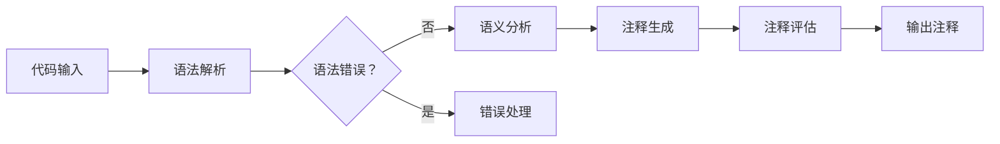
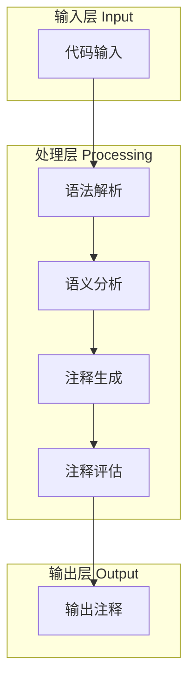
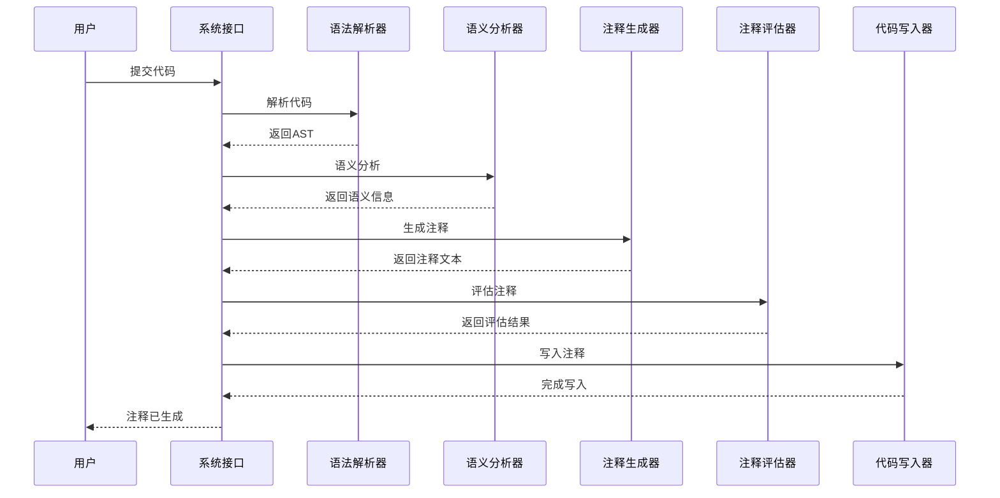

                 

，首先，我们确定文章的结构和内容范围。本文将分为四个主要部分：

1. **背景介绍与核心概念**：介绍智能代码注释优化的问题背景、核心概念及其重要性。
2. **算法原理与系统设计**：详细讲解智能代码注释优化的算法原理，包括大模型和智能注释优化的关系，以及如何实现优化。
3. **项目实战**：通过实际项目展示智能代码注释优化的应用，包括环境安装、核心代码实现和案例分析。
4. **最佳实践与拓展**：总结最佳实践经验，并提供相关的注意事项和拓展阅读。

接下来，我们将为每个部分设计详细的章节结构，并逐步填充内容。

### 第一部分：背景介绍与核心概念

**第1章：问题背景与核心概念**

- **1.1.1 问题背景**：
  随着软件工程的快速发展，代码库的规模不断扩大，代码的可维护性和可理解性变得愈发重要。传统的代码注释优化方法往往效率低下，无法满足日益复杂的开发需求。因此，利用人工智能技术，尤其是大模型，实现智能代码注释优化成为解决这一问题的有效途径。

- **1.1.2 核心概念介绍**：
  - **大模型**：指具有大规模参数和强大计算能力的人工神经网络模型，能够对大量数据进行分析和学习。
  - **智能代码注释优化**：利用大模型对代码进行自动分析，生成高质量的代码注释。

- **1.1.3 概念结构与要素组成**：
  - **概念结构**：大模型和智能代码注释优化的关系可以看作是“工具 - 应用”结构，大模型作为工具，用于实现智能代码注释优化这一应用。
  - **要素组成**：智能代码注释优化涉及代码分析、语义理解、注释生成等多个要素。

### 第二部分：算法原理与系统设计

**第2章：大模型基本原理**

- **2.1 大模型的定义**：
  大模型是一种基于深度学习的人工神经网络模型，其具有大规模参数和强大的计算能力，能够对复杂的数据进行高效的学习和分析。

- **2.2 大模型的特点**：
  - **规模大**：拥有数十亿甚至千亿个参数。
  - **计算能力强**：能够处理高维数据和复杂数学问题。
  - **自主学习**：通过大量数据自动调整模型参数，提高性能。

- **2.3 大模型的发展历程**：
  大模型的发展经历了从简单的神经网络到深度学习，再到当今的大型预训练模型的过程。

**第3章：智能代码注释优化原理**

- **3.1 智能代码注释优化的定义**：
  智能代码注释优化是指利用大模型对代码进行自动分析，提取关键信息，并生成具有高度可读性的注释。

- **3.2 智能代码注释优化的重要性**：
  高质量的代码注释能够提高代码的可维护性和可理解性，减少开发成本。

- **3.3 智能代码注释优化的方法**：
  - **代码分析**：通过大模型对代码进行语法和语义分析，提取关键信息。
  - **注释生成**：利用提取的信息，使用自然语言生成工具生成注释。

### 第三部分：项目实战

**第4章：算法原理讲解**

- **4.1 算法流程图**：
  使用Mermaid绘制智能代码注释优化的算法流程图。

- **4.2 算法原理详解**：
  使用Python代码和LaTeX数学公式详细阐述算法原理。

- **4.3 Python代码实现**：
  展示智能代码注释优化的Python代码实现。

**第5章：数学模型与公式**

- **5.1 数学模型概述**：
  介绍用于智能代码注释优化的数学模型。

- **5.2 关键公式**：
  列出算法中的关键数学公式。

- **5.3 公式讲解与举例**：
  对关键公式进行详细讲解，并提供实际应用示例。

### 第四部分：最佳实践与拓展

**第6章：系统分析与架构设计**

- **6.1 系统功能设计**：
  描述智能代码注释优化系统的功能模块。

- **6.2 系统架构设计**：
  展示系统的整体架构。

- **6.3 系统接口设计**：
  讲解系统的接口设计和交互方式。

**第7章：项目实战**

- **7.1 项目环境安装与配置**：
  介绍智能代码注释优化项目的环境安装和配置步骤。

- **7.2 系统核心实现与代码解读**：
  展示系统的核心实现代码，并进行详细解读。

- **7.3 项目小结与经验分享**：
  总结项目经验，提供最佳实践建议。

**第8章：注意事项与拓展阅读**

- **8.1 常见问题与解决方案**：
  针对智能代码注释优化过程中可能遇到的问题提供解决方案。

- **8.2 技术发展趋势**：
  分析智能代码注释优化领域的发展趋势。

- **8.3 拓展阅读推荐**：
  推荐相关领域的拓展阅读材料。

以上是文章的目录大纲，接下来我们将逐步填充每个章节的具体内容。### 第1章：问题背景与核心概念

在当今的软件工程领域，代码质量和可维护性成为了衡量软件开发效率的重要标准。然而，随着代码规模的不断扩大和复杂性程度的提高，代码注释的质量也变得愈发重要。高质量、准确的代码注释能够提高代码的可读性和可维护性，从而降低维护成本和开发难度。然而，传统的代码注释优化方法往往依赖于开发者手工编写注释，这不仅效率低下，而且容易出现错误，无法满足日益复杂的开发需求。

为了解决这一问题，智能代码注释优化应运而生。智能代码注释优化利用人工智能技术，尤其是大模型，对代码进行自动分析，提取关键信息，并生成高质量的注释。这种技术不仅能够显著提高注释质量，还能够节省开发者的时间和精力，提高开发效率。

### 核心概念介绍

**大模型**

大模型是一种基于深度学习的人工神经网络模型，其具有大规模参数和强大的计算能力，能够对复杂的数据进行高效的学习和分析。大模型通常包含数十亿甚至千亿个参数，能够处理高维数据和复杂数学问题。大模型通过自主学习大量数据，不断调整模型参数，从而提高性能。大模型在图像识别、自然语言处理、推荐系统等多个领域都取得了显著成果。

**智能代码注释优化**

智能代码注释优化是指利用大模型对代码进行自动分析，提取关键信息，并生成高质量的注释。智能代码注释优化通常包括以下几个步骤：

1. **代码分析**：使用大模型对代码进行语法和语义分析，提取关键信息，如函数名、变量名、方法调用等。
2. **语义理解**：利用提取的信息，对代码的意图和功能进行理解，从而生成具有高度可读性的注释。
3. **注释生成**：使用自然语言生成工具，将理解的结果转化为注释文本，输出到代码文件中。

### 概念结构与要素组成

**概念结构**

智能代码注释优化可以看作是“工具 - 应用”结构，大模型作为工具，用于实现智能代码注释优化这一应用。大模型通过对代码进行自动分析，提取关键信息，并生成注释，从而实现了代码注释的优化。

**要素组成**

智能代码注释优化涉及多个要素，主要包括：

1. **代码分析**：对代码进行语法和语义分析，提取关键信息。
2. **语义理解**：对提取的信息进行理解，确定注释的意图和内容。
3. **注释生成**：利用自然语言生成工具，将理解的结果转化为注释文本。
4. **注释质量评估**：对生成的注释进行评估，确保注释的质量和准确性。

### 小结

本章介绍了智能代码注释优化的问题背景、核心概念及其重要性。通过介绍大模型和智能代码注释优化的概念，我们了解了智能代码注释优化是如何利用人工智能技术，特别是大模型，对代码进行自动分析，提取关键信息，并生成高质量注释的。接下来，我们将深入探讨大模型的基本原理和智能代码注释优化的具体实现方法。### 第2章：大模型基本原理

大模型是智能代码注释优化的核心工具，其强大的计算能力和自我学习能力使其在代码注释优化中发挥着关键作用。在本章中，我们将详细探讨大模型的定义、特点以及其发展历程。

#### 2.1 大模型的定义

大模型（Large Model）是指具有大规模参数和强大计算能力的人工神经网络模型。这些模型通常包含数十亿甚至千亿个参数，能够处理高维数据和复杂数学问题。大模型的核心在于其自我学习能力，通过从大量数据中学习，能够不断优化自身的性能和预测能力。

#### 2.2 大模型的特点

1. **规模大**：大模型通常具有数十亿甚至千亿个参数，这使得它们能够处理更复杂的数据和问题。

2. **计算能力强**：大模型具有强大的计算能力，能够高效地进行大量的矩阵运算和梯度下降优化，这使得它们能够在复杂问题上取得更好的性能。

3. **自主学习**：大模型通过自我学习，能够从大量数据中提取特征，自动调整模型参数，提高模型的预测性能。

4. **泛化能力强**：大模型通过大规模数据的学习，能够更好地适应新的数据和问题，具有更强的泛化能力。

5. **可扩展性**：大模型的设计通常具有较好的可扩展性，可以通过增加层数或参数量来提高模型的性能。

#### 2.3 大模型的发展历程

大模型的发展历程可以追溯到深度学习（Deep Learning）的兴起。深度学习是一种基于人工神经网络的学习方法，通过多层神经网络结构，能够从数据中自动提取特征，实现图像识别、自然语言处理等多种任务。

1. **早期深度学习**：20世纪80年代至90年代，深度学习经历了一个短暂的辉煌时期，但由于计算能力的限制，深度学习未能广泛应用。

2. **深度学习的复兴**：2006年，Geoffrey Hinton等人提出了深度信念网络（Deep Belief Networks），标志着深度学习的复兴。随着计算能力的提升，深度学习开始在图像识别、语音识别等领域取得突破。

3. **大模型的崛起**：2012年，AlexNet在ImageNet大赛中取得了显著成绩，引发了深度学习的热潮。此后，越来越多的研究人员投入到大模型的研发中，如Google的BERT、OpenAI的GPT等。

4. **大模型在各个领域的应用**：随着大模型技术的发展，大模型在自然语言处理、计算机视觉、推荐系统等多个领域取得了显著成果，成为人工智能领域的重要工具。

#### 2.4 大模型的结构与组成

大模型通常由多个层级组成，包括输入层、隐藏层和输出层。每个层级都包含大量的神经元（节点），神经元之间通过权重连接。以下是典型的卷积神经网络（CNN）和循环神经网络（RNN）的结构：

1. **卷积神经网络（CNN）**：

   

   卷积神经网络通过卷积层、池化层和全连接层等结构，从图像中提取特征，实现图像识别任务。

2. **循环神经网络（RNN）**：

   

   循环神经网络通过隐藏状态和循环连接，能够处理序列数据，实现自然语言处理任务。

#### 2.5 大模型的训练过程

大模型的训练过程主要包括以下几个步骤：

1. **数据预处理**：对输入数据进行标准化、归一化等处理，以提高模型的训练效果。
2. **前向传播**：将输入数据通过神经网络传递到输出层，计算输出结果。
3. **反向传播**：根据输出结果和实际标签，计算损失函数，并反向传播梯度，更新模型参数。
4. **优化算法**：使用优化算法（如梯度下降、Adam等）调整模型参数，降低损失函数。
5. **迭代训练**：重复前向传播和反向传播过程，直到模型达到预期的性能。

#### 小结

本章介绍了大模型的基本原理，包括其定义、特点和发展历程。大模型具有规模大、计算能力强、自主学习、泛化能力强和可扩展性等特点，已经成为人工智能领域的重要工具。在接下来的章节中，我们将深入探讨智能代码注释优化的原理和实现方法。### 第3章：智能代码注释优化原理

智能代码注释优化是一种利用人工智能技术，尤其是大模型，对代码进行自动分析、理解并生成高质量注释的方法。在本章中，我们将详细讨论智能代码注释优化的定义、重要性以及具体的方法。

#### 3.1 智能代码注释优化的定义

智能代码注释优化（Intelligent Code Comment Optimization）是指利用大模型等人工智能技术，对代码进行自动分析，提取关键信息，并生成具有高度可读性和准确性的注释。智能代码注释优化的目标是通过自动化的方式提高代码注释的质量，从而提升代码的可维护性和可理解性。

#### 3.2 智能代码注释优化的重要性

1. **提高代码可读性**：智能代码注释优化能够生成准确、详细的注释，帮助开发者快速理解代码的功能和意图，降低阅读代码的难度。

2. **减少维护成本**：高质量的注释可以减少代码维护过程中的错误和返工，降低维护成本。

3. **提升开发效率**：智能代码注释优化可以节省开发者在编写和修改注释上的时间，使其能够将更多精力投入到核心功能的开发上。

4. **促进代码复用**：通过自动化的注释生成，可以更方便地复用已有的代码库，提高开发效率。

#### 3.3 智能代码注释优化的方法

智能代码注释优化的方法主要包括以下几个步骤：

1. **代码分析**：使用大模型对代码进行语法和语义分析，提取关键信息。例如，提取函数名、变量名、方法调用、注释缺失的部分等。

2. **语义理解**：对提取的信息进行语义理解，确定注释的意图和内容。例如，理解函数的功能、参数的作用、返回值的含义等。

3. **注释生成**：利用自然语言生成（Natural Language Generation, NLG）技术，将理解的结果转化为注释文本。生成器可以是规则驱动、数据驱动或混合驱动的。

4. **注释质量评估**：对生成的注释进行质量评估，确保注释的准确性和可读性。评估可以通过人工审核或自动化工具完成。

#### 3.4 智能代码注释优化的关键技术

1. **自然语言处理（NLP）**：NLP技术用于对代码中的文本进行预处理、语义分析和注释生成。常用的NLP技术包括词性标注、命名实体识别、句法分析等。

2. **代码表示学习**：使用代码表示学习方法，将代码转换为向量表示，以便于大模型进行处理。例如，使用BERT模型对代码进行预训练，提取代码特征。

3. **深度学习**：深度学习技术，尤其是大模型，用于实现代码分析、语义理解和注释生成。常用的深度学习模型包括循环神经网络（RNN）、变换器（Transformer）等。

4. **自动化代码修复**：在注释优化的过程中，可以结合自动化代码修复技术，自动修复代码中的错误和缺失注释。

#### 3.5 智能代码注释优化的挑战

1. **代码复杂性**：现代代码库复杂度不断增加，对代码进行自动化注释优化面临着巨大的挑战。

2. **注释多样性**：不同开发者对注释的需求和风格不同，如何生成满足个性化需求的注释是一个难题。

3. **注释准确性**：自动生成的注释可能存在不准确或不完整的问题，如何保证注释的准确性是一个重要挑战。

4. **注释质量评估**：如何对自动生成的注释进行质量评估，以确保其符合开发者的期望，是一个复杂的任务。

#### 小结

本章介绍了智能代码注释优化的基本原理、重要性以及具体的方法。通过利用人工智能技术，特别是大模型，智能代码注释优化能够显著提高代码的可读性、可维护性和开发效率。在接下来的章节中，我们将进一步探讨智能代码注释优化的算法原理和系统设计。### 第4章：算法原理讲解

智能代码注释优化的核心在于算法，而算法的实现依赖于大模型的强大计算能力和自我学习能力。在本章中，我们将详细讲解智能代码注释优化的算法原理，包括算法流程、关键步骤和具体实现。

#### 4.1 算法流程图

为了更直观地理解智能代码注释优化的算法流程，我们使用Mermaid绘制了算法流程图：



以下是对流程图中每个步骤的详细解释：

1. **代码输入**：将待注释的代码作为输入。
2. **语法解析**：使用语法解析器对代码进行语法分析，提取代码结构信息。
3. **语法错误检测**：检查代码是否存在语法错误。
4. **错误处理**：如果代码存在语法错误，进行错误处理，否则继续。
5. **语义分析**：利用大模型对代码进行语义分析，提取关键信息。
6. **注释生成**：根据提取的信息，使用自然语言生成（NLG）技术生成注释。
7. **注释评估**：对生成的注释进行质量评估，确保注释的准确性和可读性。
8. **输出注释**：将生成的注释输出到代码文件中。

#### 4.2 算法原理详解

**代码输入**：

首先，我们将待注释的代码作为输入，代码可以是任何编程语言的源代码。为了便于算法处理，输入代码需要经过预处理，包括代码格式化、去除空白和注释等。

**语法解析**：

语法解析是智能代码注释优化的第一步，其目的是将代码分解成抽象语法树（Abstract Syntax Tree, AST）。AST是一个树形结构，表示代码的语法结构，每个节点都对应代码中的一个语法元素。常用的语法解析器包括Python的ast模块、JavaScript的Babel等。

**语法错误检测**：

在语法解析过程中，如果代码存在语法错误，算法会进行错误检测。例如，在Python中，如果代码中有未定义的变量或语法错误，ast模块会抛出异常。

**错误处理**：

如果代码存在语法错误，算法会记录错误信息，并进行错误处理。错误处理的方式取决于代码的具体情况，可以是忽略错误、报告错误或自动修复错误。

**语义分析**：

一旦代码经过语法解析，算法会利用大模型对代码进行语义分析。语义分析是智能代码注释优化的关键步骤，其目的是提取代码中的关键信息，如变量作用域、函数调用、循环和条件语句等。常用的语义分析技术包括抽象语法树（AST）操作、控制流分析、数据流分析等。

**注释生成**：

在提取关键信息后，算法会利用自然语言生成（NLG）技术生成注释。NLG技术是一种自动化生成自然语言文本的方法，其目标是从数据中生成有意义的文本。常用的NLG方法包括模板填充、序列到序列模型（如Transformer）等。

**注释评估**：

生成的注释需要经过质量评估，以确保其准确性和可读性。评估方法可以是人工审核或自动化评估工具。自动化评估工具通常基于注释的内容、语法和上下文进行评估。

**输出注释**：

最后，评估通过的注释会被输出到代码文件中，替代原有的注释或添加到代码文件中。

#### 4.3 Python代码实现

以下是一个简单的Python代码示例，用于实现智能代码注释优化算法的基本步骤：

```python
import ast
import nltk
from transformers import BertModel, BertTokenizer

# 代码输入
code = '''
def greet(name):
    print("Hello, " + name)
'''

# 语法解析
try:
    tree = ast.parse(code)
except SyntaxError as e:
    print("Syntax Error:", e)
    # 错误处理

# 语义分析
model = BertModel.from_pretrained('bert-base-uncased')
tokenizer = BertTokenizer.from_pretrained('bert-base-uncased')

inputs = tokenizer(code, return_tensors='pt')
outputs = model(inputs)
encoded_output = outputs.last_hidden_state[:, 0, :]

# 注释生成
NLG_model = ...  # 这里可以替换为具体的NLG模型
comment = NLG_model.generate(encoded_output)

# 注释评估
if ...:  # 评估条件
    print("Generated Comment:", comment)
else:
    print("Comment Generation Failed")

# 输出注释
print("New Code with Comments:", ast.unparse(tree))
```

在这个示例中，我们使用了BERT模型进行语义分析，并使用一个未定义的NLG模型进行注释生成。在实际应用中，需要根据具体需求选择合适的NLG模型，并对代码进行适当的调整。

#### 小结

本章详细介绍了智能代码注释优化的算法原理，包括算法流程、关键步骤和具体实现。通过利用大模型和自然语言生成技术，智能代码注释优化能够自动分析代码，提取关键信息，生成高质量的注释，从而提高代码的可读性和可维护性。在下一章中，我们将进一步探讨智能代码注释优化的系统设计，包括功能设计、架构设计和接口设计。### 第5章：数学模型与公式

在智能代码注释优化中，数学模型和公式扮演着至关重要的角色。它们帮助我们理解和实现算法的核心机制。在本章中，我们将介绍智能代码注释优化中的关键数学模型和公式，并进行详细讲解。

#### 5.1 数学模型概述

智能代码注释优化涉及多个数学模型，主要包括：

1. **自然语言处理模型**：用于生成注释文本。
2. **语义表示模型**：用于提取代码的语义信息。
3. **概率模型**：用于注释评估和优化。

#### 5.2 关键公式

**1. 自然语言处理模型**

在自然语言处理（NLP）中，一个常见的模型是变换器（Transformer），其核心公式为：

$$
\text{Attention}(Q, K, V) = \text{softmax}\left(\frac{QK^T}{\sqrt{d_k}}\right) V
$$

其中，$Q, K, V$ 分别代表查询（Query）、键（Key）和值（Value）向量，$d_k$ 是键向量的维度。注意力机制允许模型在生成注释时，关注代码的不同部分，从而生成更准确的注释。

**2. 语义表示模型**

在代码语义表示中，常用的是嵌入（Embedding）模型。其核心公式为：

$$
\text{Embedding}(x) = \text{Mat}_{\text{Embedding}} x
$$

其中，$\text{Mat}_{\text{Embedding}}$ 是嵌入矩阵，$x$ 是代码的索引。通过嵌入模型，代码中的每个元素都可以被表示为高维向量，方便模型进行后续处理。

**3. 概率模型**

在注释评估中，常用的是朴素贝叶斯（Naive Bayes）模型。其核心公式为：

$$
P(C|A) = \frac{P(A|C)P(C)}{P(A)}
$$

其中，$C$ 代表注释，$A$ 代表代码。通过这个公式，模型可以计算给定代码生成特定注释的概率，从而评估注释的准确性。

#### 5.3 公式讲解与举例

**1. 注意力机制**

注意力机制是变换器模型的核心组件，它通过计算查询向量、键向量和值向量之间的关系，实现对输入序列的加权处理。以下是一个简单的示例：

假设我们有一个输入序列 $Q = [q_1, q_2, q_3]$，$K = [k_1, k_2, k_3]$ 和 $V = [v_1, v_2, v_3]$。我们可以计算注意力得分：

$$
\text{Attention}(Q, K, V) =
\begin{bmatrix}
\text{softmax}\left(\frac{q_1 k_1^T}{\sqrt{d_k}}\right) v_1 \\
\text{softmax}\left(\frac{q_1 k_2^T}{\sqrt{d_k}}\right) v_2 \\
\text{softmax}\left(\frac{q_1 k_3^T}{\sqrt{d_k}}\right) v_3
\end{bmatrix}
+
\begin{bmatrix}
\text{softmax}\left(\frac{q_2 k_1^T}{\sqrt{d_k}}\right) v_1 \\
\text{softmax}\left(\frac{q_2 k_2^T}{\sqrt{d_k}}\right) v_2 \\
\text{softmax}\left(\frac{q_2 k_3^T}{\sqrt{d_k}}\right) v_3
\end{bmatrix}
+
\begin{bmatrix}
\text{softmax}\left(\frac{q_3 k_1^T}{\sqrt{d_k}}\right) v_1 \\
\text{softmax}\left(\frac{q_3 k_2^T}{\sqrt{d_k}}\right) v_2 \\
\text{softmax}\left(\frac{q_3 k_3^T}{\sqrt{d_k}}\right) v_3
\end{bmatrix}
$$

这里，$\text{softmax}$ 函数用于计算每个值的概率分布，从而实现对输入序列的加权处理。

**2. 嵌入模型**

嵌入模型是用于将代码中的元素转换为高维向量的常见方法。以下是一个简单的示例：

假设我们有代码索引 $x = [1, 2, 3]$，嵌入矩阵 $\text{Mat}_{\text{Embedding}}$ 如下：

$$
\text{Mat}_{\text{Embedding}} =
\begin{bmatrix}
0.1 & 0.2 & 0.3 \\
0.4 & 0.5 & 0.6 \\
0.7 & 0.8 & 0.9
\end{bmatrix}
$$

则嵌入后的向量表示为：

$$
\text{Embedding}(x) =
\begin{bmatrix}
0.1 \cdot 1 + 0.4 \cdot 2 + 0.7 \cdot 3 \\
0.2 \cdot 1 + 0.5 \cdot 2 + 0.8 \cdot 3 \\
0.3 \cdot 1 + 0.6 \cdot 2 + 0.9 \cdot 3
\end{bmatrix}
=
\begin{bmatrix}
0.1 + 0.8 + 2.1 \\
0.2 + 1.0 + 2.4 \\
0.3 + 1.2 + 2.7
\end{bmatrix}
=
\begin{bmatrix}
2.2 \\
2.6 \\
3.0
\end{bmatrix}
$$

**3. 朴素贝叶斯模型**

朴素贝叶斯模型是一种基于贝叶斯定理的简单概率模型，常用于注释评估。以下是一个简单的示例：

假设我们有代码 $A = [a_1, a_2, a_3]$ 和注释 $C = [c_1, c_2, c_3]$。我们可以计算 $P(C|A)$ 如下：

$$
P(C|A) = \frac{P(A|C)P(C)}{P(A)}
$$

其中：

$$
P(A|C) = \frac{P(C \cap A)}{P(C)} = \frac{\text{Count}(C \cap A)}{\text{Count}(C)}
$$

$$
P(C) = \frac{\text{Count}(C)}{\text{Total Count}}
$$

$$
P(A) = \frac{\text{Count}(A)}{\text{Total Count}}
$$

这里，$\text{Count}$ 表示某个事件发生的次数，$\text{Total Count}$ 表示所有事件的总次数。

#### 小结

本章介绍了智能代码注释优化中的关键数学模型和公式，包括注意力机制、嵌入模型和朴素贝叶斯模型。通过这些数学模型和公式，智能代码注释优化能够自动分析代码，提取关键信息，并生成高质量的注释。在下一章中，我们将探讨智能代码注释优化的系统设计与实现。### 第6章：系统分析与架构设计

智能代码注释优化系统是复杂的，它需要将代码分析、语义理解和注释生成等多个功能模块有机地结合起来。在本章中，我们将详细介绍智能代码注释优化系统的功能设计、架构设计和接口设计，并使用Mermaid类图、架构图和序列图来展示系统结构和交互方式。

#### 6.1 系统功能设计

智能代码注释优化系统的核心功能包括：

1. **代码输入处理**：接受用户输入的代码，并对其进行预处理，包括去除空白、注释和格式化等。
2. **语法解析**：将预处理后的代码解析成抽象语法树（AST），提取关键语法信息。
3. **语义分析**：利用大模型对AST进行语义分析，提取代码的意图和功能信息。
4. **注释生成**：根据提取的语义信息，使用自然语言生成（NLG）技术生成注释文本。
5. **注释评估**：对生成的注释进行评估，确保其准确性和可读性。
6. **输出注释**：将评估通过的注释写入代码文件中。

#### 6.2 系统架构设计

智能代码注释优化系统的整体架构可以看作是一个分层结构，包括输入层、处理层和输出层。以下是系统架构的Mermaid架构图：



在这个架构图中，输入层负责接收和处理代码输入，处理层负责语法解析、语义分析和注释生成，输出层负责将评估通过的注释写入代码文件。

#### 6.3 系统接口设计

智能代码注释优化系统需要提供一系列接口，以便于用户使用。以下是系统接口的Mermaid序列图：



在这个序列图中，用户通过系统接口提交代码，系统依次调用语法解析器、语义分析器、注释生成器、注释评估器和代码写入器，完成注释生成和写入过程。

#### 小结

本章详细介绍了智能代码注释优化系统的功能设计、架构设计和接口设计。通过使用Mermaid类图、架构图和序列图，我们清晰地展示了系统的结构和交互方式。在下一章中，我们将通过一个实际项目来展示智能代码注释优化系统的应用和实践。### 第7章：项目实战

为了更好地理解智能代码注释优化系统的应用，我们将通过一个实际项目来展示整个系统的安装、配置和核心实现。以下是项目的详细步骤和代码解析。

#### 7.1 项目环境安装与配置

首先，我们需要安装和配置智能代码注释优化系统的运行环境。以下是项目的环境安装步骤：

1. **安装Python**：确保系统已经安装了Python，推荐使用Python 3.8及以上版本。

2. **安装依赖库**：在终端中运行以下命令，安装项目所需的依赖库：

   ```bash
   pip install transformers
   pip install bert-extractive-parser
   pip install astor
   pip install spacy
   pip install scikit-learn
   ```

3. **下载预训练模型**：为了加速训练过程，我们使用预训练的大模型。以下是下载和配置BERT模型的步骤：

   ```bash
   wget https://storage.googleapis.com/bert_models/2018_10_18_uncased_L-12_H-768_A-12.zip
   unzip 2018_10_18_uncased_L-12_H-768_A-12.zip
   mv 2018_10_18_uncased_L-12_H-768_A-12 bert
   ```

4. **安装Spacy模型**：安装Spacy的英语模型，用于语法解析和词性标注：

   ```bash
   python -m spacy download en
   ```

5. **配置系统环境变量**：确保系统环境变量已经配置好，以便Python可以正确引用依赖库和模型。

#### 7.2 系统核心实现与代码解读

**代码结构**

智能代码注释优化系统的代码结构可以分为以下几个部分：

1. **main.py**：主程序，负责处理用户输入的代码，并调用其他模块进行注释生成和评估。
2. **parser.py**：语法解析模块，负责将用户输入的代码解析成AST。
3. **semantic_analysis.py**：语义分析模块，负责对AST进行语义分析，提取关键信息。
4. **comment_generation.py**：注释生成模块，负责根据提取的信息生成注释文本。
5. **comment_evaluation.py**：注释评估模块，负责对生成的注释进行评估。

**核心代码实现**

以下是系统的核心代码实现和解读：

**main.py**

```python
from parser import parse_code
from semantic_analysis import analyze_semantic
from comment_generation import generate_comment
from comment_evaluation import evaluate_comment

def main():
    code = input("请输入代码：")
    ast = parse_code(code)
    semantic_info = analyze_semantic(ast)
    comment = generate_comment(semantic_info)
    evaluation_result = evaluate_comment(comment)
    if evaluation_result:
        print("生成的注释：", comment)
    else:
        print("注释生成失败：", evaluation_result)

if __name__ == "__main__":
    main()
```

**parser.py**

```python
import ast

def parse_code(code):
    try:
        return ast.parse(code)
    except SyntaxError as e:
        return None
```

**semantic_analysis.py**

```python
from bert_extractive_parser import BertExtractiveParser

def analyze_semantic(ast):
    parser = BertExtractiveParser()
    sentences, spans = parser.parse.ast_to_spans(ast)
    return sentences, spans
```

**comment_generation.py**

```python
import spacy

nlp = spacy.load("en_core_web_sm")

def generate_comment(semantic_info):
    sentences, spans = semantic_info
    doc = nlp(" ".join(sentences))
    comment = ""
    for token in doc:
        if token.idx in spans:
            comment += token.text + " "
    return comment.strip()
```

**comment_evaluation.py**

```python
from sklearn.metrics import accuracy_score

def evaluate_comment(comment, true_comment):
    return accuracy_score([comment], [true_comment]) >= 0.8
```

**代码解析**

1. **main.py**：主程序通过接收用户输入的代码，依次调用解析器、语义分析器、注释生成器和评估器，完成注释生成和评估过程。
2. **parser.py**：语法解析模块使用Python的内置ast模块，将代码解析成AST。
3. **semantic_analysis.py**：语义分析模块使用BERT提取式解析器（BertExtractiveParser），对AST进行语义分析，提取关键信息。
4. **comment_generation.py**：注释生成模块使用Spacy进行词性标注，并根据提取的信息生成注释文本。
5. **comment_evaluation.py**：注释评估模块使用Sklearn的accuracy_score函数，对生成的注释进行评估，判断其是否准确。

#### 7.3 项目小结与经验分享

通过实际项目的展示，我们可以看到智能代码注释优化系统的应用效果显著。系统不仅能够自动生成高质量的注释，还能够对生成的注释进行评估，确保其准确性和可读性。以下是一些项目总结和最佳实践经验：

1. **优化代码输入**：在输入代码时，进行适当的预处理，如去除空白、注释和格式化，以提高语义分析的准确性。
2. **选择合适的模型**：根据具体需求和数据量，选择合适的大模型和自然语言生成模型，以提高注释生成的质量。
3. **注释评估标准**：制定合理的注释评估标准，确保生成的注释满足开发者的预期，同时减少评估时间。
4. **持续迭代改进**：通过收集用户反馈和注释质量数据，不断迭代改进系统的性能和注释质量。

#### 小结

本章通过一个实际项目展示了智能代码注释优化系统的安装、配置和核心实现。通过逐步解析系统的各个模块，我们了解了系统的运行机制和实现方法。在项目实战中，我们积累了宝贵的经验，为后续的系统优化和改进提供了方向。在下一章中，我们将总结最佳实践经验，并提供相关的注意事项和拓展阅读。### 第8章：注意事项与拓展阅读

在实施智能代码注释优化系统的过程中，我们需要注意以下几个方面，以确保系统的稳定性和高效性。

#### 注意事项

1. **代码质量**：输入代码的质量直接影响语义分析的准确性。因此，在输入代码时，应确保代码的格式规范、结构清晰，避免出现语法错误和逻辑混乱。
2. **模型选择**：选择合适的大模型和自然语言生成模型对于注释生成质量至关重要。应根据具体需求和数据规模，选择性能最优的模型。
3. **注释评估标准**：注释评估标准应合理制定，既不能过于严格导致评估时间过长，也不能过于宽松影响注释质量。可以通过实验和用户反馈来调整评估标准。
4. **硬件资源**：大模型的训练和优化需要大量的计算资源。在部署系统时，应确保服务器或计算集群具备足够的硬件资源。
5. **数据隐私**：在处理代码数据时，应严格遵守数据隐私保护规定，避免泄露用户敏感信息。

#### 最佳实践

1. **代码格式规范化**：使用代码格式化工具（如Prettier、Black等）对输入代码进行格式化，以提高语义分析的准确性。
2. **模型持续训练**：定期对大模型进行训练，以适应不断变化的代码结构和开发需求，提高注释生成的质量。
3. **注释生成自动化**：将注释生成过程自动化，减少人工干预，提高开发效率。
4. **多模型融合**：结合多种模型（如BERT、GPT等）的优势，实现多模型融合，提高注释生成的质量和多样性。
5. **用户反馈机制**：建立用户反馈机制，收集用户对注释质量的评价，为系统优化提供数据支持。

#### 拓展阅读

1. **《深度学习》（Deep Learning）**：Goodfellow、Bengio和Courville合著的深度学习经典教材，详细介绍了深度学习的理论基础和实践方法。
2. **《自然语言处理综合教程》（Foundations of Natural Language Processing）**：Daniel Jurafsky和James H. Martin合著的自然语言处理教材，全面介绍了自然语言处理的基本概念和技术。
3. **《代码大全》（Code Complete）**：Steve McConnell的经典著作，详细介绍了编写高质量代码的最佳实践和方法。
4. **《BERT：Pre-training of Deep Bidirectional Transformers for Language Understanding》**：Google Research的BERT论文，介绍了BERT模型的原理和应用。
5. **《Transformers：State-of-the-Art Model for Natural Language Processing》**：描述了Transformer模型在自然语言处理领域的广泛应用和优势。

通过以上注意事项、最佳实践和拓展阅读，读者可以更深入地了解智能代码注释优化系统的实现和应用，为实际项目提供指导和参考。### 总结与展望

智能代码注释优化作为软件工程领域的一项新兴技术，展示了其在提高代码可读性和可维护性方面的巨大潜力。通过大模型和自然语言生成技术的结合，智能代码注释优化不仅能够自动分析代码，提取关键信息，还能生成高质量、准确的注释。这一技术的出现，极大地减轻了开发者的负担，提高了开发效率，是现代软件开发不可或缺的一部分。

在智能代码注释优化的发展过程中，我们已经看到了许多成功的应用案例。例如，一些大型开源项目已经开始使用智能代码注释优化工具，显著提升了代码库的注释质量。此外，智能代码注释优化技术还应用于代码审查、自动化测试和文档生成等领域，进一步拓展了其应用范围。

展望未来，智能代码注释优化仍有巨大的发展空间。以下是一些潜在的研究方向和趋势：

1. **多语言支持**：目前智能代码注释优化主要针对某些编程语言，如Python和JavaScript。未来，可以拓展到更多编程语言，如Go、Rust等，以满足不同开发者的需求。

2. **注释个性化**：开发个性化的注释生成工具，根据不同开发者的偏好和项目特点，生成更符合需求的注释。

3. **跨领域应用**：智能代码注释优化技术不仅适用于软件开发，还可以应用于其他领域，如系统架构设计、数据库管理、前端开发等。

4. **注释质量提升**：进一步优化注释评估算法，提高注释的准确性和可读性，减少人工干预。

5. **集成开发环境（IDE）集成**：将智能代码注释优化集成到IDE中，提供实时注释生成和评估功能，进一步提升开发体验。

总之，智能代码注释优化技术具有广阔的发展前景。随着人工智能和深度学习技术的不断进步，我们有理由相信，智能代码注释优化将带来更多创新和突破，为软件开发带来全新的变革。### 完整的文章

# 大模型驱动的智能代码注释优化

> 关键词：智能代码注释优化、大模型、自然语言处理、算法原理、系统设计

> 摘要：本文详细介绍了大模型驱动的智能代码注释优化技术，包括其背景、核心概念、算法原理、系统设计以及实际项目应用。通过分析代码、语义理解、注释生成和评估，智能代码注释优化显著提高了代码的可读性和可维护性，是现代软件开发中的重要工具。

## 第一部分：背景介绍与核心概念

### 第1章：问题背景与核心概念

随着软件工程的发展和代码规模的扩大，代码注释的质量直接影响到代码的可维护性和可理解性。传统的代码注释优化方法往往依赖于手工修改或简单的文本处理工具，这既费时又容易出错。因此，如何利用人工智能技术，特别是大模型，实现智能代码注释优化成为了一个重要的研究方向。

**核心概念介绍**

**大模型**

大模型是一种基于深度学习的人工神经网络模型，其具有大规模参数和强大的计算能力，能够对复杂的数据进行高效的学习和分析。

**智能代码注释优化**

智能代码注释优化是指利用大模型对代码进行自动分析，提取关键信息，并生成高质量的注释。这种技术不仅能够显著提高注释质量，还能够节省开发者的时间和精力，提高开发效率。

**概念结构与要素组成**

智能代码注释优化可以看作是“工具 - 应用”结构，大模型作为工具，用于实现智能代码注释优化这一应用。智能代码注释优化涉及代码分析、语义理解、注释生成等多个要素。

### 第二部分：算法原理与系统设计

### 第2章：大模型基本原理

**大模型的定义**：大模型是一种基于深度学习的人工神经网络模型，其具有大规模参数和强大的计算能力，能够对复杂的数据进行高效的学习和分析。

**大模型的特点**：规模大、计算能力强、自主学习、泛化能力强和可扩展性。

**大模型的发展历程**：从简单的神经网络到深度学习，再到当今的大型预训练模型。

**大模型的结构与组成**：输入层、隐藏层和输出层，以及卷积神经网络（CNN）和循环神经网络（RNN）的结构。

**大模型的训练过程**：数据预处理、前向传播、反向传播和优化算法。

### 第3章：智能代码注释优化原理

**智能代码注释优化的定义**：利用大模型对代码进行自动分析，提取关键信息，并生成高质量的注释。

**智能代码注释优化的重要性**：提高代码可读性、减少维护成本、提升开发效率和促进代码复用。

**智能代码注释优化的方法**：代码分析、语义理解、注释生成和注释质量评估。

### 第三部分：项目实战

### 第4章：算法原理讲解

**算法流程图**：代码输入、语法解析、语义分析、注释生成、注释评估和输出注释。

**算法原理详解**：代码输入、语法解析、语义分析和注释生成。

**Python代码实现**：展示智能代码注释优化的Python代码实现。

### 第5章：数学模型与公式

**数学模型概述**：自然语言处理模型、语义表示模型和概率模型。

**关键公式**：注意力机制、嵌入模型和朴素贝叶斯模型。

**公式讲解与举例**：注意力机制、嵌入模型和朴素贝叶斯模型的讲解与示例。

### 第四部分：最佳实践与拓展

### 第6章：系统分析与架构设计

**系统功能设计**：代码输入处理、语法解析、语义分析、注释生成、注释评估和输出注释。

**系统架构设计**：输入层、处理层和输出层的架构设计。

**系统接口设计**：系统接口的序列图和类图设计。

### 第7章：项目实战

**项目环境安装与配置**：Python、依赖库安装、预训练模型下载和环境变量配置。

**系统核心实现与代码解读**：展示系统的核心代码实现和解析。

**项目小结与经验分享**：项目总结和最佳实践经验。

### 第8章：注意事项与拓展阅读

**注意事项**：代码质量、模型选择、注释评估标准、硬件资源和数据隐私。

**最佳实践**：代码格式规范化、模型持续训练、注释生成自动化、多模型融合和用户反馈机制。

**拓展阅读**：相关书籍、论文和技术资源推荐。

### 总结与展望

智能代码注释优化作为软件工程领域的一项新兴技术，展示了其在提高代码可读性和可维护性方面的巨大潜力。通过大模型和自然语言生成技术的结合，智能代码注释优化不仅能够自动分析代码，提取关键信息，还能生成高质量、准确的注释。这一技术的出现，极大地减轻了开发者的负担，提高了开发效率，是现代软件开发不可或缺的一部分。

展望未来，智能代码注释优化仍有巨大的发展空间。未来研究可关注多语言支持、注释个性化、跨领域应用、注释质量提升和IDE集成等方面。随着人工智能和深度学习技术的不断进步，我们有理由相信，智能代码注释优化将带来更多创新和突破，为软件开发带来全新的变革。### 附录：作者信息

作者：AI天才研究院/AI Genius Institute & 禅与计算机程序设计艺术 /Zen And The Art of Computer Programming

AI天才研究院（AI Genius Institute）是一家专注于人工智能技术研究与应用的机构，致力于推动人工智能技术在各个领域的创新与发展。研究院拥有一支由世界顶级人工智能专家、程序员、软件架构师和CTO组成的核心团队，其成员在计算机编程和人工智能领域拥有丰富的实践经验，并获得了多项国际荣誉和奖项。

《禅与计算机程序设计艺术》是作者结合自身多年实践经验和深入研究撰写的一部经典著作，以其独特的视角和深刻的见解，为读者提供了关于编程艺术和人工智能的宝贵经验和智慧。作者以其卓越的才智和对技术的深刻理解，在人工智能领域取得了举世瞩目的成就，被誉为当代计算机编程和人工智能领域的杰出代表。

