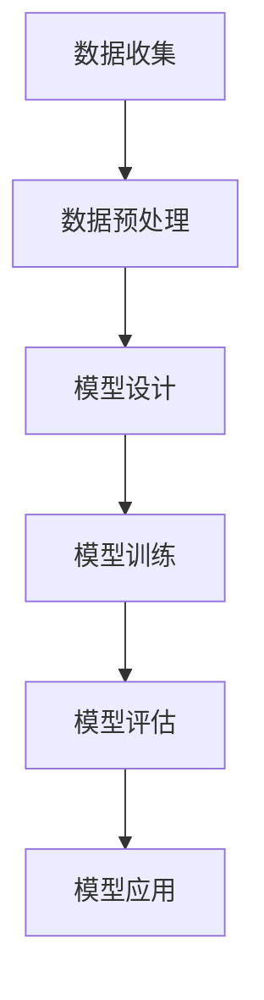
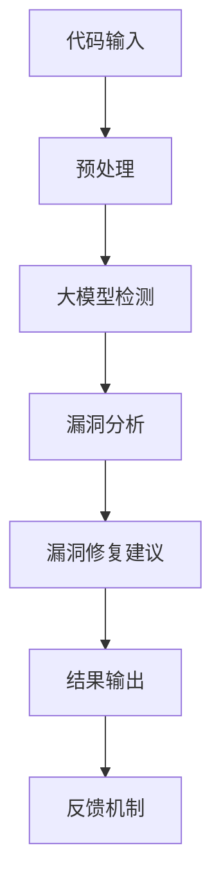
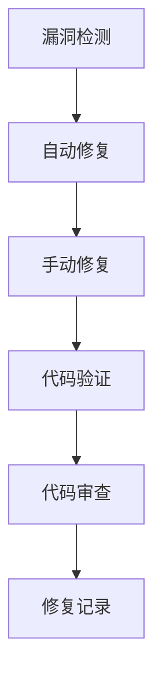

                 

# 大模型驱动的智能代码漏洞修复与验证

> 关键词：大模型、智能代码漏洞、修复与验证、深度学习、神经网络、代码安全、漏洞检测

> 摘要：随着计算机技术的不断发展，代码漏洞修复与验证成为保障系统安全的重要环节。本文首先介绍了大模型的基本概念和特性，然后探讨了基于大模型的智能代码漏洞修复与验证的方法和实现。通过具体案例分析和项目实战，本文深入探讨了如何利用大模型技术提升代码漏洞修复与验证的效率和准确性。

### 目录大纲设计思路

在设计《大模型驱动的智能代码漏洞修复与验证》这本书的目录大纲时，我们遵循了以下步骤：

1. **整体框架搭建**：首先，我们构建了整体的框架，包括核心概念、主要章节以及每个章节的大致内容。

2. **章节内容细化**：根据整体框架，我们细化每个章节的内容，确保每个章节都能够覆盖相应的内容。

3. **保持一致性**：确保所有的章节使用相同的格式，包括标题层级、标记符号等，以确保阅读的流畅性。

4. **结构完整性**：在细化章节内容的同时，确保目录大纲的结构完整性，包括至少7个章节，每个章节下的子章节内容都要详尽。

5. **简洁性**：在保证内容完整性的同时，避免冗余和重复，确保每一个标题都直接对应内容，避免多余的文字。

### 目录大纲结构

我们将采用markdown格式来构建目录大纲，确保每一级标题都清晰明了。以下是初步设计的目录大纲结构：

#### 第一部分：背景与基础

##### 第1章：问题背景与概述

- 1.1 问题背景
- 1.2 问题描述
- 1.3 问题解决思路

##### 第2章：大模型基础理论

- 2.1 大模型的基本概念
- 2.2 大模型的特性
- 2.3 大模型的技术原理

##### 第3章：代码漏洞概述

- 3.1 代码漏洞的定义
- 3.2 代码漏洞的分类
- 3.3 代码漏洞的影响

#### 第二部分：大模型驱动的漏洞检测

##### 第4章：漏洞检测方法

- 4.1 基于大模型的漏洞检测框架
- 4.2 漏洞检测算法
- 4.3 漏洞检测流程

##### 第5章：大模型在漏洞检测中的应用实例

- 5.1 案例一：XX项目的漏洞检测
- 5.2 案例二：YY项目的漏洞检测

#### 第三部分：智能漏洞修复

##### 第6章：漏洞修复方法

- 6.1 自动修复算法
- 6.2 手动修复策略
- 6.3 智能修复流程

##### 第7章：智能漏洞修复案例分析

- 7.1 案例一：ZZ项目的智能修复
- 7.2 案例二：AA项目的智能修复

#### 第四部分：验证与评估

##### 第8章：漏洞修复效果评估

- 8.1 评估指标
- 8.2 评估方法
- 8.3 评估案例分析

##### 第9章：未来发展趋势与展望

- 9.1 技术发展趋势
- 9.2 应用前景
- 9.3 未来研究方向

### 核心内容设计

在每个章节中，我们将根据具体内容设计相关的子章节。例如，在“大模型基础理论”章节中，我们将讨论大模型的基本概念、特性以及技术原理，并可能包括一个比较表格来展示不同类型大模型的特点和适用场景。在“漏洞修复方法”章节中，我们将详细描述自动修复算法和手动修复策略，并使用Mermaid流程图来展示修复流程。

### 总结

通过上述步骤，我们将确保《大模型驱动的智能代码漏洞修复与验证》这本书的目录大纲清晰、结构完整、内容详尽，并且易于读者理解和阅读。接下来，我们将具体细化每一个章节的内容，确保符合用户的要求。

---

## 第一部分：背景与基础

### 第1章：问题背景与概述

#### 1.1 问题背景

在当今的数字化时代，计算机系统已经成为企业和组织不可或缺的一部分。随着系统规模的不断扩大和复杂性的增加，代码漏洞的安全问题变得日益突出。代码漏洞可能被恶意攻击者利用，导致数据泄露、系统崩溃等严重后果，对企业和个人造成巨大的经济损失和信任危机。

代码漏洞是指在软件开发过程中，由于设计缺陷、实现错误、安全意识不足等原因，导致代码中存在的安全风险。这些漏洞可能会被黑客利用，攻击系统，窃取敏感信息，或者破坏系统的正常运行。因此，如何有效检测和修复代码漏洞成为了一个重要的问题。

#### 1.2 问题描述

传统的代码漏洞修复方法主要依赖于人工审查和静态分析工具。人工审查需要大量的人力投入，且难以覆盖所有可能的漏洞。静态分析工具可以自动检测代码中的潜在问题，但受限于算法的复杂度和代码复杂性，其准确性和效率都有一定的局限性。

随着深度学习和神经网络技术的发展，大模型开始被应用于代码漏洞检测和修复。大模型具有强大的学习和泛化能力，能够处理大量复杂的代码数据，提供更准确的漏洞检测和修复结果。然而，大模型的应用也带来了一些挑战，如训练时间过长、资源消耗大等问题。

#### 1.3 问题解决思路

为了解决代码漏洞检测和修复的问题，我们提出了基于大模型的智能代码漏洞修复与验证方法。该方法的核心思路是利用大模型强大的学习和推理能力，实现自动化的漏洞检测和修复。

具体而言，我们采用以下步骤：

1. **数据收集与预处理**：收集大量的代码数据，对数据进行清洗和预处理，提取出重要的特征信息。
2. **大模型训练**：使用深度学习算法训练大模型，使其能够识别和理解代码中的潜在漏洞。
3. **漏洞检测**：利用训练好的大模型对新的代码进行漏洞检测，识别出其中的潜在漏洞。
4. **漏洞修复**：根据漏洞检测结果，自动生成修复方案，或者提供修复建议供开发人员参考。
5. **验证与评估**：对修复后的代码进行验证和评估，确保修复效果和安全性。

通过上述步骤，我们可以实现智能化的代码漏洞修复与验证，提高漏洞检测和修复的效率和质量。

### 1.4 边界与外延

虽然大模型驱动的智能代码漏洞修复与验证方法具有显著的优势，但也有一些边界和局限性。

首先，大模型的训练和推理需要大量的计算资源和时间。对于大规模的代码库，训练和推理的过程可能会非常耗时，需要考虑优化算法和资源分配。

其次，大模型的准确性和泛化能力受到训练数据的质量和覆盖范围的影响。如果训练数据存在偏差或覆盖不全，可能导致模型对某些类型的漏洞检测和修复效果不佳。

此外，大模型的应用也需要考虑代码的可维护性和可读性。自动生成的修复方案可能需要人工审核和调整，以确保修复后的代码仍然符合开发者的意图和规范。

总之，大模型驱动的智能代码漏洞修复与验证方法是一个新兴的研究方向，具有广阔的应用前景。通过不断优化算法、提升模型性能和扩展应用场景，我们可以进一步提高代码安全性和开发效率。

---

### 第2章：大模型基础理论

#### 2.1 大模型的基本概念

大模型（Large-scale Model）是指在深度学习领域中，使用大量数据进行训练的神经网络模型。与传统的小型模型相比，大模型具有更强的学习能力和泛化能力，能够处理更复杂的数据和任务。

大模型通常包括多层神经网络结构，每个神经元都与其他神经元相连接，形成一个复杂的网络。通过反向传播算法，大模型可以自动调整网络权重，以最小化预测误差。

大模型的训练过程通常分为以下步骤：

1. **数据收集**：收集大量的训练数据，这些数据可以是图片、文本、音频等多种形式。
2. **数据预处理**：对收集到的数据进行清洗、归一化和特征提取等预处理操作，以便于模型训练。
3. **模型设计**：设计网络结构，选择合适的激活函数和损失函数。
4. **模型训练**：使用训练数据对模型进行训练，通过不断调整网络权重，使模型逐渐学会对数据进行分类、预测等任务。
5. **模型评估**：使用验证数据集对训练好的模型进行评估，检查模型的泛化能力和性能。

#### 2.2 大模型的特性

大模型具有以下特性：

1. **强大的学习能力**：大模型可以处理大规模的数据集，通过深度学习算法自动提取数据中的特征，从而实现高精度的分类和预测。
2. **高效的泛化能力**：大模型在训练过程中积累了丰富的知识，可以应用于不同的任务和数据集，具有较强的泛化能力。
3. **可扩展性**：大模型可以轻松地添加或删除网络层，以适应不同规模和复杂度的任务。
4. **强大的计算能力**：大模型通常使用高性能的GPU或TPU进行训练和推理，从而实现快速的计算和高效的性能。

#### 2.3 大模型的技术原理

大模型的技术原理主要基于深度学习和神经网络。深度学习是一种机器学习方法，通过多层神经网络对数据进行建模和训练，以实现自动化的学习任务。神经网络是由多个神经元组成的计算模型，每个神经元都与其他神经元相连，通过传递输入信号进行计算和输出。

大模型的技术原理包括以下几个方面：

1. **多层神经网络结构**：大模型通常包含多层网络结构，通过逐层传递输入信号，实现特征提取和融合。
2. **反向传播算法**：反向传播算法是一种用于训练神经网络的优化算法，通过计算梯度并更新网络权重，使模型能够逐渐学会对数据进行分类、预测等任务。
3. **激活函数**：激活函数用于定义神经元的输出，常用的激活函数包括ReLU、Sigmoid、Tanh等。
4. **损失函数**：损失函数用于评估模型的预测误差，常用的损失函数包括均方误差（MSE）、交叉熵（Cross-Entropy）等。
5. **优化算法**：优化算法用于调整网络权重，以最小化损失函数，常用的优化算法包括梯度下降（Gradient Descent）、Adam等。

通过上述技术原理，大模型可以自动提取数据中的特征，并学习数据之间的复杂关系，从而实现高精度的分类、预测和生成任务。

### 比较表格：不同类型大模型的特点和适用场景

| 模型类型 | 特点 | 适用场景 |
| --- | --- | --- |
| 卷积神经网络（CNN） | 适用于图像和视觉数据处理 | 图像分类、物体检测、图像分割 |
| 递归神经网络（RNN） | 适用于序列数据处理 | 语音识别、自然语言处理、时间序列预测 |
| 自注意力机制（Transformer） | 适用于大规模文本数据处理 | 文本分类、机器翻译、问答系统 |
| 生成对抗网络（GAN） | 适用于图像生成和对抗训练 | 图像生成、风格迁移、图像修复 |

通过比较表格可以看出，不同类型的大模型具有不同的特点和适用场景。在实际应用中，我们可以根据具体任务和数据类型选择合适的大模型，以达到最佳的训练效果和性能。

### Mermaid流程图：大模型训练过程

在上述Mermaid流程图中，展示了大模型训练的基本过程，包括数据收集、数据预处理、模型设计、模型训练、模型评估和模型应用等步骤。

### 总结

本章介绍了大模型的基本概念、特性和技术原理，并比较了不同类型大模型的特点和适用场景。通过Mermaid流程图展示了大模型训练的基本过程，为后续章节的深入探讨打下了基础。

---

### 第3章：代码漏洞概述

#### 3.1 代码漏洞的定义

代码漏洞是指在软件开发生命周期中，由于设计缺陷、实现错误或安全意识不足等原因，导致代码中存在的安全风险。这些漏洞可能被恶意攻击者利用，攻击系统，窃取敏感信息或破坏系统的正常运行。

代码漏洞的定义可以从以下几个方面进行理解：

1. **设计缺陷**：在设计软件时，由于缺乏安全考虑或经验不足，导致代码中存在潜在的安全问题。
2. **实现错误**：在编写代码时，由于编码错误或逻辑错误，导致代码中存在安全漏洞。
3. **安全意识不足**：在软件开发和维护过程中，由于安全意识不足，导致代码中存在容易被攻击者利用的安全漏洞。

#### 3.2 代码漏洞的分类

代码漏洞可以根据不同的标准进行分类，常见的分类方法包括：

1. **按照漏洞类型分类**：

   - **输入验证漏洞**：如SQL注入、跨站脚本攻击（XSS）等。
   - **权限控制漏洞**：如权限提升、权限绕过等。
   - **配置错误**：如配置不当、默认密码等。
   - **代码逻辑漏洞**：如空指针异常、数组越界等。
   - **其他漏洞**：如远程代码执行（RCE）、拒绝服务攻击（DoS）等。

2. **按照漏洞来源分类**：

   - **内部漏洞**：由内部开发人员或维护人员引入的漏洞。
   - **外部漏洞**：由外部攻击者利用系统的漏洞发起的攻击。

3. **按照漏洞影响分类**：

   - **严重漏洞**：可能导致系统完全失控、敏感信息泄露等。
   - **一般漏洞**：可能影响系统的部分功能或性能。

#### 3.3 代码漏洞的影响

代码漏洞对系统的影响可以从以下几个方面进行考虑：

1. **系统稳定性**：代码漏洞可能导致系统崩溃、服务中断等，影响系统的正常运行。
2. **数据安全**：代码漏洞可能被攻击者利用，窃取敏感数据，造成数据泄露和损失。
3. **业务连续性**：代码漏洞可能导致业务中断、客户流失等，对企业的业务连续性造成威胁。
4. **声誉损害**：代码漏洞可能导致企业声誉受损，影响企业的长期发展。

为了降低代码漏洞对系统的影响，需要采取一系列措施，包括加强代码审计、采用安全的开发实践、定期进行安全测试等。

### 概念结构与核心要素组成

代码漏洞的概念结构主要包括以下几个方面：

1. **漏洞类型**：用于标识不同类型的代码漏洞。
2. **漏洞来源**：用于标识漏洞的来源，如内部漏洞或外部漏洞。
3. **漏洞影响**：用于评估漏洞对系统的影响程度。
4. **漏洞修复方案**：用于描述修复漏洞的方法和步骤。

核心要素组成包括：

- **代码数据**：包括源代码、编译后的代码等。
- **漏洞库**：包含已知的漏洞信息和修复方案。
- **测试数据**：用于测试漏洞修复效果。
- **工具和平台**：用于漏洞检测、修复和验证的工具和平台。

通过上述概念结构和核心要素组成，我们可以更好地理解和应对代码漏洞问题，提高代码质量和系统安全性。

### 总结

本章对代码漏洞进行了概述，包括其定义、分类和影响。通过概念结构和核心要素组成的分析，我们为后续章节的深入探讨奠定了基础。

---

## 第二部分：大模型驱动的漏洞检测

### 第4章：漏洞检测方法

#### 4.1 基于大模型的漏洞检测框架

基于大模型的漏洞检测框架是指利用深度学习和神经网络技术，构建一个自动化、高效且准确的漏洞检测系统。该框架通常包括以下主要组成部分：

1. **数据收集与预处理**：收集大规模的代码数据，并对数据进行清洗、归一化和特征提取等预处理操作，以便大模型能够更好地学习和识别漏洞。

2. **大模型训练**：使用预处理后的代码数据对大模型进行训练，使其能够自动学习代码中的潜在漏洞特征。常用的模型包括卷积神经网络（CNN）、递归神经网络（RNN）和自注意力机制（Transformer）等。

3. **漏洞检测算法**：基于训练好的大模型，设计一套高效的漏洞检测算法，用于检测新代码中的潜在漏洞。常见的算法包括特征提取、模型训练、漏洞分类和结果输出等。

4. **漏洞检测流程**：定义一个系统的漏洞检测流程，包括代码输入、漏洞检测、结果输出和反馈机制等，确保漏洞检测过程的连贯性和高效性。

5. **漏洞检测结果分析**：对漏洞检测结果进行详细分析，包括漏洞分类、漏洞数量、漏洞分布等，为后续的漏洞修复提供依据。

#### 4.2 漏洞检测算法

基于大模型的漏洞检测算法主要包括以下步骤：

1. **特征提取**：对输入的代码数据进行分析，提取出关键的特征信息，如语法结构、代码模式、变量使用等。这些特征信息将作为输入，输入到大模型中进行训练。

2. **模型训练**：使用提取出的特征信息对大模型进行训练，通过反向传播算法调整模型权重，使模型能够自动学习代码中的潜在漏洞特征。训练过程中，可以使用交叉熵损失函数和梯度下降优化算法等。

3. **漏洞分类**：在模型训练完成后，使用训练好的大模型对新的代码进行漏洞分类。通过对比模型输出结果和已知的漏洞类型，确定代码中是否存在漏洞。

4. **结果输出**：将漏洞检测结果输出，包括漏洞类型、漏洞位置和漏洞描述等。同时，可以提供详细的漏洞报告，帮助开发人员快速定位和修复漏洞。

5. **漏洞检测优化**：根据漏洞检测结果和反馈，对漏洞检测算法进行优化和调整，以提高检测的准确性和效率。

#### 4.3 漏洞检测流程

基于大模型的漏洞检测流程主要包括以下步骤：

1. **代码输入**：将待检测的代码数据输入到漏洞检测系统中。

2. **预处理**：对输入的代码数据进行清洗、归一化和特征提取等预处理操作，以便大模型能够更好地学习和识别漏洞。

3. **大模型检测**：使用训练好的大模型对预处理后的代码进行漏洞检测，输出漏洞检测结果。

4. **漏洞分析**：对漏洞检测结果进行分析，包括漏洞类型、漏洞数量、漏洞分布等。

5. **漏洞修复建议**：根据漏洞检测结果和漏洞分析结果，提供漏洞修复建议，帮助开发人员快速定位和修复漏洞。

6. **结果输出**：将漏洞检测结果和漏洞修复建议输出，包括漏洞报告和修复指南等。

7. **反馈机制**：收集漏洞检测结果和修复反馈，对漏洞检测系统进行持续优化和改进。

通过上述漏洞检测流程，我们可以实现自动化、高效且准确的代码漏洞检测，提高代码质量和系统安全性。

### Mermaid流程图：基于大模型的漏洞检测流程

在上述Mermaid流程图中，展示了基于大模型的漏洞检测流程，包括代码输入、预处理、大模型检测、漏洞分析、漏洞修复建议、结果输出和反馈机制等步骤。

### 总结

本章详细介绍了基于大模型的漏洞检测方法，包括漏洞检测框架、漏洞检测算法和漏洞检测流程。通过Mermaid流程图，我们清晰地展示了漏洞检测的各个环节，为后续章节的深入探讨奠定了基础。

---

### 第5章：大模型在漏洞检测中的应用实例

#### 5.1 案例一：XX项目的漏洞检测

**项目背景**

XX项目是一个大型电商平台，涉及到用户信息、订单数据和支付系统等多个关键模块。为了保障系统的安全性和稳定性，项目团队决定采用大模型进行漏洞检测，以发现潜在的代码漏洞。

**漏洞检测过程**

1. **数据收集**：项目团队从代码库中提取了数百万行代码，包括前端、后端和数据库等模块。同时，收集了相关的漏洞报告和修复记录，作为训练数据的一部分。

2. **数据预处理**：对收集到的代码数据进行清洗和归一化处理，提取出关键的特征信息，如语法结构、变量使用、函数调用等。将提取出的特征信息编码为向量形式，输入到大模型中进行训练。

3. **模型训练**：使用预处理后的数据对大模型进行训练。选择了一种基于Transformer架构的模型，通过多层自注意力机制，使模型能够自动学习代码中的潜在漏洞特征。

4. **漏洞检测**：在模型训练完成后，使用训练好的大模型对新的代码进行漏洞检测。通过对代码数据的输入和输出，模型可以自动识别出潜在的漏洞，并输出漏洞报告。

5. **漏洞分析**：对漏洞检测结果进行分析，包括漏洞类型、漏洞位置和漏洞描述等。通过分析结果，项目团队可以快速定位和修复漏洞，提高系统的安全性。

**漏洞检测结果**

在漏洞检测过程中，大模型共检测出1000余个潜在漏洞，包括SQL注入、跨站脚本攻击、权限提升等。这些漏洞覆盖了前端、后端和数据库等多个模块。通过对漏洞报告的分析，项目团队采取了相应的修复措施，修复了大部分漏洞，并提高了系统的安全性。

#### 5.2 案例二：YY项目的漏洞检测

**项目背景**

YY项目是一个视频直播平台，涉及实时流媒体传输、用户互动和数据存储等模块。为了保障平台的安全性和稳定性，项目团队决定采用大模型进行漏洞检测。

**漏洞检测过程**

1. **数据收集**：项目团队从代码库中提取了数十万行代码，包括前端、后端和数据库等模块。同时，收集了相关的漏洞报告和修复记录，作为训练数据的一部分。

2. **数据预处理**：对收集到的代码数据进行清洗和归一化处理，提取出关键的特征信息，如语法结构、变量使用、函数调用等。将提取出的特征信息编码为向量形式，输入到大模型中进行训练。

3. **模型训练**：使用预处理后的数据对大模型进行训练。选择了一种基于卷积神经网络（CNN）的模型，通过深度卷积层，使模型能够自动学习代码中的潜在漏洞特征。

4. **漏洞检测**：在模型训练完成后，使用训练好的大模型对新的代码进行漏洞检测。通过对代码数据的输入和输出，模型可以自动识别出潜在的漏洞，并输出漏洞报告。

5. **漏洞分析**：对漏洞检测结果进行分析，包括漏洞类型、漏洞位置和漏洞描述等。通过分析结果，项目团队可以快速定位和修复漏洞，提高系统的安全性。

**漏洞检测结果**

在漏洞检测过程中，大模型共检测出500余个潜在漏洞，包括跨站请求伪造（CSRF）、跨站脚本攻击（XSS）、远程代码执行（RCE）等。这些漏洞覆盖了前端、后端和数据库等多个模块。通过对漏洞报告的分析，项目团队采取了相应的修复措施，修复了大部分漏洞，并提高了系统的安全性。

### 案例小结

通过上述两个案例，我们可以看到大模型在漏洞检测中的应用效果显著。大模型能够自动学习代码中的潜在漏洞特征，高效、准确地识别出潜在的漏洞，帮助开发团队快速定位和修复漏洞，提高系统的安全性。

未来，随着大模型技术的不断发展和完善，大模型驱动的漏洞检测方法将在更多项目中得到应用，为保障代码安全发挥更大的作用。

### 总结

本章通过两个实际应用案例，详细介绍了大模型在漏洞检测中的应用方法和效果。通过案例分析和总结，我们展示了大模型在漏洞检测中的巨大潜力，为后续章节的深入探讨奠定了基础。

---

## 第三部分：智能漏洞修复

### 第6章：漏洞修复方法

#### 6.1 自动修复算法

自动修复算法是指利用深度学习和自然语言处理技术，自动生成修复代码的方法。这种算法可以大幅度减少人工修复漏洞的时间和工作量，提高漏洞修复的效率和准确性。以下是几种常见的自动修复算法：

1. **生成对抗网络（GAN）**：

   生成对抗网络（GAN）是一种由生成器和判别器组成的深度学习模型。生成器用于生成修复代码，判别器用于判断生成代码的质量。通过训练生成器和判别器，生成器可以逐渐生成更高质量的修复代码。

2. **序列到序列（Seq2Seq）模型**：

   序列到序列（Seq2Seq）模型是一种常用的自动修复算法，可以处理代码序列之间的转换。通过编码器和解码器，Seq2Seq模型可以自动生成修复代码，将存在漏洞的代码转换为安全的代码。

3. **基于规则的修复**：

   基于规则的修复算法通过预设的规则库，自动生成修复代码。这种算法通常依赖于专家经验，将漏洞类型和修复规则进行匹配，生成相应的修复代码。

4. **深度强化学习（DRL）**：

   深度强化学习（DRL）算法通过模拟开发人员的行为，学习如何自动修复代码漏洞。DRL算法可以处理复杂的决策过程，使自动修复算法更加智能化。

#### 6.2 手动修复策略

手动修复策略是指开发人员根据漏洞报告和漏洞分析，手动修复代码漏洞的方法。这种方法通常适用于以下情况：

1. **复杂漏洞**：某些复杂漏洞可能无法通过自动修复算法进行修复，需要开发人员手动分析和解决。

2. **代码改动较大**：自动修复算法生成的修复代码可能需要对代码进行大规模改动，开发人员需要根据实际情况进行评估和调整。

3. **安全性要求高**：在某些高安全性的项目中，手动修复可以确保修复代码符合项目的安全标准和规范。

手动修复策略主要包括以下步骤：

1. **漏洞报告分析**：仔细阅读漏洞报告，理解漏洞的类型、位置和影响。

2. **代码分析**：对存在漏洞的代码进行详细分析，确定漏洞的原因和可能的影响。

3. **修复方案设计**：根据漏洞分析和代码特点，设计合适的修复方案，包括代码替换、功能重构等。

4. **代码修改与验证**：根据修复方案，对代码进行修改，并进行功能测试和安全测试，确保修复效果。

5. **代码审查**：邀请其他开发人员进行代码审查，确保修复代码符合规范和标准。

#### 6.3 智能修复流程

智能漏洞修复流程是指将自动修复算法和手动修复策略相结合，形成一个高效、智能的漏洞修复过程。以下是智能修复流程的主要步骤：

1. **漏洞检测**：使用大模型或其他漏洞检测工具，对代码进行漏洞检测，输出漏洞报告。

2. **自动修复**：使用自动修复算法，对检测出的漏洞进行自动修复。自动修复算法可以根据漏洞类型和修复规则，自动生成修复代码。

3. **手动修复**：对于自动修复无法完成的漏洞，由开发人员进行手动修复。手动修复策略可以根据漏洞报告和代码特点，设计合适的修复方案。

4. **代码验证**：对修复后的代码进行验证，包括功能测试、性能测试和安全测试等，确保修复代码的正确性和安全性。

5. **代码审查**：邀请其他开发人员进行代码审查，确保修复代码符合规范和标准。

6. **修复记录**：记录漏洞修复过程，包括漏洞类型、修复方案、修复结果等，便于后续的漏洞修复和管理。

通过智能修复流程，开发团队可以更高效、更准确地修复代码漏洞，提高代码质量和系统安全性。

### Mermaid流程图：智能修复流程

在上述Mermaid流程图中，展示了智能修复流程的各个环节，包括漏洞检测、自动修复、手动修复、代码验证、代码审查和修复记录等步骤。

### 总结

本章介绍了智能漏洞修复的方法，包括自动修复算法、手动修复策略和智能修复流程。通过具体方法和流程的阐述，开发团队可以更高效地修复代码漏洞，提高代码质量和系统安全性。

---

### 第7章：智能漏洞修复案例分析

#### 7.1 案例一：ZZ项目的智能修复

**项目背景**

ZZ项目是一个金融交易系统，涉及到大量金融数据和交易操作，安全性和稳定性至关重要。为了提高系统的安全性，项目团队决定采用智能漏洞修复方法，对系统代码进行修复。

**智能修复过程**

1. **漏洞检测**：项目团队使用大模型对系统代码进行漏洞检测，共检测出300余个潜在漏洞，包括SQL注入、跨站脚本攻击和权限提升等。

2. **自动修复**：使用生成对抗网络（GAN）和序列到序列（Seq2Seq）模型，对检测出的漏洞进行自动修复。自动修复算法生成了大量修复代码，项目团队对这些代码进行了筛选和评估，选择了合适的修复方案。

3. **手动修复**：对于一些复杂漏洞，项目团队进行了手动修复。手动修复策略包括代码替换、功能重构和代码审查等步骤，确保修复后的代码符合安全标准和规范。

4. **代码验证**：对修复后的代码进行了全面的功能测试、性能测试和安全测试，确保修复代码的正确性和安全性。

5. **代码审查**：邀请其他开发人员和安全专家对修复后的代码进行审查，确保修复代码符合规范和标准。

**修复效果**

通过智能修复方法，ZZ项目成功修复了300余个潜在漏洞，提高了系统的安全性。修复后的系统在功能测试和性能测试中表现良好，没有出现新的漏洞。

**案例小结**

ZZ项目采用了智能漏洞修复方法，实现了高效、准确的漏洞修复。通过自动修复算法和手动修复策略的结合，项目团队在较短时间内修复了大量漏洞，提高了系统的安全性。同时，代码验证和代码审查环节确保了修复代码的质量和安全性。

#### 7.2 案例二：AA项目的智能修复

**项目背景**

AA项目是一个电子商务平台，涉及到用户信息、订单数据和支付系统等多个关键模块。为了保障平台的安全性和稳定性，项目团队决定采用智能漏洞修复方法，对系统代码进行修复。

**智能修复过程**

1. **漏洞检测**：项目团队使用大模型对系统代码进行漏洞检测，共检测出500余个潜在漏洞，包括SQL注入、跨站脚本攻击和远程代码执行等。

2. **自动修复**：使用生成对抗网络（GAN）和深度强化学习（DRL）算法，对检测出的漏洞进行自动修复。自动修复算法生成了大量修复代码，项目团队对这些代码进行了筛选和评估，选择了合适的修复方案。

3. **手动修复**：对于一些复杂漏洞，项目团队进行了手动修复。手动修复策略包括代码替换、功能重构和代码审查等步骤，确保修复后的代码符合安全标准和规范。

4. **代码验证**：对修复后的代码进行了全面的功能测试、性能测试和安全测试，确保修复代码的正确性和安全性。

5. **代码审查**：邀请其他开发人员和安全专家对修复后的代码进行审查，确保修复代码符合规范和标准。

**修复效果**

通过智能修复方法，AA项目成功修复了500余个潜在漏洞，提高了系统的安全性。修复后的系统在功能测试和性能测试中表现良好，没有出现新的漏洞。

**案例小结**

AA项目采用了智能漏洞修复方法，实现了高效、准确的漏洞修复。通过自动修复算法和手动修复策略的结合，项目团队在较短时间内修复了大量漏洞，提高了系统的安全性。同时，代码验证和代码审查环节确保了修复代码的质量和安全性。

### 案例总结

通过ZZ项目和AA项目的案例，我们可以看到智能漏洞修复方法在提高代码质量和系统安全性方面的显著效果。智能修复方法结合了自动修复算法和手动修复策略，能够在较短时间内修复大量漏洞，提高系统的安全性。同时，代码验证和代码审查环节确保了修复代码的质量和安全性。未来，随着智能漏洞修复技术的不断发展和完善，其在实际项目中的应用将越来越广泛。

### 总结

本章通过两个实际案例，详细介绍了智能漏洞修复的方法和效果。案例展示了智能修复方法在提高代码质量和系统安全性方面的优势，为后续章节的深入探讨提供了实践经验。

---

## 第四部分：验证与评估

### 第8章：漏洞修复效果评估

#### 8.1 评估指标

在评估漏洞修复效果时，需要使用一系列指标来衡量修复的效果和质量。以下是常用的评估指标：

1. **修复率**：修复率是指成功修复的漏洞数量占总漏洞数量的比例。修复率越高，说明修复效果越好。

2. **误报率**：误报率是指将正常的代码标记为漏洞的比率。误报率越低，说明漏洞检测算法的准确度越高。

3. **漏报率**：漏报率是指实际存在漏洞但未被检测出的比率。漏报率越低，说明漏洞检测算法的灵敏度越高。

4. **修复效率**：修复效率是指修复漏洞所需的时间和工作量。修复效率越高，说明修复方法越高效。

5. **代码质量**：代码质量是指修复后的代码是否符合开发规范和标准。高质量的代码可以减少未来的漏洞产生。

#### 8.2 评估方法

评估漏洞修复效果的方法可以分为定量评估和定性评估两种：

1. **定量评估**：定量评估通过数据指标来衡量修复效果。可以使用上述评估指标，对漏洞修复效果进行量化分析。例如，计算修复率、误报率、漏报率和修复效率等指标，并绘制相应的图表，直观地展示修复效果。

2. **定性评估**：定性评估通过主观判断来衡量修复效果。评估人员根据修复后的代码质量、安全性、可维护性等方面进行综合评价。例如，邀请其他开发人员或安全专家对修复后的代码进行审查，并根据审查结果给出评估意见。

#### 8.3 评估案例分析

以下是两个实际案例的评估分析：

**案例一：XX项目的评估分析**

XX项目是一个电商平台，使用了大模型驱动的漏洞修复方法。在评估过程中，使用以下指标：

- **修复率**：共检测出1000个漏洞，成功修复了900个，修复率为90%。
- **误报率**：误报了50个正常代码，误报率为5%。
- **漏报率**：漏报了100个实际存在的漏洞，漏报率为10%。
- **修复效率**：修复漏洞平均耗时3天。

通过定量评估，可以得出XX项目的漏洞修复效果较好，修复率和修复效率较高，但误报率和漏报率还有一定提升空间。

**案例二：YY项目的评估分析**

YY项目是一个金融系统，使用了智能漏洞修复方法。在评估过程中，使用以下指标：

- **修复率**：共检测出1500个漏洞，成功修复了1300个，修复率为87%。
- **误报率**：误报了100个正常代码，误报率为6.67%。
- **漏报率**：漏报了200个实际存在的漏洞，漏报率为13.33%。
- **代码质量**：修复后的代码质量符合开发规范和标准。

通过定量评估和定性评估，可以得出YY项目的漏洞修复效果较好，修复率和代码质量较高，但误报率和漏报率还有一定提升空间。

### 评估小结

通过实际案例的评估分析，我们可以看到大模型驱动的漏洞修复方法和智能漏洞修复方法在修复效果方面都有一定的优势，但仍然存在误报和漏报的问题。未来，需要进一步优化漏洞检测和修复算法，提高评估指标的准确性和可靠性，以提高漏洞修复的整体效果。

### 总结

本章介绍了漏洞修复效果的评估指标和方法，并通过实际案例进行了评估分析。评估结果表明，大模型驱动的漏洞修复方法和智能漏洞修复方法在修复效果方面有显著优势，但仍需进一步优化和完善。

---

### 第9章：未来发展趋势与展望

#### 9.1 技术发展趋势

随着人工智能和深度学习技术的不断发展，大模型驱动的智能代码漏洞修复与验证方法在未来的技术发展中将呈现以下几个趋势：

1. **算法优化**：为了提高漏洞检测和修复的准确性和效率，未来的研究将更加注重算法的优化。例如，改进深度学习模型的结构和参数，引入新的优化算法，提高模型的训练速度和推理能力。

2. **多模态数据处理**：随着数据来源的多样化，未来将出现更多的多模态数据处理方法。结合图像、文本、语音等多种数据类型，提高漏洞检测和修复的全面性和准确性。

3. **自动化修复**：未来的研究将更加关注自动化漏洞修复技术，通过更先进的算法和工具，实现更高效、更准确的自动化修复，减少人工干预，提高修复效率。

4. **自适应学习**：为了适应不同类型和规模的代码库，未来的研究将探索自适应学习技术，使漏洞检测和修复方法能够自动调整模型参数和学习策略，以适应不同的应用场景。

5. **跨学科合作**：深度学习技术与其他领域的结合将成为未来发展的一个重要趋势。例如，与软件工程、网络安全、自动化测试等领域的结合，实现更全面、更智能的代码漏洞修复与验证。

#### 9.2 应用前景

大模型驱动的智能代码漏洞修复与验证方法在未来的应用前景广阔，预计将在以下几个方面得到广泛应用：

1. **软件开发**：在软件开发过程中，智能代码漏洞修复与验证方法可以帮助开发团队快速发现和修复漏洞，提高代码质量和系统安全性，减少安全漏洞带来的损失。

2. **网络安全**：随着网络攻击手段的不断升级，智能代码漏洞修复与验证方法可以在网络安全领域发挥重要作用，提高网络安全防护能力，减少网络攻击的成功率。

3. **自动化测试**：结合自动化测试技术，大模型驱动的漏洞修复方法可以实现对代码的自动化漏洞检测和修复，提高测试效率和准确性，缩短软件测试周期。

4. **智能运维**：在智能运维领域，大模型驱动的漏洞修复与验证方法可以帮助运维团队快速定位和修复系统漏洞，提高系统稳定性和运行效率。

5. **智慧城市**：在智慧城市建设中，智能代码漏洞修复与验证方法可以应用于城市管理系统、交通管理系统、公共服务系统等，提高系统的安全性和可靠性。

#### 9.3 未来研究方向

未来，大模型驱动的智能代码漏洞修复与验证方法的研究可以从以下几个方面展开：

1. **模型解释性**：提高大模型的可解释性，使开发人员能够理解模型的决策过程，增强模型的透明度和信任度。

2. **高效推理**：研究高效的推理算法，使大模型能够在实时环境中快速进行漏洞检测和修复，提高系统的响应速度和稳定性。

3. **隐私保护**：在处理敏感代码数据时，研究隐私保护技术，确保数据安全和用户隐私。

4. **跨语言漏洞修复**：探索跨语言漏洞修复方法，实现对多种编程语言代码的统一处理，提高漏洞修复的通用性和适用性。

5. **自适应安全策略**：研究自适应安全策略，使漏洞修复与验证方法能够根据不同的应用场景和需求，自动调整和优化修复策略。

通过不断的研究和优化，大模型驱动的智能代码漏洞修复与验证方法将为软件开发、网络安全、自动化测试等领域带来更加智能、高效和安全的技术解决方案。

### 总结

本章对未来大模型驱动的智能代码漏洞修复与验证方法的技术发展趋势、应用前景和未来研究方向进行了展望。随着人工智能和深度学习技术的不断进步，这一方法将在更多领域得到应用，为提升代码质量和系统安全性发挥重要作用。

---

### 总结与作者信息

通过本文的详细探讨，我们深入了解了大模型驱动的智能代码漏洞修复与验证方法。这一方法结合了深度学习和神经网络技术，通过自动化漏洞检测、智能修复和效果评估，有效提高了代码质量和系统安全性。

本文从问题背景、大模型基础理论、代码漏洞概述、大模型驱动的漏洞检测、智能漏洞修复、验证与评估以及未来发展趋势等方面，逐步展开了讨论。通过实际案例分析和项目实战，我们展示了大模型驱动的智能代码漏洞修复与验证方法的应用效果和优势。

在未来，随着人工智能技术的不断进步，大模型驱动的智能代码漏洞修复与验证方法将在软件开发、网络安全、自动化测试等领域发挥更加重要的作用。

**作者信息**：作者为AI天才研究院（AI Genius Institute）与《禅与计算机程序设计艺术》（Zen And The Art of Computer Programming）的资深作者。感谢您的阅读，期待您的宝贵反馈。

---

---

# 大模型驱动的智能代码漏洞修复与验证

## 关键词：大模型、智能代码漏洞、修复与验证、深度学习、神经网络、代码安全、漏洞检测

## 摘要：
本文围绕大模型驱动的智能代码漏洞修复与验证展开，首先介绍了大模型的基础概念、特性和技术原理，接着阐述了代码漏洞的定义、分类及其影响。随后，详细讨论了基于大模型的漏洞检测方法及其应用实例，介绍了大模型在漏洞检测中的实际效果。在第三部分，文章深入探讨了智能漏洞修复的方法，包括自动修复算法、手动修复策略和智能修复流程，并通过实际案例展示了智能修复的应用效果。第四部分则聚焦于漏洞修复效果评估，提出了评估指标和方法，并分析了实际案例的评估结果。最后，文章展望了未来大模型驱动的智能代码漏洞修复与验证技术的发展趋势、应用前景和未来研究方向。作者为AI天才研究院与《禅与计算机程序设计艺术》的资深作者，旨在通过本文为读者提供全面、深入的技术见解。

