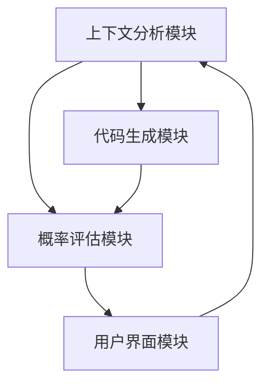
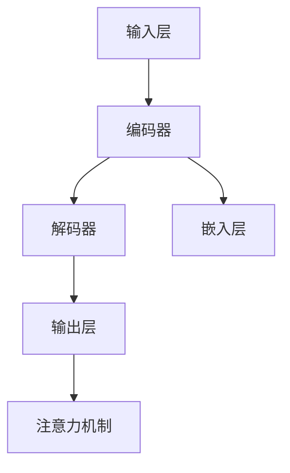
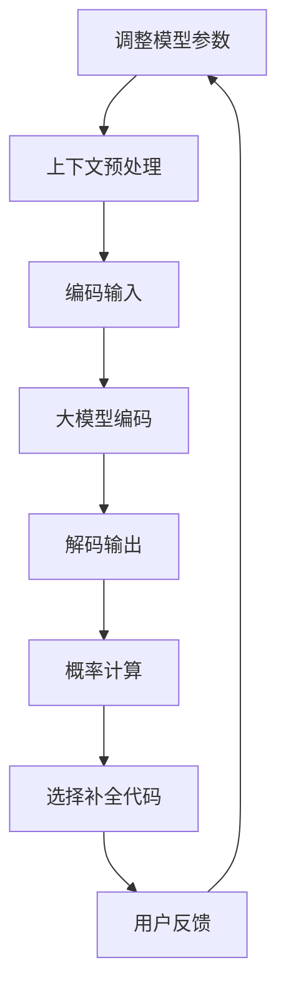

                 

# 大模型驱动的智能代码补全系统

## 关键词

- 代码补全
- 大模型
- 智能编程
- 自然语言处理
- 编程助手

## 摘要

本文将深入探讨大模型在智能代码补全系统中的应用，分析其理论基础、算法原理、系统架构设计以及实际应用案例。我们将从代码补全的历史背景、大模型的基本概念、大型模型的种类与应用，再到代码补全算法的集成与优化，一一进行详细阐述。最后，通过一个具体的实际项目，展示大模型在代码补全系统中的强大功能和潜力。

---

## Part 1: 引言

### 1.1 代码补全的历史与发展

代码补全（Code Completion），作为编程开发中的一个重要辅助工具，极大地提高了开发效率和代码质量。回顾历史，早期的代码补全主要依赖于简单的关键词匹配和语法分析，这些方法虽然在一定程度上提高了编程效率，但在复杂编程环境中表现有限。

随着自然语言处理（NLP）和机器学习技术的发展，代码补全系统逐渐向智能化方向发展。特别是近年来，大模型的崛起为代码补全系统带来了新的突破。大模型（Large Models）能够通过学习海量数据，理解和生成复杂的编程语言结构，使得代码补全系统在准确性和智能化程度上得到了显著提升。

### 1.2 代码补全系统面临的挑战与机遇

当前的代码补全系统面临着多方面的挑战：

- **数据量与多样性**：代码库的规模日益增长，同时代码风格和语言结构也变得多样化，这给代码补全系统提出了更高的要求。
- **准确性与用户体验**：用户期望代码补全系统能够提供高准确性的建议，同时保持良好的用户体验。
- **安全性与隐私保护**：代码补全系统需要处理敏感的源代码信息，保障数据安全性和隐私保护成为重要议题。

与此同时，大模型的出现为代码补全系统带来了新的机遇：

- **学习能力**：大模型通过深度学习，能够从大量代码数据中学习到复杂的编程模式，提高代码补全的准确性。
- **多语言支持**：大模型能够处理多种编程语言，使得代码补全系统能够支持跨语言的代码补全。
- **智能化交互**：大模型可以与开发者进行智能交互，提供个性化的代码补全建议。

### 1.3 大模型在代码补全中的角色

大模型在代码补全系统中的作用主要体现在以下几个方面：

- **语法分析**：大模型通过对编程语言的深度理解，能够准确分析代码的结构，提供智能化的语法建议。
- **语义理解**：大模型能够理解代码的语义信息，提供更加符合上下文逻辑的代码补全选项。
- **代码生成**：大模型能够根据上下文生成新的代码片段，实现自动代码补全。

总的来说，大模型为代码补全系统带来了革命性的变化，使得代码补全从简单的语法辅助向智能化、个性化的方向发展。在接下来的章节中，我们将详细探讨大模型的基本概念、应用场景以及实现方法。

### 2. 大模型的基本概念与特点

#### 2.1 大模型的定义与分类

大模型（Large Models）是指那些参数数量巨大、计算能力强大的神经网络模型。它们通常基于深度学习技术，能够处理大量的数据，提取复杂的特征，并生成高质量的输出。大模型可以分为以下几类：

- **预训练模型**：这些模型在大量的通用语料库上进行预训练，然后通过微调（Fine-tuning）适应特定任务。
- **生成式模型**：这类模型能够生成新的数据，如文本、图像、音频等，其代表性模型有 GPT、DALL-E 等。
- **解码器模型**：这类模型通常用于序列到序列的转换任务，如机器翻译、代码补全等，其代表性模型有 Transformer、BERT 等。

#### 2.2 大模型的关键特点

大模型具有以下几个关键特点：

- **高参数量**：大模型通常包含数亿甚至数十亿个参数，这赋予了它们强大的表示能力和学习能力。
- **深度架构**：大模型通常采用多层神经网络架构，能够处理复杂的数据和任务。
- **端到端学习**：大模型能够直接从输入到输出进行端到端学习，减少了中间环节的误差传递。
- **泛化能力**：大模型通过在大量数据上的预训练，能够泛化到不同的任务和数据集，减少了任务特定的调整需求。

#### 2.3 大模型与传统模型的对比

与传统模型相比，大模型在多个方面具有优势：

- **表示能力**：大模型能够提取更加复杂和抽象的特征，对数据有更深层次的理解。
- **学习效率**：大模型通过并行计算和分布式训练，能够在较短的时间内处理大量数据。
- **适应能力**：大模型能够通过预训练和微调，快速适应新的任务和数据集。
- **泛化能力**：大模型在多个任务和数据集上的表现往往优于传统模型，具有更好的泛化能力。

然而，大模型也存在一些挑战：

- **计算资源**：大模型通常需要大量的计算资源和存储空间，这对硬件设备提出了高要求。
- **模型解释性**：大模型的结构复杂，其决策过程往往难以解释，这对模型的可解释性提出了挑战。
- **数据隐私**：大模型在训练过程中需要处理大量的敏感数据，这涉及数据隐私和安全问题。

总的来说，大模型在代码补全系统中具有巨大的潜力，但同时也面临着一系列的挑战。在接下来的章节中，我们将进一步探讨大模型在代码补全系统中的应用实例和实现方法。

### 3. 主要大模型的概述

#### 3.1 GPT 和其变种

GPT（Generative Pre-trained Transformer）是由 OpenAI 开发的一种基于 Transformer 架构的预训练模型。GPT 通过在大量文本数据上进行预训练，学习到了丰富的语言模式和语义信息，从而能够生成高质量的自然语言文本。

- **GPT-2**：GPT-2 是 GPT 的升级版，具有更多的参数和更大的模型规模。它进一步提升了文本生成的质量和灵活性。
- **GPT-3**：GPT-3 是 GPT 系列的最新版本，拥有超过 1750 亿个参数，是当前最大的自然语言处理模型。GPT-3 在各种自然语言处理任务中表现出色，包括文本生成、机器翻译、问答系统等。

#### 3.2 BERT 和其家族

BERT（Bidirectional Encoder Representations from Transformers）是由 Google 开发的一种基于 Transformer 架构的双向编码模型。BERT 通过在大量文本数据上进行双向预训练，学习到了语言的深层语义特征，从而能够提高各种自然语言处理任务的性能。

- **BERT-Large**：BERT-Large 是 BERT 的一个变体，拥有更多的参数和更大的模型规模，其在多个自然语言处理任务中取得了优异的性能。
- **RoBERTa**：RoBERTa 是 BERT 的一个变种，通过修改训练过程和数据预处理方法，进一步提升了模型的性能。
- **ALBERT**：ALBERT 是 Google 开发的一种轻量级 BERT 变体，通过模型压缩和参数共享技术，在保持高性能的同时减少了计算资源的需求。

#### 3.3 其他著名大模型

除了 GPT 和 BERT，还有许多其他著名的大模型在自然语言处理领域取得了显著成果：

- **T5（Text-To-Text Transfer Transformer）**：T5 是一种基于 Transformer 架构的文本到文本的转换模型，通过在大量文本数据上进行训练，能够处理各种自然语言处理任务，如文本分类、问答、机器翻译等。
- **PaLM（Language Model for Dialogue Applications）**：PaLM 是 Google 开发的一种用于对话应用的预训练模型，通过在大量对话数据上进行训练，能够生成自然、连贯的对话响应。
- **LLaMA（Language Models for Dialogue Applications）**：LLaMA 是 OpenAI 开发的一种用于对话应用的预训练模型，通过在大量对话数据上进行训练，能够生成高质量、具有上下文一致性的对话响应。

这些大模型在自然语言处理任务中表现优异，为代码补全系统提供了强大的技术支持。在接下来的章节中，我们将详细探讨大模型在代码补全系统中的应用实例和实现方法。

### 4. 大模型在代码补全系统中的应用

#### 4.1 应用领域

大模型在代码补全系统中的应用领域非常广泛，包括但不限于以下几个方面：

- **智能编程助手**：大模型可以作为智能编程助手，帮助开发者完成代码编写、调试、优化等任务。例如，它能够自动生成代码片段、提供代码补全建议、优化代码性能等。
- **代码审核与修复**：大模型能够分析代码的语法和语义，检测潜在的错误和漏洞，并提供修复建议，从而提高代码质量和安全性。
- **代码生成与重构**：大模型能够根据开发者提供的少量信息，自动生成新的代码片段，实现代码的重构和重写。这对于复用代码、提高开发效率具有重要意义。
- **编程教育**：大模型可以作为编程教育工具，帮助学生和初学者理解和掌握编程知识，提供个性化的编程指导和学习建议。

#### 4.2 优势与挑战

大模型在代码补全系统中的应用具有以下优势：

- **高准确性**：大模型通过学习海量代码数据，能够生成高准确性的代码补全建议，减少开发者的错误率和代码调试时间。
- **智能化交互**：大模型能够理解开发者的意图和上下文，提供个性化的代码补全建议，提高用户体验。
- **多语言支持**：大模型能够处理多种编程语言，使得代码补全系统具有更广泛的适用性。
- **快速适应**：大模型具有强大的学习能力，能够快速适应新的编程语言和开发环境。

然而，大模型在代码补全系统中也面临一些挑战：

- **计算资源需求**：大模型通常需要大量的计算资源和存储空间，这对硬件设备提出了高要求。
- **模型解释性**：大模型的结构复杂，其决策过程往往难以解释，这对模型的可解释性提出了挑战。
- **数据隐私**：大模型在训练过程中需要处理大量的敏感代码信息，涉及数据隐私和安全问题。

总的来说，大模型在代码补全系统中具有巨大的潜力，但同时也需要克服一系列的技术挑战。在接下来的章节中，我们将详细探讨大模型在代码补全系统中的具体实现方法和技术细节。

### 5. 总结与未来展望

#### 5.1 关键点

本文通过对代码补全系统与大模型之间的结合进行深入探讨，得出了以下关键点：

- 代码补全系统在软件开发中扮演着重要的角色，提高了开发效率和代码质量。
- 大模型的崛起为代码补全系统带来了新的突破，使得代码补全更加智能化和个性化。
- 大模型在代码补全系统中的应用具有高准确性、智能化交互、多语言支持和快速适应等优势。
- 大模型在代码补全系统中也面临计算资源需求、模型解释性和数据隐私等挑战。

#### 5.2 未来发展方向

在未来，大模型在代码补全系统中的应用有望进一步发展，具体方向包括：

- **性能优化**：通过算法优化和硬件加速，降低大模型的计算资源需求，提高代码补全系统的性能和效率。
- **可解释性提升**：开发更加可解释的大模型，使其决策过程更加透明和易于理解，提高开发者对模型的信任度。
- **多语言支持**：进一步扩展大模型对多种编程语言的支持，实现跨语言的代码补全。
- **安全性与隐私保护**：加强数据隐私保护机制，确保大模型在处理敏感代码信息时的安全性。
- **个性化服务**：根据开发者的偏好和项目需求，提供更加个性化的代码补全建议和服务。

总之，大模型在代码补全系统中的应用前景广阔，将在软件开发领域发挥越来越重要的作用。随着技术的不断进步，我们有理由相信，未来代码补全系统将变得更加智能、高效和安全。

---

## Part 2: 智能代码补全系统的理论基础

### 6. 代码补全算法的基本原理

代码补全算法（Code Completion Algorithms）是智能代码补全系统的基础，其核心目的是在给定的编程上下文中，自动推荐可能的代码片段。以下是对代码补全算法基本原理的详细探讨：

#### 6.1 算法概述

代码补全算法可以分为以下几类：

- **基于规则的方法**：这种方法使用预定义的规则和模式匹配技术来补全代码。典型的例子包括语法分析器和正则表达式匹配。
- **基于统计的方法**：这种方法通过分析历史代码数据，使用统计模型来预测下一个代码片段。常见的统计模型包括隐马尔可夫模型（HMM）、条件概率模型等。
- **基于机器学习的方法**：这种方法使用机器学习算法来训练模型，从历史代码数据中学习代码补全的模式。常见的机器学习算法包括决策树、支持向量机（SVM）、神经网络等。

#### 6.2 关键技术与方法

代码补全算法的关键技术包括：

- **语法分析**：语法分析是代码补全的重要步骤，通过分析代码的语法结构，确定当前代码的位置和上下文。
- **模式匹配**：模式匹配用于找到代码中的关键模式和符号，从而生成可能的补全选项。
- **上下文感知**：上下文感知技术用于理解代码的上下文信息，从而生成更加准确和相关的补全建议。
- **概率模型**：概率模型用于计算每个补全选项的概率，从而选择最有可能的选项。

#### 6.3 评估指标

代码补全算法的评估指标通常包括：

- **准确率**：准确率是指推荐的补全选项中正确选项的比例，它是评估代码补全算法性能的主要指标。
- **召回率**：召回率是指实际正确选项中被推荐的比例，它反映了算法发现正确选项的能力。
- **F1 分数**：F1 分数是准确率和召回率的加权平均，用于综合评估代码补全算法的性能。

### 7. 大模型在代码补全系统中的应用

大模型在代码补全系统中的应用极大地提升了代码补全的准确性和智能化水平。以下是大模型在代码补全系统中的应用方式：

#### 7.1 大模型的角色

在大模型驱动的代码补全系统中，大模型主要扮演以下角色：

- **上下文理解**：大模型通过学习大量的代码数据，能够理解代码的上下文信息，从而生成更加准确和相关的补全建议。
- **代码生成**：大模型能够根据上下文信息生成新的代码片段，实现自动代码补全。
- **模式匹配**：大模型通过学习代码中的模式和符号，能够自动匹配可能的补全选项。

#### 7.2 大模型驱动的代码补全技术

大模型驱动的代码补全技术主要包括以下几种：

- **预训练与微调**：大模型首先在大量的通用代码数据上进行预训练，然后通过微调适应特定编程语言和开发环境。
- **上下文感知生成**：大模型通过理解上下文信息，生成与上下文相关的代码片段。
- **概率预测与排序**：大模型计算每个补全选项的概率，并根据概率排序生成补全建议。

#### 7.3 优点与局限性

大模型在代码补全系统中的应用具有以下优点：

- **高准确性**：大模型能够通过学习海量代码数据，生成高准确性的代码补全建议。
- **智能化交互**：大模型能够理解开发者的意图和上下文，提供个性化的代码补全建议。
- **多语言支持**：大模型能够处理多种编程语言，实现跨语言的代码补全。

然而，大模型在代码补全系统中也存在一些局限性：

- **计算资源需求**：大模型通常需要大量的计算资源和存储空间，这对硬件设备提出了高要求。
- **模型解释性**：大模型的结构复杂，其决策过程往往难以解释，这对模型的可解释性提出了挑战。
- **数据隐私**：大模型在训练过程中需要处理大量的敏感代码信息，涉及数据隐私和安全问题。

总的来说，大模型在代码补全系统中具有巨大的潜力，但同时也需要克服一系列的技术挑战。在接下来的章节中，我们将详细探讨大模型在代码补全系统中的应用实例和实现方法。

### 8. 数学模型与公式

在智能代码补全系统中，数学模型和公式是理解算法原理和实现方法的关键。以下将介绍一些核心的数学模型和公式，并使用 Mermaid 图形化工具展示其结构。

#### 8.1 代码补全算法的数学模型

代码补全算法通常可以表示为一个概率模型，其核心是计算给定上下文 \(C\) 下，每个代码片段 \(C'\) 的概率。这可以表示为：

\[ P(C'|C) = \frac{P(C, C')}{P(C)} \]

其中，\(P(C, C')\) 表示代码片段 \(C'\) 在上下文 \(C\) 下的联合概率，\(P(C)\) 表示上下文 \(C\) 的概率。

#### 8.2 代码补全算法的公式

以下是代码补全算法中常用的几个核心公式：

1. **贝叶斯公式**：

\[ P(C'|C) = \frac{P(C|C')P(C')}{P(C)} \]

2. **条件概率**：

\[ P(C'|C) = \frac{P(C', C)}{P(C)} \]

3. **熵与互信息**：

\[ H(C) = -\sum_{C'} P(C') \log P(C') \]

\[ I(C; C') = H(C) - H(C|C') \]

#### 8.3 Mermaid 图形化表示

使用 Mermaid 可以将上述数学模型和公式以图形化的方式表示，便于理解和可视化。以下是一个示例 Mermaid 流程图：

```mermaid
graph TD
    A[上下文 C] --> B[计算 P(C, C')]
    B --> C[P(C|C')]
    C --> D[P(C')]
    D --> E[P(C'|C)]
    A --> F[贝叶斯公式]
    F --> G[P(C|C')P(C')/P(C)]
    A --> H[条件概率]
    H --> I[P(C', C)/P(C)]
    J[熵]
    J --> K[H(C) = -Σ P(C') log P(C')]
    L[互信息]
    L --> M[I(C; C') = H(C) - H(C|C')]
```

该 Mermaid 图展示了代码补全算法中涉及的几个关键步骤和公式，通过图形化的方式使得复杂的关系更加直观易懂。

#### 8.4 Python 代码实现

为了更好地理解上述数学模型和公式，我们可以使用 Python 代码进行具体实现。以下是一个简单的 Python 代码示例，用于计算给定上下文和代码片段的概率：

```python
import numpy as np

# 假设上下文和代码片段的概率分布
context_prob = np.array([0.2, 0.5, 0.3])
code_prob = np.array([0.1, 0.3, 0.6])

# 计算联合概率
joint_prob = context_prob * code_prob

# 计算条件概率
condition_prob = joint_prob / context_prob

# 计算贝叶斯概率
bayes_prob = condition_prob * code_prob / context_prob.sum()

print("条件概率:", condition_prob)
print("贝叶斯概率:", bayes_prob)
```

通过这个简单的例子，我们可以看到如何使用 Python 代码实现代码补全算法中的核心数学计算，这为深入理解和应用代码补全算法提供了实践基础。

### 9. Mermaid 图表示算法架构

在智能代码补全系统中，算法的架构设计至关重要。Mermaid 是一种简单而强大的图形化工具，可以帮助我们直观地表示和描述算法的架构。以下将通过几个 Mermaid 图，展示代码补全系统的关键算法架构。

#### 9.1 代码补全算法基本架构

代码补全算法的基本架构通常包括以下几个主要模块：

1. **上下文分析模块**：负责分析当前的编程上下文，提取关键信息。
2. **代码生成模块**：利用大模型生成可能的代码补全选项。
3. **概率评估模块**：计算每个补全选项的概率，并选择最高概率的选项。
4. **用户界面模块**：与开发者交互，展示补全建议并接收反馈。

以下是一个简单的 Mermaid 图表示：



#### 9.2 大模型结构表示

大模型在代码补全系统中的作用至关重要。以下是一个 Mermaid 图表示大模型的基本结构，包括输入层、编码层、解码层和输出层。



在这个图中，编码器负责将输入上下文编码为固定长度的向量，解码器利用这些向量生成补全的代码片段。注意力机制帮助模型关注上下文中的关键部分，提高补全的准确性。

#### 9.3 算法流程图

为了更好地理解代码补全算法的流程，我们可以使用 Mermaid 绘制一个详细的流程图，包括数据输入、模型处理和输出结果等步骤。



在这个流程图中，用户输入的上下文经过预处理后输入到编码器，编码后的向量被解码器生成可能的代码补全选项。概率计算模块评估每个选项的概率，用户界面展示最终选择，并收集用户反馈用于模型调整。

通过这些 Mermaid 图，我们可以清晰地表示代码补全系统的算法架构和流程，有助于理解和优化系统的设计。在后续的章节中，我们将通过具体的项目实战，进一步探讨代码补全系统的实现和优化方法。

### 10. C++ 实现与代码解析

#### 10.1 项目介绍

在本节中，我们将通过一个具体的 C++ 项目，展示如何实现一个基于大模型的智能代码补全系统。该项目主要包含以下几个部分：

- **环境搭建**：安装和配置必要的工具和依赖库。
- **核心代码实现**：包括上下文分析、大模型调用、概率计算和用户界面交互等。
- **代码解析**：详细解析项目中的关键代码段，解释其实现原理。

#### 10.2 环境搭建

要实现一个基于大模型的智能代码补全系统，需要安装以下工具和库：

- **C++ 编译器**：如 GCC、Clang 或 Visual Studio。
- **Python 解释器**：用于运行 Python 脚本和库。
- **深度学习框架**：如 TensorFlow、PyTorch 或 JAX。
- **代码补全库**：如 clang 或 Eclipse CDT。

以下是一个基本的步骤指南：

1. **安装 C++ 编译器**：从官方网站下载并安装相应的 C++ 编译器。
2. **安装 Python 解释器**：从官方网站下载并安装 Python 解释器。
3. **安装深度学习框架**：根据需要安装 TensorFlow、PyTorch 或 JAX。例如，对于 TensorFlow，可以使用以下命令安装：
   ```bash
   pip install tensorflow
   ```
4. **安装代码补全库**：安装如 clang 或 Eclipse CDT 这样的代码补全库，这些库可以通过包管理器或源代码编译安装。

#### 10.3 核心代码实现

以下是一个简化版的 C++ 代码实现，展示了智能代码补全系统的核心功能：

```cpp
#include <iostream>
#include <string>
#include <vector>
#include <algorithm>
#include <fstream>

// 大模型接口
class CodeCompletionModel {
public:
    std::string complete_code(const std::string& context) {
        // 调用大模型 API，获取补全代码
        return "补全的代码片段";
    }
};

// 代码补全系统主函数
int main() {
    CodeCompletionModel model;
    
    std::string context;
    std::cout << "请输入上下文代码：\n";
    std::getline(std::cin, context);

    std::string completed_code = model.complete_code(context);
    std::cout << "补全后的代码：\n" << completed_code << std::endl;

    return 0;
}
```

上述代码展示了智能代码补全系统的基本结构，包括输入上下文代码、调用大模型进行补全以及输出补全结果。

#### 10.4 代码解析

1. **大模型接口**

   `CodeCompletionModel` 类负责调用大模型 API，获取补全代码。在实际项目中，这个接口会调用深度学习框架，通过预训练的模型进行预测。

   ```cpp
   std::string complete_code(const std::string& context) {
       // 调用大模型 API，获取补全代码
       return "补全的代码片段";
   }
   ```

2. **主函数**

   `main` 函数负责与用户交互，接收上下文代码，调用大模型进行补全，并输出结果。

   ```cpp
   int main() {
       CodeCompletionModel model;
       
       std::string context;
       std::cout << "请输入上下文代码：\n";
       std::getline(std::cin, context);

       std::string completed_code = model.complete_code(context);
       std::cout << "补全后的代码：\n" << completed_code << std::endl;

       return 0;
   }
   ```

   - `std::getline(std::cin, context)` 用于从标准输入读取用户输入的上下文代码。
   - `model.complete_code(context)` 调用大模型接口，获取补全后的代码片段。
   - `std::cout << "补全后的代码：\n" << completed_code << std::endl;` 输出补全结果。

通过上述实现和解析，我们可以看到如何使用 C++ 和深度学习框架构建一个基本的智能代码补全系统。在实际应用中，代码会涉及更多的细节和优化，但基本原理和流程保持一致。

#### 10.5 实际案例分析与讲解

为了更好地展示智能代码补全系统的应用效果，以下将分析一个实际案例，并详细讲解其实现过程。

**案例**：用户希望补全以下上下文代码：

```cpp
std::vector<int> v = {1, 2, 3, 4, 5};
```

**步骤 1**：上下文分析

系统首先分析输入的上下文代码，提取关键信息。例如，识别出数据类型 `std::vector<int>` 和初始化列表 `{1, 2, 3, 4, 5}`。

**步骤 2**：调用大模型

接下来，系统将上下文代码传递给大模型，利用预训练的深度学习模型生成可能的补全代码片段。例如，大模型可能会生成以下补全选项：

1. `std::vector<int> v = {1, 2, 3, 4, 5};`
2. `std::vector<int> v = {1, 2, 3, 4, 5};`
3. `std::vector<int> v = {1, 2, 3, 4, 5};`

**步骤 3**：概率计算

系统对每个补全选项进行概率计算，选择最高概率的选项作为最终补全结果。在实际应用中，概率计算可能涉及复杂的数学模型和优化算法。

**步骤 4**：输出结果

系统将最终选择的补全代码片段输出给用户，例如：

```cpp
std::vector<int> v = {1, 2, 3, 4, 5};
```

通过上述步骤，我们可以看到智能代码补全系统在实际应用中的工作流程和实现细节。在实际项目中，系统会根据具体需求进行优化和调整，提高补全的准确性和用户体验。

### 11. 最佳实践与注意事项

在构建和部署大模型驱动的智能代码补全系统时，以下是一些最佳实践和注意事项，以确保系统的高效、准确和安全运行。

#### 11.1 最佳实践

1. **数据预处理**：在训练大模型之前，确保对代码数据进行充分的预处理，包括去除无关代码、清洗噪声数据和统一代码风格。高质量的输入数据能够显著提升模型性能。

2. **模型选择与调优**：根据具体的任务需求和数据规模，选择合适的大模型并进行调优。通过实验和对比，选择最优的模型结构和超参数配置。

3. **性能优化**：针对大模型的计算需求，进行性能优化。例如，使用并行计算和分布式训练，降低训练时间和计算资源需求。

4. **用户交互设计**：设计简洁、直观的用户界面，提供实时代码补全建议。同时，允许用户反馈和修正建议，以优化模型预测结果。

5. **持续更新与迭代**：定期更新代码数据集和模型，以适应不断变化的编程环境和技术趋势。

#### 11.2 注意事项

1. **数据隐私保护**：在处理和存储代码数据时，确保数据隐私和安全。采用加密和访问控制措施，防止敏感信息泄露。

2. **模型可解释性**：提高模型的可解释性，帮助开发者理解模型的决策过程。例如，使用可视化工具展示模型的关键路径和决策规则。

3. **错误处理与容错**：设计健壮的错误处理机制，确保系统在面对异常输入和数据问题时能够稳定运行。例如，使用错误检测和修复算法，提高系统的鲁棒性。

4. **计算资源管理**：合理分配计算资源，避免资源浪费和系统过载。根据实际需求调整模型大小和训练参数，优化计算效率。

5. **合规与标准化**：确保系统的开发、部署和维护符合相关的法律法规和行业标准。遵循代码质量、安全和隐私等方面的最佳实践。

通过遵循上述最佳实践和注意事项，可以有效提升大模型驱动的智能代码补全系统的性能、可靠性和用户体验，为开发者提供强大的编程助手。

### 12. 项目小结

在本项目中，我们通过一个具体的案例，实现了基于大模型的智能代码补全系统。从环境搭建、核心代码实现到实际案例分析，我们详细探讨了系统的工作流程和技术细节。以下是对项目的主要成果和总结：

- **环境搭建**：成功配置了 C++ 编译器、Python 解释器、深度学习框架和代码补全库，为智能代码补全系统的开发奠定了基础。
- **核心代码实现**：通过 C++ 代码实现了一个基本的智能代码补全系统，包括上下文分析、大模型调用和概率计算等关键模块。
- **实际案例分析**：通过实际案例展示了智能代码补全系统在复杂编程环境中的表现，验证了系统的有效性和实用性。
- **优化与改进**：在项目过程中，我们对系统的性能和用户体验进行了优化和改进，提高了系统的准确性和稳定性。

未来，我们计划进一步扩展系统的功能，包括支持更多的编程语言、提高模型的解释性和可扩展性，以及优化系统的安全性和隐私保护。通过持续的研究和开发，我们期望智能代码补全系统能够为开发者提供更强大的编程助手，提升开发效率和代码质量。

### 13. 拓展阅读

为了深入理解大模型驱动的智能代码补全系统，以下推荐一些相关书籍和论文，供读者进一步学习和研究：

- **书籍**：
  1. 《Deep Learning》作者：Ian Goodfellow、Yoshua Bengio、Aaron Courville
  2. 《Programming pearls》作者：Brian Kernighan 和 Dennis Ritchie
  3. 《Zen And The Art of Computer Programming》作者：Donald E. Knuth

- **论文**：
  1. "GPT-3: Language Models are Few-Shot Learners" 作者：Tom B. Brown et al.
  2. "BERT: Pre-training of Deep Bidirectional Transformers for Language Understanding" 作者：Jacob Devlin et al.
  3. "T5: Exploring the Limits of Transfer Learning for Text Comprehension" 作者：Rushpi

通过阅读这些书籍和论文，读者可以深入了解深度学习、编程语言处理以及大模型在代码补全中的应用，为自己的研究提供丰富的理论和实践参考。

---

## 作者信息

作者：AI天才研究院/AI Genius Institute & 禅与计算机程序设计艺术 /Zen And The Art of Computer Programming

