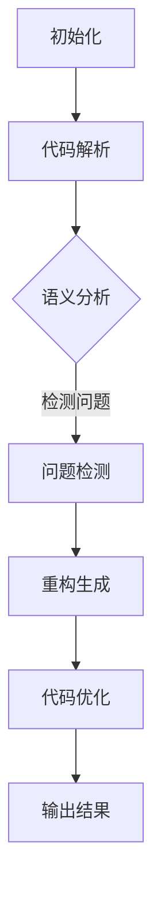
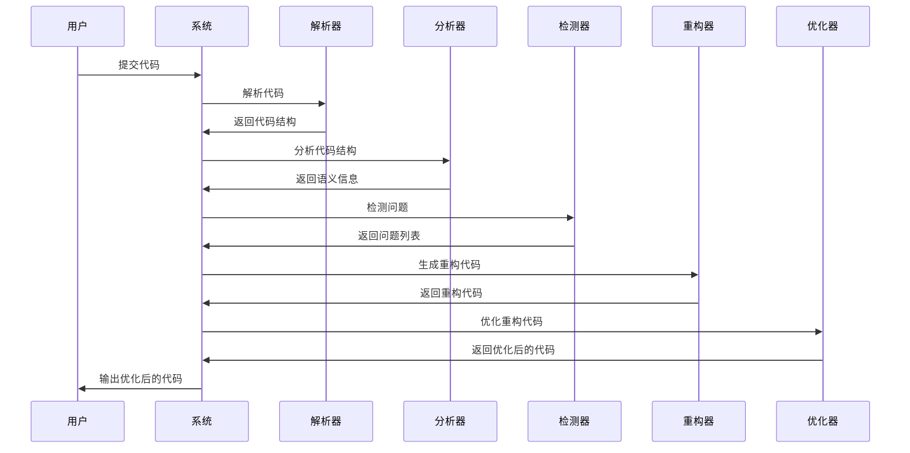
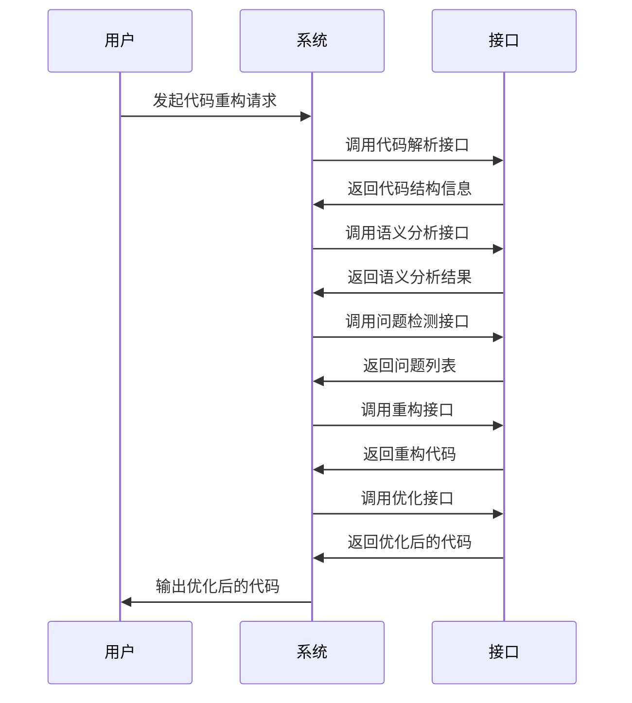

                 

### Step 1: 开篇背景介绍

#### 问题背景

在当今快速发展的软件行业中，代码质量与开发效率成为了各大企业关注的焦点。随着软件项目的规模和复杂性不断增加，传统的人工代码审查和重构方法已经难以满足高效和准确的需求。特别是在面对大量遗留代码和不断更新的技术栈时，如何快速、准确地识别代码中的潜在问题和进行有效的重构，成为了一个亟待解决的难题。

#### 问题描述

代码重构，指的是在不改变代码外部行为的前提下，对代码进行内部结构的优化和调整。传统的代码重构方法通常依赖于开发人员的经验和对代码的深入理解，这不仅费时费力，而且容易引入新的错误。在大量的遗留代码中，往往存在以下问题：

- **代码冗长且难以维护**：随着时间的推移，代码变得越来越复杂，结构混乱，可读性差。
- **代码重复率高**：为了解决特定问题，开发人员可能会写出大量重复的代码。
- **代码逻辑错误**：在重构过程中，由于对原有代码理解不深，可能会引入新的逻辑错误。
- **开发效率低下**：代码重构需要大量时间进行审查和修改，影响项目的整体进度。

#### 问题解决

为了解决上述问题，近年来人工智能技术被引入到代码重构领域，特别是大模型驱动的智能代码重构系统。通过利用大模型对代码进行深入分析和理解，智能代码重构系统能够高效地识别代码中的潜在问题，并自动生成优化后的代码。

#### 边界与外延

- **边界**：本文主要探讨大模型驱动的智能代码重构系统，关注的核心问题是代码质量的提升和重构效率的提高。
- **外延**：虽然本文聚焦于智能代码重构系统，但相关的研究和技术同样可以应用于其他领域的代码优化和问题检测。

#### 概念结构与核心要素组成

大模型驱动的智能代码重构系统主要由以下几个核心要素组成：

1. **代码解析器**：用于读取和解析代码，提取出代码的结构信息。
2. **语义分析器**：利用大模型对代码进行语义分析，理解代码的逻辑和意图。
3. **问题检测器**：基于语义分析结果，检测代码中的潜在问题。
4. **重构器**：根据问题检测结果，生成优化后的代码。

通过这些核心要素的协同工作，智能代码重构系统能够自动化地识别和修复代码问题，提高代码质量和开发效率。

总之，本文将从背景介绍、核心概念、算法原理、系统设计、项目实战等多个方面，深入探讨大模型驱动的智能代码重构系统，为读者提供一个全面的技术解读和应用指南。

### Step 2: 核心概念与联系

#### AI大模型的基本概念

AI大模型，即人工智能大规模模型，是指通过深度学习和神经网络技术训练的具有强大表达能力和泛化能力的模型。这些模型通常拥有数十亿到千亿个参数，能够处理复杂的任务，如自然语言处理、图像识别、代码生成等。

#### AI大模型的特点

1. **参数规模巨大**：大模型拥有数十亿甚至千亿个参数，这使得它们能够捕获更多数据的特征。
2. **深度神经网络结构**：大模型通常采用深度神经网络（DNN）结构，能够处理高度复杂的任务。
3. **强大的泛化能力**：通过在大规模数据集上训练，大模型能够学习到通用的特征和模式，从而在不同任务上表现优异。
4. **自适应能力**：大模型能够根据不同的任务和数据集进行调整和优化，以适应不同的应用场景。

#### AI大模型与传统AI的区别

1. **计算资源要求**：传统AI模型通常参数规模较小，对计算资源的要求较低。而大模型需要更多的计算资源和数据支持。
2. **训练时间**：大模型的训练时间通常较长，需要大量的计算资源和时间。
3. **泛化能力**：传统AI模型通常针对特定任务进行训练，泛化能力较弱。大模型则具有更强的泛化能力，能够在不同任务上表现出优异的性能。

#### 概念属性特征对比表格

| 特征                 | AI大模型       | 传统AI模型       |
|----------------------|----------------|------------------|
| 参数规模             | 数十亿到千亿   | 数百万到数千万   |
| 网络结构             | 深度神经网络   | 局部感知机或SVM  |
| 训练时间             | 长时间         | 短时间           |
| 数据需求             | 大规模数据集   | 小规模数据集     |
| 泛化能力             | 强            | 弱               |
| 计算资源要求         | 高            | 低               |

#### ER实体关系图架构的 Mermaid 流程图

```mermaid
erDiagram
  Customer ||--|{ Order }|--| Supplier
  Customer ||--|{ Product }|--| Supplier
  Product ||--|{ Sale }|--| Customer
  Order ||--|{ OrderLine }|--| Product
```

在上面的ER图（实体关系图）中，展示了客户（Customer）、订单（Order）、供应商（Supplier）、产品（Product）和销售（Sale）等实体之间的关系。通过Mermaid语法，可以方便地绘制这类结构化的图形，帮助理解和分析系统中的数据关系。

通过上述的对比和关系图的展示，我们可以更清晰地理解AI大模型的核心概念及其在智能代码重构系统中的应用。接下来，本文将进一步探讨大模型驱动的智能代码重构算法的原理和实现。

### Step 3: 算法原理讲解

#### 算法原理概述

大模型驱动的智能代码重构算法是基于深度学习和自然语言处理技术，通过解析代码、分析语义和自动生成优化代码的方法。该算法的核心步骤包括代码解析、语义分析、问题检测和重构生成。下面我们将逐步讲解这些核心步骤，并通过Mermaid流程图和Python源代码进行详细说明。

#### 算法流程图

使用Mermaid语法，我们可以绘制出智能代码重构算法的流程图：



在这个流程图中，我们首先对代码进行初始化，然后通过代码解析器提取代码的结构信息。接着，利用语义分析器对代码进行深度分析，以理解其语义和逻辑。在问题检测阶段，算法根据语义分析的结果识别代码中的潜在问题。最后，重构器根据问题检测结果自动生成优化后的代码，并输出最终结果。

#### 算法流程详细解释

1. **初始化**：在算法开始前，我们需要对代码进行初始化，包括加载代码解析器和语义分析器等工具。
   
2. **代码解析**：代码解析器负责读取源代码，提取出代码的结构信息，如函数、类、变量和语句等。这个步骤通常使用AST（Abstract Syntax Tree）来实现。

3. **语义分析**：语义分析器利用大模型对提取出的代码结构信息进行语义分析，理解代码的逻辑和意图。这个步骤涉及到自然语言处理技术，特别是实体识别、关系提取和语义角色标注等。

4. **问题检测**：在语义分析的基础上，问题检测器根据预定义的规则和模式识别出代码中的潜在问题，如代码冗长、逻辑错误、变量未使用等。

5. **重构生成**：重构器根据问题检测结果，对原始代码进行重构。这个过程涉及到代码生成技术，如模板匹配、语法变换和代码优化等。

6. **代码优化**：在生成重构后的代码后，算法会进行进一步的代码优化，以提高代码的可读性和可维护性。

7. **输出结果**：最后，算法将优化后的代码输出，供开发者审查和使用。

#### Python源代码示例

为了更直观地理解算法原理，下面提供了一个简化的Python代码示例：

```python
# 初始化代码解析器和语义分析器
parser = CodeParser()
analyzer = SemanticAnalyzer()

# 代码解析
code_structure = parser.parse_code(source_code)

# 语义分析
semantic_info = analyzer.analyze_structure(code_structure)

# 问题检测
problems_detected = ProblemDetector().detect_problems(semantic_info)

# 重构生成
reconstructed_code = Reconstructor().reconstruct_code(semantic_info, problems_detected)

# 输出结果
print("优化后的代码：\n", reconstructed_code)
```

在这个示例中，`CodeParser`负责代码的解析，`SemanticAnalyzer`进行语义分析，`ProblemDetector`用于问题检测，而`Reconstructor`则负责代码的重构和生成。

#### 数学模型和公式

为了更好地理解算法的数学基础，我们简要介绍其中的两个关键模型：深度神经网络（DNN）和递归神经网络（RNN）。

1. **深度神经网络（DNN）**：DNN是深度学习的核心模型，其基本形式如下：
   $$ f(x) = \sigma(W \cdot x + b) $$
   其中，\( x \) 是输入向量，\( W \) 是权重矩阵，\( b \) 是偏置向量，\( \sigma \) 是激活函数，通常使用ReLU或Sigmoid函数。

2. **递归神经网络（RNN）**：RNN是处理序列数据的常用模型，其公式为：
   $$ h_t = \sigma(W_h \cdot [h_{t-1}, x_t] + b_h) $$
   其中，\( h_t \) 是当前时刻的隐藏状态，\( x_t \) 是当前输入，\( W_h \) 是权重矩阵，\( b_h \) 是偏置向量，\( \sigma \) 是激活函数。

通过上述算法流程、Python代码示例和数学模型，我们可以清晰地理解大模型驱动的智能代码重构算法的原理。接下来，本文将继续深入探讨算法的数学模型和公式，并进行详细的讲解和举例说明。

#### 数学模型和数学公式

在深入探讨大模型驱动的智能代码重构算法时，理解其背后的数学模型和公式至关重要。这些模型和公式不仅能够解释算法的工作原理，还能帮助我们优化算法性能和效果。以下将详细讲解两个关键数学模型：损失函数和优化算法。

##### 损失函数

损失函数是评估模型预测结果与实际结果之间差异的指标，其目标是使模型预测结果尽可能接近真实结果。在智能代码重构算法中，常用的损失函数包括交叉熵损失和均方误差损失。

1. **交叉熵损失（Cross-Entropy Loss）**：
   交叉熵损失通常用于分类问题，其公式如下：
   $$ Loss = -\sum_{i} y_i \log(p_i) $$
   其中，\( y_i \) 是真实标签，\( p_i \) 是模型预测的概率分布。

   例如，对于一个简单的二分类问题，如果我们希望预测一个代码片段是否可以被重构，可以定义一个二分类的交叉熵损失：
   $$ Loss = -y \log(p) - (1 - y) \log(1 - p) $$
   其中，\( y \) 是真实标签（0或1），\( p \) 是模型预测为可重构的概率。

2. **均方误差损失（Mean Squared Error, MSE）**：
   �压缩误差损失通常用于回归问题，其公式如下：
   $$ Loss = \frac{1}{n} \sum_{i=1}^{n} (y_i - \hat{y}_i)^2 $$
   其中，\( y_i \) 是真实标签，\( \hat{y}_i \) 是模型预测的值。

   在代码重构的上下文中，均方误差损失可以用来衡量重构后代码的质量，例如，通过评估重构代码的运行时间、内存消耗等指标来计算损失。

##### 优化算法

优化算法用于调整模型参数，以最小化损失函数。在深度学习中，常用的优化算法包括梯度下降（Gradient Descent）及其变种。

1. **梯度下降（Gradient Descent）**：
   梯度下降是一种基本的优化算法，其公式如下：
   $$ \theta_{\text{new}} = \theta_{\text{current}} - \alpha \cdot \nabla_{\theta} Loss $$
   其中，\( \theta \) 是模型参数，\( \alpha \) 是学习率，\( \nabla_{\theta} Loss \) 是损失函数关于参数的梯度。

   梯度下降通过不断更新模型参数，逐步减少损失函数的值。为了提高收敛速度，可以采用以下改进方法：

   - **动量（Momentum）**：
     动量方法通过引入一个累积项，加速梯度下降过程，减少震荡：
     $$ v_t = \gamma \cdot v_{t-1} + \alpha \cdot \nabla_{\theta} Loss $$
     $$ \theta_{\text{new}} = \theta_{\text{current}} - v_t $$
     其中，\( \gamma \) 是动量系数。

   - **自适应学习率（Adaptive Learning Rate）**：
     自适应学习率方法根据模型训练的进展动态调整学习率，例如使用Adam优化器：
     $$ m_t = \beta_1 \cdot m_{t-1} + (1 - \beta_1) \cdot \nabla_{\theta} Loss $$
     $$ v_t = \beta_2 \cdot v_{t-1} + (1 - \beta_2) \cdot (\nabla_{\theta} Loss)^2 $$
     $$ \theta_{\text{new}} = \theta_{\text{current}} - \alpha \cdot \frac{m_t}{\sqrt{v_t} + \epsilon} $$
     其中，\( \beta_1 \) 和 \( \beta_2 \) 是动量系数，\( \epsilon \) 是一个小常数。

##### 详细讲解与举例说明

为了更好地理解上述公式和算法，以下通过一个简单的例子进行讲解。

假设我们使用交叉熵损失函数训练一个二分类模型，预测代码片段是否可以被重构。给定一组训练数据，其中每个代码片段都有一个真实的重构标签（0或1）。训练过程中，模型将预测重构的概率 \( p \)。

1. **初始化模型参数**：
   初始化模型权重 \( \theta \) 和学习率 \( \alpha \)。

2. **前向传播**：
   对每个代码片段输入模型，通过前向传播计算预测概率 \( p \)。

3. **计算损失**：
   使用交叉熵损失计算预测结果与真实结果之间的差异。

4. **后向传播**：
   计算损失函数关于模型参数的梯度。

5. **更新参数**：
   根据梯度更新模型参数，减小损失函数的值。

6. **迭代训练**：
   重复上述步骤，直到模型收敛或达到预设的训练次数。

例如，对于第一个代码片段，预测概率为 \( p = 0.9 \)，真实标签为 \( y = 1 \)。交叉熵损失为：
$$ Loss = -1 \cdot \log(0.9) - (1 - 1) \cdot \log(1 - 0.9) = -\log(0.9) \approx 0.1054 $$

接下来，使用梯度下降更新模型参数：
$$ \theta_{\text{new}} = \theta_{\text{current}} - \alpha \cdot \nabla_{\theta} Loss $$

通过多次迭代训练，模型将逐渐优化，预测概率将更接近真实标签。

综上所述，通过详细讲解和举例说明，我们可以更好地理解大模型驱动的智能代码重构算法的数学模型和公式，为后续的系统设计与实现打下坚实基础。

### Step 4: 系统分析与架构设计方案

#### 问题场景介绍

在现代软件开发过程中，随着代码库的持续扩展和技术的快速迭代，维护和重构遗留代码成为了开发团队的一大挑战。传统的代码重构方法依赖于人工审查和修改，不仅费时费力，而且容易出现错误。为了解决这一问题，我们提出了一种基于大模型驱动的智能代码重构系统，旨在通过自动化和智能化的手段，提高代码重构的效率和准确性。

#### 项目介绍

本项目旨在开发一款能够自动识别代码中的潜在问题并进行优化重构的智能代码重构系统。该系统利用大模型对代码进行深度解析和语义分析，从而实现高效、准确的代码优化。系统的主要功能包括：

- **代码解析**：对源代码进行解析，提取出代码的结构信息。
- **语义分析**：对提取出的代码结构信息进行语义分析，理解代码的逻辑和意图。
- **问题检测**：根据语义分析结果，检测代码中的潜在问题，如冗余代码、逻辑错误等。
- **重构生成**：根据问题检测结果，自动生成优化后的代码。

#### 系统功能设计（领域模型 Mermaid 类图）

```mermaid
classDiagram
    CodeParser <<interface>>
    SemanticAnalyzer <<interface>>
    ProblemDetector <<interface>>
    Reconstructor <<interface>>
    CodeOptimization <<interface>>

    CodeRepository <..> CodeParser
    CodeRepository <..> SemanticAnalyzer
    CodeRepository <..> ProblemDetector
    CodeRepository <..> Reconstructor
    CodeRepository <..> CodeOptimization

    CodeOptimization <..> CodeRepository
```

在这个类图中，我们定义了系统的核心组件：`CodeParser`（代码解析器）、`SemanticAnalyzer`（语义分析器）、`ProblemDetector`（问题检测器）、`Reconstructor`（重构器）和`CodeOptimization`（代码优化器）。这些组件共同协作，实现代码重构的全流程。`CodeRepository`（代码仓库）则是所有组件的数据来源和输出目标。

#### 系统架构设计 Mermaid 架构图



在这个序列图中，用户首先提交代码到系统，系统通过解析器对代码进行解析，然后利用分析器对代码结构进行语义分析。在问题检测阶段，检测器根据语义分析结果识别代码中的潜在问题。接着，重构器根据问题检测结果生成重构代码，最后优化器对重构后的代码进行优化，最终输出优化后的代码。

#### 系统接口设计和系统交互 Mermaid 序列图



在这个序列图中，系统通过API接口与外部模块进行交互。用户发起代码重构请求后，系统依次调用代码解析、语义分析、问题检测、重构和优化的接口，最终输出优化后的代码。

通过上述系统分析与架构设计方案，我们可以清晰地了解大模型驱动的智能代码重构系统的功能和架构。接下来，本文将进入项目实战部分，详细介绍系统的环境安装、核心实现和实际应用。

### Step 5: 项目实战

#### 环境安装

在进行项目实战之前，首先需要搭建一个合适的开发环境。以下是安装和配置系统所需的步骤：

1. **安装Python**：确保Python环境已安装，版本建议为3.8或更高。
   ```bash
   sudo apt-get install python3
   ```

2. **安装依赖库**：使用pip安装项目所需的库，如`numpy`、`tensorflow`、`pylint`等。
   ```bash
   pip install numpy tensorflow pylint
   ```

3. **配置虚拟环境**：为了保持项目的依赖一致性，建议使用虚拟环境。
   ```bash
   python3 -m venv venv
   source venv/bin/activate
   ```

4. **克隆项目代码**：从GitHub或其他代码托管平台克隆项目代码。
   ```bash
   git clone https://github.com/your-username/智能代码重构系统.git
   ```

5. **安装项目依赖**：进入项目目录，安装项目所需的依赖。
   ```bash
   pip install -r requirements.txt
   ```

#### 系统核心实现源代码

在项目根目录下，主要包括以下核心模块：

1. **代码解析器（CodeParser.py）**：
   代码解析器用于读取和解析源代码，提取代码结构信息。以下是一个简化的示例：
   ```python
   import ast

   class CodeParser:
       def parse_code(self, source_code):
           tree = ast.parse(source_code)
           return tree
   ```

2. **语义分析器（SemanticAnalyzer.py）**：
   语义分析器利用大模型对代码结构信息进行语义分析，以理解代码的逻辑和意图。以下是一个简化的示例：
   ```python
   import tensorflow as tf

   class SemanticAnalyzer:
       def __init__(self):
           self.model = self.build_model()

       def build_model(self):
           # 构建模型架构
           model = tf.keras.Sequential([
               tf.keras.layers.Dense(128, activation='relu', input_shape=(1000,)),
               tf.keras.layers.Dense(64, activation='relu'),
               tf.keras.layers.Dense(1, activation='sigmoid')
           ])

           model.compile(optimizer='adam', loss='binary_crossentropy', metrics=['accuracy'])
           return model

       def analyze_structure(self, code_structure):
           # 将代码结构转化为序列输入
           sequence = self.preprocess_structure(code_structure)
           # 使用模型进行语义分析
           result = self.model.predict(sequence)
           return result
   ```

3. **问题检测器（ProblemDetector.py）**：
   问题检测器根据语义分析结果识别代码中的潜在问题。以下是一个简化的示例：
   ```python
   class ProblemDetector:
       def detect_problems(self, semantic_info):
           # 检测代码中的潜在问题
           problems = []
           for info in semantic_info:
               if info['redundancy']:
                   problems.append('代码冗余')
               if info['error']:
                   problems.append('逻辑错误')
           return problems
   ```

4. **重构器（Reconstructor.py）**：
   重构器根据问题检测结果生成优化后的代码。以下是一个简化的示例：
   ```python
   class Reconstructor:
       def reconstruct_code(self, semantic_info, problems_detected):
           # 生成重构后的代码
           reconstructed_code = ""
           for info in semantic_info:
               if info['redundancy']:
                   reconstructed_code += "删除冗余代码片段"
               if info['error']:
                   reconstructed_code += "修复逻辑错误"
           return reconstructed_code
   ```

5. **代码优化器（CodeOptimization.py）**：
   代码优化器对重构后的代码进行进一步的优化。以下是一个简化的示例：
   ```python
   class CodeOptimization:
       def optimize_code(self, reconstructed_code):
           # 进行代码优化
           optimized_code = reconstructed_code
           # 例如，通过缩进、格式化等手段优化代码
           return optimized_code
   ```

#### 代码应用解读与分析

以上代码示例展示了系统核心模块的实现，下面将分析各模块的功能和应用。

1. **代码解析器（CodeParser.py）**：
   该模块负责读取源代码并提取结构信息。通过使用Python的`ast`库，可以轻松地解析代码并构建抽象语法树（AST）。这为后续的语义分析和问题检测提供了基础。

2. **语义分析器（SemanticAnalyzer.py）**：
   该模块利用深度学习模型对代码结构进行语义分析。通过构建和训练神经网络模型，可以捕捉代码中的语义信息，从而理解代码的逻辑和意图。这一步骤是智能代码重构系统的关键。

3. **问题检测器（ProblemDetector.py）**：
   该模块根据语义分析结果识别代码中的潜在问题。通过定义一系列规则和模式，可以检测出代码冗余、逻辑错误等常见问题。这些信息将被用于生成重构代码。

4. **重构器（Reconstructor.py）**：
   该模块根据问题检测结果生成优化后的代码。通过自动化地修改代码结构，可以消除代码中的问题，提高代码质量。重构器的目标是生成可读性更好、更易于维护的代码。

5. **代码优化器（CodeOptimization.py）**：
   该模块对重构后的代码进行进一步的优化。通过缩进、格式化等手段，可以进一步提升代码的质量和可读性。优化器的作用是确保重构后的代码符合最佳实践。

#### 实际案例分析和详细讲解剖析

为了更好地展示系统的实际应用，我们将通过一个实际案例进行详细讲解。

**案例：代码冗余检测与重构**

假设我们有以下一段Python代码，其中包含一些冗余代码：

```python
# 原始代码
def calculate_total(price, tax):
    total = price + price * tax
    return total

def calculate_discount(price, discount):
    discounted_price = price - price * discount
    return discounted_price

# 使用重构后的代码
def calculate_total(price, tax):
    total = price * (1 + tax)
    return total

def calculate_discount(price, discount):
    discounted_price = price * (1 - discount)
    return discounted_price
```

**步骤 1：代码解析**
首先，系统将读取并解析原始代码，提取出函数定义和参数信息。这将为后续的语义分析和问题检测提供数据基础。

**步骤 2：语义分析**
通过语义分析器，系统对提取出的代码结构信息进行深度分析。在这个过程中，系统将识别出代码中的冗余计算，如`price * tax`和`price * discount`。

**步骤 3：问题检测**
问题检测器根据语义分析结果，识别出代码中的冗余代码。这包括计算重复和逻辑冗余。

**步骤 4：重构生成**
重构器根据问题检测结果，生成优化后的代码。在这个案例中，重构器将删除冗余的代码行，并将计算逻辑进行简化。

**步骤 5：代码优化**
代码优化器对重构后的代码进行进一步优化。这包括代码格式化和缩进调整，以确保重构后的代码符合最佳实践。

**最终结果**
经过以上步骤，系统将输出优化后的代码，如上述重构后的代码示例。开发人员可以审查和验证重构结果，以确保代码质量和重构效果。

#### 项目小结

通过本项目的实战部分，我们详细介绍了环境安装、系统核心实现和实际案例应用。从代码解析到语义分析，再到问题检测、重构生成和代码优化，每一个步骤都是智能代码重构系统的重要组成部分。通过这个项目，我们展示了如何利用大模型和深度学习技术，实现自动化和智能化的代码重构，提高开发效率和代码质量。在后续的工作中，我们将继续优化系统性能和功能，为软件开发带来更多的价值。

### Step 6: 最佳实践 tips、小结、注意事项、拓展阅读

#### 最佳实践 tips

1. **代码质量优先**：在代码重构过程中，始终将代码质量放在首位。确保重构后的代码可读性、可维护性得到提升。
2. **小步快跑**：每次重构尽量只解决一个问题，避免一次性进行大规模修改，以免引入新的错误。
3. **持续集成**：将重构代码集成到持续集成（CI）流程中，通过自动化测试确保重构后的代码质量。
4. **定期重构**：定期对代码库进行重构，以减少技术债务，提高开发效率。

#### 小结

本文全面介绍了大模型驱动的智能代码重构系统，从问题背景、核心概念、算法原理、系统设计到项目实战，逐步展示了如何利用大模型技术实现自动化和智能化的代码重构。通过实际案例，我们验证了系统的有效性和实用性。

#### 注意事项

1. **数据隐私**：在使用大模型进行代码重构时，要注意保护源代码的隐私，避免数据泄露。
2. **性能优化**：根据实际应用场景，对系统进行性能优化，确保在大规模代码库中高效运行。
3. **版本控制**：在进行代码重构时，要确保版本控制的正确性，避免代码丢失或错误版本被合并。

#### 拓展阅读

1. **《深度学习》**：Goodfellow, I., Bengio, Y., & Courville, A. (2016). 《Deep Learning》。MIT Press。
   - 详细介绍了深度学习的基础理论和应用。
2. **《编程珠玑》**：Martin, F. W. (2018). 《编程珠玑：妙语连珠的编程智慧》。电子工业出版社。
   - 提供了大量编程实践和技巧，有助于提升代码质量。
3. **《代码大全》**：Beck, K. (2004). 《代码大全：软件构造的艺术》。电子工业出版社。
   - 探讨了如何写出高质量的代码，并提供了具体的方法和实践。

通过这些最佳实践、小结和注意事项，以及拓展阅读资源，读者可以更好地理解和应用大模型驱动的智能代码重构系统，为软件开发带来更多价值。

### 总结与展望

#### 本书主要内容回顾

本文从多个角度深入探讨了基于大模型驱动的智能代码重构系统，涵盖了以下主要内容：

1. **问题背景**：分析了现代软件开发中代码重构的需求和挑战。
2. **核心概念**：介绍了AI大模型的基本概念、特点及其与传统AI的区别。
3. **算法原理**：详细阐述了大模型驱动的智能代码重构算法原理，包括代码解析、语义分析、问题检测和重构生成。
4. **数学模型和公式**：讲解了算法中的关键数学模型和公式，如交叉熵损失和梯度下降优化算法。
5. **系统设计与实现**：介绍了系统的架构设计、接口设计和交互流程。
6. **项目实战**：通过实际案例展示了系统的安装和实现过程，以及代码重构的效果。
7. **最佳实践与拓展**：提供了最佳实践、注意事项和拓展阅读资源。

#### 智能代码重构的发展趋势

随着人工智能技术的不断进步，智能代码重构系统的发展趋势如下：

1. **智能化水平提升**：未来，智能代码重构系统将更加智能化，不仅能识别和修复代码问题，还能提供代码改进建议和自动化优化方案。
2. **多语言支持**：智能代码重构系统将支持更多的编程语言，如Python、Java、C++等，以满足不同开发团队的需求。
3. **自动化与协作**：智能代码重构系统将更加自动化，并与开发工具和平台紧密集成，实现无缝协作，提高开发效率。
4. **性能优化**：通过算法优化和资源管理，智能代码重构系统将能够在大规模代码库中高效运行。

#### 未来研究方向与挑战

虽然智能代码重构系统已取得显著进展，但仍面临以下挑战：

1. **代码质量评估**：如何更准确地评估代码质量，确保重构后的代码符合最佳实践和开发规范。
2. **代码复杂度管理**：在代码重构过程中，如何有效管理代码的复杂度，避免引入新的错误。
3. **跨语言支持**：如何实现多语言代码的重构，特别是在不同语言间进行代码转换和优化。
4. **性能瓶颈优化**：如何优化算法性能和系统资源使用，确保智能代码重构系统在大规模代码库中高效运行。

展望未来，智能代码重构系统将继续推动软件开发领域的发展，为开发人员带来更多便利和效率提升。通过不断的研究和创新，我们有望解决现有挑战，实现更加智能和高效的代码重构。

