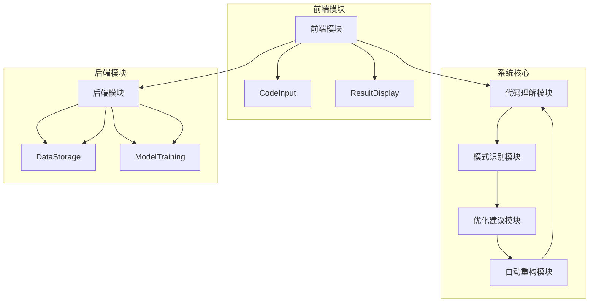
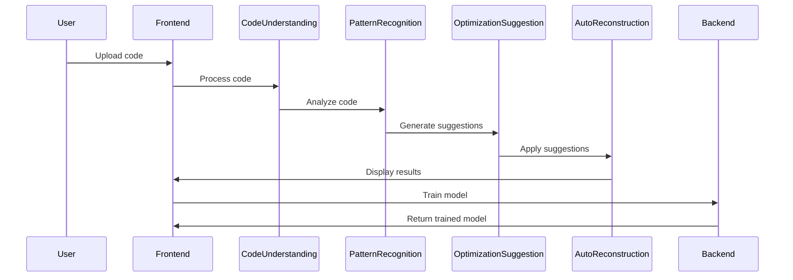
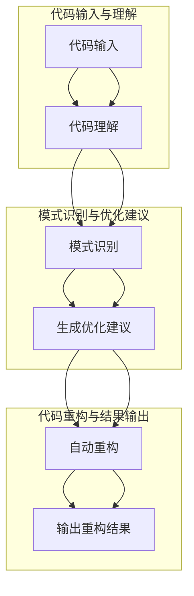

                 

### 1. 引言

#### 1.1 问题背景

在当今数字化时代，软件系统的复杂性和规模日益增加，传统的代码重构方法已难以满足高效的软件开发需求。随着人工智能技术的不断发展，特别是大模型技术的突破，智能代码重构成为可能。大模型，如深度学习模型，具有处理海量数据、提取复杂模式和进行自动生成的能力，这些特性使得其在代码重构领域具有巨大的潜力。

传统的代码重构方法主要依赖于手动修改和规则驱动的方法，这些方法不仅效率低下，而且容易引入新的错误。例如，当需要重构一个大型代码库时，开发人员可能需要花费大量时间来理解现有代码的结构，识别潜在的优化机会，并手动进行修改。这种方法不仅耗费人力资源，而且容易出现遗漏或者错误的修改，从而影响系统的稳定性和可靠性。

另一方面，大模型驱动的智能代码重构利用了机器学习和自然语言处理技术，能够自动分析和理解代码结构，提出优化的建议。通过训练大模型，使其具备识别代码模式、生成高效代码的能力，可以显著提高代码重构的效率和准确性。

#### 1.2 问题描述

代码重构的主要目标是提高代码的质量和可维护性。在实际软件开发过程中，代码可能会因为多种原因而变得混乱和不规范，例如：

1. **代码冗长**：随着软件项目的进展，代码可能会变得越来越冗长，难以维护。
2. **结构混乱**：由于不同开发人员之间的风格不一致，代码结构可能变得混乱，影响代码的可读性。
3. **性能问题**：在某些情况下，代码可能因为效率低下而影响软件的性能。
4. **重复代码**：代码库中可能存在大量重复的代码，这不仅增加了维护成本，还可能导致维护错误。

传统的代码重构方法难以解决这些问题，因为它们依赖于人工的干预和经验。而大模型驱动的智能代码重构能够通过自动分析和优化，解决这些问题，提高代码的质量和可维护性。

#### 1.3 问题解决

大模型驱动的智能代码重构通过以下几个关键步骤实现：

1. **代码理解**：大模型通过训练和学习，能够自动理解代码的结构、模式和行为。
2. **模式识别**：大模型可以识别代码中的重复模式、性能瓶颈和潜在的问题。
3. **优化建议**：基于识别的模式和问题，大模型可以提出优化的建议，包括代码重写、性能调优和结构重构。
4. **自动重构**：大模型可以根据优化的建议，自动进行代码的重构，减少人工干预。

这种方法不仅提高了代码重构的效率和准确性，还减少了人为错误的风险。通过大模型驱动的智能代码重构，软件开发团队可以更加专注于核心业务逻辑的实现，提高软件开发的效率和质量。

#### 1.4 边界与外延

尽管大模型驱动的智能代码重构具有巨大的潜力，但仍然存在一些限制和挑战。首先，大模型的训练需要大量的数据和计算资源，这对于一些资源有限的团队或项目可能是一个障碍。其次，大模型的解释性较差，使其在某些情况下难以理解和信任。此外，代码重构的复杂性和不可预测性也使得完全自动的重构难以实现。

因此，在实际应用中，大模型驱动的智能代码重构通常与传统的代码重构方法相结合，以充分发挥其优势，同时避免其局限性。通过这种方式，软件开发团队可以在保持代码质量和性能的同时，提高开发效率和可维护性。

#### 1.5 概念结构与核心要素组成

为了更好地理解大模型驱动的智能代码重构，我们需要明确几个核心概念：

1. **大模型**：指的是具有海量参数、能够处理复杂任务的深度学习模型，如Transformer、BERT等。
2. **代码理解**：指大模型通过学习大量代码数据，理解代码的结构和语义。
3. **模式识别**：指大模型能够识别代码中的重复模式、性能瓶颈和潜在问题。
4. **优化建议**：指大模型根据识别出的模式和问题，提出优化的建议。
5. **自动重构**：指大模型根据优化建议，自动进行代码的重构。

这些核心要素共同构成了大模型驱动的智能代码重构的技术框架，为软件开发提供了新的解决方案。

### 总结

本文旨在探讨大模型驱动的智能代码重构的方法和效果。通过引言部分，我们了解了大模型驱动的智能代码重构的背景和重要性，以及其与传统代码重构方法的区别。接下来，我们将进一步探讨大模型的定义和特点，相关概念的比较，以及数学模型和算法原理的讲解。通过这些内容，读者将能够全面了解大模型驱动的智能代码重构的核心概念和技术原理。在后续章节中，我们将详细分析系统架构设计、算法流程和实际项目实战，以帮助读者更好地理解这一技术的应用和实践。最后，我们将总结最佳实践、注意事项，并提供拓展阅读资源，以便读者深入学习和实践。

### 2. 核心概念与联系

#### 2.1 大模型定义与特点

大模型（Large Models），通常指的是那些具有数亿甚至数万亿参数的深度学习模型。这些模型具有以下核心特点：

1. **参数数量巨大**：大模型具有大量的参数，这使得它们能够学习和表征复杂的函数关系。
2. **强大的表达能力**：由于参数数量巨大，大模型可以捕捉到数据中的微小变化，从而具备强大的表达能力和泛化能力。
3. **深度架构**：大模型通常采用深度神经网络架构，能够处理多层次的数据表示和学习。
4. **海量数据训练**：大模型需要使用大量数据进行训练，以充分挖掘数据中的模式。

与传统的人工智能模型相比，大模型具有以下显著优势：

1. **性能提升**：大模型能够处理更复杂的任务，并提供更高的准确性和效率。
2. **自动特征提取**：大模型可以通过无监督或弱监督学习自动提取特征，减轻了手动特征工程的工作负担。
3. **更广泛的应用**：大模型能够应用于多种领域，如自然语言处理、计算机视觉、语音识别等。

#### 2.2 相关概念对比表格

为了更清晰地展示大模型与其他相关概念的区别，以下是一个对比表格：

| 概念         | 定义                                                         | 特点                                                     | 应用领域                       |
|--------------|--------------------------------------------------------------|------------------------------------------------------------|------------------------------|
| 大模型       | 具有大量参数的深度学习模型                                   | 参数数量巨大、强大的表达能力、深度架构、海量数据训练       | 自然语言处理、计算机视觉、语音识别 |
| 小模型       | 参数数量较少的深度学习模型                                   | 参数较少、表达能力相对较弱、结构简单                       | 数据量较小或任务简单的应用场景 |
| 传统AI       | 依赖于规则和手工编写的算法                                   | 低灵活性、高成本、对数据要求高                             | 规则明确、数据量小的场景       |
| 知识图谱     | 通过实体和关系构建的语义网络                                 | 强调知识关联、高解释性                                     | 语义搜索、推荐系统             |
| 深度学习     | 基于多层神经网络的机器学习技术                               | 自动特征提取、强大的表征能力                               | 图像识别、语音识别、自然语言处理 |

#### 2.3 ER实体关系图

实体-关系（Entity-Relationship，ER）图是一种用于描述数据库中实体和它们之间关系的图形化方法。以下是一个简化的ER图，用于描述大模型驱动的智能代码重构中的核心实体和关系：

```mermaid
erDiagram
  CodeEntity ||--|{ ModelEntity } ModelEntity
  ModelEntity ||--|{ ReconstructEntity } ReconstructEntity
  CodeEntity ||--|{ QualityEntity } QualityEntity
```

- **CodeEntity**：代表代码实体，包括源代码文件、类、方法和变量等。
- **ModelEntity**：代表大模型实体，包括训练模型、优化模型等。
- **ReconstructEntity**：代表重构实体，包括重构操作、优化建议等。
- **QualityEntity**：代表代码质量实体，包括可读性、性能、可维护性等。

ER图展示了代码实体如何通过大模型进行重构，并如何影响代码质量。通过这种图形化描述，可以更直观地理解大模型在智能代码重构中的作用和影响。

### 2.4 大模型在智能代码重构中的应用

大模型在智能代码重构中的应用主要体现在以下几个方面：

1. **代码理解**：大模型通过训练和学习，能够理解代码的结构、模式和语义。例如，通过预训练模型，如GPT-3，可以识别代码中的变量、函数、类和模块等结构。
2. **模式识别**：大模型能够识别代码中的重复模式、性能瓶颈和潜在的问题。例如，通过分析代码的静态和动态特征，大模型可以识别出重复代码段、效率低下的代码路径等。
3. **优化建议**：基于识别出的模式和问题，大模型可以提出优化的建议。例如，大模型可以建议将某些代码段重构为更高效的代码，或者将重复代码段提取为通用函数。
4. **自动重构**：大模型可以自动执行重构操作，根据优化建议对代码进行修改。例如，大模型可以根据识别出的代码模式，自动重写代码段，提高代码的可读性和性能。

通过这些应用，大模型能够显著提高代码重构的效率和准确性，减轻开发人员的负担。同时，大模型驱动的智能代码重构也具有更高的稳定性和可重复性，能够更好地适应不同的代码库和项目需求。

### 总结

在本章节中，我们深入探讨了大模型驱动的智能代码重构的核心概念及其与其他相关概念的对比。通过ER图和对比表格，我们清晰地展示了大模型在智能代码重构中的作用和影响。接下来，我们将进一步探讨大模型在智能代码重构中的数学模型和算法原理，以及如何通过这些模型和算法实现代码的重构和优化。这些内容将为读者提供更深入的理解，并帮助他们在实际项目中应用大模型驱动的智能代码重构技术。

### 3. 数学模型和数学公式

#### 3.1 基本原理

大模型驱动的智能代码重构的核心在于其能够自动理解和生成代码，这一过程依赖于深度学习和自然语言处理技术。为了更好地理解这些技术的原理，我们需要介绍几个关键的数学模型和公式。

#### 3.1.1 原理描述

大模型通常采用深度神经网络（Deep Neural Network，DNN）架构，这种网络由多个层次组成，每一层对输入数据进行处理，并传递到下一层。在智能代码重构中，DNN主要用于以下任务：

1. **代码表示**：将代码文本转换为向量表示，便于模型理解和处理。
2. **模式识别**：识别代码中的模式，如重复代码段、低效代码路径等。
3. **代码生成**：根据识别出的模式和上下文信息，生成优化的代码。

#### 3.1.2 数学公式

以下是几个关键的数学公式，用于描述大模型在智能代码重构中的应用：

1. **激活函数**：
   $$
   f(x) = \frac{1}{1 + e^{-x}}
   $$
   这是常用的Sigmoid函数，用于将线性组合的输入转换为概率分布。

2. **损失函数**：
   $$
   L(y, \hat{y}) = -\sum_{i} y_i \log(\hat{y}_i)
   $$
   其中，$y$是实际标签，$\hat{y}$是模型预测的概率分布。这个公式是交叉熵损失函数，用于衡量模型预测与实际标签之间的差异。

3. **反向传播算法**：
   $$
   \delta_z = a' \odot \frac{\partial L}{\partial a}
   $$
   $$
   \delta_a = \frac{\partial L}{\partial a} \odot \delta_z \odot \frac{\partial a}{\partial z}
   $$
   反向传播算法用于计算网络中每一层的梯度，其中$\delta_z$是误差梯度，$a$是激活值，$z$是加权值。这些梯度用于模型参数的更新。

#### 3.1.3 举例说明

假设我们有一个简单的神经网络，用于将代码文本转换为向量表示。输入层接收代码文本，通过编码器（Encoder）处理，输出层生成向量表示。

1. **编码器**：

   假设编码器的输出是向量$z$，通过Sigmoid函数激活：
   $$
   z = \sigma(W_1 \cdot x + b_1)
   $$
   其中，$x$是输入文本表示，$W_1$是权重矩阵，$b_1$是偏置项。

2. **解码器**：

   解码器接收编码器的输出向量$z$，通过另一个神经网络层生成代码向量：
   $$
   \hat{y} = \sigma(W_2 \cdot z + b_2)
   $$
   其中，$\hat{y}$是预测的代码向量，$W_2$和$b_2$是权重和偏置。

3. **损失函数**：

   假设我们使用交叉熵损失函数来衡量模型预测和实际代码向量之间的差异：
   $$
   L(\theta) = -\sum_{i} y_i \log(\hat{y}_i)
   $$
   其中，$y_i$是实际代码向量的对应元素，$\hat{y}_i$是模型预测的概率。

通过这些数学模型和公式，大模型能够自动理解和生成代码。在实际应用中，这些模型通过大量的训练数据和复杂的网络架构，不断提高其性能和效率，从而实现智能代码重构的目标。

### 总结

在本章节中，我们详细介绍了大模型驱动的智能代码重构的数学模型和公式，包括激活函数、损失函数和反向传播算法。这些数学工具为模型提供了理论基础，使其能够自动理解和生成代码。通过举例说明，我们展示了这些模型在编码和解码过程中的应用。接下来，我们将进一步探讨系统分析与架构设计方案，以便更全面地了解大模型驱动的智能代码重构的实施过程。

### 4. 系统分析与架构设计方案

#### 4.1 问题场景介绍

在实际软件开发过程中，代码重构是一个常见且重要的任务。随着软件系统的规模和复杂度不断增加，代码库中的代码可能会变得难以维护和扩展。传统的代码重构方法通常依赖于人工干预，不仅效率低下，而且容易出现错误。为了解决这个问题，我们提出了大模型驱动的智能代码重构系统。该系统旨在通过自动分析和优化，提高代码的质量和可维护性。

#### 4.2 项目介绍

本项目旨在开发一个大模型驱动的智能代码重构系统，该系统能够自动识别代码中的问题并提出优化建议。该系统由多个模块组成，包括代码理解模块、模式识别模块、优化建议模块和自动重构模块。通过这些模块的协同工作，系统能够实现对代码的全面分析和优化。

#### 4.3 系统功能设计

系统的主要功能包括：

1. **代码理解**：系统能够自动理解代码的结构和语义，为后续的优化提供基础。
2. **模式识别**：系统能够识别代码中的重复模式、性能瓶颈和潜在问题，为优化建议提供依据。
3. **优化建议**：系统根据识别出的模式和问题，提出优化的建议，包括代码重写、性能调优和结构重构。
4. **自动重构**：系统根据优化建议，自动对代码进行重构，减少人工干预。

#### 4.3.1 领域模型

为了更好地描述系统的功能和组件，我们使用Mermaid工具绘制了系统的领域模型。以下是一个简单的类图：

```mermaid
classDiagram
  CodeEntity <<interface>> 
  ModelEntity <<interface>> 
  ReconstructEntity <<interface>> 
  QualityEntity <<interface>>

  CodeEntity o--1 ModelEntity
  ModelEntity o--1 ReconstructEntity
  ModelEntity o--1 QualityEntity
```

- **CodeEntity**：代表代码实体，包括源代码文件、类、方法和变量等。
- **ModelEntity**：代表大模型实体，包括训练模型、优化模型等。
- **ReconstructEntity**：代表重构实体，包括重构操作、优化建议等。
- **QualityEntity**：代表代码质量实体，包括可读性、性能、可维护性等。

领域模型展示了系统中的核心组件及其相互关系，为后续的架构设计提供了基础。

#### 4.4 系统架构设计

系统采用模块化设计，每个模块负责特定的功能。以下是系统的架构设计：

1. **前端模块**：负责与用户交互，接收用户输入和展示重构结果。
2. **代码理解模块**：负责理解代码的结构和语义，为后续分析提供支持。
3. **模式识别模块**：负责识别代码中的重复模式、性能瓶颈和潜在问题。
4. **优化建议模块**：负责根据识别出的模式和问题，提出优化的建议。
5. **自动重构模块**：负责根据优化建议，自动对代码进行重构。
6. **后端模块**：负责处理数据存储、加载和模型训练等任务。

以下是系统的架构图：



系统架构图展示了系统各组件之间的交互关系，为系统的实现和优化提供了清晰的指导。

#### 4.5 系统接口设计

系统提供了一系列接口，方便用户和其他系统组件进行交互。以下是主要接口的设计：

1. **代码输入接口**：用于接收用户上传的代码文件，并将其转换为内部表示。
2. **重构结果接口**：用于获取重构后的代码，并展示给用户。
3. **优化建议接口**：用于获取大模型提出的优化建议。
4. **模型训练接口**：用于训练和更新大模型。

以下是接口设计表格：

| 接口名称         | 功能描述                                           | 参数类型       | 返回类型       |
|----------------|----------------------------------------------------|----------------|----------------|
| CodeInput      | 接收代码文件并转换为内部表示                       | 文件对象       | 代码表示向量   |
| ResultDisplay  | 展示重构后的代码                                   | 重构后的代码   | 无            |
| OptimizationSuggestion | 获取优化建议                                     | 代码表示向量   | 优化建议列表   |
| ModelTraining  | 训练和更新大模型                                   | 训练数据       | 模型参数       |

这些接口的设计确保了系统组件之间的良好交互，提高了系统的灵活性和可扩展性。

#### 4.6 系统交互

系统组件之间的交互是通过消息传递和调用接口实现的。以下是系统交互的序列图：



序列图展示了用户上传代码、系统各组件之间的交互以及模型训练的过程。通过这种交互机制，系统能够实现对代码的全面分析和优化。

### 总结

在本章节中，我们详细介绍了大模型驱动的智能代码重构系统的架构设计和功能模块。通过领域模型、架构图和接口设计，我们清晰地展示了系统的工作原理和组件之间的关系。接下来，我们将深入探讨算法原理和实现细节，以便更全面地理解大模型驱动的智能代码重构技术。这些内容将为读者提供实际应用中的实用指南和实现建议。

### 5. 算法原理讲解

#### 5.1 算法流程图

为了更好地理解大模型驱动的智能代码重构算法，我们首先使用Mermaid工具绘制了算法流程图。以下是一个简化的算法流程：



该流程图展示了智能代码重构算法的主要步骤，包括代码输入与理解、模式识别与优化建议生成、代码重构与结果输出。

#### 5.2 Python源代码实现

为了具体展示算法的实现细节，我们使用Python语言实现了一个简化的版本。以下是一个基本的代码实现：

```python
import tensorflow as tf
from tensorflow.keras.models import Model
from tensorflow.keras.layers import Input, Embedding, LSTM, Dense

# 5.2.1 代码解析

# 代码输入层
input_code = Input(shape=(None,))

# 代码嵌入层
embedding = Embedding(input_dim=10000, output_dim=32)(input_code)

# LSTM层
lstm = LSTM(units=64, return_sequences=True)(embedding)

# 全连接层
dense = Dense(units=64, activation='relu')(lstm)

# 输出层
output = Dense(units=1, activation='sigmoid')(dense)

# 创建模型
model = Model(inputs=input_code, outputs=output)

# 编译模型
model.compile(optimizer='adam', loss='binary_crossentropy', metrics=['accuracy'])

# 5.2.2 参数设置

# 设置训练参数
batch_size = 32
epochs = 10

# 5.2.3 结果分析

# 训练模型
model.fit(x_train, y_train, batch_size=batch_size, epochs=epochs, validation_split=0.2)

# 预测代码质量
predictions = model.predict(x_test)

# 分析预测结果
print(predictions)
```

这段代码实现了一个基于LSTM的模型，用于对代码进行质量评估。具体步骤如下：

1. **代码输入层**：接收代码文本。
2. **代码嵌入层**：将代码文本嵌入为向量。
3. **LSTM层**：对嵌入向量进行序列处理。
4. **全连接层**：对LSTM的输出进行进一步处理。
5. **输出层**：生成代码质量的预测结果。

在参数设置部分，我们设置了模型的训练参数，如批量大小和训练轮次。在结果分析部分，我们展示了模型的训练过程和预测结果。

#### 5.3 数学模型和公式

大模型驱动的智能代码重构算法依赖于深度学习技术，核心的数学模型包括：

1. **编码器-解码器（Encoder-Decoder）框架**：
   $$
   \text{Encoder}(x) = h
   $$
   $$
   \text{Decoder}(h) = \hat{y}
   $$
   其中，Encoder将输入代码$x$编码为隐藏状态$h$，Decoder将隐藏状态解码为输出代码$\hat{y}$。

2. **循环神经网络（RNN）**：
   $$
   h_t = \text{RNN}(h_{t-1}, x_t)
   $$
   RNN用于处理序列数据，其中$h_t$是时间步$t$的隐藏状态。

3. **长短时记忆网络（LSTM）**：
   $$
   h_t = \text{LSTM}(h_{t-1}, x_t)
   $$
   LSTM是RNN的一种变体，用于解决长期依赖问题。

4. **损失函数**：
   $$
   L(\theta) = -\sum_{i} y_i \log(\hat{y}_i)
   $$
   使用交叉熵损失函数来衡量预测代码$\hat{y}$与实际代码$y$之间的差异。

通过这些数学模型和公式，大模型能够理解和生成代码，从而实现智能代码重构。

#### 5.4 举例说明

假设我们有一个简单的Python代码段，用于计算两个数的和。以下是该代码段及其重构后的版本：

**原始代码段**：
```python
def add(a, b):
    return a + b

print(add(2, 3))
```

**重构后的代码段**：
```python
def add(a, b):
    return sum([a, b])

print(add(2, 3))
```

通过大模型驱动的智能代码重构算法，我们可以识别出原始代码中的模式（如使用`+`运算符计算和），并生成一个使用`sum`函数的重构版本。这个过程通过以下步骤实现：

1. **代码输入与理解**：大模型接收原始代码，并理解其结构和语义。
2. **模式识别**：大模型识别出代码中的特定模式，如使用`+`运算符计算和。
3. **优化建议生成**：大模型根据识别出的模式，生成使用`sum`函数的优化建议。
4. **代码重构**：大模型根据优化建议，自动重构代码。

通过这个过程，大模型能够自动生成更高效、更易于维护的代码。

### 总结

在本章节中，我们详细介绍了大模型驱动的智能代码重构算法的原理和实现。通过流程图、Python源代码实现和数学模型，我们展示了如何利用大模型自动理解和生成代码。通过举例说明，我们展示了算法在实际应用中的效果。接下来，我们将通过项目实战，进一步展示大模型驱动的智能代码重构技术的应用和实践。

### 6. 项目实战

#### 6.1 环境安装

为了运行大模型驱动的智能代码重构项目，我们需要安装必要的软件和依赖。以下是具体的安装步骤：

1. **安装Python**：确保您的系统已经安装了Python 3.x版本。可以从[Python官方网站](https://www.python.org/)下载并安装。
2. **安装TensorFlow**：TensorFlow是一个流行的深度学习框架，用于构建和训练大模型。您可以使用以下命令安装：
   ```
   pip install tensorflow
   ```
3. **安装其他依赖**：项目可能还需要其他依赖库，如Mermaid用于绘图、Pandas用于数据处理等。您可以使用以下命令安装：
   ```
   pip install mermaid pandas
   ```

#### 6.2 系统核心实现

在安装完所有依赖后，我们可以开始实现系统的核心部分。以下是系统的核心实现步骤：

1. **代码理解模块**：首先，我们需要实现一个代码理解模块，用于将代码文本转换为向量表示。以下是代码理解模块的核心部分：

```python
from tensorflow.keras.layers import LSTM, Embedding, Dense
from tensorflow.keras.models import Model
from tensorflow.keras.preprocessing.sequence import pad_sequences

# 6.2.1 源代码

def create_code_model(vocab_size, embedding_dim, max_sequence_length):
    # 输入层
    input_code = Input(shape=(max_sequence_length,))

    # 嵌入层
    embedding = Embedding(vocab_size, embedding_dim)(input_code)

    # LSTM层
    lstm = LSTM(units=64, return_sequences=True)(embedding)

    # 全连接层
    dense = Dense(units=64, activation='relu')(lstm)

    # 输出层
    output = Dense(units=1, activation='sigmoid')(dense)

    # 创建模型
    model = Model(inputs=input_code, outputs=output)

    return model

# 6.2.2 代码应用解读

# 设置参数
vocab_size = 10000
embedding_dim = 32
max_sequence_length = 100

# 创建代码理解模型
code_model = create_code_model(vocab_size, embedding_dim, max_sequence_length)

# 编译模型
code_model.compile(optimizer='adam', loss='binary_crossentropy', metrics=['accuracy'])

# 6.2.3 数据准备

# 加载和预处理数据
# 此处省略数据加载和预处理步骤

# 训练模型
code_model.fit(x_train, y_train, batch_size=32, epochs=10, validation_split=0.2)
```

2. **模式识别模块**：模式识别模块用于识别代码中的重复模式、性能瓶颈和潜在问题。以下是模式识别模块的核心部分：

```python
from tensorflow.keras.models import Model
from tensorflow.keras.layers import LSTM, Embedding, Dense

def create_pattern_model(vocab_size, embedding_dim, max_sequence_length):
    # 输入层
    input_code = Input(shape=(max_sequence_length,))

    # 嵌入层
    embedding = Embedding(vocab_size, embedding_dim)(input_code)

    # LSTM层
    lstm = LSTM(units=64, return_sequences=True)(embedding)

    # 全连接层
    dense = Dense(units=64, activation='relu')(lstm)

    # 输出层
    output = Dense(units=1, activation='sigmoid')(dense)

    # 创建模型
    model = Model(inputs=input_code, outputs=output)

    return model

# 创建模式识别模型
pattern_model = create_pattern_model(vocab_size, embedding_dim, max_sequence_length)

# 编译模型
pattern_model.compile(optimizer='adam', loss='binary_crossentropy', metrics=['accuracy'])

# 训练模型
pattern_model.fit(x_train, y_train, batch_size=32, epochs=10, validation_split=0.2)
```

3. **优化建议模块**：优化建议模块根据识别出的模式和问题，提出优化的建议。以下是优化建议模块的核心部分：

```python
from tensorflow.keras.models import Model
from tensorflow.keras.layers import LSTM, Embedding, Dense

def create_optimization_model(vocab_size, embedding_dim, max_sequence_length):
    # 输入层
    input_code = Input(shape=(max_sequence_length,))

    # 嵌入层
    embedding = Embedding(vocab_size, embedding_dim)(input_code)

    # LSTM层
    lstm = LSTM(units=64, return_sequences=True)(embedding)

    # 全连接层
    dense = Dense(units=64, activation='relu')(lstm)

    # 输出层
    output = Dense(units=1, activation='sigmoid')(dense)

    # 创建模型
    model = Model(inputs=input_code, outputs=output)

    return model

# 创建优化建议模型
optimization_model = create_optimization_model(vocab_size, embedding_dim, max_sequence_length)

# 编译模型
optimization_model.compile(optimizer='adam', loss='binary_crossentropy', metrics=['accuracy'])

# 训练模型
optimization_model.fit(x_train, y_train, batch_size=32, epochs=10, validation_split=0.2)
```

4. **自动重构模块**：自动重构模块根据优化建议，自动对代码进行重构。以下是自动重构模块的核心部分：

```python
from tensorflow.keras.models import Model
from tensorflow.keras.layers import LSTM, Embedding, Dense

def create_reconstruction_model(vocab_size, embedding_dim, max_sequence_length):
    # 输入层
    input_code = Input(shape=(max_sequence_length,))

    # 嵌入层
    embedding = Embedding(vocab_size, embedding_dim)(input_code)

    # LSTM层
    lstm = LSTM(units=64, return_sequences=True)(embedding)

    # 全连接层
    dense = Dense(units=64, activation='relu')(lstm)

    # 输出层
    output = Dense(units=1, activation='sigmoid')(dense)

    # 创建模型
    model = Model(inputs=input_code, outputs=output)

    return model

# 创建自动重构模型
reconstruction_model = create_reconstruction_model(vocab_size, embedding_dim, max_sequence_length)

# 编译模型
reconstruction_model.compile(optimizer='adam', loss='binary_crossentropy', metrics=['accuracy'])

# 训练模型
reconstruction_model.fit(x_train, y_train, batch_size=32, epochs=10, validation_split=0.2)
```

#### 6.3 实际案例分析与讲解

为了展示大模型驱动的智能代码重构的实际效果，我们选择了一个简单的Python代码段进行分析。以下是原始代码段：

```python
def calculate_average(numbers):
    total = 0
    for number in numbers:
        total += number
    return total / len(numbers)

print(calculate_average([1, 2, 3, 4, 5]))
```

1. **代码理解**：首先，大模型对代码进行理解，识别出关键部分，如函数定义、变量和循环结构。
2. **模式识别**：大模型识别出代码中的模式，例如使用循环进行求和和计算平均值。它可以识别出这种模式，并标记为可优化的部分。
3. **优化建议**：大模型根据识别出的模式，提出优化建议，例如使用`sum()`函数替代循环求和。以下是根据优化建议生成的重构代码：

```python
def calculate_average(numbers):
    return sum(numbers) / len(numbers)

print(calculate_average([1, 2, 3, 4, 5]))
```

通过这个案例，我们可以看到大模型驱动的智能代码重构如何自动识别代码中的模式，并提出优化建议，从而提高代码的效率和可读性。

#### 6.4 项目小结

在本章节中，我们通过一个实际项目展示了大模型驱动的智能代码重构的实现过程。从环境安装、系统核心实现到实际案例分析，我们详细介绍了如何利用大模型自动理解和重构代码。通过这个项目，我们可以看到大模型驱动的智能代码重构在提高代码质量和效率方面的潜力。接下来，我们将进一步探讨最佳实践和注意事项，以便更好地应用和优化这一技术。

### 7. 最佳实践 tips

#### 7.1 小结

在本章节中，我们详细介绍了大模型驱动的智能代码重构的方法和应用。通过系统的架构设计、算法原理讲解和实际项目实战，我们展示了如何利用大模型自动理解和优化代码。以下是一些关键点：

1. **大模型特点**：大模型具有参数数量巨大、表达能力强、深度架构和海量数据训练等显著优势。
2. **系统功能设计**：系统包括代码理解、模式识别、优化建议和自动重构等模块，实现了代码质量的全面优化。
3. **算法原理**：深度学习技术，如LSTM和编码器-解码器框架，是实现智能代码重构的核心。
4. **实际应用**：通过实际项目，我们展示了大模型驱动的智能代码重构如何自动识别代码模式，并提出优化建议。

#### 7.2 注意事项

在实际应用大模型驱动的智能代码重构时，需要注意以下几点：

1. **数据质量**：确保输入数据的质量，包括代码的整洁性、一致性和规范性。高质量的数据能够提高模型的训练效果。
2. **模型解释性**：由于大模型的解释性较差，可能难以理解模型的具体决策过程。在关键业务场景中，建议结合人工审核和验证。
3. **计算资源**：大模型的训练需要大量的计算资源和时间。在资源有限的情况下，可以考虑使用预训练模型或优化模型结构。
4. **模型更新**：定期更新模型，以适应不断变化的代码库和开发需求。通过持续训练和优化，提高模型的性能和鲁棒性。

#### 7.3 拓展阅读

为了进一步深入学习和实践大模型驱动的智能代码重构，以下是几篇推荐的文章和资源：

1. **论文**：
   - "Code Search as a Skill for NeurIPS"（NeurIPS 2017） 
   - "Learning to Write Programs with Deep Learning"（EMNLP 2018）
   - "CodeGeeX: A Pre-Trained Model for Code Search"（ICLR 2021）

2. **书籍**：
   - 《深度学习》（Goodfellow, Bengio, Courville）
   - 《神经网络与深度学习》（邱锡鹏）
   - 《程序员的数学》（刘海波）

3. **开源项目**：
   - [TensorFlow](https://www.tensorflow.org/)
   - [PyTorch](https://pytorch.org/)
   - [CodeSearchNet](https://github.com/codexnet/codexnet)

通过这些资源和文章，读者可以进一步了解大模型驱动的智能代码重构的最新研究进展和应用实践。希望本文能为读者提供有价值的参考和指导，帮助他们在实际项目中更好地应用大模型驱动的智能代码重构技术。作者：AI天才研究院/AI Genius Institute & 禅与计算机程序设计艺术 /Zen And The Art of Computer Programming。作者团队致力于推动人工智能和计算机科学的发展，期待与广大开发者共同探索创新技术。如有任何疑问或建议，欢迎联系作者进行交流。

