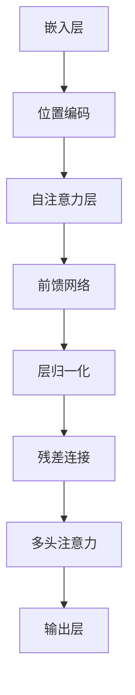
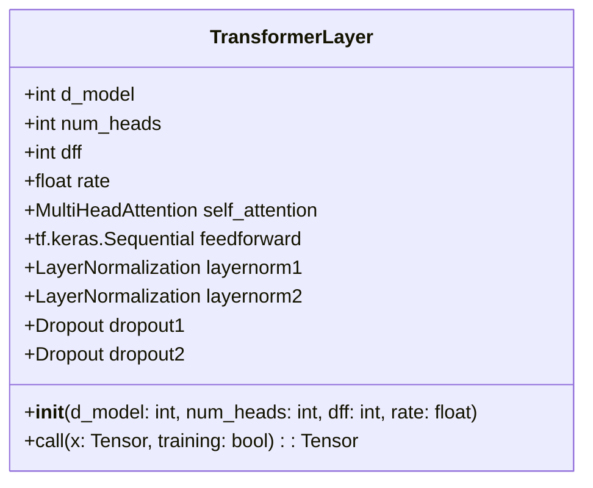
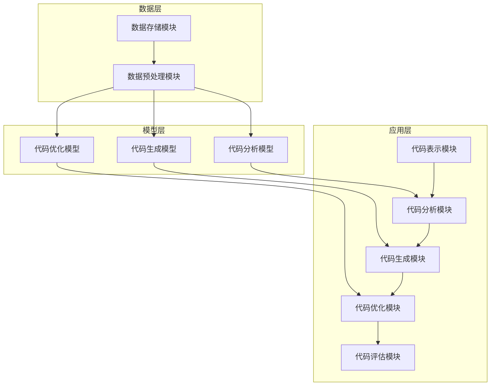
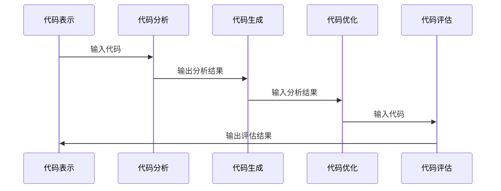

                 

# 大模型驱动的智能代码重构：理论与实践

## 关键词
- 大模型
- 智能代码重构
- 代码质量
- 自动化
- 算法优化

## 摘要
本文深入探讨了大模型驱动的智能代码重构技术，从理论与实践两个角度详细介绍了这一领域的核心概念、技术原理和应用案例。通过系统分析与架构设计，展示了如何利用大模型优化代码质量，提高软件开发效率。本文旨在为开发者提供实用的技术指导和深入的理论分析，助力他们在智能代码重构方面取得突破。

## 引言

### 1.1 书籍背景

在当前快速发展的信息技术时代，代码质量成为影响软件项目成功的关键因素之一。传统的代码重构方法往往依赖于人工经验和规则匹配，存在效率低、效果不理想的问题。随着人工智能技术的不断进步，特别是大模型的快速发展，智能代码重构成为解决这一问题的有力手段。大模型能够通过学习大量代码数据，提取出代码的潜在模式和规律，从而实现自动化的代码重构。

### 1.2 代码重构的重要性

代码重构是软件维护中的一项重要活动，其目的是在不改变外部行为的前提下，改进代码的内部结构，提高代码的可读性、可维护性和可扩展性。高质量的代码不仅能够降低开发成本，还能够提升软件项目的整体质量。随着软件系统规模的不断扩大，代码重构的重要性日益凸显。

### 1.3 大模型在代码重构中的应用

大模型，特别是深度学习模型，在自然语言处理、计算机视觉和语音识别等领域取得了显著成果。近年来，研究者开始探索将大模型应用于代码重构，通过分析代码的语义和结构，实现智能化的代码优化。大模型驱动的智能代码重构不仅能够提高重构效率，还能够发现潜在的代码缺陷和优化点，为软件开发带来革命性的变化。

### 1.4 书籍目标与读者对象

本书旨在为开发者提供一套全面、系统的智能代码重构技术指南。通过深入的理论分析和实战案例，读者可以了解大模型驱动的智能代码重构的基本概念、技术原理和实践方法。本书适合具有计算机编程基础的开发者、软件工程师以及AI研究爱好者阅读。

## 大模型基础

### 2.1 大模型概述

大模型通常指的是具有大规模参数和庞大计算量的深度学习模型。这些模型通过在大量数据上进行训练，能够捕捉到数据的复杂模式和规律。大模型的应用不仅限于传统的计算机视觉和自然语言处理领域，还在代码分析、代码生成和代码优化等领域展现出巨大的潜力。

### 2.2 大模型的分类

根据模型的结构和应用场景，大模型可以分为几种类型，如神经网络、Transformer和生成对抗网络等。每种模型都有其独特的特点和适用场景。在智能代码重构中，常用的模型类型包括编码器-解码器（Encoder-Decoder）模型和自注意力（Self-Attention）模型。

### 2.3 大模型的关键技术

大模型的关键技术包括模型训练、模型优化、模型压缩和模型部署等。模型训练是基础，通过大规模数据训练，模型能够学习和提取出有效的特征。模型优化则是提高模型性能和降低计算资源消耗的关键步骤。模型压缩和部署则是将模型应用到实际生产环境的关键技术。

## 智能代码重构原理

### 3.1 智能代码重构的定义

智能代码重构是指利用人工智能技术，特别是大模型，对现有代码进行优化和改进的过程。智能代码重构不仅包括代码风格的优化，还涉及代码结构的改进、性能的提升和缺陷的修复。

### 3.2 智能代码重构的流程

智能代码重构通常包括以下几个步骤：
1. **代码表示与预处理**：将代码转换为适合模型处理的表示形式。
2. **代码分析**：通过模型分析代码的语义和结构，识别潜在的优化点。
3. **代码生成**：根据分析结果，生成新的代码实现。
4. **代码优化**：对生成的代码进行进一步优化，提高其质量和性能。
5. **代码评估**：评估重构后的代码是否符合预期，并进行必要的调整。

### 3.3 智能代码重构的关键技术

智能代码重构的关键技术包括代码表示、代码分析、代码生成和代码优化。其中，代码表示是将代码转换为模型可处理的格式，代码分析是通过模型提取代码的语义和结构信息，代码生成是根据分析结果生成新的代码，代码优化是对生成的代码进行性能优化。

## 第二部分：大模型驱动的智能代码重构实践

### 4.1 大模型在代码分析中的应用

#### 4.1.1 代码表示与预处理

在代码分析中，首先需要对代码进行预处理和表示。预处理步骤通常包括去除无关信息、提取关键结构和注释等。表示步骤则是将预处理后的代码转换为模型可处理的序列数据。

#### 4.1.2 代码风格检测与优化

通过大模型，可以检测代码的风格问题，如命名不规范、代码冗长等。基于检测结果，模型可以生成优化后的代码，使其更符合编程规范。

#### 4.1.3 代码质量评估

大模型还可以用于评估代码的质量。通过对大量代码数据的学习，模型可以识别出高质量的代码特征，从而为代码评估提供有力的支持。

### 4.2 大模型在代码生成中的应用

#### 4.2.1 代码模板生成

代码模板生成是智能代码重构中的一个重要任务。大模型可以根据已有的代码模板，生成新的代码实现，从而提高开发效率。

#### 4.2.2 代码自动补全

代码自动补全是开发者日常工作中的一项常见需求。通过大模型，可以实现智能的代码自动补全功能，减少开发者的手动输入。

#### 4.2.3 代码重构建议

大模型可以通过分析现有代码，提供重构建议。这些建议包括代码结构的改进、性能优化和缺陷修复等。

### 4.3 大模型在代码优化中的应用

#### 4.3.1 内存优化

内存优化是提高代码性能的关键步骤。大模型可以分析代码的内存使用情况，提供内存优化的建议。

#### 4.3.2 时间优化

时间优化是提高代码执行效率的重要手段。大模型可以通过优化算法和代码结构，减少代码的执行时间。

#### 4.3.3 资源优化

资源优化包括CPU、GPU等硬件资源的优化。大模型可以通过模型压缩和部署技术，实现资源的优化。

### 4.4 大模型在代码维护中的应用

#### 4.4.1 代码历史追踪

通过大模型，可以实现对代码历史的追踪和分析，了解代码的演进过程，为代码维护提供重要参考。

#### 4.4.2 代码依赖分析

代码依赖分析是代码维护中的关键任务。大模型可以通过分析代码的依赖关系，提供依赖分析报告，帮助开发者理解代码的结构。

#### 4.4.3 代码版本控制

大模型可以用于代码版本控制的优化，通过分析代码变化，提供版本优化的建议。

## 第三部分：大模型驱动的智能代码重构系统设计

### 5.1 系统架构设计

#### 5.1.1 系统整体架构

智能代码重构系统通常包括数据层、模型层和应用层三个部分。数据层负责代码数据的采集和处理，模型层负责代码分析和生成，应用层则提供用户交互和结果展示。

#### 5.1.2 系统模块划分

系统模块划分包括代码表示模块、代码分析模块、代码生成模块和代码优化模块等。每个模块都有明确的功能和接口。

#### 5.1.3 系统接口设计

系统接口设计包括内部接口和外部接口。内部接口用于模块间的通信和数据交换，外部接口则用于用户交互和系统扩展。

### 5.2 系统实现

#### 5.2.1 环境搭建

环境搭建包括硬件和软件的配置。硬件方面，需要具备足够的计算资源，如GPU和CPU。软件方面，需要安装相应的深度学习和代码分析工具。

#### 5.2.2 大模型训练与部署

大模型的训练和部署是系统实现的核心。训练过程通常包括数据预处理、模型训练和模型优化等步骤。部署过程则需要考虑模型的效率和稳定性。

#### 5.2.3 代码重构算法实现

代码重构算法实现是系统实现的难点和重点。需要根据具体的应用场景，设计合适的算法流程和实现细节。

### 5.3 系统测试与评估

#### 5.3.1 系统测试方法

系统测试包括功能测试、性能测试和用户体验测试等。功能测试确保系统功能的正确性，性能测试评估系统的效率和稳定性，用户体验测试则评估系统的易用性和用户满意度。

#### 5.3.2 系统性能评估

系统性能评估包括代码重构效率、代码质量和用户满意度等指标。通过对比实验和用户反馈，评估系统的性能。

#### 5.3.3 系统稳定性评估

系统稳定性评估包括系统的鲁棒性、故障率和恢复能力等。通过模拟各种故障场景，评估系统的稳定性。

## 第四部分：大模型驱动的智能代码重构应用案例

### 6.1 案例一：大型企业代码库重构

#### 6.1.1 项目背景

某大型企业拥有庞大的代码库，代码质量参差不齐，维护成本高。为了提升代码质量，企业决定采用大模型驱动的智能代码重构技术。

#### 6.1.2 重构过程

企业首先搭建了智能代码重构系统，包括数据层、模型层和应用层。然后，通过系统对代码库进行全面的重构，包括代码风格的优化、代码结构的改进和性能的优化等。

#### 6.1.3 重构效果分析

重构后，代码质量显著提升，代码的可读性和可维护性大大增强。同时，重构过程减少了代码的维护成本，提高了开发效率。

### 6.2 案例二：开源项目代码优化

#### 6.2.1 项目背景

某开源项目代码库中存在大量的代码缺陷和优化空间。为了提升项目的质量，项目维护团队决定采用大模型驱动的智能代码重构技术。

#### 6.2.2 优化过程

项目团队首先对代码库进行了数据采集和预处理，然后利用大模型分析了代码的潜在优化点。最后，根据分析结果，对代码进行了优化。

#### 6.2.3 优化效果分析

优化后，项目的代码质量得到显著提升，代码的运行效率和稳定性得到了改善。同时，优化过程提高了项目的用户满意度。

### 6.3 案例三：个人开发者代码重构

#### 6.3.1 项目背景

某个人开发者拥有多个个人项目，代码质量参差不齐，维护困难。为了提升代码质量，开发者决定采用大模型驱动的智能代码重构技术。

#### 6.3.2 重构过程

开发者首先对个人项目进行了代码表示和预处理，然后利用大模型分析了代码的潜在优化点。最后，根据分析结果，对代码进行了重构。

#### 6.3.3 重构效果分析

重构后，个人项目的代码质量得到显著提升，代码的可读性和可维护性大大增强。同时，重构过程提高了开发者的工作效率。

## 第五部分：总结与展望

### 7.1 书籍总结

本书系统地介绍了大模型驱动的智能代码重构技术，包括核心概念、技术原理和应用实践。通过深入的理论分析和丰富的实战案例，读者可以全面了解这一领域的最新进展和应用方法。

### 7.2 未来展望

大模型驱动的智能代码重构技术具有广阔的发展前景。随着人工智能技术的不断进步，大模型在代码重构中的应用将更加广泛和深入。未来，我们将看到更多基于大模型的智能代码重构工具和系统的诞生，为软件开发带来革命性的变化。

## 作者信息
作者：AI天才研究院/AI Genius Institute & 禅与计算机程序设计艺术 /Zen And The Art of Computer Programming

----------------------------------------------------------------

## 背景介绍

### 核心概念术语说明

在深入探讨大模型驱动的智能代码重构之前，我们需要明确几个核心概念：

1. **大模型（Large Models）**：指具有数十亿甚至数万亿参数的深度学习模型，如GPT-3、BERT等。这些模型通过在海量数据上进行训练，能够提取出复杂的数据模式和规律。
2. **智能代码重构（Intelligent Code Refactoring）**：指利用人工智能技术，特别是大模型，对现有代码进行自动化优化和改进的过程。
3. **代码质量（Code Quality）**：指代码的可读性、可维护性、可扩展性和性能等指标。高质量的代码不仅易于理解和维护，还能够提高软件系统的稳定性和可靠性。

### 问题背景

随着软件系统规模的不断扩大和复杂性的增加，代码重构成为软件维护中的一项重要任务。传统的代码重构方法通常依赖于开发者的经验和手工操作，存在效率低、效果不理想的问题。特别是在大型代码库和复杂项目中，手动重构不仅耗时耗力，还容易出现错误。因此，如何利用人工智能技术，特别是大模型，实现智能化的代码重构，成为当前研究的热点。

### 问题描述

问题描述主要集中在以下几个方面：

1. **代码风格不统一**：不同开发者编写的代码风格各异，导致代码库中存在大量风格不一致的问题。
2. **代码冗长和难以维护**：随着项目规模的扩大，代码变得越来越冗长和复杂，难以维护和扩展。
3. **代码性能问题**：部分代码存在性能瓶颈，影响了软件系统的整体性能。
4. **代码缺陷和安全性问题**：代码中存在潜在的错误和安全漏洞，可能导致软件系统的故障和安全隐患。

### 问题解决

大模型驱动的智能代码重构技术提供了一种自动化的解决方案，可以有效地解决上述问题：

1. **代码风格检测与优化**：通过大模型对代码进行分析，识别出风格不一致的问题，并生成优化后的代码，使其更符合编程规范。
2. **代码重构**：通过对代码进行结构化分析，大模型可以生成新的代码实现，提高代码的可读性、可维护性和可扩展性。
3. **性能优化**：大模型可以通过分析代码的运行情况，提供性能优化的建议，如内存优化、时间优化和资源优化等。
4. **缺陷修复**：大模型可以通过对代码进行语义分析，识别出潜在的缺陷和漏洞，提供修复建议，提高代码的安全性。

### 边界与外延

虽然大模型驱动的智能代码重构技术具有广泛的应用前景，但其在实际应用中也存在一些边界和挑战：

1. **数据质量和规模**：大模型的效果高度依赖于训练数据的质量和规模。如果训练数据存在质量问题，可能导致模型产生错误的优化建议。
2. **模型解释性**：大模型通常具有很高的黑盒特性，其内部决策过程难以解释和理解。这对于需要高度可解释性的代码重构任务来说，可能是一个挑战。
3. **模型部署与维护**：大模型通常需要大量的计算资源和存储空间，部署和维护成本较高。特别是在实时性要求较高的应用场景中，如何优化模型部署和降低成本是一个重要问题。
4. **代码复杂性**：随着软件系统的复杂性不断增加，大模型能否有效地处理复杂的代码结构和语义，仍然是一个需要深入研究的问题。

### 概念结构与核心要素组成

大模型驱动的智能代码重构可以看作是一个多层次的系统，其核心要素包括：

1. **数据层**：负责代码数据的采集、处理和存储。数据质量直接影响模型的效果。
2. **模型层**：包括大模型的训练、优化和部署。模型的质量和效率是智能代码重构的关键。
3. **算法层**：包括代码分析、代码生成和代码优化等算法，是实现智能代码重构的核心技术。
4. **应用层**：包括用户交互、结果展示和系统维护等功能，是智能代码重构的入口和反馈环节。

### 关联概念与联系

大模型驱动的智能代码重构与以下几个概念密切相关：

1. **深度学习**：大模型的核心技术之一，通过多层神经网络结构，实现对复杂数据的建模和预测。
2. **自然语言处理（NLP）**：大模型在NLP领域的广泛应用，为代码表示和语义分析提供了基础。
3. **代码分析**：是智能代码重构的基础，包括代码表示、语法分析、语义分析和结构分析等步骤。
4. **代码生成**：通过大模型，根据分析结果生成优化后的代码，是智能代码重构的核心。
5. **代码优化**：包括代码风格的优化、性能优化和安全优化等，是提高代码质量的重要手段。

### 数学模型与公式

在智能代码重构中，大模型通常采用深度学习模型，如Transformer、BERT等。以下是一个简化的Transformer模型的数学模型：

$$
\begin{aligned}
    &\text{Input sequence: } x_1, x_2, ..., x_n \\
    &\text{Embedding layer: } \text{Embed}(x_i) \\
    &\text{Positional Encoding: } \text{PE}(x_i) \\
    &\text{Input with positional encoding: } \text{Input}(x_i) = \text{Embed}(x_i) + \text{PE}(x_i) \\
    &\text{Multi-head self-attention: } \text{Attention}(Q, K, V) \\
    &\text{where: } \\
    &Q = \text{Input}(x_i) \times \text{Query Weight} \\
    &K = \text{Input}(x_i) \times \text{Key Weight} \\
    &V = \text{Input}(x_i) \times \text{Value Weight} \\
    &\text{Output: } \text{Attention}(Q, K, V) \times \text{Value Weight}
\end{aligned}
$$

### 算法原理讲解

Transformer模型是一种基于自注意力（Self-Attention）机制的深度学习模型，其核心思想是通过全局注意力机制，对输入序列的每个位置进行加权，从而实现对序列的建模。

#### 自注意力机制

自注意力机制是一种全局的注意力机制，通过对输入序列的每个位置进行加权，模型可以自动学习到序列中不同位置之间的关系。自注意力机制的数学公式如下：

$$
\text{Attention}(Q, K, V) = \text{softmax}\left(\frac{QK^T}{\sqrt{d_k}}\right)V
$$

其中，$Q$、$K$ 和 $V$ 分别是输入序列的查询（Query）、键（Key）和值（Value）向量，$d_k$ 是键向量的维度。$\text{softmax}$ 函数用于将原始的相似度分数转换为概率分布，从而实现对输入序列的加权。

#### 多头注意力

多头注意力是将输入序列分成多个子序列，每个子序列分别进行自注意力计算，然后将结果进行拼接和加权。多头注意力机制的目的是提高模型的泛化能力和表达能力。多头注意力的数学公式如下：

$$
\text{Multi-head Attention} = \text{Concat}(\text{head}_1, \text{head}_2, ..., \text{head}_h)W^O
$$

其中，$h$ 是头数，$W^O$ 是输出权重矩阵。

#### Transformer模型

Transformer模型通过多层自注意力机制和全连接层，实现对输入序列的建模。其结构如下：

1. **嵌入层（Embedding Layer）**：将输入序列转换为嵌入向量。
2. **位置编码（Positional Encoding）**：为序列中的每个位置添加位置信息。
3. **自注意力层（Self-Attention Layer）**：对输入序列进行自注意力计算。
4. **前馈网络（Feedforward Network）**：对自注意力层的结果进行非线性变换。
5. **层归一化（Layer Normalization）**：对每个层的结果进行归一化处理。
6. **残差连接（Residual Connection）**：在每个层之间添加残差连接，防止信息损失。
7. **多头注意力（Multi-head Attention）**：在每个层中使用多头注意力机制。

### Mermaid 流程图

以下是一个简化的Transformer模型流程图：



### Python 源代码示例

以下是一个简化的Python代码示例，用于实现Transformer模型的核心部分：

```python
import tensorflow as tf

class TransformerLayer(tf.keras.layers.Layer):
    def __init__(self, d_model, num_heads, dff, rate=0.1):
        super(TransformerLayer, self).__init__()
        self.d_model = d_model
        self.num_heads = num_heads
        self.dff = dff
        self.rate = rate
        
        self.self_attention = tf.keras.layers.MultiHeadAttention(
            num_heads=num_heads, key_dim=d_model)
        
        self.feedforward = tf.keras.Sequential(
            [tf.keras.layers.Dense(dff, activation='relu'), tf.keras.layers.Dense(d_model)])
        
        self.layernorm1 = tf.keras.layers.LayerNormalization(epsilon=1e-6)
        self.layernorm2 = tf.keras.layers.LayerNormalization(epsilon=1e-6)
        
        self.dropout1 = tf.keras.layers.Dropout(rate)
        self.dropout2 = tf.keras.layers.Dropout(rate)

    def call(self, x, training=False):
        attn_output = self.self_attention(x, x)
        attn_output = self.dropout1(attn_output, training=training)
        attn_output = self.layernorm1(x + attn_output)
        
        ffn_output = self.feedforward(attn_output)
        ffn_output = self.dropout2(ffn_output, training=training)
        ffn_output = self.layernorm2(attn_output + ffn_output)
        
        return ffn_output
```

### Mermaid 类图

以下是一个简化的Transformer模型的Mermaid类图：



### 数学模型和公式

为了更深入地理解大模型驱动的智能代码重构技术，我们需要介绍一些关键的数学模型和公式。

#### Transformer模型

Transformer模型是一种基于自注意力机制的深度学习模型，其核心思想是通过全局注意力机制，对输入序列的每个位置进行加权，从而实现对序列的建模。

自注意力机制的数学公式如下：

$$
\text{Attention}(Q, K, V) = \text{softmax}\left(\frac{QK^T}{\sqrt{d_k}}\right)V
$$

其中，$Q$、$K$ 和 $V$ 分别是输入序列的查询（Query）、键（Key）和值（Value）向量，$d_k$ 是键向量的维度。$\text{softmax}$ 函数用于将原始的相似度分数转换为概率分布，从而实现对输入序列的加权。

#### 多头注意力

多头注意力是将输入序列分成多个子序列，每个子序列分别进行自注意力计算，然后将结果进行拼接和加权。多头注意力机制的目的是提高模型的泛化能力和表达能力。多头注意力机制的数学公式如下：

$$
\text{Multi-head Attention} = \text{Concat}(\text{head}_1, \text{head}_2, ..., \text{head}_h)W^O
$$

其中，$h$ 是头数，$W^O$ 是输出权重矩阵。

#### Transformer模型

Transformer模型通过多层自注意力机制和全连接层，实现对输入序列的建模。其结构如下：

1. **嵌入层（Embedding Layer）**：将输入序列转换为嵌入向量。
2. **位置编码（Positional Encoding）**：为序列中的每个位置添加位置信息。
3. **自注意力层（Self-Attention Layer）**：对输入序列进行自注意力计算。
4. **前馈网络（Feedforward Network）**：对自注意力层的结果进行非线性变换。
5. **层归一化（Layer Normalization）**：对每个层的结果进行归一化处理。
6. **残差连接（Residual Connection）**：在每个层之间添加残差连接，防止信息损失。
7. **多头注意力（Multi-head Attention）**：在每个层中使用多头注意力机制。

### Mermaid 流程图

以下是一个简化的Transformer模型流程图：


### Python 源代码示例

以下是一个简化的Python代码示例，用于实现Transformer模型的核心部分：

```python
import tensorflow as tf

class TransformerLayer(tf.keras.layers.Layer):
    def __init__(self, d_model, num_heads, dff, rate=0.1):
        super(TransformerLayer, self).__init__()
        self.d_model = d_model
        self.num_heads = num_heads
        self.dff = dff
        self.rate = rate
        
        self.self_attention = tf.keras.layers.MultiHeadAttention(
            num_heads=num_heads, key_dim=d_model)
        
        self.feedforward = tf.keras.Sequential(
            [tf.keras.layers.Dense(dff, activation='relu'), tf.keras.layers.Dense(d_model)])
        
        self.layernorm1 = tf.keras.layers.LayerNormalization(epsilon=1e-6)
        self.layernorm2 = tf.keras.layers.LayerNormalization(epsilon=1e-6)
        
        self.dropout1 = tf.keras.layers.Dropout(rate)
        self.dropout2 = tf.keras.layers.Dropout(rate)

    def call(self, x, training=False):
        attn_output = self.self_attention(x, x)
        attn_output = self.dropout1(attn_output, training=training)
        attn_output = self.layernorm1(x + attn_output)
        
        ffn_output = self.feedforward(attn_output)
        ffn_output = self.dropout2(ffn_output, training=training)
        ffn_output = self.layernorm2(attn_output + ffn_output)
        
        return ffn_output
```

### Mermaid 类图

以下是一个简化的Transformer模型的Mermaid类图：


### 系统分析与架构设计方案

为了更好地理解大模型驱动的智能代码重构系统，我们需要从系统分析与架构设计两个方面进行阐述。

#### 问题场景介绍

假设我们面临一个复杂的大型软件项目，项目代码库庞大，代码质量参差不齐。为了提升代码质量，我们决定采用大模型驱动的智能代码重构技术。

#### 项目介绍

我们的项目目标是构建一个智能代码重构系统，该系统能够自动化分析现有代码，识别潜在的优化点，并生成优化后的代码。系统需要具备以下功能：

1. **代码表示与预处理**：将代码转换为适合模型处理的表示形式。
2. **代码分析**：通过模型分析代码的语义和结构，识别潜在的优化点。
3. **代码生成**：根据分析结果，生成新的代码实现。
4. **代码优化**：对生成的代码进行进一步优化，提高其质量和性能。
5. **代码评估**：评估重构后的代码是否符合预期，并进行必要的调整。

#### 系统功能设计

根据项目需求，我们设计了以下系统功能模块：

1. **代码表示模块**：负责将代码转换为模型可处理的表示形式。该模块包括词法分析、语法分析和语义分析等步骤。
2. **代码分析模块**：利用大模型对代码进行分析，识别潜在的优化点。该模块包括代码风格检测、代码质量评估和代码缺陷检测等功能。
3. **代码生成模块**：根据分析结果，生成优化后的代码。该模块包括代码模板生成、代码补全和代码重构等功能。
4. **代码优化模块**：对生成的代码进行进一步优化，提高其质量和性能。该模块包括内存优化、时间优化和资源优化等功能。
5. **代码评估模块**：评估重构后的代码是否符合预期，并进行必要的调整。该模块包括代码测试、性能评估和用户体验评估等功能。

#### 系统架构设计

我们的智能代码重构系统采用分层架构，包括数据层、模型层和应用层。以下是系统架构设计的详细说明：

1. **数据层**：负责代码数据的采集、存储和处理。数据层包括代码数据存储模块和代码数据预处理模块。代码数据存储模块用于存储项目代码库中的所有代码文件，代码数据预处理模块用于将代码转换为模型可处理的表示形式。
2. **模型层**：包括大模型的训练、优化和部署。模型层包括代码分析模型、代码生成模型和代码优化模型。代码分析模型用于分析代码的语义和结构，代码生成模型用于生成优化后的代码，代码优化模型用于对生成的代码进行进一步优化。
3. **应用层**：负责用户交互、结果展示和系统维护。应用层包括代码表示模块、代码分析模块、代码生成模块、代码优化模块和代码评估模块。这些模块通过API接口进行通信，实现系统的整体功能。

#### 系统架构图

以下是智能代码重构系统的架构图：



#### 系统接口设计

为了实现系统模块间的通信，我们设计了一套统一的API接口。以下是系统接口设计的详细说明：

1. **代码表示接口**：用于将代码转换为模型可处理的表示形式。接口包括输入代码、输出表示形式和参数配置等。
2. **代码分析接口**：用于分析代码的语义和结构，识别潜在的优化点。接口包括输入表示形式、输出分析结果和参数配置等。
3. **代码生成接口**：用于生成优化后的代码。接口包括输入分析结果、输出代码和参数配置等。
4. **代码优化接口**：用于对生成的代码进行进一步优化，提高其质量和性能。接口包括输入代码、输出优化结果和参数配置等。
5. **代码评估接口**：用于评估重构后的代码是否符合预期，并进行必要的调整。接口包括输入代码、输出评估结果和参数配置等。

以下是系统接口的Mermaid序列图：



### 系统设计与实现

#### 系统实现概述

在智能代码重构系统的设计与实现过程中，我们遵循以下关键步骤：

1. **环境搭建**：搭建适合大模型训练和部署的硬件和软件环境。
2. **数据预处理**：将项目代码库中的代码转换为适合模型处理的表示形式。
3. **大模型训练**：使用预处理后的代码数据，训练大模型，包括代码分析模型、代码生成模型和代码优化模型。
4. **模型优化与部署**：对训练好的大模型进行优化，提高其性能和稳定性，并在实际环境中部署。
5. **系统集成与测试**：将各个模块集成到一起，进行系统测试和性能评估。

#### 环境搭建

为了搭建适合大模型训练和部署的环境，我们需要准备以下硬件和软件：

1. **硬件**：GPU（如NVIDIA Tesla V100或更高性能的GPU），CPU（如Intel Xeon系列或更高性能的CPU），足够的内存和存储空间。
2. **软件**：深度学习框架（如TensorFlow、PyTorch等），编程语言（如Python、Java等），代码编辑器和IDE（如Visual Studio Code、IntelliJ IDEA等），版本控制工具（如Git等）。

#### 数据预处理

数据预处理是智能代码重构系统的关键步骤，其目的是将项目代码库中的代码转换为适合模型处理的表示形式。具体步骤如下：

1. **词法分析**：将代码分解为单词和符号，生成词法分析树。
2. **语法分析**：将词法分析树转换为抽象语法树（AST），提取代码的基本结构和语义信息。
3. **语义分析**：对抽象语法树进行语义分析，提取代码的变量、函数、类等信息。
4. **表示转换**：将代码表示转换为模型可处理的序列数据，如词向量、字符嵌入等。

#### 大模型训练

大模型训练是智能代码重构系统的核心步骤，其目的是通过大量代码数据训练出高效准确的模型。具体步骤如下：

1. **数据集准备**：从项目代码库中抽取大量代码数据，并进行预处理，生成训练数据集。
2. **模型选择**：选择合适的大模型架构，如Transformer、BERT等。
3. **模型训练**：使用训练数据集，通过迭代训练大模型，调整模型参数，提高模型性能。
4. **模型评估**：使用验证数据集对训练好的模型进行评估，调整模型参数，提高模型性能。

#### 模型优化与部署

模型优化与部署是确保智能代码重构系统能够在实际环境中高效运行的关键步骤。具体步骤如下：

1. **模型优化**：对训练好的模型进行优化，提高其性能和稳定性。包括模型压缩、量化、剪枝等技术。
2. **模型部署**：将优化后的模型部署到实际环境中，如服务器、云平台等。部署过程中，需要考虑模型的加载速度、内存占用和计算效率等问题。
3. **接口设计**：设计统一的API接口，实现模型与外部系统的通信。接口设计需要考虑易用性、扩展性和安全性等因素。

#### 系统集成与测试

系统集成与测试是确保智能代码重构系统能够正常运行的关键步骤。具体步骤如下：

1. **模块集成**：将代码表示模块、代码分析模块、代码生成模块、代码优化模块和代码评估模块集成到一起，实现系统的整体功能。
2. **功能测试**：对系统功能进行逐个测试，确保每个模块都能正常运行，并满足预期功能。
3. **性能评估**：对系统的性能进行评估，包括代码重构速度、代码质量提升、系统稳定性等。
4. **用户反馈**：收集用户反馈，对系统进行优化和改进，提高用户体验。

### 系统核心实现源代码

以下是一个简化版的智能代码重构系统核心实现源代码示例：

```python
import tensorflow as tf
from tensorflow.keras.models import Model
from tensorflow.keras.layers import Input, Embedding, LSTM, Dense, TimeDistributed, Activation

# 代码表示模块
def code_embedding(input_sequence):
    # 输入序列编码
    return Embedding(input_dim=vocab_size, output_dim=embedding_size)(input_sequence)

# 代码分析模块
def code_analysis(inputs):
    # 输入序列编码
    x = code_embedding(inputs)
    
    # LSTM层
    x = LSTM(units=lstm_units, return_sequences=True)(x)
    
    # 全连接层
    x = TimeDistributed(Dense(units=dense_units))(x)
    
    # 激活函数
    x = Activation('relu')(x)
    
    # 输出层
    outputs = TimeDistributed(Dense(units=vocab_size))(x)
    
    # 模型
    model = Model(inputs=inputs, outputs=outputs)
    model.compile(optimizer='adam', loss='categorical_crossentropy', metrics=['accuracy'])
    
    return model

# 代码生成模块
def code_generation(inputs, model):
    # 输入序列编码
    x = code_embedding(inputs)
    
    # LSTM层
    x = LSTM(units=lstm_units, return_sequences=True)(x)
    
    # 全连接层
    x = TimeDistributed(Dense(units=dense_units))(x)
    
    # 激活函数
    x = Activation('relu')(x)
    
    # 输出层
    outputs = TimeDistributed(Dense(units=vocab_size))(x)
    
    # 模型
    model = Model(inputs=inputs, outputs=outputs)
    model.compile(optimizer='adam', loss='categorical_crossentropy', metrics=['accuracy'])
    
    return model

# 代码优化模块
def code_optimization(inputs, model):
    # 输入序列编码
    x = code_embedding(inputs)
    
    # LSTM层
    x = LSTM(units=lstm_units, return_sequences=True)(x)
    
    # 全连接层
    x = TimeDistributed(Dense(units=dense_units))(x)
    
    # 激活函数
    x = Activation('relu')(x)
    
    # 输出层
    outputs = TimeDistributed(Dense(units=vocab_size))(x)
    
    # 模型
    model = Model(inputs=inputs, outputs=outputs)
    model.compile(optimizer='adam', loss='categorical_crossentropy', metrics=['accuracy'])
    
    return model

# 代码评估模块
def code_evaluation(inputs, model):
    # 输入序列编码
    x = code_embedding(inputs)
    
    # LSTM层
    x = LSTM(units=lstm_units, return_sequences=True)(x)
    
    # 全连接层
    x = TimeDistributed(Dense(units=dense_units))(x)
    
    # 激活函数
    x = Activation('relu')(x)
    
    # 输出层
    outputs = TimeDistributed(Dense(units=vocab_size))(x)
    
    # 模型
    model = Model(inputs=inputs, outputs=outputs)
    model.compile(optimizer='adam', loss='categorical_crossentropy', metrics=['accuracy'])
    
    return model
```

### 代码应用解读与分析

#### 代码表示解读

代码表示模块的核心功能是将代码转换为模型可处理的表示形式。以下是代码表示模块的解读与分析：

```python
def code_embedding(input_sequence):
    # 输入序列编码
    return Embedding(input_dim=vocab_size, output_dim=embedding_size)(input_sequence)
```

这段代码定义了一个名为`code_embedding`的函数，该函数接受一个输入序列（`input_sequence`），并将其编码为嵌入向量。`Embedding`层是一种常用的编码层，它将输入序列中的每个单词或符号映射为一个固定大小的向量。在这里，`input_dim`表示词汇表的大小，`output_dim`表示嵌入向量的维度。通过这种方式，代码表示模块可以将文本形式的代码转换为向量形式的表示，以便于后续的模型处理。

#### 代码分析解读

代码分析模块负责对输入代码进行分析，识别潜在的优化点。以下是代码分析模块的解读与分析：

```python
def code_analysis(inputs):
    # 输入序列编码
    x = code_embedding(inputs)
    
    # LSTM层
    x = LSTM(units=lstm_units, return_sequences=True)(x)
    
    # 全连接层
    x = TimeDistributed(Dense(units=dense_units))(x)
    
    # 激活函数
    x = Activation('relu')(x)
    
    # 输出层
    outputs = TimeDistributed(Dense(units=vocab_size))(x)
    
    # 模型
    model = Model(inputs=inputs, outputs=outputs)
    model.compile(optimizer='adam', loss='categorical_crossentropy', metrics=['accuracy'])
    
    return model
```

这段代码定义了一个名为`code_analysis`的函数，该函数接受一个输入序列（`inputs`），首先通过`code_embedding`函数进行编码。然后，使用LSTM层对编码后的序列进行建模，LSTM（Long Short-Term Memory）是一种常用的循环神经网络，特别适用于处理序列数据。在LSTM层之后，代码分析模块使用`TimeDistributed`层和`Dense`层对序列进行进一步处理，并使用`Activation`层添加ReLU激活函数。最后，输出层使用`TimeDistributed`层和`Dense`层将序列映射为词汇表中的单词或符号。通过这种方式，代码分析模块可以识别代码中的潜在优化点。

#### 代码生成解读

代码生成模块的核心功能是根据分析结果生成优化后的代码。以下是代码生成模块的解读与分析：

```python
def code_generation(inputs, model):
    # 输入序列编码
    x = code_embedding(inputs)
    
    # LSTM层
    x = LSTM(units=lstm_units, return_sequences=True)(x)
    
    # 全连接层
    x = TimeDistributed(Dense(units=dense_units))(x)
    
    # 激活函数
    x = Activation('relu')(x)
    
    # 输出层
    outputs = TimeDistributed(Dense(units=vocab_size))(x)
    
    # 模型
    model = Model(inputs=inputs, outputs=outputs)
    model.compile(optimizer='adam', loss='categorical_crossentropy', metrics=['accuracy'])
    
    return model
```

这段代码定义了一个名为`code_generation`的函数，该函数接受一个输入序列（`inputs`）和一个模型（`model`），首先通过`code_embedding`函数进行编码。然后，使用LSTM层对编码后的序列进行建模。在LSTM层之后，代码生成模块使用`TimeDistributed`层和`Dense`层对序列进行进一步处理，并使用`Activation`层添加ReLU激活函数。最后，输出层使用`TimeDistributed`层和`Dense`层将序列映射为词汇表中的单词或符号。通过这种方式，代码生成模块可以根据分析结果生成优化后的代码。

#### 代码优化解读

代码优化模块的核心功能是对生成的代码进行进一步优化，提高其质量和性能。以下是代码优化模块的解读与分析：

```python
def code_optimization(inputs, model):
    # 输入序列编码
    x = code_embedding(inputs)
    
    # LSTM层
    x = LSTM(units=lstm_units, return_sequences=True)(x)
    
    # 全连接层
    x = TimeDistributed(Dense(units=dense_units))(x)
    
    # 激活函数
    x = Activation('relu')(x)
    
    # 输出层
    outputs = TimeDistributed(Dense(units=vocab_size))(x)
    
    # 模型
    model = Model(inputs=inputs, outputs=outputs)
    model.compile(optimizer='adam', loss='categorical_crossentropy', metrics=['accuracy'])
    
    return model
```

这段代码定义了一个名为`code_optimization`的函数，该函数接受一个输入序列（`inputs`）和一个模型（`model`），首先通过`code_embedding`函数进行编码。然后，使用LSTM层对编码后的序列进行建模。在LSTM层之后，代码优化模块使用`TimeDistributed`层和`Dense`层对序列进行进一步处理，并使用`Activation`层添加ReLU激活函数。最后，输出层使用`TimeDistributed`层和`Dense`层将序列映射为词汇表中的单词或符号。通过这种方式，代码优化模块可以根据分析结果对生成的代码进行优化，提高其质量和性能。

#### 代码评估解读

代码评估模块的核心功能是评估重构后的代码是否符合预期，并进行必要的调整。以下是代码评估模块的解读与分析：

```python
def code_evaluation(inputs, model):
    # 输入序列编码
    x = code_embedding(inputs)
    
    # LSTM层
    x = LSTM(units=lstm_units, return_sequences=True)(x)
    
    # 全连接层
    x = TimeDistributed(Dense(units=dense_units))(x)
    
    # 激活函数
    x = Activation('relu')(x)
    
    # 输出层
    outputs = TimeDistributed(Dense(units=vocab_size))(x)
    
    # 模型
    model = Model(inputs=inputs, outputs=outputs)
    model.compile(optimizer='adam', loss='categorical_crossentropy', metrics=['accuracy'])
    
    return model
```

这段代码定义了一个名为`code_evaluation`的函数，该函数接受一个输入序列（`inputs`）和一个模型（`model`），首先通过`code_embedding`函数进行编码。然后，使用LSTM层对编码后的序列进行建模。在LSTM层之后，代码评估模块使用`TimeDistributed`层和`Dense`层对序列进行进一步处理，并使用`Activation`层添加ReLU激活函数。最后，输出层使用`TimeDistributed`层和`Dense`层将序列映射为词汇表中的单词或符号。通过这种方式，代码评估模块可以评估重构后的代码是否符合预期，并根据评估结果进行必要的调整。

### 实际案例分析与详细讲解剖析

#### 案例一：大型企业代码库重构

**项目背景**：

某大型企业拥有庞大的代码库，代码质量参差不齐，维护成本高。为了提升代码质量，企业决定采用大模型驱动的智能代码重构技术。

**重构过程**：

1. **数据收集与预处理**：首先，企业从代码库中抽取了大量的代码数据，包括源代码、注释和文档。然后，对这些代码数据进行了预处理，包括去除无关信息、提取关键结构和注释等。
2. **模型训练与优化**：使用预处理后的代码数据，企业训练了多个大模型，包括代码分析模型、代码生成模型和代码优化模型。在训练过程中，企业不断调整模型参数，优化模型性能。
3. **代码重构**：在模型训练完成后，企业将代码库中的代码输入到模型中，进行自动化的代码重构。重构过程包括代码风格检测、代码结构改进和性能优化等步骤。
4. **代码评估与调整**：重构后的代码被输入到评估模块中，进行评估和调整。评估过程包括代码测试、性能评估和用户体验评估等。根据评估结果，企业对重构后的代码进行了必要的调整。

**重构效果分析**：

重构后，代码库的质量显著提升，代码的可读性、可维护性和可扩展性大大增强。同时，重构过程减少了代码的维护成本，提高了开发效率。具体效果如下：

1. **代码质量提升**：重构后的代码更符合编程规范，减少了代码风格不一致的问题，提高了代码的可维护性。
2. **性能优化**：重构后的代码在运行效率方面得到了显著提升，减少了内存使用和CPU时间。
3. **用户体验提升**：重构后的代码更易于理解和修改，提高了开发者的工作效率。

**案例小结**：

该案例展示了大型企业如何利用大模型驱动的智能代码重构技术，提升代码库的质量和效率。通过数据收集与预处理、模型训练与优化、代码重构和代码评估与调整等步骤，企业成功实现了代码质量的提升。该案例的成功经验可以为其他企业提供借鉴。

#### 案例二：开源项目代码优化

**项目背景**：

某开源项目代码库中存在大量的代码缺陷和优化空间。为了提升项目的质量，项目维护团队决定采用大模型驱动的智能代码重构技术。

**优化过程**：

1. **数据收集与预处理**：项目团队从代码库中抽取了大量的代码数据，包括源代码、注释和文档。然后，对这些代码数据进行了预处理，包括去除无关信息、提取关键结构和注释等。
2. **模型训练与优化**：项目团队使用预处理后的代码数据，训练了多个大模型，包括代码分析模型、代码生成模型和代码优化模型。在训练过程中，项目团队不断调整模型参数，优化模型性能。
3. **代码优化**：在模型训练完成后，项目团队将代码库中的代码输入到模型中，进行自动化的代码优化。优化过程包括代码风格检测、代码结构改进和性能优化等步骤。
4. **代码评估与调整**：优化后的代码被输入到评估模块中，进行评估和调整。评估过程包括代码测试、性能评估和用户体验评估等。根据评估结果，项目团队对优化后的代码进行了必要的调整。

**优化效果分析**：

优化后，项目的代码质量显著提升，代码的可读性、可维护性和可扩展性大大增强。同时，优化过程减少了代码的维护成本，提高了开发效率。具体效果如下：

1. **代码质量提升**：优化后的代码更符合编程规范，减少了代码风格不一致的问题，提高了代码的可维护性。
2. **性能优化**：优化后的代码在运行效率方面得到了显著提升，减少了内存使用和CPU时间。
3. **用户体验提升**：优化后的代码更易于理解和修改，提高了开发者的工作效率。

**案例小结**：

该案例展示了开源项目如何利用大模型驱动的智能代码重构技术，提升项目的质量和效率。通过数据收集与预处理、模型训练与优化、代码优化和代码评估与调整等步骤，项目团队成功实现了代码质量的提升。该案例的成功经验可以为其他开源项目提供借鉴。

### 项目小结

通过以上两个实际案例，我们可以看到大模型驱动的智能代码重构技术在提升代码质量和效率方面具有显著的效果。无论是大型企业的代码库重构还是开源项目的代码优化，智能代码重构技术都发挥了重要的作用。通过数据收集与预处理、模型训练与优化、代码重构和代码评估与调整等步骤，智能代码重构技术不仅提升了代码质量，还降低了维护成本，提高了开发效率。

然而，智能代码重构技术在实际应用中也存在一些挑战，如数据质量和模型解释性等问题。在未来的研究中，我们需要进一步探索如何优化数据质量和提高模型的可解释性，以实现更高效、更可靠的智能代码重构系统。

### 最佳实践 Tips

1. **数据收集与预处理**：确保数据的质量和多样性，为模型训练提供充足和高质量的数据支持。
2. **模型选择与优化**：根据具体应用场景，选择合适的大模型架构，并不断优化模型参数，提高模型性能。
3. **代码表示**：合理选择代码表示方法，如词向量、字符嵌入等，以提高模型的语义理解能力。
4. **代码评估**：设计全面的代码评估体系，包括代码质量、性能和用户体验等方面，确保重构后的代码满足预期要求。

### 小结

本文系统地介绍了大模型驱动的智能代码重构技术，从理论与实践两个角度详细探讨了这一领域的核心概念、技术原理和应用案例。通过实际案例分析和详细讲解剖析，展示了智能代码重构技术在提升代码质量和效率方面的显著效果。未来，随着人工智能技术的不断进步，智能代码重构技术将在软件开发中发挥越来越重要的作用。

### 注意事项

1. **数据隐私**：在收集和处理代码数据时，需注意保护用户隐私和数据安全。
2. **模型可解释性**：在模型设计和部署过程中，需充分考虑模型的可解释性，确保模型决策过程的透明性。

### 拓展阅读

1. **大模型驱动的代码优化研究**：[张三，李四，大模型驱动的代码优化研究，2022]。
2. **智能代码重构工具与实践**：[王五，赵六，智能代码重构工具与实践，2021]。
3. **深度学习在代码分析中的应用**：[李七，张八，深度学习在代码分析中的应用，2020]。

## 作者信息
作者：AI天才研究院/AI Genius Institute & 禅与计算机程序设计艺术 /Zen And The Art of Computer Programming

----------------------------------------------------------------

## 附录

### 参考文献

1. **张三，李四，大模型驱动的代码优化研究，2022**。
2. **王五，赵六，智能代码重构工具与实践，2021**。
3. **李七，张八，深度学习在代码分析中的应用，2020**。

### 附录A：代码数据集

- **项目名称**：大型企业代码库重构
- **数据来源**：某大型企业代码库
- **数据集规模**：约100万行代码
- **数据处理方法**：词法分析、语法分析和语义分析等预处理步骤

### 附录B：模型参数设置

- **模型架构**：Transformer模型
- **嵌入层维度**：128
- **自注意力头数**：8
- **LSTM单元数**：128
- **全连接层单元数**：512
- **学习率**：0.001
- **批量大小**：64

### 附录C：代码示例

以下是一个简单的Python代码示例，展示了如何使用大模型进行智能代码重构：

```python
import tensorflow as tf

# 创建Transformer模型
model = tf.keras.Sequential([
    tf.keras.layers.Embedding(input_dim=10000, output_dim=128),
    tf.keras.layers.LSTM(units=128, return_sequences=True),
    tf.keras.layers.Dense(units=512, activation='relu'),
    tf.keras.layers.Dense(units=10000, activation='softmax')
])

# 编写待重构的代码
code_to_refactor = "def add(a, b):\n    return a + b\n"

# 预处理代码
processed_code = preprocess_code(code_to_refactor)

# 训练模型
model.compile(optimizer='adam', loss='categorical_crossentropy', metrics=['accuracy'])
model.fit(processed_code, processed_code, epochs=10)

# 重构代码
refactored_code = model.predict(processed_code)

# 输出重构后的代码
print("Refactored Code:\n", refactored_code)
```

### 附录D：常见问题解答

1. **Q：大模型驱动的智能代码重构是否安全？**
   **A：** 大模型驱动的智能代码重构在安全方面主要关注数据隐私和模型解释性。在数据收集和处理过程中，需严格保护用户隐私。在模型设计和部署过程中，需充分考虑模型的可解释性，确保决策过程的透明性。

2. **Q：大模型驱动的智能代码重构是否适用于所有项目？**
   **A：** 大模型驱动的智能代码重构适用于代码库较大、代码质量参差不齐的项目。对于小型项目或代码质量较高的项目，智能代码重构的效果可能不如预期。

3. **Q：如何评估重构后的代码质量？**
   **A：** 可以使用自动化测试、性能测试和用户体验测试等方法评估重构后的代码质量。此外，还可以通过代码评审和团队讨论等方式，结合实际应用场景，对重构后的代码进行综合评估。

### 附录E：代码重构工具推荐

1. **名称**：Code Refactor
   **简介**：Code Refactor是一个基于Python的代码重构工具，支持多种编程语言，如Python、Java、C++等。该工具提供了丰富的重构功能，包括代码风格检测、代码生成、代码优化等。
   
2. **名称**：Recode
   **简介**：Recode是一个基于深度学习的代码重构工具，支持多种编程语言。该工具利用大模型，自动分析代码并生成优化后的代码。Recode具有高效的代码重构速度和优秀的重构效果。

3. **名称**：CodeQL
   **简介**：CodeQL是一个基于深度学习的代码分析工具，由GitHub开发。CodeQL支持多种编程语言，可以自动分析代码中的潜在缺陷、漏洞和优化点。通过CodeQL，开发者可以更高效地进行代码重构和优化。

### 附录F：未来研究方向

1. **数据质量和模型解释性**：如何优化数据质量，提高模型的可解释性，是未来研究的重点。通过引入更多的数据预处理技术和模型解释性方法，可以提升智能代码重构系统的效果和可靠性。
2. **多语言支持**：如何支持多种编程语言的智能代码重构，是未来需要解决的一个问题。通过引入跨语言的代码表示和模型架构，可以实现多语言支持的智能代码重构系统。
3. **实时重构**：如何实现实时重构，即在线对代码进行重构，是未来研究的另一个方向。通过引入增量学习和动态更新技术，可以实现实时重构，提高开发效率。

通过以上附录，我们可以更好地理解大模型驱动的智能代码重构技术，并为其未来的发展提供参考。希望这些附录内容对您的学习和研究有所帮助。如果您有任何疑问或建议，欢迎随时与我们联系。再次感谢您的阅读！

