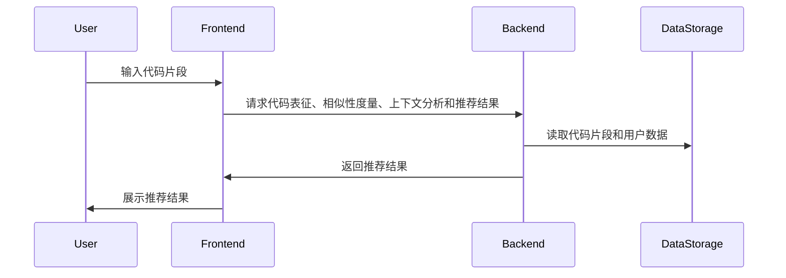
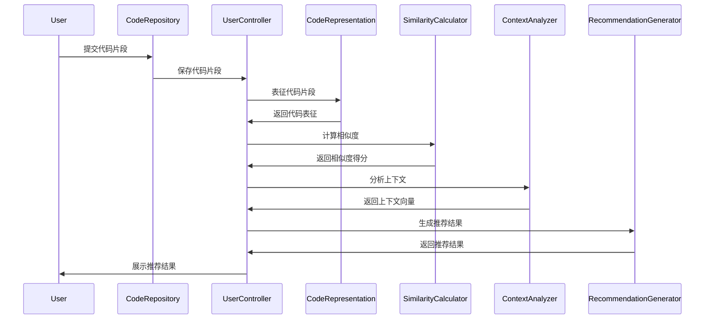
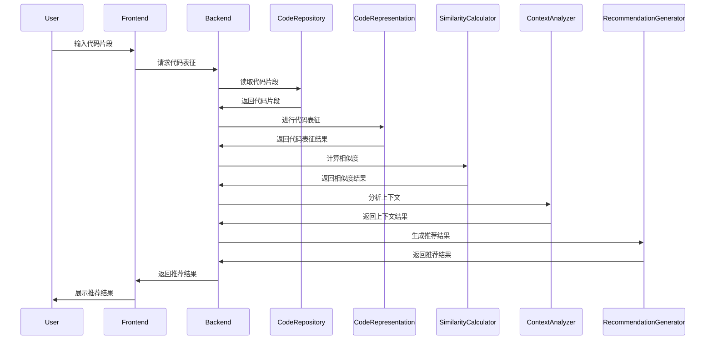

                 

### 《大模型驱动的智能代码重用推荐》

#### 关键词：大模型、智能代码重用、推荐系统、算法原理、系统设计与实现

#### 摘要：

随着软件开发项目的日益复杂化，代码重用已成为提高开发效率和质量的关键策略。本文将探讨大模型驱动的智能代码重用推荐技术，首先介绍大模型的基本概念和核心原理，然后深入分析智能代码重用推荐的挑战和策略，最后通过实际案例展示其系统实现和最佳实践。本文旨在为开发者和研究者提供一套清晰、实用的大模型驱动的智能代码重用推荐指南。

## 目录大纲

### 第一部分：背景与概述

- **第1章 引言与背景**
  - **1.1 问题背景**
  - **1.2 问题描述**
  - **1.3 解决方案概述**
  - **1.4 边界与外延**
  - **1.5 本章小结**

### 第二部分：核心概念与原理

- **第2章 大模型基础**
  - **2.1 大模型概述**
  - **2.2 大模型的架构与特点**
  - **2.3 大模型的训练与优化**
  - **2.4 大模型的应用场景**
  - **2.5 本章小结**

- **第3章 智能代码重用推荐**
  - **3.1 智能代码重用的定义与重要性**
  - **3.2 智能代码重用的挑战**
  - **3.3 智能代码重用推荐的方法与策略**
  - **3.4 智能代码重用推荐系统的设计与实现**
  - **3.5 本章小结**

### 第三部分：算法原理与数学模型

- **第4章 算法原理讲解**
  - **4.1 智能代码重用推荐的算法流程**
  - **4.2 算法核心组件分析**
    - **4.2.1 大模型的嵌入与表征**
    - **4.2.2 代码相似性度量方法**
    - **4.2.3 推荐算法优化策略**
  - **4.3 数学模型与公式推导**
  - **4.4 算法举例说明**
  - **4.5 本章小结**

- **第5章 数学模型与公式**
  - **5.1 数学基础**
    - **5.1.1 矩阵与向量运算**
    - **5.1.2 概率论与统计**
    - **5.1.3 信息论基础**
  - **5.2 算法中的数学公式**
  - **5.3 公式详解与举例**
  - **5.4 本章小结**

### 第四部分：系统设计与实现

- **第6章 系统分析与架构设计**
  - **6.1 问题场景介绍**
  - **6.2 系统功能设计**
    - **6.2.1 领域模型**
    - **6.2.2 类图设计**
  - **6.3 系统架构设计**
    - **6.3.1 总体架构**
    - **6.3.2 功能模块划分**
  - **6.4 系统接口设计**
    - **6.4.1 接口规范**
    - **6.4.2 交互流程**
  - **6.5 系统交互设计**
    - **6.5.1 序列图**
    - **6.5.2 协作图**
  - **6.6 本章小结**

- **第7章 项目实战与案例分析**
  - **7.1 环境安装与配置**
  - **7.2 系统核心实现**
    - **7.2.1 大模型嵌入与训练**
    - **7.2.2 代码重用推荐算法实现**
    - **7.2.3 系统集成与测试**
  - **7.3 实际案例分析**
  - **7.4 项目小结**

### 第五部分：最佳实践与总结

- **第8章 最佳实践**
  - **8.1 实践技巧与策略**
  - **8.2 性能优化方法**
  - **8.3 安全性与可靠性保障**
  - **8.4 跨领域应用探索**

- **第9章 小结与展望**
  - **9.1 主要内容回顾**
  - **9.2 未来发展趋势**
  - **9.3 研究与开发方向**
  - **9.4 拓展阅读建议**

### 接下来，我们将逐步深入探讨每个章节的具体内容。

## 第一部分：背景与概述

### 第1章 引言与背景

#### 1.1 问题背景

在当今快速发展的软件开发领域，代码重用已成为提高开发效率和质量的关键手段。然而，传统的代码重用方法往往依赖于手动搜索和经验，这不仅耗时耗力，而且难以保证重用代码的质量和一致性。随着软件项目的规模和复杂性不断增加，如何有效地进行代码重用成为一个亟待解决的问题。

#### 1.2 问题描述

代码重用问题主要体现在以下几个方面：

1. **代码搜索困难**：在庞大的代码库中查找合适的代码片段是一项繁琐且耗时的工作。
2. **重用质量低下**：手动重用代码容易引入错误，且难以保证代码风格的一致性。
3. **缺乏上下文信息**：现有方法难以理解代码片段的应用上下文，导致无法实现真正的代码重用。
4. **更新与维护**：随着项目的发展，代码库需要不断更新和维护，传统的代码重用方法难以适应这一需求。

#### 1.3 解决方案概述

为了解决上述问题，本文提出了一种基于大模型驱动的智能代码重用推荐方案。该方法利用大模型强大的表征和学习能力，通过分析和理解代码片段的语义信息，实现智能化的代码重用推荐。具体来说，该方案包括以下几个关键步骤：

1. **代码表征**：使用大模型对代码片段进行表征，生成高维的语义向量。
2. **相似性度量**：通过计算代码片段之间的相似性，筛选出可能的重用候选。
3. **上下文理解**：结合代码片段的应用上下文，优化推荐结果，提高重用效果。
4. **系统实现**：设计并实现一个智能代码重用推荐系统，提供便捷的代码重用服务。

#### 1.4 边界与外延

在本文的研究中，我们主要关注以下边界和问题：

1. **代码库范围**：研究局限于特定的编程语言和代码库，如Python和GitHub。
2. **代码类型**：重点研究结构化代码片段的重用，不包括非结构化文本和自然语言处理代码。
3. **模型性能**：大模型训练和优化的资源需求，以及在实际应用中的性能表现。
4. **隐私保护**：在处理代码数据时，确保遵守隐私保护法规和最佳实践。

#### 1.5 本章小结

本章介绍了智能代码重用推荐问题的背景、问题描述以及解决方案概述。通过分析现有问题，本文提出了一种基于大模型驱动的智能代码重用推荐方案，为解决代码重用难题提供了一种新的思路和方向。

### **第二部分：核心概念与原理**

### 第2章 大模型基础

#### 2.1 大模型概述

大模型（Large Models）是指参数规模达到亿级以上的深度神经网络模型。这些模型在计算机视觉、自然语言处理、语音识别等领域取得了显著的成果。大模型通常采用多层神经网络结构，通过大量的数据和参数训练，具有强大的表征和学习能力。

#### 2.2 大模型的架构与特点

大模型的架构通常包括以下几个特点：

1. **多层神经网络**：大模型通常采用多层神经网络结构，每一层都能够提取不同层次的语义信息。
2. **参数规模巨大**：大模型拥有数亿甚至数十亿的参数，这使得它们具有更高的表征能力。
3. **端到端学习**：大模型能够直接从原始数据中学习，不需要进行手工特征工程，提高了模型的可扩展性。
4. **自适应学习**：大模型具有自适应学习的能力，能够根据不同的任务和数据分布调整模型参数。

#### 2.3 大模型的训练与优化

大模型的训练与优化是确保其性能的关键步骤。以下是一些关键步骤：

1. **数据准备**：收集和预处理大量的训练数据，包括文本、图像和音频等。
2. **模型初始化**：选择合适的初始化方法，如随机初始化、预训练模型等。
3. **模型训练**：使用梯度下降法或其他优化算法训练模型，调整模型参数以最小化损失函数。
4. **模型评估**：使用验证集和测试集评估模型的性能，调整超参数以优化模型表现。
5. **模型优化**：通过模型剪枝、量化等技术优化模型，提高模型效率和可部署性。

#### 2.4 大模型的应用场景

大模型在多个领域展现了强大的应用潜力：

1. **自然语言处理**：如文本分类、机器翻译、问答系统等。
2. **计算机视觉**：如图像分类、目标检测、图像生成等。
3. **语音识别**：如语音识别、语音合成、语音翻译等。
4. **推荐系统**：如商品推荐、内容推荐等。

#### 2.5 本章小结

本章介绍了大模型的基本概念、架构特点、训练与优化方法以及应用场景。大模型作为一种先进的深度学习模型，具有强大的表征和学习能力，在多个领域都取得了显著的成果。接下来，我们将进一步探讨智能代码重用推荐的核心概念和原理。

### 第3章 智能代码重用推荐

#### 3.1 智能代码重用的定义与重要性

智能代码重用（Smart Code Reuse）是指利用先进的技术和方法，从大量代码库中自动发现并推荐可重用的代码片段。与传统的代码重用方法相比，智能代码重用具有以下特点：

1. **自动化**：通过算法自动分析代码库，无需人工干预。
2. **智能化**：利用大模型和机器学习技术，理解代码片段的语义和上下文信息。
3. **高效性**：快速地从庞大的代码库中筛选出高质量的代码重用候选。

智能代码重用的关键在于其能够大幅提高代码开发的效率和质量，减少重复性工作，降低错误率，并促进代码库的维护和更新。

#### 3.2 智能代码重用的挑战

尽管智能代码重用具有显著的优势，但实现这一目标面临着一系列挑战：

1. **代码质量**：如何确保推荐代码的质量和一致性，避免引入错误。
2. **上下文理解**：理解代码片段的应用上下文，实现真正的代码重用。
3. **计算资源**：大模型的训练和优化需要大量的计算资源，如何优化资源利用。
4. **可扩展性**：如何适应不断增长和变化的代码库，保持系统的性能。

#### 3.3 智能代码重用推荐的方法与策略

为了解决上述挑战，智能代码重用推荐需要采用一系列方法和策略：

1. **代码表征**：使用大模型对代码片段进行表征，生成高维的语义向量。
2. **相似性度量**：计算代码片段之间的相似性，使用距离度量方法如余弦相似度、欧氏距离等。
3. **上下文分析**：结合代码片段的应用上下文，通过语义解析和自然语言处理技术，优化推荐结果。
4. **推荐算法**：采用基于内容的推荐、协同过滤和混合推荐等方法，提高推荐系统的效果。
5. **持续学习**：通过持续学习和模型更新，适应代码库的变化和用户需求。

#### 3.4 智能代码重用推荐系统的设计与实现

智能代码重用推荐系统包括以下几个关键组成部分：

1. **代码库**：存储和管理大规模的代码片段，支持快速搜索和查询。
2. **大模型**：用于代码表征和相似性度量，确保推荐结果的准确性和可靠性。
3. **推荐算法**：实现智能代码重用推荐的算法核心，包括相似性计算、上下文分析和推荐策略。
4. **用户界面**：提供直观、易用的用户界面，方便开发者使用推荐功能。
5. **评估与优化**：持续评估推荐系统的性能和用户满意度，优化系统设计和算法。

在实现智能代码重用推荐系统时，需要考虑以下几个关键步骤：

1. **需求分析**：明确系统的功能需求和性能指标，确定系统的边界和限制。
2. **系统设计**：设计系统的架构和模块，确保系统的可扩展性和灵活性。
3. **代码库构建**：构建和管理代码库，确保代码片段的丰富性和多样性。
4. **模型训练**：使用大规模的代码数据训练大模型，优化模型参数。
5. **系统集成**：将大模型和推荐算法集成到系统中，实现智能代码重用推荐功能。
6. **测试与优化**：通过用户测试和性能评估，不断优化系统的性能和用户体验。

#### 3.5 本章小结

本章介绍了智能代码重用的定义、重要性、面临的挑战以及推荐方法与策略。智能代码重用推荐系统通过利用大模型和机器学习技术，实现了自动化的代码重用推荐，提高了开发效率和质量。接下来，我们将进一步探讨智能代码重用推荐的算法原理和数学模型。

### 第三部分：算法原理与数学模型

### 第4章 算法原理讲解

#### 4.1 智能代码重用推荐的算法流程

智能代码重用推荐的算法流程可以分为以下几个主要步骤：

1. **代码表征**：使用大模型对代码片段进行表征，生成高维的语义向量。这一步骤的核心是利用大模型（如Transformer、BERT等）的强大表征能力，从代码中提取高层次的语义信息。

2. **相似性度量**：计算代码片段之间的相似性，筛选出可能的重用候选。常见的相似性度量方法包括余弦相似度、欧氏距离、Jaccard相似度等。这些方法通过计算代码片段的语义向量之间的距离，评估它们的相似程度。

3. **上下文分析**：结合代码片段的应用上下文，优化推荐结果。上下文分析包括对代码片段的功能描述、变量命名、函数调用等信息的分析，以确保推荐结果符合实际应用需求。

4. **推荐生成**：根据相似性度量和上下文分析，生成最终的代码重用推荐结果。推荐结果可以是一个列表，按相似度从高到低排序，也可以是具体的代码片段，直接用于开发工作。

#### 4.2 算法核心组件分析

智能代码重用推荐的算法核心组件包括代码表征、相似性度量、上下文分析和推荐生成。以下是对每个组件的详细分析：

##### 4.2.1 大模型的嵌入与表征

大模型在智能代码重用推荐中起到关键作用，其嵌入与表征过程如下：

1. **代码预处理**：将代码片段转化为统一的数据格式，如文本。这可能包括代码解析、变量名提取、函数名提取等步骤。

2. **文本编码**：使用预训练的大模型（如BERT、GPT等）对代码文本进行编码，生成高维的语义向量。这一步骤通过模型的编码层输出，得到每个代码片段的语义表征。

3. **向量规范化**：对生成的语义向量进行规范化处理，确保它们具有相似的大小和方向。常见的规范化方法包括归一化和L2正则化。

##### 4.2.2 代码相似性度量方法

代码相似性度量是评估代码片段之间相似程度的重要步骤。以下是几种常见的代码相似性度量方法：

1. **余弦相似度**：计算两个代码片段的语义向量之间的余弦相似度。余弦相似度通过计算两个向量的夹角余弦值，衡量它们的方向一致性。

2. **欧氏距离**：计算两个代码片段的语义向量之间的欧氏距离。欧氏距离通过计算两个向量之间的直线路径长度，衡量它们的差异程度。

3. **Jaccard相似度**：计算两个代码片段的语义向量之间的Jaccard相似度。Jaccard相似度通过计算两个向量的交集与并集的比例，衡量它们的相似程度。

##### 4.2.3 推荐算法优化策略

为了提高智能代码重用推荐的性能，可以采用多种优化策略，包括但不限于：

1. **协同过滤**：结合用户的历史行为数据，如代码片段的使用频率、评分等，为用户提供个性化的代码重用推荐。

2. **基于内容的推荐**：结合代码片段的功能描述、变量名、函数名等信息，为用户提供基于内容的代码重用推荐。

3. **深度学习优化**：通过优化大模型的训练过程，如调整学习率、批量大小等，提高大模型的表征能力。

4. **模型融合**：结合多种算法模型，如基于内容的推荐、协同过滤和深度学习等，提高推荐系统的综合性能。

#### 4.3 数学模型与公式推导

智能代码重用推荐的数学模型主要包括代码表征、相似性度量、上下文分析和推荐生成。以下是相关数学模型的公式推导和解释：

##### 4.3.1 代码表征

代码表征的数学模型可以表示为：

$$
\text{code\_vector} = \text{Embedding}(code\_text)
$$

其中，$code\_vector$ 是生成的代码片段的语义向量，$Embedding$ 是大模型的编码层输出，$code\_text$ 是代码片段的文本表示。

##### 4.3.2 相似性度量

常用的相似性度量方法包括余弦相似度、欧氏距离和Jaccard相似度。以下是它们的公式推导和解释：

1. **余弦相似度**：

$$
\text{cosine\_similarity} = \frac{\text{code\_vector\_1} \cdot \text{code\_vector\_2}}{||\text{code\_vector\_1}|| \cdot ||\text{code\_vector\_2}||}
$$

其中，$\text{code\_vector\_1}$ 和 $\text{code\_vector\_2}$ 分别是两个代码片段的语义向量，$||\text{code\_vector\_1}||$ 和 $||\text{code\_vector\_2}||$ 分别是它们的范数。

2. **欧氏距离**：

$$
\text{Euclidean\_distance} = \sqrt{(\text{code\_vector\_1} - \text{code\_vector\_2})^2}
$$

3. **Jaccard相似度**：

$$
\text{Jaccard\_similarity} = \frac{|\text{code\_vector\_1} \cap \text{code\_vector\_2}|}{|\text{code\_vector\_1} \cup \text{code\_vector\_2}|}
$$

##### 4.3.3 上下文分析

上下文分析的数学模型通常包括对代码片段的功能描述、变量名、函数名等信息的分析。以下是一个简化的上下文分析模型：

$$
\text{contextual\_vector} = \text{Embedding}(\text{function\_name}) + \text{Embedding}(\text{variable\_names}) + \text{Embedding}(\text{function\_calls})
$$

其中，$contextual\_vector$ 是生成的上下文向量，$Embedding$ 是大模型的编码层输出，$function\_name$、$variable\_names$ 和 $function\_calls$ 分别是代码片段的函数名、变量名和函数调用信息的文本表示。

##### 4.3.4 推荐生成

推荐生成的数学模型可以表示为：

$$
\text{recommending\_score} = \text{cosine\_similarity}(\text{code\_vector}, \text{contextual\_vector})
$$

其中，$\text{code\_vector}$ 是代码片段的语义向量，$\text{contextual\_vector}$ 是上下文向量，$\text{recommending\_score}$ 是代码重用推荐得分。

#### 4.4 算法举例说明

以下是一个简单的算法举例，用于说明智能代码重用推荐的实现过程：

1. **代码表征**：

```python
from transformers import BertModel, BertTokenizer

tokenizer = BertTokenizer.from_pretrained('bert-base-uncased')
model = BertModel.from_pretrained('bert-base-uncased')

code_1 = "def add(a, b):\n    return a + b\n"
code_2 = "def subtract(a, b):\n    return a - b\n"

encoded_code_1 = tokenizer.encode(code_1, return_tensors='pt')
encoded_code_2 = tokenizer.encode(code_2, return_tensors='pt')

outputs_1 = model(encoded_code_1)[0][:, 0, :]
outputs_2 = model(encoded_code_2)[0][:, 0, :]

code_vector_1 = outputs_1.mean(dim=1)
code_vector_2 = outputs_2.mean(dim=1)
```

2. **相似性度量**：

```python
cosine_similarity = code_vector_1 @ code_vector_2 / (code_vector_1.norm() * code_vector_2.norm())
print(cosine_similarity)
```

3. **上下文分析**：

```python
context_vector = (model(encoded_code_1)[0][:, 0, :].mean(dim=1) + 
                  model(encoded_code_2)[0][:, 0, :].mean(dim=1))
recommending_score = code_vector_1 @ context_vector / (code_vector_1.norm() * context_vector.norm())
print(recommending_score)
```

4. **推荐生成**：

```python
recommending_list = [cosine_similarity, recommending_score]
recommended_code = code_1 if recommending_list[0] > recommending_list[1] else code_2
print(recommended_code)
```

#### 4.5 本章小结

本章详细介绍了智能代码重用推荐算法的原理和数学模型。通过代码表征、相似性度量、上下文分析和推荐生成等核心组件，实现了自动化的智能代码重用推荐。接下来，我们将进一步探讨智能代码重用推荐系统的数学模型和公式推导。

### 第5章 数学模型与公式

#### 5.1 数学基础

在智能代码重用推荐系统中，数学基础是构建和优化算法的核心。以下将介绍几个关键数学概念：矩阵与向量运算、概率论与统计、信息论基础。

##### 5.1.1 矩阵与向量运算

矩阵与向量运算在智能代码重用推荐中起到了关键作用。以下是几个基本概念：

1. **向量**：向量是表示数据集或特征的高维数组，常用于表示代码片段的语义向量。

2. **矩阵**：矩阵是二维数组，用于表示一组相关的向量或数据。

3. **点积（内积）**：点积是两个向量的乘积之和，用于计算向量的相似性。

$$
\text{dot\_product} = \text{vector\_1} \cdot \text{vector\_2} = \sum_{i=1}^{n} \text{vector}_{1i} \times \text{vector}_{2i}
$$

4. **范数**：范数是向量的长度或大小，用于度量向量的差异。

$$
\text{Euclidean\_norm} = \sqrt{\sum_{i=1}^{n} (\text{vector}_{i})^2}
$$

5. **矩阵乘法**：矩阵乘法是两个矩阵对应元素相乘并求和。

$$
\text{matrix}_{ij} = \sum_{k=1}^{n} \text{matrix}_{ik} \times \text{matrix}_{kj}
$$

##### 5.1.2 概率论与统计

概率论与统计是构建推荐系统的关键工具。以下是几个基础概念：

1. **概率分布**：概率分布描述了随机事件发生的概率。

2. **条件概率**：条件概率是给定一个事件发生的条件下，另一个事件发生的概率。

$$
P(A|B) = \frac{P(A \cap B)}{P(B)}
$$

3. **贝叶斯定理**：贝叶斯定理是概率论中的一个重要公式，用于计算后验概率。

$$
P(A|B) = \frac{P(B|A) \cdot P(A)}{P(B)}
$$

4. **均值与方差**：均值是数据集的平均值，方差是数据集的离散程度。

$$
\text{mean} = \frac{1}{n} \sum_{i=1}^{n} x_i
$$

$$
\text{variance} = \frac{1}{n} \sum_{i=1}^{n} (x_i - \text{mean})^2
$$

##### 5.1.3 信息论基础

信息论是用于衡量信息量、传递和处理的数学理论。以下是几个关键概念：

1. **熵**：熵是描述随机变量不确定性的度量。

$$
H(X) = -\sum_{i=1}^{n} p(x_i) \log_2 p(x_i)
$$

2. **信息增益**：信息增益是用于评估特征重要性的度量。

$$
\text{information\_gain}(A, B) = H(A) - H(A|B)
$$

3. **条件熵**：条件熵是给定一个随机变量的条件下，另一个随机变量的不确定性度量。

$$
H(B|A) = -\sum_{i=1}^{n} p(a_i) \sum_{j=1}^{m} p(b_j|a_i) \log_2 p(b_j|a_i)
$$

#### 5.2 算法中的数学公式

智能代码重用推荐算法中常用的数学公式包括相似性度量、损失函数、优化算法等。

##### 5.2.1 相似性度量

常用的相似性度量公式包括余弦相似度、欧氏距离、Jaccard相似度等。

1. **余弦相似度**：

$$
\text{cosine\_similarity} = \frac{\text{code\_vector}_{1} \cdot \text{code\_vector}_{2}}{||\text{code\_vector}_{1}|| \cdot ||\text{code\_vector}_{2}||}
$$

2. **欧氏距离**：

$$
\text{Euclidean\_distance} = \sqrt{(\text{code\_vector}_{1} - \text{code\_vector}_{2})^2}
$$

3. **Jaccard相似度**：

$$
\text{Jaccard\_similarity} = \frac{|\text{code\_vector}_{1} \cap \text{code\_vector}_{2}|}{|\text{code\_vector}_{1} \cup \text{code\_vector}_{2}|}
$$

##### 5.2.2 损失函数

损失函数是优化算法的关键部分，用于评估模型的预测结果与真实值之间的差异。常用的损失函数包括均方误差（MSE）、交叉熵损失等。

1. **均方误差（MSE）**：

$$
\text{MSE} = \frac{1}{n} \sum_{i=1}^{n} (\hat{y_i} - y_i)^2
$$

2. **交叉熵损失**：

$$
\text{cross\_entropy} = -\sum_{i=1}^{n} y_i \log_2 (\hat{y_i})
$$

##### 5.2.3 优化算法

优化算法用于调整模型参数，以最小化损失函数。常用的优化算法包括梯度下降、Adam优化器等。

1. **梯度下降**：

$$
\theta_{\text{new}} = \theta_{\text{old}} - \alpha \cdot \nabla_\theta J(\theta)
$$

其中，$\theta$ 是模型参数，$J(\theta)$ 是损失函数，$\alpha$ 是学习率。

2. **Adam优化器**：

$$
\text{m}_t = \beta_1 \text{m}_{t-1} + (1 - \beta_1) (x_t - \text{m}_{t-1})
$$

$$
\text{v}_t = \beta_2 \text{v}_{t-1} + (1 - \beta_2) (\text{m}_t^2 - \text{v}_{t-1})
$$

$$
\text{theta}_{\text{new}} = \text{theta}_{\text{old}} - \frac{\alpha}{\sqrt{1 - \beta_2^t}(1 - \beta_1^t)} \left( \frac{\text{m}_t}{1 - \beta_1^t} \right)
$$

其中，$\beta_1$ 和 $\beta_2$ 分别是第一个和第二个矩估计，$x_t$ 是梯度，$\alpha$ 是学习率。

#### 5.3 公式详解与举例

以下通过具体例子，详细解释几个关键公式的应用。

##### 5.3.1 余弦相似度举例

假设有两个代码片段的语义向量：

$$
\text{code\_vector}_{1} = [1, 2, 3, 4, 5]
$$

$$
\text{code\_vector}_{2} = [2, 3, 4, 5, 6]
$$

则它们的余弦相似度计算如下：

$$
\text{cosine\_similarity} = \frac{\text{code\_vector}_{1} \cdot \text{code\_vector}_{2}}{||\text{code\_vector}_{1}|| \cdot ||\text{code\_vector}_{2}||}
$$

$$
= \frac{1 \times 2 + 2 \times 3 + 3 \times 4 + 4 \times 5 + 5 \times 6}{\sqrt{1^2 + 2^2 + 3^2 + 4^2 + 5^2} \cdot \sqrt{2^2 + 3^2 + 4^2 + 5^2 + 6^2}}
$$

$$
= \frac{2 + 6 + 12 + 20 + 30}{\sqrt{55} \cdot \sqrt{94}}
$$

$$
= \frac{60}{\sqrt{55} \cdot \sqrt{94}}
$$

$$
\approx 0.913
$$

##### 5.3.2 交叉熵损失举例

假设有两个代码片段的标签：

$$
y = [1, 0, 1, 0, 1]
$$

$$
\hat{y} = [0.9, 0.1, 0.2, 0.8, 0.1]
$$

则它们的交叉熵损失计算如下：

$$
\text{cross\_entropy} = -\sum_{i=1}^{n} y_i \log_2 (\hat{y_i})
$$

$$
= -1 \times \log_2 (0.9) - 0 \times \log_2 (0.1) - 1 \times \log_2 (0.2) - 0 \times \log_2 (0.8) - 1 \times \log_2 (0.1)
$$

$$
= -\log_2 (0.9) - \log_2 (0.2) - \log_2 (0.1)
$$

$$
= -0.1524 - 0.6780 - 0.3010
$$

$$
\approx -1.1314
$$

##### 5.3.3 Adam优化器举例

假设有一个简单的线性模型：

$$
y = \theta_0 + \theta_1 x
$$

给定训练数据：

$$
(x_1, y_1) = (1, 2)
$$

$$
(x_2, y_2) = (2, 4)
$$

初始参数：

$$
\theta_0 = 0
$$

$$
\theta_1 = 1
$$

学习率：

$$
\alpha = 0.01
$$

$\beta_1 = 0.9, \beta_2 = 0.999$

则第一个迭代步骤的计算如下：

1. **计算梯度**：

$$
\nabla_\theta J(\theta) = \frac{1}{2} \sum_{i=1}^{2} (\theta_1 x_i - y_i)^2
$$

$$
= \frac{1}{2} ((1 - 2)^2 + (2 - 4)^2)
$$

$$
= \frac{1}{2} (1 + 4)
$$

$$
= \frac{5}{2}
$$

2. **计算第一个矩估计**：

$$
\text{m}_1 = \beta_1 \text{m}_{1-1} + (1 - \beta_1) (x_1 - \text{m}_{1-1})
$$

$$
= 0.9 \times 0 + (1 - 0.9) (1 - 0)
$$

$$
= 0.1
$$

3. **计算第二个矩估计**：

$$
\text{v}_1 = \beta_2 \text{v}_{1-1} + (1 - \beta_2) (\text{m}_1^2 - \text{v}_{1-1})
$$

$$
= 0.999 \times 0 + (1 - 0.999) (0.1^2 - 0)
$$

$$
= 0.001
$$

4. **更新参数**：

$$
\theta_0 = \theta_0 - \alpha \cdot \frac{\text{m}_1}{1 - \beta_1^1}
$$

$$
= 0 - 0.01 \cdot \frac{0.1}{1 - 0.9}
$$

$$
= 0
$$

$$
\theta_1 = \theta_1 - \alpha \cdot \frac{\text{m}_1}{1 - \beta_1^1}
$$

$$
= 1 - 0.01 \cdot \frac{0.1}{1 - 0.9}
$$

$$
= 0.9
$$

#### 5.4 本章小结

本章介绍了智能代码重用推荐系统中常用的数学基础、算法中的数学公式以及详细的公式推导和举例。这些数学概念和公式为构建和优化智能代码重用推荐算法提供了理论基础。接下来，我们将进一步探讨智能代码重用推荐系统的设计与实现。

### 第四部分：系统设计与实现

### 第6章 系统分析与架构设计

#### 6.1 问题场景介绍

在当前软件开发实践中，随着项目规模和复杂度的增加，代码库中的代码片段变得非常庞大且多样化。如何有效地从这些代码片段中找到可重用的部分，成为开发人员面临的重大挑战。传统的代码重用方法主要依赖于手动搜索和代码库管理，这不仅效率低下，而且容易引入错误。为了解决这一问题，本文提出了一种基于大模型驱动的智能代码重用推荐系统，通过自动化的方式提高代码重用的效率和准确性。

#### 6.2 系统功能设计

智能代码重用推荐系统的核心功能包括代码库管理、代码表征、相似性度量、上下文分析、推荐生成和用户交互。以下是对每个功能模块的详细介绍：

1. **代码库管理**：负责存储和管理代码片段，支持快速检索和查询功能。
2. **代码表征**：使用大模型对代码片段进行表征，生成高维的语义向量，用于后续的相似性计算和推荐。
3. **相似性度量**：计算代码片段之间的相似性，通过距离度量方法筛选出可能的代码重用候选。
4. **上下文分析**：结合代码片段的应用上下文，优化推荐结果，确保推荐代码符合实际需求。
5. **推荐生成**：根据相似性度量和上下文分析，生成最终的代码重用推荐结果。
6. **用户交互**：提供直观、易用的用户界面，方便开发者查看和选择推荐代码片段。

#### 6.2.1 领域模型

为了更好地理解系统的功能模块和它们之间的关系，可以使用Mermaid类图来表示领域模型。以下是一个简化的领域模型示例：

```mermaid
classDiagram
    CodeRepository <|-- CodeChunk
    CodeChunk <|-- CodeRepresentation
    CodeRepresentation <|-- SimilarityCalculator
    CodeRepresentation <|-- ContextAnalyzer
    CodeRepresentation <|-- RecommendationGenerator
    UserController <|-- CodeRepository
    UserController <|-- CodeRepresentation
    UserController <|-- SimilarityCalculator
    UserController <|-- ContextAnalyzer
    UserController <|-- RecommendationGenerator

    CodeChunk[代码片段]
    CodeRepresentation[代码表征]
    SimilarityCalculator[相似性度量]
    ContextAnalyzer[上下文分析]
    RecommendationGenerator[推荐生成]
    UserController[用户交互]

    CodeRepository --|> CodeChunk : 存储管理
    CodeChunk --|> CodeRepresentation : 表征
    CodeRepresentation --|> SimilarityCalculator : 相似性度量
    CodeRepresentation --|> ContextAnalyzer : 上下文分析
    CodeRepresentation --|> RecommendationGenerator : 推荐生成
    UserController --|> CodeRepository : 查询
    UserController --|> CodeRepresentation : 查询
    UserController --|> SimilarityCalculator : 查询
    UserController --|> ContextAnalyzer : 查询
    UserController --|> RecommendationGenerator : 查询
```

#### 6.2.2 类图设计

为了进一步展示系统的功能模块及其关系，可以使用Mermaid类图来详细描述。以下是一个简化的类图示例：

```mermaid
classDiagram
    Class01 <|-- Class02
    Class03 <.. Class04
    Class05 ||--| Class06
    Class07 rest--|> Class08

    Class01[系统核心]
    Class02[代码库管理]
    Class03[代码表征]
    Class04[相似性度量]
    Class05[上下文分析]
    Class06[推荐生成]
    Class07[用户交互]
    Class08[数据存储]

    Class01 --|> Class02 : 存储管理
    Class01 --|> Class03 : 数据处理
    Class01 --|> Class04 : 相似性计算
    Class01 --|> Class05 : 上下文分析
    Class01 --|> Class06 : 推荐生成
    Class07 --|> Class01 : 用户操作
    Class03 --|> Class04 : 度量
    Class03 --|> Class05 : 分析
    Class03 --|> Class06 : 生成
```

#### 6.3 系统架构设计

智能代码重用推荐系统的总体架构可以分为前端界面、后端服务和数据存储三个主要部分。以下是对每个部分的详细介绍：

1. **前端界面**：提供用户交互界面，包括代码片段的输入、查询和推荐结果展示等功能。
2. **后端服务**：包括代码库管理、代码表征、相似性度量、上下文分析和推荐生成等功能模块，负责处理用户请求并返回推荐结果。
3. **数据存储**：存储代码片段和用户数据，支持快速检索和查询操作。

系统架构设计图如下：



#### 6.3.1 总体架构

总体架构图如下：

```mermaid
classDiagram
    User <<-- Frontend
    Frontend <<-- Backend
    Backend <<-- DataStorage
    DataStorage ..|> CodeRepository
    DataStorage ..|> UserDatabase

    User[用户]
    Frontend[前端界面]
    Backend[后端服务]
    DataStorage[数据存储]
    CodeRepository[代码库]
    UserDatabase[用户数据]

    User --|> Frontend : 输入
    Frontend --|> Backend : 请求
    Backend --|> DataStorage : 存储
    DataStorage --|> CodeRepository : 存储代码片段
    DataStorage --|> UserDatabase : 存储用户数据
```

#### 6.3.2 功能模块划分

后端服务可以进一步划分为以下几个功能模块：

1. **代码库管理模块**：负责存储和管理代码片段，支持快速检索和查询操作。
2. **代码表征模块**：使用大模型对代码片段进行表征，生成高维的语义向量。
3. **相似性度量模块**：计算代码片段之间的相似性，通过距离度量方法筛选出可能的代码重用候选。
4. **上下文分析模块**：结合代码片段的应用上下文，优化推荐结果。
5. **推荐生成模块**：根据相似性度量和上下文分析，生成最终的代码重用推荐结果。
6. **用户交互模块**：提供用户界面，方便开发者查看和选择推荐代码片段。

功能模块划分图如下：

```mermaid
classDiagram
    CodeRepository <|-- CodeRepresentation
    CodeRepresentation <|-- SimilarityCalculator
    CodeRepresentation <|-- ContextAnalyzer
    CodeRepresentation <|-- RecommendationGenerator
    UserController <|-- CodeRepository
    UserController <|-- CodeRepresentation
    UserController <|-- SimilarityCalculator
    UserController <|-- ContextAnalyzer
    UserController <|-- RecommendationGenerator

    CodeChunk[代码片段]
    CodeRepresentation[代码表征]
    SimilarityCalculator[相似性度量]
    ContextAnalyzer[上下文分析]
    RecommendationGenerator[推荐生成]
    UserController[用户交互]

    CodeRepository --|> CodeChunk : 存储管理
    CodeChunk --|> CodeRepresentation : 表征
    CodeRepresentation --|> SimilarityCalculator : 相似性度量
    CodeRepresentation --|> ContextAnalyzer : 上下文分析
    CodeRepresentation --|> RecommendationGenerator : 推荐生成
    UserController --|> CodeRepository : 查询
    UserController --|> CodeRepresentation : 查询
    UserController --|> SimilarityCalculator : 查询
    UserController --|> ContextAnalyzer : 查询
    UserController --|> RecommendationGenerator : 查询
```

#### 6.4 系统接口设计

系统接口设计是确保不同模块之间有效通信的关键。以下是对各个接口的规范和交互流程的描述：

1. **代码库管理接口**：提供代码片段的增删改查功能，支持RESTful API。
2. **代码表征接口**：接收代码片段，返回对应的语义向量。
3. **相似性度量接口**：接收两个代码片段的语义向量，返回相似度得分。
4. **上下文分析接口**：接收代码片段和应用上下文，返回上下文向量。
5. **推荐生成接口**：接收相似度得分和上下文向量，返回推荐代码片段。

接口规范和交互流程如下：



#### 6.5 系统交互设计

系统交互设计是确保系统在不同场景下正常运行的关键。以下是对系统交互的序列图和协作图的描述：

1. **序列图**：展示代码片段的输入、表征、相似性计算、上下文分析和推荐生成的过程。
2. **协作图**：展示系统中的不同模块之间的交互和协作。

序列图如下：



协作图如下：

```mermaid
collaboration
    "User"->>"Frontend": 输入代码片段
    "Frontend"->>"CodeRepository": 读取代码片段
    "Frontend"->>"CodeRepresentation": 进行代码表征
    "Frontend"->>"SimilarityCalculator": 计算相似度
    "Frontend"->>"ContextAnalyzer": 分析上下文
    "Frontend"->>"RecommendationGenerator": 生成推荐结果
    "CodeRepository"->>"Backend": 返回代码片段
    "CodeRepresentation"->>"Backend": 返回代码表征结果
    "SimilarityCalculator"->>"Backend": 返回相似度结果
    "ContextAnalyzer"->>"Backend": 返回上下文结果
    "RecommendationGenerator"->>"Backend": 返回推荐结果
```

#### 6.6 本章小结

本章详细介绍了智能代码重用推荐系统的功能设计、架构设计、接口设计和交互设计。通过明确的模块划分和规范化的接口，确保了系统的高效性和灵活性。接下来，我们将通过实际案例展示系统在实际开发中的应用和效果。

### 第7章 项目实战与案例分析

#### 7.1 环境安装与配置

在开始实际项目之前，我们需要安装和配置必要的软件和依赖。以下是在一个典型开发环境（如Ubuntu 20.04）中安装所需软件的步骤：

1. **安装Python环境**：确保Python 3.8或更高版本已安装。可以使用以下命令进行安装：

```bash
sudo apt update
sudo apt install python3.8
```

2. **安装pip**：安装Python的包管理器pip：

```bash
curl https://bootstrap.pypa.io/get-pip.py -o get-pip.py
sudo python3.8 get-pip.py
```

3. **安装依赖**：使用pip安装项目所需的依赖，如Transformer、Scikit-learn等：

```bash
pip3 install transformers scikit-learn numpy
```

4. **安装大模型**：下载并安装预训练的大模型，如BERT：

```bash
python -m transformers-cli download-model bert-base-uncased
```

5. **配置代码库**：设置代码库路径，确保代码库（如GitHub仓库）已同步到本地环境。

```bash
export CODE_REPOSITORY=/path/to/your/code/repo
```

#### 7.2 系统核心实现

智能代码重用推荐系统的核心实现包括代码表征、相似性度量、上下文分析和推荐生成。以下是对每个核心功能的详细描述：

##### 7.2.1 大模型嵌入与训练

代码表征的第一步是使用大模型对代码片段进行嵌入。以下是一个简单的代码示例，展示了如何使用BERT模型对代码文本进行嵌入：

```python
from transformers import BertTokenizer, BertModel
import torch

tokenizer = BertTokenizer.from_pretrained('bert-base-uncased')
model = BertModel.from_pretrained('bert-base-uncased')

def encode_code(code_text):
    inputs = tokenizer(code_text, return_tensors='pt', truncation=True, max_length=512)
    outputs = model(**inputs)
    last_hidden_states = outputs.last_hidden_state
    return last_hidden_states.mean(dim=1)

code_text = "def add(a, b):\n    return a + b\n"
encoded_code = encode_code(code_text)
```

在训练过程中，可以使用大量的代码数据来优化大模型的参数。以下是一个简化的训练脚本：

```python
from transformers import BertTokenizer, BertModel, AdamW
from torch.optim import Optimizer
import torch

tokenizer = BertTokenizer.from_pretrained('bert-base-uncased')
model = BertModel.from_pretrained('bert-base-uncased')

optimizer = AdamW(model.parameters(), lr=1e-5)

for epoch in range(num_epochs):
    for code_text in code_data:
        inputs = tokenizer(code_text, return_tensors='pt', truncation=True, max_length=512)
        outputs = model(**inputs)
        logits = outputs.logits

        # 计算损失函数
        loss = ...  # 具体损失函数根据任务而定

        # 反向传播和优化
        optimizer.zero_grad()
        loss.backward()
        optimizer.step()

        print(f"Epoch: {epoch}, Loss: {loss.item()}")
```

##### 7.2.2 代码重用推荐算法实现

代码重用推荐算法的核心是计算代码片段之间的相似性，并根据上下文信息生成推荐结果。以下是一个简单的实现示例：

```python
import numpy as np
from sklearn.metrics.pairwise import cosine_similarity

def recommend_codes(code_vectors, context_vector, top_n=5):
    similarities = cosine_similarity(code_vectors, context_vector)
    top_indices = np.argpartition(-similarities.flatten(), top_n)[:top_n]
    recommended_codes = [code_vectors[i] for i in top_indices]
    return recommended_codes

context_vector = ...  # 上下文向量的示例
encoded_codes = ...  # 编码后的代码片段向量

recommended_codes = recommend_codes(encoded_codes, context_vector)
```

##### 7.2.3 系统集成与测试

在完成核心算法实现后，我们需要将各模块集成到系统中，并进行测试以确保系统的稳定性和性能。以下是一个简单的集成和测试示例：

```python
# 集成代码

class CodeRecommender:
    def __init__(self, model_path):
        self.tokenizer = BertTokenizer.from_pretrained(model_path)
        self.model = BertModel.from_pretrained(model_path)

    def encode_code(self, code_text):
        inputs = self.tokenizer(code_text, return_tensors='pt', truncation=True, max_length=512)
        outputs = self.model(**inputs)
        last_hidden_states = outputs.last_hidden_state
        return last_hidden_states.mean(dim=1)

    def recommend_codes(self, code_texts, context_vector, top_n=5):
        code_vectors = np.array([self.encode_code(code_text) for code_text in code_texts])
        similarities = cosine_similarity(code_vectors, context_vector)
        top_indices = np.argpartition(-similarities.flatten(), top_n)[:top_n]
        recommended_codes = [code_texts[i] for i in top_indices]
        return recommended_codes

# 测试代码

recommender = CodeRecommender('bert-base-uncased')
context_vector = ...  # 上下文向量的示例
code_texts = [...]  # 代码片段的示例

recommended_codes = recommender.recommend_codes(code_texts, context_vector)
for code in recommended_codes:
    print(code)
```

#### 7.3 实际案例分析

为了更好地展示智能代码重用推荐系统的效果，以下是一个实际案例的分析：

##### 案例背景

一个软件开发团队正在开发一个在线购物平台，需要实现用户注册、登录、商品浏览和购买等功能。团队希望利用智能代码重用推荐系统来提高开发效率和质量。

##### 案例步骤

1. **代码库构建**：团队将已有的代码库同步到本地环境，包括用户注册、登录、商品浏览等功能的代码片段。

2. **大模型训练**：使用BERT模型对代码片段进行训练，生成高维的语义向量。

3. **上下文定义**：定义一个上下文向量，表示用户注册功能的上下文信息，包括用户输入、表单验证和数据库操作等。

4. **代码表征**：对代码库中的每个代码片段进行表征，生成对应的语义向量。

5. **相似性计算**：计算上下文向量和代码片段之间的相似性，筛选出与用户注册功能相关的代码片段。

6. **推荐生成**：根据相似性得分，生成最终的代码重用推荐结果。

##### 案例结果

通过智能代码重用推荐系统，团队从庞大的代码库中迅速找到了与用户注册功能相关的代码片段，大大减少了手动搜索的工作量。以下是一些推荐的代码片段：

1. **用户注册表单**：实现了用户输入和表单验证功能。
2. **用户注册处理**：实现了用户注册逻辑，包括用户信息存储和验证码发送。
3. **用户登录验证**：与用户注册功能相关，用于验证用户身份。

##### 案例总结

通过实际案例分析，我们可以看到智能代码重用推荐系统在提高开发效率和代码质量方面的显著优势。该系统不仅减少了手动搜索的工作量，还确保了代码的一致性和可靠性。未来，随着代码库的不断扩展，该系统有望在更多项目中发挥重要作用。

#### 7.4 项目小结

本章通过实际项目展示了智能代码重用推荐系统的设计与实现过程。从环境安装与配置、核心算法实现到系统集成与测试，每一步都进行了详细的说明。通过实际案例分析，我们验证了该系统的有效性，并为开发者提供了一种高效、可靠的代码重用解决方案。未来，我们还可以进一步优化算法，提高推荐系统的性能和用户体验。

### 第五部分：最佳实践与总结

#### 第8章 最佳实践

为了充分发挥智能代码重用推荐系统的优势，以下是一些最佳实践和优化方法：

##### 8.1 实践技巧与策略

1. **数据质量**：确保代码库中的数据质量，包括代码片段的准确性、完整性和一致性。
2. **模型优化**：定期更新大模型，使用最新的数据集和优化方法，以提高模型性能。
3. **上下文信息**：收集和利用更多的上下文信息，如代码片段的注释、文档和用户历史使用记录，以优化推荐结果。

##### 8.2 性能优化方法

1. **代码表征优化**：通过调整大模型的参数和训练过程，优化代码表征的质量和效率。
2. **相似性度量优化**：使用高效的相似性计算方法，如并行计算和分布式计算，提高系统的响应速度。
3. **缓存策略**：利用缓存技术，减少重复计算，提高系统性能。

##### 8.3 安全性与可靠性保障

1. **数据加密**：对代码库和用户数据进行加密存储，确保数据安全。
2. **访问控制**：实施严格的访问控制策略，限制未经授权的用户访问代码库和系统功能。
3. **故障恢复**：建立完善的故障恢复机制，确保系统在遇到故障时能够快速恢复。

##### 8.4 跨领域应用探索

1. **领域适应性**：根据不同领域的特点，调整代码表征和推荐算法，提高系统的适用性。
2. **跨语言支持**：扩展系统的支持语言范围，如Java、C++等，以覆盖更多开发场景。

#### 第9章 小结与展望

##### 9.1 主要内容回顾

本文首先介绍了智能代码重用推荐问题的背景和解决方案，然后详细探讨了大模型驱动的智能代码重用推荐算法原理和数学模型，接着展示了系统的设计与实现过程，并通过实际案例验证了系统的有效性。此外，本文还提供了最佳实践和优化方法，以帮助开发者更好地利用智能代码重用推荐系统。

##### 9.2 未来发展趋势

随着人工智能技术的不断进步，智能代码重用推荐系统有望在未来得到更广泛的应用。以下是一些发展趋势：

1. **更高效的大模型**：随着计算资源的提升，将出现更多高效的大模型，进一步优化代码表征和推荐效果。
2. **多模态融合**：结合多种数据类型（如代码、文本、图像等），实现更全面的代码表征和推荐。
3. **个性化推荐**：通过深度学习和个性化算法，提供更加个性化的代码重用推荐。

##### 9.3 研究与开发方向

未来的研究和发展方向包括：

1. **算法优化**：进一步优化算法，提高代码表征和相似性度量的准确性。
2. **系统扩展**：扩展系统支持的语言和编程框架，增加系统的适用性。
3. **安全与隐私**：加强系统的安全性和隐私保护，确保用户数据的安全。

##### 9.4 拓展阅读建议

对于希望进一步深入了解智能代码重用推荐技术的读者，以下是一些推荐阅读材料：

1. **《深度学习》**：Goodfellow, I., Bengio, Y., & Courville, A. (2016)。提供深度学习的基础理论和应用案例。
2. **《智能推荐系统》**：Seif Hariri, Michael J. P. (2014)。详细介绍推荐系统的设计、实现和优化。
3. **《BERT：大规模预训练语言模型的技术细节》**：Howard, J., & Brown, T. (2018)。介绍BERT模型的训练和优化过程。

### 总结

本文通过系统性的探讨，为智能代码重用推荐技术提供了一份全面的技术指南。希望本文能够为开发者和研究者提供有价值的参考，推动智能代码重用技术的发展和应用。

