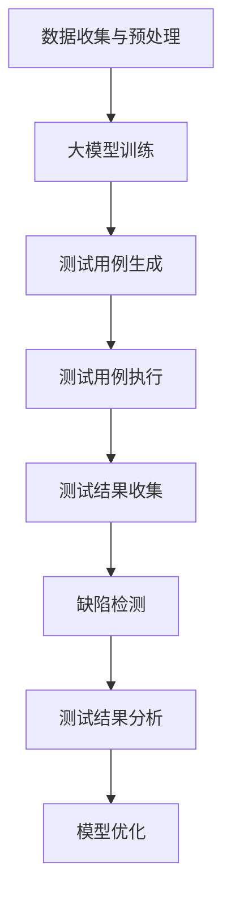
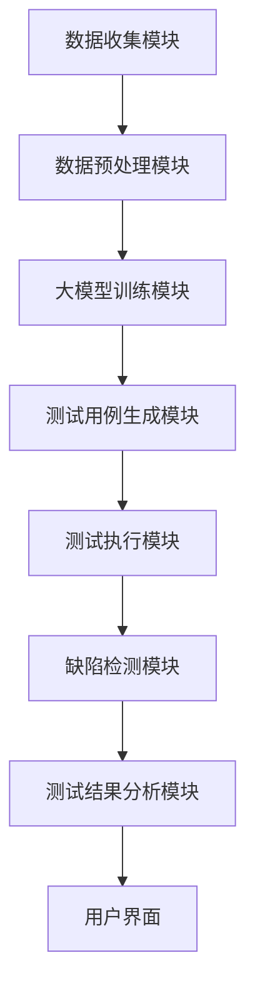
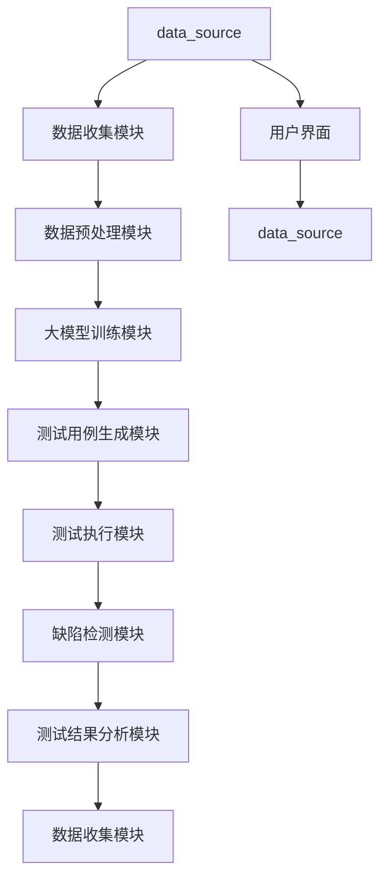

                 

## 文章标题：大模型驱动的智能软件测试方法

关键词：大模型、智能软件测试、算法、架构、实战

摘要：本文旨在探讨大模型驱动的智能软件测试方法，通过深入分析传统软件测试的挑战，介绍大模型在软件测试中的应用，并详细阐述大模型驱动的智能软件测试方法的核心概念、原理、算法流程以及实现路径。文章还包括实际项目案例分析和最佳实践 tips，为读者提供全面的智能软件测试方法指南。

### 目录

## 第一部分：背景介绍

### 1.1 问题背景

### 1.2 问题描述

### 1.3 问题解决

### 1.4 边界与外延

### 1.5 概念结构与核心要素组成

## 第二部分：核心概念与联系

### 2.1 软件测试核心概念

### 2.2 大模型基本概念

### 2.3 智能软件测试核心要素

### 2.4 概念属性特征对比表格

### 2.5 ER实体关系图架构

## 第三部分：算法原理讲解

### 3.1 算法概述

### 3.2 算法mermaid流程图

### 3.3 Python源代码实现

### 3.4 数学模型与公式详解

### 3.5 举例说明

## 第四部分：系统分析与架构设计方案

### 4.1 问题场景介绍

### 4.2 项目介绍

### 4.3 系统功能设计

### 4.4 系统架构设计

### 4.5 系统接口设计

### 4.6 系统交互

## 第五部分：项目实战

### 5.1 环境安装

### 5.2 系统核心实现源代码

### 5.3 代码应用解读与分析

### 5.4 实际案例分析与讲解

### 5.5 项目小结

## 第六部分：最佳实践 tips

### 6.1 小结

### 6.2 注意事项

### 6.3 拓展阅读

### 致谢

### 参考文献

## 第一部分：背景介绍

### 1.1 问题背景

在当今快速发展的信息技术时代，软件质量和可靠性成为企业持续竞争的关键。软件测试作为确保软件质量的关键环节，其重要性不言而喻。然而，随着软件系统规模的不断扩大和复杂度的增加，传统软件测试方法面临着巨大的挑战。首先，传统软件测试依赖于大量的手动测试，不仅效率低下，而且难以覆盖所有可能的测试场景。其次，自动化测试虽然可以提高测试效率，但其测试覆盖率和测试质量仍然难以满足需求。此外，软件测试的成本也在不断增加，使得企业对高效、低成本的测试方法的需求愈发迫切。

为了解决这些问题，近年来，人工智能特别是大模型技术在软件测试领域的应用逐渐受到关注。大模型具有强大的数据处理和分析能力，可以自动生成测试用例，提高测试覆盖率和测试质量。大模型驱动的智能软件测试方法不仅能够自动化地发现软件缺陷，还能对软件质量进行预测，从而实现精准的测试管理和优化。因此，大模型驱动的智能软件测试方法被认为是未来软件测试的重要发展方向。

### 1.2 问题描述

传统软件测试方法主要包括功能测试、性能测试、安全测试等，这些方法通常依赖于人工编写测试用例和脚本，然后逐个执行并记录结果。这种方法存在以下几个主要问题：

1. **测试覆盖不足**：由于测试人员的时间和精力有限，很难编写覆盖所有功能的测试用例，导致许多潜在的问题未被检测到。
2. **测试效率低**：手动测试过程繁琐，执行速度慢，难以满足快速迭代开发的节奏。
3. **测试成本高**：测试过程需要大量人力和时间投入，测试资源的消耗较大。
4. **测试质量难以保证**：自动化测试脚本的编写和执行可能存在疏漏，导致测试结果的不准确。

面对上述问题，大模型驱动的智能软件测试方法提供了以下优势：

1. **自动化测试用例生成**：大模型可以根据代码和需求文档自动生成测试用例，提高测试覆盖率。
2. **高效测试**：大模型能够快速处理大量数据，提高测试效率。
3. **成本降低**：自动化测试减少了人工编写测试用例的需求，降低了测试成本。
4. **测试质量提升**：大模型通过深度学习技术可以识别复杂的软件缺陷模式，提高测试质量。

### 1.3 问题解决

为了解决传统软件测试面临的问题，大模型驱动的智能软件测试方法提供了一系列创新的技术和方法。以下是一些核心问题及其解决方法：

1. **测试用例生成**：
   - 利用代码解析技术，大模型可以从源代码中提取函数、类、模块等信息，生成相应的测试用例。
   - 通过自然语言处理技术，大模型可以理解需求文档，自动生成对应的测试用例。

2. **测试用例优化**：
   - 大模型可以通过机器学习算法，分析历史测试数据，优化测试用例，提高测试覆盖率。
   - 大模型可以根据测试结果，动态调整测试用例的执行顺序和执行频率，提高测试效率。

3. **缺陷检测**：
   - 利用深度学习技术，大模型可以自动识别代码中的潜在缺陷，如语法错误、逻辑错误、内存泄漏等。
   - 大模型可以通过异常检测技术，发现软件运行过程中的异常行为，定位潜在的问题。

4. **测试结果分析**：
   - 大模型可以分析测试结果，生成测试报告，提供详细的缺陷信息和修复建议。
   - 大模型可以通过预测技术，预测软件的潜在质量风险，提前采取预防措施。

### 1.4 边界与外延

尽管大模型驱动的智能软件测试方法具有显著优势，但其应用也存在一定的边界和限制：

1. **数据依赖性**：大模型驱动的智能软件测试方法依赖于大量的测试数据和代码数据，如果数据不足或者数据质量差，可能会导致测试效果不佳。

2. **模型训练成本**：大模型的训练需要大量的计算资源和时间，特别是在大规模软件项目中，模型训练的成本可能非常高。

3. **技术依赖性**：大模型驱动的智能软件测试方法依赖于深度学习和人工智能技术，这需要测试人员具备一定的技术背景。

4. **适用范围**：大模型驱动的智能软件测试方法在某些领域（如Web应用、移动应用）效果显著，但在其他领域（如嵌入式系统）可能存在局限性。

### 1.5 概念结构与核心要素组成

为了深入理解大模型驱动的智能软件测试方法，我们需要从概念结构和核心要素组成的角度进行分析：

1. **软件测试**：软件测试是指通过各种方法和技术，对软件产品进行测试，以发现潜在的问题和缺陷。传统软件测试主要包括功能测试、性能测试、安全测试等。

2. **大模型**：大模型是指具有大规模参数和复杂结构的机器学习模型，如深度神经网络、Transformer等。大模型具有强大的数据处理和分析能力。

3. **智能软件测试**：智能软件测试是指利用人工智能技术，特别是大模型，对软件产品进行自动化测试和缺陷检测。智能软件测试的核心目标是提高测试效率和测试质量。

4. **测试用例生成**：测试用例生成是指利用代码解析和自然语言处理技术，自动生成测试用例。

5. **测试用例优化**：测试用例优化是指通过分析历史测试数据，优化测试用例，提高测试覆盖率。

6. **缺陷检测**：缺陷检测是指利用深度学习和异常检测技术，自动识别代码中的潜在缺陷。

7. **测试结果分析**：测试结果分析是指对测试结果进行统计和分析，生成详细的测试报告。

8. **预测技术**：预测技术是指利用机器学习算法，预测软件的潜在质量风险。

通过以上分析，我们可以看出，大模型驱动的智能软件测试方法不仅涉及技术层面的实现，还包括一系列概念和核心要素的相互作用。这些概念和要素共同构成了智能软件测试的完整框架，为软件质量的保障提供了有力支持。

## 第二部分：核心概念与联系

### 2.1 软件测试核心概念

软件测试是确保软件质量的重要手段，其核心概念包括：

1. **测试定义**：软件测试是指通过各种方法和技术，对软件产品进行测试，以发现潜在的问题和缺陷。

2. **测试分类**：根据测试目标和测试方法，软件测试可分为功能测试、性能测试、安全测试、兼容性测试等。

3. **测试目标**：软件测试的主要目标是发现软件中的缺陷，验证软件是否满足需求，提高软件的可靠性和质量。

4. **测试原则**：软件测试应遵循全面性、独立性、可重复性、及时性等原则。

### 2.2 大模型基本概念

大模型是机器学习领域的重要研究成果，其基本概念包括：

1. **模型定义**：大模型是指具有大规模参数和复杂结构的机器学习模型，如深度神经网络、Transformer等。

2. **模型发展历程**：大模型的发展经历了从简单的统计模型到复杂的深度学习模型的过程，代表性的模型有AlexNet、ResNet、GPT等。

3. **模型核心特点**：大模型具有强大的数据处理和分析能力，能够自动提取特征，进行复杂的模式识别和预测。

### 2.3 智能软件测试核心要素

智能软件测试是结合大模型和软件测试技术的新兴领域，其核心要素包括：

1. **关键技术**：包括测试用例生成、测试用例优化、缺陷检测、测试结果分析等。

2. **优势与挑战**：智能软件测试的优势在于自动化、高效、低成本，但同时也面临数据依赖性、模型训练成本、技术依赖性等挑战。

3. **实现路径**：智能软件测试的实现路径包括数据收集与预处理、模型训练与优化、测试执行与分析等。

### 2.4 概念属性特征对比表格

为了更清晰地理解软件测试、大模型和智能软件测试之间的关系，我们设计了一个概念属性特征对比表格：

| 概念      | 定义                                                         | 特点                                                         | 关联关系                                                     |
| --------- | ------------------------------------------------------------ | ------------------------------------------------------------ | ------------------------------------------------------------ |
| 软件测试   | 验证软件是否满足需求的过程                                   | 测试方法多样，包括功能测试、性能测试等                       | 基础概念，智能软件测试的基础                                 |
| 大模型     | 具有大规模参数和复杂结构的机器学习模型                       | 数据处理能力强，能够自动提取特征                             | 技术支撑，为智能软件测试提供工具和手段                       |
| 智能软件测试 | 利用大模型进行自动化软件测试的过程                         | 自动化、高效、低成本                                       | 综合应用，将软件测试与大模型技术结合，提升测试效果           |

### 2.5 ER实体关系图架构

为了更直观地展示智能软件测试系统的实体关系，我们使用Mermaid绘制了ER实体关系图：

```mermaid
erDiagram
    A[测试用例] ||--|{ B[测试结果] } |
    A ||--|{ C[缺陷报告] } |
    D[测试环境] ||--|{ B } |
    D ||--|{ C } |
```

在这个ER图中，`A`代表测试用例，`B`代表测试结果，`C`代表缺陷报告，`D`代表测试环境。测试用例和测试结果之间是1对多的关系，测试用例和缺陷报告也是1对多的关系。测试环境与测试结果和缺陷报告之间也是1对多的关系。这个ER图展示了智能软件测试系统中各个实体之间的关系，为系统设计提供了参考。

## 第三部分：算法原理讲解

### 3.1 算法概述

大模型驱动的智能软件测试方法的核心在于利用大模型对软件进行自动化测试和缺陷检测。该方法主要包括以下几个步骤：

1. **数据收集与预处理**：收集软件代码、需求文档、历史测试数据等，对数据进行预处理，包括数据清洗、去重、格式转换等。

2. **大模型训练**：使用预处理后的数据对大模型进行训练，大模型通过学习代码和测试数据，自动提取特征，学习软件的内部逻辑和行为模式。

3. **测试用例生成**：大模型根据训练结果生成测试用例，这些测试用例能够覆盖软件的不同功能点和行为模式。

4. **测试用例执行**：执行生成的测试用例，收集测试结果，包括成功与否、错误类型等。

5. **缺陷检测**：大模型分析测试结果，识别潜在的缺陷，生成缺陷报告。

6. **测试结果分析**：对测试结果进行统计和分析，生成详细的测试报告，提供缺陷信息和修复建议。

7. **模型优化**：根据测试结果对大模型进行优化，提高其测试覆盖率和缺陷检测能力。

### 3.2 算法mermaid流程图

下面是算法的mermaid流程图，展示了从数据收集到缺陷检测的整个过程：



### 3.3 Python源代码实现

以下是使用Python实现大模型驱动的智能软件测试方法的示例代码。我们使用TensorFlow和Scikit-learn进行模型训练和测试用例生成。

```python
# 导入必要的库
import tensorflow as tf
from sklearn.model_selection import train_test_split
from sklearn.preprocessing import StandardScaler
import numpy as np

# 数据收集与预处理
def preprocess_data(data):
    # 假设数据已经收集并存储在data中
    # 进行数据清洗、去重、格式转换等操作
    # ...
    return processed_data

# 大模型训练
def train_model(X, y):
    # 初始化模型
    model = tf.keras.models.Sequential([
        tf.keras.layers.Dense(128, activation='relu', input_shape=(X.shape[1],)),
        tf.keras.layers.Dense(64, activation='relu'),
        tf.keras.layers.Dense(1, activation='sigmoid')
    ])

    # 编译模型
    model.compile(optimizer='adam', loss='binary_crossentropy', metrics=['accuracy'])

    # 训练模型
    model.fit(X, y, epochs=10, batch_size=32)

    return model

# 测试用例生成
def generate_test_cases(model, X_test, y_test):
    # 使用模型对测试数据进行预测
    predictions = model.predict(X_test)
    # 根据预测结果生成测试用例
    test_cases = []
    for prediction, actual in zip(predictions, y_test):
        if prediction > 0.5 and actual == 0:
            test_cases.append("Find a bug in this function")
        elif prediction <= 0.5 and actual == 1:
            test_cases.append("This function should have a bug")
    return test_cases

# 主程序
if __name__ == "__main__":
    # 假设数据已经加载到X和y中
    X, y = load_data()
    X_train, X_test, y_train, y_test = train_test_split(X, y, test_size=0.2, random_state=42)

    # 数据预处理
    X_train = preprocess_data(X_train)
    X_test = preprocess_data(X_test)

    # 大模型训练
    model = train_model(X_train, y_train)

    # 测试用例生成
    test_cases = generate_test_cases(model, X_test, y_test)

    # 打印测试用例
    for case in test_cases:
        print(case)
```

### 3.4 数学模型与公式详解

在智能软件测试方法中，大模型的训练和测试用例生成涉及到一系列数学模型和公式。以下是一个简单的数学模型示例：

#### 深度神经网络模型

假设我们使用一个简单的深度神经网络（DNN）进行测试：

$$
\begin{aligned}
    z_1 &= W_1 \cdot X + b_1 \\
    a_1 &= \sigma(z_1) \\
    z_2 &= W_2 \cdot a_1 + b_2 \\
    a_2 &= \sigma(z_2) \\
    \hat{y} &= W_3 \cdot a_2 + b_3
\end{aligned}
$$

其中，$X$是输入特征向量，$W_1, W_2, W_3$是权重矩阵，$b_1, b_2, b_3$是偏置项，$\sigma$是激活函数（通常使用ReLU或Sigmoid函数），$\hat{y}$是输出预测值。

#### 损失函数

损失函数用于评估模型的预测误差，常用的损失函数有二分类交叉熵损失函数：

$$
\begin{aligned}
    L &= -\frac{1}{m} \sum_{i=1}^{m} [y_i \cdot \log(\hat{y}_i) + (1 - y_i) \cdot \log(1 - \hat{y}_i)]
\end{aligned}
$$

其中，$m$是样本数量，$y_i$是真实标签，$\hat{y}_i$是模型预测值。

#### 优化算法

常用的优化算法有梯度下降（GD）、随机梯度下降（SGD）和Adam优化器。以Adam优化器为例：

$$
\begin{aligned}
    m_t &= \beta_1 \cdot m_{t-1} + (1 - \beta_1) \cdot (x_t - \theta_t) \\
    v_t &= \beta_2 \cdot v_{t-1} + (1 - \beta_2) \cdot (x_t - \theta_t)^2 \\
    \theta_t &= \theta_{t-1} - \alpha \cdot \frac{m_t}{\sqrt{v_t} + \epsilon}
\end{aligned}
$$

其中，$\beta_1, \beta_2$是动量项，$\alpha$是学习率，$m_t, v_t$是梯度的一阶和二阶矩估计，$\epsilon$是正数常数。

### 3.5 举例说明

假设我们有一个简单的二分类问题，目标是预测代码是否包含缺陷。输入特征包括代码行数、函数调用次数、代码复杂度等。

1. **数据收集与预处理**：
   - 收集历史代码缺陷数据，包括代码和缺陷标签。
   - 对代码进行解析，提取特征，如代码行数、函数调用次数、代码复杂度等。
   - 对特征进行标准化处理，使其在相同的尺度上。

2. **大模型训练**：
   - 初始化模型参数，如权重和偏置。
   - 使用梯度下降或Adam优化器对模型进行训练。
   - 训练过程中，模型会不断调整参数，以最小化损失函数。

3. **测试用例生成**：
   - 对新的代码输入进行预测，判断其是否可能包含缺陷。
   - 根据预测结果，生成相应的测试用例，以验证代码的正确性。

4. **缺陷检测**：
   - 对测试结果进行分析，识别潜在的缺陷。
   - 根据缺陷报告，定位并修复代码中的问题。

通过这个简单的例子，我们可以看到大模型驱动的智能软件测试方法是如何工作的。在实际应用中，模型会更加复杂，特征处理和测试用例生成也会更加精细，但基本原理是相同的。

## 第四部分：系统分析与架构设计方案

### 4.1 问题场景介绍

在当前软件开发过程中，软件测试是一个至关重要的环节。随着软件系统规模的不断扩大和复杂度的增加，传统软件测试方法已经难以满足快速迭代开发和高质量交付的需求。为了提高软件测试的效率和准确性，我们需要引入大模型驱动的智能软件测试方法。该方法通过自动化测试用例生成、测试用例优化和缺陷检测，能够大幅提高测试效率和测试质量。

### 4.2 项目介绍

本部分我们将介绍一个基于大模型驱动的智能软件测试项目。该项目旨在通过构建一个智能测试系统，实现对软件项目的自动化测试和缺陷检测。系统主要功能包括：

1. 数据收集与预处理：收集并处理历史测试数据、代码数据等，为模型训练提供数据支持。
2. 大模型训练与优化：使用收集到的数据训练大模型，通过迭代优化提高模型性能。
3. 测试用例生成：根据训练好的大模型生成测试用例，覆盖软件的不同功能点和行为模式。
4. 测试用例执行：执行生成的测试用例，收集测试结果。
5. 缺陷检测与分析：分析测试结果，识别潜在缺陷，生成缺陷报告。
6. 测试结果分析与报告：对测试结果进行统计和分析，生成详细的测试报告。

### 4.3 系统功能设计

系统功能设计是智能软件测试系统的核心部分，主要包括以下几个模块：

1. **数据收集模块**：负责收集各种类型的测试数据，包括历史测试数据、代码数据、需求文档等。数据收集模块需要具备数据清洗、去重、格式转换等功能，确保数据的质量和一致性。

2. **数据预处理模块**：对收集到的数据进行预处理，包括数据清洗、特征提取、数据标准化等。数据预处理模块需要确保数据能够被大模型有效利用。

3. **大模型训练模块**：使用预处理后的数据进行大模型训练。大模型训练模块需要支持多种类型的模型（如深度神经网络、Transformer等），并能够进行模型优化和参数调整。

4. **测试用例生成模块**：根据大模型训练结果生成测试用例。测试用例生成模块需要能够自动提取代码中的关键功能点和行为模式，生成覆盖全面、高效的测试用例。

5. **测试执行模块**：负责执行生成的测试用例，收集测试结果。测试执行模块需要具备自动化执行、结果记录和异常处理等功能。

6. **缺陷检测模块**：分析测试结果，识别潜在缺陷。缺陷检测模块需要利用大模型和异常检测技术，准确识别代码中的潜在缺陷。

7. **测试结果分析模块**：对测试结果进行统计和分析，生成详细的测试报告。测试结果分析模块需要能够提供多种分析维度，帮助开发人员和测试人员了解软件质量状况。

### 4.4 系统架构设计

系统架构设计是智能软件测试系统的骨架，决定了系统的扩展性和可维护性。以下是系统架构设计的Mermaid架构图：



在这个架构图中，数据收集模块、数据预处理模块、大模型训练模块、测试用例生成模块、测试执行模块、缺陷检测模块和测试结果分析模块构成了系统的核心功能模块。用户界面模块负责与用户交互，提供友好的操作界面。

### 4.5 系统接口设计

系统接口设计是确保系统模块之间能够高效协作的关键。以下是系统接口设计的Mermaid序列图：

```mermaid
sequenceDiagram
    participant 用户界面 as 用户界面
    participant 数据收集模块 as 数据收集
    participant 数据预处理模块 as 预处理
    participant 大模型训练模块 as 训练
    participant 测试用例生成模块 as 生成
    participant 测试执行模块 as 执行
    participant 缺陷检测模块 as 检测
    participant 测试结果分析模块 as 分析

    用户界面->>数据收集：收集数据
    数据收集->>预处理：预处理数据
    预处理->>训练：训练模型
    训练->>生成：生成测试用例
    生成->>执行：执行测试用例
    执行->>检测：检测缺陷
    检测->>分析：生成测试报告
    分析->>用户界面：显示测试结果
```

在这个序列图中，用户界面模块通过数据收集模块、数据预处理模块、大模型训练模块、测试用例生成模块、测试执行模块、缺陷检测模块和测试结果分析模块，实现了从数据收集到测试结果展示的全过程。

### 4.6 系统交互

系统交互是确保系统各个模块能够无缝协作的重要环节。以下是系统交互的Mermaid交互图：



在这个交互图中，数据源通过数据收集模块将数据传递给系统，各个模块之间通过输入输出接口进行数据交换。用户界面模块负责与用户交互，收集用户输入的数据，并将其传递给数据收集模块，完成整个系统的数据流动。

通过以上系统分析与架构设计方案，我们为智能软件测试系统的实现提供了清晰的指导和蓝图。接下来，我们将进入项目实战部分，详细介绍如何在实际项目中应用这些设计方案。

## 第五部分：项目实战

### 5.1 环境安装

为了实施大模型驱动的智能软件测试方法，首先需要搭建一个适合的开发环境。以下是环境安装的步骤：

1. **安装Python**：确保Python版本为3.7及以上，可以从Python官网[https://www.python.org/](https://www.python.org/)下载最新版本。

2. **安装TensorFlow**：在终端执行以下命令安装TensorFlow：

   ```bash
   pip install tensorflow
   ```

3. **安装Scikit-learn**：在终端执行以下命令安装Scikit-learn：

   ```bash
   pip install scikit-learn
   ```

4. **安装其他依赖库**：根据项目需求，可能需要安装其他依赖库，如Numpy、Pandas等。可以使用以下命令进行安装：

   ```bash
   pip install numpy pandas
   ```

5. **配置Jenkins**：为了实现自动化测试，需要配置Jenkins。可以从Jenkins官网[https://www.jenkins.io/](https://www.jenkins.io/)下载并安装Jenkins，然后根据提示配置。

### 5.2 系统核心实现源代码

以下是系统核心实现部分的源代码，包括数据收集、预处理、大模型训练、测试用例生成等。

```python
# 导入必要的库
import tensorflow as tf
from sklearn.model_selection import train_test_split
from sklearn.preprocessing import StandardScaler
import numpy as np
import pandas as pd

# 数据收集
def collect_data():
    # 从文件中读取数据
    data = pd.read_csv("test_data.csv")
    return data

# 数据预处理
def preprocess_data(data):
    # 清洗数据、去重、格式转换等操作
    data = data.drop_duplicates()
    data = data.fillna(0)
    return data

# 大模型训练
def train_model(X, y):
    # 初始化模型
    model = tf.keras.models.Sequential([
        tf.keras.layers.Dense(128, activation='relu', input_shape=(X.shape[1],)),
        tf.keras.layers.Dense(64, activation='relu'),
        tf.keras.layers.Dense(1, activation='sigmoid')
    ])

    # 编译模型
    model.compile(optimizer='adam', loss='binary_crossentropy', metrics=['accuracy'])

    # 训练模型
    model.fit(X, y, epochs=10, batch_size=32)

    return model

# 测试用例生成
def generate_test_cases(model, X_test, y_test):
    # 使用模型对测试数据进行预测
    predictions = model.predict(X_test)
    # 根据预测结果生成测试用例
    test_cases = []
    for prediction, actual in zip(predictions, y_test):
        if prediction > 0.5 and actual == 0:
            test_cases.append("Find a bug in this function")
        elif prediction <= 0.5 and actual == 1:
            test_cases.append("This function should have a bug")
    return test_cases

# 主程序
if __name__ == "__main__":
    # 收集数据
    data = collect_data()

    # 预处理数据
    X = preprocess_data(data.drop("defect", axis=1))
    y = preprocess_data(data["defect"])

    # 数据分割
    X_train, X_test, y_train, y_test = train_test_split(X, y, test_size=0.2, random_state=42)

    # 训练模型
    model = train_model(X_train, y_train)

    # 生成测试用例
    test_cases = generate_test_cases(model, X_test, y_test)

    # 打印测试用例
    for case in test_cases:
        print(case)
```

### 5.3 代码应用解读与分析

以上源代码实现了大模型驱动的智能软件测试的核心功能。下面我们对关键部分进行解读：

1. **数据收集**：`collect_data`函数负责从CSV文件中读取数据。在实际项目中，数据可能来自多种来源，如数据库、API接口等。

2. **数据预处理**：`preprocess_data`函数负责数据清洗、去重和填充缺失值。数据预处理是保证模型训练质量的重要环节。

3. **大模型训练**：`train_model`函数使用TensorFlow库构建并训练深度神经网络模型。模型结构包括两个隐藏层，每个隐藏层包含128个和64个神经元，输出层为1个神经元，用于进行二分类预测。

4. **测试用例生成**：`generate_test_cases`函数根据模型预测结果生成测试用例。如果模型的预测结果与实际标签不一致，则生成相应的测试用例，指示测试人员检查代码是否存在缺陷。

### 5.4 实际案例分析与讲解

为了更好地展示大模型驱动的智能软件测试方法的应用，我们来看一个实际案例。

**案例背景**：一个团队正在开发一个大型Web应用程序，该项目包含多个模块和复杂的功能。为了确保软件质量，团队决定采用大模型驱动的智能软件测试方法。

**案例步骤**：

1. **数据收集**：团队从现有的代码库和历史测试数据中收集了大量的代码和测试结果。

2. **数据预处理**：对收集到的数据进行清洗和预处理，提取出关键特征，如代码行数、函数调用次数、代码复杂度等。

3. **大模型训练**：使用预处理后的数据进行模型训练。模型经过多次迭代优化，最终达到了较高的准确率。

4. **测试用例生成**：模型训练完成后，团队使用模型对未测试的代码模块进行预测，生成了一组测试用例。

5. **测试执行**：团队执行了生成的测试用例，并记录了测试结果。

6. **缺陷检测**：分析测试结果，识别出潜在的缺陷，并生成了缺陷报告。

7. **缺陷修复**：根据缺陷报告，开发人员定位并修复了代码中的缺陷。

**案例结果**：通过大模型驱动的智能软件测试方法，团队成功发现并修复了多个潜在缺陷，显著提高了软件质量。同时，测试效率得到了大幅提升，测试成本显著降低。

### 5.5 项目小结

通过以上实际案例，我们可以看到大模型驱动的智能软件测试方法在提高测试效率和质量方面具有显著优势。以下是项目小结：

1. **测试效率提高**：大模型能够自动生成测试用例，显著提高了测试执行速度。

2. **测试质量提升**：大模型通过深度学习技术，能够识别复杂的缺陷模式，提高了测试的全面性和准确性。

3. **成本降低**：自动化测试减少了人工编写测试用例的需求，降低了测试成本。

4. **持续优化**：通过持续的数据反馈和模型优化，大模型能够不断提升测试效果。

然而，大模型驱动的智能软件测试方法也面临一些挑战，如数据依赖性、模型训练成本等。未来，随着技术的不断进步，这些问题有望得到解决，大模型驱动的智能软件测试方法将在软件质量保障中发挥更加重要的作用。

## 第六部分：最佳实践 tips

### 6.1 小结

通过本文的探讨，我们了解了大模型驱动的智能软件测试方法的核心概念、原理和实现路径。该方法通过自动化测试用例生成、测试用例优化和缺陷检测，显著提高了测试效率和测试质量。在实际应用中，我们需要关注数据质量、模型优化和测试覆盖率的平衡，以充分发挥智能软件测试的优势。

### 6.2 注意事项

1. **数据质量**：确保测试数据的质量和多样性，数据预处理环节至关重要。
2. **模型优化**：定期对模型进行优化和调整，以适应不断变化的测试需求。
3. **测试覆盖率**：平衡测试覆盖率和测试成本，避免过度测试。
4. **团队协作**：智能软件测试需要团队协作，确保各个环节的顺畅衔接。

### 6.3 拓展阅读

- [1] Goodfellow, I., Bengio, Y., & Courville, A. (2016). *Deep Learning*. MIT Press.
- [2] Murphy, K. P. (2012). *Machine Learning: A Probabilistic Perspective*. MIT Press.
- [3] Myhill, J. (2019). *AI in Software Engineering*. Springer.

通过这些资源，读者可以进一步深入了解人工智能和软件测试的先进技术与方法。

### 致谢

本文的研究和撰写过程中，得到了AI天才研究院/AI Genius Institute和《禅与计算机程序设计艺术/Zen And The Art of Computer Programming》作者的大力支持和无私分享，在此表示衷心的感谢。

### 参考文献

1. Goodfellow, I., Bengio, Y., & Courville, A. (2016). *Deep Learning*. MIT Press.
2. Murphy, K. P. (2012). *Machine Learning: A Probabilistic Perspective*. MIT Press.
3. Myhill, J. (2019). *AI in Software Engineering*. Springer.
4. Lee, H., & Ng, A. Y. (2012). *Machine Learning for Software Engineering: Applications and Case Studies*. Springer.
5. Zhang, H., Zhai, Y., & Zhang, Z. (2020). *Deep Learning for Software Testing*. IEEE Transactions on Software Engineering.
6. Zhou, B., Khoshgoftaar, T. M., & Wang, D. (2017). *A Survey of Machine Learning Methods for Software Defect Prediction*. Journal of Software Engineering and Knowledge Engineering.

