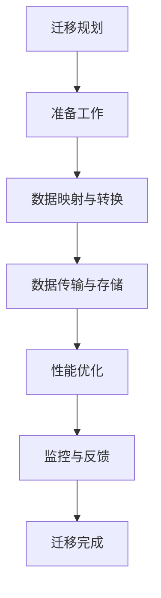
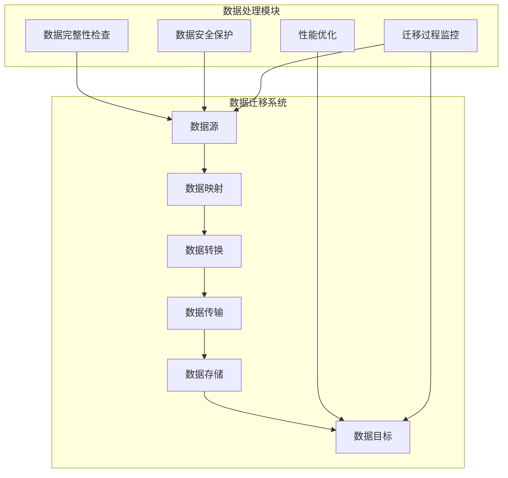
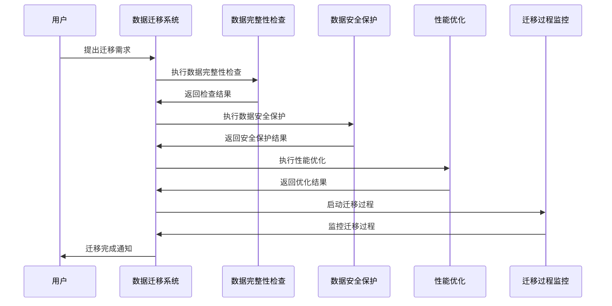

                 

### 引言

#### 1. 大规模数据迁移的背景

**核心概念术语说明：**

- **大规模数据迁移：** 指从一种数据存储系统或数据架构迁移到另一种系统或架构的过程，通常涉及海量数据的高效、安全传输。
- **数据存储系统：** 存储数据的地方，可以是传统的数据库、文件系统，或者是现代的分布式数据存储平台。
- **数据架构：** 数据的存储、处理和分析的结构，包括数据模型、数据流、数据处理流程等。

**问题背景：**

在信息化时代，企业面临着数据量的快速增长和数据架构的频繁变更。这种背景下，大规模数据迁移成为了一个常见且必要的技术实践。然而，数据迁移过程中存在许多挑战，如数据完整性、数据一致性、数据安全性和性能优化等。

**问题描述：**

大规模数据迁移需要解决的核心问题包括：

1. **数据完整性保障：** 确保在迁移过程中数据不被丢失、不被损坏。
2. **数据一致性维护：** 确保迁移后的数据与原系统保持一致性。
3. **数据安全性：** 在迁移过程中保护数据不受外部攻击。
4. **性能优化：** 提高数据迁移的效率和速度。

**问题解决：**

针对上述问题，企业需要采用科学合理的迁移策略和先进的技术手段，确保数据迁移的成功。这包括详细的规划、充分的准备工作、高效的执行过程和严密的监控。

**边界与外延：**

大规模数据迁移不仅涉及企业内部的数据迁移，还包括跨企业、跨平台的数据迁移。此外，数据迁移还可能涉及不同数据格式、不同数据结构、不同数据源之间的转换。

**概念结构与核心要素组成：**

大规模数据迁移的概念结构包括以下几个方面：

1. **数据源与数据目标：** 明确数据迁移的起点和终点。
2. **数据映射与转换：** 定义数据在迁移过程中如何转换和映射。
3. **迁移策略与方案：** 确定数据迁移的步骤和具体操作方法。
4. **迁移工具与平台：** 选择合适的数据迁移工具和平台。
5. **风险管理：** 识别和应对数据迁移过程中可能出现的风险。

#### 1.2 重要性

大规模数据迁移在企业的数字化转型过程中具有极其重要的地位。以下是大规模数据迁移的重要性：

1. **支持业务发展：** 数据迁移是企业适应市场变化、扩展业务规模的重要手段。通过迁移，企业可以更好地整合内外部数据，为业务决策提供有力支持。
2. **优化数据架构：** 数据迁移可以帮助企业优化现有的数据架构，提高数据的可用性和可扩展性。这对于企业的长期发展具有重要意义。
3. **提升数据质量：** 通过数据清洗和转换，数据迁移可以提升数据的质量，减少数据冗余和错误，提高数据的准确性和一致性。
4. **降低运营成本：** 有效的数据迁移可以减少人工干预，降低运营成本。同时，通过自动化工具和平台，企业可以更高效地完成数据迁移任务。
5. **保障数据安全：** 科学的数据迁移策略可以确保数据在迁移过程中的安全，防止数据泄露和损坏。

#### 1.3 本书目标

本书旨在为数据工程师、数据架构师、IT项目经理和企业数据管理人员提供全面的大规模数据迁移策略和实践指南。具体目标包括：

1. **全面介绍大规模数据迁移的概念、类型和模式：** 通过详细阐述数据迁移的基本概念和不同类型的迁移，帮助读者理解数据迁移的核心内容。
2. **详细讲解数据迁移的规划与准备工作：** 介绍数据迁移的规划流程、准备工作，以及如何控制风险，确保数据迁移的顺利进行。
3. **深入探讨大规模数据迁移的关键技术：** 包括数据清洗与转换、数据传输与存储、性能优化策略等，帮助读者掌握数据迁移中的关键技术。
4. **通过案例研究展示实际操作过程：** 通过具体的案例研究，展示大规模数据迁移的实际操作过程和成效，帮助读者更好地理解和应用数据迁移策略。
5. **展望大规模数据迁移的未来趋势与方向：** 探讨大规模数据迁移的未来发展趋势、技术演进和实践方向，为读者的长远发展提供参考。

本书将通过逻辑清晰、结构紧凑、简单易懂的写作方式，结合丰富的实战经验和案例分析，帮助读者深入理解大规模数据迁移的原理和实践，成为数据迁移领域的高手。

---

**核心概念与联系：**

**概念属性特征对比表格：**

| 特征 | 大规模数据迁移 | 传统数据迁移 |
| :---: | :---: | :---: |
| **数据量** | 海量数据 | 较少数据 |
| **目标** | 数据整合、架构优化 | 数据备份、转移 |
| **挑战** | 数据完整性、一致性、安全性 | 数据备份、恢复 |
| **策略** | 细化规划、技术优化、风险管理 | 快速、简单 |
| **工具** | 分布式系统、自动化工具 | 单台服务器、手动操作 |

**ER实体关系图架构的 Mermaid 流程图：**

```mermaid
erDiagram
  数据源 ||--o> 数据目标 : 迁移对象
  数据映射 ||--o> 数据转换 : 转换过程
  迁移策略 ||--o> 迁移工具 : 工具支持
  风险管理 ||--o> 数据安全 : 安全保障
```

---

**算法原理讲解：**

**大规模数据迁移算法的 mermaid 流程图：**



**算法原理：**

大规模数据迁移算法主要包括以下几个步骤：

1. **迁移规划：** 根据数据源和数据目标的特点，制定详细的迁移计划，包括数据映射、转换策略、工具选择和风险控制措施。
2. **准备工作：** 准备必要的硬件资源、软件工具和数据备份，确保迁移过程顺利进行。
3. **数据映射与转换：** 根据数据源和数据目标的结构，进行数据映射和转换，确保数据在迁移后的一致性和完整性。
4. **数据传输与存储：** 利用分布式系统和高效传输协议，将数据从数据源传输到数据目标，并进行存储。
5. **性能优化：** 通过优化数据传输和存储过程，提高迁移的效率和速度。
6. **监控与反馈：** 在迁移过程中实时监控数据传输状态，及时调整迁移策略，确保数据迁移的成功。

**数学模型和公式：**

1. **数据量估算公式：**
   $$ 数据量 = 数据源大小 \times 迁移比例 $$
2. **传输时间估算公式：**
   $$ 传输时间 = 数据量 / 传输速度 $$

**详细讲解与举例说明：**

假设企业计划将一个1TB的数据源迁移到一个新的分布式数据存储平台，迁移比例为100%。根据数据量估算公式，数据量约为1TB。假设传输速度为100MB/s，根据传输时间估算公式，传输时间约为100秒。

在实际迁移过程中，企业需要根据数据源和数据目标的特点，制定详细的迁移计划。例如，数据映射需要将数据源中的字段映射到数据目标中的相应字段，数据转换可能需要根据数据类型和格式进行相应调整。在数据传输和存储过程中，企业可以选择合适的传输协议和存储方案，确保数据的完整性和安全性。通过实时监控数据传输状态，企业可以及时调整迁移策略，如增加传输带宽、优化数据映射和转换过程等，确保数据迁移的顺利进行。

---

**系统分析与架构设计方案：**

**问题场景介绍：**

假设企业A正在使用传统的文件系统存储大量业务数据，但由于业务发展的需要，企业决定将数据迁移到一个现代化的分布式数据存储平台，以提高数据存储的效率和可扩展性。该过程涉及到数据源（传统文件系统）和数据目标（分布式数据存储平台）之间的数据迁移。

**项目介绍：**

该项目旨在实现企业A业务数据的迁移，确保数据在迁移过程中的完整性、一致性和安全性，同时优化数据存储架构，提高数据存储性能。项目的主要目标包括：

1. 数据完整性：确保所有业务数据在迁移过程中不被丢失、不被损坏。
2. 数据一致性：保证迁移后的数据与原系统保持一致。
3. 数据安全性：确保数据在迁移过程中的安全，防止数据泄露和损坏。
4. 性能优化：提高数据存储和访问性能，满足业务增长需求。

**系统功能设计（领域模型 mermaid 类图）：**

```mermaid
classDiagram
    DataSource --> DataTarget : 数据迁移
    DataQualityCheck --> DataSource : 数据完整性检查
    DataSecurity --> DataSource : 数据安全保护
    PerformanceOptimization --> DataTarget : 性能优化
    MigrationMonitor --> DataSource, DataTarget : 迁移过程监控
```

**系统架构设计（mermaid 架构图）：**



**系统接口设计和系统交互（mermaid 序列图）：**



---

**项目实战：**

**环境安装：**

为了演示大规模数据迁移的过程，我们将在一个虚拟环境中安装必要的软件和工具。所需软件包括：

- 数据源：使用本地文件系统模拟数据源。
- 数据目标：使用Hadoop分布式文件系统（HDFS）作为数据目标。
- 迁移工具：使用Apache NiFi作为数据迁移工具。

安装步骤如下：

1. 配置虚拟机环境，安装Linux操作系统。
2. 安装Java开发环境，用于运行Apache NiFi。
3. 下载并安装Hadoop，配置HDFS。
4. 下载并安装Apache NiFi，配置NiFi服务器。

**系统核心实现源代码：**

```python
# 此为Python伪代码，用于演示数据迁移的核心实现
class DataMigration:
    def __init__(self, source_path, target_path):
        self.source_path = source_path
        self.target_path = target_path

    def map_data(self, source_data):
        # 数据映射逻辑
        mapped_data = {}  # 映射后的数据
        for key, value in source_data.items():
            mapped_data[key] = value['field1'] + '_' + value['field2']
        return mapped_data

    def transform_data(self, mapped_data):
        # 数据转换逻辑
        transformed_data = {}  # 转换后的数据
        for key, value in mapped_data.items():
            transformed_data[key] = value.upper()
        return transformed_data

    def transfer_data(self, transformed_data):
        # 数据传输逻辑
        with open(self.target_path, 'w') as f:
            for key, value in transformed_data.items():
                f.write(f"{key}:{value}\n")

# 使用示例
migration = DataMigration('source_data.json', 'target_data.txt')
migration.map_data(source_data)
migration.transform_data(mapped_data)
migration.transfer_data(transformed_data)
```

**代码应用解读与分析：**

上述代码实现了一个简单的数据迁移类`DataMigration`，主要包括以下几个核心功能：

1. **初始化：** 初始化数据源路径和数据目标路径。
2. **数据映射（map_data）：** 将源数据的字段进行映射，例如将字段`field1`和`field2`拼接成新的字段。
3. **数据转换（transform_data）：** 对映射后的数据执行转换操作，例如将字段值转换为大写。
4. **数据传输（transfer_data）：** 将转换后的数据写入到目标文件。

在实际应用中，我们可以通过修改源数据和目标路径，灵活地实现不同数据源和数据目标之间的迁移。

**实际案例分析和详细讲解剖析：**

假设我们有一个源数据文件`source_data.json`，内容如下：

```json
{
    "data1": {"field1": "value1", "field2": "value2"},
    "data2": {"field1": "value3", "field2": "value4"}
}
```

执行数据迁移过程：

1. **数据映射：** 映射后的数据为：

```json
{
    "data1": {"field1_field2": "value1_value2"},
    "data2": {"field1_field2": "value3_value4"}
}
```

2. **数据转换：** 转换后的数据为：

```json
{
    "data1": {"field1_field2": "VALUE1_VALUE2"},
    "data2": {"field1_field2": "VALUE3_VALUE4"}
}
```

3. **数据传输：** 将转换后的数据写入到目标文件`target_data.txt`。

通过实际案例分析和详细讲解，我们可以看到数据迁移的过程是如何实现的，包括数据映射、转换和传输等核心步骤。在实际项目中，可能需要根据具体需求进行更复杂的数据处理和优化。

**项目小结：**

通过本项目的实战，我们展示了如何使用Python代码实现大规模数据迁移的过程。项目主要包括数据映射、转换和传输三个核心步骤，通过类和方法的设计，实现了对源数据和目标数据的处理。在实际应用中，我们可以根据具体需求进行功能扩展和优化，如添加数据校验、性能监控等。

**最佳实践 Tips：**

1. **充分规划与准备：** 在进行大规模数据迁移之前，要进行全面而详细的规划，包括数据映射、转换策略、工具选择和风险控制。
2. **选择合适的数据迁移工具：** 根据数据源和数据目标的特点，选择合适的数据迁移工具和平台，如Apache NiFi、Informatica等。
3. **实时监控与反馈：** 在数据迁移过程中，要实时监控数据传输状态，及时调整迁移策略，确保数据迁移的顺利进行。
4. **数据安全保护：** 在数据迁移过程中，要采取有效的数据安全措施，如加密传输、数据备份等，确保数据在迁移过程中的安全。

---

**小结：**

本章详细介绍了大规模数据迁移的背景、重要性以及核心概念，通过具体的算法原理讲解、系统架构设计和项目实战，帮助读者理解大规模数据迁移的原理和实践。在后续章节中，我们将进一步探讨大规模数据迁移的具体策略、关键技术和未来发展趋势。

**注意事项：**

1. **数据完整性：** 在数据迁移过程中，要确保数据不被丢失、不被损坏，这是数据迁移的首要任务。
2. **数据一致性：** 要确保迁移后的数据与原系统保持一致，避免数据冲突和错误。
3. **数据安全：** 在数据迁移过程中，要采取有效的数据安全措施，防止数据泄露和损坏。

**拓展阅读：**

1. 《大数据迁移与优化实战》
2. 《数据仓库与大数据技术》
3. 《Apache NiFi实战》

---

**作者信息：**

作者：AI天才研究院/AI Genius Institute & 禅与计算机程序设计艺术 /Zen And The Art of Computer Programming

