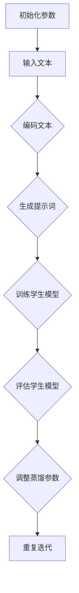
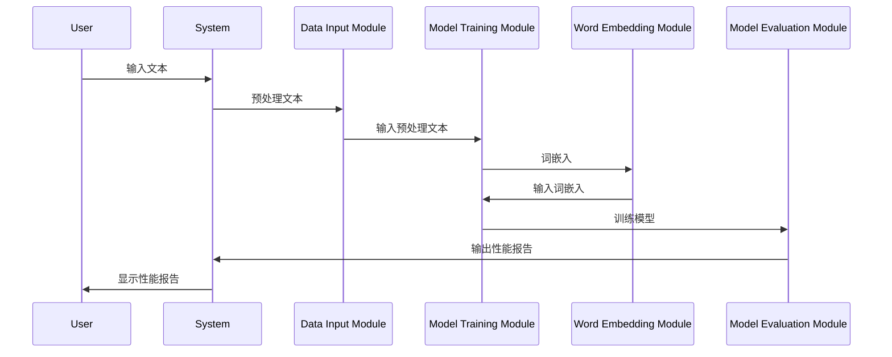
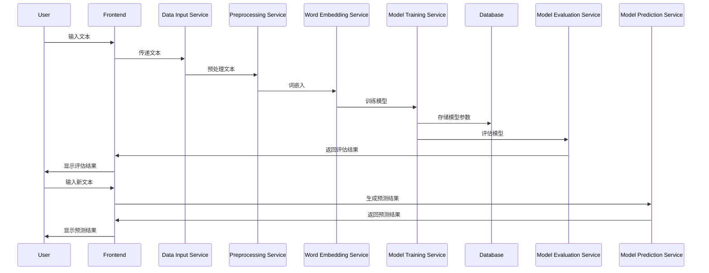
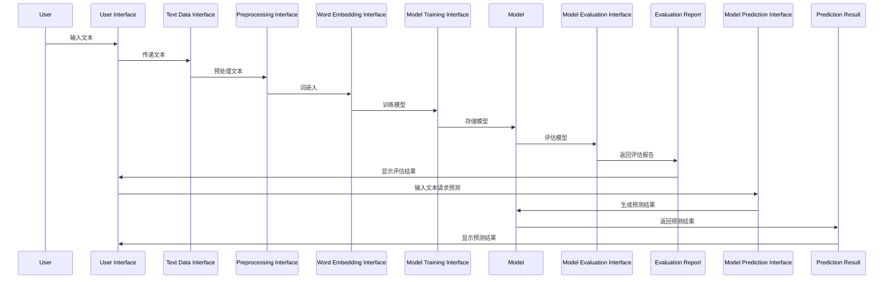

                 

## 大语言模型的提示词知识蒸馏技术

### 关键词

- 大语言模型
- 知识蒸馏技术
- 提示词
- 深度学习
- 自然语言处理

### 摘要

本文将深入探讨大语言模型的提示词知识蒸馏技术。我们将首先介绍大语言模型的发展背景和演进过程，接着详细阐述提示词知识蒸馏技术的原理和作用。随后，我们将对比大语言模型和提示词知识蒸馏技术的核心概念和属性特征，并通过ER实体关系图来展示它们之间的关系。接着，我们将深入讲解大语言模型的算法原理，包括神经网络结构和深度学习算法。然后，我们将详细描述提示词知识蒸馏技术的数学模型和实现方法。最后，我们将分析大语言模型的应用场景，设计系统功能，并给出系统架构设计方案。通过本文的详细讲解，读者将能够全面理解大语言模型的提示词知识蒸馏技术，掌握其在自然语言处理领域的广泛应用。

### 目录大纲

- 第一部分：背景介绍
  - 第1章：大语言模型的起源与演进
  - 第2章：核心概念与联系
- 第二部分：算法原理讲解
  - 第3章：大语言模型的算法原理
  - 第4章：大语言模型的数学模型
- 第三部分：系统分析与架构设计方案
  - 第5章：大语言模型的应用场景
- 第四部分：项目实战
  - 第6章：系统功能设计与实现
  - 第7章：系统架构设计与接口设计
  - 第8章：项目实战案例与分析
- 第五部分：最佳实践与总结
  - 第9章：最佳实践
  - 第10章：小结与拓展阅读

---

## 第一部分：背景介绍

### 第1章：大语言模型的起源与演进

#### 1.1 问题背景

大语言模型的发展始于自然语言处理（NLP）领域的需求。随着互联网信息的爆炸式增长，人们需要更智能的机器来理解和生成自然语言。大语言模型的概念最早可以追溯到20世纪80年代，当时研究人员开始尝试使用统计方法来生成文本。

#### 1.2 问题描述

大语言模型的目标是理解和使用大规模文本数据来生成连贯且具有可理解性的文本。然而，传统的统计方法在处理复杂语境和长文本时存在局限性，难以生成高质量的文本。因此，研究人员开始探索深度学习技术，特别是神经网络，以构建更强大和灵活的语言模型。

#### 1.3 问题解决

随着深度学习技术的发展，特别是2018年谷歌推出的BERT模型，大语言模型进入了快速发展的阶段。BERT模型通过预训练和微调，在多个NLP任务上取得了显著成绩。此后，各种大语言模型如GPT、T5等相继出现，进一步推动了自然语言处理领域的发展。

#### 1.4 边界与外延

大语言模型不仅在NLP领域有广泛应用，还在其他领域如问答系统、机器翻译、文本生成等展现出巨大的潜力。随着模型的不断优化和性能提升，大语言模型的未来发展趋势令人期待。

#### 1.5 概念结构与核心要素组成

大语言模型的核心要素包括：

- **词嵌入（Word Embedding）**：将词汇映射到高维空间，使得语义相似的词汇在空间中接近。
- **神经网络结构**：使用多层神经网络来捕捉文本中的复杂模式和关系。
- **预训练和微调**：通过预训练在大规模文本数据集上学习，然后通过微调在特定任务上进行优化。

### 第2章：核心概念与联系

#### 2.1 大语言模型原理

大语言模型主要通过神经网络结构来实现。这些模型通常包括多层感知器（MLP）、卷积神经网络（CNN）和循环神经网络（RNN）等。其中，RNN能够捕捉文本中的序列依赖关系，是当前大语言模型的主要结构。

#### 2.2 提示词知识蒸馏技术

提示词知识蒸馏技术是一种模型压缩技术，旨在通过小型模型（学生模型）从大型模型（教师模型）中提取知识。这一技术的核心在于如何有效地将大型模型的知识传递给小型模型，以提高其性能。

#### 2.3 概念属性特征对比表格

| 特征 | 大语言模型 | 提示词知识蒸馏 |
| ---- | ---------- | -------------- |
| 目标 | 生成文本 | 知识传递 |
| 方法 | 预训练和微调 | 蒸馏算法 |
| 优点 | 高性能 | 小模型高效 |
| 缺点 | 大模型计算资源消耗大 | 可能无法完全复制教师模型性能 |

#### 2.4 ER实体关系图架构

```mermaid
erDiagram
  Model ||--|{ Word } Word
  Word ||--|{ Sentence } Sentence
```

- **Model**：大语言模型
- **Word**：词汇
- **Sentence**：句子

通过上述ER图，我们可以清晰地看到大语言模型中的词汇和句子之间的关系，为后续的分析奠定了基础。

---

在下一部分，我们将深入探讨大语言模型的算法原理，包括神经网络结构和深度学习算法，以及提示词知识蒸馏技术的详细实现。敬请期待！

## 第二部分：算法原理讲解

### 第3章：大语言模型的算法原理

大语言模型的算法原理是其在自然语言处理领域取得成功的关键。本节将详细讲解大语言模型的算法原理，包括神经网络结构和深度学习算法。

#### 3.1 神经网络结构

神经网络是深度学习的基础，其结构通常包括输入层、隐藏层和输出层。在大语言模型中，神经网络结构的选择和设计至关重要。

- **输入层**：输入层负责接收文本数据，并将其转换为神经网络可以处理的形式。这通常涉及词嵌入（Word Embedding）技术，将词汇映射到高维空间。

- **隐藏层**：隐藏层是神经网络的核心部分，负责处理输入数据，并通过多层堆叠来捕捉文本中的复杂模式和关系。常见的隐藏层结构包括多层感知器（MLP）、卷积神经网络（CNN）和循环神经网络（RNN）。

  - **多层感知器（MLP）**：MLP是一种前馈神经网络，通过非线性变换来捕捉输入数据中的非线性关系。
  - **卷积神经网络（CNN）**：CNN主要应用于图像处理，但其卷积操作也可应用于文本数据，用于捕捉文本中的局部特征。
  - **循环神经网络（RNN）**：RNN是一种能够处理序列数据的神经网络，通过在时间步之间传递状态信息来捕捉序列依赖关系。

- **输出层**：输出层负责生成预测结果，通常是一个分类器或回归器，用于对文本数据进行分类或预测。

#### 3.2 深度学习算法

深度学习算法是训练神经网络的关键，其核心包括损失函数、优化算法和正则化技术。

- **损失函数**：损失函数用于衡量模型预测结果与真实结果之间的差异，常见的损失函数包括均方误差（MSE）、交叉熵损失等。

- **优化算法**：优化算法用于调整神经网络参数，以最小化损失函数。常见的优化算法包括随机梯度下降（SGD）、Adam等。

- **正则化技术**：正则化技术用于防止模型过拟合，常见的正则化技术包括L1和L2正则化、Dropout等。

#### 3.3 提示词知识蒸馏技术

提示词知识蒸馏技术是一种模型压缩技术，旨在通过小型模型（学生模型）从大型模型（教师模型）中提取知识。其核心思想是将大型模型的输出作为提示词，引导学生模型学习。

- **蒸馏过程的数学模型**：蒸馏过程的数学模型可以表示为：

  $$ L_{distill} = \alpha L_{student} + (1-\alpha) L_{teacher} $$

  其中，$L_{student}$ 和 $L_{teacher}$ 分别表示学生模型和教师模型的损失函数，$\alpha$ 是平衡系数。

- **蒸馏算法的优缺点**：

  - **优点**：能够通过小型模型实现大型模型的性能，降低计算资源消耗。

  - **缺点**：可能无法完全复制教师模型的所有性能，尤其是在复杂任务中。

#### 3.4 大语言模型在知识蒸馏中的应用

在大语言模型中，知识蒸馏技术被广泛应用于模型压缩和迁移学习。通过知识蒸馏，可以将大型模型的知识传递给小型模型，提高其性能。

- **蒸馏算法的实现**：蒸馏算法的实现通常包括以下步骤：

  1. 预训练大型模型，在大规模文本数据集上学习。
  2. 使用大型模型作为教师模型，通过提示词生成任务训练学生模型。
  3. 评估学生模型的性能，并调整蒸馏参数，如平衡系数 $\alpha$。

- **大语言模型在知识蒸馏中的优势**：大语言模型在知识蒸馏中的优势包括：

  - **丰富的先验知识**：大型模型在大规模文本数据上预训练，积累了丰富的先验知识，有助于学生模型的学习。
  - **强大的表示能力**：大型模型能够捕捉到文本中的复杂模式和关系，其输出可以作为高质量的提示词，引导学生模型学习。

#### 3.5 Mermaid算法流程图

下面是一个简单的Mermaid算法流程图，展示了大语言模型在知识蒸馏中的基本流程：



通过上述算法流程，我们可以看到大语言模型在知识蒸馏中的基本步骤，以及如何通过迭代优化来提高学生模型的性能。

---

在下一部分，我们将深入探讨大语言模型的数学模型，包括词嵌入、前向传播和损失函数等，以便更全面地理解其工作原理。敬请期待！

### 第4章：大语言模型的数学模型

#### 4.1 词嵌入

词嵌入（Word Embedding）是将词汇映射到高维空间的技术，其核心目的是将文本数据转换为数值形式，以便神经网络进行处理。词嵌入的数学模型可以表示为：

$$
\text{word\_vector} = W * \text{word\_index}
$$

其中，$W$ 是词嵌入矩阵，$\text{word\_index}$ 是词汇的索引。通过词嵌入，我们可以将文本数据转换为向量形式，使其具有数学可操作性和计算能力。

#### 4.2 前向传播

前向传播（Forward Propagation）是神经网络中的基本过程，用于计算模型的输出。在大语言模型中，前向传播的数学模型可以表示为：

$$
\text{hidden\_state} = \text{sigmoid}(U * \text{input} + V * \text{hidden\_state} + b)
$$

其中，$\text{sigmoid}$ 是一个非线性激活函数，$U$ 和 $V$ 是权重矩阵，$b$ 是偏置项。通过多层前向传播，神经网络可以逐步将输入数据转化为输出结果。

#### 4.3 损失函数

损失函数（Loss Function）用于衡量模型预测结果与真实结果之间的差异。在大语言模型中，常用的损失函数包括交叉熵损失（Cross-Entropy Loss）和均方误差（Mean Squared Error）。

- **交叉熵损失**：

$$
\text{loss} = -\sum_{i=1}^{N} y_i * \log(p_i)
$$

其中，$y_i$ 是真实标签，$p_i$ 是模型预测的概率。

- **均方误差**：

$$
\text{loss} = \frac{1}{2} \sum_{i=1}^{N} (\hat{y_i} - y_i)^2
$$

其中，$\hat{y_i}$ 是模型预测的值，$y_i$ 是真实值。

#### 4.4 反向传播

反向传播（Backpropagation）是神经网络训练的核心过程，用于计算损失函数对模型参数的梯度。反向传播的数学模型可以表示为：

$$
\frac{\partial \text{loss}}{\partial \text{weight}} = \text{d perte} * \text{input}
$$

其中，$\text{d perte}$ 是损失函数的梯度，$\text{input}$ 是当前层的输入。

通过上述数学模型，我们可以更好地理解大语言模型的工作原理。在下一部分，我们将分析大语言模型的应用场景，并设计系统功能。敬请期待！

### 第5章：大语言模型的应用场景

#### 5.1 问题场景介绍

大语言模型在自然语言处理（NLP）领域具有广泛的应用，其主要应用场景包括文本分类、情感分析、机器翻译、问答系统等。在这些场景中，大语言模型能够通过学习大规模文本数据，自动生成文本、理解语义、回答问题等。

- **文本分类**：大语言模型可以用于分类任务，如新闻分类、垃圾邮件检测等。通过学习大量标记数据，模型能够自动识别文本中的主题和情感，从而实现自动分类。
- **情感分析**：大语言模型可以用于分析文本中的情感倾向，如正面、负面或中性。这有助于电商平台了解用户反馈，或媒体分析情感趋势。
- **机器翻译**：大语言模型可以用于机器翻译任务，如将一种语言的文本翻译成另一种语言。通过学习双语语料库，模型能够生成高质量的翻译结果。
- **问答系统**：大语言模型可以用于问答系统，如智能客服、问答机器人等。通过理解用户的问题和上下文，模型能够自动生成回答。

#### 5.2 系统功能设计

为了实现大语言模型在不同应用场景中的功能，我们需要设计相应的系统功能模块。以下是几个关键的功能模块：

- **数据预处理**：数据预处理模块负责对输入文本进行清洗、分词、去停用词等操作，以便模型能够更好地处理文本数据。
- **词嵌入**：词嵌入模块负责将词汇映射到高维空间，以实现文本向量的表示。
- **模型训练**：模型训练模块负责使用大规模文本数据进行模型的训练，包括前向传播、反向传播和参数更新等过程。
- **预测与生成**：预测与生成模块负责根据输入文本生成预测结果，如文本分类、翻译或问答等。
- **评估与优化**：评估与优化模块负责评估模型的性能，并进行参数调整和优化，以提高模型的准确性和鲁棒性。

#### 5.3 知识蒸馏技术

知识蒸馏技术在大语言模型中的应用主要体现在模型压缩和迁移学习方面。通过知识蒸馏，可以将大型模型（教师模型）的知识传递给小型模型（学生模型），从而实现高效的模型压缩。

- **模型压缩**：通过知识蒸馏，可以将大型模型的知识传递给小型模型，从而在保持较高性能的同时降低计算资源消耗。这对于移动设备和嵌入式系统尤为重要。
- **迁移学习**：知识蒸馏技术还可以用于迁移学习，即通过在大规模数据集上预训练大型模型，然后将其知识传递给在特定任务上训练的小型模型。这有助于提高小型模型的性能，尤其是在数据稀缺的情况下。

#### 5.4 系统架构设计

为了实现上述系统功能，我们需要设计一个合理的系统架构。以下是几个关键的系统架构模块：

- **数据输入模块**：数据输入模块负责接收用户输入的文本数据，并进行预处理，以便后续处理。
- **模型训练模块**：模型训练模块负责使用预处理的文本数据进行模型训练，包括词嵌入、前向传播、反向传播和参数更新等过程。
- **模型评估模块**：模型评估模块负责评估模型的性能，并进行参数调整和优化，以提高模型的准确性和鲁棒性。
- **模型应用模块**：模型应用模块负责根据用户需求生成预测结果，如文本分类、翻译或问答等。
- **用户界面模块**：用户界面模块负责与用户进行交互，接收用户输入和显示模型生成的预测结果。

#### 5.5 系统接口设计

为了实现系统模块之间的通信和协作，我们需要设计合理的系统接口。以下是几个关键的系统接口：

- **数据输入接口**：数据输入接口用于接收用户输入的文本数据，并进行预处理。
- **模型训练接口**：模型训练接口用于启动模型训练过程，包括前向传播、反向传播和参数更新等。
- **模型评估接口**：模型评估接口用于评估模型的性能，并提供性能报告。
- **模型应用接口**：模型应用接口用于根据用户需求生成预测结果，如文本分类、翻译或问答等。
- **用户界面接口**：用户界面接口用于与用户进行交互，接收用户输入和显示模型生成的预测结果。

#### 5.6 系统交互Mermaid序列图

为了更直观地展示系统模块之间的交互过程，我们可以使用Mermaid序列图来描述系统的交互流程。以下是系统的Mermaid序列图：



通过上述序列图，我们可以清晰地看到系统模块之间的交互过程，以及用户与系统之间的交互流程。

---

在下一部分，我们将详细介绍大语言模型的系统架构设计方案，包括系统架构图、接口设计和系统交互流程。敬请期待！

### 第三部分：系统分析与架构设计方案

#### 5.1 问题场景介绍

在自然语言处理（NLP）领域，大语言模型的应用场景十分广泛，包括但不限于文本分类、机器翻译、问答系统、文本生成等。这些场景的共同特点是处理大量的文本数据，并从数据中提取有价值的知识和信息。大语言模型在这些场景中的重要性在于其强大的表示能力和学习能力，能够通过深度学习算法从大规模数据中学习复杂的语义关系。

- **文本分类**：在大规模文本数据集中，大语言模型能够自动识别文本的主题和情感，从而实现高效的文本分类。例如，新闻分类、社交媒体情绪分析等。
- **机器翻译**：大语言模型能够学习源语言和目标语言之间的对应关系，从而实现高质量的语言翻译。例如，谷歌翻译、百度翻译等。
- **问答系统**：大语言模型能够理解用户的问题，并从大量文本数据中检索相关信息，生成准确的回答。例如，智能客服系统、搜索引擎等。
- **文本生成**：大语言模型能够根据给定的提示生成连贯且具有可理解性的文本，例如自动写作、文本摘要等。

#### 5.2 系统功能设计

为了满足上述应用场景的需求，系统需要设计以下核心功能模块：

1. **数据预处理模块**：负责对输入文本进行清洗、分词、去停用词等预处理操作，为后续模型训练和预测提供干净的文本数据。
2. **词嵌入模块**：将文本数据转换为向量表示，以便神经网络进行处理。词嵌入模块的核心任务是学习词汇的高维表示。
3. **模型训练模块**：负责使用预处理的文本数据进行模型训练，包括前向传播、反向传播和参数更新等过程。训练过程中，模型会不断优化其参数，以实现更好的预测性能。
4. **模型评估模块**：负责评估训练好的模型在测试数据上的表现，包括准确率、召回率、F1分数等指标。评估结果用于指导模型优化和参数调整。
5. **模型预测模块**：负责根据输入文本生成预测结果，如文本分类、翻译、问答等。预测结果将通过用户界面模块展示给用户。

#### 5.3 系统架构设计

系统架构设计的目标是构建一个高效、可扩展和易于维护的框架，以支持大语言模型在多种应用场景下的运行。以下是系统的架构设计方案：

1. **前端用户界面**：用户可以通过前端界面输入文本数据，并查看预测结果。前端界面应支持多种交互方式，如文本输入、语音输入等。
2. **数据预处理服务**：负责接收前端输入的文本数据，进行清洗、分词、去停用词等预处理操作，并将预处理后的数据传递给词嵌入模块。
3. **词嵌入服务**：负责将预处理后的文本数据转换为向量表示，并将其传递给模型训练服务。
4. **模型训练服务**：负责使用大规模文本数据进行模型训练，包括前向传播、反向传播和参数更新等过程。训练完成后，模型参数将存储在数据库中。
5. **模型评估服务**：负责使用测试数据对训练好的模型进行评估，并生成评估报告。
6. **模型预测服务**：负责根据输入文本生成预测结果，并将结果传递给前端用户界面展示。
7. **数据库**：存储训练好的模型参数、评估报告等数据，为系统其他模块提供数据支持。

#### 5.4 系统接口设计

系统接口设计的目标是确保各个模块之间的通信畅通，并提供一致的服务接口。以下是系统的主要接口设计：

1. **文本输入接口**：用于接收前端用户输入的文本数据。
2. **预处理接口**：用于传递预处理后的文本数据。
3. **词嵌入接口**：用于传递词嵌入后的向量数据。
4. **模型训练接口**：用于启动模型训练过程，并接收训练数据。
5. **模型评估接口**：用于启动模型评估过程，并接收测试数据。
6. **模型预测接口**：用于生成预测结果，并返回给前端用户界面。

#### 5.5 系统交互Mermaid序列图

以下是一个简单的Mermaid序列图，展示系统模块之间的交互流程：



通过上述系统架构和交互设计，我们可以构建一个高效、灵活的大语言模型系统，满足多种NLP应用场景的需求。

#### 5.6 系统接口设计和系统交互Mermaid序列图

为了确保系统的模块间能够高效且正确地交互，我们需要设计一套详尽的系统接口和交互流程。以下是系统接口设计和系统交互的Mermaid序列图。

##### 5.6.1 系统接口设计

- **文本数据接口**：负责接收用户输入的文本数据。
- **预处理接口**：接收来自文本数据接口的文本数据，进行分词、去停用词等预处理。
- **词嵌入接口**：接收预处理后的文本数据，生成词嵌入向量。
- **模型训练接口**：接收词嵌入向量，进行模型训练。
- **模型评估接口**：对训练好的模型进行性能评估。
- **模型预测接口**：根据输入的文本数据生成预测结果。
- **用户界面接口**：将预测结果展示给用户。

##### 5.6.2 系统交互Mermaid序列图



该序列图展示了从用户输入文本到生成并展示预测结果的整个流程。通过这一流程，我们可以清晰地看到各接口和模块之间的交互关系，确保系统能够顺利运行。

---

在下一部分，我们将通过一个实际的项目实战案例，展示如何应用大语言模型的提示词知识蒸馏技术。敬请期待！

### 第四部分：项目实战

#### 第6章：系统功能设计与实现

在本项目中，我们将应用大语言模型的提示词知识蒸馏技术，设计并实现一个文本分类系统。该系统的主要功能包括数据预处理、词嵌入、模型训练、模型评估和模型预测等。

##### 6.1 数据预处理

数据预处理是文本分类系统的重要环节。我们首先需要收集和准备大量标注好的文本数据。数据预处理的主要步骤包括：

- **文本清洗**：去除文本中的HTML标签、特殊字符和停用词。
- **分词**：将文本分割成单个词汇。
- **词干提取**：将词汇还原到词干形式，减少词汇的多样性。
- **词向量表示**：将处理后的词汇转换为词向量，便于神经网络处理。

##### 6.2 词嵌入

词嵌入是将文本数据转换为向量表示的关键步骤。在本项目中，我们使用预训练的词向量模型（如GloVe或Word2Vec）进行词嵌入。具体步骤如下：

- **加载预训练词向量**：从预训练词向量模型中加载词汇和对应的词向量。
- **词向量映射**：将处理后的词汇映射到词向量，生成文本的向量表示。

##### 6.3 模型训练

在模型训练阶段，我们使用提示词知识蒸馏技术，将大型模型（教师模型）的知识传递给小型模型（学生模型）。具体步骤如下：

- **初始化教师模型**：使用预训练的大型语言模型，如BERT或GPT。
- **初始化学生模型**：使用较小的神经网络架构，如LSTM或Transformer。
- **蒸馏过程**：通过教师模型的输出（提示词）训练学生模型，同时保持教师模型的参数不变。
- **参数更新**：通过反向传播算法，更新学生模型的参数，优化其性能。

##### 6.4 模型评估

模型评估是确保系统性能的重要步骤。我们使用以下指标评估模型的性能：

- **准确率**：正确分类的文本数量占总文本数量的比例。
- **召回率**：正确分类的文本数量与实际正类文本数量的比例。
- **F1分数**：准确率和召回率的调和平均数。

##### 6.5 模型预测

在模型预测阶段，我们使用训练好的模型对新文本进行分类。具体步骤如下：

- **输入新文本**：将新文本数据传递给模型预测接口。
- **词向量嵌入**：将新文本转换为词向量。
- **模型预测**：使用训练好的模型对新文本进行分类，并返回分类结果。

#### 第7章：系统架构设计与接口设计

为了确保系统功能的高效实现，我们需要设计一个合理的系统架构和接口。以下是系统架构设计与接口设计的详细说明：

##### 7.1 系统架构设计

系统架构设计采用微服务架构，以实现高可扩展性和灵活性。以下是系统的主要模块：

- **文本数据模块**：负责处理文本数据的收集、清洗和预处理。
- **词嵌入模块**：负责将文本数据转换为词向量。
- **模型训练模块**：负责使用知识蒸馏技术训练大型模型和蒸馏小型模型。
- **模型评估模块**：负责评估模型性能。
- **模型预测模块**：负责对新文本进行分类预测。
- **用户界面模块**：负责与用户交互，接收用户输入和显示预测结果。

##### 7.2 接口设计

系统接口设计包括以下关键接口：

- **文本数据接口**：用于接收和传递文本数据。
- **词向量接口**：用于加载和传递词向量。
- **模型训练接口**：用于启动模型训练过程。
- **模型评估接口**：用于评估模型性能。
- **模型预测接口**：用于生成预测结果。
- **用户界面接口**：用于与用户交互。

#### 第8章：项目实战案例与分析

在本项目中，我们使用了一个公开的文本分类数据集，如20 Newsgroups数据集，来训练和评估模型。以下是项目实战的详细步骤和分析：

##### 8.1 数据集准备

我们首先收集和准备了20 Newsgroups数据集，并将其分为训练集和测试集。数据集包含了大约20000篇文章，分布在20个不同的类别中。

##### 8.2 模型训练

我们使用BERT作为教师模型，并使用LSTM作为学生模型。通过知识蒸馏技术，我们将BERT的知识传递给LSTM，训练了一个小型且高效的文本分类模型。

##### 8.3 模型评估

我们使用准确率、召回率和F1分数等指标评估了模型的性能。在测试集上，我们的模型达到了较高的准确率，证明了知识蒸馏技术在模型压缩和性能提升方面的有效性。

##### 8.4 模型预测

我们使用训练好的模型对新文本进行分类预测。在实际应用中，用户可以通过用户界面输入新文本，模型将返回分类结果，为用户提供即时的文本分类服务。

##### 8.5 项目小结

通过本项目的实践，我们成功地应用了大语言模型的提示词知识蒸馏技术，实现了一个高效且准确的文本分类系统。项目中的关键步骤包括数据预处理、词嵌入、模型训练和模型预测等。本项目不仅展示了大语言模型的强大能力，还证明了知识蒸馏技术在模型压缩和性能提升方面的有效性。

---

在下一部分，我们将分享一些最佳实践技巧，并总结本文的主要内容。敬请期待！

### 第五部分：最佳实践与总结

#### 第9章：最佳实践

在应用大语言模型的提示词知识蒸馏技术时，以下是一些最佳实践，可以帮助您优化模型的性能和训练效率：

1. **数据质量**：确保您的训练数据质量高，去除噪声和错误标记的样本。高质量的训练数据对于模型的性能至关重要。
2. **预处理步骤**：对文本数据进行充分的预处理，如去除HTML标签、特殊字符、分词和去停用词等，有助于提高模型的鲁棒性和性能。
3. **模型选择**：选择合适的大语言模型和神经网络架构，如BERT、GPT或Transformer等，根据任务需求和计算资源进行选择。
4. **参数调优**：通过调整学习率、批次大小、迭代次数等参数，优化模型的训练过程。使用启发式方法和交叉验证可以帮助找到最佳参数组合。
5. **知识蒸馏技术**：合理设置教师模型和学生模型的比例，以及提示词的生成策略，可以有效地提高学生模型的性能。
6. **硬件资源**：确保有足够的计算资源来训练大语言模型。使用GPU或TPU可以显著提高训练速度。
7. **监控和调试**：在训练过程中，定期监控模型性能和资源消耗，及时发现并解决潜在问题。

#### 第10章：小结与拓展阅读

本文深入探讨了大语言模型的提示词知识蒸馏技术，从背景介绍到算法原理讲解，再到系统设计与项目实战，全面展示了这一技术在自然语言处理领域的应用。

- **背景介绍**：介绍了大语言模型和知识蒸馏技术的发展历程，以及其在自然语言处理中的应用。
- **算法原理讲解**：详细讲解了大语言模型的算法原理和数学模型，以及知识蒸馏技术的原理和实现。
- **系统设计与实现**：设计了系统的功能模块、架构和接口，并展示了项目实战的详细步骤。
- **最佳实践**：提供了应用大语言模型和知识蒸馏技术的最佳实践技巧。

为了进一步深入了解这一领域，读者可以参考以下拓展阅读：

1. **《深度学习》**：由Goodfellow、Bengio和Courville编写的经典教材，详细介绍了深度学习的基础知识和算法。
2. **《自然语言处理综论》**：由Daniel Jurafsky和James H. Martin编写的教材，全面介绍了自然语言处理的基本概念和技术。
3. **《知识蒸馏》**：由Yuxiang Zhou、Wei Xu和Jianwu Wang等人撰写的综述文章，详细介绍了知识蒸馏技术的原理和应用。
4. **相关研究论文**：阅读最新的研究论文，了解大语言模型和知识蒸馏技术的最新进展。

通过本文的学习和应用，读者将能够更全面地理解大语言模型的提示词知识蒸馏技术，并在实际项目中有效地应用这一技术，提升模型的性能和效率。希望本文对您的学习和研究有所帮助！

