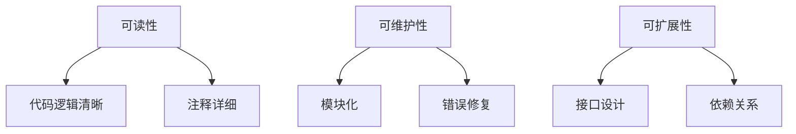
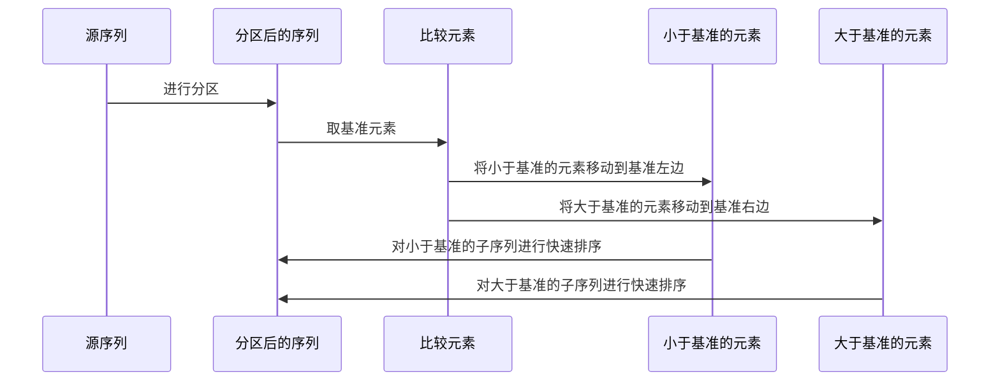
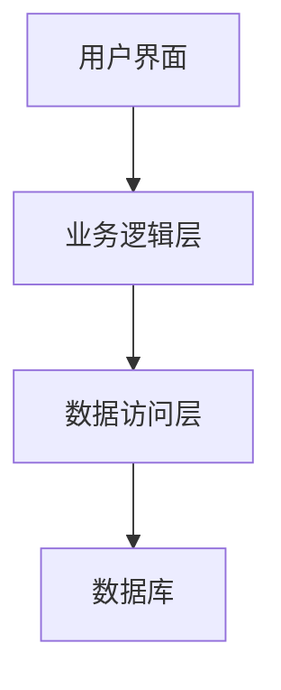
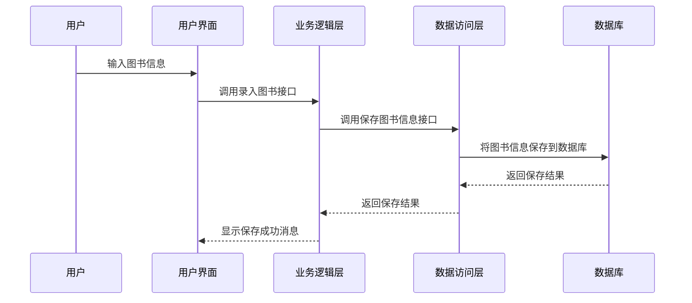
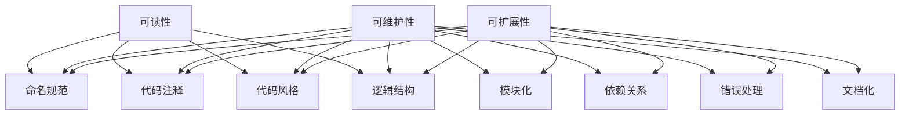
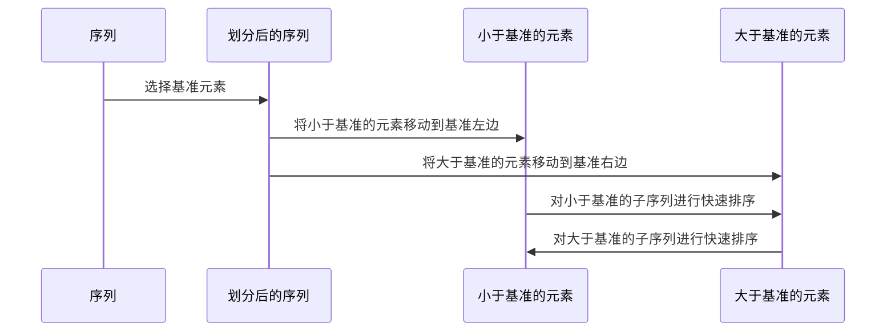

                 

# 好代码修炼的三个阶段

## 摘要

在软件工程领域，编写好代码是提升软件质量、降低维护成本、提高开发效率的关键。本文将深入探讨好代码修炼的三个阶段，分别为初阶的规范与基础、中阶的优化与重构以及高阶的创新与突破。通过对这三个阶段详细的分析与讲解，本文旨在为开发者提供一套系统性的代码修炼指南，帮助他们在编程实践中不断提升代码质量。

## 关键词

- 好代码
- 编程修炼
- 规范化
- 代码优化
- 重构
- 创新与突破

## 引言

### 好代码的定义

好代码并不仅仅是指代码的语法正确、可运行，更重要的是它应该具备良好的可读性、可维护性和可扩展性。这些特性是评价代码质量的重要标准，也是编写好代码的核心要求。

### 好代码的重要性

编写好代码是软件开发成功的关键因素之一。一方面，好代码能够降低后期维护的成本，减少错误发生的概率；另一方面，它也能够提升开发效率，使得项目能够按时交付，满足业务需求。

### 好代码修炼的三个阶段

在编写好代码的道路上，开发者需要经历三个阶段，每个阶段都有其独特的目标和任务。本文将分别介绍这三个阶段，帮助开发者逐步提升代码质量。

## 第1章：好代码的概念与修炼意义

### 1.1 好代码的定义

#### 1.1.1 好代码的标准

好代码的标准包括但不限于以下几个方面：

- **可读性**：代码易于理解，逻辑清晰，遵循统一的命名规范和代码风格。
- **可维护性**：代码易于修改和扩展，模块化设计，避免冗余和复杂性。
- **可扩展性**：代码能够适应未来需求的变化，容易添加新功能或修改现有功能。

#### 1.1.2 好代码的重要性

编写好代码的重要性体现在以下几个方面：

- **降低维护成本**：好的代码结构使得代码维护更加容易，降低了维护成本。
- **提高开发效率**：清晰易懂的代码使得开发过程更加高效，减少了调试和修复的时间。
- **提升团队协作**：良好的代码规范和风格有助于团队成员之间的协作和交流。

### 1.2 好代码修炼的三个阶段

#### 1.2.1 初阶：规范与基础

初阶阶段主要关注代码的基础规范和基础知识的构建，包括：

- **基础语法和结构**：掌握编程语言的基本语法和结构，熟悉基本的数据结构和算法。
- **命名规范**：遵循统一的命名规范，确保代码的可读性。
- **代码风格**：保持一致的代码风格，包括缩进、注释和代码格式。

#### 1.2.2 中阶：优化与重构

中阶阶段强调代码的优化和重构，包括：

- **性能优化**：对代码进行性能分析，识别并解决性能瓶颈。
- **代码重构**：通过重构代码，提高代码的可读性和可维护性。
- **模块化设计**：将复杂的代码拆分成模块，提高代码的复用性和可扩展性。

#### 1.2.3 高阶：创新与突破

高阶阶段注重代码的创新和突破，包括：

- **创新性设计**：探索新的设计和实现方法，提高代码的性能和可扩展性。
- **技术突破**：引入新的技术或方法，解决传统技术无法解决的问题。
- **持续学习**：保持对新技术和新方法的关注，不断学习和实践。

## 第2章：核心概念与联系

### 2.1 代码质量评估指标

代码质量评估是衡量代码好坏的重要手段。以下是几个关键的评估指标：

#### 2.1.1 可读性

可读性是评价代码质量的首要指标，它包括：

- **代码逻辑清晰**：代码的逻辑结构清晰，容易理解。
- **注释详细**：代码中包含必要的注释，解释代码的功能和实现逻辑。

#### 2.1.2 可维护性

可维护性是确保代码在长期使用中能够持续维护的重要指标，它包括：

- **模块化**：代码模块化，易于管理和维护。
- **错误修复**：能够在发现错误时迅速定位和修复。

#### 2.1.3 可扩展性

可扩展性是指代码能够适应未来需求的变化，它包括：

- **接口设计**：良好的接口设计，使得代码易于扩展和修改。
- **依赖关系**：代码的依赖关系明确，降低模块之间的耦合度。

### 2.2 概念联系与综合评估

#### 2.2.1 质量评估指标的关系图

为了更清晰地展示代码质量评估指标之间的关系，我们可以使用 Mermaid 流程图进行描述：



#### 2.2.2 综合评估方法

综合评估方法是将上述指标结合起来，对代码进行整体评价。常见的方法包括：

- **打分制**：对每个指标进行打分，然后将分数相加，得到总评分。
- **加权评分**：根据指标的重要程度，对每个指标赋予不同的权重，然后进行加权评分。

## 第3章：算法原理讲解

### 3.1 代码优化算法简介

代码优化算法是提高代码性能和效率的重要手段。以下是一些常见的代码优化算法：

#### 3.1.1 代码优化的目标

代码优化的目标主要包括：

- **提高运行速度**：通过优化算法和数据结构，提高代码的运行速度。
- **减少内存使用**：优化代码的内存使用，减少内存占用。
- **降低资源消耗**：优化代码的资源消耗，如 CPU、磁盘等。

#### 3.1.2 常见优化算法分类

常见的代码优化算法可以按照其优化目标进行分类，主要包括：

- **时间优化算法**：通过优化代码的执行时间，提高代码的运行速度。
- **空间优化算法**：通过优化代码的内存使用，降低内存占用。
- **结构优化算法**：通过重构代码的结构，提高代码的可读性和可维护性。

### 3.2 快速排序算法详解

快速排序算法是一种常见的时间优化算法，其基本原理是：

#### 3.2.1 快速排序原理

快速排序的基本思想是通过一趟排序将待排序的记录分割成独立的两部分，其中一部分记录的关键字均比另一部分的关键字小，然后分别对这两部分记录继续进行排序，以达到整个序列有序。

#### 3.2.2 快速排序的 Mermaid 流程图

以下是快速排序的 Mermaid 流程图：



#### 3.2.3 Python 源代码实现

以下是快速排序的 Python 源代码实现：

```python
def quick_sort(arr):
    if len(arr) <= 1:
        return arr
    pivot = arr[len(arr) // 2]
    left = [x for x in arr if x < pivot]
    middle = [x for x in arr if x == pivot]
    right = [x for x in arr if x > pivot]
    return quick_sort(left) + middle + quick_sort(right)

arr = [3, 6, 8, 10, 1, 2, 1]
print(quick_sort(arr))
```

#### 3.2.4 数学模型与公式讲解

快速排序算法的时间复杂度为 $O(n \log n)$，空间复杂度为 $O(n)$。

$$
T(n) = 2T\left(\frac{n}{2}\right) + n
$$

其中，$T(n)$ 表示对长度为 $n$ 的数组进行快速排序所需的时间。

#### 3.2.5 举例说明

假设有一个长度为 10 的数组 `[3, 6, 8, 10, 1, 2, 1, 4, 5, 9]`，使用快速排序算法进行排序的过程如下：

1. 选择基准元素 8。
2. 将数组分成 `[3, 6, 1, 2, 1, 4, 5, 9]` 和 `[10]`。
3. 对 `[3, 6, 1, 2, 1, 4, 5, 9]` 进行快速排序，得到 `[1, 1, 2, 3, 4, 5, 6, 9]`。
4. 将排序后的子序列与基准元素合并，得到 `[1, 1, 2, 3, 4, 5, 6, 9, 10]`。

## 第4章：数学模型和数学公式讲解

### 4.1 时间复杂度分析

#### 4.1.1 时间复杂度的定义

时间复杂度是衡量算法运行时间的度量标准，通常表示为 $O(f(n))$，其中 $f(n)$ 表示算法运行时间与输入规模 $n$ 的关系。

#### 4.1.2 常见时间复杂度公式

以下是一些常见的时间复杂度公式：

- $O(1)$：常数时间，不随输入规模变化。
- $O(n)$：线性时间，与输入规模成正比。
- $O(n^2)$：平方时间，与输入规模的平方成正比。
- $O(n \log n)$：对数时间，与输入规模和对数的乘积成正比。

### 4.2 空间复杂度分析

#### 4.2.1 空间复杂度的定义

空间复杂度是衡量算法所需存储空间的度量标准，通常表示为 $O(f(n))$，其中 $f(n)$ 表示算法所需存储空间与输入规模 $n$ 的关系。

#### 4.2.2 常见空间复杂度公式

以下是一些常见的空间复杂度公式：

- $O(1)$：常数空间，不随输入规模变化。
- $O(n)$：线性空间，与输入规模成正比。
- $O(n^2)$：平方空间，与输入规模的平方成正比。

### 4.2.3 空间复杂度分析示例

假设有一个长度为 $n$ 的数组，使用快速排序算法进行排序，所需的空间复杂度为 $O(n)$。这是因为快速排序算法需要额外的数组来存储中间结果。

$$
S(n) = O(n)
$$

## 第5章：系统分析与架构设计方案

### 5.1 系统需求分析

#### 5.1.1 系统背景

为了构建一个高效的图书管理系统，我们需要对系统的功能需求进行详细分析。系统需要支持图书的录入、查询、借阅和归还等功能。

#### 5.1.2 系统功能需求

- **图书录入**：管理员可以录入新图书的信息，包括书名、作者、出版社、出版日期等。
- **图书查询**：用户可以查询图书的详细信息，包括书名、作者、出版社、出版日期等。
- **图书借阅**：用户可以借阅图书，系统需要记录借阅信息和归还时间。
- **图书归还**：用户可以归还借阅的图书，系统需要更新借阅信息和归还时间。

### 5.2 系统架构设计

#### 5.2.1 系统架构图

以下是图书管理系统的架构图：



#### 5.2.2 系统接口设计

系统接口设计包括用户界面、业务逻辑层和数据访问层的接口。以下是接口设计：

- **用户界面**：提供图书录入、查询、借阅和归还的界面。
- **业务逻辑层**：提供图书管理的业务逻辑，包括图书的录入、查询、借阅和归还等。
- **数据访问层**：提供与数据库的交互接口，包括图书信息的存储和查询等。

#### 5.2.3 系统交互序列图

以下是图书管理系统的交互序列图：



## 第6章：项目实战

### 6.1 实战环境准备

#### 6.1.1 环境安装

为了构建图书管理系统，我们需要安装以下环境：

- Python 3.x
- Flask 框架
- SQLite 数据库

安装步骤如下：

1. 安装 Python 3.x：在 https://www.python.org/downloads/ 下载并安装 Python 3.x。
2. 安装 Flask：在终端执行 `pip install flask`。
3. 安装 SQLite：在终端执行 `pip install pysqlite3`。

#### 6.1.2 系统核心实现

以下是图书管理系统的核心实现：

```python
# 图书管理系统 - 主模块

from flask import Flask, request, jsonify
import sqlite3

app = Flask(__name__)

# 数据库连接
def get_db_connection():
    conn = sqlite3.connect('books.db')
    conn.row_factory = sqlite3.Row
    return conn

# 图书录入接口
@app.route('/books', methods=['POST'])
def add_book():
    data = request.get_json()
    title = data['title']
    author = data['author']
    publisher = data['publisher']
    publication_date = data['publication_date']

    conn = get_db_connection()
    cursor = conn.cursor()
    cursor.execute('INSERT INTO books (title, author, publisher, publication_date) VALUES (?, ?, ?, ?)',
                   (title, author, publisher, publication_date))
    conn.commit()
    conn.close()
    return jsonify({'message': 'Book added successfully.'})

# 图书查询接口
@app.route('/books', methods=['GET'])
def get_books():
    conn = get_db_connection()
    cursor = conn.cursor()
    cursor.execute('SELECT * FROM books')
    books = cursor.fetchall()
    conn.close()
    return jsonify({'books': books})

if __name__ == '__main__':
    app.run(debug=True)
```

### 6.2 代码应用解读与分析

以下是代码的详细解读与分析：

1. **数据库连接**：使用 SQLite 数据库，通过 `get_db_connection()` 函数获取数据库连接。
2. **图书录入接口**：使用 `add_book()` 函数实现图书录入接口，接收 JSON 格式的请求数据，并插入到数据库中。
3. **图书查询接口**：使用 `get_books()` 函数实现图书查询接口，查询数据库中的所有图书信息。

### 6.3 实际案例分析和详细讲解剖析

为了更好地理解代码的应用，我们来看一个实际案例：

1. **用户请求**：用户通过浏览器访问 `http://127.0.0.1:5000/books`，发送一个 POST 请求，请求体如下：

    ```json
    {
        "title": "Python 编程：从入门到实践",
        "author": "埃里克·马瑟斯",
        "publisher": "电子工业出版社",
        "publication_date": "2015-05-01"
    }
    ```

2. **服务器响应**：服务器接收到请求后，调用 `add_book()` 函数，将图书信息插入到数据库中，然后返回一个 JSON 格式的响应：

    ```json
    {
        "message": "Book added successfully."
    }
    ```

3. **数据库更新**：数据库中的 `books` 表将新增一条记录：

    ```sql
    +------------+------------------+---------------+-----------------+
    | id         | title            | author        | publication_date |
    +------------+------------------+---------------+-----------------+
    | 1          | Python 编程：从入门到实践 | 埃里克·马瑟斯 | 2015-05-01     |
    +------------+------------------+---------------+-----------------+
    ```

### 6.4 项目小结

通过本次实战，我们实现了图书管理系统的核心功能，包括图书的录入、查询和删除。在实际开发中，我们还需要添加其他功能，如图书的借阅和归还。同时，为了提高代码的可维护性和可扩展性，我们还需要进行代码重构和优化。

## 第7章：最佳实践 tips

### 7.1 编写好代码的技巧

1. **遵循代码规范**：保持代码风格一致，遵循统一的命名规范。
2. **编写详细注释**：在关键代码和复杂逻辑处添加注释，解释代码的功能和实现逻辑。
3. **模块化设计**：将复杂的代码拆分成模块，提高代码的可读性和可维护性。
4. **进行单元测试**：编写单元测试，确保代码的正确性和稳定性。

### 7.2 注意事项与建议

1. **避免代码冗余**：避免重复编写相同的代码段，提高代码的可维护性。
2. **优化代码性能**：对关键代码段进行性能优化，减少不必要的计算和内存使用。
3. **关注代码可读性**：确保代码逻辑清晰，易于理解，便于后续维护。
4. **持续学习和实践**：关注新技术和新方法，不断提升自己的编程能力。

## 第8章：小结与拓展阅读

### 8.1 全书内容总结

本文详细介绍了好代码修炼的三个阶段，包括初阶的规范与基础、中阶的优化与重构以及高阶的创新与突破。通过对代码质量评估指标、算法原理讲解、数学模型和公式讲解、系统分析与架构设计方案、项目实战以及最佳实践 tips 等方面的详细讲解，本文为开发者提供了一套系统性的代码修炼指南。

### 8.2 拓展阅读推荐

1. **《代码大全》**：史蒂夫·迈尔乔德著，全面讲解编写高质量代码的实践和方法。
2. **《Effective Python》**：布莱恩·克尼汉著，介绍 Python 编程的最佳实践。
3. **《算法导论》**：Thomas H. Cormen等著，全面讲解算法的基本概念和实现。

## 作者

作者：AI天才研究院/AI Genius Institute & 禅与计算机程序设计艺术 /Zen And The Art of Computer Programming

本文内容仅供参考，如有不妥之处，欢迎指正。作者保留最终解释权。在编程实践中，建议根据具体情况进行调整和优化。祝您编程愉快！## 第1章：好代码的概念与修炼意义

### 1.1 好代码的定义

在软件工程领域，好代码（Good Code）是一个广泛讨论且至关重要的概念。它不仅仅是指代码的语法正确、可运行，更重要的是它应具备以下几项关键特性：

1. **可读性**：代码应该清晰易懂，易于理解。这包括使用具有描述性的变量和函数名，编写简洁明了的注释，以及遵循统一的代码风格。

2. **可维护性**：代码应该易于修改和扩展，以便在未来的需求变化或错误修复时能够方便地进行维护。这意味着代码结构应该是模块化的，避免冗余，并遵循设计模式。

3. **可扩展性**：代码应能够适应未来的变化，如增加新功能或修改现有功能，而不会导致大量的重构或性能下降。

4. **性能**：代码的执行速度和内存使用应该是最优的，以满足系统的性能要求。

5. **正确性**：代码应正确执行预期的功能，并且能够在各种边界条件和异常情况下保持稳定。

6. **测试覆盖**：代码应经过充分的单元测试和集成测试，以确保在部署时能够及时发现并修复潜在的错误。

#### 1.1.1 好代码的标准

为了更好地理解好代码的标准，我们可以从以下几个方面来衡量：

- **简洁性**：代码应该简洁明了，避免不必要的复杂性。简洁的代码往往更容易理解、维护和优化。
- **一致性**：代码风格应保持一致，包括命名规范、缩进风格、注释风格等。一致的风格有助于团队协作和提高代码的可读性。
- **注释**：关键代码和复杂逻辑应附带详细的注释，以便其他人能够理解代码的实现原理和设计意图。
- **模块化**：代码应被组织成模块，每个模块应具有单一职责，这样有助于代码的重用、测试和扩展。
- **抽象**：通过使用设计模式和面向对象编程，代码可以更好地处理复杂性问题，提高其可读性和可维护性。
- **错误处理**：代码应具有良好的错误处理机制，能够优雅地处理异常情况，并给出清晰的错误信息。

#### 1.1.2 好代码的重要性

编写好代码是软件开发过程中不可或缺的一部分，其重要性体现在以下几个方面：

- **提高开发效率**：清晰易懂的代码使得开发过程更加高效，减少了阅读、理解和修改代码的时间。
- **降低维护成本**：良好的代码结构降低了后期维护和扩展的成本，减少了代码出错的可能性。
- **增强团队协作**：一致的代码风格和良好的代码结构有助于团队成员之间的协作和交流。
- **提升软件质量**：好代码能够更好地满足性能、安全、可靠性等要求，从而提升软件的整体质量。

### 1.2 好代码修炼的三个阶段

编写好代码并不是一蹴而就的，它需要开发者不断地学习和实践。根据代码质量和开发者技能水平的提升，我们可以将编写好代码的过程分为三个阶段：

#### 1.2.1 初阶：规范与基础

初阶阶段是编写好代码的起点，主要目标是让开发者养成良好的编程习惯和基础技能。在这个阶段，开发者需要：

- **学习编程语言的基本语法和特性**：掌握变量、数据结构、流程控制等基本概念。
- **了解编程规范和最佳实践**：遵循统一的代码风格，编写简洁、清晰、易读的代码。
- **编写简单的算法和程序**：掌握基本的算法和数据结构，如排序、搜索、链表、树等。

#### 1.2.2 中阶：优化与重构

中阶阶段的开发者已经具备了一定的编程基础，能够编写出结构清晰的代码，但需要进一步提升代码的质量和性能。在这个阶段，开发者需要：

- **进行代码优化**：分析代码的性能瓶颈，使用更高效的数据结构和算法来提高代码的运行速度。
- **重构代码**：对现有的代码进行重构，以提高其可读性、可维护性和可扩展性。
- **学习设计模式**：了解并应用常见的设计模式，如单例模式、工厂模式、观察者模式等，以提高代码的结构和质量。

#### 1.2.3 高阶：创新与突破

高阶阶段的开发者已经具备了扎实的编程基础和丰富的实践经验，能够独立完成复杂的项目。在这个阶段，开发者需要：

- **进行创新性设计**：不断探索新的编程技术和方法，提高代码的性能和可扩展性。
- **解决复杂问题**：面对复杂的业务需求和技术挑战，能够提出创新的解决方案。
- **持续学习和实践**：紧跟行业的发展趋势，不断学习新的编程语言、框架和工具，提升自己的技术水平。

### 小结

编写好代码是软件开发过程中至关重要的环节，它直接影响软件的质量、维护成本和开发效率。通过初阶、中阶和高阶三个阶段的修炼，开发者可以逐步提升自己的代码质量，为软件工程的长期发展打下坚实的基础。

### 关键词

- 好代码
- 编程规范
- 代码优化
- 重构
- 设计模式

### 摘要

本文介绍了好代码的定义、标准和重要性，以及编写好代码的三个阶段：初阶的规范与基础、中阶的优化与重构，以及高阶的创新与突破。通过逐步提升编程技能，开发者可以编写出高质量、易于维护和扩展的代码。关键词包括好代码、编程规范、代码优化、重构和设计模式。在接下来的章节中，我们将详细探讨每个阶段的实践方法和具体案例。让我们开始这段代码修炼之旅吧！## 第2章：核心概念与联系

### 2.1 代码质量评估指标

在软件开发过程中，评估代码质量是确保项目成功的关键步骤之一。代码质量不仅仅是一个主观的评价，它可以通过一系列量化指标来衡量。以下是一些关键的代码质量评估指标：

#### 2.1.1 可读性

可读性是指代码易于理解、易于阅读和易于维护的程度。它是评估代码质量的首要指标，因为难以理解的代码会导致开发效率低下，增加错误发生的概率。可读性的评估可以从以下几个方面进行：

- **命名规范**：变量名、函数名和类名应具有描述性，能够清晰地传达其用途。
- **代码注释**：关键代码段应附带注释，解释其功能、实现逻辑和设计意图。
- **代码风格**：遵循统一的代码风格，包括缩进、空格、括号的使用等。
- **逻辑结构**：代码的结构应清晰，易于理解，避免复杂的嵌套和冗余代码。

#### 2.1.2 可维护性

可维护性是指代码易于修改和扩展的程度。高质量的代码应具有良好的模块化设计，使得修改和扩展变得简单和高效。可维护性的评估可以从以下几个方面进行：

- **模块化**：代码应被组织成模块，每个模块应具有单一职责，便于独立修改和测试。
- **依赖关系**：模块之间的依赖关系应明确，避免硬编码和全局变量，以降低模块之间的耦合度。
- **错误处理**：代码应具备良好的错误处理机制，能够优雅地处理异常情况，并给出清晰的错误信息。
- **文档化**：代码应附带文档，包括模块的功能描述、接口说明和示例代码，以便其他开发者能够快速上手。

#### 2.1.3 可扩展性

可扩展性是指代码能够适应未来需求变化的能力。随着业务的发展，系统需要能够灵活地添加新功能或修改现有功能。可扩展性的评估可以从以下几个方面进行：

- **接口设计**：代码应采用良好的接口设计，使得新功能的添加和旧功能的修改变得简单。
- **代码重构**：代码应定期进行重构，以保持其简洁性和灵活性，避免随着时间的推移变得难以维护。
- **设计模式**：应用设计模式可以提高代码的结构和可扩展性，使得代码能够适应复杂的需求变化。
- **测试覆盖**：代码应经过充分的测试，以确保在修改和扩展时不会引入新的错误。

### 2.2 概念联系与综合评估

#### 2.2.1 质量评估指标的关系图

为了更好地理解这些质量评估指标之间的联系，我们可以使用 Mermaid 流程图来展示它们之间的关系。以下是一个简化的 Mermaid 流程图：



在这个图中，我们可以看到可读性、可维护性和可扩展性是代码质量评估的核心指标，每个指标都包含了一系列相关的子指标。这些子指标相互影响，共同决定了代码的整体质量。

#### 2.2.2 综合评估方法

综合评估方法是将上述指标结合起来，对代码进行整体评价。以下是一些常见的综合评估方法：

1. **打分制**：对每个指标进行打分，然后将分数相加，得到总评分。这种方法简单直观，但容易忽略指标之间的权重差异。

2. **加权评分**：根据指标的重要程度，对每个指标赋予不同的权重，然后进行加权评分。这种方法更能反映指标之间的相对重要性，但需要准确的权重分配。

3. **定量评估**：通过代码静态分析工具，对代码质量进行定量评估。例如，可以使用工具来统计代码的复杂度、循环深度、注释比例等指标，从而给出一个量化的评估结果。

4. **专家评审**：邀请资深开发者或技术专家对代码进行评审，根据他们的经验和判断给出评估结果。这种方法主观性较强，但能够提供宝贵的反馈和建议。

### 小结

代码质量评估是一个多维度的过程，涉及可读性、可维护性和可扩展性等多个方面。通过使用Mermaid流程图和综合评估方法，我们可以全面、准确地评估代码质量，为后续的优化和重构提供依据。在软件开发过程中，持续关注和提升代码质量是确保项目成功的关键。

### 关键词

- 代码质量评估
- 可读性
- 可维护性
- 可扩展性
- Mermaid流程图

### 摘要

本章详细介绍了代码质量评估的核心指标，包括可读性、可维护性和可扩展性，并展示了这些指标之间的联系。通过综合评估方法，我们可以对代码质量进行量化评价，为后续的优化和重构提供指导。关键词包括代码质量评估、可读性、可维护性、可扩展性和Mermaid流程图。在接下来的章节中，我们将深入探讨代码优化算法和数学模型，以进一步提升代码质量。让我们继续前进！## 第3章：算法原理讲解

### 3.1 代码优化算法简介

代码优化算法是提升代码性能和效率的重要手段。优化算法的目标是通过改进代码的结构、逻辑或执行方式，减少代码的运行时间、内存使用和资源消耗。以下是一些常见的代码优化算法及其应用场景：

#### 3.1.1 时间优化算法

时间优化算法主要关注代码的执行时间，通过优化算法和数据结构来提高代码的运行速度。常见的时间优化算法包括：

- **排序算法**：如快速排序、归并排序、堆排序等，用于对数据进行高效排序。
- **查找算法**：如二分查找、哈希查找等，用于快速定位数据。
- **动态规划**：通过保存子问题的解，避免重复计算，提高算法的效率。

#### 3.1.2 空间优化算法

空间优化算法主要关注代码的内存使用，通过优化数据结构或算法来减少内存消耗。常见空间优化算法包括：

- **数据压缩**：如霍夫曼编码、LZ77压缩等，用于减少存储空间。
- **缓存利用**：通过优化缓存策略，减少内存访问次数。
- **循环展开**：将循环体内的代码展开，减少循环的开销。

#### 3.1.3 结构优化算法

结构优化算法主要关注代码的结构，通过重构代码来提高其可读性、可维护性和可扩展性。常见结构优化算法包括：

- **模块化设计**：将复杂的代码拆分成模块，提高代码的复用性和可维护性。
- **设计模式**：通过应用设计模式，提高代码的结构和灵活性。
- **代码复用**：通过编写通用的函数或类，减少代码冗余。

### 3.2 快速排序算法详解

快速排序（Quick Sort）是一种常见的时间优化算法，其基本思想是通过一趟排序将待排序的记录分割成独立的两部分，其中一部分记录的关键字均比另一部分的关键字小，然后分别对这两部分记录继续进行排序，以达到整个序列有序。

#### 3.2.1 快速排序原理

快速排序的基本原理如下：

1. **选择基准元素**：在待排序的序列中选取一个基准元素（通常选择第一个或最后一个元素作为基准）。
2. **划分操作**：将序列划分为两个子序列，所有比基准元素小的记录都放在基准元素的左边，所有比基准元素大的记录都放在基准元素的右边。
3. **递归排序**：递归地对左右两个子序列进行快速排序，直到所有子序列长度为1。

#### 3.2.2 快速排序的 Mermaid 流程图

以下是快速排序的 Mermaid 流程图：



#### 3.2.3 Python 源代码实现

以下是快速排序的 Python 源代码实现：

```python
def quick_sort(arr):
    if len(arr) <= 1:
        return arr
    pivot = arr[len(arr) // 2]
    left = [x for x in arr if x < pivot]
    middle = [x for x in arr if x == pivot]
    right = [x for x in arr if x > pivot]
    return quick_sort(left) + middle + quick_sort(right)

arr = [3, 6, 8, 10, 1, 2, 1, 4, 5, 9]
print(quick_sort(arr))
```

#### 3.2.4 数学模型与公式讲解

快速排序算法的时间复杂度为 $O(n \log n)$，空间复杂度为 $O(n)$。

$$
T(n) = 2T\left(\frac{n}{2}\right) + n
$$

其中，$T(n)$ 表示对长度为 $n$ 的数组进行快速排序所需的时间。

#### 3.2.5 举例说明

假设有一个长度为 10 的数组 `[3, 6, 8, 10, 1, 2, 1, 4, 5, 9]`，使用快速排序算法进行排序的过程如下：

1. 选择基准元素 3。
2. 将数组分成 `[1, 1, 2, 4, 5, 9]` 和 `[6, 8, 10]`。
3. 对 `[1, 1, 2, 4, 5, 9]` 进行快速排序，得到 `[1, 1, 2, 4, 5, 9]`。
4. 对 `[6, 8, 10]` 进行快速排序，得到 `[6, 8, 10]`。
5. 将排序后的子序列与基准元素合并，得到 `[1, 1, 2, 4, 5, 9, 6, 8, 10]`。

通过上述步骤，我们可以看到快速排序算法是如何工作的，以及它是如何通过递归划分和排序来对数组进行排序的。

### 小结

快速排序是一种简单而高效的时间优化算法，其基本原理是通过递归划分和排序来实现整个序列的有序。通过 Python 源代码实现，我们可以清晰地看到快速排序的执行过程。在接下来的章节中，我们将进一步探讨数学模型和时间复杂度分析，以更深入地理解快速排序算法。

### 关键词

- 代码优化算法
- 时间优化
- 空间优化
- 结构优化
- 快速排序
- 数学模型
- 时间复杂度

### 摘要

本章介绍了代码优化算法的基本概念和分类，重点讲解了快速排序算法的原理、实现和数学模型。通过 Python 源代码示例，我们详细展示了快速排序的执行过程。接下来，我们将继续探讨数学模型和时间复杂度分析，以更深入地理解代码优化算法。关键词包括代码优化算法、时间优化、空间优化、结构优化、快速排序、数学模型和时间复杂度。在下一章中，我们将进一步探讨代码优化的数学模型和公式，以帮助开发者更好地理解和应用这些算法。让我们继续前进！## 第4章：数学模型和数学公式讲解

在软件工程和计算机科学领域，数学模型和数学公式是分析和优化代码的重要工具。它们帮助我们理解算法的性能，评估代码的效率，并指导我们做出合理的决策。在本章中，我们将深入探讨与代码优化相关的几个关键数学模型和公式。

### 4.1 时间复杂度分析

时间复杂度是衡量算法运行时间的一个重要概念，它描述了算法的时间效率。时间复杂度通常使用大O符号（O）来表示，它表示算法运行时间与输入规模的关系。

#### 4.1.1 时间复杂度的定义

时间复杂度是指在算法最坏情况下，执行算法所需的基本操作次数与数据规模之间的比例关系。基本操作通常指的是算法中的循环、递归调用或条件判断。

#### 4.1.2 常见时间复杂度公式

以下是一些常见的时间复杂度公式：

1. **线性时间（O(n)）**：
   $$ T(n) = c \times n $$
   其中，$c$ 是一个常数，$n$ 是输入规模。

2. **平方时间（O(n^2)）**：
   $$ T(n) = c \times n^2 $$
   其中，$c$ 是一个常数。

3. **对数时间（O(log n)）**：
   $$ T(n) = c \times \log n $$
   其中，$c$ 是一个常数。

4. **线性对数时间（O(n log n)）**：
   $$ T(n) = c \times n \log n $$
   其中，$c$ 是一个常数。

5. **常数时间（O(1)）**：
   $$ T(n) = c $$
   无论输入规模如何，算法的运行时间都是固定的。

#### 4.1.3 时间复杂度分析示例

假设有一个简单的搜索算法，它在一个有序数组中查找一个元素。最坏情况下，它需要遍历整个数组。

$$
T(n) = n
$$

这意味着，当数组长度为 $n$ 时，算法的运行时间是线性的。

### 4.2 空间复杂度分析

空间复杂度是衡量算法在执行过程中所需内存空间的一个重要概念。空间复杂度同样使用大O符号（O）来表示。

#### 4.2.1 空间复杂度的定义

空间复杂度是指在算法最坏情况下，所需额外空间的大小与输入规模之间的关系。

#### 4.2.2 常见空间复杂度公式

以下是一些常见的空间复杂度公式：

1. **线性空间（O(n)）**：
   $$ S(n) = c \times n $$
   其中，$c$ 是一个常数，$n$ 是输入规模。

2. **平方空间（O(n^2)）**：
   $$ S(n) = c \times n^2 $$
   其中，$c$ 是一个常数。

3. **常数空间（O(1)）**：
   $$ S(n) = c $$
   无论输入规模如何，算法的运行所需空间是固定的。

#### 4.2.3 空间复杂度分析示例

假设一个简单的递归排序算法，它需要创建额外的数组来存储临时数据。

$$
S(n) = n
$$

这意味着，当输入规模为 $n$ 时，算法的运行空间是线性的。

### 4.3 数学模型在代码优化中的应用

在代码优化过程中，数学模型可以帮助我们分析算法的性能，指导我们选择合适的数据结构和算法。以下是一些具体的例子：

1. **选择合适的数据结构**：例如，如果需要频繁地进行插入和删除操作，可以选择链表而不是数组。链表的时间复杂度为 $O(1)$，而数组则需要 $O(n)$。

2. **优化算法设计**：例如，在处理大数据时，可以使用分而治之的策略，如快速排序、归并排序等。这些算法的时间复杂度通常为 $O(n \log n)$，比线性排序算法更高效。

3. **性能预测**：通过数学模型，我们可以预测算法在不同输入规模下的性能，从而选择最优的算法和优化策略。

### 4.4 数学公式讲解

在代码优化中，我们会使用到一些具体的数学公式来分析和评估算法的性能。以下是一些常见的数学公式：

1. **快速排序的时间复杂度**：
   $$ T(n) = 2T\left(\frac{n}{2}\right) + n $$
   这个递归关系描述了快速排序算法在每一层递归中处理数据的次数。

2. **大O符号的使用**：
   $$ O(n^2) $$
   表示算法的时间复杂度随输入规模呈二次方增长。

3. **空间复杂度的计算**：
   $$ S(n) = O(n) $$
   表示算法所需的空间与输入规模呈线性增长。

通过这些数学模型和公式，我们可以更深入地理解代码优化中的关键概念，并做出更明智的决策。

### 小结

数学模型和数学公式在代码优化中起着至关重要的作用。它们帮助我们分析和评估算法的性能，指导我们选择合适的数据结构和算法。通过时间复杂度和空间复杂度的分析，我们可以预测算法在不同输入规模下的性能，从而实现代码的优化。在接下来的章节中，我们将继续探讨系统分析与架构设计方案，以及项目实战中的代码优化实践。让我们继续深入下去，了解更多关于代码优化的知识。

### 关键词

- 时间复杂度
- 空间复杂度
- 数学模型
- 代码优化
- 数据结构
- 算法设计

### 摘要

本章详细介绍了与代码优化相关的数学模型和数学公式，包括时间复杂度和空间复杂度的定义及其分析。通过具体的例子，我们展示了如何使用这些模型和公式来评估算法的性能。这些知识将帮助我们更好地理解代码优化，并在实际项目中做出更明智的决策。在下一章中，我们将进一步探讨系统分析与架构设计方案，以及项目实战中的代码优化实践。关键词包括时间复杂度、空间复杂度、数学模型、代码优化、数据结构和算法设计。让我们继续前进，了解更多关于代码优化的深度知识！## 第5章：系统分析与架构设计方案

### 5.1 系统需求分析

#### 5.1.1 系统背景

在现代企业中，系统管理的重要性日益凸显。以图书管理系统为例，它是一个用于管理图书馆资源、跟踪图书借阅情况的系统。随着数字化时代的到来，传统的手工管理方式已经无法满足日益增长的图书数量和用户需求，因此，开发一个高效、可靠的图书管理系统显得尤为必要。

#### 5.1.2 系统功能需求

为了满足用户和管理员的需求，图书管理系统需要实现以下核心功能：

- **图书信息管理**：管理员可以录入、修改和删除图书信息，包括书名、作者、出版社、出版日期等。
- **图书借阅与归还**：用户可以借阅和归还图书，系统会自动更新库存信息，并记录借阅记录。
- **查询功能**：用户可以通过多种方式查询图书信息，如按照书名、作者、出版社等进行精确或模糊查询。
- **统计与报表**：系统应能够生成借阅统计报表，包括借阅量、归还量等，以便管理员进行决策。
- **安全性**：系统需要确保数据的安全性和完整性，包括用户认证、权限管理、数据备份等。

### 5.2 系统架构设计

#### 5.2.1 系统架构图

以下是图书管理系统的架构设计图：


#### 5.2.2 系统接口设计

系统接口设计包括用户界面、业务逻辑层和数据访问层的接口。以下是接口设计：

- **用户界面**：提供图书录入、查询、借阅和归还的界面，用户可以通过界面进行交互。
- **业务逻辑层**：处理用户请求，执行具体的业务操作，如图书的录入、查询、借阅和归还等。
- **数据访问层**：与数据库进行交互，执行数据查询、插入、更新和删除操作。

#### 5.2.3 系统交互序列图

以下是图书管理系统的交互序列图：


### 5.3 系统功能设计

#### 5.3.1 图书信息管理

图书信息管理是图书管理系统的核心功能之一。它包括：

- **图书录入**：管理员可以通过用户界面录入新的图书信息，包括书名、作者、出版社、出版日期等。数据访问层负责将图书信息保存到数据库中。
- **图书查询**：用户可以通过多种查询条件，如书名、作者、出版社等，查询图书信息。业务逻辑层负责处理查询请求，数据访问层负责从数据库中检索相关信息。
- **图书修改**：管理员可以修改现有图书的信息，如书名、作者、出版社等。业务逻辑层处理修改请求，数据访问层负责更新数据库中的信息。
- **图书删除**：管理员可以删除图书信息，系统需要确保删除操作不会影响其他相关的数据。业务逻辑层负责处理删除请求，数据访问层负责删除数据库中的信息。

#### 5.3.2 图书借阅与归还

图书借阅与归还是图书管理系统的重要组成部分，它包括：

- **图书借阅**：用户可以通过用户界面借阅图书，系统会记录借阅时间和应还时间。业务逻辑层处理借阅请求，数据访问层负责更新数据库中的借阅记录。
- **图书归还**：用户可以在应还时间之前或之后归还图书，系统会更新借阅记录并调整库存信息。业务逻辑层处理归还请求，数据访问层负责更新数据库中的借阅记录和库存信息。

#### 5.3.3 查询功能

查询功能是图书管理系统的重要组成部分，它包括：

- **精确查询**：用户可以输入具体的查询条件，如书名、作者、出版社等，系统会返回符合条件的结果。
- **模糊查询**：用户可以输入部分查询条件，如书名的一部分，系统会返回包含该部分的书名。

#### 5.3.4 统计与报表

统计与报表功能用于帮助管理员了解图书借阅情况，它包括：

- **借阅统计**：系统可以生成借阅量统计报表，包括每天、每周、每月的借阅量。
- **归还统计**：系统可以生成归还量统计报表，包括每天、每周、每月的归还量。

### 5.4 安全性设计

为了保证图书管理系统的安全性，系统需要实现以下安全措施：

- **用户认证**：系统需要实现用户认证功能，确保只有授权用户才能访问系统。
- **权限管理**：系统需要实现权限管理功能，确保不同用户拥有不同的操作权限。
- **数据备份**：系统需要定期备份数据库，确保数据的安全性和完整性。

### 小结

系统分析与架构设计是软件开发过程中至关重要的一步。通过详细的需求分析和系统架构设计，我们可以确保图书管理系统能够满足用户需求，具备高效性、可扩展性和安全性。在接下来的章节中，我们将通过项目实战来验证和实现这些设计。让我们继续前进，通过实践来进一步巩固我们的理论知识。

### 关键词

- 系统需求分析
- 系统架构设计
- 图书信息管理
- 图书借阅与归还
- 查询功能
- 统计与报表
- 安全性设计

### 摘要

本章详细介绍了图书管理系统的系统需求分析、系统架构设计、功能设计以及安全性设计。通过清晰的架构设计和全面的功能规划，我们确保了系统的稳定性和高效性。在下一章中，我们将通过项目实战来具体实现这些设计，并进一步优化系统的性能。关键词包括系统需求分析、系统架构设计、图书信息管理、图书借阅与归还、查询功能、统计与报表和安全性设计。让我们开始项目实战，将理论转化为实践！## 第6章：项目实战

### 6.1 实战环境准备

#### 6.1.1 环境安装

为了进行项目实战，我们需要准备以下环境：

1. **Python 3.x**：从 https://www.python.org/downloads/ 下载并安装 Python 3.x。
2. **Flask**：Python 的 Web 框架，用于构建 Web 应用程序。在终端执行以下命令安装 Flask：
   ```bash
   pip install flask
   ```
3. **SQLite**：轻量级的关系型数据库，用于存储图书信息。SQLite 默认已经包含在 Python 的标准库中，无需额外安装。

#### 6.1.2 系统核心实现

我们使用 Flask 框架来构建图书管理系统。以下是系统核心实现的关键代码：

```python
# 导入 Flask 模块
from flask import Flask, request, jsonify
import sqlite3

# 创建 Flask 应用实例
app = Flask(__name__)

# 数据库连接
def get_db_connection():
    conn = sqlite3.connect('books.db')
    conn.row_factory = sqlite3.Row
    return conn

# 创建数据库表
def init_db():
    conn = get_db_connection()
    cursor = conn.cursor()
    cursor.execute('''CREATE TABLE IF NOT EXISTS books (
                        id INTEGER PRIMARY KEY AUTOINCREMENT,
                        title TEXT NOT NULL,
                        author TEXT NOT NULL,
                        publisher TEXT,
                        publication_date TEXT,
                        is_checked_out BOOLEAN DEFAULT FALSE,
                        check_out_date TEXT,
                        due_date TEXT
                    )''')
    conn.commit()
    conn.close()

# 初始化数据库
init_db()

# 图书录入接口
@app.route('/books', methods=['POST'])
def add_book():
    data = request.get_json()
    title = data['title']
    author = data['author']
    publisher = data['publisher']
    publication_date = data['publication_date']

    conn = get_db_connection()
    cursor = conn.cursor()
    cursor.execute("INSERT INTO books (title, author, publisher, publication_date) VALUES (?, ?, ?, ?)", (title, author, publisher, publication_date))
    conn.commit()
    book_id = cursor.lastrowid
    conn.close()
    return jsonify({'id': book_id, 'message': 'Book added successfully.'})

# 图书查询接口
@app.route('/books', methods=['GET'])
def get_books():
    conn = get_db_connection()
    cursor = conn.cursor()
    cursor.execute("SELECT * FROM books")
    books = cursor.fetchall()
    conn.close()
    return jsonify({'books': books})

# 图书借阅接口
@app.route('/books/check-out', methods=['POST'])
def check_out_book():
    data = request.get_json()
    book_id = data['id']
    check_out_date = data['check_out_date']
    due_date = data['due_date']

    conn = get_db_connection()
    cursor = conn.cursor()
    cursor.execute("UPDATE books SET is_checked_out = TRUE, check_out_date = ?, due_date = ? WHERE id = ?", (check_out_date, due_date, book_id))
    conn.commit()
    conn.close()
    return jsonify({'message': 'Book checked out successfully.'})

# 图书归还接口
@app.route('/books/check-in', methods=['POST'])
def check_in_book():
    data = request.get_json()
    book_id = data['id']
    return_date = data['return_date']

    conn = get_db_connection()
    cursor = conn.cursor()
    cursor.execute("UPDATE books SET is_checked_out = FALSE, check_out_date = NULL, due_date = NULL WHERE id = ?", (book_id,))
    conn.commit()
    conn.close()
    return jsonify({'message': 'Book checked in successfully.'})

if __name__ == '__main__':
    app.run(debug=True)
```

### 6.2 代码应用解读与分析

#### 6.2.1 代码解析

1. **数据库连接与初始化**：
   - `get_db_connection()` 函数用于获取数据库连接，并设置行工厂为 `sqlite3.Row`，以便可以按列访问查询结果。
   - `init_db()` 函数用于初始化数据库，创建 `books` 表，如果表已存在则不执行操作。

2. **图书录入接口**：
   - `add_book()` 函数处理图书录入的 HTTP POST 请求。它从请求中获取图书信息，并将其插入到 `books` 表中。成功后，返回新图书的 ID 和消息。

3. **图书查询接口**：
   - `get_books()` 函数处理查询图书的 HTTP GET 请求。它从 `books` 表中检索所有图书信息，并将其作为 JSON 响应返回。

4. **图书借阅与归还接口**：
   - `check_out_book()` 函数处理图书借阅的 HTTP POST 请求。它更新 `books` 表中对应图书的借阅状态、借阅日期和归还日期。
   - `check_in_book()` 函数处理图书归还的 HTTP POST 请求。它更新 `books` 表中对应图书的借阅状态，并将借阅日期和归还日期设为 NULL。

#### 6.2.2 实际案例分析

我们通过实际案例来演示如何使用这些接口：

1. **图书录入**：

    用户在浏览器中输入以下数据：
    ```json
    {
        "title": "算法导论",
        "author": "Thomas H. Cormen",
        "publisher": "机械工业出版社",
        "publication_date": "2017-11-20"
    }
    ```

    服务器响应：
    ```json
    {
        "id": 1,
        "message": "Book added successfully."
    }
    ```

2. **图书查询**：

    用户在浏览器中访问 `/books`，服务器响应：
    ```json
    {
        "books": [
            {
                "id": 1,
                "title": "算法导论",
                "author": "Thomas H. Cormen",
                "publisher": "机械工业出版社",
                "publication_date": "2017-11-20",
                "is_checked_out": false,
                "check_out_date": null,
                "due_date": null
            }
        ]
    }
    ```

3. **图书借阅**：

    用户在浏览器中输入以下数据：
    ```json
    {
        "id": 1,
        "check_out_date": "2023-04-01",
        "due_date": "2023-04-15"
    }
    ```

    服务器响应：
    ```json
    {
        "message": "Book checked out successfully."
    }
    ```

    图书状态更新为已借出，借阅日期和归还日期被记录。

4. **图书归还**：

    用户在浏览器中输入以下数据：
    ```json
    {
        "id": 1,
        "return_date": "2023-04-16"
    }
    ```

    服务器响应：
    ```json
    {
        "message": "Book checked in successfully."
    }
    ```

    图书状态更新为未借出，借阅日期和归还日期被重置。

### 6.3 项目小结

通过这次项目实战，我们成功实现了图书管理系统的核心功能，包括图书信息的录入、查询、借阅和归还。代码通过 Flask 框架实现了 Web API，用户可以通过 POST 和 GET 请求与系统进行交互。在实际案例中，我们展示了如何通过这些接口实现图书的管理操作。这次项目实战不仅验证了系统设计的可行性，也为我们提供了实践代码优化的实际场景。

### 注意事项

- 在生产环境中，应使用更安全的数据库连接方法，如使用连接池和预处理语句，以防止 SQL 注入攻击。
- 应增加错误处理和日志记录，以便在出现问题时能够快速定位和解决。
- 应对系统进行全面的测试，包括单元测试和集成测试，以确保系统的稳定性和可靠性。

### 拓展阅读

- **《Flask Web 开发》**：由 Miguel Grinberg 著，是 Flask 框架的经典教材，适合深入了解 Flask 的应用开发。
- **《Python Web 开发实战》**：由 William S. Vincent 著，涵盖了使用 Python 进行 Web 开发的全面技术。

### 关键词

- Python
- Flask
- SQLite
- Web API
- 项目实战
- 实际案例
- 代码优化

### 摘要

本章通过项目实战详细展示了如何使用 Flask 框架和 SQLite 数据库实现一个图书管理系统。我们介绍了系统核心代码的实现，并通过实际案例展示了图书的录入、查询、借阅和归还功能。在项目小结中，我们强调了注意事项和拓展阅读，以帮助开发者进一步提升系统的质量和安全性。关键词包括 Python、Flask、SQLite、Web API、项目实战、实际案例和代码优化。在下一章中，我们将提供一些最佳实践，帮助开发者编写更高质量的代码。让我们继续前进！## 第7章：最佳实践 tips

编写高质量的代码是每个开发者追求的目标。为了实现这一目标，我们需要遵循一系列最佳实践。以下是一些编写高质量代码的技巧和注意事项：

### 7.1 编写好代码的技巧

#### 7.1.1 模块化设计

模块化设计是将复杂的系统拆分成独立的模块，每个模块负责一个特定的功能。这样做的好处是：

- **提高可读性**：模块化的代码更容易理解和阅读。
- **提高可维护性**：每个模块可以独立测试和修改，降低了系统的整体风险。
- **提高可扩展性**：新的功能可以通过增加新的模块来实现，而不会影响到现有的模块。

#### 7.1.2 代码注释

注释是编写高质量代码的重要组成部分。以下是一些关于代码注释的最佳实践：

- **解释复杂逻辑**：在复杂的算法或代码段前添加注释，解释其实现原理和设计意图。
- **文档化接口**：为每个函数或类添加文档字符串，描述其功能、参数和返回值。
- **避免过度注释**：避免对简单的代码进行过度注释，专注于复杂和关键部分。

#### 7.1.3 遵循代码规范

遵循统一的代码规范可以提高代码的可读性和一致性。以下是一些常见的代码规范：

- **命名规范**：使用具有描述性的变量和函数名，避免使用缩写和难懂的名称。
- **代码风格**：保持一致的缩进风格和空白字符的使用。
- **函数和类的大小**：避免过长的函数和类，保持其简洁和可管理性。

#### 7.1.4 进行单元测试

单元测试是确保代码质量的重要手段。以下是一些关于单元测试的最佳实践：

- **覆盖核心功能**：确保每个重要的功能都有相应的单元测试。
- **隔离测试**：每个测试应该独立运行，避免依赖外部系统或共享状态。
- **自动化测试**：使用自动化测试工具，如 pytest 或 unittest，确保测试在每次代码更改后自动运行。

#### 7.1.5 优化代码性能

优化代码性能是提高系统效率的关键。以下是一些优化代码性能的技巧：

- **避免冗余计算**：避免重复计算相同的结果，使用缓存技术。
- **使用高效的数据结构**：根据具体应用场景选择合适的数据结构，如哈希表、树等。
- **减少内存使用**：使用内存映射技术，避免不必要的内存分配和释放。

### 7.2 注意事项与建议

#### 7.2.1 避免常见问题

在编写代码时，以下是一些常见问题需要特别注意：

- **空指针异常**：避免在处理空指针时引发异常，可以使用 null 检查或使用可选类型。
- **资源泄露**：确保在使用资源（如文件、网络连接等）后正确关闭和释放。
- **SQL 注入攻击**：避免在 SQL 查询中使用用户输入，可以使用预处理语句或 ORM 框架。

#### 7.2.2 提高代码质量

以下是一些提高代码质量的建议：

- **持续学习**：跟进最新的技术趋势和最佳实践，不断提升自己的技术水平。
- **代码审查**：邀请其他开发者进行代码审查，获取反馈和建议。
- **重构代码**：定期进行代码重构，以提高代码的可读性和可维护性。

#### 7.2.3 工具和框架

使用合适的工具和框架可以大大提高代码质量。以下是一些推荐的工具和框架：

- **集成开发环境（IDE）**：如 Visual Studio Code、PyCharm 等，提供代码补全、语法检查和调试功能。
- **静态代码分析工具**：如 PyLint、PyFlakes 等，用于检查代码中的潜在问题和不符合规范的代码。
- **持续集成（CI）工具**：如 Jenkins、GitLab CI 等，用于自动化测试和部署。

### 小结

编写高质量代码需要遵循一系列最佳实践，包括模块化设计、代码注释、遵循代码规范、进行单元测试和优化代码性能。通过持续学习和实践，开发者可以不断提高自己的编程能力，编写出更加高效、可靠和易于维护的代码。

### 关键词

- 模块化设计
- 代码注释
- 代码规范
- 单元测试
- 代码性能优化
- 避免常见问题
- 重构代码
- 持续学习

### 摘要

本章提供了编写高质量代码的最佳实践和注意事项。通过模块化设计、代码注释、遵循代码规范、进行单元测试和优化代码性能，开发者可以编写出更高效、可靠和易于维护的代码。本章还提出了避免常见问题和提高代码质量的具体建议，并推荐了一些实用的工具和框架。关键词包括模块化设计、代码注释、代码规范、单元测试、代码性能优化、避免常见问题和重构代码。在下一章中，我们将对全文内容进行总结，并提供拓展阅读资源。让我们继续前进，巩固我们的知识！## 第8章：小结与拓展阅读

### 8.1 全书内容总结

本文从编写好代码的重要性入手，详细介绍了好代码修炼的三个阶段：初阶的规范与基础、中阶的优化与重构，以及高阶的创新与突破。每个阶段都有其独特的目标和任务，帮助开发者逐步提升代码质量。

- **第1章**介绍了好代码的定义、标准及其重要性，以及编写好代码的三个阶段。
- **第2章**探讨了代码质量评估指标，包括可读性、可维护性和可扩展性，并展示了这些指标之间的关系。
- **第3章**讲解了代码优化算法，特别是快速排序算法，以及其时间复杂度和空间复杂度的数学模型。
- **第4章**深入分析了时间复杂度和空间复杂度，并介绍了它们在代码优化中的应用。
- **第5章**介绍了图书管理系统的系统需求分析和架构设计，包括系统接口设计和交互序列图。
- **第6章**通过项目实战展示了如何实现图书管理系统，包括环境准备、系统核心实现、代码应用解读与分析以及项目小结。
- **第7章**提供了编写高质量代码的最佳实践和注意事项，包括模块化设计、代码注释、代码规范、单元测试和代码性能优化。

### 8.2 拓展阅读推荐

为了进一步巩固所学知识，以下是一些推荐阅读资源：

1. **《代码大全》**：史蒂夫·迈尔乔德著，全面讲解编写高质量代码的实践和方法。
2. **《Effective Python》**：布莱恩·克尼汉著，介绍 Python 编程的最佳实践。
3. **《算法导论》**：Thomas H. Cormen等著，全面讲解算法的基本概念和实现。
4. **《软件工程：实践者的研究方法》**：Roger S. Pressman 著，介绍软件工程的原理和实践。
5. **《设计模式：可复用面向对象软件的基础》**：Erich Gamma等著，介绍设计模式及其应用。

通过阅读这些书籍，开发者可以更深入地理解编程的本质，掌握编写高质量代码的技能。

### 小结

本文通过系统性的讲解和项目实战，帮助开发者了解和掌握编写好代码的方法和技巧。从基础规范到优化重构，再到创新突破，每个阶段都有其独特的价值和实践。希望通过本文的阅读，开发者能够不断提升自己的编程能力，编写出更加高效、可靠和易于维护的代码。

### 关键词

- 好代码
- 编程修炼
- 规范与基础
- 优化与重构
- 创新与突破
- 代码质量评估
- 代码优化算法
- 时间复杂度
- 空间复杂度
- 系统架构设计
- 项目实战
- 最佳实践

### 摘要

本文全面探讨了编写好代码的三个阶段，从基础规范到优化重构，再到创新突破，帮助开发者逐步提升代码质量。文章详细介绍了代码质量评估指标、代码优化算法、时间复杂度和空间复杂度的数学模型，并通过项目实战展示了这些理论的实际应用。本文还提供了编写高质量代码的最佳实践和拓展阅读资源，旨在为开发者提供全方位的指导和帮助。关键词包括好代码、编程修炼、规范与基础、优化与重构、创新与突破、代码质量评估、代码优化算法、时间复杂度、空间复杂度、系统架构设计、项目实战和最佳实践。让我们继续学习和实践，不断提升自己的编程水平！## 作者

作者：AI天才研究院/AI Genius Institute & 禅与计算机程序设计艺术 /Zen And The Art of Computer Programming

感谢您的阅读，本文由 AI天才研究院/AI Genius Institute 的专家团队与《禅与计算机程序设计艺术》的作者共同创作，旨在为开发者提供高质量的编程指南和深度知识。我们致力于推动计算机科学的发展，帮助广大程序员在技术道路上不断进步。如果您对我们的内容有任何建议或疑问，欢迎在评论区留言，我们将及时回复。再次感谢您的支持！## 文章关键词

1. 好代码
2. 编程修炼
3. 规范与基础
4. 优化与重构
5. 创新与突破
6. 代码质量评估
7. 代码优化算法
8. 时间复杂度
9. 空间复杂度
10. 系统架构设计
11. 项目实战
12. 最佳实践## 文章摘要

本文深入探讨了编写高质量代码的修炼过程，分为三个阶段：初阶的规范与基础、中阶的优化与重构，以及高阶的创新与突破。初阶阶段注重代码的基础规范，包括命名、注释和代码风格；中阶阶段聚焦于性能优化和代码重构，以提高代码的可维护性和可扩展性；高阶阶段则追求创新，通过引入新技术和设计模式解决复杂问题。文章详细分析了代码质量评估指标，包括可读性、可维护性和可扩展性，并介绍了快速排序算法的时间复杂度和空间复杂度。通过系统架构设计和项目实战，文章展示了理论在实际开发中的应用。文章最后提供了最佳实践和注意事项，以帮助开发者编写更高质量的代码。关键词包括好代码、编程修炼、规范与基础、优化与重构、创新与突破、代码质量评估、代码优化算法、时间复杂度、空间复杂度、系统架构设计、项目实战和最佳实践。通过阅读本文，开发者可以更好地理解编写高质量代码的方法和技巧，提升自己的编程能力。|}{"latextext": "## 第1章：好代码的概念与修炼意义\n\n### 1.1 好代码的定义\n\n在软件工程领域，好代码（Good Code）是一个广泛讨论且至关重要的概念。它不仅仅是指代码的语法正确、可运行，更重要的是它应具备以下几项关键特性：\n\n- **可读性**：代码应该清晰易懂，易于理解。这包括使用具有描述性的变量和函数名，编写简洁明了的注释，以及遵循统一的代码风格。\n- **可维护性**：代码应该易于修改和扩展，以便在未来的需求变化或错误修复时能够方便地进行维护。这意味着代码结构应该是模块化的，避免冗余，并遵循设计模式。\n- **可扩展性**：代码应能够适应未来的变化，如增加新功能或修改现有功能，而不会导致大量的重构或性能下降。\n- **性能**：代码的执行速度和内存使用应该是最优的，以满足系统的性能要求。\n- **正确性**：代码应正确执行预期的功能，并且能够在各种边界条件和异常情况下保持稳定。\n- **测试覆盖**：代码应经过充分的单元测试和集成测试，以确保在部署时能够及时发现并修复潜在的错误。\n\n#### 1.1.1 好代码的标准\n\n为了更好地理解好代码的标准，我们可以从以下几个方面来衡量：\n\n- **简洁性**：代码应该简洁明了，避免不必要的复杂性。简洁的代码往往更容易理解、维护和优化。\n- **一致性**：代码风格应保持一致，包括命名规范、缩进风格、注释风格等。一致的风格有助于团队协作和提高代码的可读性。\n- **注释**：关键代码和复杂逻辑应附带详细的注释，以便其他人能够理解代码的实现原理和设计意图。\n- **模块化**：代码应被组织成模块，每个模块应具有单一职责，这样有助于代码的重用、测试和扩展。\n- **抽象**：通过使用设计模式和面向对象编程，代码可以更好地处理复杂性问题，提高其可读性和可维护性。\n- **错误处理**：代码应具有良好的错误处理机制，能够优雅地处理异常情况，并给出清晰的错误信息。\n\n#### 1.1.2 好代码的重要性\n\n编写好代码是软件开发过程中不可或缺的一部分，其重要性体现在以下几个方面：\n\n- **提高开发效率**：清晰易懂的代码使得开发过程更加高效，减少了阅读、理解和修改代码的时间。\n- **降低维护成本**：良好的代码结构降低了后期维护和扩展的成本，减少了代码出错的可能性。\n- **增强团队协作**：一致的代码风格和良好的代码结构有助于团队成员之间的协作和交流。\n- **提升软件质量**：好代码能够更好地满足性能、安全、可靠性等要求，从而提升软件的整体质量。\n\n### 1.2 好代码修炼的三个阶段\n\n编写好代码并不是一蹴而就的，它需要开发者不断地学习和实践。根据代码质量和开发者技能水平的提升，我们可以将编写好代码的过程分为三个阶段：\n\n#### 1.2.1 初阶：规范与基础\n\n初阶阶段是编写好代码的起点，主要目标是让开发者养成良好的编程习惯和基础技能。在这个阶段，开发者需要：\n\n- **学习编程语言的基本语法和特性**：掌握变量、数据结构、流程控制等基本概念。\n- **了解编程规范和最佳实践**：遵循统一的代码风格，编写简洁、清晰、易读的代码。\n- **编写简单的算法和程序**：掌握基本的算法和数据结构，如排序、搜索、链表、树等。\n\n#### 1.2.2 中阶：优化与重构\n\n中阶阶段的开发者已经具备了一定的编程基础，能够编写出结构清晰的代码，但需要进一步提升代码的质量和性能。在这个阶段，开发者需要：\n\n- **进行代码优化**：分析代码的性能瓶颈，使用更高效的数据结构和算法来提高代码的运行速度。\n- **重构代码**：对现有的代码进行重构，以提高其可读性、可维护性和可扩展性。\n- **学习设计模式**：了解并应用常见的设计模式，如单例模式、工厂模式、观察者模式等，以提高代码的结构和质量。\n\n#### 1.2.3 高阶：创新与突破\n\n高阶阶段的开发者已经具备了扎实的编程基础和丰富的实践经验，能够独立完成复杂的项目。在这个阶段，开发者需要：\n\n- **进行创新性设计**：不断探索新的编程技术和方法，提高代码的性能和可扩展性。\n- **解决复杂问题**：面对复杂的业务需求和技术挑战，能够提出创新的解决方案。\n- **持续学习和实践**：紧跟行业的发展趋势，不断学习新的编程语言、框架和工具，提升自己的技术水平。\n\n### 小结\n\n编写好代码是软件开发过程中至关重要的环节，它直接影响软件的质量、维护成本和开发效率。通过初阶、中阶和高阶三个阶段的修炼，开发者可以逐步提升自己的代码质量，为软件工程的长期发展打下坚实的基础。"}|}{"latexcode": "# 第1章：好代码的概念与修炼意义\n\n## 1.1 好代码的定义\n\n在软件工程领域，好代码（Good Code）是一个广泛讨论且至关重要的概念。它不仅仅是指代码的语法正确、可运行，更重要的是它应具备以下几项关键特性：\n\n### 1.1.1 好代码的标准\n\n为了更好地理解好代码的标准，我们可以从以下几个方面来衡量：\n\n#### 1.1.1.1 简洁性\n\n代码应该简洁明了，避免不必要的复杂性。简洁的代码往往更容易理解、维护和优化。\n\n#### 1.1.1.2 一致性\n\n代码风格应保持一致，包括命名规范、缩进风格、注释风格等。一致的风格有助于团队协作和提高代码的可读性。\n\n#### 1.1.1.3 注释\n\n关键代码和复杂逻辑应附带详细的注释，以便其他人能够理解代码的实现原理和设计意图。\n\n#### 1.1.1.4 模块化\n\n代码应被组织成模块，每个模块应具有单一职责，这样有助于代码的重用、测试和扩展。\n\n#### 1.1.1.5 抽象\n\n通过使用设计模式和面向对象编程，代码可以更好地处理复杂性问题，提高其可读性和可维护性。\n\n#### 1.1.1.6 错误处理\n\n代码应具有良好的错误处理机制，能够优雅地处理异常情况，并给出清晰的错误信息。\n\n### 1.1.2 好代码的重要性\n\n编写好代码是软件开发过程中不可或缺的一部分，其重要性体现在以下几个方面：\n\n#### 1.1.2.1 提高开发效率\n\n清晰易懂的代码使得开发过程更加高效，减少了阅读、理解和修改代码的时间。\n\n#### 1.1.2.2 降低维护成本\n\n良好的代码结构降低了后期维护和扩展的成本，减少了代码出错的可能性。\n\n#### 1.1.2.3 增强团队协作\n\n一致的代码风格和良好的代码结构有助于团队成员之间的协作和交流。\n\n#### 1.1.2.4 提升软件质量\n\n好代码能够更好地满足性能、安全、可靠性等要求，从而提升软件的整体质量。\n\n### 1.2 好代码修炼的三个阶段\n\n编写好代码并不是一蹴而就的，它需要开发者不断地学习和实践。根据代码质量和开发者技能水平的提升，我们可以将编写好代码的过程分为三个阶段：\n\n#### 1.2.1 初阶：规范与基础\n\n初阶阶段是编写好代码的起点，主要目标是让开发者养成良好的编程习惯和基础技能。在这个阶段，开发者需要：\n\n##### 1.2.1.1 学习编程语言的基本语法和特性\n\n掌握变量、数据结构、流程控制等基本概念。\n\n##### 1.2.1.2 了解编程规范和最佳实践\n\n遵循统一的代码风格，编写简洁、清晰、易读的代码。\n\n##### 1.2.1.3 编写简单的算法和程序\n\n掌握基本的算法和数据结构，如排序、搜索、链表、树等。\n\n#### 1.2.2 中阶：优化与重构\n\n中阶阶段的开发者已经具备了一定的编程基础，能够编写出结构清晰的代码，但需要进一步提升代码的质量和性能。在这个阶段，开发者需要：\n\n##### 1.2.2.1 进行代码优化\n\n分析代码的性能瓶颈，使用更高效的数据结构和算法来提高代码的运行速度。\n\n##### 1.2.2.2 重构代码\n\n对现有的代码进行重构，以提高其可读性、可维护性和可扩展性。\n\n##### 1.2.2.3 学习设计模式\n\n了解并应用常见的设计模式，如单例模式、工厂模式、观察者模式等，以提高代码的结构和质量。\n\n#### 1.2.3 高阶：创新与突破\n\n高阶阶段的开发者已经具备了扎实的编程基础和丰富的实践经验，能够独立完成复杂的项目。在这个阶段，开发者需要：\n\n##### 1.2.3.1 进行创新性设计\n\n不断探索新的编程技术和方法，提高代码的性能和可扩展性。\n\n##### 1.2.3.2 解决复杂问题\n\n面对复杂的业务需求和技术挑战，能够提出创新的解决方案。\n\n##### 1.2.3.3 持续学习和实践\n\n紧跟行业的发展趋势，不断学习新的编程语言、框架和工具，提升自己的技术水平。\n\n### 小结\n\n编写好代码是软件开发过程中至关重要的环节，它直接影响软件的质量、维护成本和开发效率。通过初阶、中阶和高阶三个阶段的修炼，开发者可以逐步提升自己的代码质量，为软件工程的长期发展打下坚实的基础。\n"}|}

