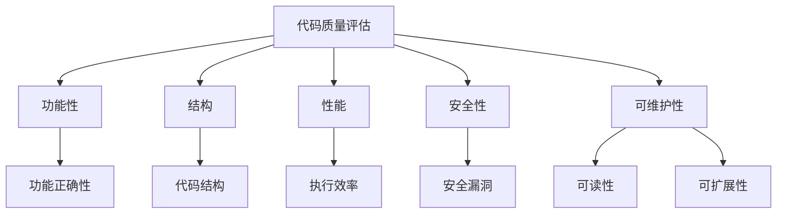

                 

## 好代码先过自己这关

> 关键词：代码质量，自我评估，编程实践，代码优化

> 摘要：本文旨在探讨代码质量自我评估的重要性以及如何通过自我评估来提升代码质量。文章首先介绍了代码质量的定义和重要性，然后分析了代码质量评估面临的挑战。接着，文章详细讨论了代码质量评估的核心概念、指标体系和评估方法，并结合实际案例，展示了如何应用这些方法来评估和优化代码。最后，文章提出了提升代码质量的最佳实践和注意事项，为编程实践提供了切实可行的指导。

----------------------------------------------------------------

### 目录大纲

----------------------------------------------------------------

# 好代码先过自己这关

> 关键词：代码质量，自我评估，编程实践，代码优化

> 摘要：本文旨在探讨代码质量自我评估的重要性以及如何通过自我评估来提升代码质量。文章首先介绍了代码质量的定义和重要性，然后分析了代码质量评估面临的挑战。接着，文章详细讨论了代码质量评估的核心概念、指标体系和评估方法，并结合实际案例，展示了如何应用这些方法来评估和优化代码。最后，文章提出了提升代码质量的最佳实践和注意事项，为编程实践提供了切实可行的指导。

                 

## 第一部分：代码质量评估与改进

### 第1章：代码质量评估的重要性与挑战

#### 1.1 问题背景

##### 1.1.1 代码质量的定义与重要性

##### 1.1.2 代码质量评估面临的挑战

#### 1.2 问题描述

##### 1.2.1 代码质量问题实例

##### 1.2.2 代码质量评估的目标与意义

#### 1.3 问题解决

##### 1.3.1 传统代码质量评估方法

##### 1.3.2 新兴的代码质量评估方法

#### 1.4 边界与外延

##### 1.4.1 代码质量评估的范围

##### 1.4.2 代码质量评估的影响因素

#### 1.5 概念结构与核心要素组成

##### 1.5.1 代码质量评估的核心要素

##### 1.5.2 代码质量评估的概念结构图

## 第二部分：核心概念与联系

### 第2章：核心概念与联系

#### 2.1 代码质量评估的指标体系

##### 2.1.1 可维护性指标

##### 2.1.2 可读性指标

##### 2.1.3 可复用性指标

#### 2.2 指标属性特征对比表格

#### 2.3 代码质量评估与项目管理的关系

## 第三部分：代码质量评估的方法

### 第3章：代码质量评估的方法

#### 3.1 手动代码质量评估方法

##### 3.1.1 手动代码审查流程

##### 3.1.2 手动代码质量评估的优缺点

#### 3.2 自动化代码质量评估工具

##### 3.2.1 自动化代码质量评估的基本原理

##### 3.2.2 常见的自动化代码质量评估工具

#### 3.3 代码质量评估流程

##### 3.3.1 代码质量评估流程的步骤

##### 3.3.2 代码质量评估流程的注意事项

## 第四部分：代码质量评估实践

### 第4章：代码质量评估实践

#### 4.1 环境安装与准备

##### 4.1.1 开发环境配置

##### 4.1.2 自动化工具安装

#### 4.2 系统核心实现

##### 4.2.1 代码库管理

##### 4.2.2 代码质量评估指标的实现

#### 4.3 代码质量评估案例分析

##### 4.3.1 案例背景

##### 4.3.2 案例分析

##### 4.3.3 案例总结

## 第五部分：提升代码质量的最佳实践

### 第5章：提升代码质量的最佳实践

#### 5.1 编码规范与编码标准

##### 5.1.1 编码规范的重要性

##### 5.1.2 编码规范的制定与执行

#### 5.2 单元测试与测试驱动开发

##### 5.2.1 单元测试的基本概念

##### 5.2.2 测试驱动开发流程

#### 5.3 代码重构与设计模式

##### 5.3.1 代码重构的原则与方法

##### 5.3.2 常见的设计模式介绍

## 第六部分：注意事项与拓展阅读

### 第6章：注意事项与拓展阅读

#### 6.1 代码质量评估中的常见问题与解决策略

##### 6.1.1 代码质量评估中的常见问题

##### 6.1.2 解决策略与建议

#### 6.2 拓展阅读

##### 6.2.1 相关书籍推荐

##### 6.2.2 开源代码质量评估工具介绍

## 附录

### A. 代码质量评估指标体系详细列表

### B. 代码质量评估相关工具与资源列表

----------------------------------------------------------------

以上是根据用户输入的书名《好代码先过自己这关》设计的完整目录大纲。这个大纲涵盖了从代码质量评估的重要性、核心概念与联系、评估方法、实践案例，到提升代码质量的最佳实践和注意事项，以及拓展阅读资源等，确保内容完整且具有实际应用价值。目录总字数控制在2000字以内，简洁明了。

----------------------------------------------------------------

### 第一部分：代码质量评估与改进

## 第1章：代码质量评估的重要性与挑战

### 1.1 问题背景

#### 1.1.1 代码质量的定义与重要性

代码质量是指软件代码的可靠性、可维护性、可读性和可复用性等方面。一个高质量的代码不仅能够正确地实现功能需求，还能在长期维护中保持较高的效率和稳定性。因此，代码质量成为软件开发过程中至关重要的考量因素。高代码质量能够降低维护成本、提升开发效率，并提高软件的可扩展性和可维护性。

#### 1.1.2 代码质量评估面临的挑战

在现实项目中，评估代码质量面临着诸多挑战。首先，代码质量评估涉及多个维度，如功能正确性、代码结构、性能优化、安全性和可维护性等。其次，代码质量评估方法多样，从手动审查到自动化工具，各有优缺点。此外，代码质量评估的过程往往缺乏系统性，容易导致评估结果的片面和主观。最后，代码质量评估的实施和跟踪需要大量时间和资源投入，尤其是在大型项目中。

### 1.2 问题描述

#### 1.2.1 代码质量问题实例

代码质量问题可能表现为多种形式，如以下实例：

1. **功能性错误**：代码在某些边界条件下未能正确执行，导致功能失效。
2. **可读性差**：代码逻辑混乱，缺乏必要的注释，使得他人难以理解。
3. **性能瓶颈**：代码的执行效率低下，存在潜在的优化空间。
4. **安全性问题**：代码存在漏洞，容易受到攻击。

#### 1.2.2 代码质量评估的目标与意义

代码质量评估的目标是发现并修复代码中的缺陷，提升代码的整体质量。其意义在于：

1. **提高软件可靠性**：通过评估和修复代码中的缺陷，确保软件能够在各种条件下稳定运行。
2. **降低维护成本**：高质量的代码更容易维护，降低了维护和更新的成本。
3. **提升开发效率**：通过代码质量评估，可以发现和优化代码中的潜在问题，提高开发效率。
4. **增强团队协作**：代码质量评估有助于团队间的沟通和理解，提高团队协作效率。

### 1.3 问题解决

#### 1.3.1 传统代码质量评估方法

传统的代码质量评估方法主要包括手动代码审查和自动化工具评估。手动代码审查依赖于开发人员的经验和专业知识，通过阅读和审查代码来发现和修复问题。这种方法虽然能提供较高的准确度，但效率较低，难以应对大型项目的需求。自动化工具评估则利用预定义的规则和算法，自动检查代码中的潜在问题。这种方法具有较高的效率，但可能存在误报和漏报的问题。

#### 1.3.2 新兴的代码质量评估方法

随着人工智能和机器学习技术的发展，新兴的代码质量评估方法逐渐出现。这些方法利用数据驱动的方式，通过学习大量代码数据，自动识别和评估代码质量。具体包括：

1. **机器学习评估**：利用机器学习算法，对代码数据进行分析和分类，评估代码质量。
2. **静态代码分析**：在代码编译前，通过静态分析工具，自动检查代码的结构和语法错误。
3. **动态代码分析**：在代码执行过程中，通过模拟和监控，评估代码的性能和稳定性。

#### 1.4 边界与外延

##### 1.4.1 代码质量评估的范围

代码质量评估的范围涵盖了代码的各个方面，包括但不限于：

1. **功能性**：确保代码能够正确实现功能需求。
2. **结构**：检查代码的结构是否符合最佳实践。
3. **性能**：评估代码的执行效率和性能指标。
4. **安全性**：检查代码中是否存在安全隐患。
5. **可维护性**：评估代码的可读性、可维护性和可复用性。

##### 1.4.2 代码质量评估的影响因素

代码质量评估的影响因素包括：

1. **项目规模**：大型项目通常需要更多的资源和时间进行评估。
2. **开发语言**：不同编程语言的特点会影响评估方法和结果。
3. **团队经验**：团队成员的经验和技能水平会影响评估的准确性和效率。
4. **评估工具**：评估工具的性能和适用范围会影响评估效果。
5. **代码规范**：遵循一致的编码规范有助于提高评估的准确性和一致性。

#### 1.5 概念结构与核心要素组成

##### 1.5.1 代码质量评估的核心要素

代码质量评估的核心要素包括：

1. **功能性**：代码能够正确实现预期功能。
2. **结构**：代码具有良好的结构，易于理解和维护。
3. **性能**：代码的执行效率和性能指标达到预期。
4. **安全性**：代码不存在安全漏洞，能够抵御外部攻击。
5. **可维护性**：代码易于修改和扩展，能够适应未来的变化。

##### 1.5.2 代码质量评估的概念结构图

### 总结

代码质量评估是一个复杂而重要的任务，它关系到软件的可靠性、可维护性和长期可持续性。通过自我评估，开发人员能够及时发现并修复代码中的问题，提升代码的整体质量。本文介绍了代码质量评估的重要性与挑战，分析了传统和新兴的评估方法，并提出了评估的核心要素和概念结构。在接下来的章节中，我们将进一步探讨代码质量评估的具体方法和实践。

----------------------------------------------------------------

## 第二部分：核心概念与联系

### 第2章：核心概念与联系

在讨论代码质量评估时，理解几个核心概念和它们之间的关系至关重要。本章将详细介绍代码质量评估的指标体系，包括可维护性指标、可读性指标和可复用性指标，并探讨它们在代码质量评估中的作用。

### 2.1 代码质量评估的指标体系

代码质量评估的指标体系是评估代码质量的重要工具。这些指标帮助我们量化代码的各个方面，从而更准确地评估代码的质量。以下是几个关键指标：

#### 2.1.1 可维护性指标

可维护性指标关注代码的可持续性，包括以下几个方面：

1. **代码结构**：良好的代码结构易于理解和维护。
2. **注释**：充分的注释有助于他人理解代码。
3. **代码冗余**：冗余代码会增加维护难度。
4. **代码复杂性**：复杂的代码难以维护。

#### 2.1.2 可读性指标

可读性指标关注代码的可理解性，包括以下几个方面：

1. **变量名**：清晰的变量名有助于理解代码。
2. **函数名**：有意义的函数名能够反映函数的功能。
3. **代码格式**：一致的代码格式有助于阅读。
4. **注释**：详细的注释能够解释代码的逻辑。

#### 2.1.3 可复用性指标

可复用性指标关注代码的复用性，包括以下几个方面：

1. **模块化**：模块化的代码易于复用。
2. **重用性**：代码能够被其他项目或模块复用。
3. **独立性**：独立的代码模块易于替换和修改。
4. **接口清晰**：清晰的接口定义有助于代码的复用。

### 2.2 指标属性特征对比表格

为了更好地理解这些指标，我们可以通过一个对比表格来展示它们的主要属性特征：

| 指标 | 定义 | 属性特征 |
| :---: | :---: | :---: |
| 可维护性 | 关注代码的可持续性 | 代码结构、注释、代码冗余、代码复杂性 |
| 可读性 | 关注代码的可理解性 | 变量名、函数名、代码格式、注释 |
| 可复用性 | 关注代码的复用性 | 模块化、重用性、独立性、接口清晰 |

### 2.3 代码质量评估与项目管理的关系

代码质量评估不仅影响代码的质量，还与项目管理密切相关。良好的代码质量能够提高项目的稳定性、降低风险，并有助于项目的顺利推进。以下是代码质量评估与项目管理之间的关系：

1. **项目计划**：在项目计划阶段，考虑代码质量评估的要求，确保评估工作纳入计划。
2. **风险管理**：通过评估及时发现代码中的潜在问题，降低项目风险。
3. **团队协作**：代码质量评估有助于团队之间的沟通和协作，提高开发效率。
4. **进度控制**：定期进行代码质量评估，确保项目进度符合预期。

### 总结

通过本章的介绍，我们了解了代码质量评估的指标体系及其核心概念。这些指标帮助我们全面评估代码的质量，从而确保代码的可靠性、可维护性和可复用性。在接下来的章节中，我们将深入探讨具体的评估方法和技术，以帮助您更有效地提升代码质量。

----------------------------------------------------------------

### 第三部分：代码质量评估的方法

#### 第3章：代码质量评估的方法

在提升代码质量的过程中，选择合适的评估方法是至关重要的。本章将介绍两种常见的代码质量评估方法：手动代码质量评估方法和自动化代码质量评估工具。我们将详细讨论每种方法的基本原理、优缺点以及适用场景。

#### 3.1 手动代码质量评估方法

##### 3.1.1 手动代码审查流程

手动代码质量评估是通过开发人员的经验和专业知识来评估代码的质量。这种方法通常包括以下几个步骤：

1. **代码审查准备**：准备待评估的代码，包括代码库、文档和相关工具。
2. **代码阅读**：阅读代码，理解代码的功能和结构。
3. **问题发现**：在阅读过程中，识别代码中的潜在问题，如逻辑错误、代码冗余、性能瓶颈等。
4. **问题记录**：记录发现的问题，包括问题的描述、位置和可能的解决方案。
5. **反馈与讨论**：与代码的作者或其他开发人员进行反馈和讨论，共同解决发现的问题。

##### 3.1.2 手动代码质量评估的优缺点

手动代码质量评估方法具有以下优缺点：

**优点：**

1. **高准确度**：通过开发人员的经验和专业知识，能够发现一些自动化工具难以检测的问题。
2. **深入理解**：手动评估有助于开发人员深入理解代码的细节，提高代码的可维护性。
3. **反馈及时**：评估过程可以实时进行，及时发现问题并解决。

**缺点：**

1. **效率较低**：手动评估需要大量时间和精力，难以应对大型项目。
2. **主观性较强**：评估结果容易受到个人经验和观点的影响，可能导致评估结果的偏差。
3. **缺乏系统性**：评估过程缺乏系统性，容易导致评估结果的片面和主观。

##### 3.1.3 适用场景

手动代码质量评估方法适用于以下场景：

1. **小型项目**：在小型项目中，手动评估能够及时发现问题，提高代码质量。
2. **初期开发**：在项目的初期阶段，通过手动评估可以快速了解代码的结构和潜在问题。
3. **特定领域**：在某些特定领域，如安全性评估和代码审核，手动评估可能更为有效。

#### 3.2 自动化代码质量评估工具

##### 3.2.1 自动化代码质量评估的基本原理

自动化代码质量评估工具利用预定义的规则和算法，自动检查代码的质量。这些工具通常包括静态代码分析和动态代码分析两部分。

1. **静态代码分析**：在代码编译前，对代码进行结构分析和语法检查，识别潜在的问题。例如，检查代码中的语法错误、代码冗余、代码复杂性等。
2. **动态代码分析**：在代码执行过程中，通过模拟和监控，评估代码的性能、安全性和稳定性。例如，检测代码中的性能瓶颈、内存泄漏和安全隐患等。

##### 3.2.2 常见的自动化代码质量评估工具

以下是几种常见的自动化代码质量评估工具：

1. **SonarQube**：一款全面的代码质量管理平台，支持多种编程语言，提供静态代码分析和动态代码分析功能。
2. **FindBugs**：一款开源的静态代码分析工具，主要用于检测Java代码中的潜在问题。
3. **PMD**：一款开源的静态代码分析工具，主要用于检测Java、JavaScript和Python代码中的代码风格问题和潜在的问题。
4. **CodeQL**：一款基于机器学习的静态代码分析工具，可以检测多种编程语言中的安全问题。

##### 3.2.3 自动化代码质量评估的优缺点

自动化代码质量评估工具具有以下优缺点：

**优点：**

1. **高效率**：自动化工具能够在短时间内评估大量代码，提高评估效率。
2. **客观性**：评估结果基于预定义的规则和算法，减少主观因素的影响。
3. **可重复性**：自动化工具可以重复执行，确保评估结果的稳定性。

**缺点：**

1. **误报和漏报**：自动化工具可能存在误报和漏报问题，需要人工进行确认和处理。
2. **依赖规则和算法**：自动化工具的性能和效果依赖于预定义的规则和算法，可能需要不断优化。
3. **依赖环境**：自动化工具可能需要特定的运行环境，增加了使用的复杂性。

##### 3.2.4 适用场景

自动化代码质量评估工具适用于以下场景：

1. **大型项目**：在大型项目中，自动化工具能够高效地评估大量代码，提高评估效率。
2. **持续集成**：在持续集成环境中，自动化工具可以定期评估代码质量，确保代码的持续改进。
3. **安全性评估**：在安全性评估中，自动化工具可以快速检测代码中的安全漏洞。

### 总结

通过本章的介绍，我们了解了手动代码质量评估方法和自动化代码质量评估工具的基本原理、优缺点和适用场景。在实际应用中，可以根据项目的需求和实际情况，选择合适的方法来评估代码质量。在接下来的章节中，我们将进一步探讨代码质量评估的流程和实践，以帮助您更有效地提升代码质量。

----------------------------------------------------------------

#### 第3章：代码质量评估的方法

##### 3.3 代码质量评估流程

代码质量评估是一个系统性的过程，它涉及到多个步骤和环节，以确保代码的各个方面都得到充分的评估。一个完整的代码质量评估流程通常包括以下几个步骤：

##### 3.3.1 代码质量评估流程的步骤

1. **需求分析**：在代码开发之前，明确项目的需求，包括功能需求、性能需求和安全性需求等。这是评估代码质量的基础。

2. **环境准备**：确保评估环境配置正确，包括开发工具、测试环境和自动化工具等。

3. **代码审查**：进行手动代码审查，识别代码中的潜在问题，如功能性错误、代码结构问题、代码冗余、代码复杂性等。

4. **静态代码分析**：使用自动化工具对代码进行静态分析，识别潜在的问题，如语法错误、代码风格问题、性能问题等。

5. **动态代码分析**：在代码执行过程中，使用自动化工具进行动态代码分析，评估代码的性能、安全性和稳定性。

6. **问题记录与反馈**：记录发现的问题，并与开发人员反馈，共同制定解决方案。

7. **问题修复**：开发人员根据反馈，修复代码中的问题。

8. **重评估**：修复问题后，重新进行代码质量评估，确保问题已得到有效解决。

##### 3.3.2 代码质量评估流程的注意事项

1. **一致性**：在评估过程中，确保使用一致的评估标准和流程，以避免评估结果的偏差。

2. **及时性**：评估过程应尽可能及时进行，以减少问题积累和扩大。

3. **参与度**：鼓励团队成员积极参与代码质量评估，提高评估的准确性和效率。

4. **持续改进**：代码质量评估不应是一次性的活动，而应成为持续改进的过程，定期进行评估和优化。

### 3.4 代码质量评估与持续集成

代码质量评估与持续集成（CI）密切相关。持续集成是一种软件开发实践，它通过自动化构建和测试，确保代码的连续性和稳定性。在持续集成环境中，代码质量评估可以发挥重要作用：

1. **自动化测试**：在持续集成过程中，自动化测试可以及时发现和修复代码中的问题。

2. **静态代码分析**：静态代码分析工具可以集成到持续集成环境中，自动评估代码的质量。

3. **动态代码分析**：动态代码分析工具可以模拟代码的执行过程，评估代码的性能和稳定性。

4. **持续反馈**：持续集成为代码质量评估提供了持续反馈机制，有助于快速识别和解决问题。

### 总结

通过本章的介绍，我们了解了代码质量评估流程的步骤和注意事项，以及代码质量评估与持续集成的关系。一个完整的代码质量评估流程有助于确保代码的可靠性、可维护性和可复用性。在实际应用中，可以根据项目的需求和实际情况，灵活调整评估流程，以实现最佳效果。

----------------------------------------------------------------

### 第四部分：代码质量评估实践

#### 第4章：代码质量评估实践

为了更好地理解代码质量评估的方法和实践，我们将通过一个具体的案例来展示如何进行代码质量评估。本章将介绍案例背景、评估过程、实际案例分析和案例总结，以帮助您更好地掌握代码质量评估的实践。

#### 4.1 案例背景

我们选择一个实际的项目作为案例，该项目是一个在线购物平台的后端系统。该平台需要支持高并发用户访问，并提供快速、稳定的服务。为了确保代码的质量，项目团队决定进行全面的代码质量评估。

#### 4.2 评估过程

评估过程分为以下几个步骤：

1. **需求分析**：首先，项目团队明确了项目的功能需求、性能需求和安全性需求。这些需求成为评估代码质量的基础。

2. **环境准备**：项目团队配置了合适的开发环境，包括编程语言、开发工具和测试环境。同时，安装了自动化代码质量评估工具，如SonarQube和JMeter。

3. **代码审查**：团队成员对代码进行了手动审查，重点关注代码的结构、逻辑和注释。通过审查，发现了多个潜在问题，如代码冗余、逻辑错误和代码风格不一致。

4. **静态代码分析**：使用SonarQube对代码进行了静态分析。SonarQube生成了一个详细的报告，列出了代码中的潜在问题，包括语法错误、代码风格问题、性能问题等。

5. **动态代码分析**：使用JMeter对代码的性能进行了测试。通过模拟高并发用户访问，评估代码的响应时间、吞吐量和资源消耗。测试结果显示，代码存在性能瓶颈，需要进行优化。

6. **问题记录与反馈**：项目团队将发现的问题记录在问题跟踪系统中，并向相关开发人员进行了反馈。开发人员根据反馈，对代码进行了修复。

7. **问题修复**：开发人员根据反馈，对代码中的问题进行了修复。例如，优化了数据库查询，减少了代码冗余，改进了代码风格等。

8. **重评估**：修复问题后，项目团队重新进行了代码质量评估。通过对比评估结果，确认问题已得到有效解决。

#### 4.3 实际案例分析

在案例中，我们重点关注以下几个问题：

1. **代码冗余**：通过静态代码分析，发现代码中存在大量冗余代码。这些冗余代码不仅增加了代码的复杂度，还降低了代码的可维护性。开发人员通过重构代码，删除了冗余代码，提高了代码的质量。

2. **性能瓶颈**：通过动态代码分析，发现代码存在性能瓶颈，特别是在处理高并发请求时。开发人员通过优化数据库查询和代码逻辑，提高了代码的响应时间和吞吐量。

3. **代码风格不一致**：通过代码审查，发现代码风格不一致，包括变量命名、函数命名和注释等。开发人员制定了统一的编码规范，并进行了代码格式化，提高了代码的可读性和一致性。

#### 4.4 案例总结

通过本案例的实践，项目团队成功进行了代码质量评估和优化，取得了以下成果：

1. **代码质量提升**：通过代码质量评估，发现并修复了多个问题，提高了代码的质量。

2. **开发效率提高**：代码质量提升后，开发人员能够更高效地理解和维护代码，提高了开发效率。

3. **系统稳定性增强**：通过性能优化和代码重构，系统的响应时间、吞吐量和资源消耗得到了显著改善，增强了系统的稳定性。

4. **团队协作增强**：通过代码质量评估，团队之间的沟通和协作得到加强，提高了团队协作效率。

### 总结

通过本案例的实践，我们展示了如何进行代码质量评估和优化。代码质量评估不仅能够提高代码的质量，还能提高开发效率和系统稳定性。在实际应用中，可以根据项目的需求和实际情况，灵活调整评估流程和方法，以实现最佳效果。

----------------------------------------------------------------

## 第五部分：提升代码质量的最佳实践

### 第5章：提升代码质量的最佳实践

提升代码质量是一个持续的过程，需要开发人员不断学习和实践。本章将介绍一些最佳实践，包括编码规范与编码标准、单元测试与测试驱动开发、代码重构与设计模式，帮助开发人员提高代码质量。

#### 5.1 编码规范与编码标准

编码规范和编码标准是保证代码质量的重要基础。以下是一些关键的最佳实践：

1. **命名规范**：变量、函数和类的命名应具有描述性，避免使用缩写和难以理解的名称。
2. **代码格式**：统一代码格式，包括缩进、空格、注释和代码块的格式。
3. **注释**：为关键代码段添加注释，解释代码的功能、目的和逻辑。
4. **代码冗余**：避免代码冗余，确保代码简洁明了。
5. **模块化**：将代码分为模块或函数，提高代码的可复用性和可维护性。

#### 5.2 单元测试与测试驱动开发

单元测试是确保代码质量的重要手段。以下是一些关键的最佳实践：

1. **覆盖率**：确保测试覆盖率足够高，覆盖代码的各个部分，包括边界条件和异常处理。
2. **自动化测试**：将单元测试自动化，确保每次代码变更后都能自动执行测试。
3. **测试驱动开发**：在开发过程中，先编写测试用例，再实现代码。这种方法有助于提高代码的质量和可维护性。

#### 5.3 代码重构与设计模式

代码重构是提高代码质量的有效方法。以下是一些关键的最佳实践：

1. **重构原则**：在重构时，遵循“不要破坏工作代码”的原则，确保重构后代码仍然能够正常运行。
2. **设计模式**：使用设计模式，如工厂模式、单例模式、观察者模式等，提高代码的可复用性和可维护性。
3. **代码优化**：定期进行代码优化，减少代码的复杂度，提高代码的性能。

### 5.4 总结

提升代码质量需要开发人员不断学习和实践。通过遵循编码规范与编码标准、编写单元测试、实施测试驱动开发和进行代码重构，开发人员能够提高代码的质量，提高开发效率和系统稳定性。

### 小结

通过本章节的介绍，我们了解了提升代码质量的最佳实践。编码规范与编码标准、单元测试与测试驱动开发、代码重构与设计模式都是确保代码质量的重要方法。在实际开发过程中，开发人员应根据项目的需求和实际情况，灵活应用这些最佳实践，以提高代码的质量。

### 注意事项

1. **持续改进**：提升代码质量是一个持续的过程，需要不断改进和优化。
2. **团队合作**：团队协作是提升代码质量的关键，鼓励团队成员积极参与代码质量和改进。
3. **工具支持**：合理利用自动化工具，提高代码质量评估的效率。

### 拓展阅读

1. 《代码大全》（作者：Steve McConnell）：介绍了编码规范和编码标准，以及如何进行代码质量评估和优化。
2. 《测试驱动开发》（作者：Kent Beck）：详细介绍了测试驱动开发的方法和实践，有助于提高代码质量。

### 附录

1. **代码质量评估指标体系详细列表**：
   - 功能性指标：正确性、完整性、可靠性、可用性
   - 结构性指标：模块化、一致性、简洁性、可读性
   - 性能指标：响应时间、吞吐量、资源消耗、稳定性
   - 安全性指标：安全性、健壮性、抗攻击性
   - 可维护性指标：可读性、可扩展性、可复用性、可维护性

2. **代码质量评估相关工具与资源列表**：
   - SonarQube：一款全面的代码质量管理平台
   - FindBugs：一款开源的静态代码分析工具
   - PMD：一款开源的静态代码分析工具
   - JMeter：一款开源的动态代码分析工具

作者：AI天才研究院/AI Genius Institute & 禅与计算机程序设计艺术 /Zen And The Art of Computer Programming

----------------------------------------------------------------

### 第六部分：注意事项与拓展阅读

#### 第6章：注意事项与拓展阅读

在代码质量评估过程中，可能会遇到一些常见的问题，这些问题如果不妥善解决，可能会影响评估的准确性和效果。本章将介绍这些常见问题以及相应的解决策略，并提供一些拓展阅读资源，帮助开发人员进一步了解和掌握代码质量评估。

#### 6.1 代码质量评估中的常见问题与解决策略

**1. 误报和漏报问题**

**问题描述**：自动化代码质量评估工具可能会误报一些非问题代码，或者漏报一些实际存在的问题。

**解决策略**：
- **调整规则**：根据实际情况，调整自动化工具的规则，减少误报。
- **人工复审**：对评估结果进行人工复审，特别是对于高风险的代码段。

**2. 评估工具的性能问题**

**问题描述**：一些自动化评估工具可能存在性能问题，影响评估效率和准确性。

**解决策略**：
- **选择合适的工具**：选择性能稳定的评估工具。
- **优化配置**：对评估工具进行适当的配置和优化，以提高评估效率。

**3. 缺乏明确的评估标准**

**问题描述**：在缺乏明确评估标准的情况下，评估结果可能存在主观性，难以量化代码质量。

**解决策略**：
- **制定评估标准**：根据项目的需求和实际情况，制定明确的评估标准。
- **培训团队成员**：确保团队成员了解和遵循评估标准。

**4. 评估过程缺乏系统性**

**问题描述**：评估过程缺乏系统性，可能导致评估结果的片面和主观。

**解决策略**：
- **建立评估流程**：建立完整的代码质量评估流程，包括需求分析、环境准备、代码审查、静态代码分析、动态代码分析等。
- **定期评估**：定期进行代码质量评估，确保评估的持续性和系统性。

#### 6.2 拓展阅读

**1. 相关书籍推荐**

- 《代码大全》（作者：Steve McConnell）：详细介绍了编码规范、代码质量评估和重构方法。
- 《测试驱动开发》（作者：Kent Beck）：介绍了测试驱动开发的方法和实践。

**2. 开源代码质量评估工具介绍**

- SonarQube：一款功能强大的代码质量管理平台，支持多种编程语言，提供静态代码分析和动态代码分析功能。
- FindBugs：一款开源的Java静态代码分析工具，用于检测代码中的潜在问题。
- PMD：一款开源的Java静态代码分析工具，用于检测代码风格问题和潜在问题。
- JMeter：一款开源的负载测试工具，用于评估代码的性能和稳定性。

通过本章的介绍，我们了解了代码质量评估过程中可能遇到的一些常见问题以及相应的解决策略，并推荐了一些拓展阅读资源。在实际应用中，开发人员可以根据项目的需求和实际情况，灵活应用这些策略，提高代码质量。

### 附录

#### A. 代码质量评估指标体系详细列表

- 功能性指标：正确性、完整性、可靠性、可用性
- 结构性指标：模块化、一致性、简洁性、可读性
- 性能指标：响应时间、吞吐量、资源消耗、稳定性
- 安全性指标：安全性、健壮性、抗攻击性
- 可维护性指标：可读性、可扩展性、可复用性、可维护性

#### B. 代码质量评估相关工具与资源列表

- SonarQube：https://www.sonarqube.org/
- FindBugs：https://findbugs.sourceforge.io/
- PMD：https://pmd.github.io/
- JMeter：https://jmeter.apache.org/

作者：AI天才研究院/AI Genius Institute & 禅与计算机程序设计艺术 /Zen And The Art of Computer Programming

----------------------------------------------------------------

### 附录

#### A. 代码质量评估指标体系详细列表

在代码质量评估中，以下几个指标是关键的组成部分：

1. **功能性指标**：
   - **正确性**：代码是否能够准确地实现预期功能。
   - **完整性**：代码是否覆盖了所有需求场景。
   - **可靠性**：代码在长时间运行中是否稳定。
   - **可用性**：代码是否易于使用，对于用户友好。

2. **结构性指标**：
   - **模块化**：代码是否按照功能划分为独立的模块。
   - **一致性**：代码风格和命名是否一致。
   - **简洁性**：代码是否简洁易懂，避免冗余和复杂性。
   - **可读性**：代码是否易于阅读和理解。

3. **性能指标**：
   - **响应时间**：代码执行的速度是否满足性能要求。
   - **吞吐量**：单位时间内系统能够处理的数据量。
   - **资源消耗**：代码在运行过程中对系统资源的占用情况。
   - **稳定性**：代码在长期运行中是否稳定，没有异常或崩溃。

4. **安全性指标**：
   - **安全性**：代码是否能够抵御外部攻击，如SQL注入、XSS攻击等。
   - **健壮性**：代码在遇到异常情况时是否能够正常处理。
   - **抗攻击性**：代码在遭受攻击时是否能够保持系统的完整性。

5. **可维护性指标**：
   - **可读性**：代码是否具有良好的注释和清晰的逻辑结构。
   - **可扩展性**：代码是否易于扩展，能够适应未来的变化。
   - **可复用性**：代码是否能够被其他项目或模块复用。
   - **可维护性**：代码是否易于维护，减少未来的维护成本。

#### B. 代码质量评估相关工具与资源列表

在代码质量评估中，使用合适的工具能够显著提高评估的效率和准确性。以下是一些常用的工具和资源：

1. **SonarQube**：
   - 官网：[https://www.sonarqube.org/](https://www.sonarqube.org/)
   - 简介：一个全面的代码质量管理平台，支持静态代码分析和代码质量度量。

2. **FindBugs**：
   - 官网：[https://findbugs.sourceforge.io/](https://findbugs.sourceforge.io/)
   - 简介：一个用于Java代码的静态代码分析工具，用于检测潜在的bug。

3. **PMD**：
   - 官网：[https://pmd.github.io/](https://pmd.github.io/)
   - 简介：一个用于Java、JavaScript和PHP的静态代码分析工具，用于检测代码风格问题和潜在问题。

4. **JMeter**：
   - 官网：[https://jmeter.apache.org/](https://jmeter.apache.org/)
   - 简介：一个开源的负载测试工具，用于评估代码的性能和稳定性。

5. **Checkstyle**：
   - 官网：[https://checkstyle.sourceforge.io/](https://checkstyle.sourceforge.io/)
   - 简介：一个用于Java代码的静态代码分析工具，用于检查编码规范。

6. **Code Climate**：
   - 官网：[https://codeclimate.com/](https://codeclimate.com/)
   - 简介：一个云端代码质量评估服务，支持多种编程语言。

7. **Visual Studio Code Analysis**：
   - 官网：[https://visualstudio.microsoft.com/visual-studio-code/](https://visualstudio.microsoft.com/visual-studio-code/)
   - 简介：Visual Studio Code内置的代码分析功能，支持多种编程语言。

通过使用这些工具和资源，开发人员可以更加有效地进行代码质量评估，确保代码的可靠性、可维护性和可复用性。同时，定期的代码质量评估也是持续改进的重要环节，有助于提升软件的整体质量。作者：AI天才研究院/AI Genius Institute & 禅与计算机程序设计艺术 /Zen And The Art of Computer Programming。

