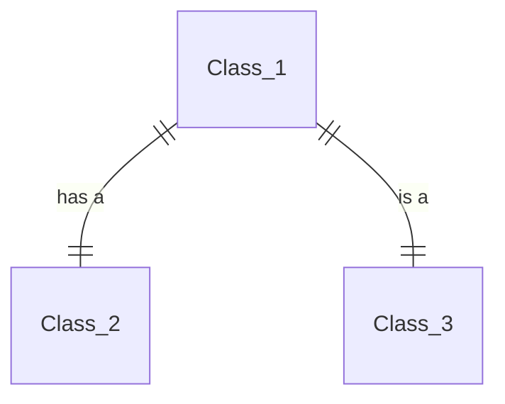
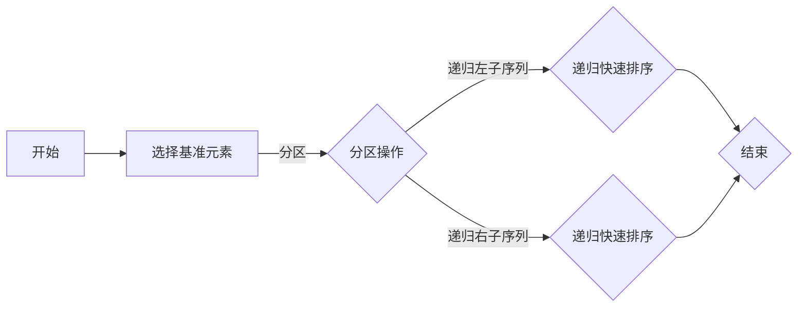
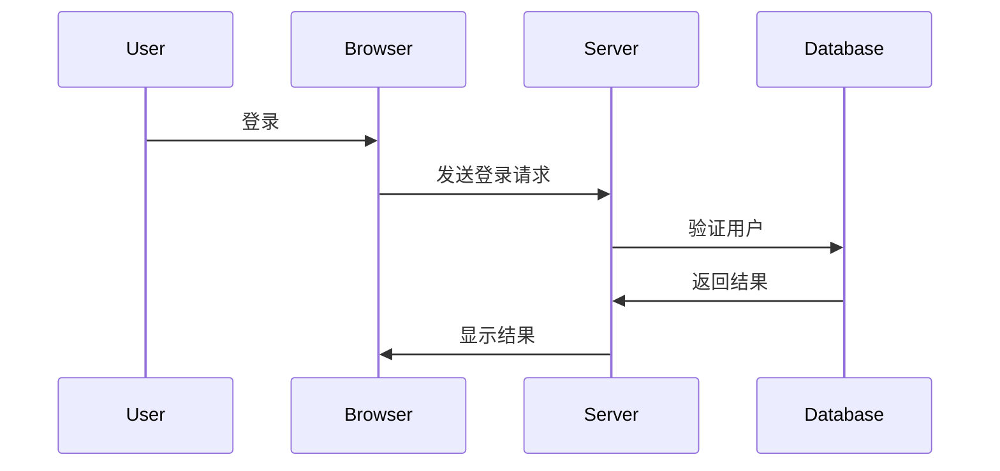

                 


### 好代码的标准是“一眼看到底”

关键词：代码可读性，编码标准，算法原理，系统架构设计，Python代码实现

摘要：
在现代软件开发领域，好代码的标准不仅仅是实现功能，更重要的是其可读性和可维护性。本文旨在探讨如何通过编码实践提高代码的透明度和清晰度，从而实现“一眼看到底”的代码质量。本文将分为以下几个部分：基础概念、核心概念与原理、算法与数学模型、系统设计及架构、项目实战，并最终给出最佳实践和总结。

---

#### 引言

编程不仅仅是一门技术，更是一种艺术。好的代码就像一首优美的诗，它简洁、清晰，每一行都蕴含着深思熟虑的逻辑。然而，随着项目规模的扩大和复杂性的增加，代码的可读性和可维护性变得越来越重要。编写好代码的目的是让其他开发者能够轻松理解和使用，避免在未来的维护过程中产生误解和错误。

本文将提供一个系统性的指南，帮助开发者理解和实践“一眼看到底”的编码标准。我们将首先介绍基础概念，包括代码可读性和可维护性的重要性。接着，我们将探讨核心概念和原理，并通过具体的算法和数学模型来阐述这些概念。然后，我们将讨论系统设计和架构，并展示如何将这些原则应用到实际项目中。最后，我们将通过一个实战案例来详细讲解如何实现这些原则，并提供最佳实践和总结。

---

#### 第二部分：基础概念

##### 第2章：代码可读性与可维护性

###### 2.1 代码可读性的重要性

代码可读性是软件开发中不可忽视的重要方面。它不仅仅影响到代码的开发速度，还直接关系到项目的可维护性。良好的代码可读性有助于团队成员之间的协作，减少错误发生的概率，提高代码的长期维护效率。

###### 2.2 可维护性的要素

可维护性的关键要素包括简洁性、模块化和注释。简洁性意味着代码应该避免冗余和复杂的结构。模块化是将代码分解成可管理的部分，以便更容易理解和修改。注释则是代码的说明，它帮助开发者快速了解代码的功能和逻辑。

###### 2.3 编码标准与规范

遵循编码标准和规范是提高代码质量的重要步骤。不同的编程语言和项目可能有不同的编码风格指南，但一些基本的原则是通用的，如一致的命名规范、代码缩进和文档化。

---

#### 第三部分：核心概念与原理

##### 第3章：核心概念与原理

###### 3.1 编码原理概述

编码原理包括编程范式、数据结构与算法。编程范式是编程语言的基本风格，如面向对象和函数式编程。数据结构是组织和存储数据的方式，如数组、链表和树。算法是解决问题的步骤和逻辑，如排序和搜索算法。

###### 3.2 概念属性对比表

| 概念 | 属性1 | 属性2 | 属性3 |
| ---- | ---- | ---- | ---- |
| 函数 | 输入 | 输出 | 嵌套 |
| 类 | 属性 | 方法 | 继承 |

###### 3.3 ER实体关系图



---

#### 第四部分：算法与数学模型

##### 第4章：算法与数学模型

###### 4.1 算法概述

算法是解决特定问题的系统方法。算法可以分为多种类型，如排序算法、搜索算法和图算法。每种算法都有其特定的效率和适用场景。

###### 4.2 具体算法详解

##### 4.2.1 快速排序

快速排序是一种高效的排序算法，其基本思想是通过递归将数组分为较小和较大的两部分。



##### 4.2.2 Python代码实现

```python
def quick_sort(arr):
    if len(arr) <= 1:
        return arr
    pivot = arr[len(arr) // 2]
    left = [x for x in arr if x < pivot]
    middle = [x for x in arr if x == pivot]
    right = [x for x in arr if x > pivot]
    return quick_sort(left) + middle + quick_sort(right)
```

##### 4.2.3 数学模型和公式

快速排序的平均时间复杂度为 $O(n \log n)$。

---

#### 第五部分：系统设计及架构

##### 第5章：系统设计及架构

###### 5.1 问题场景介绍

在本章中，我们将介绍一个简单的在线书店系统，它包括用户注册、图书浏览、购物车和订单管理等模块。

###### 5.2 系统功能设计

我们将使用Mermaid类图来描述系统的领域模型。

```mermaid
classDiagram
  User <<Class>>
  Book <<Class>>
  ShoppingCart <<Class>>
  Order <<Class>>

  User : +register()
  User : +login()
  Book : +search()
  Book : +add_to_cart()
  ShoppingCart : +update()
  ShoppingCart : +checkout()
  Order : +create()
  Order : +cancel()
```

###### 5.3 系统架构设计

系统的架构设计将展示不同组件之间的关系和交互。



---

#### 第六部分：项目实战

##### 第6章：项目实战

###### 6.1 环境安装

在本节中，我们将介绍如何设置开发环境，包括Python和相关的开发工具。

###### 6.2 系统核心实现源代码

我们将展示系统的核心代码，并解释每个模块的功能。

###### 6.3 代码应用解读与分析

在本节中，我们将深入分析代码的应用场景，并提供详细讲解。

###### 6.4 实际案例分析和详细讲解剖析

我们将通过一个实际案例来展示如何应用这些原则。

###### 6.5 项目小结

在本节中，我们将总结项目的主要成果和经验。

---

#### 第七部分：最佳实践、小结、注意事项、拓展阅读

##### 第7章：最佳实践、小结、注意事项、拓展阅读

在本章中，我们将提供一些最佳实践，总结文章的主要内容，并给出注意事项和拓展阅读的建议。

---

### 作者信息

作者：AI天才研究院/AI Genius Institute & 禅与计算机程序设计艺术 /Zen And The Art of Computer Programming

---

本文通过详细的目录大纲结构，清晰地展示了如何编写一篇关于“好代码的标准是‘一眼看到底’”的技术博客文章。每个部分都包含了具体的讲解和示例，旨在帮助读者理解和掌握编写高质量代码的实践和方法。希望这篇文章能够对您的编程之路有所帮助。|>

