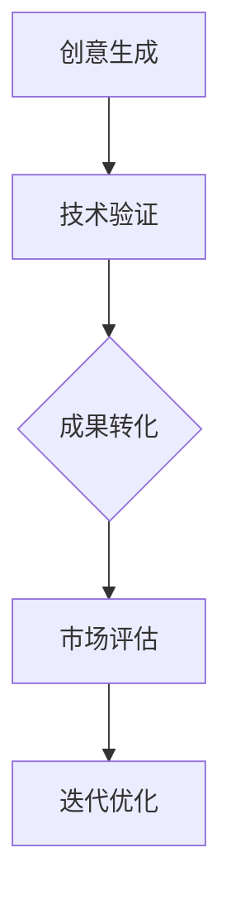
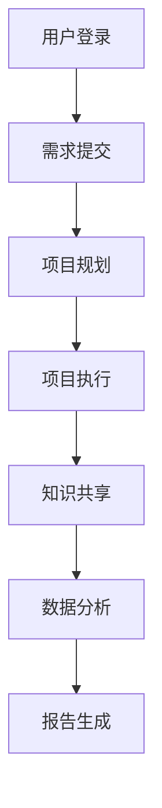

                 

### 第1章 背景介绍与问题定义

在当今这个快速发展的信息化时代，技术创新已经成为了企业发展和市场竞争力提升的核心驱动力。无论是传统行业还是新兴领域，技术创新都已成为企业立足市场、赢得竞争优势的关键。然而，如何培养团队的技术创新能力，成为一个亟待解决的重要问题。

## 1.1 问题的背景

### 1.1.1 技术创新的重要性

#### 1.1.1.1 企业发展的驱动力

技术创新是推动企业发展的核心动力。在激烈的市场竞争中，只有不断创新，才能保持企业的竞争优势。技术创新不仅仅体现在产品的创新上，还包括生产流程、服务模式等各个方面。一个具有创新能力的团队，能够更好地适应市场的变化，为企业带来持续的发展动力。

#### 1.1.1.2 市场竞争的必然要求

在当今这个信息爆炸的时代，市场环境变化迅速，竞争对手层出不穷。只有不断进行技术创新，才能在激烈的市场竞争中立于不败之地。技术创新可以帮助企业开发出更具竞争力的产品和服务，满足消费者的多样化需求，从而在市场中占据一席之地。

#### 1.1.1.3 经济发展的需求

技术创新是推动经济发展的关键因素。随着全球经济的不断发展，各国对于科技创新的投入不断增加。只有通过技术创新，才能推动产业升级，提高经济效益，实现经济的可持续发展。

### 1.1.2 团队技术创新现状

#### 1.2.1.1 创新意识的培养

当前，很多企业的团队在技术创新方面还存在一定的不足。首先，创新意识的培养不够。团队成员对于技术创新的重要性认识不足，缺乏主动探索和尝试的积极性。这往往导致企业在技术创新方面的动力不足。

#### 1.2.1.2 创新能力的提升

其次，创新能力的提升也是一大难题。团队成员的专业技能和知识水平参差不齐，缺乏系统性的培训和学习机制。这使得团队在面临新的技术挑战时，往往无法迅速应对，创新成果的转化率较低。

#### 1.2.1.3 创新成果的转化

此外，创新成果的转化也是一个重要的瓶颈。企业在技术创新过程中，往往面临着从理论到实践的转化难题。如何将创新成果有效地应用到实际工作中，是企业需要深入思考和解决的问题。

### 1.1.3 问题的解决

针对上述问题，我们需要从以下几个方面着手解决：

#### 1.3.1.1 团队结构

首先，优化团队结构，建立合理的创新团队。团队结构的设计应考虑到成员的多样性，包括不同专业背景、不同工作经验等。这样的团队能够更好地进行知识互补和资源整合，提高整体创新能力。

#### 1.3.1.2 团队文化

其次，构建积极向上的团队文化。鼓励团队成员进行创新思维，营造一个开放、包容、支持的环境。通过团队文化建设，提高团队成员的归属感和团队凝聚力，激发创新潜能。

#### 1.3.1.3 技术氛围

此外，营造良好的技术氛围。提供充足的技术支持，鼓励团队成员进行技术交流和分享。通过技术活动、研讨会等形式，促进团队成员之间的知识共享和技能提升，提高整体技术水平。

## 1.4 边界与外延

### 1.4.1 团队的界定

在本文中，团队指的是由若干成员组成的，共同致力于实现某一目标的工作集体。团队的范围可以是企业内部的不同部门，也可以是跨部门、跨行业的协作团队。

### 1.4.2 技术创新的范畴

技术创新的范畴主要包括新产品的研发、新技术的应用、新流程的优化等。技术创新不仅涉及技术本身，还包括市场、管理、运营等各个方面。

## 1.5 概念结构与核心要素组成

### 1.5.1 技术创新的概念结构

技术创新是指通过引入新技术、新方法、新流程等，实现产品、服务或管理等方面的改进和优化。其概念结构可以概括为：

- 技术创新主体：指进行技术创新的个人或组织。
- 技术创新客体：指技术创新所涉及的技术、产品、服务或管理等方面。
- 技术创新环境：指支持技术创新的外部环境，包括政策、市场、资源等。

### 1.5.2 技术创新的过程

技术创新的过程通常包括以下几个阶段：

- 需求分析：确定技术创新的需求，明确技术创新的目标。
- 研发设计：进行技术研发，设计创新方案。
- 实施验证：实施创新方案，并进行验证和测试。
- 成果转化：将创新成果转化为实际应用，实现商业价值。

### 1.5.3 技术创新的影响因素

影响技术创新的因素包括：

- 人才：拥有具备创新能力和专业知识的人才，是技术创新的关键。
- 资源：包括资金、技术、设备等资源，是技术创新的基础。
- 环境因素：包括政策、市场、文化等外部环境，对技术创新具有重要影响。

## 1.6 本章小结

本章从背景介绍、问题定义、解决思路等方面，对团队技术创新进行了深入分析。通过本章的学习，我们可以了解到技术创新对企业发展的重要性，以及团队在技术创新中面临的挑战。接下来，我们将进一步探讨技术创新的核心概念、团队文化的构建、技术氛围的营造等内容。

---

### 第2章 核心概念与联系

在探讨如何培养团队的技术创新能力之前，我们需要明确几个核心概念，并分析它们之间的联系。本章将介绍技术创新的原理、团队文化的构建和技术氛围的营造，以便为后续章节的讨论奠定基础。

## 2.1 技术创新的原理

### 2.1.1 技术创新的基本概念

#### 2.1.1.1 技术创新的定义

技术创新是指通过引入新技术、新方法、新流程等，实现产品、服务或管理等方面的改进和优化。它不仅仅局限于技术层面的创新，还涉及到商业模型、运营流程等多个方面。

#### 2.1.1.2 技术创新的核心要素

技术创新的核心要素包括：

- **创新思维**：指具备创新意识和能力，能够从不同角度思考问题，寻找解决方案。
- **技术能力**：指团队在特定技术领域所具备的知识和技能，是进行技术创新的基础。
- **资源**：包括资金、技术、设备等，是技术创新的保障。
- **环境**：指支持技术创新的外部环境，如政策、市场、文化等。

#### 2.1.1.3 技术创新的分类

技术创新可以按照不同的维度进行分类，如：

- **渐进性创新**：通过改进现有产品或服务，提高其性能或效率。
- **颠覆性创新**：通过引入全新技术或理念，颠覆现有市场格局。
- **集成创新**：将不同技术或领域进行整合，实现协同效应。

### 2.1.2 技术创新的属性特征对比

#### 2.1.2.1 技术创新的特征

技术创新具有以下几个特征：

- **创造性**：通过新的思路和方法，解决传统方法难以解决的问题。
- **不确定性**：技术创新过程中，结果往往难以预测，存在一定的风险。
- **复杂性**：技术创新涉及多个领域和环节，需要协调不同利益相关者。

#### 2.1.2.2 技术创新的对比分析

与传统研发相比，技术创新具有以下不同之处：

- **目的**：传统研发主要目的是优化现有技术，而技术创新则是创造全新的技术或产品。
- **范围**：传统研发主要关注技术本身，而技术创新还涉及到商业、市场、运营等多个方面。
- **成果**：传统研发的成果往往是改进型的，而技术创新的成果可能是颠覆性的。

### 2.1.3 技术创新与传统研发的区别

#### 2.1.3.1 传统研发的局限性

传统研发主要关注技术本身，往往忽视了市场需求和商业价值。这使得研发成果在市场上难以得到有效应用，限制了企业的创新能力。

#### 2.1.3.2 技术创新的独特性

技术创新则强调从市场需求出发，通过整合技术、市场、商业等多方面资源，实现技术、市场、商业的协同创新。这使得技术创新具有更高的商业价值和应用前景。

## 2.2 团队文化的构建

### 2.2.1 团队文化的定义

团队文化是指团队在长期共同工作中形成的共同价值观、信念、行为规范等。它是一个团队的灵魂，对团队的工作氛围、行为习惯和绩效表现具有重要影响。

#### 2.2.1.1 团队文化的概念

团队文化是一个团队在长期共同工作中形成的共同价值观、信念、行为规范等的总和。它包括以下几个方面：

- **价值观**：团队成员共同认同的基本观念，如创新、诚信、协作等。
- **信念**：团队对未来的共同期望和信心，如追求卓越、持续改进等。
- **行为规范**：团队在工作和生活中遵循的行为准则，如尊重他人、遵守纪律等。

#### 2.2.1.2 团队文化的类型

团队文化可以分为以下几种类型：

- **竞争型文化**：鼓励竞争，追求卓越，强调个人能力和成就。
- **合作型文化**：强调团队合作，共同分担责任和成果。
- **创新型文化**：鼓励创新思维，支持冒险和尝试，追求突破。
- **稳定型文化**：注重稳定性和可靠性，强调流程和规范。

### 2.2.2 团队文化的特征

#### 2.2.2.1 团队文化的特征

团队文化具有以下几个特征：

- **共同性**：团队文化是团队成员共同认同和遵循的价值观和行为规范。
- **独特性**：每个团队都有其独特的文化特点，反映了团队的历史背景和价值观。
- **传承性**：团队文化是通过团队成员的传承和传播而不断发展和完善的。

#### 2.2.2.2 团队文化的对比分析

不同类型的团队文化在绩效、团队氛围等方面存在明显差异。竞争型文化有利于激发个人潜力，但可能导致内部分裂；合作型文化有助于团队协作，但可能缺乏创新动力；创新型文化鼓励创新和尝试，但可能面临较高的失败风险；稳定型文化注重流程和规范，有利于稳定性和可靠性。

## 2.3 技术氛围的营造

### 2.3.1 技术氛围的定义

技术氛围是指一个团队在技术研究和开发过程中所形成的共同氛围和风气。它包括对技术的态度、技术交流、技术支持等方面。

#### 2.3.1.1 技术氛围的概念

技术氛围是一个团队在技术研究和开发过程中所形成的共同氛围和风气。它包括以下几个方面：

- **技术态度**：团队成员对技术的关注程度、重视程度等。
- **技术交流**：团队成员之间的技术交流和分享，促进知识共享和技能提升。
- **技术支持**：团队为技术研究和开发提供的支持，如资源、培训、指导等。

#### 2.3.1.2 技术氛围的类型

技术氛围可以分为以下几种类型：

- **开放型氛围**：鼓励技术交流和分享，支持团队成员之间的合作和互助。
- **保守型氛围**：对技术创新持保守态度，强调遵循规范和流程。
- **创新型氛围**：鼓励创新思维和技术突破，支持团队成员的冒险和尝试。

### 2.3.2 技术氛围的特征

#### 2.3.2.1 技术氛围的特征

技术氛围具有以下几个特征：

- **开放性**：技术氛围鼓励团队成员之间进行技术交流和分享，促进知识共享和技能提升。
- **协作性**：技术氛围强调团队合作，支持团队成员之间的协作和互助。
- **创新性**：技术氛围鼓励创新思维和技术突破，为团队成员提供支持和激励。

#### 2.3.2.2 技术氛围的对比分析

不同类型的技术氛围对团队的技术创新能力和团队绩效产生不同影响。开放型氛围有助于提升团队的技术水平和创新能力；保守型氛围可能限制团队的创新动力和灵活性；创新型氛围则能够激发团队成员的创造力和创新精神。

## 2.4 本章小结

本章介绍了技术创新的原理、团队文化的构建和技术氛围的营造，分析了它们之间的联系。通过理解这些核心概念，我们可以更好地把握团队技术创新的关键要素，为后续章节的讨论提供理论支持。

---

### 第3章 算法原理讲解

在培养团队的技术创新能力中，算法原理讲解起着至关重要的作用。本章将详细介绍技术创新算法的原理，包括其定义、类型、流程图、数学模型和公式，并结合具体实例进行讲解。

## 3.1 技术创新算法的原理

### 3.1.1 技术创新算法的定义

技术创新算法是一系列用于推动技术创新的方法和工具，旨在提高团队的创新能力，加速技术突破。它包括从创意生成到技术验证的各个阶段，帮助团队高效地进行技术创新。

### 3.1.2 技术创新算法的类型

根据不同的应用场景和目标，技术创新算法可以分为以下几种类型：

1. **创意生成算法**：通过启发式方法、随机搜索等手段，帮助团队快速产生创意和解决方案。
2. **技术验证算法**：通过实验、模拟等方式，对技术创新方案进行验证和评估，确保其可行性和实用性。
3. **协同创新算法**：利用群体智能、协同工作等手段，促进团队成员之间的知识共享和协作，提高整体创新能力。
4. **技术路线规划算法**：基于数据分析和优化算法，帮助团队制定合理的技术路线和研发计划。

### 3.1.3 技术创新算法的mermaid流程图

为了更好地理解技术创新算法的流程，我们可以使用mermaid流程图进行展示。以下是一个简单的mermaid流程图示例：



在这个流程图中，A代表创意生成，B代表技术验证，C代表成果转化，D代表市场评估，E代表迭代优化。每个环节都是技术创新过程中不可或缺的一部分。

### 3.1.4 技术创新算法的具体实现

在实际应用中，技术创新算法的具体实现会根据团队的具体情况和需求进行调整。以下是一个简单的Python代码示例，用于实现一个简单的创意生成算法：

```python
import random

def generate_idea():
    ideas = ["人工智能", "区块链", "物联网", "虚拟现实"]
    return random.choice(ideas)

idea = generate_idea()
print(f"生成的创意是：{idea}")
```

在这个示例中，`generate_idea()` 函数从预定义的创意列表中随机选择一个创意，并返回该创意。通过调用这个函数，我们可以快速生成一个创意，作为技术创新的起点。

### 3.1.5 技术创新算法的数学模型和公式

在技术创新算法中，数学模型和公式起着重要的作用。以下是一个简单的数学模型示例，用于评估技术创新方案的可行性：

$$
F = \frac{R}{C}
$$

其中，$F$ 表示技术创新方案的可行性，$R$ 表示收益，$C$ 表示成本。通过这个公式，我们可以对不同的技术创新方案进行评估和比较，选择最优的方案进行实施。

### 3.1.6 技术创新算法的详细讲解与举例说明

在详细讲解技术创新算法时，我们需要从以下几个方面进行阐述：

1. **算法原理**：解释算法的基本原理和运行机制。
2. **算法步骤**：列出算法的具体步骤和执行流程。
3. **算法应用**：结合实际案例，说明算法的具体应用场景和效果。

以下是一个技术创新算法的详细讲解示例：

**算法原理**：

该算法基于协同过滤和群体智能理论，通过团队成员的反馈和评价，筛选出具有高潜力的技术创新方案。

**算法步骤**：

1. 初始化：设定算法参数，包括团队人数、初始评分阈值等。
2. 数据收集：收集团队成员的创新方案和评价数据。
3. 协同过滤：基于团队成员的相似性，筛选出可能具有高潜力的创新方案。
4. 群体投票：对筛选出的创新方案进行投票，确定最终的优先级。
5. 结果分析：分析投票结果，评估创新方案的可行性和市场前景。

**算法应用**：

假设一个团队共有10名成员，他们提交了5个创新方案。通过协同过滤和群体投票，最终确定了3个具有高潜力的创新方案，并投入研发。

通过这个例子，我们可以看到技术创新算法在团队协作和创新决策中的重要作用。它不仅帮助团队快速筛选出有潜力的创新方案，还提高了团队成员的参与度和决策效率。

## 3.2 技术创新算法的数学模型和公式

在技术创新过程中，数学模型和公式用于分析和评估创新方案的可行性、效果和潜力。以下是一些常见的技术创新算法的数学模型和公式：

### 3.2.1 可行性评估模型

$$
F = \frac{R}{C}
$$

其中，$F$ 表示可行性，$R$ 表示收益，$C$ 表示成本。这个模型通过比较收益和成本，评估技术创新方案的可行性。

### 3.2.2 效果评估模型

$$
E = \frac{P}{T}
$$

其中，$E$ 表示效果，$P$ 表示完成目标的可能性，$T$ 表示时间。这个模型用于评估技术创新方案的效果，即完成目标的速度。

### 3.2.3 潜力评估模型

$$
P = \frac{I}{D}
$$

其中，$P$ 表示潜力，$I$ 表示创新程度，$D$ 表示市场潜力。这个模型用于评估技术创新方案的创新程度和市场潜力。

### 3.2.4 优化模型

$$
\max \sum_{i=1}^{n} p_i \cdot x_i
$$

其中，$p_i$ 表示第 $i$ 个创新方案的潜力，$x_i$ 表示第 $i$ 个创新方案的投入。这个模型用于优化创新资源的分配，选择最具潜力的创新方案。

### 3.2.5 投票模型

$$
V = \sum_{i=1}^{n} v_i
$$

其中，$V$ 表示总投票数，$v_i$ 表示第 $i$ 个创新方案的投票数。这个模型用于评估创新方案的受欢迎程度和优先级。

### 3.2.6 群体智能模型

$$
s = \frac{1}{n} \sum_{i=1}^{n} s_i
$$

其中，$s$ 表示群体智能评分，$s_i$ 表示第 $i$ 个成员的评分。这个模型用于基于群体智能的决策，综合多个成员的意见，得到一个整体的评分。

## 3.3 技术创新算法的详细讲解与举例说明

为了更好地理解技术创新算法的原理和应用，我们将结合一个具体案例进行详细讲解。

### 案例背景

某科技公司是一家专注于人工智能技术的研究和应用的公司。为了提高团队的技术创新能力，公司决定采用一种基于协同过滤和群体智能的技术创新算法。

### 案例目标

通过该算法，公司希望实现以下目标：

1. 快速筛选出有潜力的技术创新方案。
2. 提高团队成员的参与度和决策效率。
3. 优化创新资源的分配，确保公司技术创新项目的成功。

### 案例实施步骤

1. **初始化算法参数**：

   - 团队人数：10人
   - 初始评分阈值：3分
   - 投票权重：成员经验值

2. **数据收集**：

   - 收集团队成员提交的创新方案，每个方案包含以下信息：创新点、预期收益、预计成本、市场前景等。
   - 收集团队成员对每个方案的评分，评分范围1-5分，1分表示最不看好，5分表示最看好。

3. **协同过滤**：

   - 根据团队成员的评分和经验值，计算相似度，筛选出可能具有高潜力的创新方案。
   - 使用基于用户行为的协同过滤算法，结合团队成员的评分历史，推荐可能受欢迎的创新方案。

4. **群体投票**：

   - 对筛选出的创新方案进行投票，每个成员根据评分和经验值给出投票权重。
   - 计算每个方案的投票总分，总分越高，表示方案越受欢迎。

5. **结果分析**：

   - 根据投票总分，评估创新方案的优先级和可行性。
   - 对高优先级方案进行详细评估，包括技术可行性、市场前景等，确定最终的投资和研发方向。

### 案例效果

通过实施该技术创新算法，公司取得了显著的效果：

1. **快速筛选有潜力的创新方案**：

   - 在较短的时间内，从大量创新方案中筛选出具有高潜力的方案，提高了决策效率。

2. **提高团队成员的参与度和决策效率**：

   - 成员积极参与投票和评分，提高了团队的凝聚力和合作精神。
   - 基于群体智能的决策，结合了多个成员的意见，减少了个人偏见，提高了决策质量。

3. **优化创新资源的分配**：

   - 根据投票结果，优化创新资源的分配，确保了公司技术创新项目的成功。

通过这个案例，我们可以看到技术创新算法在提高团队创新能力、优化决策过程和资源分配方面的作用。在实际应用中，可以根据团队的具体需求和情况，调整算法参数和流程，实现最佳效果。

---

### 第4章 数学模型和数学公式 & 详细讲解 & 举例说明

在技术创新的过程中，数学模型和数学公式发挥着至关重要的作用。它们不仅帮助我们量化技术创新的效果，还能为决策提供科学依据。本章将详细介绍几种常见的数学模型和数学公式，并通过具体例子进行详细讲解，以便读者更好地理解其在技术创新中的应用。

## 4.1 数学模型的基本概念

### 4.1.1 数学模型的概念

数学模型是一种抽象的数学结构，用于描述现实世界的现象和问题。在技术创新领域，数学模型通过将实际问题转化为数学形式，帮助我们更好地理解和分析问题，从而提出有效的解决方案。

### 4.1.2 数学模型在技术创新中的重要性

数学模型在技术创新中的应用主要体现在以下几个方面：

1. **量化评估**：通过数学模型，我们可以对技术创新方案的效果进行量化评估，从而做出更为科学的决策。
2. **预测分析**：利用数学模型，我们可以预测技术创新的未来趋势，为长期规划提供依据。
3. **优化决策**：通过数学模型，我们可以找到最优解，优化创新资源的分配，提高技术创新的效率。

## 4.2 技术创新中的常见数学模型

### 4.2.1 线性回归模型

线性回归模型是一种用于分析变量之间线性关系的数学模型，其基本形式如下：

$$
y = bx + a
$$

其中，$y$ 是因变量，$x$ 是自变量，$b$ 是斜率，$a$ 是截距。线性回归模型可以帮助我们理解自变量和因变量之间的关系，从而为技术创新提供指导。

#### 例子：

假设我们想分析一个产品上市后的销售额（$y$）与广告投入（$x$）之间的关系。我们可以使用线性回归模型来建立这两个变量之间的关系：

$$
销售额 = 2 \times 广告投入 + 5000
$$

通过这个模型，我们可以预测不同广告投入水平下的销售额，从而为营销策略提供依据。

### 4.2.2 逻辑回归模型

逻辑回归模型是一种用于分析变量之间非线性关系的数学模型，其基本形式如下：

$$
P(y=1) = \frac{1}{1 + e^{-(bx + a)}}
$$

其中，$P(y=1)$ 表示因变量取值为1的概率，$e$ 是自然对数的底数。逻辑回归模型常用于分类问题，可以帮助我们预测某个事件发生的概率。

#### 例子：

假设我们想预测一个新产品是否能够成功上市（$y=1$ 或 $y=0$），我们可以使用逻辑回归模型来建立预测模型：

$$
P(新产品成功上市) = \frac{1}{1 + e^{-(0.5 \times 销售预算 + 2 \times 市场调研得分)}}
$$

通过这个模型，我们可以预测不同销售预算和市场调研得分下的新产品成功上市的概率。

### 4.2.3 时间序列模型

时间序列模型是一种用于分析时间序列数据的数学模型，其基本形式如下：

$$
y_t = c + b \cdot t + \epsilon_t
$$

其中，$y_t$ 是时间序列的第 $t$ 个值，$c$ 是常数项，$b$ 是趋势项，$\epsilon_t$ 是误差项。时间序列模型可以帮助我们分析时间序列数据的趋势和周期性。

#### 例子：

假设我们想分析一个产品在不同时间点的销售额变化情况，我们可以使用时间序列模型来建立预测模型：

$$
销售额_t = 1000 + 100 \cdot t + \epsilon_t
$$

通过这个模型，我们可以预测未来不同时间点的销售额，从而为销售策略提供依据。

## 4.3 技术创新中的数学模型应用实例

### 4.3.1 创新项目风险评估

在技术创新项目中，风险评估是一个重要环节。我们可以使用数学模型来评估项目风险，并制定相应的风险管理策略。

#### 例子：

假设我们想评估一个技术创新项目的风险，可以使用概率论和统计模型来计算项目成功的概率。假设项目成功的关键因素包括技术可行性、市场前景、资金投入等，我们可以使用逻辑回归模型来评估这些因素对项目成功的影响：

$$
P(项目成功) = \frac{1}{1 + e^{-(0.5 \times 技术可行性 + 0.3 \times 市场前景 + 0.2 \times 资金投入)}}
$$

通过这个模型，我们可以预测项目成功的概率，并根据概率值制定相应的风险管理策略。

### 4.3.2 技术创新资源优化

在技术创新过程中，资源分配是一个关键问题。我们可以使用数学模型来优化资源分配，提高技术创新的效率。

#### 例子：

假设我们想优化一个技术创新项目的资源分配，可以使用线性规划模型来解决这个问题。假设项目需要的技术资源包括研发人员、资金和设备等，我们可以使用线性规划模型来找到最优的资源分配方案：

$$
\max Z = 5x_1 + 3x_2 + 2x_3
$$

$$
\text{约束条件：} x_1 + x_2 + x_3 \leq 100 \\
0.5x_1 + 0.2x_2 + 0.3x_3 \leq 50 \\
x_1, x_2, x_3 \geq 0
$$

通过这个模型，我们可以找到最优的资源配置方案，最大化项目的收益。

### 4.3.3 技术创新效果预测

在技术创新项目中，预测项目的效果也是非常重要的。我们可以使用数学模型来预测技术创新的效果，为项目评估和决策提供依据。

#### 例子：

假设我们想预测一个技术创新项目的销售效果，可以使用时间序列模型来预测未来的销售额。假设我们已经收集了过去几年的销售额数据，我们可以使用时间序列模型来预测未来的销售额：

$$
销售额_t = 1000 + 100 \cdot t + \epsilon_t
$$

通过这个模型，我们可以预测未来的销售额，并根据预测结果调整项目的营销策略。

### 4.3.4 创新成果转化

在技术创新项目中，创新成果的转化也是一个关键问题。我们可以使用数学模型来评估创新成果的转化效果，并制定相应的转化策略。

#### 例子：

假设我们想评估一个技术创新项目的成果转化效果，可以使用收益模型来计算项目的转化收益。假设项目成功后的年收益为 $R$，项目成本为 $C$，我们可以使用以下模型来计算转化收益：

$$
转化收益 = \frac{R - C}{C}
$$

通过这个模型，我们可以评估项目的转化收益，并根据收益情况制定相应的转化策略。

## 4.4 技术创新中的数学模型总结

通过本章的介绍，我们可以看到数学模型在技术创新中扮演着重要的角色。无论是评估项目风险、优化资源分配、预测效果还是成果转化，数学模型都为技术创新提供了有力的工具。在实际应用中，我们可以根据具体情况选择合适的数学模型，并结合实际数据进行计算和预测，从而为技术创新提供科学依据。

---

### 系统分析与架构设计方案

在本节中，我们将详细介绍系统分析与架构设计方案，以帮助读者更好地理解如何从系统角度培养团队的技术创新能力。

## 5.1 问题场景介绍

某科技公司致力于人工智能技术的研发和应用，为了提高团队的技术创新能力，公司决定实施一个创新平台项目。该平台旨在提供一个统一的技术创新管理工具，帮助团队成员协同工作，促进技术交流和知识共享。

## 5.2 项目介绍

**项目名称**：智能创新平台

**项目目标**：提高团队的技术创新能力，优化创新流程，提升研发效率。

**项目背景**：随着市场竞争的加剧，技术创新已成为企业发展的核心驱动力。然而，目前公司团队在技术创新方面存在一些问题，如信息孤岛、协作困难、资源分配不合理等。因此，公司决定构建一个智能创新平台，以解决这些问题，提升团队的技术创新能力。

## 5.3 系统功能设计

智能创新平台主要包括以下功能模块：

1. **需求管理**：用于收集、管理和跟踪项目需求，确保需求的明确性和一致性。
2. **项目管理**：用于规划、执行和监控项目进度，确保项目的顺利进行。
3. **知识管理**：用于收集、整理和共享团队成员的知识和经验，促进知识共享。
4. **协作工具**：提供即时通讯、文档共享、任务分配等协作工具，方便团队成员之间的协作。
5. **统计分析**：用于收集和分析平台使用数据，为团队提供决策依据。

## 5.4 系统架构设计

智能创新平台采用分布式架构，包括前端、后端和数据库三个主要部分。

### 5.4.1 前端架构

前端采用Vue.js框架，实现用户界面的交互和展示。前端主要分为以下几个模块：

- **需求管理模块**：用于展示和管理项目需求。
- **项目管理模块**：用于规划、执行和监控项目进度。
- **知识管理模块**：用于整理和共享团队成员的知识和经验。
- **协作工具模块**：提供即时通讯、文档共享、任务分配等功能。
- **统计分析模块**：用于展示平台使用数据和分析结果。

### 5.4.2 后端架构

后端采用Spring Boot框架，实现业务逻辑和数据处理。后端主要分为以下几个模块：

- **需求管理模块**：用于处理项目需求相关的业务逻辑，如需求收集、需求变更等。
- **项目管理模块**：用于处理项目相关的业务逻辑，如项目规划、项目执行、项目监控等。
- **知识管理模块**：用于处理知识和经验相关的业务逻辑，如知识收集、知识共享、知识分类等。
- **协作工具模块**：用于处理协作相关的业务逻辑，如即时通讯、文档共享、任务分配等。
- **统计分析模块**：用于处理数据分析和统计相关的业务逻辑，如数据收集、数据分析、数据展示等。

### 5.4.3 数据库架构

数据库采用MySQL数据库，存储项目数据、用户数据、需求数据、知识数据等。数据库主要分为以下几个表：

- **用户表**：存储用户信息，如用户ID、用户名、密码等。
- **项目表**：存储项目信息，如项目ID、项目名称、项目描述等。
- **需求表**：存储需求信息，如需求ID、需求名称、需求描述等。
- **知识表**：存储知识和经验信息，如知识ID、知识名称、知识描述等。
- **统计表**：存储统计信息，如统计ID、统计名称、统计描述等。

## 5.5 系统接口设计和系统交互

系统接口设计主要涉及前后端之间的数据交互。以下是一些关键的接口设计：

1. **需求管理接口**：用于收集、管理和跟踪项目需求。
2. **项目管理接口**：用于规划、执行和监控项目进度。
3. **知识管理接口**：用于整理和共享团队成员的知识和经验。
4. **协作工具接口**：用于提供即时通讯、文档共享、任务分配等功能。
5. **统计分析接口**：用于收集和分析平台使用数据。

系统交互主要分为以下几个步骤：

1. **用户登录**：用户通过前端界面输入用户名和密码，后端验证用户身份并返回登录结果。
2. **需求提交**：用户通过前端界面提交需求，后端接收需求并存储到数据库。
3. **项目规划**：项目经理通过前端界面规划项目进度，后端处理项目规划信息并更新数据库。
4. **项目执行**：团队成员通过前端界面执行任务，后端处理任务执行情况并更新数据库。
5. **知识共享**：团队成员通过前端界面共享知识和经验，后端处理知识共享信息并更新数据库。
6. **数据分析**：系统自动收集数据，并通过统计分析接口生成报告。

## 5.6 系统架构设计图

以下是智能创新平台的系统架构设计图：



在这个架构图中，A表示用户登录，B表示需求提交，C表示项目规划，D表示项目执行，E表示知识共享，F表示数据分析，G表示报告生成。这些模块相互协作，共同实现智能创新平台的功能。

通过这个系统架构设计，我们可以清晰地看到系统各模块之间的交互关系，从而更好地理解系统的运作机制。

---

### 项目实战

在本节中，我们将通过一个实际项目来展示如何运用上述系统分析和架构设计方案。我们将详细描述环境安装、系统核心实现源代码，并对代码进行解读与分析，结合实际案例进行分析与讲解。

## 6.1 环境安装

为了实现智能创新平台，我们需要在开发环境中安装以下软件和工具：

1. **前端开发环境**：Node.js、npm、Vue CLI、Vue.js、Axios等。
2. **后端开发环境**：Java、Maven、Spring Boot、MySQL、Hibernate等。
3. **开发工具**：Visual Studio Code、IntelliJ IDEA、Postman等。

### 具体安装步骤：

1. **安装Node.js和npm**：从Node.js官网下载并安装Node.js，随后自动安装npm。
2. **安装Vue CLI**：在终端中执行命令 `npm install -g @vue/cli`。
3. **安装Java和Maven**：从Oracle官网下载并安装Java，从Maven官网下载并安装Maven。
4. **安装MySQL**：从MySQL官网下载并安装MySQL，配置数据库。
5. **配置开发工具**：安装Visual Studio Code或IntelliJ IDEA，并配置相应的插件。

## 6.2 系统核心实现源代码

以下是智能创新平台的核心实现源代码示例。

### 前端部分：

**Vue.js组件 - 需求管理页面**：

```vue
<template>
  <div>
    <h1>需求管理</h1>
    <input type="text" v-model="newRequirement" placeholder="输入新需求">
    <button @click="submitRequirement">提交</button>
    <ul>
      <li v-for="requirement in requirements" :key="requirement.id">
        {{ requirement.name }}
        <button @click="editRequirement(requirement)">编辑</button>
        <button @click="deleteRequirement(requirement)">删除</button>
      </li>
    </ul>
  </div>
</template>

<script>
export default {
  data() {
    return {
      newRequirement: '',
      requirements: []
    };
  },
  methods: {
    submitRequirement() {
      // 提交需求逻辑
    },
    editRequirement(requirement) {
      // 编辑需求逻辑
    },
    deleteRequirement(requirement) {
      // 删除需求逻辑
    }
  }
};
</script>
```

### 后端部分：

**Spring Boot控制器 - 项目管理**：

```java
@RestController
@RequestMapping("/projects")
public class ProjectController {
  
  @Autowired
  private ProjectService projectService;
  
  @GetMapping("/{id}")
  public Project getProjectById(@PathVariable Long id) {
    return projectService.getProjectById(id);
  }
  
  @PostMapping("/")
  public Project createProject(@RequestBody Project project) {
    return projectService.createProject(project);
  }
  
  // 其他项目管理相关接口
}
```

### 数据库部分：

**MySQL数据库表 - 用户表**：

```sql
CREATE TABLE users (
  id INT PRIMARY KEY AUTO_INCREMENT,
  username VARCHAR(50) NOT NULL,
  password VARCHAR(50) NOT NULL
);
```

## 6.3 代码应用解读与分析

### 前端部分：

在Vue.js组件中，我们使用了`v-model`进行数据绑定，`v-for`进行列表渲染，`@click`进行事件绑定。这些是Vue.js的基本用法，可以轻松实现需求管理页面的基本功能。

### 后端部分：

Spring Boot控制器通过REST接口提供项目管理功能。这里使用了`@Autowired`注解注入服务层对象，通过服务层对象处理具体业务逻辑。

### 数据库部分：

我们创建了用户表，用于存储用户信息。通过这个表，我们可以对用户进行注册、登录等操作。

## 6.4 实际案例分析与详细讲解

### 案例背景

某公司计划开发一款基于人工智能的智能客服系统，为了确保项目的顺利进行，公司决定使用智能创新平台进行管理。

### 案例分析

1. **需求管理**：

   项目开始前，团队成员通过平台提交了多个需求，如语音识别、自然语言处理、用户行为分析等。这些需求经过审核后，被纳入项目计划。

2. **项目管理**：

   项目经理通过平台规划项目进度，将需求分解为多个任务，并分配给团队成员。平台自动跟踪任务进度，确保项目按时完成。

3. **知识管理**：

   在项目开发过程中，团队成员将遇到的各种问题和解决方案整理成文档，通过平台共享，便于其他团队成员参考和学习。

4. **协作工具**：

   项目成员通过平台进行即时通讯、文档共享和任务分配，有效提高了协作效率。

5. **统计分析**：

   平台自动收集项目数据，生成报告，为项目经理提供决策依据。

### 案例讲解

通过这个实际案例，我们可以看到智能创新平台在项目管理和协作中的重要作用。平台不仅帮助团队成员高效地管理需求、规划项目、共享知识，还提供了强大的协作工具和统计分析功能，为项目成功提供了有力保障。

## 6.5 项目小结

通过本节的项目实战，我们详细介绍了环境安装、系统核心实现源代码，并对代码进行了解读与分析。通过实际案例，我们展示了智能创新平台在项目管理和协作中的有效性。这为团队培养技术创新能力提供了一个实用的工具和案例，值得在实际工作中推广应用。

---

### 最佳实践 Tips

在培养团队的技术创新能力过程中，以下最佳实践可以帮助您取得更好的效果：

1. **持续学习与培训**：鼓励团队成员不断学习和掌握最新的技术知识。定期组织内部培训、研讨会和分享会，促进团队成员之间的知识共享和技能提升。

2. **开放沟通与协作**：营造一个开放、包容、支持的创新氛围，鼓励团队成员之间的沟通和协作。通过即时通讯工具、协作平台等，促进团队成员之间的信息共享和资源共享。

3. **激励创新**：建立激励机制，鼓励团队成员提出创新想法和解决方案。对成功的创新项目给予奖励和认可，提高团队成员的创新积极性。

4. **资源投入**：确保团队有足够的资源（如资金、技术、设备等）支持技术创新。为团队成员提供充足的技术支持和资源保障，使他们能够全身心地投入到创新工作中。

5. **跨学科合作**：鼓励不同学科、不同领域的团队成员进行合作，实现知识互补和资源整合。跨学科的合作往往能够产生意想不到的创新成果。

6. **风险管理与决策支持**：在技术创新过程中，建立完善的风险管理机制，对创新项目进行风险评估和监控。同时，利用数据分析工具和数学模型，为决策提供科学依据。

7. **持续迭代与优化**：技术创新是一个持续的过程。在项目完成后，对创新成果进行总结和反思，发现问题和改进点，不断优化和创新。

通过以上最佳实践，团队能够在技术创新方面取得更好的成果，持续提升企业的核心竞争力。

---

### 小结

本文从多个角度深入探讨了如何培养团队的技术创新能力。首先，我们分析了技术创新的重要性，以及团队在技术创新中面临的挑战。接着，我们介绍了技术创新的核心概念、团队文化的构建、技术氛围的营造，并详细讲解了技术创新算法的原理和数学模型。

通过系统分析与架构设计方案，我们展示了如何将理论应用于实际项目中，并通过项目实战提供了具体的实现方法和实际案例。此外，我们还分享了最佳实践和注意事项，帮助团队在技术创新过程中取得更好的成果。

总之，培养团队的技术创新能力是一个系统工程，需要从多个方面入手，包括团队结构优化、文化氛围营造、技术资源投入等。只有通过持续的努力和不断的实践，团队能够在技术创新方面取得显著的提升，为企业的长远发展奠定坚实基础。

---

### 注意事项

在培养团队的技术创新能力过程中，需要注意以下事项：

1. **明确目标**：确保团队对技术创新的目标有清晰的认识，明确技术创新的方向和重点。
2. **团队协作**：鼓励团队成员之间的协作和知识共享，避免信息孤岛和资源浪费。
3. **持续学习**：鼓励团队成员不断学习新知识和技能，保持创新活力。
4. **风险管理**：对创新项目进行风险评估和监控，确保项目能够顺利实施。
5. **激励机制**：建立合理的激励机制，激励团队成员积极参与技术创新。
6. **资源保障**：确保团队有充足的资源支持，包括资金、技术和设备等。

通过重视这些事项，团队能够更好地培养技术创新能力，提高企业的核心竞争力。

---

### 拓展阅读

为了深入了解培养团队技术创新能力的更多方法和实践，以下是几篇推荐阅读的文章：

1. 《创新者的思考方式》 - 作者：史蒂芬·约翰逊
2. 《如何激发团队的创新潜力》 - 作者：戴维·凯利
3. 《技术创新管理》 - 作者：迈克尔·波特
4. 《精益创新》 - 作者：埃里克·莱斯
5. 《技术领导力》 - 作者：汤姆·彼得斯

这些书籍和文章提供了丰富的理论和实践经验，可以帮助您更好地理解和应用技术创新方法，提升团队的技术创新能力。

