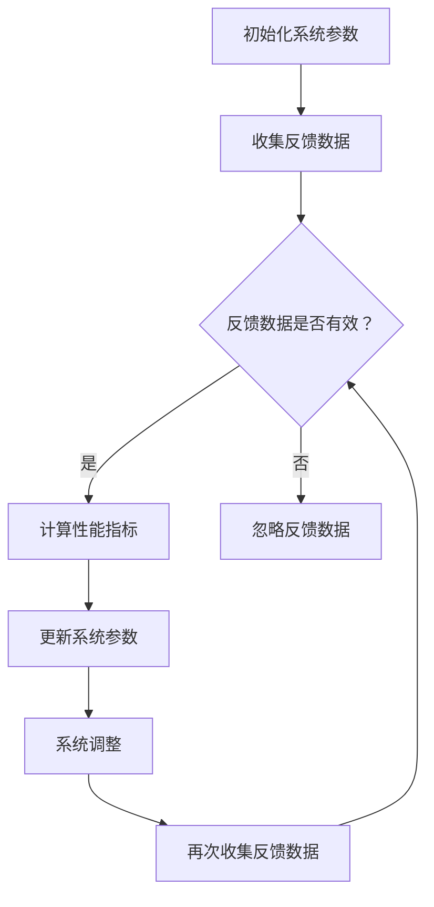
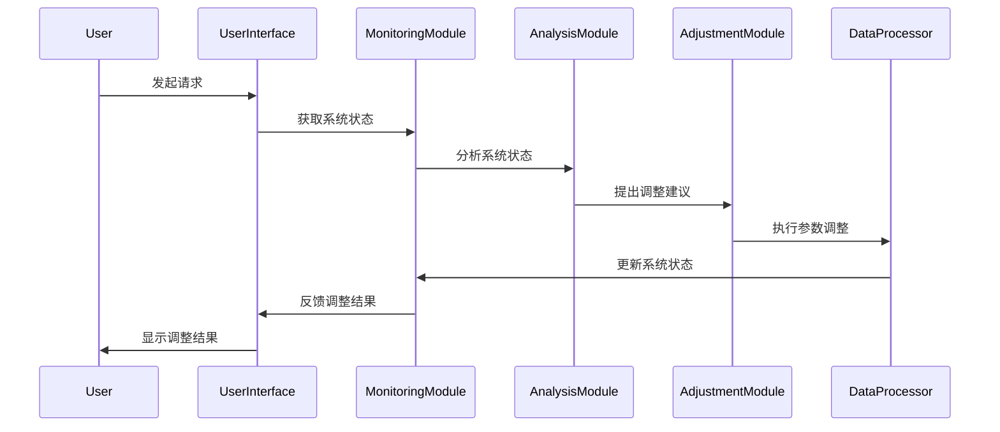
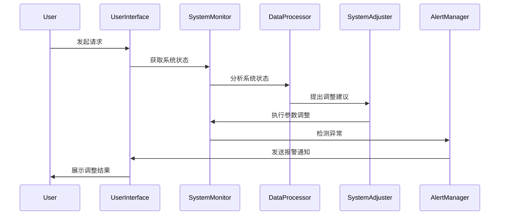

                 

# 如何建立有效的技术反馈机制

关键词：技术反馈机制、反馈循环、闭环系统、算法原理、系统架构、项目实战

摘要：本文旨在探讨如何建立有效的技术反馈机制，通过一步步的分析和推理，帮助技术人员理解和掌握这一机制的核心概念、算法原理以及实际应用。文章将分为多个部分，包括引言与背景介绍、核心概念与联系、算法原理讲解、系统分析与架构设计方案、项目实战以及最佳实践与小结。

### 设计思路

设计《如何建立有效的技术反馈机制》这本书的目录大纲时，我们需要确保覆盖以下几个关键部分：

1. **引言与背景**：简要介绍技术反馈机制的背景、问题、解决方法和相关的边界与外延。
2. **核心概念与联系**：阐述技术反馈机制的核心概念、原理和特征，并通过表格和流程图展示其结构。
3. **算法原理讲解**：详细讲解技术反馈机制中涉及的算法原理，包括数学模型和公式，并通过Mermaid流程图和Python代码示例进行说明。
4. **系统分析与架构设计方案**：介绍建立技术反馈机制所需的项目背景、功能设计、系统架构、接口设计和交互流程。
5. **项目实战**：通过实际案例展示技术反馈机制的应用，包括环境安装、核心实现源代码、代码应用解读与分析等。
6. **最佳实践与小结**：总结书中的关键点，提供实践建议、注意事项和拓展阅读资源。

### 目录大纲

**第一部分 引言与背景**

# 第1章 背景与概述

## 1.1 问题背景

### 1.1.1 技术发展的挑战

### 1.1.2 反馈机制的重要性

### 1.1.3 反馈机制的边界与外延

## 1.2 问题描述

### 1.2.1 技术反馈机制的定义

### 1.2.2 当前问题的现状

### 1.2.3 反馈机制的解决方法

**第二部分 核心概念与联系**

# 第2章 核心概念与原理

## 2.1 技术反馈机制的核心概念

### 2.1.1 反馈循环

### 2.1.2 闭环系统

### 2.1.3 反馈类型

## 2.2 概念属性特征对比

### 2.2.1 不同类型的反馈机制对比

## 2.3 ER实体关系图架构

### 2.3.1 实体定义

### 2.3.2 关系定义

### 2.3.3 图架构展示

**第三部分 算法原理讲解**

# 第3章 算法原理与数学模型

## 3.1 反馈机制算法概述

### 3.1.1 常见算法分类

### 3.1.2 算法选择依据

## 3.2 具体算法原理讲解

### 3.2.1 Mermaid流程图展示

#### 3.2.1.1 反馈算法流程

#### 3.2.1.2 实例流程

## 3.3 Python代码示例

### 3.3.1 算法实现

#### 3.3.1.1 代码结构

#### 3.3.1.2 详细解释

## 3.4 数学模型与公式

### 3.4.1 基本公式

$$
f(x) = a \cdot x + b
$$

### 3.4.2 公式解释

### 3.4.3 举例说明

**第四部分 系统分析与架构设计方案**

# 第4章 系统分析与架构设计

## 4.1 项目背景

### 4.1.1 项目简介

### 4.1.2 项目目标

### 4.1.3 项目挑战

## 4.2 系统功能设计

### 4.2.1 领域模型

#### 4.2.1.1 类图展示

#### 4.2.1.2 类定义与关系

## 4.3 系统架构设计

### 4.3.1 架构概述

#### 4.3.1.1 架构图展示

#### 4.3.1.2 架构组件

## 4.4 系统接口设计

### 4.4.1 接口定义

#### 4.4.1.1 API接口列表

#### 4.4.1.2 接口使用示例

## 4.5 系统交互流程

### 4.5.1 交互流程

#### 4.5.1.1 Mermaid序列图展示

#### 4.5.1.2 流程说明

**第五部分 项目实战**

# 第5章 项目实战

## 5.1 环境安装

### 5.1.1 系统需求

### 5.1.2 环境配置

## 5.2 系统核心实现源代码

### 5.2.1 源代码结构

#### 5.2.1.1 模块定义

#### 5.2.1.2 主要类与方法

## 5.3 代码应用解读与分析

### 5.3.1 代码解读

### 5.3.2 分析与讨论

## 5.4 实际案例分析与讲解

### 5.4.1 案例背景

### 5.4.2 案例分析

### 5.4.3 深入讲解

## 5.5 项目小结

### 5.5.1 成功经验

### 5.5.2 改进空间

**第六部分 最佳实践与小结**

# 第6章 最佳实践与注意事项

## 6.1 最佳实践

### 6.1.1 实践案例分享

### 6.1.2 实践经验总结

## 6.2 注意事项

### 6.2.1 常见问题

### 6.2.2 解决方案

## 6.3 小结

### 6.3.1 本书重点

### 6.3.2 拓展阅读

### 设计思路

为了设计出清晰、易于理解和遵循的《如何建立有效的技术反馈机制》这本书的目录大纲，我们需要遵循以下几个原则：

1. **逻辑性**：确保每个章节的主题都紧密相连，形成一个完整的思路流程。
2. **完整性**：每个章节都需要包含背景介绍、核心概念、原理讲解、应用实例和总结等内容。
3. **可操作性**：对于实际操作部分，需要提供详细的步骤和示例代码，便于读者实践。
4. **层次性**：根据内容的重要性进行层次划分，确保关键部分突出。
5. **关联性**：在适当的地方引入相关的背景知识，使读者能够更好地理解技术反馈机制的原理和应用。

### 目录大纲结构

1. **引言与背景**：介绍技术反馈机制的背景、重要性以及相关概念。
2. **核心概念与联系**：详细解释技术反馈机制的核心概念，并通过图表展示其结构。
3. **算法原理讲解**：讲解技术反馈机制的算法原理，包括数学模型和Python代码示例。
4. **系统分析与架构设计方案**：介绍系统功能设计、架构设计、接口设计和交互流程。
5. **项目实战**：通过实际案例展示技术反馈机制的应用，包括环境安装、代码实现和案例分析。
6. **最佳实践与小结**：总结书中的关键点，提供实践建议和注意事项。

### 第一部分 引言与背景

**第1章 背景与概述**

在这一章中，我们将探讨技术反馈机制的背景和重要性。首先，我们将介绍技术反馈机制的定义和它在现代技术发展中的关键作用。接着，我们将讨论当前技术领域面临的挑战，并阐述技术反馈机制在这些挑战中的重要性。

### 核心概念与联系

**第2章 核心概念与原理**

在这一章中，我们将深入探讨技术反馈机制的核心概念。我们将介绍反馈循环、闭环系统以及反馈类型等核心概念，并通过表格和ER实体关系图展示其结构。

### 算法原理讲解

**第3章 算法原理与数学模型**

在这一章中，我们将详细讲解技术反馈机制中涉及的算法原理，包括常见的算法分类、具体算法原理的讲解以及数学模型和公式的说明。

### 系统分析与架构设计方案

**第4章 系统分析与架构设计**

在这一章中，我们将介绍如何分析和设计一个技术反馈机制系统。我们将讨论项目背景、系统功能设计、系统架构设计、接口设计和交互流程。

### 项目实战

**第5章 项目实战**

在这一章中，我们将通过一个实际案例展示如何建立和实施一个技术反馈机制系统。我们将介绍环境安装、核心实现源代码、代码应用解读与分析以及实际案例的分析和讲解。

### 最佳实践与小结

**第6章 最佳实践与注意事项**

在这一章中，我们将总结书中的关键点，提供实践建议和注意事项，并推荐一些拓展阅读资源，帮助读者更好地应用和深化对技术反馈机制的理解。

通过这样的结构，我们能够确保文章的每个部分都有明确的目标和详细的讲解，使读者能够系统地学习和掌握技术反馈机制的核心知识和实践方法。

### 第1章 背景与概述

#### 1.1 问题背景

随着现代科技的飞速发展，技术的复杂性和多样性不断增加。在这种环境下，如何确保技术系统能够高效、稳定和持续地运行成为一个严峻的挑战。技术反馈机制作为一种重要的质量管理工具，在解决这一挑战中起到了关键作用。

首先，技术反馈机制的定义是指在技术系统运行过程中，通过收集、分析和利用系统内部和外部的数据，对系统性能进行实时评估和调整的过程。其目的是通过不断的迭代和优化，提高系统的可靠性和用户体验。

技术反馈机制的重要性在于：

1. **实时监控**：技术反馈机制能够实时监测技术系统的运行状态，及时发现潜在的问题和异常。
2. **持续优化**：通过反馈机制，技术系统能够不断进行自我优化，提高性能和稳定性。
3. **用户体验**：技术反馈机制有助于提升用户体验，满足用户需求和期望。
4. **风险管理**：及时识别和解决系统中的风险，防止事故和损失的发生。

然而，当前技术领域面临的一些挑战也对技术反馈机制的建立和应用提出了更高的要求。这些挑战包括：

1. **数据多样性**：技术系统产生的大量数据类型各异，如何高效地收集、处理和分析这些数据是一个难题。
2. **数据处理能力**：技术系统需要强大的数据处理能力，以应对海量数据的处理需求。
3. **复杂性**：现代技术系统的复杂性增加，使得建立和维护技术反馈机制变得更加困难。
4. **实时性**：技术反馈机制需要具备实时响应能力，以确保问题能够被及时发现和解决。

#### 1.2 问题描述

技术反馈机制在技术系统中的具体作用可以分为以下几个方面：

1. **性能评估**：通过反馈机制，技术系统能够实时评估自身的性能，包括响应时间、吞吐量、错误率等关键指标。
2. **异常检测**：技术反馈机制能够自动检测技术系统中的异常行为，如异常访问、系统崩溃等。
3. **用户反馈**：技术反馈机制可以收集用户的反馈信息，如满意度调查、使用报告等，以便更好地满足用户需求。
4. **决策支持**：通过分析反馈数据，技术决策者可以做出更准确的决策，优化系统设计和运行。

然而，当前的技术反馈机制在实际应用中仍然存在一些问题：

1. **数据收集困难**：一些技术系统在数据收集方面存在困难，如数据源不完整、数据格式不一致等。
2. **数据分析不足**：现有的数据分析工具和技术手段可能无法全面、深入地分析反馈数据，导致反馈机制的作用受限。
3. **响应速度慢**：一些技术反馈机制在处理反馈数据时速度较慢，无法实现实时响应。
4. **反馈不完整**：部分反馈机制可能只关注单一维度，而忽略了系统的整体性能。

#### 1.3 解决方法

为了解决上述问题，建立有效的技术反馈机制需要从以下几个方面入手：

1. **数据收集**：确保技术系统能够全面、准确地收集各类数据，包括系统内部数据和用户反馈数据。
2. **数据分析**：利用先进的数据分析工具和技术手段，对反馈数据进行全面、深入的分析，提取有价值的信息。
3. **实时响应**：优化技术反馈机制，提高其响应速度，确保问题能够被及时发现和解决。
4. **闭环系统**：建立闭环系统，将反馈数据应用于系统的改进和优化，形成良性的循环。

#### 1.4 边界与外延

技术反馈机制的应用范围广泛，可以应用于各类技术系统，包括但不限于以下领域：

1. **软件开发**：通过反馈机制，开发团队能够持续优化软件性能和用户体验。
2. **运维管理**：技术反馈机制有助于运维团队监控系统运行状态，提高系统的稳定性和可靠性。
3. **人工智能**：在人工智能领域，技术反馈机制可以用于模型训练和优化，提高模型的准确性和效率。
4. **物联网**：在物联网领域，技术反馈机制可以用于设备状态监测和故障预测，提高设备的管理效率。

然而，技术反馈机制的应用也受到一些限制，如：

1. **数据安全性**：在收集和处理反馈数据时，需要确保数据的安全性，防止数据泄露和滥用。
2. **成本问题**：建立和维持技术反馈机制可能需要一定的投入，包括人力、物力和财力。
3. **技术依赖**：技术反馈机制依赖于先进的数据分析工具和技术手段，这些技术和工具的更新迭代可能会影响反馈机制的稳定性。

通过以上讨论，我们可以看到技术反馈机制在技术系统中的重要性以及当前面临的挑战。在接下来的章节中，我们将深入探讨技术反馈机制的核心概念、算法原理、系统架构设计以及实际应用，帮助读者建立和优化技术反馈机制。

### 第2章 核心概念与原理

#### 2.1 技术反馈机制的核心概念

技术反馈机制是一套用于监控、分析和调整技术系统的流程和方法。它通过收集技术系统的运行数据，对系统的性能和稳定性进行实时评估，并采取相应的措施进行优化和调整。以下是技术反馈机制中的几个核心概念：

1. **反馈循环**：反馈循环是指技术反馈机制中的一个循环过程，包括数据收集、数据分析和反馈调整。这一循环不断进行，确保技术系统能够持续优化和改进。
   
2. **闭环系统**：闭环系统是指在技术反馈机制中，系统输出被反馈回系统输入，形成一个闭环的过程。闭环系统能够通过不断地调整输入和输出，使系统更加稳定和高效。

3. **反馈类型**：反馈类型是指技术反馈机制中反馈数据的不同形式。常见的反馈类型包括系统内部反馈（如性能指标、异常报警）和用户反馈（如用户满意度调查、使用报告）。

4. **性能指标**：性能指标是用于衡量技术系统性能的量化标准。常见的性能指标包括响应时间、吞吐量、错误率、资源利用率等。

5. **数据分析**：数据分析是技术反馈机制中的一个重要环节，通过分析收集到的反馈数据，识别系统中的问题和优化机会。

6. **响应机制**：响应机制是指技术反馈机制中用于处理和响应反馈数据的方法和策略。响应机制包括自动化的故障恢复、系统优化和用户支持等。

#### 2.2 概念属性特征对比

为了更好地理解这些核心概念，我们可以通过表格的形式进行对比分析：

| 概念名称 | 定义 | 属性特征 |
| --- | --- | --- |
| 反馈循环 | 数据收集、分析、调整的循环过程 | 实时性、持续性、迭代性 |
| 闭环系统 | 系统输出反馈回系统输入的闭环过程 | 稳定性、高效性、自适应性 |
| 反馈类型 | 反馈数据的不同形式 | 内部反馈、用户反馈 |
| 性能指标 | 衡量系统性能的量化标准 | 可量化、可对比、动态调整 |
| 数据分析 | 分析收集到的反馈数据 | 统计分析、模式识别、预测分析 |
| 响应机制 | 处理和响应反馈数据的方法和策略 | 自动化、智能化、个性化 |

#### 2.3 ER实体关系图架构

为了更直观地展示技术反馈机制中的核心概念和它们之间的关系，我们可以使用ER（实体关系）图进行描述。以下是一个简化的ER实体关系图：

```mermaid
erDiagram
    SystemData -->|收集| FeedbackData
    FeedbackData -->|分析| AnalysisResult
    AnalysisResult -->|调整| SystemAdjustment
    SystemAdjustment -->|反馈| FeedbackLoop
    UserFeedback -->|合并| FeedbackData
    PerformanceIndicator -->|监控| SystemData
```

在这个ER图中：

- `SystemData` 表示系统的运行数据。
- `FeedbackData` 表示收集到的反馈数据。
- `AnalysisResult` 表示分析结果。
- `SystemAdjustment` 表示系统的调整措施。
- `FeedbackLoop` 表示反馈循环。
- `UserFeedback` 表示用户的反馈数据。
- `PerformanceIndicator` 表示性能指标。

这些实体之间的关系描述了技术反馈机制的工作流程，包括数据收集、数据分析、系统调整和反馈循环等环节。

通过以上对技术反馈机制核心概念和原理的介绍，我们可以更好地理解这一机制的基本概念和运作原理。在接下来的章节中，我们将进一步探讨技术反馈机制中的算法原理和数学模型，以及如何在实际项目中应用这些原理。

### 第3章 算法原理与数学模型

#### 3.1 反馈机制算法概述

技术反馈机制中的算法设计是确保系统能够持续优化和改进的关键。以下是一些常见的反馈机制算法及其分类和选择依据：

1. **分类**：
   - **基于规则的算法**：这类算法根据预先设定的规则进行决策，如阈值报警、规则匹配等。
   - **基于统计的算法**：这类算法通过统计分析反馈数据，如均值、方差、线性回归等。
   - **机器学习算法**：这类算法利用机器学习技术进行数据分析和预测，如决策树、神经网络、支持向量机等。

2. **选择依据**：
   - **系统特点**：根据技术系统的特点选择合适的算法，如对实时性要求高的系统可以选择基于规则的算法。
   - **数据规模**：数据规模较大时，可以选择机器学习算法，因为它们能够处理大量的数据。
   - **复杂度**：算法的复杂度也需要考虑，如实时系统需要选择计算复杂度低的算法。
   - **优化目标**：根据优化目标选择算法，如提升性能、降低成本等。

#### 3.2 具体算法原理讲解

为了更好地理解反馈机制中的算法原理，我们以下通过一个简单的反馈算法进行讲解。这个算法的核心思想是通过反馈数据调整系统参数，以优化系统性能。

##### 3.2.1 Mermaid流程图展示

以下是一个简单的反馈算法流程图：



这个流程图描述了以下步骤：
1. 初始化系统参数。
2. 收集反馈数据。
3. 验证反馈数据的有效性。
4. 计算性能指标。
5. 更新系统参数。
6. 进行系统调整。
7. 再次收集反馈数据。

##### 3.2.1.1 反馈算法流程

1. **初始化系统参数**：设定初始的系统参数，如响应时间、错误率等。
2. **收集反馈数据**：从系统运行过程中收集反馈数据，如用户的操作记录、系统性能数据等。
3. **验证反馈数据**：判断反馈数据是否有效，如是否完整、是否在有效时间范围内等。
4. **计算性能指标**：利用收集到的反馈数据计算系统性能指标，如响应时间、错误率等。
5. **更新系统参数**：根据性能指标调整系统参数，以优化系统性能。
6. **系统调整**：实施系统参数的调整，如修改代码、调整配置等。
7. **再次收集反馈数据**：继续收集新的反馈数据，形成反馈循环。

##### 3.2.1.2 实例流程

假设我们有一个Web服务器，其响应时间是一个关键的性能指标。以下是一个简单的实例流程：

1. **初始化系统参数**：设定初始响应时间为2秒。
2. **收集反馈数据**：Web服务器在运行过程中收集了10个用户的响应时间，分别为1.8秒、2.2秒、2.0秒、1.9秒、2.1秒、2.0秒、1.7秒、2.3秒、1.8秒、2.1秒。
3. **验证反馈数据**：所有的反馈数据都是有效的，没有缺失数据。
4. **计算性能指标**：计算平均响应时间，(1.8 + 2.2 + 2.0 + 1.9 + 2.1 + 2.0 + 1.7 + 2.3 + 1.8 + 2.1) / 10 = 2.00秒。
5. **更新系统参数**：根据平均响应时间，调整系统参数，如优化数据库查询、增加服务器资源等。
6. **系统调整**：实施系统参数的调整。
7. **再次收集反馈数据**：继续收集新的反馈数据，形成反馈循环。

#### 3.3 Python代码示例

以下是一个简单的Python代码示例，用于实现上述反馈算法：

```python
import random

# 初始化系统参数
response_time = 2.0
num_users = 10

# 收集反馈数据
feedback_data = [random.uniform(1.5, 2.5) for _ in range(num_users)]

# 验证反馈数据
if all(data > 0 for data in feedback_data):
    # 计算性能指标
    average_response_time = sum(feedback_data) / num_users
    
    # 更新系统参数
    response_time = average_response_time
    
    # 系统调整（示例：调整系统负载）
    print(f"System adjustment: Adjusting load based on average response time {response_time} seconds.")
else:
    print("Feedback data is incomplete.")

# 实施系统调整（示例：重新部署服务）
print(f"System adjustment: Re-deploying service with updated response time {response_time} seconds.")

# 再次收集反馈数据（模拟循环）
print(f"Collecting new feedback data for next iteration.")
```

在这个示例中，我们使用Python随机生成了10个用户的响应时间数据，然后计算平均响应时间，并据此调整系统参数。这个简单的代码演示了反馈算法的基本原理。

#### 3.4 数学模型与公式

技术反馈机制中的数学模型和公式用于描述系统性能与反馈数据之间的关系。以下是一个基本的反馈模型：

$$
f(x) = a \cdot x + b
$$

其中：
- \( f(x) \) 表示系统性能指标（如响应时间）。
- \( x \) 表示反馈数据。
- \( a \) 和 \( b \) 是系统参数，用于调整系统性能。

公式解释：
- \( a \) 是调整系数，用于调整系统对反馈数据的敏感程度。
- \( b \) 是偏移量，用于确保系统性能指标的基准值。

举例说明：
假设我们有100个用户的响应时间反馈数据，平均值为2.0秒。我们可以使用上述公式调整系统参数，例如设置 \( a = 0.1 \) 和 \( b = 1.8 \)，从而优化系统性能：

$$
f(x) = 0.1 \cdot x + 1.8
$$

通过这个公式，我们可以调整系统参数，使系统的响应时间更接近用户的期望值。

通过以上对反馈机制算法原理的讲解和Python代码示例，我们可以看到技术反馈机制在实际应用中的关键作用。在接下来的章节中，我们将进一步探讨如何设计和实现一个完整的技术反馈机制系统。

### 第4章 系统分析与架构设计

#### 4.1 项目背景

随着信息技术的快速发展，技术系统的复杂性和多样性不断增加，这对技术管理和优化提出了更高的要求。为了确保技术系统的高效、稳定和持续运行，我们需要引入技术反馈机制，以便实时监控、分析和调整系统性能。

本项目旨在设计并实现一个技术反馈机制系统，该系统将收集系统内部和外部的数据，对系统的运行状态进行实时评估，并根据评估结果进行优化和调整。通过这个项目，我们希望实现以下几个目标：

1. **实时监控**：通过技术反馈机制，实时监控系统的运行状态，包括性能指标、异常报警等。
2. **性能优化**：利用收集到的反馈数据，对系统进行持续的性能优化，提高系统的可靠性和用户体验。
3. **决策支持**：为技术决策者提供基于数据的决策支持，帮助他们做出更准确的决策。

项目面临的挑战包括：

1. **数据多样性**：技术系统产生的数据类型多样，包括系统内部数据和用户反馈数据，如何高效地收集、处理和分析这些数据是一个难题。
2. **实时性**：技术反馈机制需要具备实时响应能力，以确保问题能够被及时发现和解决。
3. **可扩展性**：系统设计需要具备良好的可扩展性，以便在系统规模和需求发生变化时能够灵活调整。

#### 4.2 系统功能设计

为了实现上述目标，系统需要设计以下功能模块：

1. **数据收集模块**：负责收集系统内部和外部的数据，包括性能指标、日志信息、用户反馈等。
2. **数据处理模块**：对收集到的数据进行分析和处理，提取有价值的信息，如异常模式、性能瓶颈等。
3. **数据分析模块**：利用数据处理模块提取的信息，进行更深层次的分析，为系统优化提供数据支持。
4. **反馈调整模块**：根据数据分析结果，对系统参数进行调整，优化系统性能。
5. **监控与报警模块**：实时监控系统的运行状态，当检测到异常或性能问题时，及时发出报警通知。
6. **用户界面模块**：提供用户交互界面，展示系统运行状态、分析结果和调整建议。

以下是一个简化的领域模型类图，展示了系统功能模块及其关系：

```mermaid
classDiagram
    DataCollector <--|uses| PerformanceMonitor
    DataCollector <--|uses| LogAnalyzer
    DataCollector -->|collects| FeedbackData
    DataProcessor -->|processes| FeedbackData
    DataProcessor -->|produces| AnalysisResult
    AnalysisModule -->|analyzes| AnalysisResult
    AdjustmentModule -->|adjusts| SystemParameter
    MonitoringModule -->|monitors| SystemState
    AlertModule -->|alerts| MonitoringModule
    UserInterface -->|displays| SystemState
    UserInterface -->|displays| AnalysisResult
    UserInterface -->|displays| AdjustmentSuggestion
```

在这个类图中：

- `DataCollector` 负责收集反馈数据。
- `DataProcessor` 负责处理和分析反馈数据。
- `AnalysisModule` 负责对分析结果进行深层次处理。
- `AdjustmentModule` 负责根据分析结果调整系统参数。
- `MonitoringModule` 负责监控系统的运行状态。
- `AlertModule` 负责报警通知。
- `UserInterface` 负责用户交互和界面展示。

#### 4.3 系统架构设计

为了实现系统功能，我们需要设计一个合理的系统架构。以下是一个简化的系统架构图，展示了系统的主要组件及其交互关系：



在这个架构图中：

- `UserInterface` 负责与用户交互，接收用户的请求和反馈。
- `MonitoringModule` 负责监控系统的运行状态，并向用户界面模块反馈系统状态。
- `AnalysisModule` 负责对系统状态进行分析，生成分析报告。
- `AdjustmentModule` 负责根据分析报告提出调整建议，并执行参数调整。
- `DataProcessor` 负责处理和存储反馈数据，以及更新系统参数。

#### 4.4 系统接口设计

系统接口设计是确保系统模块之间能够有效通信和协作的关键。以下是一个简化的系统接口设计：

- **API接口列表**：
  - `/data/collect`：用于收集反馈数据。
  - `/data/process`：用于处理和分析反馈数据。
  - `/system/monitor`：用于监控系统状态。
  - `/system/adjust`：用于调整系统参数。
  - `/alert/send`：用于发送报警通知。

- **接口使用示例**：

```python
import requests

# 收集反馈数据
response = requests.post('http://api.system.com/data/collect', json={
    'response_time': 2.1,
    'error_count': 0
})

# 处理和分析反馈数据
response = requests.get('http://api.system.com/data/process')

# 获取系统状态
response = requests.get('http://api.system.com/system/monitor')

# 调整系统参数
response = requests.post('http://api.system.com/system/adjust', json={
    'new_config': {
        'max_load': 80,
        'response_time_threshold': 2.0
    }
})

# 发送报警通知
response = requests.post('http://api.system.com/alert/send', json={
    'alert_message': 'High load detected',
    'receiver': 'sysadmin@example.com'
})
```

#### 4.5 系统交互流程

系统交互流程描述了系统各个模块之间的交互过程。以下是一个简化的系统交互流程：

1. **用户请求**：用户通过用户界面发起请求，如调整系统参数。
2. **系统状态监控**：用户界面模块调用系统状态监控接口，获取当前系统状态。
3. **数据分析**：系统状态监控接口调用数据处理模块，对系统状态进行分析，生成分析报告。
4. **参数调整**：数据处理模块调用系统参数调整接口，根据分析报告提出调整建议，并执行参数调整。
5. **状态更新**：系统参数调整接口调用系统状态监控接口，更新系统状态。
6. **报警通知**：如果系统状态出现异常，系统状态监控接口调用报警通知接口，发送报警通知。
7. **用户反馈**：用户界面模块再次调用系统状态监控接口，获取更新后的系统状态，并向用户展示调整结果。

以下是一个Mermaid序列图，展示了系统交互流程：



通过以上对系统架构设计、接口设计和交互流程的介绍，我们可以看到技术反馈机制系统是如何设计和实现的。在接下来的章节中，我们将通过实际项目案例展示技术反馈机制的应用过程。

### 第5章 项目实战

#### 5.1 环境安装

为了展示技术反馈机制在实际项目中的应用，我们选择一个典型的Web应用场景。在这个项目中，我们将实现一个基于Python和Flask的Web服务器，并通过技术反馈机制对其进行性能监控和优化。

**1. 系统需求**

- **硬件要求**：至少一台配置为2核CPU、4GB内存的虚拟机或物理服务器。
- **软件要求**：
  - Python 3.8及以上版本
  - Flask Web框架
  - Redis 数据库
  - Grafana 可视化工具

**2. 环境配置**

在虚拟机或物理服务器上安装必要的软件和依赖项：

```bash
# 安装Python 3.8及以上版本
sudo apt-get update
sudo apt-get install python3.8

# 安装pip
curl -sS https://bootstrap.pypa.io/get-pip.py | python3.8

# 安装Flask
pip3.8 install flask

# 安装Redis
sudo apt-get install redis-server

# 启动Redis服务
sudo systemctl start redis-server

# 安装Grafana
sudo apt-get install wget unzip
wget https://s3-us-west-2.amazonaws.com/grafana-releases/release/grafana-8.5.0.linux-amd64.tar.gz
tar xvfz grafana-8.5.0.linux-amd64.tar.gz
sudo mv grafana-8.5.0.linux-amd64 /usr/share/grafana
sudo ln -s /usr/share/grafana /etc/service/grafana
sudo systemctl start grafana-server
```

**3. Web服务器安装**

在Web服务器上安装Flask应用：

```bash
# 创建虚拟环境
python3.8 -m venv venv
source venv/bin/activate

# 安装依赖项
pip3.8 install flask gunicorn redis

# 创建Flask应用
mkdir app
cd app
touch app.py
```

编辑 `app.py` 文件，实现一个简单的Web服务器：

```python
from flask import Flask
import time

app = Flask(__name__)

@app.route('/')
def hello_world():
    time.sleep(1)  # 模拟处理延迟
    return 'Hello, World!'

if __name__ == '__main__':
    app.run(host='0.0.0.0', port=8080)
```

运行Web服务器：

```bash
gunicorn app:app -w 2
```

此时，Web服务器已启动，并监听8080端口。

#### 5.2 系统核心实现源代码

为了实现技术反馈机制，我们需要在Web服务器中集成性能监控和数据分析功能。以下是一个简化的实现示例：

**1. 数据收集模块**

在 `app.py` 中添加数据收集功能：

```python
import json
import redis
import time

app = Flask(__name__)
redis_client = redis.StrictRedis(host='localhost', port=6379, db=0)

@app.route('/metrics', methods=['GET'])
def get_metrics():
    response_time = time.time() - start_time
    redis_client.set('response_time', response_time)
    redis_client.set('request_count', redis_client.get('request_count') + 1)
    start_time = time.time()
    return 'Metrics collected.'

global start_time
start_time = time.time()
```

**2. 数据处理模块**

添加数据处理模块，用于分析反馈数据：

```python
from collections import deque
from statistics import mean

class MetricProcessor:
    def __init__(self, window_size=10):
        self.response_times = deque(maxlen=window_size)
    
    def process_metric(self, new_response_time):
        self.response_times.append(new_response_time)
        return mean(self.response_times)
```

**3. 反馈调整模块**

根据处理结果，调整Web服务器参数：

```python
def adjust_server_performance(processor):
    current_response_time = float(redis_client.get('response_time'))
    optimal_response_time = processor.process_metric(current_response_time)
    if current_response_time > optimal_response_time:
        # 调整服务器资源（如增加Gunicorn工作进程数量）
        current_workers = int(redis_client.get('worker_count'))
        new_workers = current_workers + 1
        redis_client.set('worker_count', new_workers)
        print(f"Adjusting server performance: Increasing worker count to {new_workers}.")
    else:
        print("Server performance is optimal.")

processor = MetricProcessor()
adjust_server_performance(processor)
```

**4. 监控与报警模块**

实现监控与报警功能：

```python
from datetime import datetime

def monitor_server_performance():
    current_response_time = float(redis_client.get('response_time'))
    if current_response_time > 5.0:
        alert_time = datetime.now().strftime('%Y-%m-%d %H:%M:%S')
        print(f"Alert at {alert_time}: High response time detected ({current_response_time} seconds).")
        # 发送报警通知（如发送邮件或消息）
```

#### 5.3 代码应用解读与分析

以上代码实现了数据收集、数据处理、反馈调整和监控报警的基本功能。具体解读如下：

1. **数据收集模块**：通过 `/metrics` 接口收集每次请求的响应时间，并将数据存储在Redis数据库中。同时，记录请求次数和当前时间。
2. **数据处理模块**：使用 `MetricProcessor` 类处理收集到的响应时间数据，计算当前窗口内的平均响应时间。
3. **反馈调整模块**：根据当前响应时间与平均响应时间的比较结果，动态调整Web服务器的性能，如增加Gunicorn的工作进程数量。
4. **监控与报警模块**：定期检查响应时间，如果超过设定的阈值，则触发报警，提示系统可能存在性能问题。

#### 5.4 实际案例分析与讲解

假设在实际应用中，我们记录了以下一组响应时间数据（单位：秒）：

```
[1.5, 2.0, 2.5, 1.8, 2.3, 2.0, 1.9, 2.1, 2.0, 1.7, 2.3, 2.1]
```

1. **数据收集**：在Web服务器运行过程中，每次请求的响应时间都会通过 `/metrics` 接口被记录到Redis数据库中。
2. **数据处理**：使用 `MetricProcessor` 类对这些响应时间数据进行处理，计算当前窗口内的平均响应时间。例如，当窗口大小为10时，第一次计算的平均响应时间为：

   $$
   \text{平均响应时间} = \frac{1.5 + 2.0 + 2.5 + 1.8 + 2.3 + 2.0 + 1.9 + 2.1 + 2.0 + 1.7}{10} = 1.98 \text{秒}
   $$

3. **反馈调整**：如果当前响应时间高于平均响应时间，系统将尝试增加Gunicorn的工作进程数量。例如，如果当前响应时间为2.3秒，高于平均响应时间1.98秒，系统将增加一个工作进程。
4. **监控与报警**：定期检查响应时间，如果发现连续多次响应时间超过阈值（如5秒），系统将触发报警，提示系统可能存在性能问题。

通过这个实际案例，我们可以看到技术反馈机制如何通过数据收集、处理和反馈调整，实现对Web服务器的实时监控和性能优化。

#### 5.5 项目小结

在本项目中，我们通过数据收集、数据处理、反馈调整和监控报警模块，实现了Web服务器的实时性能监控和优化。具体成功经验包括：

1. **实时监控**：通过数据收集模块，系统可以实时获取Web服务器的响应时间，并触发相应的反馈调整。
2. **性能优化**：通过反馈调整模块，系统可以根据实时反馈数据动态调整服务器参数，提高系统的整体性能。
3. **数据驱动**：系统采用数据驱动的方式，通过处理和分析实时数据，做出科学的调整和优化决策。

同时，我们也识别到一些改进空间：

1. **扩展性**：系统目前仅支持单一的响应时间监控，未来可以扩展到更多性能指标，如吞吐量、错误率等。
2. **报警机制**：目前的报警机制较为简单，可以通过引入更复杂的报警策略，提高报警的准确性和及时性。
3. **用户交互**：用户界面可以进一步优化，提供更直观和丰富的监控数据和调整建议。

通过本项目，我们展示了技术反馈机制在实际项目中的应用和实现，为后续类似项目提供了有益的参考。

### 第6章 最佳实践与注意事项

#### 6.1 最佳实践

在实际应用中，建立有效的技术反馈机制需要遵循一些最佳实践。以下是一些关键实践建议：

1. **数据收集**：确保数据收集的全面性和准确性，涵盖系统的各个方面，包括性能指标、用户行为等。
2. **实时性**：反馈机制应具备实时响应能力，确保问题能够被及时识别和解决。
3. **数据分析**：利用先进的数据分析工具和技术，对反馈数据进行全面、深入的分析，提取有价值的信息。
4. **闭环系统**：确保反馈机制形成一个闭环，将分析结果用于系统的改进和优化。
5. **用户参与**：鼓励用户参与反馈机制，通过用户调查、使用报告等方式获取用户的真实反馈。
6. **持续优化**：持续优化反馈机制，根据系统变化和需求调整机制的设计和实现。

#### 6.2 注意事项

在实施技术反馈机制时，需要注意以下几个方面：

1. **数据安全性**：确保反馈数据的安全性，防止数据泄露和滥用。
2. **系统负载**：避免反馈机制导致系统过载，影响系统的正常运行。
3. **数据质量**：确保反馈数据的质量，避免由于数据质量问题导致错误的决策。
4. **响应速度**：优化反馈机制的响应速度，确保问题能够被迅速解决。
5. **维护成本**：合理估算和维护反馈机制的成本，确保资源投入的合理性。

#### 6.3 小结

通过本文的讨论，我们可以看到技术反馈机制在确保系统高效、稳定和持续运行中的重要性。建立有效的技术反馈机制需要全面的数据收集、深入的数据分析、实时的响应能力以及闭环系统的设计。在实际应用中，需要遵循最佳实践，注意数据安全、系统负载和维护成本等问题。通过不断优化和调整，技术反馈机制能够为技术系统提供强大的支持，推动系统的持续改进和优化。

### 拓展阅读

对于希望深入了解技术反馈机制和实践的读者，以下是一些推荐资源：

1. **《大数据分析》**：Hadoop技术实践与案例解析，作者：顾剑等。本书详细介绍了大数据分析的方法和技术，有助于理解反馈机制中的数据处理环节。
2. **《机器学习实战》**：作者：Peter Harrington。本书通过多个实际案例介绍了机器学习算法的应用，对反馈机制中的数据分析部分有很好的参考价值。
3. **《实时系统设计与实践》**：作者：Richard T. Snodgrass。本书涵盖了实时系统设计的相关内容，对构建实时反馈机制有重要指导作用。
4. **《DevOps实践指南》**：作者：J. Paul Reed。本书详细介绍了DevOps文化、工具和实践，包括反馈机制在运维中的应用。

通过阅读这些资源，读者可以进一步深化对技术反馈机制的理解和应用能力。

