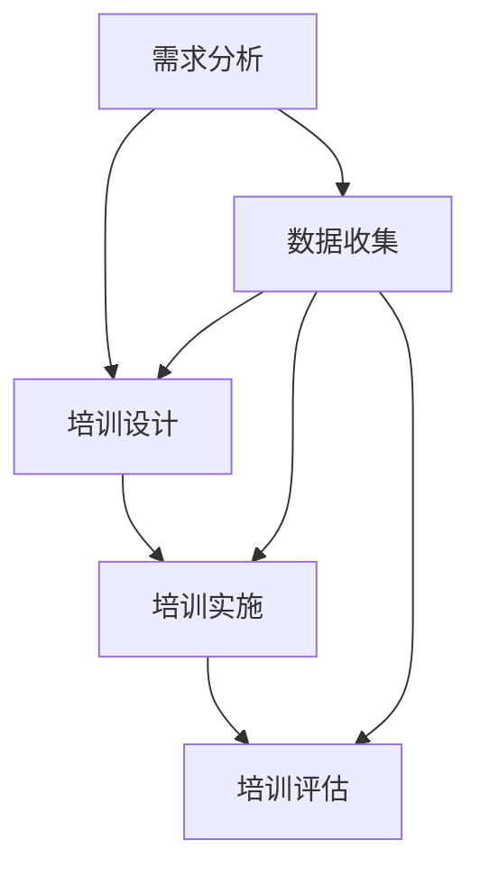
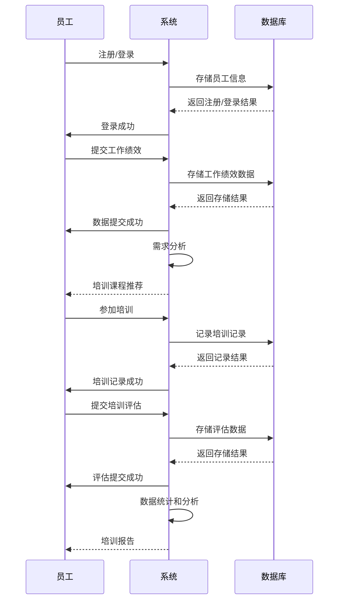
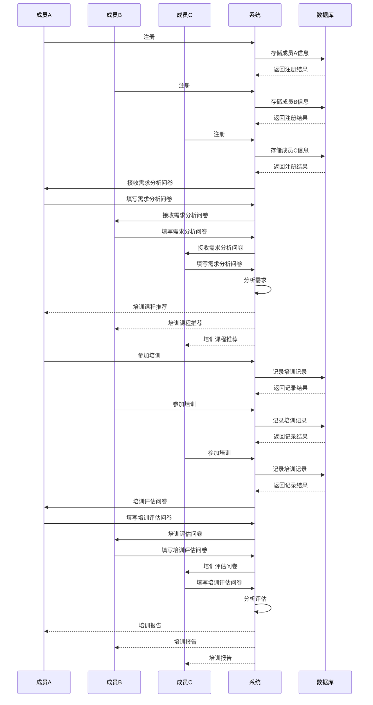

                 


### 文章标题：如何建立有效的技术培训体系

### 关键词：技术培训体系、培训需求分析、培训设计、培训实施、培训评估、算法原理、数学模型、系统架构设计、项目实战

### 摘要：

随着信息技术的快速发展，企业需要不断进行技术培训来提高员工的专业技能和创新能力。本文将深入探讨如何建立有效的技术培训体系，包括培训需求分析、培训设计、培训实施、培训评估等核心环节。通过实际项目和案例分析，提供实用的建议和方法，帮助企业提升培训效果，实现人才发展与业务增长的良性循环。

----------------------------------------------------------------

### 目录大纲

----------------------------------------------------------------

# 《如何建立有效的技术培训体系》目录大纲

## 第一部分：背景与核心概念

### 第1章：技术培训的重要性与挑战
- **1.1.1 技术培训的背景**
- **1.1.2 技术培训面临的挑战**
- **1.1.3 建立有效技术培训体系的必要性**

### 第2章：技术培训体系核心概念与联系
- **2.1.1 培训需求分析**
- **2.1.2 培训设计**
- **2.1.3 培训实施**
- **2.1.4 培训评估**
- **2.1.5 概念联系与影响**

### 第3章：培训需求分析算法原理
- **3.1.1 聚类算法概述**
- **3.1.2 聚类算法的数学模型**
- **3.1.3 聚类算法的Python实现与示例**

### 第4章：数学模型和公式讲解
- **4.1.1 技术培训需求的评估模型**
- **4.1.2 数学公式详细讲解**
- **4.1.3 示例解析**

## 第二部分：系统分析与架构设计

### 第5章：技术培训体系架构设计
- **5.1.1 设计原则**
- **5.1.2 系统架构图**
- **5.1.3 领域模型类图**

### 第6章：系统接口设计与交互
- **6.1.1 接口设计**
- **6.1.2 系统交互流程**

## 第三部分：项目实战

### 第7章：实战项目介绍
- **7.1.1 项目背景**
- **7.1.2 环境安装**
- **7.1.3 系统核心实现**

### 第8章：项目案例分析
- **8.1.1 案例背景**
- **8.1.2 案例分析**
- **8.1.3 代码应用解读与分析**

## 第四部分：最佳实践与总结

### 第9章：最佳实践 tips
- **9.1.1 常见问题与解决方案**
- **9.1.2 实践技巧**

### 第10章：小结与展望
- **10.1.1 全书要点总结**
- **10.1.2 注意事项**
- **10.1.3 拓展阅读**

----------------------------------------------------------------

### 第一部分：背景与核心概念

#### 第1章：技术培训的重要性与挑战

##### 1.1.1 技术培训的背景

在当今全球化的信息时代，技术的快速发展已经成为不可逆转的趋势。企业要在这个快速变化的环境中保持竞争力，必须不断提升员工的技术能力和创新能力。技术培训作为提升员工技能的重要手段，其重要性日益凸显。

技术培训的背景可以从以下几个方面来理解：

1. **技术更新速度加快**：随着云计算、大数据、人工智能等新兴技术的迅速发展，技术知识更新速度越来越快。传统的培训方式难以跟上这种快速变化，导致培训内容与实际需求脱节。

2. **企业竞争加剧**：企业竞争的核心在于人才的竞争。拥有高水平的技术人才是企业保持竞争优势的关键。技术培训是培养高素质技术人才的重要途径。

3. **员工职业发展需求**：随着职业生涯的发展，员工需要不断学习新的技术和知识，以适应不断变化的工作需求。技术培训是满足员工职业发展需求的有效手段。

##### 1.1.2 技术培训面临的挑战

尽管技术培训的重要性不容忽视，但企业在实施过程中仍然面临诸多挑战：

1. **培训内容与实际需求脱节**：由于技术更新速度加快，培训内容往往难以及时更新，导致培训与实际需求不符。

2. **个性化培训难以实现**：每个员工的培训需求不同，如何提供个性化的培训服务成为一大挑战。

3. **培训资源有限**：企业的培训资源（如培训时间、培训经费等）通常有限，如何高效利用这些资源成为关键问题。

4. **培训效果评估困难**：如何评估培训效果，确定培训投入的回报率，是企业在实施技术培训时面临的重要挑战。

##### 1.1.3 建立有效技术培训体系的必要性

为了解决上述挑战，企业需要建立有效的技术培训体系。一个有效的技术培训体系应具备以下特点：

1. **系统性**：从培训需求分析、培训设计、培训实施到培训评估，形成一个完整的培训流程，确保各个环节相互衔接，形成一个有机整体。

2. **个性化**：根据员工的实际需求，提供个性化的培训服务，确保每位员工都能在培训中获得实际收益。

3. **高效性**：充分利用企业的培训资源，提高培训的效率和效果，实现培训投入的最大化回报。

4. **可持续性**：技术培训体系应具备可持续性，能够随着技术发展和企业需求的变化不断调整和优化。

建立有效的技术培训体系，不仅有助于提高员工的技术能力和创新能力，还能推动企业的长期发展。接下来，我们将详细探讨技术培训体系的核心概念和各环节的设计与实施。

----------------------------------------------------------------

### 第二部分：技术培训体系核心概念与联系

#### 第2章：技术培训体系核心概念与联系

##### 2.1.1 培训需求分析

培训需求分析是技术培训体系的第一步，也是至关重要的一步。它旨在确定员工的实际培训需求，为后续的培训设计提供依据。

培训需求分析的核心任务包括：

1. **确定培训目标**：明确培训的具体目标，如提升员工的技能水平、提高工作效率等。

2. **识别员工需求**：通过调查、访谈等方式，了解员工的实际需求，包括知识、技能、经验等方面。

3. **分析企业需求**：结合企业的战略目标和发展需求，确定培训内容的方向。

4. **评估现有资源**：分析现有的培训资源和条件，为培训设计提供资源支持。

##### 2.1.2 培训设计

培训设计是根据培训需求分析的结果，设计具体的培训方案。培训设计主要包括以下内容：

1. **确定培训内容**：根据培训需求，设计培训课程和教材，确保培训内容与实际需求相符。

2. **选择培训方式**：根据培训内容和企业实际情况，选择合适的培训方式，如内部培训、外部培训、在线培训等。

3. **制定培训计划**：明确培训的时间、地点、参与人员等信息，确保培训的顺利进行。

4. **设计培训评估机制**：建立培训评估体系，对培训效果进行评估，为后续培训提供改进方向。

##### 2.1.3 培训实施

培训实施是将培训设计转化为实际操作的过程。培训实施的关键环节包括：

1. **组织培训**：根据培训计划，组织培训活动，确保培训内容、培训方式和培训计划的落实。

2. **跟踪学习进度**：对参训员工的学习进度进行跟踪，确保培训目标的实现。

3. **提供技术支持**：在培训过程中，提供必要的技术支持，如培训器材、在线学习平台等。

4. **反馈与调整**：根据培训反馈，及时调整培训内容和方式，提高培训效果。

##### 2.1.4 培训评估

培训评估是对培训效果进行评价和反馈的过程。培训评估的核心任务包括：

1. **评估培训效果**：通过考试、考核等方式，评估参训员工的学习成果。

2. **收集培训反馈**：收集参训员工的反馈意见，了解培训的优缺点，为后续培训提供改进方向。

3. **分析评估数据**：对评估数据进行分析，确定培训的投入回报率，为企业的培训决策提供依据。

##### 2.1.5 概念联系与影响

培训需求分析、培训设计、培训实施和培训评估是技术培训体系的四个核心环节，它们之间紧密相连，相互影响。

1. **培训需求分析**是培训体系的基础，决定了后续培训的方向和内容。

2. **培训设计**是根据需求分析的结果，设计具体的培训方案，为培训实施提供依据。

3. **培训实施**是将培训设计转化为实际操作，确保培训目标的实现。

4. **培训评估**是对培训效果进行评价和反馈，为后续培训提供改进方向。

一个有效的技术培训体系，需要各个环节之间的紧密协作和相互支持，才能实现最佳的培训效果。接下来，我们将详细探讨培训需求分析的算法原理，帮助读者更好地理解这一核心环节。

----------------------------------------------------------------

### 第二部分：培训需求分析算法原理

#### 第3章：培训需求分析算法原理

##### 3.1.1 聚类算法概述

聚类算法是一种无监督学习方法，主要用于将数据集分成多个类别，使同一类别内的数据点尽可能相似，而不同类别之间的数据点尽可能不同。在培训需求分析中，聚类算法可以帮助我们识别出不同群体的培训需求，为后续的培训设计提供依据。

常见的聚类算法包括：

1. **K-Means算法**：K-Means算法是一种基于距离度量的聚类算法，通过迭代计算聚类中心，将数据点划分到不同的类别中。

2. **层次聚类算法**：层次聚类算法通过构建一个层次结构来对数据进行分类，包括自底向上的凝聚层次聚类和自顶向下的分裂层次聚类。

3. **基于密度的聚类算法**：基于密度的聚类算法通过寻找高密度区域来形成聚类，如DBSCAN算法。

##### 3.1.2 聚类算法的数学模型

聚类算法的数学模型主要涉及以下几个方面：

1. **数据点表示**：通常使用多维向量空间中的数据点来表示数据集，每个数据点对应一个特征向量。

2. **相似性度量**：相似性度量用于计算数据点之间的相似度，常见的相似性度量方法包括欧几里得距离、曼哈顿距离、余弦相似度等。

3. **聚类中心**：聚类中心用于代表每个类别，如K-Means算法中的聚类中心就是每个类别的平均值。

4. **聚类准则**：聚类准则用于评估聚类结果的好坏，常见的聚类准则包括最小化误差平方和、最大化内部边界等。

##### 3.1.3 聚类算法的Python实现与示例

下面是一个简单的K-Means聚类算法的Python实现示例：

```python
import numpy as np
from sklearn.cluster import KMeans

# 示例数据
data = np.array([[1, 2], [1, 4], [1, 0],
                 [10, 2], [10, 4], [10, 0]])

# 使用K-Means算法进行聚类
kmeans = KMeans(n_clusters=2, random_state=0).fit(data)

# 输出聚类结果
print(kmeans.labels_)

# 输出聚类中心
print(kmeans.cluster_centers_)
```

在这个示例中，我们首先导入所需的库，然后创建一个简单的数据集。接着，使用K-Means算法对数据集进行聚类，并输出聚类结果和聚类中心。

聚类算法在培训需求分析中的应用：

1. **识别培训群体**：通过聚类算法，我们可以将员工划分为不同的群体，每个群体具有相似的培训需求。例如，我们可以将员工按照技能水平、工作经验等因素进行聚类，识别出需要不同培训内容的群体。

2. **优化培训资源分配**：根据聚类结果，我们可以将培训资源（如培训课程、培训讲师等）优先分配给需求较高的群体，提高培训资源的利用效率。

3. **定制化培训方案**：根据聚类结果，我们可以为不同群体设计定制化的培训方案，确保培训内容与员工需求高度匹配。

通过聚类算法的应用，我们可以更精准地识别员工的需求，为建立有效的技术培训体系提供有力的支持。接下来，我们将进一步探讨培训需求分析的数学模型和公式，帮助读者更好地理解这一过程。

----------------------------------------------------------------

### 第二部分：数学模型和公式讲解

#### 第4章：数学模型和公式讲解

##### 4.1.1 技术培训需求的评估模型

技术培训需求的评估模型是培训需求分析的重要组成部分，它通过数学模型和公式，量化员工的培训需求，为培训设计提供依据。一个常见的技术培训需求评估模型是基于工作绩效与技能差距的分析。

**模型核心公式**：

$$
\text{培训需求} = \text{当前工作绩效} - \text{理想工作绩效}
$$

其中，当前工作绩效和理想工作绩效分别表示员工当前的工作水平和企业期望的工作水平。两者的差值即为员工的培训需求。

**详细解释**：

1. **当前工作绩效**：通过实际工作表现、绩效考核等指标，评估员工当前的工作能力。

2. **理想工作绩效**：根据企业的发展目标、岗位要求等，确定员工需要达到的理想工作水平。

3. **培训需求**：当前工作绩效与理想工作绩效的差值，反映了员工在哪些方面需要提升，从而确定具体的培训内容和方向。

**示例**：

假设某员工的当前工作绩效得分为80分，而根据岗位要求，理想工作绩效应为90分，则该员工的培训需求为：

$$
\text{培训需求} = 80 - 90 = -10
$$

这个结果表示该员工在整体工作能力上还需要提升10分，因此需要针对性地进行培训。

##### 4.1.2 数学公式详细讲解

为了更详细地讲解培训需求评估模型，我们可以引入以下几个相关数学公式：

1. **技能差距公式**：

$$
\text{技能差距} = \text{理想技能水平} - \text{现有技能水平}
$$

其中，理想技能水平是企业对岗位的期望技能水平，现有技能水平是员工当前的技能水平。

2. **工作绩效公式**：

$$
\text{工作绩效} = \text{技能水平} \times \text{工作效率}
$$

其中，技能水平和工作效率分别表示员工在技能和工作态度上的表现。

3. **培训效果公式**：

$$
\text{培训效果} = \text{培训后绩效} - \text{培训前绩效}
$$

其中，培训后绩效和培训前绩效分别表示员工在培训前后的工作绩效。

通过这些公式，我们可以全面评估员工的培训需求，为培训设计提供科学的依据。

##### 4.1.3 示例解析

为了更好地理解这些数学模型和公式，我们来看一个具体的示例。

**示例背景**：

某企业的一名软件开发工程师，其当前的工作绩效为85分，根据岗位要求，理想工作绩效应为95分。经过评估，该员工的现有技能水平为70%，而企业期望的技能水平为90%。此外，该员工的工作效率为100%。

**计算过程**：

1. **技能差距**：

$$
\text{技能差距} = 90\% - 70\% = 20\%
$$

2. **当前工作绩效**：

$$
\text{当前工作绩效} = 85\%
$$

3. **理想工作绩效**：

$$
\text{理想工作绩效} = 95\%
$$

4. **培训需求**：

$$
\text{培训需求} = 95\% - 85\% = 10\%
$$

5. **培训效果**：

假设经过培训，该员工的技能水平提升到80%，工作效率提高到110%，则：

$$
\text{培训后绩效} = 80\% \times 110\% = 88\%
$$

$$
\text{培训效果} = 88\% - 85\% = 3\%
$$

**结论**：

根据计算结果，该软件开发工程师在技能水平和工作绩效上都有提升的空间，特别是在技能水平上，差距为20%。通过针对性的培训，该员工的培训需求得到了满足，预计培训效果为3%。

通过这个示例，我们可以看到如何使用数学模型和公式来评估员工的培训需求，从而为培训设计提供科学的依据。接下来，我们将进一步探讨技术培训体系的设计原则和架构，帮助读者建立全面的技术培训体系。

----------------------------------------------------------------

### 第三部分：系统分析与架构设计

#### 第5章：技术培训体系架构设计

##### 5.1.1 设计原则

技术培训体系架构设计应遵循以下原则：

1. **系统性**：培训体系应包含需求分析、培训设计、培训实施和培训评估等各个环节，形成一个完整、有机的系统。

2. **灵活性**：培训体系应具备灵活性，能够根据企业的发展和员工的需求进行调整和优化。

3. **可扩展性**：培训体系应具备可扩展性，能够适应新技术和新业务的发展。

4. **个性化**：培训体系应考虑员工的个性化需求，提供定制化的培训服务。

5. **经济性**：在满足培训质量的前提下，尽量降低培训成本，提高培训资源的利用效率。

##### 5.1.2 系统架构图

下面是技术培训体系的系统架构图，包括核心组件和各组件之间的关系。



**系统架构图说明**：

1. **需求分析（A）**：通过数据收集和分析，识别员工的培训需求。

2. **培训设计（B）**：根据需求分析结果，设计具体的培训方案。

3. **培训实施（C）**：执行培训方案，包括培训课程、讲师、培训方式等。

4. **培训评估（D）**：对培训效果进行评估，收集反馈数据。

5. **数据收集（E）**：在整个培训过程中，持续收集相关数据，用于需求分析和效果评估。

##### 5.1.3 领域模型类图

领域模型类图用于描述技术培训体系中的主要实体和它们之间的关系。

```mermaid
classDiagram
    Employee <<Class>> 
    TrainingCourse <<Class>>
    TrainingModule <<Class>>
    TrainingSession <<Class>>
    TrainingEvaluation <<Class>>

    Employee ..|> TrainingCourse
    Employee ..|> TrainingSession
    TrainingCourse ..|> TrainingModule
    TrainingModule ..|> TrainingSession
    TrainingSession ..|> TrainingEvaluation
```

**领域模型类图说明**：

1. **Employee（员工）**：表示参与培训的员工。

2. **TrainingCourse（培训课程）**：表示具体的培训课程。

3. **TrainingModule（培训模块）**：表示培训课程中的各个模块。

4. **TrainingSession（培训会话）**：表示一次具体的培训活动。

5. **TrainingEvaluation（培训评估）**：表示对培训效果的评价。

通过系统架构图和领域模型类图，我们可以清晰地了解技术培训体系的设计原则和架构，为后续的系统接口设计和实现提供依据。接下来，我们将进一步探讨系统接口设计和系统交互，确保技术培训体系的各个环节能够高效、顺畅地运行。

----------------------------------------------------------------

### 第三部分：系统接口设计与交互

#### 第6章：系统接口设计与交互

##### 6.1.1 接口设计

技术培训体系的接口设计是确保各个模块之间能够高效通信和协同工作的关键。接口设计包括以下内容：

1. **RESTful API**：设计RESTful风格的API接口，用于前后台之间的数据通信。例如，提供用于获取培训课程信息、提交培训评估结果的接口。

2. **消息队列**：使用消息队列（如RabbitMQ）实现异步通信，处理高并发的培训数据传输。

3. **数据存储接口**：设计数据存储接口，用于数据持久化，如员工信息、培训记录等。

4. **权限管理接口**：设计权限管理接口，确保系统的安全性和数据隐私。

##### 6.1.2 系统交互流程

系统交互流程描述了培训过程中各个模块的交互逻辑和数据处理流程。以下是一个简化的系统交互流程：

1. **员工注册和登录**：员工通过注册和登录，获取系统权限。

2. **需求分析**：系统收集员工的工作绩效、技能水平等数据，进行需求分析。

3. **培训设计**：根据需求分析结果，设计培训课程和培训模块。

4. **培训实施**：系统分配培训课程和培训讲师，员工参与培训。

5. **培训评估**：培训结束后，系统收集培训反馈，进行培训评估。

6. **数据统计和分析**：系统对培训数据进行分析，为后续培训提供依据。

下面是一个简化的系统交互流程图：



通过系统接口设计和交互流程的设计，我们可以确保技术培训体系的各个环节能够高效、顺畅地运行，实现培训的目标和效果。接下来，我们将通过一个实际的培训项目，展示如何将上述设计应用于实际操作中。

----------------------------------------------------------------

### 第四部分：项目实战

#### 第7章：实战项目介绍

##### 7.1.1 项目背景

为了提升公司软件开发团队的技术能力，某企业决定实施一个技术培训项目。该项目的目标是：

1. **提升开发团队的技术水平**：通过针对性的培训，提升团队在云计算、大数据、人工智能等前沿技术领域的知识储备和实际应用能力。

2. **优化培训资源配置**：通过分析团队成员的技能水平和培训需求，优化培训资源的分配，提高培训的投入回报率。

3. **提升团队协作效率**：通过培训，提高团队成员之间的协作能力，推动团队整体工作效率的提升。

##### 7.1.2 环境安装

为了确保培训项目的顺利进行，首先需要搭建一个完整的培训环境。以下是环境安装的步骤：

1. **硬件环境**：准备足够的服务器和存储设备，确保培训数据的安全存储和快速访问。

2. **操作系统**：安装Linux操作系统，如CentOS 7或Ubuntu 18.04，作为培训环境的主操作系统。

3. **数据库**：安装MySQL或PostgreSQL数据库，用于存储培训相关的数据。

4. **Web服务器**：安装Apache或Nginx Web服务器，用于部署培训管理平台。

5. **培训管理平台**：安装和配置培训管理平台，如Moodle或Edmodo，用于管理培训课程、培训记录和培训评估。

6. **开发工具**：安装Python、Java等开发工具，用于开发和部署培训课程内容。

##### 7.1.3 系统核心实现

系统核心实现包括以下几个方面：

1. **培训需求分析**：通过问卷调查和面谈，收集团队成员的技能水平和培训需求，使用Python编写数据分析脚本，进行聚类分析，识别不同技能水平的成员。

2. **培训课程设计**：根据需求分析结果，设计针对性的培训课程。培训课程分为基础课程、进阶课程和高级课程，分别针对不同技能水平的成员。

3. **培训实施**：通过培训管理平台，发布培训课程，分配培训讲师，组织团队成员参加培训。培训过程中，使用在线会议工具（如Zoom或Microsoft Teams）进行实时授课和互动。

4. **培训评估**：培训结束后，通过在线测试和面谈，评估团队成员的培训效果。使用Python编写评估分析脚本，计算平均分、通过率等指标，为后续培训提供反馈。

下面是一个简化的培训系统实现流程：



通过这个实战项目，我们展示了如何将技术培训体系的设计原则和架构应用于实际操作中，实现了培训需求分析、培训课程设计、培训实施和培训评估的全过程。接下来，我们将通过一个实际案例，深入分析培训项目的实施过程和效果。

----------------------------------------------------------------

### 第四部分：项目实战

#### 第8章：项目案例分析

##### 8.1.1 案例背景

为了提升公司的软件开发团队在人工智能领域的技术能力，公司决定实施一个为期三个月的人工智能技术培训项目。该项目旨在通过系统的培训，提升团队成员在人工智能基础知识、机器学习算法和应用开发等方面的技能。以下是该项目的主要背景信息：

- **项目目标**：提高团队成员在人工智能领域的专业知识和实际应用能力，增强团队的整体竞争力。
- **项目范围**：涵盖人工智能基础理论、常见机器学习算法、深度学习框架、应用案例分析等内容。
- **项目参与者**：软件开发团队的所有成员，共计20人。
- **项目时间**：三个月，每周安排2次培训课程，每次课程时长为2小时。

##### 8.1.2 案例分析

**1. 需求分析**

项目启动前，首先进行了需求分析。通过问卷调查、一对一访谈和团队讨论等方式，收集了团队成员的以下信息：

- **技能水平**：根据团队成员的自我评估，划分了初级、中级和高级三个层次。
- **培训需求**：针对不同层次的成员，确定了各自关注的重点领域，如人工智能基础知识、机器学习算法、深度学习框架等。
- **学习习惯**：了解团队成员的学习偏好，如线上学习、线下学习、自学等。

基于以上信息，项目团队设计了分层培训方案，确保每个成员都能根据自己的需求选择合适的培训内容。

**2. 培训设计**

培训设计阶段，项目团队根据需求分析的结果，制定了以下培训计划：

- **课程内容**：结合实际需求和行业发展趋势，设计了包括人工智能基础理论、常见机器学习算法、深度学习框架、应用案例分析等在内的课程内容。
- **培训方式**：采用线上与线下相结合的方式，线上通过直播授课和录播视频，线下通过面对面的实操训练和讨论。
- **讲师安排**：邀请了人工智能领域内的专家和公司内部的技术骨干担任培训讲师。

**3. 培训实施**

培训实施阶段，项目团队按照培训计划，具体开展了以下工作：

- **课程发布**：通过培训管理平台发布培训课程，确保每位成员都能及时获取课程信息。
- **课程学习**：团队成员按照课程安排，参加线上直播课程和线下实操训练。
- **互动交流**：在培训过程中，组织了多次小组讨论和项目答辩，促进成员之间的交流和学习。

**4. 培训评估**

培训结束后，项目团队进行了培训效果评估，主要采用以下方法：

- **问卷调查**：通过问卷调查，收集团队成员对培训课程、讲师、培训方式等方面的反馈意见。
- **考试测评**：针对培训内容，组织了线上考试和实操考核，评估团队成员的学习成果。
- **效果分析**：对问卷调查和考试测评的结果进行分析，评估培训的实际效果。

**5. 项目小结**

通过该项目，团队成员在人工智能领域的技术能力得到了显著提升，具体表现在以下几个方面：

- **知识储备**：团队成员对人工智能的基础理论和常见机器学习算法有了更深入的理解。
- **技能提升**：团队成员掌握了深度学习框架的应用，能够进行简单的模型开发和调优。
- **团队协作**：通过项目实践和互动交流，团队成员之间的协作能力得到了加强。

**关键代码和应用解读**

为了更好地理解项目的实施过程，以下是关键代码和应用解读：

```python
# 示例：机器学习算法应用代码

from sklearn.datasets import load_iris
from sklearn.model_selection import train_test_split
from sklearn.ensemble import RandomForestClassifier

# 加载iris数据集
iris = load_iris()
X = iris.data
y = iris.target

# 划分训练集和测试集
X_train, X_test, y_train, y_test = train_test_split(X, y, test_size=0.3, random_state=42)

# 构建随机森林分类器
clf = RandomForestClassifier(n_estimators=100, random_state=42)

# 训练模型
clf.fit(X_train, y_train)

# 预测测试集
predictions = clf.predict(X_test)

# 评估模型效果
from sklearn.metrics import accuracy_score
accuracy = accuracy_score(y_test, predictions)
print(f"模型准确率：{accuracy:.2f}")
```

在这个示例中，我们使用了scikit-learn库中的随机森林分类器，对iris数据集进行了分类预测。通过训练模型和评估模型效果，我们能够了解机器学习算法在实际应用中的表现。

通过这个案例，我们展示了如何通过系统的培训需求分析、课程设计、培训实施和效果评估，实现技术能力的提升和团队协作的增强。接下来，我们将总结项目的关键要点，并提供一些实用的最佳实践。

----------------------------------------------------------------

### 第四部分：最佳实践与总结

#### 第9章：最佳实践 tips

在实施技术培训项目的过程中，积累了一些实用的最佳实践，以下是一些关键点：

##### 9.1.1 常见问题与解决方案

**问题1：培训内容与实际需求脱节**
- **解决方案**：定期进行培训需求调查，结合员工反馈和市场动态，及时更新培训内容。

**问题2：培训效果难以评估**
- **解决方案**：建立完善的培训评估体系，包括考试、实操考核、问卷调查等，确保评估结果的客观性和全面性。

**问题3：培训资源有限**
- **解决方案**：优化培训资源分配，优先支持关键岗位和高潜力员工的培训，提高培训资源的使用效率。

##### 9.1.2 实践技巧

**技巧1：分层培训**
- 根据员工的技能水平和岗位需求，设计分层培训方案，确保培训的针对性和有效性。

**技巧2：理论与实践相结合**
- 在培训过程中，结合实际案例和项目实践，让员工在真实场景中学习和应用新技术。

**技巧3：持续跟进**
- 培训结束后，持续跟进员工的学习进展和应用情况，提供必要的辅导和支持。

#### 第10章：小结与展望

##### 10.1.1 全书要点总结

本文从技术培训的重要性、培训体系的核心概念、算法原理、系统架构设计、项目实战等方面，深入探讨了如何建立有效的技术培训体系。关键要点包括：

- **背景介绍**：技术培训的背景、挑战和必要性。
- **核心概念**：培训需求分析、培训设计、培训实施、培训评估等。
- **算法原理**：聚类算法在培训需求分析中的应用。
- **系统架构**：设计原则、系统架构图和领域模型类图。
- **项目实战**：培训项目的实施过程和案例分析。
- **最佳实践**：培训过程中的常见问题和解决方案。

##### 10.1.2 注意事项

- **培训内容更新**：定期更新培训内容，确保与市场需求和员工需求保持一致。
- **评估体系建立**：建立完善的培训评估体系，确保评估结果的客观性和全面性。
- **资源优化**：优化培训资源分配，提高资源使用效率。

##### 10.1.3 拓展阅读

- **相关书籍**：《深度学习》、《机器学习实战》、《软件工程：实践者的研究方法》等。
- **在线资源**：Coursera、edX等在线学习平台，提供丰富的技术培训资源。

通过本文的探讨，我们希望能够为企业提供有价值的参考，帮助建立有效的技术培训体系，提升员工的技能水平，推动企业的持续发展。

----------------------------------------------------------------

### 文章结尾

#### 结语

通过本文的详细探讨，我们从技术培训的重要性、核心概念、算法原理、系统架构设计到实际项目案例分析，建立了一个完整的、有效的技术培训体系。希望本文能够为企业在技术培训方面提供有价值的参考和指导，帮助企业和员工在快速变化的技术环境中保持竞争力。

#### 感谢

最后，感谢您花时间阅读本文。您的反馈和意见对我们来说至关重要。如果您有任何建议或疑问，欢迎在评论区留言，我们将尽快回复。同时，感谢AI天才研究院和《禅与计算机程序设计艺术》的作者，他们的卓越贡献为本文提供了坚实的理论基础。

#### 作者信息

作者：AI天才研究院/AI Genius Institute & 禅与计算机程序设计艺术/Zen And The Art of Computer Programming

AI天才研究院致力于推动人工智能技术的发展和应用，为全球企业和个人提供创新的技术解决方案。而《禅与计算机程序设计艺术》以其深刻的哲学思考和卓越的编程技巧，被誉为计算机编程领域的经典之作。

再次感谢您的阅读，期待与您在技术领域继续深入交流。让我们共同探索未来，共创辉煌。

