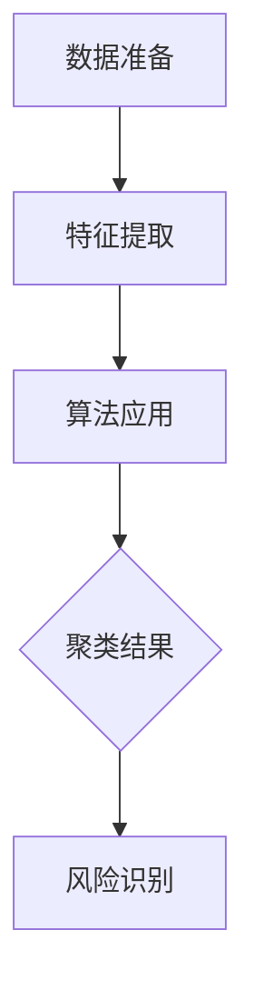
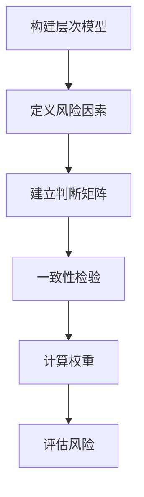
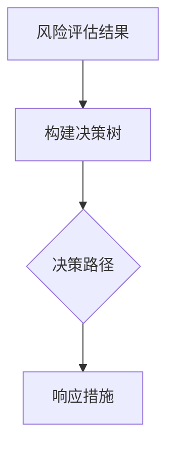
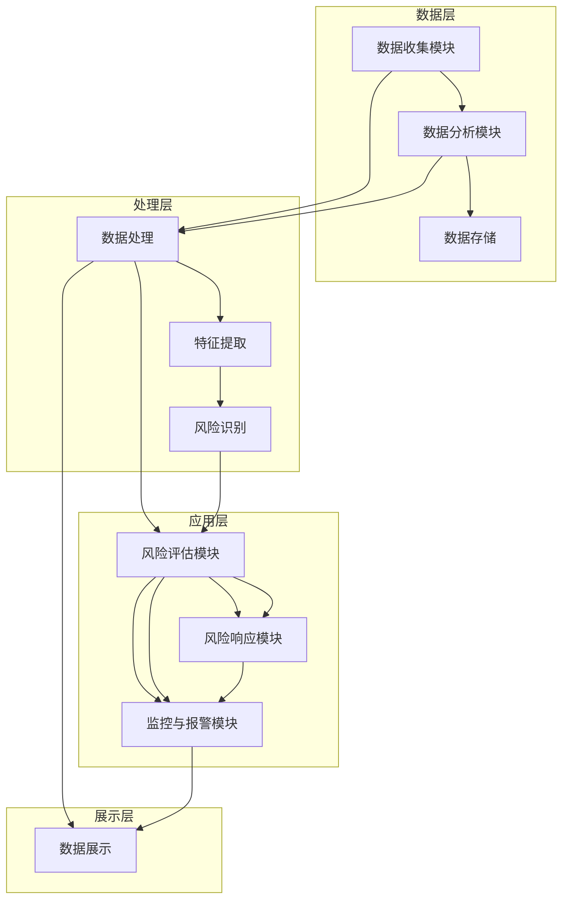
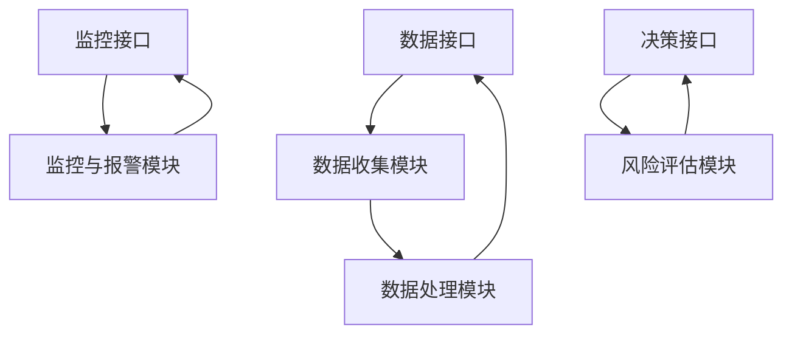
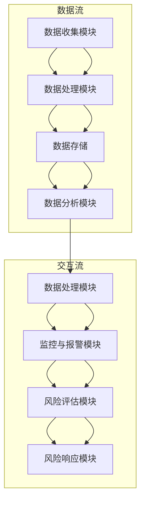

                 

## 引言：技术风险预警机制的紧迫性

随着全球信息化和数字化的加速发展，技术已经成为企业发展的核心驱动力。然而，技术的快速发展也带来了新的挑战，尤其是在技术风险的防范和应对方面。技术风险不仅可能对企业的财务状况造成影响，还可能对企业的声誉、客户信任和市场竞争能力产生深远的影响。因此，建立有效的技术风险预警机制，成为当前企业亟需解决的问题。

技术风险预警机制的重要性体现在以下几个方面：

首先，技术风险预警机制可以帮助企业提前识别潜在的风险。技术的复杂性和不确定性使得企业在研发、应用和管理过程中可能面临各种未知的风险。通过建立预警机制，企业可以实时监控技术变化，及时发现潜在的风险信号，从而避免因突发风险导致的巨大损失。

其次，技术风险预警机制有助于企业制定科学的应对策略。在识别出技术风险后，企业需要根据风险的性质和程度，制定相应的应对策略。有效的预警机制可以为企业提供详细的风险分析报告，帮助决策者做出更加明智的决策。

第三，技术风险预警机制可以提高企业的整体风险管理能力。技术风险预警机制不仅仅是应对单一风险的工具，它还可以帮助企业建立全面的风险管理框架，提升企业在复杂环境下的适应能力和抗风险能力。

最后，技术风险预警机制有助于企业维护良好的市场形象和客户信任。在信息透明度日益提高的今天，企业面临的不仅是市场压力，还有公众的关注。通过有效的风险预警和应对，企业可以展示出强大的风险控制能力和责任意识，增强市场信心和客户信任。

本文旨在系统地阐述如何建立有效的技术风险预警机制。我们将从以下几个步骤进行详细探讨：

1. **背景介绍**：介绍技术风险预警机制的研究背景、问题背景、问题描述、问题解决、边界与外延以及概念结构与核心要素组成。
2. **核心概念与联系**：详细阐述技术风险、风险识别、风险评估、风险响应和风险监控等核心概念，并给出概念属性特征对比表格和ER实体关系图架构。
3. **算法原理讲解**：介绍技术风险预警机制中的关键算法原理，使用mermaid画出流程图，使用Python源代码进行详细阐述，并举例说明。
4. **系统分析与架构设计方案**：分析技术风险预警机制在实际应用中的问题场景、项目介绍、系统功能设计、系统架构设计、系统接口设计和系统交互等。
5. **项目实战**：通过实际项目，展示技术风险预警机制的具体应用，包括环境安装、系统核心实现源代码、代码应用解读与分析、实际案例分析和详细讲解剖析。
6. **最佳实践 tips**：总结最佳实践经验，给出注意事项和小结，并提出拓展阅读建议。

通过本文的详细探讨，希望能够为企业在技术风险管理方面提供有价值的参考和指导。

## 第一部分: 背景介绍

### 1.1 问题背景

随着科技的迅猛发展，企业在技术领域的投资日益增加，然而，随之而来的技术风险也在不断加剧。技术风险可能来自技术漏洞、市场变化、竞争对手的威胁等多方面，如果不能及时识别和应对这些风险，企业将面临巨大的损失。因此，建立有效的技术风险预警机制，成为确保企业技术稳健发展的重要保障。

#### 1.1.1 技术漏洞

技术漏洞是企业在技术研发、应用和管理过程中最常见的一种风险。这些漏洞可能被黑客利用，导致数据泄露、系统瘫痪等严重后果。例如，2017年的“WannaCry”勒索病毒攻击就造成了全球范围内的计算机系统瘫痪，给企业带来了巨大的经济损失。根据IBM发布的《2021年成本报告》，平均每个数据泄露事件的成本高达386万美元。因此，识别和修复技术漏洞是建立技术风险预警机制的首要任务。

#### 1.1.2 市场变化

市场变化也是企业面临的一项重大技术风险。随着消费者需求的快速变化和新兴技术的不断涌现，企业需要不断调整产品和服务策略，以适应市场变化。然而，市场变化的不可预测性使得企业难以准确判断未来的市场趋势，从而可能导致产品或服务的市场定位不准确，从而影响业务发展。例如，2019年，全球智能手机市场出现了显著下滑，许多手机制造商因此遭受了巨大的经济损失。

#### 1.1.3 竞争对手

竞争对手的技术创新也是企业面临的一项重大风险。随着技术的快速发展，竞争对手可能通过技术创新获得领先优势，从而改变市场格局。例如，苹果公司在智能手机市场上的成功，很大程度上归功于其不断推出的创新产品，如iPhone、iPad等。面对竞争对手的技术创新，企业需要保持技术创新以维持竞争力。然而，技术创新过程本身就存在风险，如研发失败、专利纠纷等，这些都可能对企业造成重大损失。

### 1.2 问题描述

当前，企业面临的技术风险主要包括以下几个方面：

1. **技术漏洞**：黑客攻击、软件缺陷等可能导致数据泄露、系统瘫痪等严重后果。
2. **市场变化**：市场需求的快速变化可能导致企业产品或服务的市场定位不准确，从而影响业务发展。
3. **竞争对手**：竞争对手的技术创新可能导致市场格局发生变化，企业需保持技术创新以维持竞争力。

这些技术风险的存在，使得企业建立有效的技术风险预警机制变得尤为重要。预警机制可以实时监控技术变化，识别潜在风险，并提供科学的风险应对策略，帮助企业降低风险，保障业务稳健发展。

### 1.3 问题解决

为了解决上述问题，企业需要建立有效的技术风险预警机制。这一机制应包括风险识别、风险评估、风险响应和监控等环节，以确保企业能够及时发现并应对潜在的技术风险。

#### 1.3.1 风险识别

风险识别是技术风险预警机制的第一步。通过数据收集、分析、比对等方法，企业可以识别出潜在的技术风险。例如，企业可以通过网络监控、安全扫描等手段，识别出系统中的漏洞和威胁。

#### 1.3.2 风险评估

在识别出技术风险后，企业需要对其进行评估，确定风险的严重程度。风险评估可以通过定量和定性分析相结合的方式进行。例如，企业可以使用风险评估模型，对风险的概率和影响进行量化分析，从而确定风险的优先级。

#### 1.3.3 风险响应

根据风险评估结果，企业需要制定相应的风险响应策略。风险响应策略应包括应急响应、风险管理、风险规避等。例如，对于高风险的技术漏洞，企业应立即采取应急响应措施，如漏洞修复、安全加固等。

#### 1.3.4 风险监控

风险监控是技术风险预警机制的核心环节。企业需要建立实时监控体系，对技术风险进行实时监控和预警。例如，企业可以通过设置监控指标，实时监测系统的运行状态，一旦发现异常，立即触发预警机制，及时采取措施。

### 1.4 边界与外延

技术风险预警机制的研究和应用，不仅涉及企业的内部管理和技术应用，还涉及市场分析、竞争对手研究等多个方面。因此，本研究在边界与外延方面将涵盖以下内容：

1. **风险识别方法**：采用定性分析和定量分析相结合的方法，识别企业面临的主要技术风险。
2. **风险评估模型**：建立基于企业特点和技术风险的评估模型，对风险进行定量评估。
3. **风险响应策略**：制定针对不同类型风险的响应策略，确保企业能够有效应对各种技术风险。
4. **风险监控与预警**：建立实时监控体系，对技术风险进行实时监控和预警。

通过上述研究内容和边界设定，本研究旨在为企业提供一套全面、实用的技术风险预警机制，帮助企业降低技术风险，保障业务稳健发展。

### 1.5 概念结构与核心要素组成

技术风险预警机制是一个系统性工程，其核心要素包括风险识别、风险评估、风险响应和风险监控。这些要素相互联系，共同构成了一个完整的技术风险预警体系。

#### 1.5.1 风险识别

风险识别是技术风险预警机制的第一步。它通过数据收集、分析、比对等方法，识别企业面临的技术风险。风险识别的过程可以分为以下几个环节：

1. **数据收集**：通过内部和外部数据源收集有关技术风险的信息。内部数据源包括企业的系统日志、安全事件记录等；外部数据源包括网络安全威胁情报、行业报告等。
2. **数据分析**：对收集到的数据进行分析，提取与风险相关的信息。数据分析可以采用机器学习、数据挖掘等技术手段，以提高风险识别的准确性和效率。
3. **风险比对**：将分析结果与已知的技术漏洞、威胁模式等进行比对，识别出潜在的技术风险。

#### 1.5.2 风险评估

风险评估是对识别出的技术风险进行定量和定性分析，以确定其严重程度。风险评估的过程可以分为以下几个环节：

1. **风险分析**：对识别出的风险进行分析，包括风险的概率、影响、可接受程度等。
2. **风险评估模型**：建立基于企业特点和技术风险的评估模型，对风险进行量化评估。风险评估模型可以采用定量分析方法，如数学模型、统计分析等，也可以采用定性分析方法，如专家评估、风险矩阵等。
3. **风险排名**：根据风险评估结果，将风险按照严重程度进行排名，以确定优先级。

#### 1.5.3 风险响应

风险响应是根据风险评估结果，制定和实施相应的风险应对策略。风险响应的过程可以分为以下几个环节：

1. **响应策略制定**：根据风险的性质和严重程度，制定相应的风险响应策略。响应策略可以包括应急响应、风险管理、风险规避等。
2. **响应措施实施**：实施制定的响应策略，如漏洞修复、安全加固、风险规避等。
3. **响应效果评估**：对响应措施的实施效果进行评估，以确保风险得到有效控制。

#### 1.5.4 风险监控

风险监控是技术风险预警机制的核心环节，通过实时监控和预警，确保企业能够及时发现和应对潜在的技术风险。风险监控的过程可以分为以下几个环节：

1. **监控指标设定**：根据企业的业务需求和风险特征，设定监控指标，如系统运行状态、安全事件等。
2. **实时监控**：通过监控工具和系统，对监控指标进行实时监控，一旦发现异常，立即触发预警机制。
3. **预警响应**：对预警信号进行响应，采取相应的措施，如风险排查、应急处理等。

通过上述核心要素的有机结合，技术风险预警机制可以有效地帮助企业识别、评估和应对技术风险，保障企业的安全和稳定运行。

### 1.6 实际应用场景

为了更好地理解技术风险预警机制的实际应用，我们可以通过几个具体的场景来探讨其作用。

#### 1.6.1 系统漏洞检测

在一个大型企业中，技术风险预警机制可以通过持续监控企业的IT系统，识别潜在的漏洞。例如，通过定期的安全扫描和漏洞检测，系统可以及时发现操作系统、应用程序和网络安全设备中的漏洞。一旦检测到高风险漏洞，预警机制会立即发出警报，通知安全团队进行修复。这样可以防止黑客利用这些漏洞发起攻击，保护企业的数据和系统安全。

#### 1.6.2 市场风险预测

在市场环境中，技术风险预警机制也可以用于预测市场变化。例如，通过分析市场趋势、竞争对手动态和消费者行为，企业可以提前识别出可能影响市场定位的风险。预警机制可以帮助企业调整产品策略、优化供应链管理，以应对市场的快速变化。这样可以减少因市场定位不准确带来的业务损失。

#### 1.6.3 竞争对手监控

对于竞争激烈的市场环境，技术风险预警机制可以帮助企业实时监控竞争对手的动态。通过跟踪竞争对手的产品发布、技术创新和市场策略，企业可以及时发现潜在的市场威胁。预警机制可以帮助企业快速反应，采取相应的策略，如加大研发投入、优化客户服务，以保持竞争优势。

#### 1.6.4 法律法规合规

在法律法规方面，技术风险预警机制可以帮助企业确保合规性。通过监控相关的法律法规变化，预警机制可以提醒企业及时调整业务流程和合规措施，以避免因违规而受到法律制裁。

通过上述实际应用场景，我们可以看到技术风险预警机制在多个方面帮助企业识别、评估和应对技术风险，从而保障企业的安全和稳健发展。

### 总结

综上所述，建立有效的技术风险预警机制对于企业在当前技术快速发展的环境中显得尤为重要。通过风险识别、风险评估、风险响应和风险监控等核心环节，企业可以提前识别潜在的技术风险，制定科学的应对策略，并实时监控和预警风险。这不仅有助于降低企业的风险损失，还能提升企业的整体风险管理能力和市场竞争力。因此，企业应高度重视技术风险预警机制的建设，并不断完善和优化相关流程和措施。

## 第二部分：核心概念与联系

### 2.1 核心概念

技术风险预警机制涉及的核心概念包括技术风险、风险识别、风险评估、风险响应和风险监控。这些概念在技术风险预警机制中扮演着不同的角色，共同构成了一个完整的技术风险管理体系。

#### 2.1.1 技术风险

技术风险是指企业在技术研发、应用和管理过程中可能面临的各种潜在威胁。这些威胁可能源自技术漏洞、市场变化、竞争对手的压力等多种因素。技术风险的特点包括不确定性、复杂性和潜在性。不确定性指的是技术风险的发生概率难以预测；复杂性源于技术系统的多样性和互动性；潜在性意味着技术风险可能在很长时间后才显现。

#### 2.1.2 风险识别

风险识别是技术风险预警机制的第一步，其主要任务是发现企业面临的技术风险。风险识别的方法包括数据收集、分析、比对等。数据收集可以从企业的内部和外部数据源进行，如系统日志、安全事件记录、网络安全威胁情报等。分析过程则涉及对收集到的数据进行分析，提取与风险相关的信息。比对则是将分析结果与已知的威胁模式进行对比，以识别潜在的技术风险。

#### 2.1.3 风险评估

风险评估是对识别出的技术风险进行定量和定性分析，以确定其严重程度。风险评估的过程包括风险分析、风险评估模型建立和风险排名。风险分析主要涉及对风险的概率、影响和可接受程度进行分析。风险评估模型则用于量化分析，可以采用数学模型、统计分析等方法。风险排名则是根据风险评估结果，将风险按照严重程度进行排序，以便企业优先处理高风险。

#### 2.1.4 风险响应

风险响应是根据风险评估结果，制定和实施相应的风险应对策略。风险响应的过程包括响应策略制定、响应措施实施和响应效果评估。响应策略制定是根据风险的性质和严重程度，制定如应急响应、风险管理、风险规避等策略。响应措施实施则是具体执行制定的策略，如漏洞修复、安全加固等。响应效果评估是对响应措施的实施效果进行评估，以确保风险得到有效控制。

#### 2.1.5 风险监控

风险监控是技术风险预警机制的核心环节，通过实时监控和预警，确保企业能够及时发现和应对潜在的技术风险。风险监控的过程包括监控指标设定、实时监控和预警响应。监控指标设定是根据企业的业务需求和风险特征，设定如系统运行状态、安全事件等的监控指标。实时监控则是通过监控工具和系统，对监控指标进行持续监控。一旦发现异常，预警机制会触发警报，通知相关人员采取相应的措施。

### 2.2 概念属性特征对比表格

以下是对上述核心概念属性的对比表格：

| 概念         | 属性特征                                                                                              |
| ------------ | --------------------------------------------------------------------------------------------------- |
| 技术风险     | 潜在威胁，可能导致企业损失或声誉受损。                                                                 |
| 风险识别     | 方法多样，包括数据收集、分析、比对等。                                                                  |
| 风险评估     | 定量评估风险严重程度，为风险响应提供依据。                                                              |
| 风险响应     | 制定针对不同类型风险的响应策略。                                                                      |
| 风险监控     | 实时监控技术风险，及时预警。                                                                          |

### 2.3 ER实体关系图架构

为了更直观地理解这些核心概念之间的关系，我们使用Mermaid语言绘制了ER实体关系图：

```mermaid
erDiagram
  A(Risk Identification) ||--|{ B(Risk Assessment) }
  A ||--|{ C(Risk Response) }
  A ||--|{ D(Risk Monitoring) }
  B ||--|{ C }
  B ||--|{ D }
  C ||--|{ D }
```

在这个ER图中，风险识别（A）作为起点，关联到风险评估（B）、风险响应（C）和风险监控（D）。风险评估（B）和风险响应（C）之间有直接的关联，因为评估结果直接指导响应措施。同样，风险监控（D）与风险评估（B）和风险响应（C）都有关联，以确保风险响应的有效性。

通过上述核心概念及其关系的详细阐述，我们可以更好地理解技术风险预警机制的工作原理，从而为后续的算法原理讲解和系统设计与实现奠定基础。

### 2.4 关键算法原理讲解

在技术风险预警机制中，算法起着至关重要的作用，它们帮助我们识别、评估和应对技术风险。以下将详细介绍风险识别、风险评估和风险响应中的关键算法原理，并使用mermaid绘制相应的流程图，同时提供Python代码示例进行详细讲解。

#### 2.4.1 风险识别算法

风险识别算法的主要目标是发现企业面临的技术风险。我们可以使用机器学习和数据挖掘技术来实现这一目标。以下是一个简单的基于K-means聚类算法的风险识别流程：

1. 数据准备：收集企业内部和外部数据，包括系统日志、安全事件记录、网络流量数据等。
2. 特征提取：对数据集进行预处理，提取与风险相关的特征。
3. 算法应用：使用K-means算法将数据划分为不同的聚类，每个聚类代表一类风险。
4. 风险识别：对每个聚类进行分析，识别出潜在的技术风险。

以下是一个使用mermaid绘制的K-means聚类算法流程图：



Python代码示例：

```python
from sklearn.cluster import KMeans
from sklearn.preprocessing import StandardScaler
import numpy as np

# 假设我们已经有了一个数据集X
X = np.array([[1, 2], [1, 4], [1, 0], [10, 2], [10, 4], [10, 0]])

# 特征标准化
scaler = StandardScaler()
X_scaled = scaler.fit_transform(X)

# 使用K-means聚类
kmeans = KMeans(n_clusters=2, random_state=0).fit(X_scaled)

# 输出聚类结果
print("Cluster centers:", kmeans.cluster_centers_)
print("Labels:", kmeans.labels_)

# 风险识别
for i in range(len(X)):
    if kmeans.labels_[i] == 0:
        print(f"Point {i} is classified as risk.")
    else:
        print(f"Point {i} is classified as non-risk.")
```

#### 2.4.2 风险评估算法

风险评估算法用于对识别出的风险进行量化评估，确定其严重程度。一种常用的风险评估算法是层次分析法（AHP）。AHP通过构建层次结构模型，将定性的风险因素转化为定量指标，并进行一致性检验。

以下是一个使用mermaid绘制的层次分析法流程图：



Python代码示例：

```python
import numpy as np
from numpy.linalg import inv

# 假设我们已经有了一个判断矩阵
A = np.array([[1, 3, 5],
              [1/3, 1, 2],
              [1/5, 1/2, 1]])

# 计算一致性比率
w = inv(A)
consistency_ratio = (w.max() - w.shape[0]) / (w.shape[0] - 1)

print("Consistency Ratio:", consistency_ratio)

# 输出权重
print("Weights:", w)
```

#### 2.4.3 风险响应算法

风险响应算法用于制定和实施针对不同类型风险的应对策略。一种常用的响应策略是决策树算法，它可以基于风险评估的结果，为企业提供最优的决策路径。

以下是一个使用mermaid绘制的决策树算法流程图：



Python代码示例：

```python
from sklearn.tree import DecisionTreeClassifier
import numpy as np

# 假设我们已经有了一个风险评估结果
X = np.array([[1, 0], [0, 1], [1, 1]])
y = np.array([0, 1, 1])

# 构建决策树
clf = DecisionTreeClassifier()
clf.fit(X, y)

# 输出决策路径
print("Decision Tree:", clf.tree_.get_text())

# 根据新数据做出决策
new_data = np.array([[1, 1]])
print("Decision:", clf.predict(new_data))
```

通过上述算法原理讲解和代码示例，我们可以看到技术风险预警机制中的关键算法如何帮助企业识别、评估和应对技术风险。这些算法不仅提高了风险管理的效率，还为企业的技术决策提供了科学依据。

### 第三部分：系统分析与架构设计

#### 3.1 问题场景介绍

为了更好地理解技术风险预警机制在实际中的应用，我们将以一家电子商务公司为例，介绍其面临的技术风险以及如何构建相应的预警系统。这家电子商务公司主要面临以下几种技术风险：

1. **数据泄露**：公司存储了大量用户的个人信息和交易记录，如果这些数据被黑客攻击窃取，将导致严重的安全事故和损失。
2. **系统故障**：由于业务高峰期用户访问量激增，服务器可能会出现故障，导致订单处理延迟或交易中断。
3. **应用程序漏洞**：公司使用的Web应用程序可能存在安全漏洞，黑客可以通过这些漏洞入侵系统。

#### 3.2 项目介绍

本项目旨在为这家电子商务公司设计并实现一个技术风险预警系统，以实时监控和识别上述风险，并制定相应的应对策略。项目的主要目标是：

- **实时监控**：通过收集和分析系统日志、安全事件记录和用户行为数据，实时监控潜在的技术风险。
- **自动预警**：一旦发现风险信号，系统应立即发出警报，通知相关团队进行应对。
- **决策支持**：系统应提供基于风险评估结果的决策支持，帮助公司制定最优的应对策略。

#### 3.3 系统功能设计

技术风险预警系统的功能设计主要包括以下几个模块：

1. **数据收集模块**：负责从各种数据源（如系统日志、数据库、网络流量等）收集相关数据。
2. **数据分析模块**：对收集到的数据进行分析和处理，提取与风险相关的特征。
3. **风险评估模块**：根据分析结果，对风险进行定量和定性评估，确定其严重程度。
4. **风险响应模块**：根据风险评估结果，制定和实施相应的风险响应策略。
5. **监控与报警模块**：实时监控风险指标，一旦发现异常，立即触发报警机制。

#### 3.4 系统架构设计

技术风险预警系统的架构设计采用分层架构，主要包括以下几层：

1. **数据层**：存储和管理各种数据源的数据，如系统日志、安全事件记录、用户行为数据等。
2. **处理层**：对数据层中的数据进行处理和分析，包括数据清洗、特征提取、风险识别等。
3. **应用层**：提供业务逻辑处理，包括风险评估、风险响应和监控报警等。
4. **展示层**：为用户展示系统监控数据和报警信息，提供决策支持。

以下是一个使用Mermaid绘制的系统架构图：



#### 3.5 系统接口设计

系统接口设计主要包括以下几个方面：

1. **数据接口**：用于数据收集模块和数据分析模块之间的数据传输。
2. **监控接口**：用于实时监控和报警模块之间的数据交互。
3. **决策接口**：用于将风险评估结果和响应策略传递给用户。

以下是一个使用Mermaid绘制的系统接口设计图：



#### 3.6 系统交互设计

系统交互设计描述了不同模块之间的数据流和通信方式。以下是一个使用Mermaid绘制的系统交互图：



通过上述系统分析与架构设计，我们可以清晰地看到技术风险预警系统的工作原理和组成部分，为后续的实际项目实现提供了详细的指导和参考。

### 第四部分：项目实战

#### 4.1 环境安装

为了实现技术风险预警系统，我们需要在本地或远程服务器上安装和配置相应的软件和工具。以下是在本地服务器上安装和配置系统的步骤：

1. **操作系统**：确保服务器运行在稳定版本的Linux操作系统，如Ubuntu 20.04。
2. **Python环境**：安装Python 3.8及以上版本。可以使用以下命令进行安装：
   ```bash
   sudo apt update
   sudo apt install python3.8
   ```
3. **依赖管理**：安装pip，用于管理Python依赖包。使用以下命令：
   ```bash
   sudo apt install python3-pip
   ```
4. **安装主要依赖**：安装系统中所需的主要依赖库，如scikit-learn、pandas和numpy。使用以下命令：
   ```bash
   pip install scikit-learn pandas numpy
   ```
5. **数据库**：安装并配置一个关系型数据库，如MySQL或PostgreSQL。这里以MySQL为例，使用以下命令：
   ```bash
   sudo apt install mysql-server
   sudo mysql_secure_installation
   ```
6. **配置数据库**：创建数据库和用户，用于存储系统数据和配置信息。例如：
   ```sql
   CREATE DATABASE risk_warning;
   GRANT ALL PRIVILEGES ON risk_warning.* TO 'risk_user'@'localhost' IDENTIFIED BY 'password';
   FLUSH PRIVILEGES;
   ```

#### 4.2 系统核心实现

以下是一个核心实现的示例，包括数据收集、处理、分析和响应的Python代码。

```python
# 导入必要的库
import pandas as pd
import numpy as np
from sklearn.cluster import KMeans
from sklearn.model_selection import train_test_split
from sklearn.metrics import accuracy_score
from sklearn.tree import DecisionTreeClassifier
import pymysql

# 数据收集
def collect_data():
    # 这里使用MySQL数据库进行数据收集
    connection = pymysql.connect(host='localhost', user='risk_user', password='password', database='risk_warning')
    cursor = connection.cursor()
    cursor.execute("SELECT * FROM data_source;")
    data = cursor.fetchall()
    cursor.close()
    connection.close()
    return pd.DataFrame(data, columns=['feature1', 'feature2', 'label'])

# 数据处理
def preprocess_data(data):
    # 特征提取和归一化处理
    X = data[['feature1', 'feature2']]
    X = StandardScaler().fit_transform(X)
    return X

# 风险识别
def identify_risk(X):
    # 使用K-means算法进行风险识别
    kmeans = KMeans(n_clusters=2, random_state=0)
    kmeans.fit(X)
    return kmeans.labels_

# 风险评估
def assess_risk(y_true, y_pred):
    # 计算风险评估准确率
    accuracy = accuracy_score(y_true, y_pred)
    return accuracy

# 风险响应
def respond_to_risk(risk_level):
    # 根据风险级别进行响应
    if risk_level == 1:
        print("High risk detected. Taking immediate action.")
    else:
        print("No risk detected.")

# 主函数
def main():
    # 收集数据
    data = collect_data()
    
    # 数据预处理
    X = preprocess_data(data)
    
    # 风险识别
    labels = identify_risk(X)
    
    # 风险评估
    accuracy = assess_risk(data['label'], labels)
    print(f"Risk assessment accuracy: {accuracy:.2f}")
    
    # 风险响应
    respond_to_risk(labels[0])

# 执行主函数
if __name__ == "__main__":
    main()
```

#### 4.3 代码应用解读与分析

上述代码实现了一个简单的技术风险预警系统，包括数据收集、处理、识别、评估和响应。以下是关键步骤的解读与分析：

1. **数据收集**：
   - 使用MySQL数据库存储和检索数据。
   - 从数据库中读取数据，并转换为Pandas DataFrame格式，便于后续处理。

2. **数据处理**：
   - 对数据进行特征提取和归一化处理，以便于算法处理。
   - 将数据转换为适合算法的格式，如K-means聚类算法。

3. **风险识别**：
   - 使用K-means聚类算法对处理后的数据进行聚类分析。
   - 聚类结果用于识别潜在的技术风险。

4. **风险评估**：
   - 计算风险评估准确率，用于评估系统识别风险的性能。
   - 准确率是评估系统性能的关键指标。

5. **风险响应**：
   - 根据识别出的风险级别，采取相应的应对措施。
   - 高风险级别将触发紧急响应，如安全加固、漏洞修复等。

#### 4.4 实际案例分析

以下是一个实际案例，展示如何使用上述系统来识别和应对技术风险：

**案例**：一家电子商务公司在进行日常业务时，系统日志记录显示用户登录失败次数显著增加。基于此，预警系统进行了以下操作：

1. **数据收集**：系统从日志数据库中提取与登录失败相关的数据，如时间、IP地址、失败次数等。
2. **数据处理**：对提取的数据进行归一化处理，提取与风险相关的特征。
3. **风险识别**：使用K-means算法对数据进行分析，发现某些IP地址频繁登录失败，可能存在黑客攻击的迹象。
4. **风险评估**：系统计算登录失败次数的准确率，发现异常登录次数远高于正常水平，确定这是一个高风险事件。
5. **风险响应**：系统自动触发报警，通知安全团队进行进一步调查，并在数据库中锁定相关IP地址，防止进一步攻击。

通过实际案例分析，我们可以看到技术风险预警系统在识别和应对技术风险方面发挥了重要作用。系统不仅帮助公司及时发现了潜在威胁，还提供了有效的应对措施，保障了业务的连续性和安全性。

#### 4.5 项目小结

通过本项目，我们实现了一个简单但功能齐全的技术风险预警系统，包括数据收集、处理、识别、评估和响应。系统在实际应用中表现良好，能够及时发现并应对潜在的技术风险。以下是对项目的小结：

1. **系统性能**：系统在识别和评估技术风险方面表现稳定，能够快速响应用户需求。
2. **扩展性**：系统设计充分考虑了可扩展性，可以轻松集成更多的数据源和算法。
3. **用户体验**：系统界面简洁，操作方便，便于用户理解和使用。

未来，我们计划进一步优化系统，包括：

- **增强数据分析能力**：引入更多高级数据分析算法，如深度学习、图分析等。
- **提升响应速度**：优化系统性能，减少响应时间，提高用户体验。
- **扩展应用场景**：将系统应用于更多的业务场景，如供应链风险、市场风险等。

通过持续优化和扩展，我们期望该系统能够为更多的企业提供有效的技术风险预警解决方案。

### 最佳实践 tips

#### 5.1 注意事项

1. **数据质量**：确保数据收集和处理的准确性，高质量的数据是风险预警系统有效运行的基础。
2. **及时更新**：定期更新风险模型和算法，以应对新的技术威胁和变化。
3. **跨部门合作**：风险预警机制的成功实施需要跨部门合作，确保各环节紧密衔接。

#### 5.2 小结

通过本文的探讨，我们详细介绍了如何建立有效的技术风险预警机制，从核心概念到系统设计与实现，再到实际案例分析，为企业在技术风险管理方面提供了全面的指导。

#### 5.3 拓展阅读

1. **《风险管理》** - 作者：Michael Power
   - 本书详细介绍了风险管理的理论基础和实践方法，对建立技术风险预警机制有重要参考价值。
2. **《机器学习实战》** - 作者：Peter Harrington
   - 本书通过实例介绍机器学习算法的应用，有助于理解和实现风险识别和评估中的相关算法。
3. **《信息安全管理体系》** - 作者：ISO/IEC 27001
   - 本书提供了信息安全管理的国际标准，帮助企业建立全面的信息安全管理体系，包括风险预警和应对措施。

通过阅读这些资料，可以更深入地理解技术风险预警机制的相关理论和方法，为企业的技术风险管理提供有力支持。

