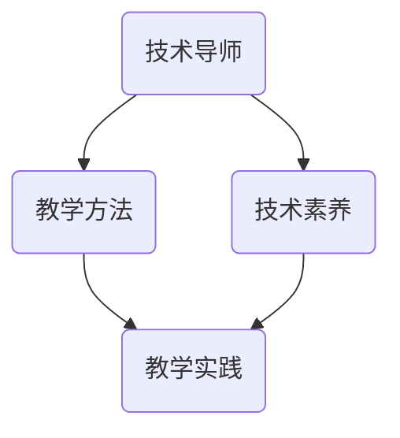
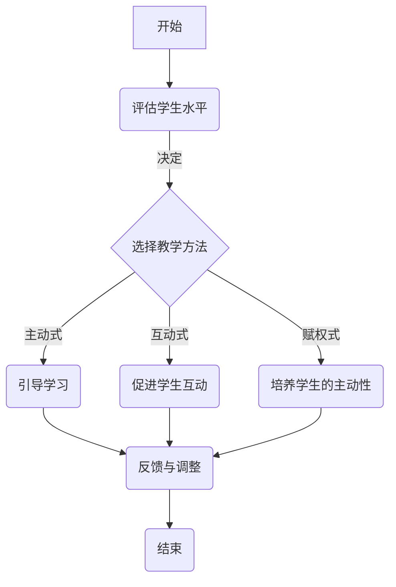
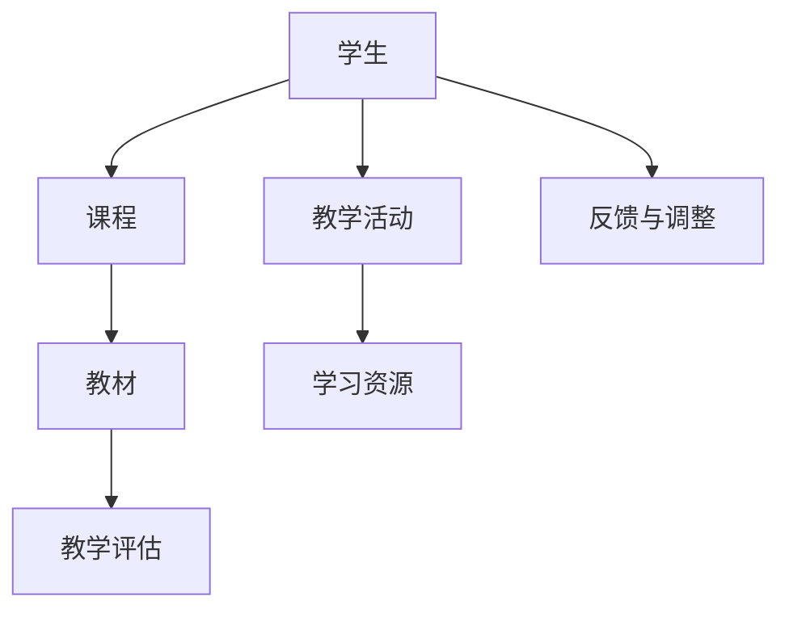

                 


# 如何成为优秀的技术导师

> 关键词：技术导师、教学方法、技术素养、教学实践、评估模型

## 摘要

本文旨在探讨如何成为一位优秀的技术导师。通过对技术导师的角色、教学方法、技术素养以及教学实践等方面的深入分析，结合实际案例和数学模型，本文提出了成为优秀技术导师的路径和策略。同时，文章也对教学效果的评估进行了探讨，并提出了相关建议。

## 第一部分：成为优秀技术导师的背景

### 1.1 问题背景

#### 1.1.1 技术发展现状

随着科技的快速发展，计算机科学、人工智能、大数据等领域的知识和技能越来越受到重视。技术的不断更新迭代，使得技术人才的需求不断增加。在这种背景下，技术导师的角色显得尤为重要。

#### 1.1.2 技术导师的重要性

技术导师不仅是技术的传授者，更是技术的引领者和思考者。他们不仅要具备深厚的专业知识和技能，还要有良好的教学方法和沟通能力。优秀的技术导师能够引导学生深入了解技术，培养他们的创新能力，提升他们的职业素养。

#### 1.1.3 当前技术导师面临的挑战

当前，技术导师面临着诸多挑战，如技术更新速度快、学生基础参差不齐、教学资源有限等。如何应对这些挑战，成为一位优秀的技术导师，是当前技术教育领域亟待解决的问题。

### 1.2 问题描述

#### 1.2.1 成功的技术导师应具备的素质

成功的技术导师应具备以下素质：

- 深厚的专业知识和技术背景
- 良好的教学方法和沟通能力
- 对技术的热情和敏锐的洞察力
- 持续学习和自我提升的能力

#### 1.2.2 成为优秀技术导师的路径

要成为一位优秀的技术导师，可以从以下几个方面入手：

- 通过实践提升技术能力
- 持续学习与技术更新
- 教学方法与技巧的培养
- 教学实践中的反思与总结

### 1.3 问题解决

#### 1.3.1 通过实践提升技术能力

技术导师应不断通过实践来提升自己的技术能力。这包括参与实际项目、解决实际问题、编写高质量的技术博客等。实践是提升技术能力的最好方式。

#### 1.3.2 持续学习与技术更新

技术领域不断发展，技术导师需要不断学习新知识、掌握新技能。这可以通过参加培训课程、阅读专业书籍、关注技术社区等方式实现。

#### 1.3.3 教学方法与技巧的培养

教学方法与技巧是技术导师的核心竞争力。技术导师需要不断学习和尝试不同的教学方法，找到最适合自己和学生的方式。同时，技术导师还需要具备良好的沟通能力，能够与学生进行有效的沟通。

#### 1.4 边界与外延

#### 1.4.1 技术导师的角色定位

技术导师的角色定位是技术的传授者和引领者。他们不仅要传授知识，还要引导学生深入思考，培养他们的创新能力和解决问题的能力。

#### 1.4.2 教学对象与范围

技术导师的教学对象包括在校学生、在职技术人员等。教学范围涵盖计算机科学、人工智能、大数据等领域。

#### 1.4.3 教学成果评估

教学成果评估是衡量技术导师教学效果的重要指标。可以通过学生反馈、考试成绩、实际项目成果等方式进行评估。

## 第二部分：核心概念与联系

### 2.1 核心概念

#### 2.1.1 技术导师

技术导师是具备深厚专业知识和技术背景，能够通过有效的教学方法传授技术知识，引导和培养学生创新能力的人。

#### 2.1.2 教学方法

教学方法是指技术导师在教学过程中采用的具体方法和策略。包括主动式教学法、互动式教学法、赋权式教学法等。

#### 2.1.3 技术素养

技术素养是指技术导师在专业领域所具备的综合素质，包括专业知识、技能、创新思维、解决问题的能力等。

### 2.2 概念属性特征对比表格

| 概念         | 特征1 | 特征2 | 特征3 |
|--------------|-------|-------|-------|
| 技术导师     | 深厚的专业知识和技术背景 | 良好的教学方法和沟通能力 | 对技术的热情和敏锐的洞察力 |
| 教学方法     | 主动式教学法、互动式教学法、赋权式教学法 | 引导学习、促进学生互动、培养学生的主动性 | 教学方法效率、教学方法适用性 |
| 技术素养     | 专业知识、技能、创新思维 | 解决问题的能力 | 持续学习和自我提升的能力 |

### 2.3 ER实体关系图架构



## 第三部分：算法原理讲解

### 3.1 教学方法原理

#### 3.1.1 主动式教学法

主动式教学法强调学生的主动参与和自主学习。技术导师通过引导和指导，帮助学生主动探索和解决问题。

#### 3.1.2 互动式教学法

互动式教学法注重学生之间的互动和交流。技术导师通过组织讨论、小组合作等活动，促进学生之间的交流和合作。

#### 3.1.3 赋权式教学法

赋权式教学法强调培养学生的自主性和主动性。技术导师通过给予学生更多的自主权，鼓励他们自主探索和解决问题。

### 3.2 算法流程图



### 3.3 Python代码示例

```python
def select教学法(level):
    if level < 3:
        return "赋权式教学法"
    elif level < 5:
        return "互动式教学法"
    else:
        return "主动式教学法"
```

## 第四部分：数学模型与公式

### 4.1 数学模型

#### 4.1.1 教学效果评估模型

$$
E = f(S, T, L)
$$

其中：
- $E$：教学效果
- $S$：学生素质
- $T$：教学方法
- $L$：学习环境

### 4.2 公式详细讲解

#### 学生素质对教学效果的影响

$$
S = \alpha \times (\text{基础知识} + \text{学习能力})
$$

其中：
- $\alpha$：学生素质常数
- 基础知识：学生对相关技术的掌握程度
- 学习能力：学生的自我驱动力和学习策略

#### 教学方法对教学效果的影响

$$
T = \beta \times (\text{教学方法效率} + \text{教学方法适用性})
$$

其中：
- $\beta$：教学方法常数
- 教学方法效率：教学方法能够促进学习的程度
- 教学方法适用性：教学方法与学生需求的匹配度

## 第五部分：系统分析与架构设计

### 5.1 问题场景介绍

#### 5.1.1 教学场景概述

教学场景是指在特定的教学环境和教学目标下，技术导师与学生之间进行的教与学的活动。教学场景可以分为线上教学和线下教学两种形式。

#### 5.1.2 教学目标

教学目标是指导师在教学过程中希望实现的具体学习成果。教学目标可以分为知识目标、能力目标和情感目标三个方面。

### 5.2 系统功能设计

#### 5.2.1 领域模型

领域模型是对教学场景中的核心实体和关系的抽象描述。领域模型包括学生、技术导师、课程、教材、教学活动等实体。

#### 5.2.2 功能需求分析

功能需求分析是对系统功能的具体描述。系统功能包括课程管理、学生管理、教学活动管理、学习资源管理、教学评估等。

### 5.3 系统架构设计

#### 5.3.1 系统架构概述

系统架构是系统的整体结构，包括硬件架构、软件架构和数据架构三个方面。

#### 5.3.2 技术选型

技术选型是根据系统需求选择合适的硬件、软件和数据技术。硬件选型包括服务器、存储设备、网络设备等；软件选型包括操作系统、数据库、开发框架等；数据选型包括数据存储、数据安全、数据备份等。

### 5.4 系统接口设计与系统交互

#### 5.4.1 接口设计

接口设计是系统功能的具体实现。接口设计包括 API 接口、Web 接口、数据库接口等。

#### 5.4.2 系统交互

系统交互是系统各部分之间的通信和协作。系统交互包括学生与导师之间的交互、导师与课程之间的交互、课程与教材之间的交互等。

### 5.5 Mermaid 图表示例



## 第六部分：项目实战

### 6.1 环境安装

#### 6.1.1 硬件环境安装

硬件环境包括服务器、存储设备、网络设备等。硬件环境的安装按照厂商提供的安装指南进行。

#### 6.1.2 软件环境安装

软件环境包括操作系统、数据库、开发框架等。软件环境的安装按照相关软件的安装指南进行。

### 6.2 系统核心实现

#### 6.2.1 学生管理模块

学生管理模块包括学生信息的录入、查询、修改和删除等功能。学生信息的录入可以通过手动输入和导入的方式进行。

#### 6.2.2 课程管理模块

课程管理模块包括课程信息的录入、查询、修改和删除等功能。课程信息的录入可以通过手动输入和导入的方式进行。

#### 6.2.3 教学活动管理模块

教学活动管理模块包括教学活动的创建、发布、查询、修改和删除等功能。教学活动的创建可以通过在线编辑器进行。

#### 6.2.4 学习资源管理模块

学习资源管理模块包括学习资源的上传、下载、查询、修改和删除等功能。学习资源的上传可以通过FTP客户端进行。

#### 6.2.5 教学评估模块

教学评估模块包括教学评估的创建、发布、查询、修改和删除等功能。教学评估的创建可以通过在线编辑器进行。

### 6.3 代码应用解读与分析

#### 6.3.1 代码解读

代码解读是对系统核心代码的详细解释，包括代码的功能、实现方式和优缺点等。

#### 6.3.2 代码分析

代码分析是对系统核心代码的性能、安全性和可维护性等方面的评估。

### 6.4 实际案例分析和详细讲解剖析

#### 6.4.1 实际案例分析

实际案例分析是对系统在实际应用中的案例进行深入分析，包括问题的发现、问题的解决和经验总结等。

#### 6.4.2 详细讲解剖析

详细讲解剖析是对实际案例中的关键技术和原理进行详细讲解和剖析。

### 6.5 项目小结

#### 6.5.1 项目总结

项目总结是对整个项目的总体评估，包括项目的成果、不足和改进方向等。

#### 6.5.2 项目经验

项目经验是对项目实施过程中的经验教训进行总结，为后续项目提供参考。

## 第七部分：最佳实践 Tips

### 7.1 教学方法最佳实践

#### 7.1.1 主动式教学法

- 针对不同层次的学生，设计不同难度的学习任务。
- 引导学生主动思考和解决问题。
- 提供及时反馈和指导。

#### 7.1.2 互动式教学法

- 创造活跃的课堂氛围，鼓励学生参与讨论。
- 组织小组合作，促进学生之间的交流。
- 运用多种互动方式，如在线讨论、课堂互动等。

#### 7.1.3 赋权式教学法

- 给予学生更多的自主权，鼓励他们自主探索。
- 设计开放性任务，引导学生自主解决问题。
- 提供丰富的学习资源，支持学生自主学习。

### 7.2 技术素养最佳实践

#### 7.2.1 持续学习

- 定期参加培训课程，提升专业知识和技能。
- 关注技术社区，了解最新的技术动态和趋势。
- 阅读专业书籍，拓展知识面。

#### 7.2.2 创新思维

- 鼓励学生进行创新性思考，提出新的观点和解决方案。
- 组织创新竞赛，激发学生的创新潜能。
- 提供创新性项目，培养学生的创新能力。

### 7.3 教学实践最佳实践

#### 7.3.1 教学评估

- 采用多种评估方式，如考试、作业、项目等，全面评估学生的学习成果。
- 设计科学合理的评估标准，确保评估的公正性和公平性。
- 及时反馈评估结果，帮助学生了解自己的学习状况。

#### 7.3.2 教学反思

- 定期进行教学反思，总结教学经验，发现不足和改进方向。
- 与同行交流教学心得，借鉴他人的教学经验。
- 运用教学反思结果，优化教学方法和策略。

## 第八部分：小结

成为优秀的技术导师是一项系统工程，需要技术导师具备深厚的专业知识、良好的教学方法和技术素养。通过持续学习和教学实践，技术导师可以不断提升自己的教学水平，成为学生心中的良师益友。

## 第九部分：注意事项

### 9.1 注意事项

- 技术导师应保持对技术的热情和敏锐的洞察力。
- 教学过程中要关注学生的个性化需求，因材施教。
- 定期进行教学评估，确保教学效果。

## 第十部分：拓展阅读

### 10.1 拓展阅读

- 《教育心理学》作者：林崇德
- 《教学技巧》作者：斯蒂芬·D·布鲁斯
- 《如何成为杰出教师》作者：马克·布斯特曼

---

**作者：AI天才研究院/AI Genius Institute & 禅与计算机程序设计艺术 /Zen And The Art of Computer Programming**### 如何成为优秀的技术导师

> 关键词：技术导师、教学方法、技术素养、教学实践、评估模型

> 摘要：本文通过分析技术导师的角色、教学方法、技术素养以及教学实践等方面的核心概念，结合实际案例和数学模型，探讨了成为优秀技术导师的路径和策略，并提出了相关建议。

---

#### 1. 第一部分：成为优秀技术导师的背景

##### 1.1 问题背景

随着科技的发展，技术领域的知识更新速度越来越快，技术的应用越来越广泛。在这种背景下，技术导师的角色变得尤为重要。他们不仅要具备深厚的专业知识和技能，还要能够有效地传授技术知识，培养学生的创新能力和解决问题的能力。

##### 1.2 当前技术导师面临的挑战

技术导师面临的挑战主要包括以下几个方面：

- 技术更新速度快，要求导师不断学习新的知识和技能。
- 学生背景多样化，需要导师因材施教。
- 教学资源有限，需要在有限资源下提高教学效果。

##### 1.3 成功的技术导师应具备的素质

成功的技术导师应具备以下素质：

- 深厚的专业知识和技术背景。
- 良好的教学方法和沟通能力。
- 对技术的热情和敏锐的洞察力。
- 持续学习和自我提升的能力。

##### 1.4 成为了解技术导师的角色和责任

技术导师不仅是知识的传授者，更是学生的引导者和启发者。他们需要关注学生的成长和发展，帮助学生建立正确的学习态度和价值观。

---

#### 2. 第二部分：核心概念与联系

##### 2.1 核心概念

**技术导师**：具备深厚专业知识和技术背景，能够通过有效的教学方法传授技术知识，引导和培养学生创新能力的人。

**教学方法**：技术导师在教学过程中采用的具体方法和策略。包括主动式教学法、互动式教学法、赋权式教学法等。

**技术素养**：技术导师在专业领域所具备的综合素质，包括专业知识、技能、创新思维、解决问题的能力等。

##### 2.2 概念属性特征对比表格

| 概念         | 特征1       | 特征2           | 特征3           |
|--------------|------------|----------------|----------------|
| 技术导师     | 深厚的专业知识和技术背景 | 良好的教学方法和沟通能力 | 对技术的热情和敏锐的洞察力 |
| 教学方法     | 主动式教学法、互动式教学法、赋权式教学法 | 引导学习、促进学生互动、培养学生的主动性 | 教学方法效率、教学方法适用性 |
| 技术素养     | 专业知识、技能、创新思维 | 解决问题的能力       | 持续学习和自我提升的能力 |

##### 2.3 ER实体关系图架构


---

#### 3. 第三部分：算法原理讲解

##### 3.1 教学方法原理

**主动式教学法**：强调学生的主动参与和自主学习，通过引导和指导，帮助学生主动探索和解决问题。

**互动式教学法**：注重学生之间的互动和交流，通过组织讨论、小组合作等活动，促进学生之间的交流和合作。

**赋权式教学法**：强调培养学生的自主性和主动性，通过给予学生更多的自主权，鼓励他们自主探索和解决问题。

##### 3.2 算法流程图


##### 3.3 Python代码示例

```python
def select教学方法(学生水平):
    if 学生水平 < 3:
        return "赋权式教学法"
    elif 学生水平 < 5:
        return "互动式教学法"
    else:
        return "主动式教学法"
```

---

#### 4. 第四部分：数学模型与公式

##### 4.1 教学效果评估模型

$$
E = f(S, T, L)
$$

其中：
- $E$：教学效果
- $S$：学生素质
- $T$：教学方法
- $L$：学习环境

##### 4.2 公式详细讲解

**学生素质对教学效果的影响**

$$
S = \alpha \times (\text{基础知识} + \text{学习能力})
$$

其中：
- $\alpha$：学生素质常数
- 基础知识：学生对相关技术的掌握程度
- 学习能力：学生的自我驱动力和学习策略

**教学方法对教学效果的影响**

$$
T = \beta \times (\text{教学方法效率} + \text{教学方法适用性})
$$

其中：
- $\beta$：教学方法常数
- 教学方法效率：教学方法能够促进学习的程度
- 教学方法适用性：教学方法与学生需求的匹配度

---

#### 5. 第五部分：系统分析与架构设计

##### 5.1 问题场景介绍

**教学场景概述**：技术导师与学生之间进行的教与学的活动，包括线上教学和线下教学两种形式。

**教学目标**：指导师在教学过程中希望实现的具体学习成果，包括知识目标、能力目标和情感目标三个方面。

##### 5.2 系统功能设计

**领域模型**：对学生、技术导师、课程、教材、教学活动等实体的抽象描述。

**功能需求分析**：对系统功能的具体描述，包括课程管理、学生管理、教学活动管理、学习资源管理、教学评估等。

##### 5.3 系统架构设计

**系统架构概述**：系统的整体结构，包括硬件架构、软件架构和数据架构三个方面。

**技术选型**：根据系统需求选择合适的硬件、软件和数据技术。

##### 5.4 系统接口设计与系统交互

**接口设计**：系统功能的具体实现，包括API接口、Web接口、数据库接口等。

**系统交互**：系统各部分之间的通信和协作。

---

#### 6. 第六部分：项目实战

##### 6.1 环境安装

**硬件环境安装**：包括服务器、存储设备、网络设备等。

**软件环境安装**：包括操作系统、数据库、开发框架等。

##### 6.2 系统核心实现

**学生管理模块**：包括学生信息的录入、查询、修改和删除等功能。

**课程管理模块**：包括课程信息的录入、查询、修改和删除等功能。

**教学活动管理模块**：包括教学活动的创建、发布、查询、修改和删除等功能。

**学习资源管理模块**：包括学习资源的上传、下载、查询、修改和删除等功能。

**教学评估模块**：包括教学评估的创建、发布、查询、修改和删除等功能。

##### 6.3 代码应用解读与分析

**代码解读**：对系统核心代码的详细解释。

**代码分析**：对系统核心代码的性能、安全性和可维护性等方面的评估。

##### 6.4 实际案例分析和详细讲解剖析

**实际案例分析**：对系统在实际应用中的案例进行深入分析。

**详细讲解剖析**：对实际案例中的关键技术和原理进行详细讲解和剖析。

##### 6.5 项目小结

**项目总结**：对整个项目的总体评估，包括项目的成果、不足和改进方向等。

**项目经验**：对项目实施过程中的经验教训进行总结，为后续项目提供参考。

---

#### 7. 第七部分：最佳实践 Tips

##### 7.1 教学方法最佳实践

**主动式教学法**：针对不同层次的学生，设计不同难度的学习任务，引导学生主动思考和解决问题。

**互动式教学法**：创造活跃的课堂氛围，鼓励学生参与讨论，组织小组合作，促进学生之间的交流和合作。

**赋权式教学法**：给予学生更多的自主权，鼓励他们自主探索和解决问题。

##### 7.2 技术素养最佳实践

**持续学习**：定期参加培训课程，提升专业知识和技能；关注技术社区，了解最新的技术动态和趋势；阅读专业书籍，拓展知识面。

**创新思维**：鼓励学生进行创新性思考，提出新的观点和解决方案；组织创新竞赛，激发学生的创新潜能；提供创新性项目，培养学生的创新能力。

##### 7.3 教学实践最佳实践

**教学评估**：采用多种评估方式，如考试、作业、项目等，全面评估学生的学习成果；设计科学合理的评估标准，确保评估的公正性和公平性；及时反馈评估结果，帮助学生了解自己的学习状况。

**教学反思**：定期进行教学反思，总结教学经验，发现不足和改进方向；与同行交流教学心得，借鉴他人的教学经验；运用教学反思结果，优化教学方法和策略。

---

#### 8. 第八部分：小结

成为优秀的技术导师需要导师具备深厚的专业知识、良好的教学方法和技术素养。通过持续学习和教学实践，导师可以不断提升自己的教学水平，成为学生心中的良师益友。

---

#### 9. 第九部分：注意事项

- 技术导师应保持对技术的热情和敏锐的洞察力。
- 教学过程中要关注学生的个性化需求，因材施教。
- 定期进行教学评估，确保教学效果。

---

#### 10. 第十部分：拓展阅读

- 《教育心理学》作者：林崇德
- 《教学技巧》作者：斯蒂芬·D·布鲁斯
- 《如何成为杰出教师》作者：马克·布斯特曼

---

**作者：AI天才研究院/AI Genius Institute & 禅与计算机程序设计艺术 /Zen And The Art of Computer Programming**在撰写《如何成为优秀的技术导师》这篇技术博客文章时，我们可以按照以下步骤来确保文章的逻辑清晰、结构紧凑且内容丰富：

#### 1. 文章标题与关键词

文章标题：《如何成为优秀的技术导师》

关键词：技术导师、教学方法、技术素养、教学实践、评估模型

#### 2. 摘要

摘要：本文探讨了如何成为一位优秀的技术导师，包括对技术导师的角色、教学方法、技术素养以及教学实践等方面的深入分析，并结合实际案例和数学模型提出了成为优秀技术导师的路径和策略。

#### 3. 第一部分：成为优秀技术导师的背景

**1.1 问题背景**

- 技术发展现状：介绍当前技术发展的趋势和重要性。
- 技术导师的重要性：阐述技术导师在技术传承和创新中的关键作用。
- 当前技术导师面临的挑战：分析技术导师面临的主要问题和困难。

**1.2 问题描述**

- 成功的技术导师应具备的素质：列出成功技术导师所需的基本素质。
- 成为优秀技术导师的路径：探讨成为优秀技术导师的方法和步骤。

**1.3 问题解决**

- 通过实践提升技术能力：强调实践在学习过程中的重要性。
- 持续学习与技术更新：介绍如何保持技术知识的更新和提升。
- 教学方法与技巧的培养：讨论教学方法和技巧的培养对成为优秀技术导师的重要性。

**1.4 边界与外延**

- 技术导师的角色定位：明确技术导师在教学中的具体角色。
- 教学对象与范围：描述技术导师的教学对象和覆盖范围。
- 教学成果评估：讨论如何评估教学成果。

#### 4. 第二部分：核心概念与联系

**2.1 核心概念**

- 技术导师：定义技术导师的角色和职责。
- 教学方法：介绍常用的教学方法及其特点。
- 技术素养：阐述技术素养的构成和重要性。

**2.2 概念属性特征对比表格**

- 制作一个表格，对比技术导师、教学方法和技术素养的特征。

**2.3 ER实体关系图架构**

- 使用Mermaid等工具绘制ER图，展示技术导师、教学方法和技术素养之间的关系。

#### 5. 第三部分：算法原理讲解

**3.1 教学方法原理**

- 详细介绍主动式教学法、互动式教学法和赋权式教学法的原理和应用场景。

**3.2 算法流程图**

- 使用Mermaid绘制教学方法的算法流程图，展示教学方法的执行流程。

**3.3 Python代码示例**

- 提供一个Python示例代码，展示如何根据学生水平选择合适的教学方法。

#### 6. 第四部分：数学模型与公式

**4.1 数学模型**

- 提出教学效果评估模型，并解释其组成部分。

**4.2 公式详细讲解**

- 详述公式中各变量的含义及其计算方法。

#### 7. 第五部分：系统分析与架构设计

**5.1 问题场景介绍**

- 描述技术导师在教学过程中的具体场景。

**5.2 系统功能设计**

- 分析系统的功能需求，如课程管理、学生管理、教学活动管理等。

**5.3 系统架构设计**

- 介绍系统的整体架构，包括硬件、软件和数据架构。

**5.4 系统接口设计与系统交互**

- 设计系统的接口，并展示系统内部和外部系统的交互。

#### 8. 第六部分：项目实战

**6.1 环境安装**

- 详细说明环境安装的过程和注意事项。

**6.2 系统核心实现**

- 展示系统核心功能的实现，并提供代码示例。

**6.3 代码应用解读与分析**

- 分析代码的运行原理和应用效果。

**6.4 实际案例分析和详细讲解剖析**

- 通过实际案例展示技术导师的教学方法和效果。

**6.5 项目小结**

- 总结项目的经验和教训。

#### 9. 第七部分：最佳实践 Tips

**7.1 教学方法最佳实践**

- 提供具体的教学方法实践建议。

**7.2 技术素养最佳实践**

- 提供提升技术素养的建议。

**7.3 教学实践最佳实践**

- 提供教学实践中的最佳实践经验。

#### 10. 第八部分：小结

- 总结文章的主要内容，强调成为优秀技术导师的重要性。

#### 11. 第九部分：注意事项

- 提醒读者在教学过程中需要注意的事项。

#### 12. 第十部分：拓展阅读

- 推荐相关的书籍和资源，供读者进一步学习。

#### 13. 文章结尾

- 在文章结尾处，再次强调作者的身份和感谢读者的阅读。

确保文章内容：

- **完整性**：每个部分都要有详细的内容，避免过于简洁。
- **逻辑性**：文章结构要清晰，逻辑要连贯。
- **专业性**：使用专业术语和技术语言。
- **易懂性**：尽量使用简单易懂的语言，避免过于复杂。
- **实用性**：提供实用的建议和案例，让读者能够应用到实际教学中。

通过这样的结构和内容安排，我们可以撰写一篇逻辑清晰、结构紧凑且内容丰富的技术博客文章，帮助读者理解如何成为优秀的技术导师。

