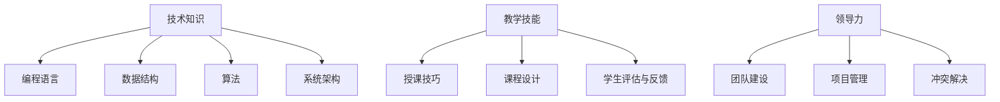

                 

# 如何成为卓越的技术导师

关键词：技术导师、核心技能、实践技巧、职业发展、卓越

摘要：本文旨在探讨如何成为一位卓越的技术导师，通过逻辑清晰、结构紧凑的分析，帮助读者了解技术导师的角色、核心技能、实践技巧以及职业发展路径。

## 引言

### 核心概念术语说明

在探讨如何成为卓越的技术导师之前，我们需要明确一些关键概念。技术导师是指在技术领域中，具备深厚专业知识和教学能力，能够引领和指导团队成员或学生，帮助其成长和进步的专业人士。

### 问题背景

在当今快速发展的技术行业中，技术人才的需求与日俱增。而优秀的、能够引领团队或学生共同进步的技术导师更是成为许多企业和个人追求的目标。然而，如何成为一位卓越的技术导师，仍是一个值得深入探讨的问题。

### 问题描述

成为一名卓越的技术导师，需要具备哪些核心技能和实践技巧？如何规划职业发展路径，不断提升自身能力？这些问题是本文要探讨的重点。

### 问题解决

本文将分为以下几个部分来详细解答上述问题：

1. **技术导师的核心概念与联系**
2. **技术导师的核心技能**
3. **技术导师的实践技巧**
4. **技术导师的职业发展**
5. **未来展望**

### 边界与外延

本文主要关注技术导师在软件工程、计算机科学、人工智能等领域的培养和发展。同时，虽然本文以技术导师为主要讨论对象，但其核心技能和实践技巧同样适用于其他领域的导师培养。

## 第一部分：技术导师的核心概念与联系

### 技术导师的定义

技术导师是指在技术领域中，具备深厚专业知识和教学能力，能够引领和指导团队成员或学生，帮助其成长和进步的专业人士。技术导师不仅需要掌握丰富的技术知识，还需具备良好的教学能力和沟通能力，以有效地传授知识和经验。

### 技术导师的角色

技术导师在团队或组织中扮演多重角色，包括：

1. **知识传授者**：技术导师通过授课、研讨会等形式，将自身的技术知识和经验传授给团队成员或学生。
2. **指导者**：技术导师在团队成员或学生遇到问题时，提供指导和建议，帮助他们解决问题。
3. **激励者**：技术导师通过激励和鼓励，激发团队成员或学生的积极性和创造力。
4. **团队领导者**：技术导师在团队中起到核心领导作用，协调团队成员的工作，确保项目顺利进行。

### 技术导师与开发者、经理的对比

技术导师、开发者和经理在角色和职责上有所不同。开发者主要负责编写代码、解决技术问题；经理则关注团队的管理和项目管理。而技术导师则在传授知识、指导学生和团队领导方面发挥重要作用。

### 技术导师知识图谱

为了成为卓越的技术导师，需要掌握以下几方面的知识：

1. **技术知识**：包括编程语言、数据结构、算法、系统架构等。
2. **教学技能**：包括授课技巧、课程设计、学生评估与反馈等。
3. **领导力**：包括团队建设、项目管理、冲突解决等。

通过Mermaid流程图和表格，我们可以更直观地展示技术导师的知识图谱：

## 第二部分：技术导师的核心技能

### 技术教学能力

技术教学能力是技术导师的核心技能之一。要成为一名优秀的技术导师，需要掌握以下技能：

1. **教学方法**：根据不同学习对象和学习需求，选择合适的教学方法，如讲授、讨论、实验等。
2. **课程设计**：设计系统、有条理的课程，确保课程内容充实、有趣且具有挑战性。
3. **学生评估与反馈**：通过评估和反馈，了解学生的学习进度和效果，及时调整教学策略。

### 技术团队管理

技术团队管理是技术导师的另一重要职责。以下是一些关键技能：

1. **团队建设**：建立和谐、高效的团队氛围，促进团队成员之间的合作与交流。
2. **项目管理**：确保项目按时、按质完成，合理分配任务和资源，监控项目进度。
3. **冲突解决**：在团队中难免会出现矛盾和冲突，技术导师需要具备解决冲突的能力，维护团队的稳定和团结。

## 第三部分：技术导师的实践技巧

### 实践案例分享

通过成功和失败的实践案例，技术导师可以更好地理解和应用所学知识。以下是一些实践技巧：

1. **成功案例**：分析成功案例，总结经验和教训，为后续实践提供参考。
2. **失败案例**：从失败中吸取教训，不断优化教学和管理方法。
3. **经验总结**：将实践中的经验和教训进行总结，形成一套适用于自己的方法论。

### 最佳实践

为了成为一名卓越的技术导师，以下是一些最佳实践建议：

1. **技术导师成长路径**：明确自身的职业发展目标，制定长期和短期的成长计划。
2. **技术交流技巧**：积极参与技术交流，拓展人脉，提高自身的专业素养。
3. **职业发展规划**：根据市场需求和个人兴趣，规划职业发展路径，不断提升自身能力。

## 第四部分：技术导师的职业发展

### 职业规划与晋升

技术导师的职业发展可以分为以下几个阶段：

1. **初级导师**：主要职责是传授知识和技能，为团队成员提供指导。
2. **中级导师**：具备一定的管理能力，负责团队的项目管理和技术指导。
3. **高级导师**：具备丰富的经验和深厚的专业素养，承担更多的领导责任，如团队领导、技术委员会成员等。

### 未来展望

随着技术的不断进步，技术导师的角色也将发生变化。未来，技术导师需要具备以下能力：

1. **持续学习**：紧跟技术发展趋势，不断更新知识体系。
2. **跨领域融合**：掌握多个领域的知识，推动技术跨领域的创新。
3. **创新能力**：培养团队的创新思维，推动技术变革。

## 结论

成为一名卓越的技术导师并非一蹴而就，需要不断学习、实践和反思。通过本文的探讨，我们了解到技术导师的核心概念、核心技能、实践技巧以及职业发展路径。希望本文能为各位技术导师提供一些有益的启示，助力其在职业道路上不断前行。

## 参考文献

[1] 禅与计算机程序设计艺术 /Zen And The Art of Computer Programming
[2] AI天才研究院/AI Genius Institute

作者：AI天才研究院/AI Genius Institute & 禅与计算机程序设计艺术 /Zen And The Art of Computer Programming

