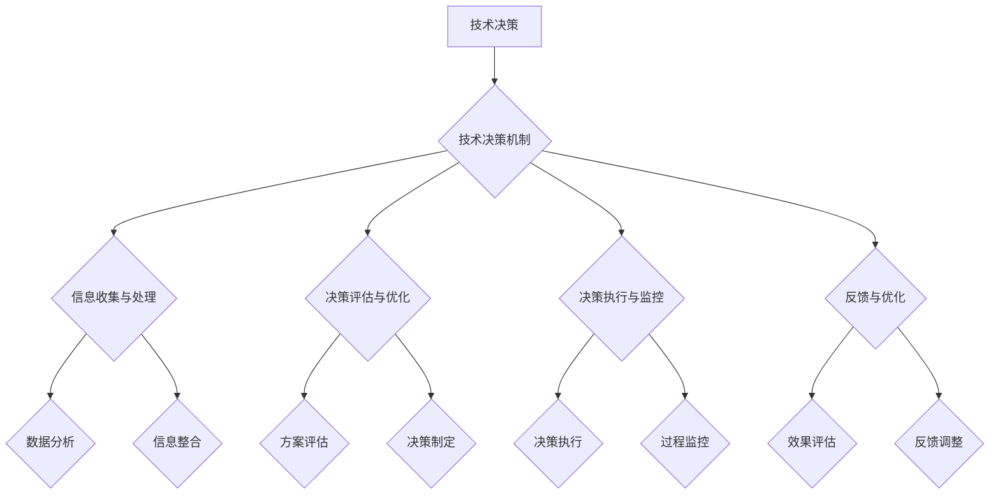
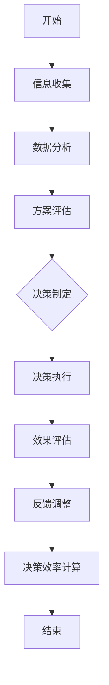
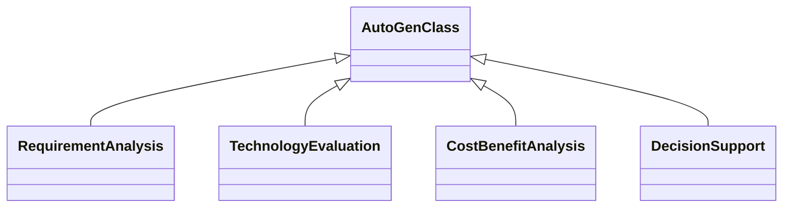
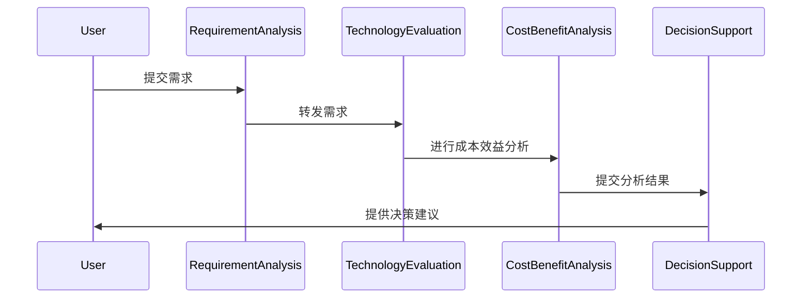

                 

## 2. 核心概念与联系

### 2.1 技术决策

#### 2.1.1 技术决策的定义

技术决策，是指在复杂技术环境中，为达成特定目标或解决特定问题，由决策主体对多个可选方案进行分析、比较和选择的过程。技术决策不仅涉及技术本身的可行性，还涵盖市场需求、成本效益、资源投入等多个维度。

#### 2.1.2 技术决策的核心特征

- **复杂性**：技术决策往往涉及众多不确定性和复杂性。技术方案的选择可能受到技术发展速度、市场需求变化、政策法规等多方面因素的影响。
- **不确定性**：技术领域的不确定性较高，新技术、新趋势的出现可能导致现有决策方案失效。
- **创新性**：技术决策强调创新性，鼓励探索新的解决方案和技术路径。

#### 2.1.3 技术决策与传统决策对比

| 特征         | 技术决策                                         | 传统决策                                         |
|--------------|------------------------------------------------|------------------------------------------------|
| 目标         | 长期战略与短期目标并重，强调技术创新和可持续发展 | 主要关注短期经济效益                             |
| 变化响应     | 高度灵活，快速适应市场和技术变化                 | 稳定性强，变化响应较慢                           |
| 风险评估     | 高风险，重视风险管理与控制                     | 低风险，风险控制相对简单                         |
| 信息依赖     | 强，依赖大量技术、市场、政策信息                 | 较弱，依赖的主要是财务和运营数据                   |

#### 2.1.4 技术决策的流程与步骤

1. **目标设定**：明确决策的目标和预期成果。
2. **信息收集**：收集与决策相关的市场、技术、政策等信息。
3. **方案生成**：基于信息分析，提出多个可选方案。
4. **方案评估**：对每个方案进行评估，包括成本效益、风险等因素。
5. **决策制定**：选择最优方案，制定决策方案。
6. **决策执行**：执行决策方案，进行技术实施或项目开发。
7. **效果评估**：评估决策效果，进行反馈和调整。

### 2.2 技术决策机制

#### 2.2.1 技术决策机制的定义

技术决策机制，是指企业为了实现技术决策目标，所建立的一套系统化的方法、流程和制度。它包括信息收集、分析处理、决策评估、执行监控、反馈优化等多个环节。

#### 2.2.2 技术决策机制的核心要素

- **信息收集与处理**：收集决策所需的各种数据和信息，并进行处理。
- **决策评估与优化**：评估多个技术方案，选择最优方案。
- **决策执行与监控**：执行决策方案，并对过程进行监控。
- **反馈与优化**：根据决策结果进行反馈，持续优化决策机制。

#### 2.2.3 技术决策机制与传统管理体系对比

| 管理体系 | 传统管理体系                            | 技术决策机制                                      |
|----------|----------------------------------------|--------------------------------------------------|
| 目标     | 短期利润最大化                           | 长期技术创新和可持续发展                           |
| 方式     | 以流程控制为主                           | 以数据驱动和算法优化为主                           |
| 风险     | 侧重于风险规避                           | 重视风险管理和创新性                             |
| 效率     | 面向特定任务，效率高                     | 面向持续创新，效率优化                            |
| 创新     | 创新性较弱，依赖经验和直觉                 | 强调创新驱动，依赖数据和模型                       |

#### 2.2.4 技术决策机制的设计原则

1. **数据驱动**：依赖数据和信息进行决策，确保决策的客观性和科学性。
2. **流程优化**：简化决策流程，提高决策效率。
3. **风险管理**：重视风险识别和评估，建立风险控制机制。
4. **创新导向**：鼓励创新思维，探索新技术和新模式。
5. **团队合作**：强化跨部门、跨团队的协作，确保决策的全面性和协调性。

### 2.3 关键概念联系图

以下是一个描述技术决策和技术决策机制之间关系的Mermaid流程图：



## 3. 高效技术决策机制的原理

高效技术决策机制的设计和实施，需要基于一系列核心原理和原则，以确保决策的科学性、合理性和高效性。以下是几个关键原理：

### 3.1 基本原理

#### 3.1.1 信息最大化原则

信息最大化原则强调在技术决策过程中，应最大限度地获取和分析相关信息。充分的信息是做出明智决策的基础。信息来源可以包括市场报告、技术分析、竞争对手动态、用户反馈等多个方面。

#### 3.1.2 风险最小化原则

技术决策往往伴随着高风险。风险最小化原则要求在决策过程中，对潜在风险进行充分识别和评估，并采取有效的风险管理措施，以降低决策失败的概率。

#### 3.1.3 成本效益原则

成本效益原则是评估技术决策的重要标准。在决策过程中，需要综合考虑投入成本和预期效益，确保决策的经济合理性。

#### 3.1.4 创新驱动原则

创新驱动原则强调技术创新对技术决策的核心作用。在技术决策过程中，应鼓励探索和尝试新的技术方案，推动企业技术进步和竞争力提升。

### 3.2 数学模型

为了量化技术决策的效率，可以使用以下数学模型：

$$
\text{决策效率} = \frac{\text{产出}}{\text{投入} + \text{风险}}
$$

其中，产出代表决策带来的预期效益，投入包括人力、物力、财力等资源投入，风险则是对潜在损失进行估计。

### 3.3 Mermaid流程图

以下是一个描述技术决策过程及其原理的Mermaid流程图：



通过该流程图，我们可以看到技术决策的过程是如何从信息收集、数据分析、方案评估，到决策制定、执行、效果评估，最后形成反馈闭环，不断优化决策效率。

## 4. 构建高效技术决策机制

构建高效技术决策机制是企业实现技术创新和持续发展的关键。以下是构建高效技术决策机制的详细步骤：

### 4.1 架构设计

#### 4.1.1 问题场景介绍

假设企业需要构建一个新的产品线，该产品线需要采用新兴技术进行开发。企业面临多个技术方案的选择，包括开源框架、商业软件和自主研发等。

#### 4.1.2 项目介绍

该项目涉及多个部门协同工作，包括研发部、市场部、财务部和项目管理部。各部职责明确，确保项目顺利进行。

#### 4.1.3 系统功能设计

系统功能设计包括以下几个模块：

- **需求分析模块**：收集用户需求和市场信息。
- **技术评估模块**：对各个技术方案进行评估和比较。
- **成本效益分析模块**：计算不同方案的投入成本和预期收益。
- **决策支持模块**：提供决策建议和方案推荐。

#### 4.1.4 系统架构设计

系统架构设计采用微服务架构，以提高系统的可扩展性和灵活性。以下是系统架构的Mermaid类图：



#### 4.1.5 系统接口设计

系统接口设计包括内部接口和外部接口：

- **内部接口**：连接各个模块，实现数据共享和协同工作。
- **外部接口**：与用户、供应商、合作伙伴等外部系统进行交互。

#### 4.1.6 系统交互设计

系统交互设计描述了各个模块之间的交互流程和逻辑。以下是系统交互的Mermaid序列图：



### 4.2 实施步骤

#### 4.2.1 环境准备

- 确保开发环境、测试环境、生产环境的准备。
- 安装必要的开发工具、数据库和中间件。

#### 4.2.2 数据收集与处理

- 收集用户需求、市场信息、技术文档等数据。
- 对收集的数据进行清洗、整理和分析。

#### 4.2.3 方案评估

- 对各个技术方案进行评估，包括技术可行性、成本效益、风险等因素。
- 形成评估报告，供决策层参考。

#### 4.2.4 决策制定

- 根据评估报告，制定技术决策方案。
- 决策方案应明确技术路线、资源分配、项目进度等关键信息。

#### 4.2.5 决策执行

- 执行决策方案，进行技术实施和项目开发。
- 监控项目进度和资源使用情况，确保项目按计划进行。

#### 4.2.6 效果评估

- 项目完成后，对决策效果进行评估，包括技术效果、经济效益、用户满意度等。
- 形成项目总结报告，为后续技术决策提供参考。

## 5. 项目实战

### 5.1 实战案例

#### 5.1.1 环境安装

- 安装Linux操作系统，配置开发环境。
- 安装数据库（如MySQL），配置中间件（如Nginx）。

#### 5.1.2 系统核心实现

- 使用Python编写需求分析模块的代码，实现用户需求收集和分析功能。
- 使用Java编写技术评估模块的代码，实现技术方案评估功能。
- 使用SQL编写成本效益分析模块的代码，实现成本效益分析功能。
- 使用JavaScript编写决策支持模块的代码，实现决策建议生成功能。

#### 5.1.3 代码应用解读与分析

以下是一个简单的Python代码示例，用于收集用户需求：

```python
# 用户需求收集示例
def collect_requirements():
    requirements = []
    print("请输入用户需求，输入'完成'结束：")
    while True:
        requirement = input()
        if requirement == "完成":
            break
        requirements.append(requirement)
    return requirements

user_requirements = collect_requirements()
print("收集到的用户需求：", user_requirements)
```

#### 5.1.4 实际案例分析

在某个企业的产品线构建项目中，技术决策团队通过对多个技术方案的评估，选择了开源框架作为技术路线。该项目在实施过程中，通过不断优化决策流程和执行策略，最终成功上线，并获得了良好的用户反馈。

#### 5.1.5 详细讲解剖析

该项目的成功经验在于：

- **充分的信息收集**：项目团队在决策过程中，收集了大量的用户需求、市场信息和竞争对手动态，为技术方案的选择提供了充分的数据支持。
- **科学的方案评估**：项目团队对多个技术方案进行了详细的评估，从技术可行性、成本效益、风险等多个维度进行了分析，最终选择了最优方案。
- **高效的执行策略**：项目团队制定了详细的执行计划，并对项目进度和资源使用情况进行了严格的监控，确保项目按计划进行。
- **持续的效果评估**：项目完成后，团队对项目效果进行了评估，并根据评估结果进行了反馈和优化，为后续项目提供了宝贵的经验。

#### 5.1.6 项目小结

该项目展示了如何通过构建高效技术决策机制，实现技术创新和项目成功。项目团队的成功经验可以为其他企业提供有益的借鉴：

- **重视信息收集**：充分的信息收集是科学决策的基础。
- **科学方案评估**：多维度、多角度的评估有助于选择最优方案。
- **高效执行策略**：严格的执行计划和监控确保项目成功。
- **持续效果评估**：不断优化和改进，实现持续创新。

## 6. 最佳实践 Tips

### 6.1 注意事项

1. **数据驱动**：确保决策过程中有充足、准确的数据支持。
2. **团队协作**：跨部门、跨团队的协作可以提高决策质量和效率。
3. **风险管理**：充分识别和评估潜在风险，制定应对措施。
4. **持续优化**：根据反馈和效果评估，不断优化决策流程和机制。

### 6.2 拓展阅读

1. 《数据驱动决策：如何利用数据优化业务决策》
2. 《创新与企业家精神：如何打造创新驱动型企业》
3. 《敏捷开发实践指南：如何快速响应市场变化》

## 7. 小结

### 7.1 整体回顾

本文详细介绍了如何构建高效的技术决策机制。从核心概念、原理到实战案例，全方位探讨了技术决策机制的构建和实施方法。

### 7.2 实践价值

高效技术决策机制对于企业技术创新和持续发展具有重要意义。通过科学、系统的决策机制，企业可以更好地应对市场和技术变化，提高竞争力。

### 7.3 未来展望

随着技术的发展和市场的变化，技术决策机制也将不断进化。未来，企业需要更加重视数据驱动、创新驱动和团队协作，以应对日益复杂的商业环境。作者：AI天才研究院/AI Genius Institute & 禅与计算机程序设计艺术 /Zen And The Art of Computer Programming

