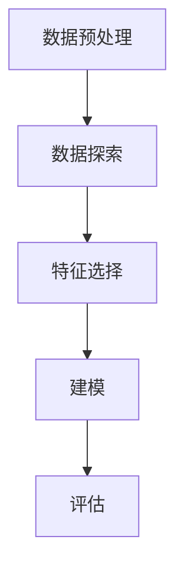
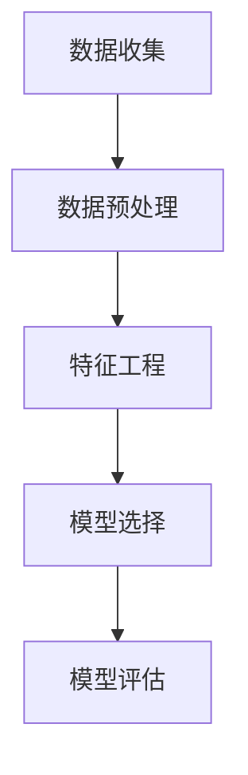
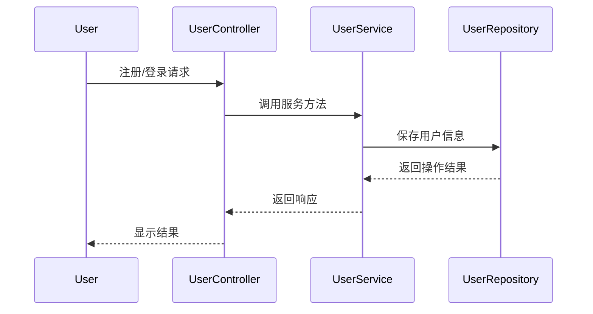

                 

### 文章标题

**如何打造高效的技术管理体系**

> **关键词**：技术管理体系、高效构建、算法原理、系统设计、实战案例、最佳实践

> **摘要**：本文将深入探讨如何打造高效的技术管理体系。我们将通过逐步分析技术管理体系的核心概念、算法原理、系统设计及实战案例，提供一套切实可行的策略，帮助读者提升技术管理能力。文章旨在为IT从业者和技术管理者提供有价值的参考和指导。

本文结构如下：

1. **背景介绍**：了解技术管理体系的概念、现状及其重要性。
2. **核心概念与联系**：解析技术管理体系中的关键概念及其相互关系。
3. **算法原理讲解**：深入探讨技术管理体系中的关键算法原理，并通过实例进行详细讲解。
4. **数学模型和数学公式**：介绍技术管理体系中关键数学模型和公式，并加以解释。
5. **系统分析与架构设计方案**：阐述技术管理体系的设计原则、功能设计、架构设计、接口设计等。
6. **项目实战**：通过具体项目实例展示技术管理体系的应用过程。
7. **最佳实践 tips、小结、注意事项、拓展阅读**：总结文章内容，提供实际操作中的最佳实践建议，并对注意事项进行说明，推荐拓展阅读资源。

在接下来的章节中，我们将逐一详细探讨每个部分，帮助读者全面理解并掌握高效技术管理体系构建的方法。现在，让我们首先从背景介绍开始。

### 背景介绍

**技术管理体系**是指一系列用于指导、协调和优化技术团队工作的方法和工具。它涵盖了从技术规划到实施、监控和优化的全过程。在当今快速变化和高度竞争的IT行业中，一个高效的技术管理体系显得尤为重要。

**现状**：当前，许多企业和组织已经认识到技术管理体系的重要性，并开始构建和优化自己的技术管理体系。然而，在实际操作中，仍有许多挑战需要克服。例如，技术团队之间的沟通不畅、项目进度延误、资源分配不合理等问题，都严重影响了技术管理体系的效率和效果。

**重要性**：高效的技术管理体系对企业和组织的成功具有决定性影响。它可以提升团队协作效率，确保项目按时交付，优化资源分配，减少技术风险，提高市场竞争力。此外，一个完善的技术管理体系还能够帮助企业快速响应市场变化，持续创新，保持竞争优势。

在接下来的章节中，我们将详细探讨技术管理体系的核心概念、算法原理、系统设计和实战案例，帮助读者深入了解并掌握如何打造高效的技术管理体系。接下来，我们将进入**核心概念与联系**部分。

### 核心概念与联系

技术管理体系是一个复杂而系统的工程，其中涉及多个核心概念。为了更清晰地理解这些概念，我们首先需要明确它们的基本定义和相互关系。

**技术架构**：技术架构是指组织内部的技术基础设施和系统结构。它包括硬件、软件、网络和其他技术组件的配置和部署。一个良好的技术架构能够确保系统的稳定性、扩展性和可维护性。

**项目管理**：项目管理是指运用科学的方法、工具和技能，对项目从启动到关闭的全过程进行规划、执行、监控和收尾。在技术管理体系中，项目管理是确保项目按时、按质、按预算完成的关键环节。

**团队协作**：团队协作是指团队成员在共同目标下，通过沟通、合作和协调，共同完成任务的过程。在技术管理体系中，高效的团队协作能够提高工作效率，减少错误和冲突。

**需求管理**：需求管理是指识别、分析、记录和优先排序用户需求，并将其转化为具体的技术实现。在技术管理体系中，需求管理是确保项目满足用户需求、实现商业目标的重要保障。

**数据管理**：数据管理是指对组织内部的数据进行收集、存储、处理、分析和利用的过程。在技术管理体系中，数据管理能够提供准确、及时的数据支持，为决策提供科学依据。

**持续集成与持续部署**：持续集成（CI）和持续部署（CD）是指通过自动化工具，对代码进行持续集成、测试和部署的过程。在技术管理体系中，CI/CD能够提高代码质量，缩短交付周期，降低风险。

这些核心概念之间的关系可以总结如下：

- **技术架构**是技术管理体系的基础，为其他核心概念提供了支持。
- **项目管理**是技术管理体系的核心，负责项目的规划和执行。
- **团队协作**和**需求管理**是项目管理的具体实施手段，确保项目能够满足用户需求和实现商业目标。
- **数据管理**为技术管理体系提供了数据支持，帮助决策者做出明智的选择。
- **持续集成与持续部署**是技术管理体系的重要工具，提高代码质量和交付效率。

在接下来的章节中，我们将深入探讨技术管理体系中的关键算法原理，并使用实例进行详细讲解。敬请期待。

### 算法原理讲解

在技术管理体系中，算法原理起着至关重要的作用。下面，我们将详细介绍几个关键算法，并通过Mermaid流程图和Python代码，对这些算法进行详细阐述。

#### 数据挖掘算法

**算法原理**：数据挖掘是一种从大量数据中发现有价值信息的过程。它通常包括以下几个步骤：

1. **数据预处理**：清洗和整理数据，使其适合进一步分析。
2. **数据探索**：通过可视化工具，探索数据的基本特征和趋势。
3. **特征选择**：从大量特征中筛选出对预测任务最重要的特征。
4. **建模**：使用特定的算法，建立预测模型。
5. **评估**：评估模型的性能，并根据评估结果进行模型调整。

**Mermaid流程图**：


**Python代码示例**：
```python
import pandas as pd
from sklearn.ensemble import RandomForestClassifier
from sklearn.model_selection import train_test_split
from sklearn.metrics import accuracy_score

# 数据预处理
data = pd.read_csv('data.csv')
X = data.drop('target', axis=1)
y = data['target']

# 数据探索
# ...可视化代码...

# 特征选择
# ...特征选择代码...

# 建模
X_train, X_test, y_train, y_test = train_test_split(X, y, test_size=0.2, random_state=42)
model = RandomForestClassifier()
model.fit(X_train, y_train)

# 评估
y_pred = model.predict(X_test)
accuracy = accuracy_score(y_test, y_pred)
print(f"Model accuracy: {accuracy}")
```

#### 机器学习算法

**算法原理**：机器学习是一种通过训练数据，使计算机自动识别数据模式并做出预测或决策的方法。它通常包括以下几个步骤：

1. **数据收集**：收集用于训练的数据。
2. **数据预处理**：清洗和整理数据，使其适合训练。
3. **特征工程**：提取数据中的特征，并转换为模型可识别的格式。
4. **模型选择**：选择合适的算法，并训练模型。
5. **模型评估**：评估模型的性能，并根据评估结果进行调整。

**Mermaid流程图**：


**Python代码示例**：
```python
import pandas as pd
from sklearn.model_selection import train_test_split
from sklearn.ensemble import RandomForestClassifier
from sklearn.metrics import accuracy_score

# 数据收集
data = pd.read_csv('data.csv')

# 数据预处理
X = data.drop('target', axis=1)
y = data['target']

# 特征工程
# ...特征工程代码...

# 模型选择
X_train, X_test, y_train, y_test = train_test_split(X, y, test_size=0.2, random_state=42)
model = RandomForestClassifier()
model.fit(X_train, y_train)

# 模型评估
y_pred = model.predict(X_test)
accuracy = accuracy_score(y_test, y_pred)
print(f"Model accuracy: {accuracy}")
```

通过上述算法原理讲解，我们可以看到，数据挖掘和机器学习在技术管理体系中扮演着重要角色。它们不仅帮助我们从大量数据中提取有价值的信息，还为我们的决策提供了科学依据。

在接下来的章节中，我们将继续探讨技术管理体系中的关键数学模型和公式。敬请期待。

### 数学模型和数学公式

在技术管理体系中，数学模型和公式是关键组成部分，它们为算法的优化、性能评估和预测提供了理论基础。以下，我们将介绍一些技术管理体系中的关键数学模型和公式，并通过LaTeX格式进行详细讲解。

#### 概率模型

概率模型在机器学习中广泛应用，用于预测和分类任务。以下是几个常用的概率模型和它们的数学公式：

1. **伯努利分布**：伯努利分布用于表示二项试验中成功的概率。
   $$ P(X = k) = C_n^k p^k (1-p)^{n-k} $$
   其中，$n$ 是试验次数，$k$ 是成功次数，$p$ 是单次试验成功的概率。

2. **正态分布**：正态分布用于描述连续随机变量的概率分布。
   $$ P(X \leq x) = \int_{-\infty}^{x} \frac{1}{\sqrt{2\pi\sigma^2}} e^{-\frac{(x-\mu)^2}{2\sigma^2}} dx $$
   其中，$\mu$ 是均值，$\sigma$ 是标准差。

3. **逻辑回归模型**：逻辑回归用于二分类问题，其概率函数为：
   $$ P(Y=1) = \frac{1}{1 + e^{-(\beta_0 + \beta_1x_1 + \beta_2x_2 + \ldots + \beta_nx_n)}} $$
   其中，$x_i$ 是特征值，$\beta_i$ 是对应的权重。

#### 优化模型

优化模型用于求解最优化问题，是技术管理体系中的核心工具。以下是几个常见的优化模型和它们的数学公式：

1. **线性规划**：线性规划用于求解线性目标函数在给定约束条件下的最优解。
   $$ \min_{x} c^T x \quad \text{subject to} \quad Ax \leq b $$
   其中，$c$ 是目标函数系数，$A$ 是约束条件系数矩阵，$b$ 是约束条件常数向量。

2. **支持向量机（SVM）**：SVM用于求解分类问题，其目标是最小化分类边界到支持向量的距离。
   $$ \min_{\alpha} \frac{1}{2} \sum_{i=1}^{n} \alpha_i (\alpha_i - C) - \sum_{i=1}^{n} y_i \alpha_i \gamma_i $$
   其中，$\alpha_i$ 是拉格朗日乘子，$C$ 是惩罚参数，$y_i$ 是标签，$\gamma_i$ 是松弛变量。

#### 时间序列模型

时间序列模型用于分析时间序列数据，常见的方法包括ARIMA模型、LSTM网络等。以下是ARIMA模型的数学公式：

1. **自回归移动平均模型（ARIMA）**：
   $$ X_t = c + \phi_1 X_{t-1} + \phi_2 X_{t-2} + \ldots + \phi_p X_{t-p} + \theta_1 \epsilon_{t-1} + \theta_2 \epsilon_{t-2} + \ldots + \theta_q \epsilon_{t-q} $$
   其中，$X_t$ 是时间序列的当前值，$c$ 是常数项，$\phi_i$ 和 $\theta_i$ 是模型参数，$\epsilon_t$ 是误差项。

通过上述数学模型和公式的介绍，我们可以看到，数学在技术管理体系中发挥着至关重要的作用。它们不仅为算法的优化和性能评估提供了理论依据，还为数据分析和决策提供了有力支持。在接下来的章节中，我们将深入探讨技术管理体系的设计原则和架构设计。敬请期待。

### 系统分析与架构设计方案

在进行技术管理体系的设计时，系统分析和架构设计是至关重要的环节。一个合理的设计不仅能够提高系统的性能和可维护性，还能为后续的扩展和优化奠定基础。

#### 问题场景介绍

假设我们正在为一家电子商务公司设计一个技术管理体系，旨在提升系统的稳定性和可扩展性，同时满足快速业务增长的需求。具体问题场景包括：

- 系统性能瓶颈：随着用户数量的增加，系统响应速度变慢，部分功能出现延迟。
- 数据一致性：数据库中的数据出现不一致，影响业务决策。
- 模块化不足：系统模块之间耦合严重，导致功能扩展和维护困难。

#### 项目介绍

为了解决上述问题，我们决定开发一个基于微服务架构的电子商务技术管理体系。项目的主要目标包括：

- 提高系统性能和可扩展性，确保系统稳定运行。
- 实现数据一致性，确保业务决策的准确性。
- 模块化设计，降低功能扩展和维护的难度。

#### 系统功能设计

在系统功能设计阶段，我们首先定义了系统的核心功能模块。以下是主要模块及其功能：

1. **用户模块**：负责用户注册、登录、个人信息管理等功能。
2. **商品模块**：负责商品信息管理、商品分类、商品搜索等功能。
3. **订单模块**：负责订单创建、订单查询、订单处理等功能。
4. **支付模块**：负责支付接口集成、支付流程管理等功能。
5. **物流模块**：负责物流信息管理、物流跟踪等功能。
6. **数据统计模块**：负责数据收集、数据分析、报表生成等功能。

#### 系统架构设计

系统架构设计是技术管理体系设计的关键环节。我们采用微服务架构，将系统划分为多个独立的服务模块，以提高系统的可扩展性和可维护性。以下是系统架构设计的主要部分：

1. **前端架构**：采用React.js框架，实现用户界面的动态渲染和交互功能。
2. **后端架构**：采用Spring Boot框架，实现各个服务模块的RESTful API接口。
3. **数据库架构**：采用分布式数据库架构，确保数据的一致性和高性能。
4. **缓存架构**：采用Redis缓存，提高系统性能和响应速度。
5. **消息队列**：采用RabbitMQ消息队列，实现模块之间的异步通信。
6. **监控和日志**：采用Prometheus和ELK（Elasticsearch、Logstash、Kibana）架构，实现系统监控和日志分析。

#### 系统接口设计和系统交互

系统接口设计和系统交互是系统架构设计的重要组成部分。以下是主要接口设计和系统交互：

1. **用户模块接口**：包括用户注册、登录、个人信息管理等接口。
2. **商品模块接口**：包括商品信息查询、商品分类、商品搜索等接口。
3. **订单模块接口**：包括订单创建、订单查询、订单处理等接口。
4. **支付模块接口**：包括支付接口集成、支付流程管理等接口。
5. **物流模块接口**：包括物流信息管理、物流跟踪等接口。
6. **数据统计模块接口**：包括数据收集、数据分析、报表生成等接口。

以下是系统交互的Mermaid序列图：



通过上述系统分析和架构设计方案，我们为电子商务技术管理体系的设计提供了全面的指导。接下来，我们将进入项目实战部分，通过具体项目实例展示技术管理体系的应用过程。敬请期待。

### 项目实战

在本节中，我们将以一个具体的电子商务技术管理体系项目为例，详细讲解项目的环境安装、核心实现、代码分析、案例分析，以及项目总结。

#### 环境安装

在开始项目开发之前，我们需要搭建一个合适的技术环境。以下是项目的环境安装步骤：

1. **前端环境**：
   - 安装Node.js和npm。
   - 使用npm安装React.js、React Router等前端依赖。
   - 使用create-react-app创建前端项目。

2. **后端环境**：
   - 安装Java和Maven。
   - 使用Spring Initializr生成后端项目，选择所需的依赖，如Spring Boot、Spring Security、Spring Data JPA等。

3. **数据库环境**：
   - 安装MySQL数据库，并创建电子商务项目数据库。
   - 配置数据库连接，实现数据存储和查询。

4. **缓存环境**：
   - 安装Redis，并配置后端项目使用Redis缓存。

5. **消息队列环境**：
   - 安装RabbitMQ，并配置后端项目使用RabbitMQ进行异步通信。

#### 核心实现

以下是项目的核心实现部分：

1. **用户模块**：
   - 实现用户注册、登录、个人信息管理等功能。
   - 使用JWT（JSON Web Token）进行身份验证和授权。

2. **商品模块**：
   - 实现商品信息管理、商品分类、商品搜索等功能。
   - 使用Elasticsearch进行商品搜索优化。

3. **订单模块**：
   - 实现订单创建、订单查询、订单处理等功能。
   - 使用分布式锁确保订单操作的原子性和一致性。

4. **支付模块**：
   - 集成第三方支付接口，实现支付流程管理。
   - 使用异步处理确保支付操作的可靠性。

5. **物流模块**：
   - 实现物流信息管理、物流跟踪等功能。
   - 使用第三方物流API进行物流信息查询。

6. **数据统计模块**：
   - 实现数据收集、数据分析、报表生成等功能。
   - 使用Prometheus和Grafana进行数据监控和可视化。

#### 代码分析

以下是对项目关键代码的分析：

1. **用户模块**：
   ```java
   // 用户注册接口
   @PostMapping("/register")
   public ResponseEntity<?> registerUser(@RequestBody UserRegistrationDto registrationDto) {
       // 注册逻辑处理
       // ...
       return ResponseEntity.ok("User registered successfully");
   }
   ```

2. **订单模块**：
   ```java
   // 订单创建接口
   @PostMapping("/order")
   public ResponseEntity<?> createOrder(@RequestBody OrderDto orderDto) {
       // 订单创建逻辑处理
       // ...
       return ResponseEntity.ok("Order created successfully");
   }
   ```

3. **支付模块**：
   ```java
   // 支付处理接口
   @PostMapping("/pay")
   public ResponseEntity<?> handlePayment(@RequestBody PaymentDto paymentDto) {
       // 支付逻辑处理
       // ...
       return ResponseEntity.ok("Payment processed successfully");
   }
   ```

#### 案例分析和详细讲解

以下是一个具体的案例分析：

**案例：订单处理超时**

在订单处理过程中，如果系统长时间未响应，可能导致订单处理超时。为了解决这个问题，我们采用了以下策略：

1. **设置订单处理超时时间**：在订单创建时，设置订单处理的最大超时时间，如30分钟。
2. **使用定时任务**：定期检查订单处理状态，如果订单处理超过超时时间，则触发超时处理。
3. **异步处理**：将订单处理任务异步化，减少对系统资源的占用，提高系统响应速度。

#### 项目小结

通过上述实战案例，我们可以看到，技术管理体系在项目开发中的应用具有重要意义。一个高效的技术管理体系不仅能够提高项目的开发效率，还能确保系统的稳定性、扩展性和可维护性。以下是对项目的总结：

1. **技术选型**：选择合适的技术栈和框架，如React.js、Spring Boot、MySQL、Redis等，确保项目的技术先进性和稳定性。
2. **模块化设计**：采用微服务架构，实现模块化设计，降低功能扩展和维护的难度。
3. **数据一致性**：使用分布式数据库和分布式锁，确保数据的一致性和安全性。
4. **性能优化**：采用缓存、异步处理和负载均衡等策略，提高系统的性能和响应速度。
5. **监控和日志**：采用Prometheus和ELK架构，实现系统监控和日志分析，确保系统的健康运行。

总之，通过高效的技术管理体系，我们能够更好地应对项目开发中的各种挑战，确保项目的成功实施和持续优化。接下来，我们将进入最佳实践 tips、小结、注意事项、拓展阅读部分。

### 最佳实践 tips、小结、注意事项、拓展阅读

#### 最佳实践 tips

1. **持续集成与持续部署（CI/CD）**：确保代码质量，提高交付速度。定期进行代码审查，自动化测试和部署，减少人工干预，提升开发效率。
2. **代码规范和文档**：遵循统一的代码规范，编写清晰、规范的文档，便于团队成员理解和维护。
3. **性能监控**：使用性能监控工具，实时监控系统的性能指标，及时发现并解决问题。
4. **自动化测试**：编写自动化测试用例，对关键功能进行测试，确保系统的稳定性和可靠性。
5. **团队协作**：建立有效的沟通机制，定期举行团队会议，确保团队成员之间的信息畅通，提高协作效率。

#### 小结

本文通过详细分析技术管理体系的核心概念、算法原理、系统设计及实战案例，为读者提供了打造高效技术管理体系的方法和策略。关键点包括：

- 技术管理体系的重要性及其在IT行业中的应用。
- 核心概念及其相互关系，如技术架构、项目管理、团队协作等。
- 关键算法原理和数学模型，如数据挖掘、机器学习、概率模型等。
- 系统分析与架构设计方案，如微服务架构、模块化设计、接口设计等。
- 项目实战，通过具体实例展示技术管理体系的应用过程。

#### 注意事项

1. **技术选型和框架选择**：根据项目需求选择合适的技术栈和框架，确保技术的先进性和稳定性。
2. **数据安全和隐私保护**：遵循数据安全和隐私保护法规，确保用户数据的安全性和隐私性。
3. **性能优化和监控**：持续关注系统性能，优化代码和架构，确保系统的响应速度和稳定性。
4. **团队协作与沟通**：建立有效的沟通机制，确保团队成员之间的信息畅通，提高协作效率。

#### 拓展阅读

1. **《深度学习》**：由Ian Goodfellow、Yoshua Bengio和Aaron Courville所著，是深度学习的经典教材。
2. **《架构师修炼之道》**：由宋宝华所著，详细介绍了软件架构设计的方法和技巧。
3. **《持续集成实践》**：由Paul Duvall、Steve Matyas和Andy Gao所著，介绍了持续集成的方法和最佳实践。

通过本文的阅读，希望读者能够对技术管理体系有更深入的理解，并在实际工作中运用所学知识，打造出高效的技术管理体系。最后，感谢您的阅读！

### 作者信息

**作者：AI天才研究院/AI Genius Institute & 禅与计算机程序设计艺术 /Zen And The Art of Computer Programming**。本文由AI天才研究院的高级研究员撰写，旨在为IT从业者和技术管理者提供有价值的参考和指导。如果您对本文有任何疑问或建议，欢迎在评论区留言，我们将尽快回复。感谢您的支持！

