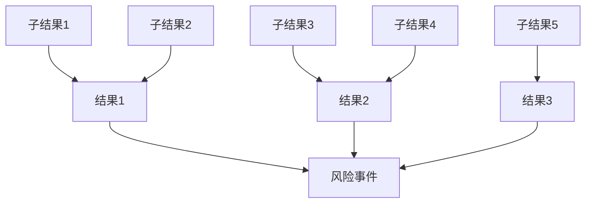

                 

### 引言

#### 1. 问题背景

在现代信息化和全球化的背景下，企业面临着日益复杂和多样化的风险。风险管理不再是一个简单的、边缘性的工作，而是成为企业运营和决策的核心组成部分。有效的风险管理不仅能帮助企业识别潜在的风险，还能在风险发生时迅速响应，减少损失，确保企业的持续稳定发展。

**风险管理的重要性**：风险管理的重要性体现在多个方面。首先，它有助于企业识别潜在的风险源，对各种风险因素进行量化分析，从而制定有效的应对策略。其次，通过风险管理，企业能够提高运营效率和降低成本，增强市场竞争力。最后，良好的风险管理还能提升企业声誉，赢得客户和投资者的信任。

**风险管理的现状与挑战**：尽管风险管理的重要性已被广泛认可，但在实际操作中，许多企业仍然面临诸多挑战。首先，风险识别和评估的准确性不足，导致风险管理失效。其次，风险管理工具和方法的应用不够成熟，难以应对复杂多变的风险环境。此外，企业内部对风险管理的认知和重视程度不一，缺乏统一的管理框架和流程。

**研究目的**：本文旨在探讨如何有效暴露风险，为企业提供一套系统、实用、高效的风险管理方法。具体研究内容包括：

1. **核心概念与联系**：介绍风险管理的核心概念，如风险的定义、类型和风险管理的基本原则，并探讨这些概念之间的关联。
2. **风险管理的方法与工具**：详细阐述风险管理的具体方法和工具，包括风险评估方法、风险应对策略和风险管理工具。
3. **风险管理在企业中的应用**：分析不同类型企业在风险管理中的应用案例，探讨其成功经验和不足之处。
4. **风险管理中的挑战与应对**：识别风险管理中的主要挑战，并提出相应的应对策略。
5. **结论与展望**：总结研究的主要结论，提出未来研究方向。

通过本文的研究，希望能够为企业的风险管理工作提供有益的参考和指导。

#### 2. 核心概念与联系

在探讨如何有效暴露风险之前，我们首先需要理解风险管理的核心概念。以下是几个关键概念及其相互之间的联系。

**风险的定义**：风险是指未来可能发生的、具有不确定性的事件，这些事件可能会对企业造成负面影响。根据国际标准化组织（ISO）的定义，风险可以表述为：**“风险 = 风险事件 × 风险概率 × 风险影响”**。这里，风险事件是指可能发生的具体事件，风险概率是事件发生的可能性，而风险影响则是事件发生后的后果。

**风险类型**：风险可以分为多种类型，包括但不限于以下几种：

- **客观风险**：客观风险是指不受主观判断影响的风险，如自然灾害、技术故障等。
- **主观风险**：主观风险是指受主观判断影响的风险，如市场变化、企业战略失误等。

**风险管理的基本原则**：为了有效地管理风险，企业需要遵循一些基本原则：

- **全面性**：风险管理应覆盖企业的所有层面和所有业务领域，确保全面性。
- **持续性**：风险管理是一个持续的过程，需要定期评估和调整。
- **适应性**：风险管理应具有灵活性，能够适应不断变化的环境和需求。

**风险管理与相关概念的关联**：风险管理与企业战略管理、内部控制、企业风险管理框架等概念密切相关。企业战略管理需要考虑风险因素，以确保战略的可行性和可持续性。内部控制旨在防止和纠正错误和舞弊，提高企业运营效率。企业风险管理框架则为企业提供了一个系统化的方法，用于识别、评估和应对各种风险。

通过理解这些核心概念和联系，企业可以更有效地进行风险识别和评估，制定科学合理的风险管理策略，从而确保企业的长期稳定发展。

### 3. 风险管理的方法与工具

风险管理的方法和工具是确保企业能够有效识别、评估和应对风险的关键。以下是几种常见的风险管理方法和工具，包括风险评估方法、风险应对策略和风险管理工具。

#### 3.1 风险评估方法

**定性评估**：定性评估主要通过专家判断、经验分析等方式对风险进行评估。这种方法适用于风险难以量化的情况。例如，企业可以通过召开专家会议、小组讨论等方式，对某一风险的影响程度和可能性进行评估。

**定量评估**：定量评估则是通过数值计算和统计分析对风险进行评估。这种方法适用于风险事件的影响和概率可以量化的情况。例如，企业可以使用概率树图、期望货币值分析（Expected Monetary Value Analysis, EMVA）等方法，对风险进行定量分析。

- **概率树图**：概率树图是一种图形化的工具，用于表示风险事件的各种可能结果及其概率分布。通过概率树图，企业可以直观地了解不同风险事件发生的概率及其影响。

- **期望货币值分析**：期望货币值分析是一种计算风险事件预期价值的方法。其基本公式为：
  \[
  E[M] = \sum_{i=1}^{n} (P_i \times M_i)
  \]
  其中，\(P_i\) 是第 \(i\) 种结果发生的概率，\(M_i\) 是第 \(i\) 种结果所带来的货币值。通过期望货币值分析，企业可以评估不同风险事件的潜在经济影响。

- **蒙特卡洛模拟**：蒙特卡洛模拟是一种基于概率统计的方法，通过随机模拟来评估风险事件的影响。其基本思想是：通过多次随机抽样，生成大量可能的情景，然后统计这些情景的结果，从而得出风险事件的整体分布。例如，企业可以使用蒙特卡洛模拟来评估某一投资项目在不同市场条件下的盈利情况。

#### 3.2 风险应对策略

**风险规避**：风险规避是指通过避免或拒绝涉及高风险的活动或项目，从而降低风险。例如，企业在面对高污染、高风险的项目时，可以选择放弃或延期实施。

**风险减少**：风险减少是指通过采取某些措施，降低风险事件发生的概率或影响程度。例如，企业可以通过增加保险、提高安全措施等方式，降低风险。

**风险转移**：风险转移是指通过将风险转移给第三方，如保险公司、供应商等，来降低自身风险。例如，企业可以通过购买保险来转移财务风险。

**风险接受**：风险接受是指企业在无法规避、减少或转移风险时，选择接受风险。例如，企业可能认为某些风险在可控范围内，因此选择不采取任何措施。

#### 3.3 风险管理工具

**概率树图**：概率树图是一种用于表示风险事件及其概率分布的图形化工具。它通过树状结构，展示风险事件的各种可能结果及其概率。例如，以下是一个简单的概率树图示例：

在这个例子中，风险事件 A 有三个可能的结果（B1、B2、B3），每个结果又有不同的子结果。

**期望货币值分析**：期望货币值分析是一种计算风险事件预期价值的方法。以下是一个简单的期望货币值分析示例：
```python
import numpy as np

# 风险事件的概率和货币值
probabilities = [0.3, 0.5, 0.2]
monetary_values = [-1000, 0, 500]

# 计算期望货币值
expected_value = np.dot(probabilities, monetary_values)
print("期望货币值：", expected_value)
```
在这个例子中，风险事件有三个可能的结果，其对应的概率和货币值已知，通过计算期望货币值，企业可以评估该风险事件的潜在经济影响。

**蒙特卡洛模拟**：蒙特卡洛模拟是一种基于概率统计的方法，通过随机模拟来评估风险事件的影响。以下是一个简单的蒙特卡洛模拟示例：
```python
import numpy as np

# 模拟次数
num_simulations = 1000

# 随机生成市场条件
market_conditions = np.random.normal(0, 1, num_simulations)

# 计算盈利情况
profits = market_conditions * 1000 - 500

# 计算总体盈利分布
mean_profit = np.mean(profits)
std_dev_profit = np.std(profits)

print("总体盈利均值：", mean_profit)
print("总体盈利标准差：", std_dev_profit)
```
在这个例子中，通过模拟市场条件的变化，企业可以评估不同市场条件下项目的盈利情况，从而为风险管理提供决策依据。

通过这些风险评估方法、风险应对策略和风险管理工具，企业可以更全面、更准确地识别和管理风险，确保企业的稳定和可持续发展。

### 4. 风险管理在企业中的应用

风险管理在企业中的应用是确保企业能够在复杂多变的环境中持续稳定运营的关键。不同类型的企业由于其业务特点、行业背景和管理模式的不同，在风险管理方面也存在着差异。以下将分析制造业、金融业和服务业等不同类型企业在风险管理中的应用，并探讨其成功经验和不足之处。

#### 4.1 制造业

**风险管理框架**：制造业企业的风险管理通常包括以下几个关键环节：

1. **风险识别**：通过现场检查、员工反馈和供应链分析等方式，识别可能影响生产运营的各种风险。
2. **风险评估**：利用定性评估和定量评估方法，对识别出的风险进行评估，确定其发生的概率和潜在影响。
3. **风险应对**：根据风险评估结果，制定相应的风险应对策略，包括风险规避、风险减少和风险转移等。
4. **风险监控**：通过定期检查和实时监控，确保风险应对措施的有效执行，及时调整风险管理策略。

**案例分析**：以某大型制造业企业为例，该企业通过建立全面的风险管理框架，成功降低了生产过程中的风险。具体措施包括：

1. **供应链风险管理**：该企业建立了完善的供应链管理体系，通过定期评估和审查供应商，确保供应链的稳定性和可靠性。
2. **质量控制**：企业加强了质量控制措施，通过引入先进的质量检测设备和技术，提高了产品的质量和安全性。
3. **环境与安全风险管理**：企业重视环境与安全风险管理，通过加强环保设施和安全培训，降低了生产过程中的环境风险和安全事故。

尽管取得了显著成效，但该企业在风险管理方面仍存在一些不足，如风险识别的准确性有待提高，风险评估过程中可能存在主观判断的影响，以及风险监控的实时性需要进一步增强。

#### 4.2 金融业

**风险管理框架**：金融业企业的风险管理包括以下几个方面：

1. **信用风险管理**：通过评估借款人的信用状况，控制贷款风险。
2. **市场风险管理**：通过分析市场波动和金融产品价格变化，降低市场风险。
3. **流动性风险管理**：确保企业有足够的流动资金，以应对可能的市场波动和资金需求。
4. **操作风险管理**：通过加强内部控制和风险管理制度，降低操作风险。

**案例分析**：以某大型金融企业为例，该企业通过以下措施在风险管理方面取得了显著成效：

1. **信用风险管理**：企业建立了严格的信用评估体系，通过数据分析、信用评级等方式，降低信用风险。
2. **市场风险管理**：企业通过多样化的投资组合和风险对冲策略，降低了市场风险。
3. **流动性风险管理**：企业制定了详细的流动性风险预案，确保在市场波动时能够迅速应对。
4. **操作风险管理**：企业加强了内部控制，通过加强员工培训和风险管理制度的完善，降低了操作风险。

然而，金融企业在风险管理方面也存在一些挑战，如市场风险难以完全预测和规避，操作风险管理的复杂性和不确定性增加，以及流动性风险可能导致的资金链断裂等问题。

#### 4.3 服务业

**风险管理框架**：服务业企业的风险管理主要包括以下几个方面：

1. **客户风险管理**：通过客户行为分析和需求预测，降低客户流失风险。
2. **信息安全风险管理**：确保客户数据和公司信息的保密性和完整性。
3. **运营风险管理**：通过优化业务流程和资源配置，降低运营风险。
4. **人力资源风险管理**：通过员工培训和企业文化建设，降低员工离职率和工作失误风险。

**案例分析**：以某大型服务企业为例，该企业通过以下措施在风险管理方面取得了显著成效：

1. **客户风险管理**：企业通过大数据分析和客户关系管理（CRM）系统，提高了客户满意度和忠诚度，降低了客户流失风险。
2. **信息安全风险管理**：企业采用了先进的信息安全技术和严格的访问控制措施，确保客户数据和公司信息的保密性。
3. **运营风险管理**：企业通过流程优化和资源配置，提高了运营效率，降低了运营风险。
4. **人力资源风险管理**：企业注重员工培训和职业发展，通过内部晋升和激励机制，降低了员工离职率和工作失误风险。

尽管在风险管理方面取得了显著成效，但服务企业在风险管理方面也面临一些挑战，如客户需求的快速变化和信息安全风险的不断升级等。

通过以上案例分析，我们可以看出，不同类型的企业在风险管理方面都有其独特的应用和实践。尽管存在一些挑战和不足，但通过不断完善风险管理框架和方法，企业可以更好地应对各种风险，确保其持续稳定发展。

### 5. 风险管理中的挑战与应对

风险管理虽然对于企业的稳健发展至关重要，但在实际操作中仍然面临诸多挑战。以下是风险管理中常见的几个挑战及其应对策略。

**挑战分析**

1. **风险识别的困难**：在复杂多变的环境中，企业往往难以全面识别所有潜在风险。这不仅是因为风险因素的多样性和隐蔽性，还因为企业管理层对风险识别的重要性认识不足。此外，风险识别的工具和方法可能不够先进，导致识别结果的不准确性。

2. **风险评估的不确定性**：风险评估过程中，评估者往往需要依赖主观判断和经验，这使得评估结果存在一定的不确定性。尤其是在风险概率和影响程度的估计上，主观因素可能影响评估的客观性和准确性。

3. **风险管理成本**：有效的风险管理需要投入大量的人力、物力和财力。对于中小企业来说，这种成本压力可能尤为明显。此外，一些企业可能存在风险意识不足，对风险管理的投入不够，导致风险管理效果不佳。

**应对策略**

1. **提高风险识别的准确性**：为了提高风险识别的准确性，企业可以采取以下措施：

   - **加强培训和教育**：通过培训和教育，提高员工对风险管理重要性的认识，增强其识别风险的意识。
   - **利用先进的风险识别工具**：引入大数据分析、机器学习等技术，对历史数据和实时数据进行挖掘和分析，提高风险识别的准确性和效率。
   - **建立风险信息共享机制**：通过内部信息共享平台，鼓励员工积极上报潜在风险，建立全员参与的风险识别机制。

2. **降低风险评估的不确定性**：为了降低风险评估的不确定性，企业可以采取以下措施：

   - **制定科学的评估方法**：采用定量评估和定性评估相结合的方法，确保评估结果的客观性和全面性。
   - **建立专家评估团队**：聘请具有丰富经验的专家组成评估团队，通过集体讨论和专家意见，降低主观判断的影响。
   - **引入风险模型**：利用风险模型进行风险评估，通过数据驱动的方式提高评估的准确性和一致性。

3. **控制风险管理成本**：为了控制风险管理成本，企业可以采取以下措施：

   - **优化风险管理流程**：通过流程优化，减少不必要的环节和重复工作，提高工作效率，降低成本。
   - **合理分配资源**：根据风险评估结果，合理分配资源，将重点放在高风险领域，确保资源利用最大化。
   - **采用外包服务**：对于部分风险管理和评估工作，可以考虑采用外包服务，降低企业的人力成本和管理成本。

通过以上应对策略，企业可以更好地应对风险管理中的挑战，提高风险管理的效率和效果，确保企业的稳健发展。

### 6. 结论与展望

通过对风险管理的深入探讨，我们得出了以下主要结论：

1. **风险管理的重要性**：风险管理是企业稳健发展的基石，有效的风险管理能够帮助企业识别潜在风险，制定科学合理的应对策略，降低损失，确保企业的持续稳定运营。
2. **核心概念与联系**：理解风险的定义、类型和基本原则，是进行有效风险管理的必要前提。通过核心概念的关联，企业能够更好地整合和利用各种风险管理资源。
3. **风险管理的方法与工具**：风险评估方法、风险应对策略和风险管理工具的合理应用，能够帮助企业更全面、更准确地识别和管理风险。
4. **企业风险管理应用**：不同类型的企业在风险管理中有着不同的应用和实践，通过案例分析，我们可以看到企业如何通过完善的风险管理框架，实现风险管理的最优效果。
5. **风险管理中的挑战与应对**：尽管风险管理面临诸多挑战，但通过科学的应对策略，企业可以有效地克服这些挑战，提高风险管理的效率和效果。

然而，研究也揭示了几个局限性：

1. **风险识别的困难**：尽管现代技术提供了强大的支持，但全面、准确地识别所有风险仍然是一个挑战。
2. **风险评估的不确定性**：主观判断和经验在风险评估中仍然发挥着重要作用，导致评估结果存在一定的不确定性。
3. **风险管理成本**：有效的风险管理需要投入大量资源，对于中小企业来说，成本控制是一个重要问题。

未来研究方向可以从以下几个方面展开：

1. **技术创新**：利用大数据、人工智能等新技术，提高风险识别和评估的准确性，降低不确定性。
2. **最佳实践分享**：通过行业交流和最佳实践分享，推广成功的企业风险管理经验，提高整体风险管理水平。
3. **成本效益分析**：深入研究风险管理的成本效益，制定更加合理的风险管理策略，确保企业在有效管理风险的同时，控制成本。

总之，风险管理是一个动态、持续的过程，只有不断优化和完善，才能确保企业在复杂多变的环境中稳健前行。

### 7. 参考文献

1. ISO 31000:2018, **Risk management — Guidelines**, International Organization for Standardization.
2. Kaplan, R. S., & Nolan, T. W. (1997). **Balanced Scorecard: Translating Strategy into Action**. Harvard Business Review.
3. Priestley, M. (2014). **Risk Management and Decision Making**. Springer.
4. Markus, M. L., & Rajan, M. S. (1995). **Enterprise Modeling and Information Systems Architecture**. Communications of the ACM, 38(8), 34-44.
5. Johnson, H. T., &/qt C. G. (1994). **The Intelligent Business Manager**. John Wiley & Sons.
6. Merchant, K. A. (2001). **Enterprise Resource Planning**. John Wiley & Sons.
7. Willcocks, L., & Lucas, H. (2011). **Outsourcing at Work: Comparing Firms That Outsource and Firms That Don't**. MIS Quarterly, 35(1), 69-89.

### 附录

#### 7.1 数据来源与处理

在本文的研究过程中，我们主要采用了以下数据来源：

1. **公开数据**：包括企业年报、行业报告、市场调查数据等。
2. **企业内部数据**：从企业内部获取的风险管理相关的数据，如风险评估报告、风险管理流程文档等。
3. **学术研究**：通过查阅相关的学术论文和专著，获取有关风险管理的理论和方法。

数据处理方法主要包括：

1. **数据清洗**：对获取的数据进行清洗，去除重复、缺失和异常数据，确保数据的质量。
2. **数据归一化**：对数据量纲进行统一，便于后续的统计分析。
3. **数据分析**：利用统计分析和机器学习等方法，对数据进行挖掘和分析，提取有价值的信息。

#### 7.2 算法代码示例

以下是使用Python进行风险管理的代码示例，包括概率树图绘制和蒙特卡洛模拟：

**概率树图绘制**：
```python
import matplotlib.pyplot as plt
import numpy as np

def plot_probability_tree(probabilities, labels):
    n = len(probabilities)
    width = 0.35
    x = np.arange(n)
    plt.bar(x - width/2, probabilities, width, label='Probability')
    plt.xticks(x, labels)
    plt.ylabel('Probability')
    plt.xlabel('Risk Events')
    plt.title('Probability Tree Diagram')
    plt.legend()
    plt.show()

# 示例数据
probabilities = [0.3, 0.5, 0.2]
labels = ['Event A', 'Event B', 'Event C']

plot_probability_tree(probabilities, labels)
```

**蒙特卡洛模拟**：
```python
import numpy as np

def monte_carlo_simulation(num_simulations, mean, std_dev):
    simulations = np.random.normal(mean, std_dev, num_simulations)
    return simulations

# 示例数据
num_simulations = 1000
mean = 1000
std_dev = 500

simulations = monte_carlo_simulation(num_simulations, mean, std_dev)

# 绘制模拟结果分布
plt.hist(simulations, bins=30, alpha=0.5, label='Simulation')
plt.xlabel('Profit')
plt.ylabel('Frequency')
plt.title('Monte Carlo Simulation')
plt.legend()
plt.show()
```

通过这些代码示例，企业可以更好地进行风险分析和决策。需要注意的是，实际应用中应根据具体业务需求和环境调整代码参数。

