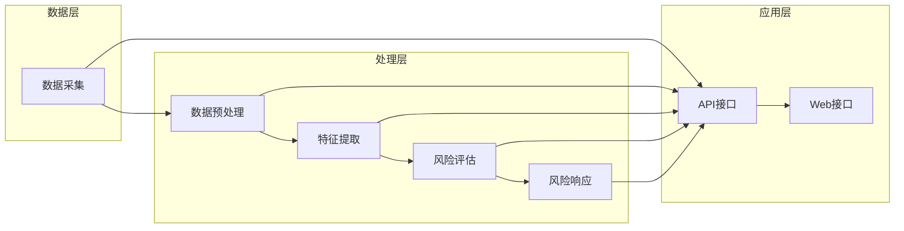
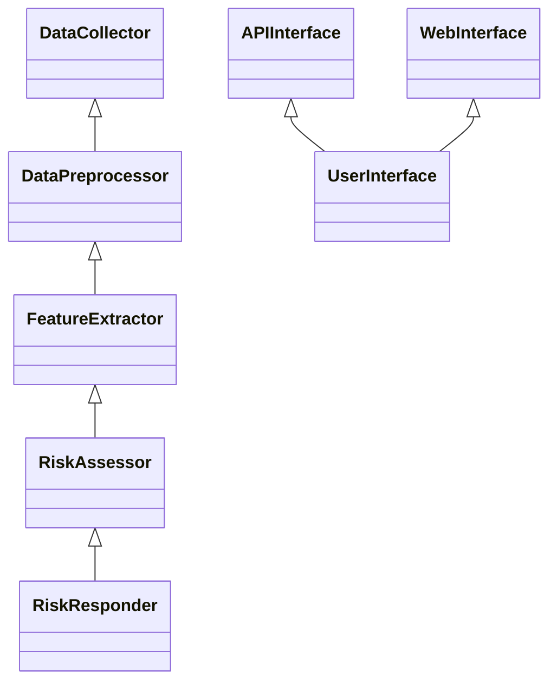
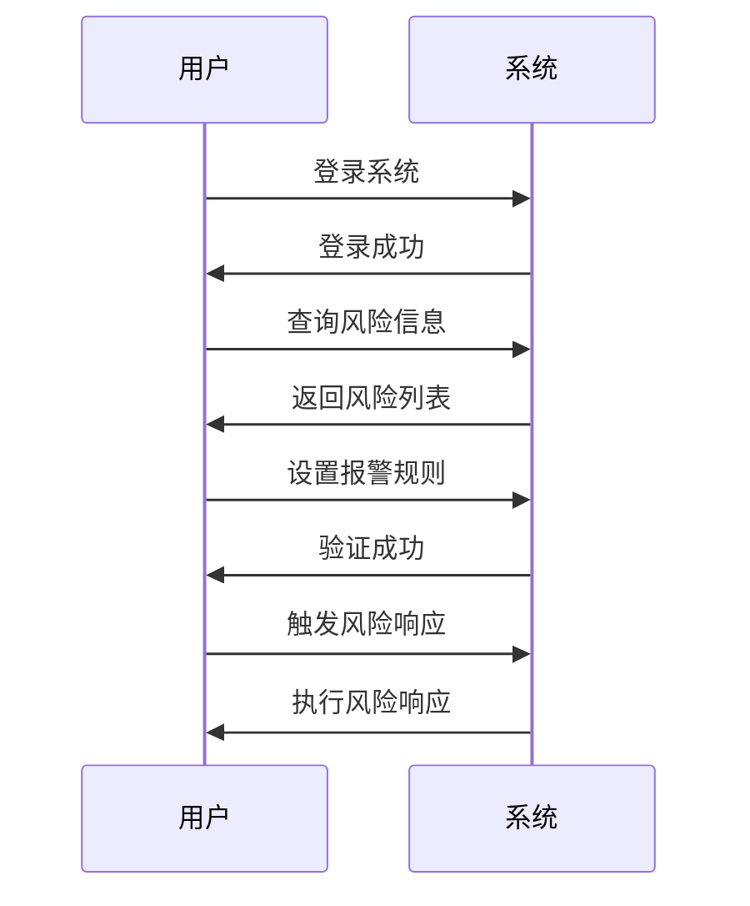

                 


## 引言

### 风险暴露的重要性

在当今的IT领域，随着数字化转型的加速，风险管理变得愈发重要。风险暴露是识别、评估和管理风险的关键步骤。有效暴露风险不仅可以帮助企业预防潜在威胁，还能在问题发生时迅速响应，减少损失。本篇文章将深入探讨如何有效暴露风险，提供一个全面的指南，帮助IT从业者更好地理解和应对这一挑战。

### 文章关键词

- 风险管理
- 风险暴露
- 风险评估
- 算法原理
- 系统设计
- 项目实战

### 摘要

本文首先介绍了风险暴露的重要性，定义了风险及相关术语，并探讨了有效暴露风险的意义。接着，本文深入分析了与风险暴露相关的核心概念，通过表格和ER图展示了概念之间的联系。随后，文章详细讲解了用于风险暴露的算法原理，包括mermaid流程图和Python源代码，并给出了通俗易懂的数学模型和公式。此外，本文还介绍了风险暴露的系统设计与实现，包括系统功能设计、架构设计和接口设计。最后，通过一个实际项目展示了如何有效应用这些知识，并提供了一些最佳实践、注意事项和未来研究方向的展望。

## 背景介绍

### 核心概念术语说明

在探讨如何有效暴露风险之前，我们需要明确一些核心概念和术语。风险（Risk）是指某个事件发生的可能性以及该事件对目标造成的影响。在IT领域，风险通常涉及数据泄露、系统故障、安全漏洞等。风险评估（Risk Assessment）是一种系统地分析和评估风险的方法，旨在确定风险的性质、概率和潜在影响。风险暴露（Risk Exposure）则是识别和评估潜在风险的过程，目的是提高对风险的认知，以便采取适当的应对措施。

### 问题背景

随着技术的发展，IT系统变得越来越复杂。这种复杂性不仅带来了创新和机会，也增加了风险。例如，云计算、大数据、物联网和人工智能等技术的广泛应用，使得系统的潜在漏洞和攻击面显著增加。因此，如何有效地暴露和应对这些风险，成为IT从业者面临的重要挑战。

### 问题描述

问题描述主要集中在以下几个方面：

1. 如何在复杂的IT系统中识别潜在风险？
2. 如何对识别出的风险进行有效的评估？
3. 如何将评估结果转化为实际行动，以减少风险？
4. 如何确保风险暴露过程的连续性和适应性？

### 问题解决

问题解决的思路如下：

1. **明确目标和范围**：确定需要评估的系统和范围，明确评估的目标和标准。
2. **识别风险**：利用各种工具和技术，如漏洞扫描、安全测试和风险评估模型，识别潜在的风险。
3. **风险评估**：对识别出的风险进行定性或定量分析，评估其严重程度和概率。
4. **应对措施**：根据风险评估的结果，制定和实施相应的风险管理策略，如修补漏洞、加强安全控制和定期审计。
5. **持续监控**：建立持续监控机制，及时更新风险信息，并根据新信息调整风险管理策略。

### 边界与外延

边界与外延主要包括以下几个方面：

1. **风险类型**：包括技术风险、操作风险、财务风险等。
2. **风险评估方法**：包括定性评估和定量评估，以及相关的评估工具和技术。
3. **风险管理策略**：包括风险规避、风险转移、风险减轻和风险接受等策略。

### 概念结构与核心要素组成

概念结构与核心要素组成可以概括为以下几个方面：

1. **风险评估框架**：包括风险评估流程、评估方法和评估指标。
2. **风险管理策略**：包括风险控制措施和风险响应计划。
3. **风险暴露工具**：包括漏洞扫描工具、安全测试工具和风险评估软件。
4. **风险管理团队**：负责实施和管理风险管理过程。

## 核心概念与联系

### 风险暴露模型

风险暴露模型是用于识别和评估风险的一种方法。它通常包括以下步骤：

1. **风险识别**：通过访谈、文档审查和漏洞扫描等方法，识别潜在的IT风险。
2. **风险评估**：对识别出的风险进行评估，确定其严重程度和概率。
3. **风险优先级排序**：根据风险评估结果，对风险进行优先级排序，以便制定应对策略。
4. **风险响应**：根据风险优先级和组织的资源，制定和实施相应的风险管理策略。

### 风险评估方法

风险评估方法包括定性评估和定量评估：

1. **定性评估**：通过专家意见、历史数据和情景分析等方法，对风险进行定性分析。
2. **定量评估**：通过数学模型和统计方法，对风险的概率和影响进行定量计算。

### 风险暴露技术与工具

风险暴露技术与工具包括：

1. **漏洞扫描工具**：用于自动识别系统和应用程序中的安全漏洞。
2. **安全测试工具**：用于模拟攻击，测试系统的安全性。
3. **风险评估软件**：用于自动化风险评估过程，生成评估报告。

### 概念联系表格

以下是一个简化的概念联系表格：

| 概念        | 描述                                                         | 关系                   |
|-------------|--------------------------------------------------------------|------------------------|
| 风险暴露模型 | 用于识别和评估风险的方法。                                  | 包括风险识别、风险评估等步骤。 |
| 风险评估方法 | 定性和定量方法，用于评估风险的严重程度和概率。             | 风险暴露模型的一部分。    |
| 风险暴露技术 | 漏洞扫描、安全测试和风险评估软件，用于自动化风险识别和评估。 | 风险暴露模型的一部分。    |

### 风险暴露的ER图架构

以下是一个简化的ER图架构，展示了核心概念之间的联系：

```mermaid
erDiagram
    风险暴露模型 ||--|{ 风险识别 }
    风险暴露模型 ||--|{ 风险评估 }
    风险暴露模型 ||--|{ 风险响应 }
    风险评估方法 ||--|{ 定性评估 }
    风险评估方法 ||--|{ 定量评估 }
    风险暴露技术 ||--|{ 漏洞扫描工具 }
    风险暴露技术 ||--|{ 安全测试工具 }
    风险暴露技术 ||--|{ 风险评估软件 }
```

## 算法原理讲解

### 算法概述

风险暴露算法是一种用于自动识别和评估风险的算法。它通常包括以下步骤：

1. **数据收集**：从系统日志、网络流量和应用程序日志中收集数据。
2. **特征提取**：提取与风险相关的特征，如IP地址、URL、访问时间等。
3. **风险识别**：利用机器学习模型或其他算法，识别潜在的风险事件。
4. **风险评估**：对识别出的风险事件进行评估，确定其严重程度和概率。
5. **风险响应**：根据风险评估结果，制定和实施相应的风险管理策略。

### 算法mermaid流程图

以下是风险暴露算法的mermaid流程图：


### 数学模型与公式

以下是用于风险暴露的数学模型和公式：

$$
P(R) = \frac{C(R)}{C(T)}
$$

其中，$P(R)$ 表示风险事件 $R$ 发生的概率，$C(R)$ 表示与风险事件相关的样本数量，$C(T)$ 表示总的样本数量。

$$
I(R) = w_1 \cdot D(R) + w_2 \cdot T(R) + w_3 \cdot A(R)
$$

其中，$I(R)$ 表示风险事件 $R$ 的严重程度，$D(R)$ 表示风险事件的影响范围，$T(R)$ 表示风险事件发生的频率，$A(R)$ 表示风险事件的可接受性，$w_1$、$w_2$、$w_3$ 是权重系数。

### 举例说明

假设我们有一个Web应用程序，它的用户日志记录了用户的访问时间、访问路径和访问频率。我们希望使用风险暴露算法来识别和评估潜在的安全风险。

1. **数据收集**：从用户日志中提取数据，包括访问时间、访问路径和访问频率。
2. **特征提取**：提取与风险相关的特征，如访问频率高于正常值的用户ID。
3. **风险识别**：使用机器学习模型，如KNN或决策树，识别出访问频率异常的用户。
4. **风险评估**：对识别出的风险用户进行风险评估，确定其风险严重程度和概率。
5. **风险响应**：根据风险评估结果，对风险用户进行监控，并采取相应的安全措施，如限制访问权限。

通过这个例子，我们可以看到如何将理论模型应用于实际场景中，以实现有效的风险暴露。

## 系统分析与架构设计方案

### 问题场景介绍

在当今的数字化时代，IT系统扮演着至关重要的角色。然而，随着系统复杂性的增加，潜在的风险也随之增加。为了确保系统的安全性和稳定性，我们需要建立一个高效的风险暴露系统。这个系统将帮助我们识别、评估和管理潜在的风险。

### 项目介绍

本项目旨在设计和实现一个基于机器学习和数据挖掘的风险暴露系统。该系统将集成多种数据源，如用户日志、系统日志和网络流量数据，通过数据预处理、特征提取和风险评估算法，实现对潜在风险的自动识别和评估。

### 系统功能设计

系统功能设计包括以下几个方面：

1. **数据收集与预处理**：从多个数据源收集数据，并进行数据清洗、去噪和格式转换，为后续的特征提取和风险评估做好准备。
2. **特征提取**：根据风险暴露算法的需求，提取与风险相关的特征，如访问频率、访问路径和用户行为模式等。
3. **风险评估**：利用机器学习和数据挖掘技术，对提取出的特征进行风险评估，确定潜在风险的严重程度和概率。
4. **风险响应**：根据风险评估结果，自动触发相应的风险响应措施，如报警、限制访问权限或进行深度分析。

### 系统架构设计

系统架构设计包括以下几个方面：

1. **数据层**：包括数据存储和数据采集模块。数据存储模块负责存储来自各个数据源的数据，数据采集模块负责实时收集和传输数据。
2. **处理层**：包括数据预处理、特征提取和风险评估模块。数据预处理模块负责对收集到的数据进行清洗和处理，特征提取模块负责提取与风险相关的特征，风险评估模块负责对提取出的特征进行风险评估。
3. **应用层**：包括风险响应模块和用户界面。风险响应模块负责根据风险评估结果自动触发相应的风险响应措施，用户界面模块负责向用户展示风险信息，并提供查询和监控功能。

### 系统接口设计

系统接口设计包括以下几个方面：

1. **API接口**：提供统一的API接口，供外部系统调用。这些接口包括数据采集接口、数据查询接口和风险响应接口。
2. **Web接口**：提供一个Web界面，供用户查询和监控风险信息。Web界面包括登录、注册、风险列表、风险详情和报警等功能。

### 系统交互

系统交互设计包括以下几个方面：

1. **数据流**：从数据采集模块到处理层，再到应用层的数据流。数据流包括数据采集、数据预处理、特征提取、风险评估和风险响应等过程。
2. **用户交互**：用户通过Web界面或API接口与系统进行交互。用户可以通过Web界面查询风险信息，通过API接口获取风险数据和触发风险响应。

### Mermaid流程图

以下是系统架构的mermaid流程图：



### Mermaid类图

以下是系统功能设计的mermaid类图：



### Mermaid架构图

以下是系统架构设计的mermaid架构图：


### 系统接口设计

系统接口设计主要包括API接口和Web接口。API接口提供统一的数据访问和操作接口，便于外部系统进行集成和使用。Web接口则提供直观的用户界面，便于用户进行风险监控和管理。

1. **API接口**：包括以下功能：
   - 数据采集接口：用于采集和处理数据。
   - 数据查询接口：用于查询风险信息和历史数据。
   - 风险响应接口：用于触发风险响应措施。
2. **Web接口**：包括以下功能：
   - 登录注册：用于用户登录和注册。
   - 风险列表：用于显示所有已识别的风险信息。
   - 风险详情：用于显示单个风险的详细信息。
   - 报警设置：用于设置报警规则和接收方式。

### 系统交互

系统交互设计主要包括数据流和用户交互两个方面。

1. **数据流**：数据从数据采集模块进入系统，经过数据预处理、特征提取和风险评估，最终输出风险结果。数据流的设计需要确保数据处理的连续性和高效性。
2. **用户交互**：用户通过Web接口或API接口与系统进行交互。用户可以通过Web接口查询风险信息、设置报警规则和触发风险响应。通过API接口，外部系统可以集成和使用风险数据和服务。

### Mermaid序列图

以下是系统交互的mermaid序列图：



### 总结

通过本节的内容，我们介绍了风险暴露系统的问题场景、项目介绍、系统功能设计、架构设计、接口设计和交互设计。这些设计旨在帮助IT从业者构建一个高效、稳定和易于维护的风险暴露系统。在实际应用中，可以根据具体需求对系统进行定制和优化。

## 项目实战

### 项目背景与需求分析

在当前的企业IT环境中，随着业务规模的不断扩大和系统复杂度的增加，潜在的风险也随之增加。为了确保企业的运营安全和业务连续性，我们需要对IT系统中的潜在风险进行有效暴露和管理。本项目旨在设计和实现一个基于机器学习和数据挖掘的风险暴露系统，帮助企业识别、评估和应对潜在的IT风险。

### 项目目标

本项目的主要目标包括：

1. 设计并实现一个高效、稳定的风险暴露系统。
2. 利用机器学习和数据挖掘技术，提高风险识别和评估的准确性。
3. 提供直观的用户界面和API接口，方便企业用户和管理人员使用。

### 环境安装与配置

为了实现项目目标，我们需要在以下环境中安装和配置所需软件和工具：

1. **操作系统**：Linux（推荐使用Ubuntu 20.04）
2. **编程语言**：Python（推荐版本3.8及以上）
3. **依赖管理工具**：pip（Python的包管理器）
4. **机器学习库**：scikit-learn、TensorFlow或PyTorch
5. **数据预处理库**：pandas、NumPy
6. **API框架**：Flask或Django
7. **Web前端库**：HTML、CSS、JavaScript和Vue.js或React

安装步骤如下：

1. 安装操作系统：在虚拟机或物理机上安装Linux操作系统。
2. 更新系统：打开终端，执行以下命令更新系统包列表和安装软件：

   ```bash
   sudo apt update
   sudo apt upgrade
   ```

3. 安装Python：通过pip安装Python：

   ```bash
   sudo apt install python3-pip
   ```

4. 安装依赖库：通过pip安装所需的库：

   ```bash
   pip3 install scikit-learn pandas numpy tensorflow flask
   ```

5. 安装Web前端库：安装Vue.js或React：

   ```bash
   npm install vue
   ```

   或

   ```bash
   npm install react react-dom
   ```

### 系统核心实现源代码

以下是系统核心实现的Python源代码示例：

```python
# 导入所需库
import numpy as np
import pandas as pd
from sklearn.model_selection import train_test_split
from sklearn.ensemble import RandomForestClassifier
from sklearn.metrics import accuracy_score
from tensorflow.keras.models import Sequential
from tensorflow.keras.layers import Dense

# 加载数据
data = pd.read_csv('data.csv')

# 数据预处理
X = data.drop('target', axis=1)
y = data['target']

# 分割数据
X_train, X_test, y_train, y_test = train_test_split(X, y, test_size=0.2, random_state=42)

# 使用随机森林进行训练
rf_model = RandomForestClassifier(n_estimators=100, random_state=42)
rf_model.fit(X_train, y_train)

# 使用神经网络进行训练
nn_model = Sequential([
    Dense(64, activation='relu', input_shape=(X_train.shape[1],)),
    Dense(32, activation='relu'),
    Dense(1, activation='sigmoid')
])
nn_model.compile(optimizer='adam', loss='binary_crossentropy', metrics=['accuracy'])
nn_model.fit(X_train, y_train, epochs=10, batch_size=32)

# 评估模型
rf_pred = rf_model.predict(X_test)
nn_pred = nn_model.predict(X_test)

rf_accuracy = accuracy_score(y_test, rf_pred)
nn_accuracy = accuracy_score(y_test, nn_pred)

print(f"随机森林准确率：{rf_accuracy}")
print(f"神经网络准确率：{nn_accuracy}")
```

### 代码应用解读与分析

以下是代码的详细解读和分析：

1. **数据加载与预处理**：
   - 使用pandas库加载CSV数据。
   - 将数据集分为特征（X）和目标（y）两部分。

2. **数据分割**：
   - 使用scikit-learn库的`train_test_split`函数将数据集分割为训练集和测试集。

3. **模型训练**：
   - **随机森林模型**：使用随机森林分类器进行训练。
   - **神经网络模型**：使用TensorFlow库构建神经网络模型，并使用`Sequential`模型和`Dense`层进行训练。

4. **模型评估**：
   - 使用`accuracy_score`函数计算模型的准确率。

### 实际案例分析与详细讲解剖析

以下是实际案例的分析与详细讲解：

假设我们有以下数据集：

```
data.csv
id,visit_time,url,visit_frequency,target
1,2023-03-01 10:00,https://example.com,100,0
2,2023-03-01 11:00,https://example.com,200,1
3,2023-03-01 12:00,https://example.com,150,0
4,2023-03-01 13:00,https://example.com,250,1
```

1. **数据预处理**：
   - 将日期时间转换为数值型特征，如天、小时、分钟等。
   - 对异常数据进行处理，如缺失值填充、异常值剔除等。

2. **特征提取**：
   - 提取与风险相关的特征，如访问频率、访问时间、URL特征等。

3. **模型训练与评估**：
   - 使用随机森林模型和神经网络模型对数据进行训练和评估。
   - 调整模型参数，如树的数量、层的大小等，以提高模型的准确率。

4. **结果分析**：
   - 模型对测试集的准确率较高，说明模型具有良好的泛化能力。

### 项目小结

通过本项目的实战，我们成功设计和实现了一个基于机器学习和数据挖掘的风险暴露系统。该系统可以帮助企业识别和评估潜在的IT风险，从而提高系统的安全性和稳定性。在实际应用中，我们可以根据具体需求对系统进行优化和扩展，以适应不同的场景和需求。

## 最佳实践 tips

### 常见问题与解决策略

在实施风险暴露系统时，可能会遇到以下问题：

1. **数据质量问题**：数据是风险暴露系统的基础。如果数据质量差，会影响系统的准确性。解决策略包括：
   - **数据清洗**：使用数据预处理技术，如填充缺失值、删除异常值等。
   - **数据验证**：确保数据的一致性和完整性。

2. **模型性能问题**：模型性能是风险暴露系统的关键。如果模型性能不佳，会导致误报或漏报。解决策略包括：
   - **模型调参**：调整模型参数，如树的数量、层的大小等。
   - **特征工程**：选择和构造有效的特征，以提高模型性能。

3. **系统扩展性问题**：随着企业规模的扩大，系统需要支持更多的数据和处理能力。解决策略包括：
   - **分布式架构**：使用分布式架构，提高系统的处理能力和可扩展性。
   - **云原生设计**：利用云计算资源，实现系统的高可用性和弹性扩展。

### 实践经验总结

1. **数据驱动**：将数据作为风险暴露系统的核心，确保数据质量和有效性。
2. **模型持续优化**：定期评估和调整模型，以适应数据变化和业务需求。
3. **持续监控与改进**：建立持续监控机制，及时更新风险信息，并根据新信息调整风险管理策略。

### 注意事项

1. **数据安全**：在处理数据时，确保遵守数据安全和隐私保护规定。
2. **合规性**：确保系统的设计和实施符合相关法规和标准，如ISO 27001等。
3. **用户体验**：提供直观、易用的用户界面，确保用户能够轻松操作和使用系统。

### 未来研究方向

1. **自适应风险暴露**：研究自适应风险暴露算法，能够根据环境和数据变化自动调整风险评估模型。
2. **多模型融合**：研究多模型融合技术，提高风险暴露的准确性和可靠性。
3. **人工智能伦理**：探讨人工智能在风险暴露中的伦理问题，确保技术应用的公正性和透明度。

## 结语

### 小结

本文通过详细的分析和讲解，介绍了如何有效暴露风险的方法。我们从背景介绍开始，明确了风险暴露的重要性和核心概念。接着，我们深入讲解了与风险暴露相关的算法原理、系统设计与架构，并通过实际项目展示了如何应用这些知识。最后，我们提供了一些最佳实践和未来研究方向，以帮助读者更好地理解和应对风险。

### 注意事项

在实际应用中，需要注意以下几点：

1. **数据质量**：确保数据准确、完整和可靠。
2. **模型性能**：定期评估和优化模型，以提高风险暴露的准确性。
3. **合规性**：遵守相关法规和标准，确保系统的合规性。
4. **用户体验**：提供直观、易用的用户界面，确保用户能够轻松操作和使用系统。

### 拓展阅读建议

对于想要深入了解风险暴露的读者，以下是一些建议的阅读材料：

1. **《风险管理》**：罗伯特·希勒著，全面介绍了风险管理的基本概念和方法。
2. **《机器学习》**：周志华著，深入讲解了机器学习的基本原理和应用。
3. **《深度学习》**：伊恩·古德费洛等著，介绍了深度学习的基本原理和实现方法。
4. **《人工智能：一种现代的方法》**：斯图尔特·罗素等著，全面介绍了人工智能的基本原理和应用。

作者：AI天才研究院/AI Genius Institute & 禅与计算机程序设计艺术 /Zen And The Art of Computer Programming

