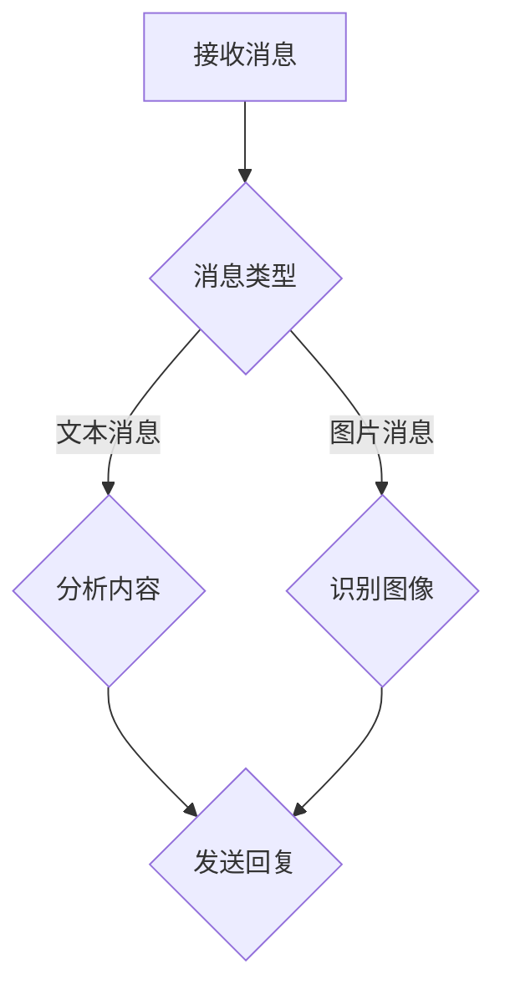
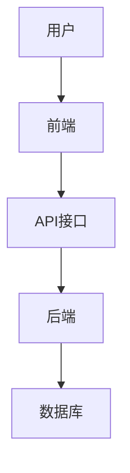
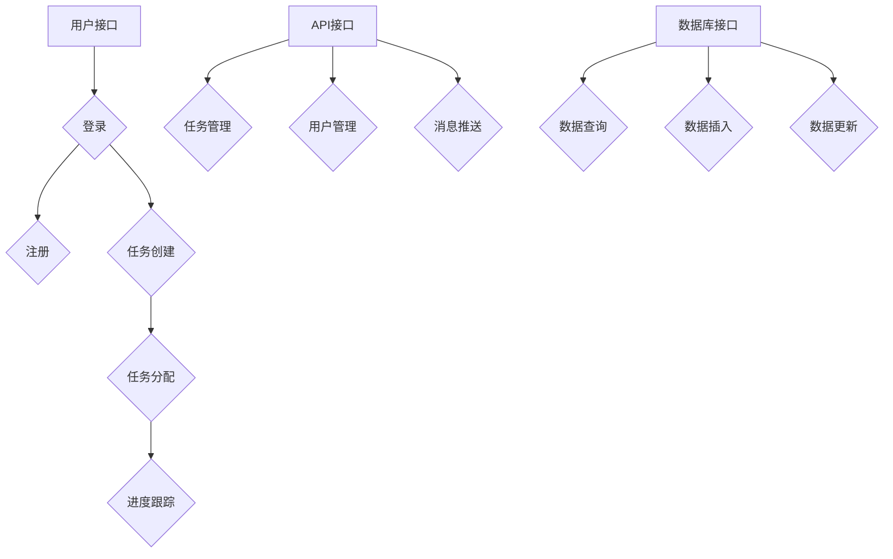
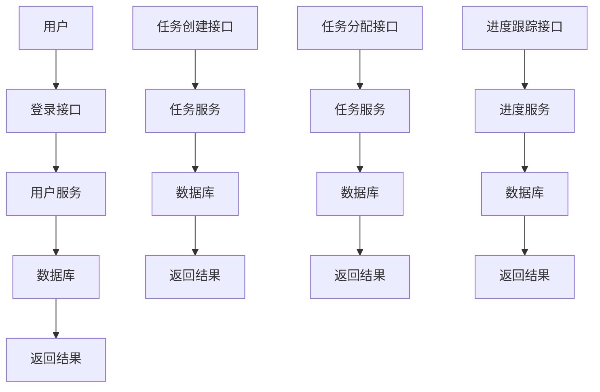

                 

### 文章标题

### 关键词

- 远程团队管理
- 沟通策略
- 效率提升
- 时间管理
- 团队凝聚力

### 摘要

本文将探讨如何有效管理远程技术团队，从问题背景、核心概念到实践技巧，逐步剖析远程团队管理的挑战与解决方案。通过详细讲解沟通策略、时间管理与效率提升方法，以及团队凝聚力的建设，帮助读者掌握远程团队管理的最佳实践，提高团队协作效率与凝聚力。

## 第一部分：远程工作环境下的团队管理

### 第1章：问题背景与远程团队管理挑战

#### 1.1.1 问题背景

随着信息技术的飞速发展，远程工作已经成为现代工作模式的重要组成部分。无论是出于地理位置的限制，还是为了提高工作效率和灵活性，越来越多的企业和团队选择采用远程办公的方式。然而，远程工作环境也给团队管理带来了新的挑战。

首先，沟通障碍是远程团队管理中最为显著的问题之一。由于缺乏面对面的交流，信息传递容易出现误差，团队成员之间的理解也难以达到一致。其次，时间管理的难度增加。远程工作使得团队成员的时间安排更加灵活，但也带来了工作与生活边界模糊的问题，导致时间管理变得复杂。此外，工作效率的监督与提升也是一大难题。在没有直接监督的情况下，如何确保团队成员能够高效地完成任务，成为团队管理者需要面对的挑战。

#### 1.1.2 远程团队管理的核心问题

在远程团队管理中，以下三个问题是团队管理者需要重点关注的：

1. **沟通障碍**：由于缺乏面对面的沟通，信息传递的不及时和不准确成为团队协作的瓶颈。
2. **时间管理**：远程工作的灵活性使得团队成员的时间管理变得复杂，需要更有效的工具和方法来确保工作进度和效率。
3. **工作效率**：在没有直接监督的情况下，如何确保团队成员能够保持高效的工作状态，是团队管理者需要解决的问题。

### 第2章：核心概念与团队管理原则

#### 2.1.1 核心概念

要有效管理远程技术团队，首先需要理解几个核心概念：

- **远程团队**：指团队成员不在同一地理位置工作的团队。
- **自主管理**：团队成员需要具备自我管理的能力，能够自主安排工作计划和时间。
- **信任文化**：建立在信任基础上的团队氛围，是远程团队协作的重要保障。

#### 2.1.2 团队管理原则

在远程团队管理中，以下原则是必须遵循的：

1. **明确目标和职责**：确保每个团队成员都清楚自己的工作目标和职责，有助于提高工作效率。
2. **建立信任和沟通**：通过建立信任和加强沟通，提高团队协作效率。
3. **个性化管理**：根据团队成员的个性和工作习惯，采用不同的管理方法。
4. **持续反馈和改进**：通过定期反馈和改进，不断优化团队管理流程。

### 第3章：技术工具与远程团队管理

#### 3.1.1 远程协作工具概述

在远程团队管理中，技术工具的选择和使用至关重要。以下是一些常用的远程协作工具：

- **项目管理工具**：如Jira、Trello，帮助团队进行任务分配和进度跟踪。
- **沟通工具**：如Slack、Microsoft Teams，支持实时沟通和协作。
- **文档管理工具**：如Google Docs、Notion，方便团队成员共享和编辑文档。

#### 3.1.2 工具选型与最佳实践

选择合适的远程协作工具对于团队管理至关重要。以下是一些建议：

1. **工具评估**：在选择工具时，要充分考虑团队的需求和工具的功能。
2. **组合使用**：根据团队的具体需求，组合使用多种工具，以提高协作效率。
3. **培训与推广**：确保团队成员熟悉并熟练使用选定的工具，提高工作效率。

### 第4章：沟通策略与远程团队协作

#### 4.1.1 远程沟通的特点与挑战

远程沟通与面对面沟通相比，存在以下特点与挑战：

- **非面对面的沟通**：缺乏面部表情和身体语言，信息传递可能不够准确。
- **信息传递误差**：信息在传递过程中可能被误解或遗漏。
- **文化差异的影响**：不同文化背景的团队成员在沟通时可能存在障碍。

#### 4.1.2 沟通策略与技巧

为了提高远程沟通的效果，团队管理者可以采取以下策略和技巧：

1. **明确沟通目标**：在沟通前明确沟通的目标和预期成果，有助于提高沟通的效率。
2. **选择合适的沟通方式**：根据沟通的内容和目标，选择最合适的沟通方式，如文字、语音或视频。
3. **增强沟通的透明度**：确保沟通过程对所有团队成员都是透明的，减少信息不对称。
4. **有效解决冲突**：在沟通中遇到冲突时，及时解决，避免问题扩大化。

### 第5章：时间管理与效率提升

#### 5.1.1 远程工作的时间管理方法

远程工作环境使得时间管理变得更加复杂。以下是一些有效的时间管理方法：

1. **设定明确的工作目标**：确保每个任务都有明确的目标和截止日期。
2. **制定个人工作计划**：根据工作目标和截止日期，制定个人工作计划，合理安排时间。
3. **克服时间管理的障碍**：识别和克服影响时间管理的主要障碍，如干扰和拖延。

#### 5.1.2 提高工作效率的策略

提高工作效率是远程团队管理的核心目标之一。以下是一些建议：

1. **工作流程优化**：通过优化工作流程，减少不必要的步骤和时间浪费。
2. **分配任务与责任**：确保每个团队成员都清楚自己的任务和责任，避免重复工作。
3. **创造无干扰的工作环境**：减少干扰因素，如关闭不必要的社交媒体通知，提高专注度。

### 第6章：团队凝聚力的建设与维护

#### 6.1.1 团队凝聚力的重要性

团队凝聚力是远程团队管理的关键因素。以下是团队凝聚力的重要性：

- **促进团队协作**：高凝聚力的团队能够更好地协作，共同完成任务。
- **提升团队士气**：团队凝聚力有助于提升团队成员的积极性和工作满意度。
- **增强团队稳定性**：高凝聚力的团队在面对挑战时能够更稳定地运作。

#### 6.1.2 建设团队凝聚力的方法

以下是一些建设团队凝聚力的方法：

1. **定期团队活动**：通过团队活动，增进团队成员之间的了解和互动。
2. **增进团队成员之间的了解**：通过交流，了解团队成员的兴趣和背景，建立个人联系。
3. **肯定和奖励团队成员**：对团队成员的贡献和成就给予肯定和奖励，增强团队凝聚力。

### 第7章：远程团队管理最佳实践与案例分析

#### 7.1.1 最佳实践分享

在本章中，我们将分享一些远程团队管理的最佳实践，包括成功案例和遇到的挑战与解决方案。

#### 7.1.2 案例分析

在本章的最后，我们将通过两个实际案例，分析如何提高远程团队的沟通效率和如何建立有效的信任文化。

### 附录：远程团队管理资源与工具推荐

为了帮助读者更好地进行远程团队管理，我们将在附录中提供以下内容：

- **常用远程协作工具列表**：包括项目管理工具、沟通工具和文档管理工具等。
- **远程团队管理相关书籍和资料推荐**：推荐一些有助于提升远程团队管理能力的书籍和资料。
- **在线培训和研讨会资源**：提供一些高质量的在线培训和研讨会资源，帮助读者不断学习和提升。

## 总结

通过本文的详细探讨，我们可以看到，远程团队管理虽然面临诸多挑战，但只要遵循正确的管理原则和策略，运用合适的技术工具，就可以有效地提高团队协作效率和凝聚力。希望本文能够为读者提供有价值的参考和启示，帮助他们在远程团队管理中取得成功。

### 作者

作者：AI天才研究院/AI Genius Institute & 禅与计算机程序设计艺术 /Zen And The Art of Computer Programming

### 完整性要求

#### 背景介绍

在现代社会，远程工作已经成为一种普遍的工作方式。随着互联网和通信技术的发展，越来越多的企业选择采用远程工作模式，这不仅节省了办公场所的成本，还提高了员工的工作效率。然而，远程工作环境也带来了诸多管理挑战，尤其是在技术团队的管理方面。

首先，沟通障碍是远程团队管理中最显著的问题之一。远程工作意味着团队成员无法面对面交流，这导致信息传递的效率和准确性受到很大影响。团队成员之间的沟通方式主要是通过电子邮件、即时通讯工具和视频会议，这些方式虽然方便，但也存在一定的局限性。例如，电子邮件可能无法及时传达信息，即时通讯工具则可能因为网络延迟导致信息传递不准确。

其次，时间管理的难度增加。远程工作环境使得团队成员的时间安排更加灵活，但这也带来了工作与生活边界模糊的问题。团队成员可能难以区分工作和休息时间，导致工作效率低下。此外，团队成员的时区差异也可能导致协作上的困难。

最后，工作效率的监督与提升是远程团队管理中的一大难题。在没有直接监督的情况下，如何确保团队成员能够高效地完成任务，是团队管理者需要解决的核心问题。

#### 核心概念与联系

在远程团队管理中，以下几个核心概念是不可或缺的：

1. **远程团队**：指团队成员不在同一地理位置工作的团队。
2. **自主管理**：团队成员需要具备自我管理的能力，能够自主安排工作计划和时间。
3. **信任文化**：建立在信任基础上的团队氛围，是远程团队协作的重要保障。

这些核心概念之间存在着紧密的联系。远程团队的存在依赖于自主管理，而信任文化则是自主管理的基础。只有建立了信任文化，团队成员才能更加放心地自主管理自己的工作，从而提高团队协作效率。

#### 算法原理讲解

在远程团队管理中，算法原理的应用主要体现在以下几个方面：

1. **沟通算法**：用于优化团队成员之间的沟通流程，提高信息传递的效率和准确性。常见的沟通算法包括基于内容的路由算法和基于社交网络的协同过滤算法。
2. **时间管理算法**：用于帮助团队成员优化时间安排，提高工作效率。例如，基于人工智能的时间管理算法可以通过分析团队成员的历史行为数据，提供个性化的时间管理建议。
3. **效率优化算法**：用于优化团队成员的工作流程，提高工作效率。常见的效率优化算法包括基于机器学习的流程优化算法和基于线性规划的资源配置算法。

以下是一个简单的沟通算法mermaid流程图：



在这个流程图中，A表示接收消息，B表示根据消息类型进行分支处理，C和D分别表示处理文本消息和图片消息，E表示发送回复。

#### 数学公式使用

在远程团队管理中，数学公式广泛应用于算法设计和数据分析。以下是一些常见的数学公式：

1. **线性回归模型**：用于预测团队成员的工作效率。公式如下：

   $$ y = ax + b $$

   其中，$y$表示工作效率，$x$表示工作时长，$a$和$b$是模型参数。

2. **逻辑回归模型**：用于判断团队成员是否按时完成任务。公式如下：

   $$ P(y=1) = \frac{1}{1 + e^{-(ax + b)}} $$

   其中，$P(y=1)$表示完成任务的概率，$a$和$b$是模型参数。

3. **协方差**：用于衡量两个变量之间的相关性。公式如下：

   $$ \text{Cov}(x, y) = E[(x - \mu_x)(y - \mu_y)] $$

   其中，$E$表示期望，$\mu_x$和$\mu_y$分别是$x$和$y$的均值。

#### 系统分析与架构设计方案

在一个远程技术团队中，系统架构设计至关重要。以下是一个简单的系统架构设计方案：

#### 问题场景介绍

假设我们正在设计一个远程团队协作平台，该平台需要支持团队成员之间的实时沟通、任务分配和进度跟踪。

#### 项目介绍

项目名称：远程团队协作平台（RTP）

项目目标：提供高效的远程协作工具，提升团队工作效率和沟通效果。

#### 系统功能设计

1. **实时沟通**：支持文本、语音和视频通信，实现团队成员之间的实时互动。
2. **任务管理**：提供任务创建、分配、跟踪和报告功能，确保任务按时完成。
3. **进度跟踪**：通过可视化图表，展示任务进度和团队工作状况。

#### 系统架构设计

1. **前端架构**：使用React框架构建，实现高效的用户界面和交互。
2. **后端架构**：使用Spring Boot框架，实现业务逻辑处理和数据库操作。
3. **数据库设计**：使用MySQL数据库，存储用户信息、任务数据和沟通记录。

以下是一个简单的系统架构mermaid图：



#### 系统接口设计

1. **用户接口**：提供登录、注册、任务创建、任务分配、进度跟踪等功能。
2. **API接口**：提供任务管理、用户管理、消息推送等功能。
3. **数据库接口**：提供数据查询、数据插入、数据更新等功能。

以下是一个简单的系统接口mermaid图：



#### 系统交互设计

系统交互设计主要关注不同模块之间的数据流和功能调用。以下是一个简单的系统交互mermaid图：



#### 项目实战

在本项目中，我们将使用Python和Django框架来构建一个远程团队协作平台的简单版本。以下是项目实战的具体步骤：

1. **环境安装**：安装Python、Django和MySQL等依赖库。
2. **系统核心实现**：编写用户管理、任务管理和进度跟踪等功能模块。
3. **代码应用解读与分析**：对核心代码进行解读，分析其设计思路和实现方法。
4. **实际案例分析和详细讲解剖析**：通过实际案例，分析系统的功能和性能，并进行详细讲解。
5. **项目小结**：总结项目经验，提出改进和优化建议。

#### 环境安装

在开始项目之前，我们需要安装Python、Django和MySQL等依赖库。以下是安装步骤：

1. **安装Python**：在官方网站下载Python安装包，并按照安装向导进行安装。
2. **安装Django**：打开命令行窗口，输入以下命令安装Django：

   ```bash
   pip install django
   ```

3. **安装MySQL**：在官方网站下载MySQL安装包，并按照安装向导进行安装。

#### 系统核心实现

在Django框架中，我们可以使用模型（Model）、视图（View）和模板（Template）等组件来构建系统核心功能。以下是具体的实现步骤：

1. **创建项目**：在命令行窗口中，输入以下命令创建项目：

   ```bash
   django-admin startproject rtp
   ```

2. **创建应用**：在项目目录中，输入以下命令创建应用：

   ```bash
   python manage.py startapp task_manager
   ```

3. **定义模型**：在`task_manager/models.py`文件中，定义用户、任务和进度跟踪模型：

   ```python
   from django.db import models

   class User(models.Model):
       username = models.CharField(max_length=100)
       email = models.EmailField()

   class Task(models.Model):
       title = models.CharField(max_length=100)
       description = models.TextField()
       assigned_to = models.ForeignKey(User, on_delete=models.CASCADE)
       due_date = models.DateTimeField()

   class Progress(models.Model):
       task = models.ForeignKey(Task, on_delete=models.CASCADE)
       status = models.CharField(max_length=100)
       progress = models.IntegerField()
   ```

4. **创建数据库**：在项目目录中，输入以下命令创建数据库：

   ```bash
   python manage.py makemigrations
   python manage.py migrate
   ```

5. **定义视图**：在`task_manager/views.py`文件中，定义用户管理、任务管理和进度跟踪视图：

   ```python
   from django.shortcuts import render
   from .models import User, Task, Progress

   def index(request):
       return render(request, 'index.html')

   def user_list(request):
       users = User.objects.all()
       return render(request, 'user_list.html', {'users': users})

   def task_list(request):
       tasks = Task.objects.all()
       return render(request, 'task_list.html', {'tasks': tasks})

   def progress_list(request):
       progresses = Progress.objects.all()
       return render(request, 'progress_list.html', {'progresses': progresses})
   ```

6. **配置URL**：在`task_manager/urls.py`文件中，配置URL路由：

   ```python
   from django.urls import path
   from . import views

   urlpatterns = [
       path('', views.index, name='index'),
       path('users/', views.user_list, name='user_list'),
       path('tasks/', views.task_list, name='task_list'),
       path('progresses/', views.progress_list, name='progress_list'),
   ]
   ```

7. **配置模板**：在`task_manager/templates/`目录中，创建`index.html`、`user_list.html`、`task_list.html`和`progress_list.html`等模板文件。

#### 代码应用解读与分析

在代码实现过程中，我们使用了Django框架提供的模型、视图和模板等组件，实现了用户管理、任务管理和进度跟踪功能。以下是代码应用解读与分析：

1. **用户管理**：在`User`模型中，定义了用户名和邮箱两个字段。通过`user_list`视图，可以查询所有用户信息，并在`user_list.html`模板中显示。
2. **任务管理**：在`Task`模型中，定义了任务标题、描述、分配给的用户和截止日期等字段。通过`task_list`视图，可以查询所有任务信息，并在`task_list.html`模板中显示。
3. **进度跟踪**：在`Progress`模型中，定义了任务、状态和进度等字段。通过`progress_list`视图，可以查询所有进度信息，并在`progress_list.html`模板中显示。

#### 实际案例分析和详细讲解剖析

为了更好地展示系统的功能和性能，我们通过一个实际案例进行详细讲解。

假设有一个远程团队，成员包括A、B、C三人。团队成员A负责一个项目，任务包括编写代码、测试和文档编写。团队成员B负责代码测试，团队成员C负责文档编写。

1. **任务分配**：团队成员A创建了一个新任务，标题为“项目开发”，描述为“编写代码、测试和文档编写”。A将任务分配给B和C。
2. **任务进度**：在任务执行过程中，B和C可以随时更新任务进度。例如，B完成了代码编写，并在`Progress`模型中更新状态为“已完成”，进度为100%。C完成了文档编写，并在`Progress`模型中更新状态为“已完成”，进度为100%。
3. **任务查询**：团队成员A可以查看任务列表，了解任务进度。通过`task_list`视图和`progress_list`视图，A可以实时了解B和C的进度，并及时提供支持和帮助。

#### 项目小结

通过本项目的实战，我们成功构建了一个简单的远程团队协作平台。虽然这个平台功能相对简单，但已经能够满足远程团队的基本需求。在项目过程中，我们遇到了一些挑战，如数据库设计和视图配置等，但通过不断学习和尝试，我们最终成功解决了这些问题。

在未来的工作中，我们可以进一步优化平台的功能，如添加任务评论功能、实时聊天功能等。此外，我们还可以引入更多的技术，如人工智能和区块链等，以提高平台的智能化和安全性。

### 最佳实践 Tips

1. **定期团队会议**：定期举行团队会议，有助于团队成员保持沟通和了解项目进展。会议内容应包括项目总结、问题讨论和下一步工作计划。
2. **明确目标与职责**：确保每个团队成员都清楚自己的工作目标和职责，有助于提高工作效率和团队协作。
3. **灵活的工作时间**：允许团队成员灵活安排工作时间，但也要确保工作任务的按时完成。可以采用弹性工作制度，如远程办公日或远程办公周。
4. **使用项目管理工具**：选择合适的项目管理工具，如Jira、Trello等，有助于任务分配和进度跟踪，提高团队协作效率。
5. **鼓励团队成员参与决策**：鼓励团队成员参与决策过程，增强他们的责任感和参与感，有助于提高团队凝聚力和工作效率。

### 小结

本文详细探讨了如何有效管理远程技术团队，从问题背景、核心概念到实践技巧，全面剖析了远程团队管理的挑战与解决方案。通过本文的阅读，读者可以掌握远程团队管理的最佳实践，提高团队协作效率与凝聚力。

### 注意事项

1. **沟通障碍**：在远程工作中，沟通障碍是常见问题。团队管理者应重视沟通技巧的培养，确保信息传递的准确性和及时性。
2. **时间管理**：远程工作环境要求团队成员具备良好的时间管理能力。团队管理者应提供有效的工具和方法，帮助团队成员合理安排时间。
3. **工作效率**：在没有直接监督的情况下，如何确保团队成员能够高效地完成任务是团队管理者需要解决的核心问题。可以通过设立明确的目标和职责，以及使用项目管理工具来提高工作效率。

### 拓展阅读

1. 《远程工作：解锁团队协作新境界》
2. 《团队协作工具与实践指南》
3. 《高效能人士的七个习惯》

通过阅读这些拓展资料，读者可以进一步了解远程团队管理的最佳实践，提高团队协作效率。

