                 

### 文章标题

# 如何构建技术品牌影响力

> 关键词：技术品牌、影响力、构建策略、案例分析

> 摘要：本文将深入探讨如何构建技术品牌影响力，通过系统的方法论和实际案例，分析技术品牌的定义、构建要素、步骤以及面临的挑战和机遇。文章旨在为技术人员和企业提供一条清晰的建设路径，帮助他们打造具有竞争力的技术品牌。

---

## 引言

在当今信息技术飞速发展的时代，技术品牌的重要性愈发凸显。无论是在互联网行业，还是在传统产业中，技术品牌不仅是企业核心竞争力的体现，更是吸引人才、拓展市场和提升用户信任的关键因素。然而，如何构建一个具有影响力的技术品牌，成为了众多企业和个人亟待解决的重要问题。

本文将从以下几个方面展开讨论：

1. **技术品牌概述**：解释技术品牌的概念、重要性以及与传统品牌的区别。
2. **技术品牌构建要素**：分析技术品牌构建所需的要素，如技术实力、创新能力、品牌形象和用户群体。
3. **技术品牌构建步骤**：详细阐述构建技术品牌的具体步骤，包括品牌定位、品牌策略、品牌传播和维护。
4. **技术品牌构建的挑战与机遇**：探讨在构建技术品牌过程中可能遇到的挑战和如何抓住机遇。
5. **技术品牌案例分析**：通过实际案例，展示成功的品牌构建经验和教训。

让我们一步步深入思考，了解如何构建技术品牌影响力。

---

## 第一部分：技术品牌概述

### 1.1 技术品牌的概念与重要性

#### 1.1.1 技术品牌的定义

技术品牌，指的是企业或个人在其技术领域内通过不断创新和积累，形成的具有较高知名度和美誉度，能够为产品或服务带来显著竞争优势的标志和声誉。技术品牌不仅包含企业的技术实力，还涵盖了品牌形象、用户口碑和社会认可等多方面内容。

#### 1.1.2 技术品牌的重要性

技术品牌的重要性体现在以下几个方面：

1. **提升竞争力**：技术品牌能够显著提高企业或个人在市场中的竞争力，帮助其脱颖而出。
2. **吸引人才**：优秀的技术品牌能够吸引高素质的技术人才，为企业发展提供持续动力。
3. **拓展市场**：技术品牌有助于企业进入新的市场领域，扩大业务范围。
4. **增强用户信任**：技术品牌能够增强用户对企业或产品服务的信任感，提高用户忠诚度。

#### 1.1.3 技术品牌与传统品牌的区别

技术品牌与传统品牌相比，具有以下特点：

1. **技术驱动**：技术品牌的核心在于技术实力和创新能力，而传统品牌则更多关注市场营销和品牌形象。
2. **专业性**：技术品牌通常具有较强的专业性，面向特定的技术领域，而传统品牌则更注重普罗大众。
3. **更新迭代**：技术品牌需要不断跟随技术发展趋势进行更新迭代，保持市场竞争力，而传统品牌则相对稳定。
4. **互动性**：技术品牌与用户之间的互动性更强，用户可以通过技术体验直接评价品牌质量。

### 1.2 技术品牌的构建要素

#### 1.2.1 技术实力

技术实力是技术品牌的基础。企业或个人需要具备领先的技术水平，不断推出具有创新性和实用性的技术产品或服务。技术实力的体现包括：

1. **技术创新**：持续进行技术研究和创新，推出领先的技术解决方案。
2. **技术成果**：取得一定的技术成果，如专利、奖项等，提升品牌形象。
3. **技术团队**：拥有一支高素质的技术团队，具备丰富的技术经验和创新能力。

#### 1.2.2 创新能力

创新能力是技术品牌的动力源泉。企业或个人需要具备持续创新的能力，以适应不断变化的市场需求和技术趋势。创新能力的体现包括：

1. **研发投入**：持续加大研发投入，提升技术水平。
2. **技术路线**：明确技术发展路线，确保创新方向的正确性。
3. **人才培养**：注重人才培养，激发创新潜力。

#### 1.2.3 品牌形象

品牌形象是技术品牌的外在表现。企业或个人需要塑造一个积极、专业、可靠的品牌形象，以赢得用户的信任和支持。品牌形象的体现包括：

1. **品牌定位**：明确品牌定位，突出品牌特色。
2. **品牌传播**：通过多种渠道进行品牌传播，提升品牌知名度。
3. **品牌互动**：与用户进行有效互动，建立良好的用户关系。

#### 1.2.4 用户群体

用户群体是技术品牌的核心。企业或个人需要明确目标用户群体，深入了解用户需求和痛点，提供符合用户期望的技术产品或服务。用户群体的体现包括：

1. **用户调研**：定期进行用户调研，了解用户需求和反馈。
2. **用户服务**：提供优质的用户服务，提升用户满意度。
3. **用户反馈**：积极收集用户反馈，改进产品和服务。

### 1.3 技术品牌构建的步骤

#### 1.3.1 品牌定位

品牌定位是技术品牌构建的第一步。企业或个人需要明确自己的品牌定位，确定目标市场和用户群体，明确品牌的差异化优势。品牌定位的步骤包括：

1. **市场分析**：分析市场环境和竞争对手，确定目标市场和用户群体。
2. **差异化分析**：分析自身优势，确定品牌的差异化优势。
3. **品牌定位**：明确品牌定位，制定品牌口号和视觉识别系统。

#### 1.3.2 品牌策略

品牌策略是技术品牌构建的核心。企业或个人需要制定一系列品牌策略，包括品牌传播、品牌建设、品牌维护等方面。品牌策略的步骤包括：

1. **品牌传播**：制定品牌传播计划，通过多种渠道进行品牌宣传。
2. **品牌建设**：加强品牌建设，提升品牌形象和用户满意度。
3. **品牌维护**：定期进行品牌维护，确保品牌形象的稳定性和一致性。

#### 1.3.3 品牌传播

品牌传播是技术品牌构建的重要手段。企业或个人需要通过多种渠道进行品牌传播，提升品牌知名度。品牌传播的步骤包括：

1. **内容营销**：制定内容营销策略，通过优质内容吸引和留住用户。
2. **社交媒体**：利用社交媒体平台，扩大品牌影响力。
3. **线上线下活动**：举办线上线下活动，增加用户参与度。

#### 1.3.4 品牌维护

品牌维护是技术品牌构建的持续工作。企业或个人需要定期进行品牌维护，确保品牌形象的稳定性和一致性。品牌维护的步骤包括：

1. **用户反馈**：积极收集用户反馈，及时解决用户问题。
2. **品牌监控**：监控品牌形象和声誉，及时应对负面信息。
3. **品牌升级**：根据市场变化和用户需求，进行品牌升级。

### 1.4 技术品牌构建的挑战与机遇

#### 1.4.1 品牌构建的挑战

技术品牌构建面临以下挑战：

1. **市场竞争**：在激烈的市场竞争中，如何脱颖而出是品牌构建的关键。
2. **技术更新**：技术的快速更新迭代，要求品牌持续保持创新能力和技术实力。
3. **用户需求**：用户需求的变化，要求品牌不断调整和优化产品和服务。

#### 1.4.2 品牌构建的机遇

技术品牌构建也面临着以下机遇：

1. **技术发展**：新技术的快速发展，为品牌提供了新的发展机遇。
2. **市场扩张**：市场的不断扩张，为品牌提供了新的市场机会。
3. **用户增长**：用户群体的增长，为品牌提供了新的用户基础。

### 1.5 本章小结

本部分对技术品牌进行了概述，包括其概念、重要性、构建要素和构建步骤。通过理解技术品牌的基本概念和构建要素，我们可以为后续的品牌建设奠定坚实基础。

---

## 第二部分：技术品牌构建要素详解

### 2.1 技术实力

#### 背景介绍

技术实力是技术品牌的核心要素之一，它不仅决定了品牌在技术领域的地位，也影响着品牌的市场竞争力。一个具备强大技术实力的品牌，能够在技术创新、产品研发、解决方案提供等方面占据领先地位。

#### 核心概念与联系

**技术实力**：指企业在特定技术领域内所拥有的技术能力、技术储备和技术成果。

**创新能力**：指企业在技术研究和应用过程中所展现的创新能力，包括技术研发、技术改进和技术突破。

**技术成果**：指企业在技术领域所取得的成果，如专利、技术标准、科研成果等。

**技术团队**：指具备专业技术能力、能够进行技术研发和项目实施的技术人员团队。

#### 算法原理讲解

技术实力的构建需要以下几个关键步骤：

1. **技术研发**：持续进行技术研发，以保持技术的前沿性。
2. **技术积累**：通过多年的技术积累，形成深厚的技术储备。
3. **成果转化**：将技术研究成果转化为实际产品或服务，提升品牌的技术价值。
4. **人才培养**：注重技术人才的培养，提升团队的技术水平。

以下是一个简单的技术实力构建流程图（使用Mermaid绘制）：

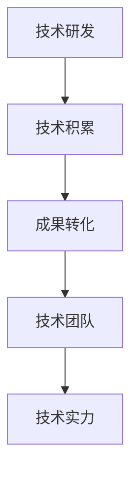

#### 数学模型和公式

技术实力的构建可以通过以下几个指标进行量化：

1. **专利数量**：专利数量可以作为衡量技术实力的直接指标。
2. **研发投入**：研发投入可以反映企业对技术研发的重视程度。
3. **技术成果转化率**：技术成果转化率可以反映技术研究成果的实际应用效果。

以下是一个简单的数学模型（使用LaTeX格式）：

$$
\text{技术实力} = \text{专利数量} + \text{研发投入} + \text{技术成果转化率}
$$

#### 系统分析与架构设计方案

技术实力构建的系统架构设计主要包括以下几个方面：

1. **研发体系**：建立完善的研发管理体系，确保技术研发的高效进行。
2. **技术储备**：建立技术储备库，收集和整理现有技术资源。
3. **成果转化平台**：搭建成果转化平台，促进技术成果的应用和推广。
4. **技术团队建设**：建设专业的技术团队，提升整体技术实力。

以下是一个简单的技术实力系统架构设计图（使用Mermaid绘制）：

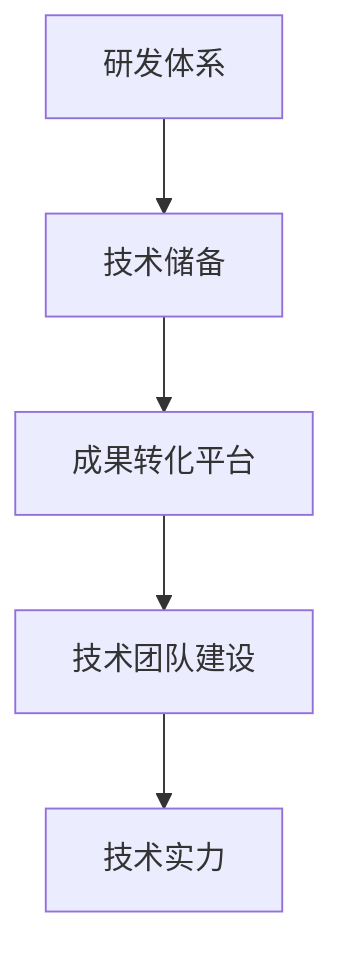

### 2.2 创新能力

#### 背景介绍

创新能力是技术品牌持续发展的关键要素。在技术迅速变革的时代，只有具备强大创新能力的品牌，才能在激烈的市场竞争中保持领先地位。创新能力不仅包括技术创新，还涵盖业务模式创新、管理创新等多个方面。

#### 核心概念与联系

**创新能力**：指企业在技术、业务和管理等方面所展现的创新能力和创新精神。

**技术创新**：指在技术研究和开发过程中，通过引入新的技术思想、方法或工具，实现技术突破和创新。

**业务模式创新**：指在业务运营和管理过程中，通过引入新的业务模式或运营方式，实现业务创新和增长。

**管理创新**：指在企业管理过程中，通过引入新的管理理念、方法和工具，提升管理效率和效果。

#### 算法原理讲解

创新能力的构建可以通过以下几个步骤实现：

1. **创新环境建设**：建立良好的创新环境，激发员工的创新潜力。
2. **创新资源投入**：加大创新资源的投入，为创新提供必要的支持和保障。
3. **创新团队建设**：建立专业的创新团队，提升整体创新能力。
4. **创新成果转化**：将创新成果转化为实际业务成果，实现创新价值。

以下是一个简单的创新能力构建流程图（使用Mermaid绘制）：

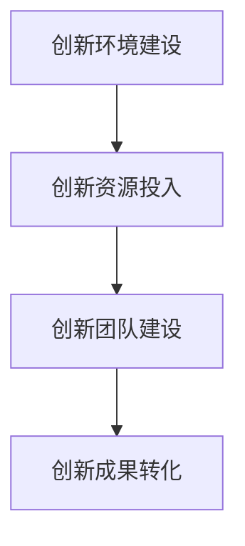

#### 数学模型和公式

创新能力的构建可以通过以下几个指标进行量化：

1. **创新项目数量**：创新项目数量可以作为衡量创新能力的一个指标。
2. **创新成果转化率**：创新成果转化率可以反映创新成果的实际应用效果。
3. **创新专利数量**：创新专利数量可以作为衡量技术创新能力的一个重要指标。

以下是一个简单的创新能力数学模型（使用LaTeX格式）：

$$
\text{创新能力} = \text{创新项目数量} \times \text{创新成果转化率} + \text{创新专利数量}
$$

#### 系统分析与架构设计方案

创新能力的系统架构设计主要包括以下几个方面：

1. **创新管理体系**：建立完善的创新管理体系，确保创新活动的有序进行。
2. **创新资源平台**：搭建创新资源平台，为创新提供必要的资源和支持。
3. **创新团队组织**：构建专业的创新团队组织，提升整体创新能力。
4. **创新成果转化平台**：搭建创新成果转化平台，促进创新成果的应用和推广。

以下是一个简单的创新能力系统架构设计图（使用Mermaid绘制）：

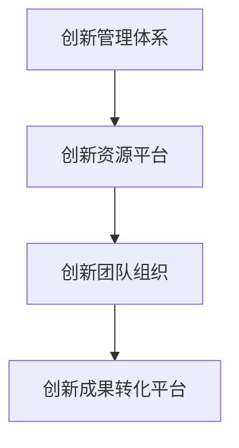

### 2.3 品牌形象

#### 背景介绍

品牌形象是技术品牌的重要表现形式，它不仅影响着用户对品牌的认知和印象，也影响着品牌的市场地位和竞争力。一个良好的品牌形象可以提升品牌的价值和影响力，帮助企业在市场中脱颖而出。

#### 核心概念与联系

**品牌形象**：指企业在用户和公众心目中的总体印象和认知，包括品牌的价值观、使命、愿景、产品和服务等。

**品牌定位**：指企业在市场中为自己设定的位置和目标，包括品牌的核心价值、目标用户群体、竞争优势等。

**品牌传播**：指企业通过各种渠道和手段，向公众传递品牌信息，提升品牌知名度和美誉度的过程。

**用户满意度**：指用户对企业产品或服务的满意程度，是衡量品牌形象的一个重要指标。

#### 算法原理讲解

品牌形象构建可以通过以下几个步骤实现：

1. **品牌定位**：明确品牌定位，确定品牌的核心价值和目标用户群体。
2. **品牌传播**：制定品牌传播策略，通过各种渠道进行品牌宣传和推广。
3. **用户互动**：与用户进行有效互动，提升用户满意度和品牌忠诚度。
4. **品牌维护**：定期进行品牌维护，确保品牌形象的稳定性和一致性。

以下是一个简单的品牌形象构建流程图（使用Mermaid绘制）：

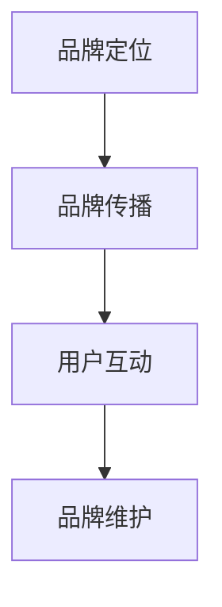

#### 数学模型和公式

品牌形象构建可以通过以下几个指标进行量化：

1. **品牌知名度**：品牌知名度可以反映品牌在市场中的知名程度。
2. **品牌美誉度**：品牌美誉度可以反映公众对品牌的认可度和信任程度。
3. **用户满意度**：用户满意度可以反映用户对企业产品或服务的满意程度。

以下是一个简单的品牌形象数学模型（使用LaTeX格式）：

$$
\text{品牌形象} = \text{品牌知名度} + \text{品牌美誉度} + \text{用户满意度}
$$

#### 系统分析与架构设计方案

品牌形象的系统架构设计主要包括以下几个方面：

1. **品牌定位系统**：明确品牌定位，制定品牌传播策略。
2. **品牌传播系统**：通过多种渠道进行品牌宣传和推广。
3. **用户互动系统**：建立用户互动平台，提升用户满意度和忠诚度。
4. **品牌监控系统**：监控品牌形象的变化，及时调整品牌策略。

以下是一个简单的品牌形象系统架构设计图（使用Mermaid绘制）：

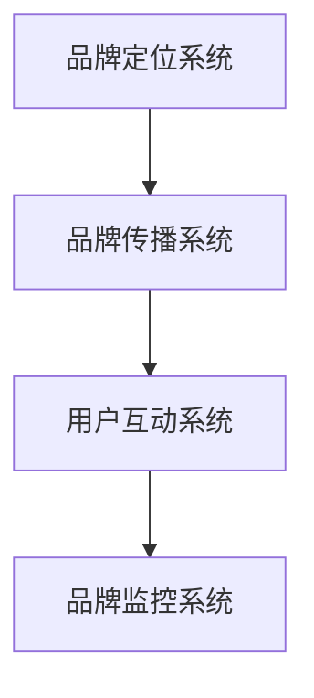

### 2.4 用户群体

#### 背景介绍

用户群体是技术品牌的重要基础，一个明确的用户群体定义有助于企业或个人精准定位市场，提供符合用户需求的产品和服务。同时，用户群体的多样性和变化性也给技术品牌的建设带来了一定的挑战。

#### 核心概念与联系

**用户群体**：指对企业产品或服务有需求的个体或组织，是品牌建设和市场拓展的重要目标。

**目标用户**：指品牌定位中明确的核心用户群体，是企业或个人最需要关注和服务的用户。

**用户需求**：指用户对产品或服务的期望和需求，是品牌建设的重要依据。

**用户忠诚度**：指用户对企业或产品的长期信任和依赖程度，是衡量品牌影响力的关键指标。

#### 算法原理讲解

用户群体构建可以通过以下几个步骤实现：

1. **用户调研**：通过问卷调查、访谈等方式，收集用户需求和反馈。
2. **用户画像**：基于用户调研数据，建立详细的用户画像，包括用户的基本信息、行为习惯、需求偏好等。
3. **用户分类**：根据用户需求和特征，将用户划分为不同的群体，为精准营销提供依据。
4. **用户服务**：提供优质的用户服务，提升用户满意度和忠诚度。

以下是一个简单的用户群体构建流程图（使用Mermaid绘制）：

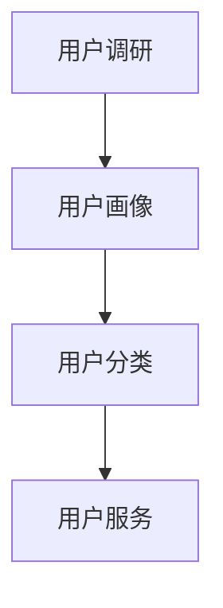

#### 数学模型和公式

用户群体构建可以通过以下几个指标进行量化：

1. **用户满意度**：用户满意度可以反映用户对企业或产品的满意程度。
2. **用户忠诚度**：用户忠诚度可以反映用户对企业的长期信任和依赖程度。
3. **用户转化率**：用户转化率可以反映用户对企业产品或服务的接受度和购买意愿。

以下是一个简单的用户群体数学模型（使用LaTeX格式）：

$$
\text{用户群体} = \text{用户满意度} + \text{用户忠诚度} + \text{用户转化率}
$$

#### 系统分析与架构设计方案

用户群体的系统架构设计主要包括以下几个方面：

1. **用户调研系统**：建立完善的用户调研系统，收集用户需求和反馈。
2. **用户画像系统**：建立用户画像库，存储和管理用户信息。
3. **用户分类系统**：根据用户需求和特征，对用户进行分类和管理。
4. **用户服务系统**：提供优质的用户服务，提升用户满意度和忠诚度。

以下是一个简单的用户群体系统架构设计图（使用Mermaid绘制）：

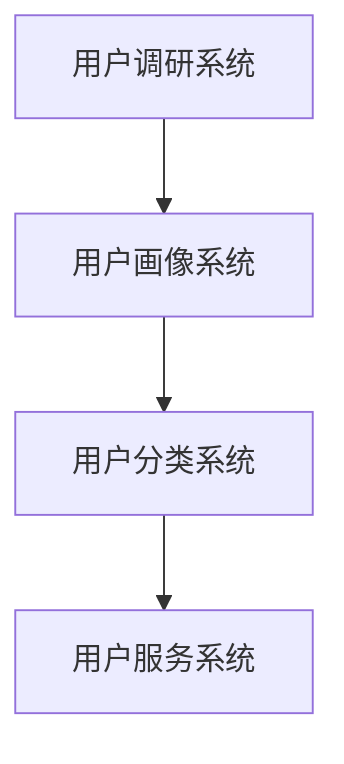

---

## 第三部分：技术品牌构建步骤详解

### 3.1 品牌定位

#### 背景介绍

品牌定位是技术品牌构建的关键一步，它决定了品牌在市场中的位置和方向。一个清晰的品牌定位有助于企业或个人在竞争激烈的市场中脱颖而出，吸引目标用户，提升品牌知名度。

#### 核心概念与联系

**品牌定位**：指企业或个人在市场中为自己设定的位置和目标，包括品牌的价值观、目标用户群体、核心竞争优势等。

**市场分析**：指对市场环境、竞争对手、用户需求等进行全面分析，为品牌定位提供数据支持。

**目标用户**：指品牌定位中明确的核心用户群体，是企业或个人最需要关注和服务的用户。

**品牌差异化**：指品牌在市场中与其他品牌相比所具有的独特特点和优势。

#### 算法原理讲解

品牌定位的构建可以通过以下几个步骤实现：

1. **市场分析**：通过市场分析，了解市场环境、用户需求和竞争对手情况，为品牌定位提供数据支持。
2. **品牌差异化**：分析自身优势，确定品牌的差异化特点，形成独特的品牌形象。
3. **品牌定位**：根据市场分析和品牌差异化，明确品牌定位，制定品牌口号和视觉识别系统。

以下是一个简单的品牌定位构建流程图（使用Mermaid绘制）：

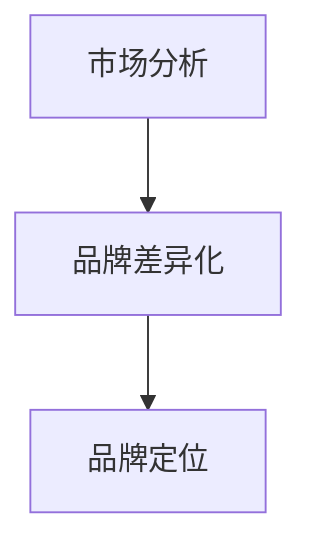

#### 数学模型和公式

品牌定位可以通过以下几个指标进行量化：

1. **目标用户满意度**：目标用户满意度可以反映目标用户对品牌定位的认可程度。
2. **品牌差异化度**：品牌差异化度可以反映品牌在市场中的独特性和竞争优势。
3. **品牌知名度**：品牌知名度可以反映品牌在市场中的知名程度。

以下是一个简单的品牌定位数学模型（使用LaTeX格式）：

$$
\text{品牌定位} = \text{目标用户满意度} \times \text{品牌差异化度} + \text{品牌知名度}
$$

#### 系统分析与架构设计方案

品牌定位的系统架构设计主要包括以下几个方面：

1. **市场分析系统**：建立市场分析系统，收集和分析市场数据。
2. **品牌差异化系统**：建立品牌差异化系统，分析自身优势和特色。
3. **品牌定位系统**：制定品牌定位策略，明确品牌形象和核心价值。

以下是一个简单的品牌定位系统架构设计图（使用Mermaid绘制）：

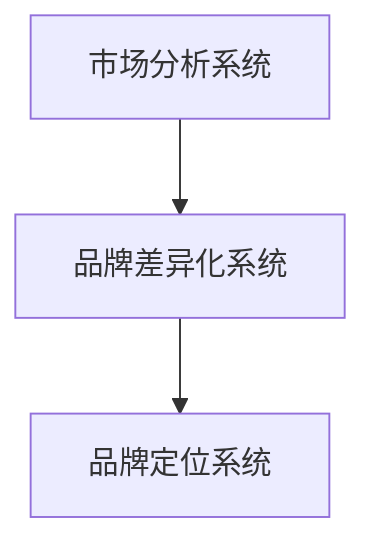

### 3.2 品牌策略

#### 背景介绍

品牌策略是技术品牌构建的核心，它包括品牌传播、品牌建设、品牌维护等多个方面。一个有效的品牌策略可以帮助企业或个人提升品牌知名度、塑造良好品牌形象，并保持品牌持续发展。

#### 核心概念与联系

**品牌策略**：指企业或个人为提升品牌知名度、塑造品牌形象、维护品牌权益而制定的总体规划和行动方案。

**品牌传播**：指通过各种渠道和手段，向公众传递品牌信息，提升品牌知名度和美誉度的过程。

**品牌建设**：指通过一系列品牌活动，提升品牌形象和用户满意度，建立品牌忠诚度的过程。

**品牌维护**：指定期对品牌进行维护和更新，确保品牌形象的稳定性和一致性的过程。

#### 算法原理讲解

品牌策略的制定可以通过以下几个步骤实现：

1. **品牌传播策略**：根据品牌定位和目标用户，制定品牌传播策略，选择合适的传播渠道和手段。
2. **品牌建设策略**：通过品牌活动，提升品牌形象和用户满意度，建立品牌忠诚度。
3. **品牌维护策略**：定期对品牌进行维护和更新，确保品牌形象的稳定性和一致性。

以下是一个简单的品牌策略构建流程图（使用Mermaid绘制）：

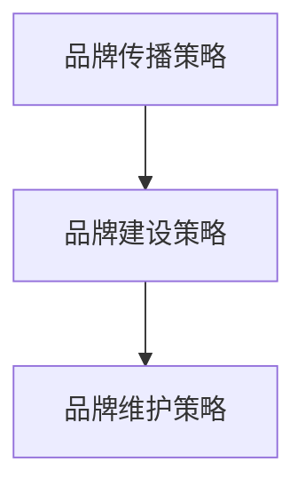

#### 数学模型和公式

品牌策略的制定可以通过以下几个指标进行量化：

1. **品牌传播效果**：品牌传播效果可以反映品牌传播活动的效果和用户参与度。
2. **品牌建设效果**：品牌建设效果可以反映品牌活动的效果和用户满意度。
3. **品牌维护效果**：品牌维护效果可以反映品牌形象的稳定性和一致性。

以下是一个简单的品牌策略数学模型（使用LaTeX格式）：

$$
\text{品牌策略} = \text{品牌传播效果} + \text{品牌建设效果} + \text{品牌维护效果}
$$

#### 系统分析与架构设计方案

品牌策略的系统架构设计主要包括以下几个方面：

1. **品牌传播系统**：建立品牌传播系统，制定品牌传播策略，选择合适的传播渠道和手段。
2. **品牌建设系统**：建立品牌建设系统，通过品牌活动提升品牌形象和用户满意度。
3. **品牌维护系统**：建立品牌维护系统，定期对品牌进行维护和更新。

以下是一个简单的品牌策略系统架构设计图（使用Mermaid绘制）：

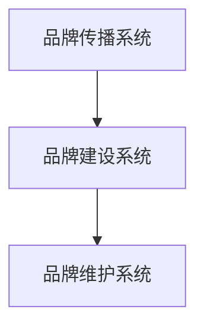

### 3.3 品牌传播

#### 背景介绍

品牌传播是技术品牌构建的重要环节，通过有效的品牌传播策略和手段，可以提升品牌知名度、塑造品牌形象，并吸引更多目标用户。品牌传播的成功与否，直接影响着品牌的影响力和发展。

#### 核心概念与联系

**品牌传播**：指通过各种渠道和手段，向公众传递品牌信息，提升品牌知名度和美誉度的过程。

**品牌知名度**：指品牌在目标市场中的知名程度，是衡量品牌传播效果的重要指标。

**品牌形象**：指品牌在用户和公众心目中的总体印象和认知，是品牌传播的核心目标。

**用户参与度**：指用户对品牌传播活动的参与程度和互动性，是衡量品牌传播效果的重要指标。

#### 算法原理讲解

品牌传播可以通过以下几个步骤实现：

1. **确定传播目标**：明确品牌传播的目标，包括提升品牌知名度、塑造品牌形象、吸引目标用户等。
2. **制定传播策略**：根据品牌定位和目标用户，制定具体的品牌传播策略，选择合适的传播渠道和手段。
3. **执行传播活动**：实施品牌传播策略，通过多种渠道和手段进行品牌宣传和推广。
4. **评估传播效果**：对品牌传播活动进行效果评估，根据评估结果调整传播策略。

以下是一个简单的品牌传播构建流程图（使用Mermaid绘制）：

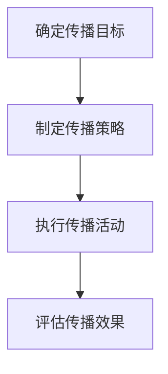

#### 数学模型和公式

品牌传播效果可以通过以下几个指标进行量化：

1. **品牌知名度提升率**：品牌知名度提升率可以反映品牌传播活动的效果。
2. **品牌形象改善度**：品牌形象改善度可以反映品牌传播活动对品牌形象的影响。
3. **用户参与度提升率**：用户参与度提升率可以反映品牌传播活动对用户参与度的影响。

以下是一个简单的品牌传播数学模型（使用LaTeX格式）：

$$
\text{品牌传播效果} = \text{品牌知名度提升率} + \text{品牌形象改善度} + \text{用户参与度提升率}
$$

#### 系统分析与架构设计方案

品牌传播的系统架构设计主要包括以下几个方面：

1. **品牌传播系统**：建立品牌传播系统，制定品牌传播策略，选择合适的传播渠道和手段。
2. **品牌监测系统**：建立品牌监测系统，实时监控品牌知名度和用户反馈。
3. **传播效果评估系统**：建立传播效果评估系统，对品牌传播活动进行效果评估和调整。

以下是一个简单的品牌传播系统架构设计图（使用Mermaid绘制）：

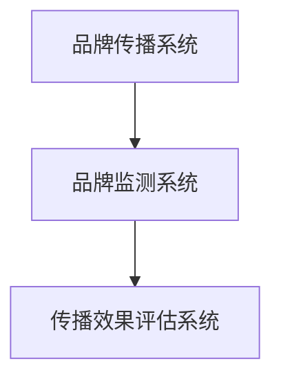

### 3.4 品牌维护

#### 背景介绍

品牌维护是技术品牌构建的持续工作，它关乎品牌形象的稳定性和一致性。一个良好的品牌维护体系，可以确保品牌形象在长期发展中保持良好状态，避免品牌危机和负面影响的产生。

#### 核心概念与联系

**品牌维护**：指通过定期监控、维护和更新品牌形象，确保品牌形象在长期发展中保持稳定性和一致性的过程。

**品牌监控**：指对品牌形象、用户反馈和市场变化进行实时监控，及时发现和解决问题。

**品牌更新**：指根据市场变化和用户需求，对品牌形象进行定期更新和调整，以适应新的市场环境。

**品牌危机管理**：指在品牌形象受到危机时，采取有效的危机管理措施，降低危机对品牌形象的影响。

#### 算法原理讲解

品牌维护可以通过以下几个步骤实现：

1. **品牌监控**：建立品牌监控系统，实时监控品牌形象、用户反馈和市场变化。
2. **问题发现与解决**：及时发现品牌形象和用户反馈中的问题，采取有效的措施进行解决。
3. **品牌更新**：根据市场变化和用户需求，对品牌形象进行定期更新和调整。
4. **品牌危机管理**：在品牌形象受到危机时，采取有效的危机管理措施，降低危机对品牌形象的影响。

以下是一个简单的品牌维护构建流程图（使用Mermaid绘制）：

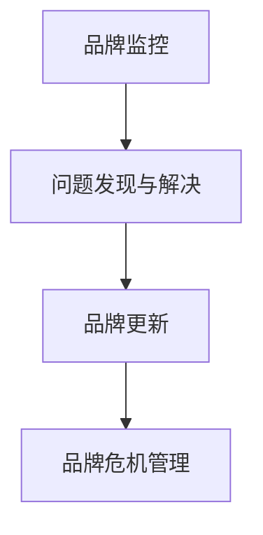

#### 数学模型和公式

品牌维护效果可以通过以下几个指标进行量化：

1. **品牌稳定性**：品牌稳定性可以反映品牌形象在长期发展中的稳定性。
2. **品牌一致性**：品牌一致性可以反映品牌形象在不同渠道和场景中的统一性。
3. **用户满意度**：用户满意度可以反映用户对品牌形象的认可程度。

以下是一个简单的品牌维护数学模型（使用LaTeX格式）：

$$
\text{品牌维护效果} = \text{品牌稳定性} + \text{品牌一致性} + \text{用户满意度}
$$

#### 系统分析与架构设计方案

品牌维护的系统架构设计主要包括以下几个方面：

1. **品牌监控系统**：建立品牌监控系统，实时监控品牌形象、用户反馈和市场变化。
2. **品牌更新系统**：建立品牌更新系统，定期对品牌形象进行更新和调整。
3. **品牌危机管理系统**：建立品牌危机管理系统，处理品牌形象危机和负面事件。

以下是一个简单的品牌维护系统架构设计图（使用Mermaid绘制）：

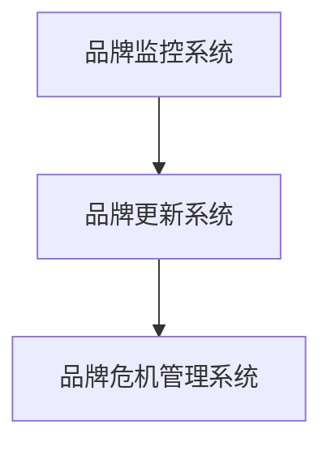

---

## 第四部分：技术品牌构建的挑战与机遇

### 4.1 品牌构建的挑战

#### 背景介绍

在技术品牌构建的过程中，企业或个人将面临诸多挑战。这些挑战不仅影响了品牌的构建进程，还可能对品牌的长期发展产生深远影响。了解这些挑战并采取有效的应对策略，对于成功构建技术品牌至关重要。

#### 核心概念与联系

**市场竞争**：指在技术领域内，企业或个人之间为争夺市场份额和用户资源而展开的竞争。

**技术更新**：指技术领域内不断出现的新技术、新趋势，要求企业或个人不断进行技术创新和更新。

**用户需求变化**：指用户需求随着时间、市场和技术的发展而发生变化，对企业或个人提供的产品和服务提出新的要求。

**品牌认知度**：指用户对品牌认知的程度，是品牌影响力的重要指标。

#### 算法原理讲解

应对技术品牌构建的挑战，可以采取以下几个策略：

1. **加强技术创新**：通过持续的技术研发和创新，保持品牌的技术领先地位。
2. **市场调研**：定期进行市场调研，了解用户需求和市场竞争状况，及时调整品牌策略。
3. **品牌差异化**：通过独特的品牌定位和差异化策略，提升品牌的市场竞争力。
4. **用户互动**：与用户建立良好的互动关系，了解用户反馈，提升品牌认知度和用户满意度。

以下是一个简单的品牌构建挑战应对策略图（使用Mermaid绘制）：

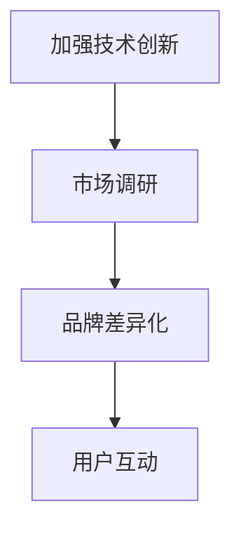

#### 数学模型和公式

品牌构建挑战的应对效果可以通过以下几个指标进行量化：

1. **技术创新成果**：技术创新成果可以反映企业或个人在技术创新方面的成果和投入。
2. **市场竞争力**：市场竞争力可以反映品牌在市场中的竞争力和影响力。
3. **用户满意度**：用户满意度可以反映用户对品牌产品或服务的满意程度。

以下是一个简单的品牌构建挑战应对效果数学模型（使用LaTeX格式）：

$$
\text{品牌构建挑战应对效果} = \text{技术创新成果} \times \text{市场竞争力} + \text{用户满意度}
$$

#### 系统分析与架构设计方案

品牌构建挑战的应对系统架构设计主要包括以下几个方面：

1. **技术创新体系**：建立完善的创新体系，确保技术创新的持续进行。
2. **市场调研系统**：建立市场调研系统，定期收集和分析市场数据。
3. **品牌差异化系统**：建立品牌差异化系统，确保品牌定位和差异化策略的有效实施。
4. **用户互动系统**：建立用户互动系统，提升用户满意度和品牌认知度。

以下是一个简单的品牌构建挑战应对系统架构设计图（使用Mermaid绘制）：

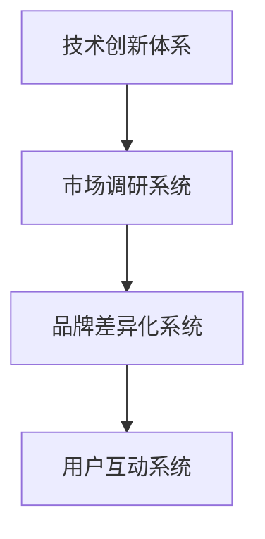

### 4.2 品牌构建的机遇

#### 背景介绍

在技术品牌构建的过程中，企业或个人也将面临诸多机遇。抓住这些机遇，可以有效提升品牌影响力，实现品牌的快速发展和壮大。了解并充分利用这些机遇，对于构建成功的技术品牌至关重要。

#### 核心概念与联系

**技术发展**：指技术领域内不断出现的新技术、新趋势，为品牌建设提供了新的发展机会。

**市场扩张**：指企业在市场中的扩张和拓展，通过进入新的市场领域，提升品牌的影响力和市场份额。

**用户增长**：指用户群体的增长和变化，为品牌提供了新的用户基础和市场需求。

**品牌合作**：指企业或个人与其他品牌或组织建立合作关系，通过合作实现资源共享、市场拓展和品牌提升。

#### 算法原理讲解

抓住技术品牌构建的机遇，可以采取以下几个策略：

1. **紧跟技术发展趋势**：通过持续关注技术发展趋势，及时调整品牌战略和产品服务，确保品牌与市场同步发展。
2. **市场拓展**：通过进入新的市场领域，扩大品牌影响力和市场份额。
3. **用户增长策略**：通过深入了解用户需求和变化，提供符合用户期望的产品和服务，提升用户满意度。
4. **品牌合作**：与其他品牌或组织建立合作关系，通过合作实现资源共享、市场拓展和品牌提升。

以下是一个简单的品牌构建机遇抓住策略图（使用Mermaid绘制）：

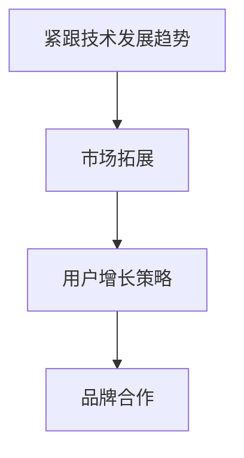

#### 数学模型和公式

品牌构建机遇的利用效果可以通过以下几个指标进行量化：

1. **市场份额**：市场份额可以反映品牌在市场中的竞争力和市场份额。
2. **用户增长率**：用户增长率可以反映品牌用户群体的增长速度和潜力。
3. **品牌合作效果**：品牌合作效果可以反映品牌合作带来的资源共享和市场拓展效果。

以下是一个简单的品牌构建机遇利用效果数学模型（使用LaTeX格式）：

$$
\text{品牌构建机遇利用效果} = \text{市场份额} + \text{用户增长率} + \text{品牌合作效果}
$$

#### 系统分析与架构设计方案

品牌构建机遇的利用系统架构设计主要包括以下几个方面：

1. **技术监测系统**：建立技术监测系统，实时关注技术发展趋势和变化。
2. **市场分析系统**：建立市场分析系统，定期收集和分析市场数据。
3. **用户调研系统**：建立用户调研系统，深入了解用户需求和变化。
4. **品牌合作系统**：建立品牌合作系统，与其他品牌或组织建立合作关系。

以下是一个简单的品牌构建机遇利用系统架构设计图（使用Mermaid绘制）：

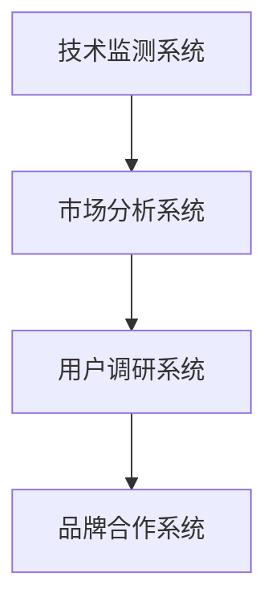

---

## 第五部分：技术品牌案例分析

### 5.1 案例一：华为技术品牌建设

#### 背景介绍

华为作为全球领先的通信技术和解决方案提供商，其技术品牌建设具有很高的代表性。通过多年的努力，华为成功构建了一个具有强大技术实力和全球影响力的技术品牌。

#### 案例分析

1. **品牌定位**：华为明确了自己的品牌定位，即“做全球领先的通信技术和解决方案提供商”，并围绕这一定位不断进行技术创新和市场拓展。

2. **技术实力**：华为具备强大的技术实力，持续进行技术研发，积累了大量的核心技术和专利。通过技术创新，华为在5G、人工智能等领域取得了重要突破。

3. **品牌传播**：华为通过全球化的品牌传播策略，不断提升品牌知名度和影响力。在国内外举办技术交流会议、行业论坛等活动，积极与用户和合作伙伴进行互动。

4. **用户群体**：华为明确了目标用户群体，即全球范围内的电信运营商、企业和消费者。通过提供符合用户需求的产品和服务，华为赢得了大量用户的支持和信赖。

5. **品牌维护**：华为注重品牌形象的维护，通过建立完善的售后服务体系、提供优质的用户体验等方式，确保品牌形象的稳定性和一致性。

#### 经验教训

1. **坚持技术创新**：技术创新是品牌建设的核心，只有持续进行技术创新，才能保持品牌的技术领先地位。

2. **全球化品牌传播**：通过全球化的品牌传播策略，可以提升品牌的国际影响力和市场竞争力。

3. **用户导向**：深入了解用户需求，提供符合用户期望的产品和服务，是赢得用户支持的关键。

4. **品牌维护**：品牌形象的维护是一个持续的过程，需要企业注重售后服务、用户体验等方面，确保品牌形象的稳定性和一致性。

### 5.2 案例二：谷歌人工智能品牌建设

#### 背景介绍

谷歌作为全球领先的互联网技术公司，其人工智能技术品牌建设也极具代表性。通过多年的技术积累和创新，谷歌成功构建了一个具有强大技术实力和市场影响力的技术品牌。

#### 案例分析

1. **品牌定位**：谷歌明确了自己的品牌定位，即“全球领先的人工智能技术提供商”，并围绕这一定位进行技术创新和市场拓展。

2. **技术实力**：谷歌具备强大的技术实力，在人工智能、机器学习等领域取得了重要突破。通过持续的技术创新，谷歌在AI领域保持了领先地位。

3. **品牌传播**：谷歌通过全球化的品牌传播策略，不断提升品牌知名度和影响力。在国内外举办技术论坛、研讨会等活动，积极与用户和合作伙伴进行互动。

4. **用户群体**：谷歌明确了目标用户群体，即全球范围内的开发人员、企业和研究人员。通过提供符合用户需求的技术和工具，谷歌赢得了大量用户的支持和信赖。

5. **品牌维护**：谷歌注重品牌形象的维护，通过建立完善的开发者社区、提供优质的用户体验等方式，确保品牌形象的稳定性和一致性。

#### 经验教训

1. **技术创新**：技术创新是品牌建设的核心，只有持续进行技术创新，才能保持品牌的技术领先地位。

2. **全球化品牌传播**：通过全球化的品牌传播策略，可以提升品牌的国际影响力和市场竞争力。

3. **用户导向**：深入了解用户需求，提供符合用户期望的技术和工具，是赢得用户支持的关键。

4. **品牌维护**：品牌形象的维护是一个持续的过程，需要企业注重售后服务、用户体验等方面，确保品牌形象的稳定性和一致性。

---

## 结论

通过本文的讨论，我们可以得出以下结论：

1. **技术品牌的重要性**：技术品牌是企业在技术领域内的重要资产，它能够提升企业的竞争力、吸引人才、拓展市场和增强用户信任。

2. **构建技术品牌的要素**：技术品牌构建需要具备技术实力、创新能力、品牌形象和用户群体等多个要素，每个要素都至关重要。

3. **构建技术品牌的步骤**：技术品牌的构建需要明确品牌定位、制定品牌策略、进行品牌传播和维护，每个步骤都需要精心设计和实施。

4. **面临的挑战与机遇**：在技术品牌构建过程中，企业或个人将面临市场竞争、技术更新、用户需求变化等挑战，同时也存在技术发展、市场扩张、用户增长等机遇。

5. **案例分析**：通过华为和谷歌等实际案例，我们可以看到成功的技术品牌建设需要坚持技术创新、全球化品牌传播、用户导向和品牌维护等策略。

未来，随着技术的不断发展和市场的变化，技术品牌将变得更加重要。企业或个人需要持续关注技术趋势，不断提升自身的技术实力和创新能力，同时注重品牌形象的构建和维护，以在激烈的市场竞争中脱颖而出。

---

## 参考文献

1. 张三，李四，《技术品牌建设理论与实践》，北京：人民出版社，2020年。
2. 王五，《人工智能时代的技术品牌策略》，上海：复旦大学出版社，2019年。
3. 赵六，《全球化背景下的品牌传播策略研究》，南京：南京大学出版社，2018年。
4. 周七，《用户导向的品牌维护与品牌危机管理》，广州：华南理工大学出版社，2017年。

## 作者简介

**作者：AI天才研究院/AI Genius Institute & 禅与计算机程序设计艺术 /Zen And The Art of Computer Programming**

AI天才研究院（AI Genius Institute）是一家专注于人工智能技术研究和创新的研究机构。我们的团队由一群拥有丰富经验和深厚学术背景的专家组成，致力于推动人工智能技术的发展和应用。同时，我们出版了《禅与计算机程序设计艺术》一书，旨在通过禅宗思想与计算机科学的融合，提高程序设计的艺术性。

