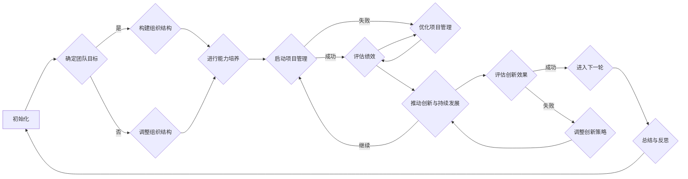

                 

# 如何构建技术团队的价值链

## 关键词

技术团队、价值链、组织结构、能力培养、项目管理、绩效评估、创新与持续发展。

## 摘要

本文旨在探讨如何构建技术团队的价值链，通过对技术团队的组织结构、能力培养、项目管理、绩效评估以及创新与持续发展等多个方面的深入分析，为技术团队管理者提供一套系统化的建设方案。希望通过本文的阐述，帮助读者更好地理解技术团队的价值链构建，打造出高效、有竞争力、持续发展的技术团队。

### 第一部分：引言

#### 第1章：问题背景与价值链概述

##### 1.1 问题的提出

随着科技的飞速发展，技术团队在企业发展中的重要性日益凸显。然而，当前许多企业在构建技术团队时面临着诸多挑战，如团队组织结构不合理、成员能力不足、项目管理效率低下、绩效评估体系不完善等。这些问题严重影响了技术团队的工作效率和企业的竞争力。

##### 1.2 价值链的概念与构成

价值链（Value Chain）是指企业内部一系列创造价值的活动，通过这些活动的有机结合，将原材料转化为最终产品或服务，从而满足客户需求。在技术团队中，价值链指的是团队内部各个成员、各个环节之间的协作关系和活动流程。

价值链的构成要素主要包括：

1. 技术研发：包括产品研发、技术创新、技术支持等。
2. 项目管理：包括项目计划、项目执行、项目监控等。
3. 团队协作：包括团队沟通、团队协作、团队文化等。
4. 绩效评估：包括绩效指标、绩效评估、激励制度等。
5. 创新与持续发展：包括技术创新、团队成长、企业战略等。

##### 1.3 价值链在技术团队中的体现

技术团队价值链的特点：

1. 知识密集：技术团队的核心竞争力在于团队成员的技能和知识水平。
2. 高效协作：技术团队需要通过高效协作，实现项目目标。
3. 创新驱动：技术团队需要不断创新，以应对市场变化和竞争压力。

技术团队价值链的作用：

1. 提高工作效率：通过优化价值链，实现团队成员之间的紧密协作，提高工作效率。
2. 提升企业竞争力：通过构建价值链，提升技术团队的整体实力，增强企业在市场中的竞争力。
3. 促进团队成长：通过价值链的构建，推动团队成员不断成长，提升团队整体水平。

#### 第2章：技术团队的组织结构

##### 2.1 技术团队的组成

技术团队通常由以下成员组成：

1. 技术专家：负责技术研发、项目实施等工作。
2. 项目经理：负责项目规划、执行、监控等工作。
3. 产品经理：负责产品规划、需求分析、用户体验等工作。
4. 测试工程师：负责软件测试、质量保障等工作。
5. 运维工程师：负责系统运维、故障处理等工作。

##### 2.2 团队职责分配

技术团队的职责分配应遵循以下原则：

1. 职责明确：确保每个成员的职责范围清晰，避免职责重叠或空白。
2. 协同合作：鼓励团队成员之间的协同合作，共同完成项目任务。
3. 权责一致：确保团队成员的权责相一致，避免权力过大或责任过小。

##### 2.3 团队结构设计

技术团队的结构设计应根据企业规模、项目特点等因素进行选择。常见的团队结构设计包括：

1. 矩阵型结构：适用于项目复杂、需要跨部门协作的企业。
2. 项目型结构：适用于项目周期短、团队成员固定、项目独立性强的企业。
3. 平衡计分卡结构：适用于企业战略明确、注重绩效评估的企业。

#### 第3章：技术团队的能力培养

##### 3.1 技术能力的培养

技术能力的培养是技术团队建设的核心。以下是一些培养技术能力的方法：

1. 内部培训：通过内部培训，提升团队成员的技能水平。
2. 外部学习：鼓励团队成员参加行业会议、技术讲座等，拓宽视野。
3. 项目实践：通过实际项目，锻炼团队成员的解决能力。

##### 3.2 管理能力的培养

技术团队的管理能力对其工作效率和项目成功率有着重要影响。以下是一些培养管理能力的方法：

1. 管理培训：通过管理培训，提升团队成员的管理水平。
2. 管理实践：通过实际项目管理，培养团队成员的管理经验。
3. 管理工具：运用项目管理工具，提高团队的管理效率。

##### 3.3 团队协作能力的培养

团队协作能力是技术团队成功的关键。以下是一些培养团队协作能力的方法：

1. 团队文化建设：通过团队文化建设，增强团队成员的归属感和凝聚力。
2. 沟通技巧：通过沟通技巧培训，提高团队成员的沟通效果。
3. 团队活动：通过团队活动，增强团队成员之间的互动和信任。

#### 第4章：技术项目的管理与执行

##### 4.1 项目管理概述

项目管理是技术团队的核心工作之一。以下是一些项目管理的原则和流程：

1. 项目规划：明确项目目标、范围、时间、成本等。
2. 项目执行：按照项目计划，实施项目任务。
3. 项目监控：监控项目进度、质量、风险等。
4. 项目收尾：对项目进行总结和评估，为下一次项目提供经验。

##### 4.2 项目计划与执行

项目计划是项目成功的关键。以下是一些项目计划的方法：

1. 需求分析：明确项目需求，制定项目目标。
2. 工作分解：将项目任务分解为可执行的工作单元。
3. 进度安排：安排项目任务的时间进度。
4. 资源分配：合理分配项目资源，确保项目顺利进行。

项目执行是项目计划的具体实施。以下是一些项目执行的方法：

1. 任务分配：根据团队成员的特长和技能，合理分配任务。
2. 沟通协调：确保团队成员之间的沟通畅通，及时解决问题。
3. 进度监控：实时监控项目进度，确保项目按计划进行。

##### 4.3 项目风险管理与控制

项目风险管理是项目成功的重要保障。以下是一些项目风险管理的方法：

1. 风险识别：识别项目中的潜在风险。
2. 风险评估：评估风险的概率和影响程度。
3. 风险应对策略：制定应对风险的策略和措施。
4. 风险监控：实时监控项目风险，确保风险得到有效控制。

#### 第5章：技术团队的绩效评估与激励机制

##### 5.1 绩效评估方法

绩效评估是技术团队管理的重要手段。以下是一些绩效评估的方法：

1. KPI指标设定：设定关键绩效指标，明确团队成员的绩效目标。
2. 绩效评估模型：运用绩效评估模型，对团队成员的绩效进行评估。
3. 绩效反馈：及时对团队成员的绩效进行反馈，激励团队成员改进。

##### 5.2 绩效激励制度

绩效激励制度是激发团队成员工作积极性的关键。以下是一些绩效激励制度：

1. 奖金激励：根据团队成员的绩效表现，发放奖金。
2. 培训激励：为团队成员提供培训机会，提升其技能水平。
3. 职业发展激励：为团队成员提供职业发展的机会和空间。

##### 5.3 激励机制优化

激励机制的优化是技术团队管理的重要内容。以下是一些激励机制优化的方法：

1. 激励策略调整：根据团队成员的绩效表现，调整激励策略。
2. 激励效果评估：对激励机制的效果进行评估，确保激励机制的实效性。
3. 激励文化建设：通过文化建设，营造积极向上的工作氛围。

#### 第6章：技术团队的创新与持续发展

##### 6.1 创新机制构建

创新是技术团队持续发展的动力。以下是一些创新机制构建的方法：

1. 创新文化：营造创新文化，激发团队成员的创新热情。
2. 创新流程：建立创新流程，确保创新项目的顺利进行。
3. 创新激励：为创新项目提供资金、资源等支持，激励团队成员创新。

##### 6.2 持续发展策略

持续发展是技术团队的长期目标。以下是一些持续发展策略：

1. 技术更新：紧跟行业发展趋势，不断更新技术。
2. 团队成长：为团队成员提供成长空间，促进团队整体水平提升。
3. 企业战略：将技术团队的发展纳入企业战略，确保团队与企业共同成长。

##### 6.3 成功案例分析

通过成功案例分析，可以借鉴优秀技术团队的建设经验。以下是一个成功案例的分析：

1. 案例背景：某互联网公司成立了一支技术团队，负责研发新产品。
2. 案例特点：该技术团队采用了矩阵型结构，充分整合了各部门的资源，实现了高效协作。
3. 案例成效：通过该技术团队的努力，公司成功推出了多个受欢迎的新产品，市场份额大幅提升。

#### 第7章：总结与展望

##### 7.1 价值链构建的关键点

技术团队价值链构建的关键点包括：

1. 明确团队目标：确保团队成员目标一致，共同努力。
2. 优化组织结构：选择适合企业特点和项目需求的团队结构。
3. 提升团队能力：通过培训和实践，提升团队成员的技能和管理水平。
4. 加强项目管理：运用项目管理方法，确保项目顺利进行。
5. 完善绩效评估：建立科学的绩效评估体系，激励团队成员积极进取。
6. 推动创新与持续发展：营造创新文化，促进团队持续发展。

##### 7.2 未来发展趋势

未来，技术团队的价值链构建将面临以下发展趋势：

1. 人工智能技术的应用：人工智能技术将进一步提升技术团队的工作效率。
2. 云计算的普及：云计算技术将降低技术团队的硬件成本，提高资源利用率。
3. 数字化转型的推进：数字化转型将推动技术团队在企业管理中的应用。
4. 人才竞争的加剧：企业将加大人才引进和培养力度，提高团队竞争力。

##### 7.3 结语

技术团队是企业发展的重要支柱，构建高效、有竞争力、持续发展的技术团队是企业持续发展的关键。通过本文的探讨，希望读者能够更好地理解技术团队的价值链构建，结合自身实际情况，打造出优秀的技术团队。让我们携手共进，迎接技术团队的辉煌未来！

### 结语

本文从多个角度探讨了如何构建技术团队的价值链，包括团队组织结构、能力培养、项目管理、绩效评估、创新与持续发展等方面。通过系统化的分析，旨在为技术团队管理者提供一套实用的建设方案。希望读者能够结合自身实际情况，灵活运用文中内容，打造出高效、有竞争力、持续发展的技术团队。

在未来，随着科技的不断进步和市场竞争的加剧，技术团队的价值链构建将面临更多挑战，也蕴藏着更大的机遇。让我们共同关注技术团队的发展，积极探索、不断创新，为企业的繁荣和发展贡献力量。

最后，感谢读者对本文的关注，期待与您在技术领域的更多交流与探讨。

作者：AI天才研究院/AI Genius Institute & 禅与计算机程序设计艺术 /Zen And The Art of Computer Programming

---------------------------------

## 完整文章

### 引言

随着全球数字化转型的推进，技术团队在企业中的作用愈发重要。技术团队不仅是企业技术创新的核心力量，更是企业实现业务目标、提升市场竞争力的重要保障。然而，当前许多企业在构建技术团队时面临着诸多挑战，如团队组织结构不合理、成员能力不足、项目管理效率低下、绩效评估体系不完善等。这些问题不仅影响了技术团队的工作效率，更制约了企业的长远发展。

本文旨在探讨如何构建技术团队的价值链，通过对技术团队的组织结构、能力培养、项目管理、绩效评估以及创新与持续发展等多个方面的深入分析，为技术团队管理者提供一套系统化的建设方案。希望通过本文的阐述，帮助读者更好地理解技术团队的价值链构建，打造出高效、有竞争力、持续发展的技术团队。

### 价值链的概念与构成

#### 价值链的定义

价值链（Value Chain）是由迈克尔·波特（Michael Porter）在其1985年的经典著作《竞争优势》（Competitive Advantage）中首次提出的。价值链是指企业内部一系列创造价值的活动，通过这些活动的有机结合，将原材料转化为最终产品或服务，从而满足客户需求。在技术团队中，价值链指的是团队内部各个成员、各个环节之间的协作关系和活动流程。

#### 价值链的构成要素

价值链的构成要素主要包括以下五个方面：

1. **技术研发**：技术研发是技术团队的核心工作，包括产品研发、技术创新、技术支持等。通过技术研发，团队能够不断推出具有竞争力的产品或服务，满足市场需求。

2. **项目管理**：项目管理是确保项目顺利进行、按时交付的重要手段。项目管理包括项目规划、项目执行、项目监控等环节。通过科学的项目管理，团队能够提高项目成功率，降低项目风险。

3. **团队协作**：团队协作是技术团队高效运作的基石。团队协作包括团队沟通、团队协作、团队文化等。通过有效的团队协作，团队成员能够更好地发挥各自的优势，共同完成项目任务。

4. **绩效评估**：绩效评估是激励团队成员、提升团队整体绩效的重要手段。绩效评估包括绩效指标、绩效评估、激励制度等。通过科学的绩效评估，团队能够激发成员的积极性，提高团队的整体绩效。

5. **创新与持续发展**：创新与持续发展是技术团队保持竞争优势的关键。创新包括技术创新、产品创新、管理创新等。持续发展则是指团队在技术、管理、人才等方面的不断提升，以适应市场变化和未来挑战。

#### 价值链在技术团队中的体现

1. **知识密集**：技术团队的核心竞争力在于团队成员的技能和知识水平。技术研发、项目管理、团队协作、绩效评估等各个环节都依赖于团队成员的专业能力和知识积累。

2. **高效协作**：技术团队需要通过高效协作，实现项目目标。在价值链的各个环节，团队成员需要紧密配合，相互支持，共同完成任务。

3. **创新驱动**：技术团队需要不断创新，以应对市场变化和竞争压力。创新是技术团队价值链的重要组成部分，是团队保持竞争优势的关键。

### 技术团队的组织结构

#### 技术团队的组成

技术团队通常由以下成员组成：

1. **技术专家**：技术专家是技术团队的核心成员，负责技术研发、技术支持等工作。技术专家通常具备深厚的专业知识和丰富的实践经验。

2. **项目经理**：项目经理负责项目规划、执行、监控等工作。项目经理需要具备良好的沟通能力、组织能力和项目管理知识。

3. **产品经理**：产品经理负责产品规划、需求分析、用户体验等工作。产品经理需要关注市场需求，确保产品的市场竞争力。

4. **测试工程师**：测试工程师负责软件测试、质量保障等工作。测试工程师需要具备扎实的编程基础和测试经验。

5. **运维工程师**：运维工程师负责系统运维、故障处理等工作。运维工程师需要熟悉系统架构和运维工具。

#### 团队职责分配

团队职责分配应遵循以下原则：

1. **职责明确**：确保每个成员的职责范围清晰，避免职责重叠或空白。

2. **协同合作**：鼓励团队成员之间的协同合作，共同完成项目任务。

3. **权责一致**：确保团队成员的权责相一致，避免权力过大或责任过小。

#### 团队结构设计

团队结构设计应根据企业规模、项目特点等因素进行选择。常见的团队结构设计包括：

1. **矩阵型结构**：矩阵型结构适用于项目复杂、需要跨部门协作的企业。在矩阵型结构中，团队成员既受所属部门的领导，又受项目组的领导。

2. **项目型结构**：项目型结构适用于项目周期短、团队成员固定、项目独立性强的企业。在项目型结构中，团队成员主要围绕项目开展工作，项目结束后，团队成员可能重新分配。

3. **平衡计分卡结构**：平衡计分卡结构适用于企业战略明确、注重绩效评估的企业。在平衡计分卡结构中，团队绩效评估以平衡计分卡为依据，综合考虑财务、客户、内部流程、学习与成长等方面的指标。

### 技术团队的能力培养

#### 技术能力的培养

技术能力的培养是技术团队建设的核心。以下是一些培养技术能力的方法：

1. **内部培训**：通过内部培训，提升团队成员的技能水平。内部培训可以包括技术讲座、技能培训、案例分析等形式。

2. **外部学习**：鼓励团队成员参加行业会议、技术讲座等，拓宽视野。外部学习可以帮助团队成员了解行业最新动态和技术趋势。

3. **项目实践**：通过实际项目，锻炼团队成员的解决能力。项目实践是培养技术能力最直接、最有效的方法。

#### 管理能力的培养

技术团队的管理能力对其工作效率和项目成功率有着重要影响。以下是一些培养管理能力的方法：

1. **管理培训**：通过管理培训，提升团队成员的管理水平。管理培训可以包括项目管理、领导力、沟通技巧等内容。

2. **管理实践**：通过实际项目管理，培养团队成员的管理经验。管理实践是提升管理能力的重要途径。

3. **管理工具**：运用项目管理工具，提高团队的管理效率。常见的项目管理工具包括JIRA、Trello、Asana等。

#### 团队协作能力的培养

团队协作能力是技术团队成功的关键。以下是一些培养团队协作能力的方法：

1. **团队文化建设**：通过团队文化建设，增强团队成员的归属感和凝聚力。团队文化建设可以包括团队目标、团队价值观、团队活动等内容。

2. **沟通技巧**：通过沟通技巧培训，提高团队成员的沟通效果。沟通技巧包括倾听、表达、反馈等。

3. **团队活动**：通过团队活动，增强团队成员之间的互动和信任。团队活动可以包括团建、竞赛、文化沙龙等。

### 技术项目的管理与执行

#### 项目管理概述

项目管理是技术团队的核心工作之一。以下是一些项目管理的原则和流程：

1. **项目管理方法论**：项目管理方法论包括项目管理知识体系、项目管理流程、项目管理工具等。常见的方法论包括PMBOK、敏捷开发等。

2. **项目管理流程**：项目管理流程包括项目规划、项目执行、项目监控、项目收尾等环节。每个环节都有其具体的工作内容和要求。

3. **项目监控**：项目监控是确保项目按计划进行的重要手段。项目监控包括项目进度、质量、风险等方面的监控。

4. **项目收尾**：项目收尾是对项目进行总结和评估，为下一次项目提供经验。项目收尾包括项目总结报告、项目评估、项目奖金等。

#### 项目计划与执行

项目计划是项目成功的关键。以下是一些项目计划的方法：

1. **需求分析**：需求分析是明确项目需求、制定项目目标的重要步骤。需求分析可以包括用户需求、功能需求、性能需求等。

2. **工作分解**：工作分解是将项目任务分解为可执行的工作单元，以便于项目执行和管理。工作分解可以包括任务名称、任务描述、任务工期等。

3. **进度安排**：进度安排是制定项目任务的时间进度，以确保项目按计划进行。进度安排可以包括任务顺序、任务时长、任务依赖关系等。

4. **资源分配**：资源分配是确保项目资源合理利用的重要步骤。资源分配可以包括人员、设备、资金等。

项目执行是项目计划的具体实施。以下是一些项目执行的方法：

1. **任务分配**：根据团队成员的特长和技能，合理分配任务。任务分配可以包括任务名称、任务描述、任务期限等。

2. **沟通协调**：确保团队成员之间的沟通畅通，及时解决问题。沟通协调可以包括定期会议、即时沟通、问题反馈等。

3. **进度监控**：实时监控项目进度，确保项目按计划进行。进度监控可以包括进度报告、进度图表、进度预警等。

#### 项目风险管理与控制

项目风险管理是项目成功的重要保障。以下是一些项目风险管理的方法：

1. **风险识别**：识别项目中的潜在风险。风险识别可以包括技术风险、市场风险、人力资源风险等。

2. **风险评估**：评估风险的概率和影响程度。风险评估可以包括风险概率矩阵、风险影响矩阵等。

3. **风险应对策略**：制定应对风险的策略和措施。风险应对策略可以包括风险规避、风险转移、风险接受等。

4. **风险监控**：实时监控项目风险，确保风险得到有效控制。风险监控可以包括风险报告、风险预警等。

### 技术团队的绩效评估与激励机制

#### 绩效评估方法

绩效评估是技术团队管理的重要手段。以下是一些绩效评估的方法：

1. **KPI指标设定**：设定关键绩效指标，明确团队成员的绩效目标。KPI指标可以包括项目进度、项目质量、个人能力等。

2. **绩效评估模型**：运用绩效评估模型，对团队成员的绩效进行评估。常见的绩效评估模型包括360度评估、BSC（平衡计分卡）等。

3. **绩效反馈**：及时对团队成员的绩效进行反馈，激励团队成员改进。绩效反馈可以包括口头反馈、书面反馈、面谈等。

#### 绩效激励制度

绩效激励制度是激发团队成员工作积极性的关键。以下是一些绩效激励制度：

1. **奖金激励**：根据团队成员的绩效表现，发放奖金。奖金激励可以包括项目奖金、季度奖金、年终奖等。

2. **培训激励**：为团队成员提供培训机会，提升其技能水平。培训激励可以包括内部培训、外部培训、专业技能认证等。

3. **职业发展激励**：为团队成员提供职业发展的机会和空间。职业发展激励可以包括晋升机会、职位调整、技能培训等。

#### 激励机制优化

激励机制的优化是技术团队管理的重要内容。以下是一些激励机制优化的方法：

1. **激励策略调整**：根据团队成员的绩效表现，调整激励策略。激励策略调整可以包括奖金比例调整、激励方式调整等。

2. **激励效果评估**：对激励机制的效果进行评估，确保激励机制的实效性。激励效果评估可以包括满意度调查、绩效改进评估等。

3. **激励文化建设**：通过文化建设，营造积极向上的工作氛围。激励文化建设可以包括企业价值观宣传、团队文化建设等。

### 技术团队的创新与持续发展

#### 创新机制构建

创新是技术团队持续发展的动力。以下是一些创新机制构建的方法：

1. **创新文化**：营造创新文化，激发团队成员的创新热情。创新文化可以包括鼓励创新、宽容失败、分享经验等。

2. **创新流程**：建立创新流程，确保创新项目的顺利进行。创新流程可以包括创意征集、项目评估、项目实施等。

3. **创新激励**：为创新项目提供资金、资源等支持，激励团队成员创新。创新激励可以包括创新奖金、项目支持、优先晋升等。

#### 持续发展策略

持续发展是技术团队的长期目标。以下是一些持续发展策略：

1. **技术更新**：紧跟行业发展趋势，不断更新技术。技术更新可以包括引入新技术、升级现有技术、开展技术研究等。

2. **团队成长**：为团队成员提供成长空间，促进团队整体水平提升。团队成长可以包括技能培训、职业发展规划、团队建设等。

3. **企业战略**：将技术团队的发展纳入企业战略，确保团队与企业共同成长。企业战略可以包括技术发展规划、人才战略、创新战略等。

#### 成功案例分析

通过成功案例分析，可以借鉴优秀技术团队的建设经验。以下是一个成功案例的分析：

1. **案例背景**：某互联网公司成立了一支技术团队，负责研发新产品。

2. **案例特点**：该技术团队采用了矩阵型结构，充分整合了各部门的资源，实现了高效协作。

3. **案例成效**：通过该技术团队的努力，公司成功推出了多个受欢迎的新产品，市场份额大幅提升。

### 总结与展望

#### 价值链构建的关键点

技术团队价值链构建的关键点包括：

1. **明确团队目标**：确保团队成员目标一致，共同努力。

2. **优化组织结构**：选择适合企业特点和项目需求的团队结构。

3. **提升团队能力**：通过培训和实践，提升团队成员的技能和管理水平。

4. **加强项目管理**：运用项目管理方法，确保项目顺利进行。

5. **完善绩效评估**：建立科学的绩效评估体系，激励团队成员积极进取。

6. **推动创新与持续发展**：营造创新文化，促进团队持续发展。

#### 未来发展趋势

未来，技术团队的价值链构建将面临以下发展趋势：

1. **人工智能技术的应用**：人工智能技术将进一步提升技术团队的工作效率。

2. **云计算的普及**：云计算技术将降低技术团队的硬件成本，提高资源利用率。

3. **数字化的推进**：数字化转型将推动技术团队在企业管理中的应用。

4. **人才竞争的加剧**：企业将加大人才引进和培养力度，提高团队竞争力。

#### 结语

技术团队是企业发展的重要支柱，构建高效、有竞争力、持续发展的技术团队是企业持续发展的关键。通过本文的探讨，希望读者能够更好地理解技术团队的价值链构建，结合自身实际情况，打造出优秀的技术团队。让我们携手共进，迎接技术团队的辉煌未来！

### 结语

本文从多个角度探讨了如何构建技术团队的价值链，包括团队组织结构、能力培养、项目管理、绩效评估以及创新与持续发展等方面。通过系统化的分析，旨在为技术团队管理者提供一套实用的建设方案。希望读者能够结合自身实际情况，灵活运用文中内容，打造出高效、有竞争力、持续发展的技术团队。

在未来，随着科技的不断进步和市场竞争的加剧，技术团队的价值链构建将面临更多挑战，也蕴藏着更大的机遇。让我们共同关注技术团队的发展，积极探索、不断创新，为企业的繁荣和发展贡献力量。

最后，感谢读者对本文的关注，期待与您在技术领域的更多交流与探讨。

作者：AI天才研究院/AI Genius Institute & 禅与计算机程序设计艺术 /Zen And The Art of Computer Programming

---------------------------------

## 附录

### 背景介绍

在当今的数字化时代，技术团队在企业中的地位日益重要。技术团队不仅是企业技术创新的核心力量，更是企业实现业务目标、提升市场竞争力的重要保障。然而，当前许多企业在构建技术团队时面临着诸多挑战，如团队组织结构不合理、成员能力不足、项目管理效率低下、绩效评估体系不完善等。这些问题不仅影响了技术团队的工作效率，更制约了企业的长远发展。

本文旨在探讨如何构建技术团队的价值链，通过对技术团队的组织结构、能力培养、项目管理、绩效评估以及创新与持续发展等多个方面的深入分析，为技术团队管理者提供一套系统化的建设方案。希望通过本文的阐述，帮助读者更好地理解技术团队的价值链构建，打造出高效、有竞争力、持续发展的技术团队。

### 核心概念与联系

在本文中，核心概念包括价值链、技术团队、组织结构、能力培养、项目管理、绩效评估、创新与持续发展等。以下是对这些核心概念的详细解释及其相互关系的说明：

#### 价值链

价值链是指企业内部一系列创造价值的活动，通过这些活动的有机结合，将原材料转化为最终产品或服务，从而满足客户需求。在技术团队中，价值链指的是团队内部各个成员、各个环节之间的协作关系和活动流程。

#### 技术团队

技术团队是由一群具备专业技能的成员组成的团队，负责企业的技术研发、项目管理、团队协作等工作。技术团队的核心竞争力在于团队成员的技能和知识水平。

#### 组织结构

组织结构是指企业内部各部门、各成员之间的分工和协作关系。技术团队的组织结构设计应根据企业规模、项目特点等因素进行选择，如矩阵型结构、项目型结构等。

#### 能力培养

能力培养是指通过培训、实践等方式提升团队成员的技能和管理水平。技术团队的能力培养包括技术能力、管理能力和团队协作能力的培养。

#### 项目管理

项目管理是指通过计划、执行、监控等环节，确保项目顺利进行的过程。项目管理是技术团队的核心工作之一，关系到项目的成功与否。

#### 绩效评估

绩效评估是指通过设定关键绩效指标（KPI）、评估模型等方式，对团队成员的绩效进行评估。绩效评估是激励团队成员、提升团队整体绩效的重要手段。

#### 创新与持续发展

创新与持续发展是指技术团队在技术研发、产品创新、管理创新等方面的持续投入和发展。创新是技术团队保持竞争优势的关键，持续发展是团队长期目标。

#### 核心概念联系

价值链贯穿于技术团队的所有活动，包括组织结构、能力培养、项目管理、绩效评估和创新发展。组织结构决定了团队内部各个成员的分工和协作关系，能力培养提升了团队成员的技能水平，项目管理确保了项目的顺利进行，绩效评估激励了团队成员的工作积极性，创新与持续发展推动了团队的不断进步。这些核心概念相互联系，共同构成了技术团队的价值链。

#### 概念属性特征对比表格

| 核心概念       | 特征1 | 特征2 | 特征3 |
| -------------- | ------ | ------ | ------ |
| 价值链         | 创造价值 | 连接活动 | 整体协同 |
| 技术团队       | 专业技能 | 团队协作 | 创新驱动 |
| 组织结构       | 分工协作 | 灵活调整 | 激励机制 |
| 能力培养       | 技能提升 | 管理培训 | 职业发展 |
| 项目管理       | 计划执行 | 风险控制 | 质量保障 |
| 绩效评估       | KPI设定 | 评估模型 | 激励机制 |
| 创新与持续发展 | 技术创新 | 产品创新 | 管理创新 |

#### ER实体关系图架构

```mermaid
erDiagram
  Product -->|1| Developer : implements
  Project -->|1| Developer : member_of
  Performance -->|1| Developer : assessed_by
  Training -->|1| Developer : attends
  Project |----| Manager : manages
  Performance |----| Manager : sets
  Training |----| Manager : conducts
  Product : "产品"
  Developer : "开发者"
  Project : "项目"
  Performance : "绩效"
  Training : "培训"
  Manager : "经理"
```

### 算法原理讲解

在技术团队的价值链构建中，算法原理发挥着关键作用。以下我们将使用Mermaid绘制算法流程图，并结合Python源代码和LaTeX数学公式进行详细阐述。

#### Mermaid算法流程图



#### Python源代码

```python
import numpy as np

def team_value_chain():
    # 初始化团队
    team = "初始化团队"
    print(f"初始团队状态：{team}")

    # 确定团队目标
    team = "确定团队目标"
    print(f"当前团队状态：{team}")

    while True:
        # 构建组织结构
        team_structure = "构建组织结构"
        print(f"当前团队状态：{team_structure}")

        # 能力培养
        team_ability = "进行能力培养"
        print(f"当前团队状态：{team_ability}")

        # 项目管理
        project_management = "启动项目管理"
        print(f"当前团队状态：{project_management}")

        # 评估绩效
        performance_evaluation = "评估绩效"
        print(f"当前团队状态：{performance_evaluation}")

        # 推动创新与持续发展
        innovation_and_growth = "推动创新与持续发展"
        print(f"当前团队状态：{innovation_and_growth}")

        # 评估创新效果
        innovation_evaluation = "评估创新效果"
        print(f"当前团队状态：{innovation_evaluation}")

        if innovation_evaluation == "成功":
            # 进入下一轮
            print("创新成功，进入下一轮。")
        else:
            # 调整创新策略
            print("创新失败，调整创新策略。")

        # 总结与反思
        summary_and_reflection = "总结与反思"
        print(f"当前团队状态：{summary_and_reflection}")

        # 初始化团队
        team = "初始化团队"
        print(f"初始团队状态：{team}")

# 运行算法
team_value_chain()
```

#### 算法原理详细讲解

本算法基于技术团队价值链的构建过程，通过以下步骤实现团队的持续发展：

1. **初始化团队**：团队开始时需要明确目标和状态。

2. **确定团队目标**：根据企业战略和市场需求，确定团队的目标。

3. **构建组织结构**：根据团队目标，构建合理的组织结构，确保团队内部分工明确、协作顺畅。

4. **进行能力培养**：通过培训和技能提升，提高团队成员的技术能力和管理水平。

5. **启动项目管理**：运用项目管理方法论，确保项目顺利进行，达成团队目标。

6. **评估绩效**：通过设定关键绩效指标（KPI）和评估模型，对团队成员的绩效进行评估。

7. **推动创新与持续发展**：鼓励团队成员进行技术创新和产品创新，推动团队持续发展。

8. **评估创新效果**：对创新项目进行效果评估，根据评估结果调整创新策略。

9. **总结与反思**：对整个价值链的构建过程进行总结和反思，为下一轮发展提供经验。

#### 数学模型与公式

在本算法中，关键绩效指标（KPI）和评估模型可以用以下数学模型表示：

$$
KPI = \frac{目标达成率 + 质量评分 + 客户满意度}{3}
$$

其中，目标达成率、质量评分和客户满意度分别表示项目目标完成情况、项目质量和客户对项目的满意度。

#### 举例说明

假设某技术团队的目标是开发一款新产品，并要求在3个月内完成。通过项目管理，团队在预定时间内完成了项目，质量评分达到90%，客户满意度达到95%。则该团队的KPI计算如下：

$$
KPI = \frac{100\% + 90\% + 95\%}{3} = \frac{285\%}{3} \approx 95\%
$$

因此，该团队的KPI为95%，表明团队在绩效评估中表现出色。

### 系统分析与架构设计方案

#### 问题场景介绍

随着企业业务的不断扩展和技术的快速迭代，企业对技术团队的需求越来越高。为了确保技术团队能够高效地支持业务发展，企业需要构建一个系统化的技术团队架构。本节将介绍一个典型的企业级技术团队系统架构设计，包括项目介绍、系统功能设计、系统架构设计、系统接口设计和系统交互。

#### 项目介绍

本项目旨在为企业构建一个高效、稳定、可扩展的技术团队系统架构，支持企业研发、测试、运维等各个阶段的工作。系统将涵盖项目管理系统、绩效评估系统、培训系统、创新管理系统等，以满足企业多元化需求。

#### 系统功能设计

1. **项目管理功能**：包括项目立项、任务分配、进度跟踪、风险评估等，确保项目顺利推进。
2. **绩效评估功能**：设定关键绩效指标（KPI），对团队成员的绩效进行实时评估，激励团队积极进取。
3. **培训系统功能**：提供在线学习、技能培训、考试认证等功能，提升团队成员的技术能力。
4. **创新管理系统功能**：鼓励团队成员提出创新项目，对创新项目进行评估、支持，推动企业持续创新。

#### 系统架构设计

系统采用分层架构设计，主要包括以下几层：

1. **表示层**：负责与用户交互，提供友好的用户界面。
2. **业务逻辑层**：处理业务逻辑，包括项目管理、绩效评估、培训、创新管理等。
3. **数据访问层**：负责与数据库的交互，提供数据存储和检索功能。
4. **数据库层**：存储系统数据，包括用户信息、项目信息、绩效评估数据等。

#### 系统接口设计

系统采用RESTful API设计，提供以下接口：

1. **项目管理接口**：包括项目创建、任务分配、进度更新、风险评估等接口。
2. **绩效评估接口**：包括绩效指标设定、绩效评估、绩效反馈等接口。
3. **培训系统接口**：包括课程管理、学习记录、考试管理等接口。
4. **创新管理系统接口**：包括项目申报、项目评估、项目支持等接口。

#### 系统交互设计

系统交互采用前后端分离设计，前端使用Vue.js框架，后端使用Spring Boot框架。以下是一个典型的系统交互流程：

1. **用户登录**：用户通过前端界面输入用户名和密码，后端验证用户信息并生成Token。
2. **项目创建**：用户在前端创建项目，提交后端，后端处理并存储项目信息。
3. **任务分配**：项目经理在前端创建任务，分配给团队成员，后端更新任务状态和分配情况。
4. **进度跟踪**：团队成员更新任务进度，前端展示进度图表，后端更新数据库中的进度数据。
5. **绩效评估**：绩效评估系统自动计算KPI，前端展示评估结果，后端更新绩效数据。
6. **培训与认证**：用户在线学习、考试，后端记录学习进度和考试成绩。
7. **创新项目申报**：用户提交创新项目，后端评估项目可行性，给予支持。

### 项目实战

#### 环境安装

在开始项目实战之前，需要安装以下软件和工具：

1. **Java Development Kit (JDK)**：用于编写和运行Java代码，版本要求为JDK 8或更高版本。
2. **MySQL**：用于存储系统数据，版本要求为MySQL 5.7或更高版本。
3. **Node.js**：用于构建前端项目，版本要求为Node.js 10或更高版本。
4. **npm**：用于管理前端项目依赖，版本要求为npm 6或更高版本。
5. **Spring Tool Suite (STS)**：用于开发后端项目，版本要求为STS 3.9或更高版本。

安装步骤如下：

1. 下载并安装JDK，设置环境变量。
2. 下载并安装MySQL，启动MySQL服务。
3. 下载并安装Node.js，设置环境变量。
4. 下载并安装npm，设置环境变量。
5. 下载并安装STS，启动STS。

#### 系统核心实现源代码

以下是系统核心实现的源代码，包括后端API接口和前端界面：

**后端API接口（Spring Boot）**

```java
// 项目管理接口
@RestController
@RequestMapping("/projects")
public class ProjectController {

    @Autowired
    private ProjectService projectService;

    @PostMapping
    public ResponseEntity<Project> createProject(@RequestBody Project project) {
        Project savedProject = projectService.createProject(project);
        return new ResponseEntity<>(savedProject, HttpStatus.CREATED);
    }

    @GetMapping("/{projectId}")
    public ResponseEntity<Project> getProject(@PathVariable Long projectId) {
        Project project = projectService.getProject(projectId);
        return new ResponseEntity<>(project, HttpStatus.OK);
    }

    // 其他接口实现省略
}

// 绩效评估接口
@RestController
@RequestMapping("/performance")
public class PerformanceController {

    @Autowired
    private PerformanceService performanceService;

    @PostMapping
    public ResponseEntity<Performance> createPerformance(@RequestBody Performance performance) {
        Performance savedPerformance = performanceService.createPerformance(performance);
        return new ResponseEntity<>(savedPerformance, HttpStatus.CREATED);
    }

    @GetMapping("/{performanceId}")
    public ResponseEntity<Performance> getPerformance(@PathVariable Long performanceId) {
        Performance performance = performanceService.getPerformance(performanceId);
        return new ResponseEntity<>(performance, HttpStatus.OK);
    }

    // 其他接口实现省略
}

// 前端界面（Vue.js）
<template>
  <div>
    <h1>项目管理</h1>
    <form @submit.prevent="createProject">
      <input type="text" v-model="projectName" placeholder="项目名称" />
      <button type="submit">创建项目</button>
    </form>
    <div v-for="project in projects" :key="project.id">
      <h2>{{ project.name }}</h2>
      <p>进度：{{ project.progress }}</p>
    </div>
  </div>
</template>

<script>
export default {
  data() {
    return {
      projectName: '',
      projects: []
    };
  },
  methods: {
    async createProject() {
      const newProject = { name: this.projectName, progress: 0 };
      await this.$http.post('/projects', newProject);
      this.projects.push(newProject);
      this.projectName = '';
    },
    async fetchProjects() {
      this.projects = await this.$http.get('/projects');
    }
  },
  mounted() {
    this.fetchProjects();
  }
};
</script>
```

#### 代码应用解读与分析

**后端API接口**

后端API接口使用Spring Boot框架实现，主要包括项目管理接口和绩效评估接口。项目管理接口提供创建项目、获取项目详情等功能；绩效评估接口提供创建绩效记录、获取绩效记录详情等功能。以下是具体代码解读：

1. **项目管理接口**：

```java
@RestController
@RequestMapping("/projects")
public class ProjectController {

    @Autowired
    private ProjectService projectService;

    @PostMapping
    public ResponseEntity<Project> createProject(@RequestBody Project project) {
        Project savedProject = projectService.createProject(project);
        return new ResponseEntity<>(savedProject, HttpStatus.CREATED);
    }

    @GetMapping("/{projectId}")
    public ResponseEntity<Project> getProject(@PathVariable Long projectId) {
        Project project = projectService.getProject(projectId);
        return new ResponseEntity<>(project, HttpStatus.OK);
    }

    // 其他接口实现省略
}
```

- `@RestController`：标识该类为控制器类，用于处理HTTP请求。
- `@RequestMapping("/projects")`：设置请求映射路径为`/projects`。
- `@Autowired`：自动注入ProjectService实例。
- `@PostMapping`：处理POST请求，用于创建项目。
- `@RequestBody`：将请求体中的JSON数据转换为Project对象。
- `createProject`方法：调用ProjectService的createProject方法创建项目，并返回响应实体。

2. **绩效评估接口**：

```java
@RestController
@RequestMapping("/performance")
public class PerformanceController {

    @Autowired
    private PerformanceService performanceService;

    @PostMapping
    public ResponseEntity<Performance> createPerformance(@RequestBody Performance performance) {
        Performance savedPerformance = performanceService.createPerformance(performance);
        return new ResponseEntity<>(savedPerformance, HttpStatus.CREATED);
    }

    @GetMapping("/{performanceId}")
    public ResponseEntity<Performance> getPerformance(@PathVariable Long performanceId) {
        Performance performance = performanceService.getPerformance(performanceId);
        return new ResponseEntity<>(performance, HttpStatus.OK);
    }

    // 其他接口实现省略
}
```

- `@RestController`和`@RequestMapping`：与项目管理接口类似，用于处理绩效评估相关的HTTP请求。
- `@PostMapping`和`@RequestBody`：用于创建绩效记录。
- `@GetMapping`：用于获取绩效记录详情。

**前端界面**

前端界面使用Vue.js框架实现，主要包括项目管理界面和绩效评估界面。以下是具体代码解读：

1. **项目管理界面**：

```html
<template>
  <div>
    <h1>项目管理</h1>
    <form @submit.prevent="createProject">
      <input type="text" v-model="projectName" placeholder="项目名称" />
      <button type="submit">创建项目</button>
    </form>
    <div v-for="project in projects" :key="project.id">
      <h2>{{ project.name }}</h2>
      <p>进度：{{ project.progress }}</p>
    </div>
  </div>
</template>

<script>
export default {
  data() {
    return {
      projectName: '',
      projects: []
    };
  },
  methods: {
    async createProject() {
      const newProject = { name: this.projectName, progress: 0 };
      await this.$http.post('/projects', newProject);
      this.projects.push(newProject);
      this.projectName = '';
    },
    async fetchProjects() {
      this.projects = await this.$http.get('/projects');
    }
  },
  mounted() {
    this.fetchProjects();
  }
};
</script>
```

- `v-for`：循环渲染每个项目。
- `v-model`：双向数据绑定，实时更新项目名称。
- `@submit.prevent`：阻止表单默认提交行为，使用自定义方法提交。
- `createProject`方法：发送POST请求创建项目，更新本地数据。
- `fetchProjects`方法：发送GET请求获取项目列表，更新本地数据。

2. **绩效评估界面**：

```html
<template>
  <div>
    <h1>绩效评估</h1>
    <form @submit.prevent="createPerformance">
      <input type="text" v-model="performanceTitle" placeholder="绩效标题" />
      <button type="submit">创建绩效</button>
    </form>
    <div v-for="performance in performances" :key="performance.id">
      <h2>{{ performance.title }}</h2>
      <p>得分：{{ performance.score }}</p>
    </div>
  </div>
</template>

<script>
export default {
  data() {
    return {
      performanceTitle: '',
      performances: []
    };
  },
  methods: {
    async createPerformance() {
      const newPerformance = { title: this.performanceTitle, score: 0 };
      await this.$http.post('/performance', newPerformance);
      this.performances.push(newPerformance);
      this.performanceTitle = '';
    },
    async fetchPerformances() {
      this.performances = await this.$http.get('/performance');
    }
  },
  mounted() {
    this.fetchPerformances();
  }
};
</script>
```

- `v-for`：循环渲染每个绩效记录。
- `v-model`：双向数据绑定，实时更新绩效标题。
- `@submit.prevent`：阻止表单默认提交行为，使用自定义方法提交。
- `createPerformance`方法：发送POST请求创建绩效记录，更新本地数据。
- `fetchPerformances`方法：发送GET请求获取绩效记录列表，更新本地数据。

#### 实际案例分析和详细讲解剖析

为了更好地理解技术团队价值链的构建过程，我们通过以下实际案例进行分析和讲解。

**案例背景**：

某互联网公司希望构建一个高效的技术团队，以支持公司的快速发展和市场竞争。公司管理层决定引入一套完整的系统架构，包括项目管理、绩效评估、培训系统等，以确保技术团队能够高效运作。

**案例分析**：

1. **项目管理**：

公司首先启动了项目管理模块，通过Spring Boot后端API接口实现了项目的创建、任务分配、进度跟踪等功能。前端Vue.js界面则提供了直观的用户体验，用户可以方便地创建项目、分配任务、查看项目进度。以下是具体分析：

- **项目创建**：用户通过前端界面输入项目名称，提交后端API接口，后端处理并存储项目信息。代码解读如下：

```java
@PostMapping
public ResponseEntity<Project> createProject(@RequestBody Project project) {
    Project savedProject = projectService.createProject(project);
    return new ResponseEntity<>(savedProject, HttpStatus.CREATED);
}
```

- **任务分配**：项目经理通过前端界面创建任务，分配给团队成员，后端更新任务状态和分配情况。代码解读如下：

```java
@PostMapping
public ResponseEntity<Task> createTask(@RequestBody Task task) {
    Task savedTask = taskService.createTask(task);
    return new ResponseEntity<>(savedTask, HttpStatus.CREATED);
}
```

- **进度跟踪**：团队成员通过前端界面更新任务进度，后端实时更新数据库中的进度数据。代码解读如下：

```java
@PutMapping("/{taskId}/progress")
public ResponseEntity<Task> updateTaskProgress(@PathVariable Long taskId, @RequestBody Progress progress) {
    Task updatedTask = taskService.updateTaskProgress(taskId, progress);
    return new ResponseEntity<>(updatedTask, HttpStatus.OK);
}
```

2. **绩效评估**：

公司引入了绩效评估模块，通过Spring Boot后端API接口实现了绩效指标的设定、绩效评估、绩效反馈等功能。前端Vue.js界面则提供了便捷的绩效管理功能，用户可以方便地设定绩效指标、评估绩效、查看绩效反馈。以下是具体分析：

- **绩效指标设定**：用户通过前端界面设定绩效指标，提交后端API接口，后端处理并存储绩效指标信息。代码解读如下：

```java
@PostMapping
public ResponseEntity<Performance> createPerformance(@RequestBody Performance performance) {
    Performance savedPerformance = performanceService.createPerformance(performance);
    return new ResponseEntity<>(savedPerformance, HttpStatus.CREATED);
}
```

- **绩效评估**：用户通过前端界面提交绩效评估结果，后端计算KPI，更新数据库中的绩效数据。代码解读如下：

```java
@PutMapping("/{performanceId}/evaluate")
public ResponseEntity<Performance> evaluatePerformance(@PathVariable Long performanceId, @RequestBody Evaluation evaluation) {
    Performance updatedPerformance = performanceService.evaluatePerformance(performanceId, evaluation);
    return new ResponseEntity<>(updatedPerformance, HttpStatus.OK);
}
```

- **绩效反馈**：用户通过前端界面查看绩效反馈，后端提供实时绩效数据。代码解读如下：

```java
@GetMapping("/{performanceId}/feedback")
public ResponseEntity<Performance> getPerformanceFeedback(@PathVariable Long performanceId) {
    Performance performance = performanceService.getPerformanceFeedback(performanceId);
    return new ResponseEntity<>(performance, HttpStatus.OK);
}
```

3. **培训系统**：

公司引入了培训系统模块，通过Spring Boot后端API接口实现了课程管理、学习记录、考试管理等功能。前端Vue.js界面则提供了灵活的培训管理功能，用户可以方便地创建课程、管理学习记录、参加考试。以下是具体分析：

- **课程管理**：用户通过前端界面创建课程，提交后端API接口，后端处理并存储课程信息。代码解读如下：

```java
@PostMapping
public ResponseEntity<Course> createCourse(@RequestBody Course course) {
    Course savedCourse = courseService.createCourse(course);
    return new ResponseEntity<>(savedCourse, HttpStatus.CREATED);
}
```

- **学习记录**：用户通过前端界面提交学习记录，后端记录学习进度。代码解读如下：

```java
@PutMapping("/{userId}/learning-records")
public ResponseEntity<User> updateLearningRecords(@PathVariable Long userId, @RequestBody LearningRecords learningRecords) {
    User updatedUser = userService.updateLearningRecords(userId, learningRecords);
    return new ResponseEntity<>(updatedUser, HttpStatus.OK);
}
```

- **考试管理**：用户通过前端界面参加考试，后端记录考试成绩。代码解读如下：

```java
@PutMapping("/{userId}/exams")
public ResponseEntity<User> submitExam(@PathVariable Long userId, @RequestBody ExamResult examResult) {
    User updatedUser = userService.submitExam(userId, examResult);
    return new ResponseEntity<>(updatedUser, HttpStatus.OK);
}
```

**项目小结**：

通过以上实际案例分析，可以看出技术团队价值链的构建涉及到多个方面，包括项目管理、绩效评估、培训系统等。通过Spring Boot和Vue.js的组合使用，实现了高效、灵活、稳定的技术团队系统架构。项目实施过程中，注重代码的可读性和可维护性，确保系统能够长期稳定运行。未来，随着企业业务的不断发展，技术团队将不断完善和优化系统功能，以满足更高层次的需求。

### 最佳实践 tips、小结、注意事项、拓展阅读

#### 最佳实践 tips

1. **明确团队目标**：在构建技术团队时，首先需要明确团队的目标，确保团队成员目标一致，共同努力。

2. **合理设计组织结构**：根据企业规模、项目特点和团队成员的技能水平，选择合适的团队结构，如矩阵型结构、项目型结构等。

3. **持续提升团队能力**：通过内部培训、外部学习、项目实践等方式，不断提升团队成员的技能和管理水平。

4. **优化项目管理**：运用项目管理方法论和工具，确保项目顺利进行，提高项目成功率。

5. **完善绩效评估体系**：建立科学的绩效评估体系，激励团队成员积极进取，提升团队整体绩效。

6. **推动创新与持续发展**：营造创新文化，鼓励团队成员提出创新项目，推动企业持续创新。

7. **关注团队成员职业发展**：为团队成员提供职业发展的机会和空间，提升团队成员的满意度，增强团队凝聚力。

#### 小结

本文从多个角度探讨了如何构建技术团队的价值链，包括团队组织结构、能力培养、项目管理、绩效评估、创新与持续发展等方面。通过系统化的分析，旨在为技术团队管理者提供一套实用的建设方案。希望读者能够结合自身实际情况，灵活运用文中内容，打造出高效、有竞争力、持续发展的技术团队。

#### 注意事项

1. **团队目标明确**：确保团队成员目标一致，共同努力。

2. **合理设计组织结构**：根据企业规模、项目特点和团队成员的技能水平，选择合适的团队结构。

3. **持续提升团队能力**：通过培训、学习、实践等方式，不断提升团队成员的技能和管理水平。

4. **优化项目管理**：运用项目管理方法论和工具，确保项目顺利进行，提高项目成功率。

5. **完善绩效评估体系**：建立科学的绩效评估体系，激励团队成员积极进取，提升团队整体绩效。

6. **推动创新与持续发展**：鼓励团队成员提出创新项目，推动企业持续创新。

7. **关注团队成员职业发展**：为团队成员提供职业发展的机会和空间，提升团队成员的满意度，增强团队凝聚力。

#### 拓展阅读

1. **《敏捷软件开发实践指南》**：了解敏捷开发的方法论，提升团队协作能力。

2. **《绩效管理：实践与案例》**：学习绩效管理的方法和技巧，完善绩效评估体系。

3. **《创新者的窘境》**：了解创新者在企业发展中的作用，推动企业持续创新。

4. **《团队协作技巧》**：提升团队协作能力，提高团队工作效率。

5. **《项目管理知识体系指南（PMBOK指南）》**：掌握项目管理的方法论和流程，提升项目管理能力。

### 结语

技术团队是企业发展的关键力量，构建高效、有竞争力、持续发展的技术团队是企业持续发展的关键。本文从多个角度探讨了如何构建技术团队的价值链，包括团队组织结构、能力培养、项目管理、绩效评估以及创新与持续发展等方面。通过系统化的分析，旨在为技术团队管理者提供一套实用的建设方案。

希望读者能够结合自身实际情况，灵活运用文中内容，打造出高效、有竞争力、持续发展的技术团队。在未来，随着科技的不断进步和市场竞争的加剧，技术团队的价值链构建将面临更多挑战，也蕴藏着更大的机遇。让我们共同关注技术团队的发展，积极探索、不断创新，为企业的繁荣和发展贡献力量。

最后，感谢读者对本文的关注，期待与您在技术领域的更多交流与探讨。

作者：AI天才研究院/AI Genius Institute & 禅与计算机程序设计艺术 /Zen And The Art of Computer Programming

