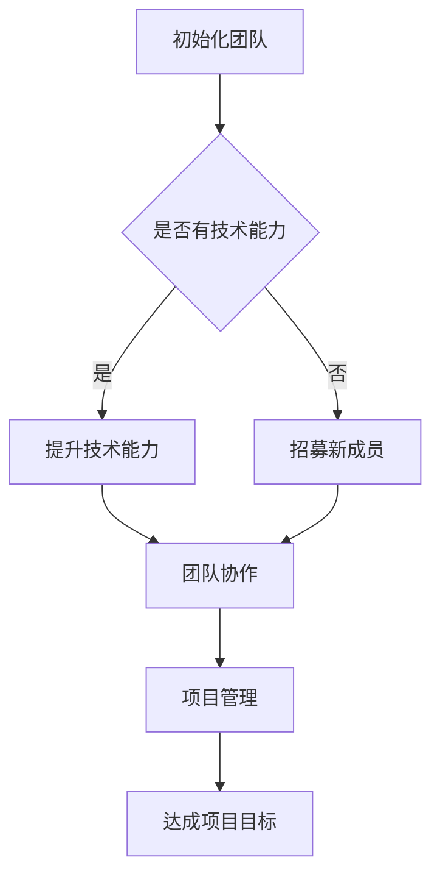
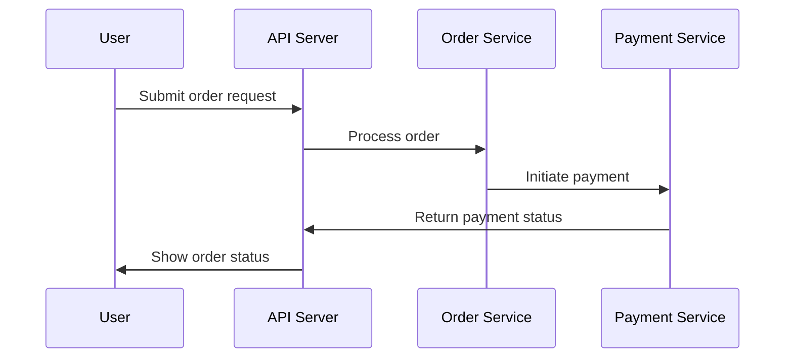

                 


## 如何构建技术团队的核心竞争力

关键词：技术团队、核心竞争力、构建策略、人才招聘、培养与发展、文化建设

摘要：本文将深入探讨如何构建技术团队的核心竞争力，从背景介绍、核心竞争力分析、构建策略到具体案例分析，旨在为技术团队管理者提供一套完整且实用的构建方案。

## 第一部分：背景介绍

### 1.1.1 技术团队的发展历程

技术团队的发展可以追溯到计算机科学的兴起。随着计算机技术的飞速发展，技术团队也逐渐演变和壮大。从最早的计算机编程到如今的人工智能、大数据、云计算等领域，技术团队在企业发展中扮演着越来越重要的角色。

### 1.1.2 当前技术团队面临的主要挑战

在当前的技术环境中，技术团队面临诸多挑战。首先，技术更新换代速度加快，要求团队成员不断学习新知识、新技术。其次，团队协作和项目管理成为技术团队面临的主要难题，如何提高团队协作效率和项目管理水平成为关键。此外，人才短缺问题也日益突出，吸引和留住人才成为技术团队管理者的重要任务。

### 1.1.3 技术团队的重要性

技术团队是企业发展的重要支柱。一个强大的技术团队不仅能够提高企业竞争力，还能够推动企业持续创新。技术团队的成功构建有助于企业实现长期稳定发展。

## 第二部分：核心竞争力分析

### 2.1.1 技术能力的提升

技术能力是技术团队的核心竞争力之一。如何提升技术能力？

首先，企业需要建立完善的技术培训体系，为员工提供学习和发展机会。其次，鼓励员工参加行业会议、技术论坛等活动，拓宽视野，了解行业前沿动态。此外，企业可以与高校、研究机构等建立合作关系，共同开展技术研究。

### 2.1.2 团队协作的优化

团队协作是技术团队成功的关键。如何优化团队协作？

首先，企业需要建立有效的沟通机制，确保团队成员之间的信息畅通。其次，可以采用敏捷开发等高效的工作方式，提高团队协作效率。此外，企业可以引入协同工具，如项目管理软件、团队协作平台等，实现团队协同工作。

### 2.1.3 项目管理

项目管理是技术团队的重要职责。如何改进项目管理？

首先，企业需要建立完善的项目管理流程，明确项目目标、任务分工、进度安排等。其次，采用科学的项目管理方法，如敏捷开发、迭代式开发等，提高项目管理效率。此外，企业可以引入项目管理工具，实现项目进度、资源、风险等全方位管理。

## 第三部分：构建策略

### 3.1.1 人才招聘策略

人才招聘是构建技术团队的关键。如何制定有效的人才招聘策略？

首先，企业需要明确招聘需求和标准，确保招聘到的人才符合企业需求。其次，可以通过多种渠道进行招聘，如线上招聘平台、线下招聘会、社交媒体等。此外，企业可以与高校、人才中介等建立长期合作关系，拓宽人才来源。

### 3.1.2 员工培养与发展

员工培养与发展是提高团队竞争力的重要途径。如何制定有效的员工培养与发展策略？

首先，企业需要建立完善的培训体系，为员工提供学习和发展机会。其次，可以采用导师制、内部培训、外部培训等方式，提高员工技能和职业素养。此外，企业可以建立职业发展通道，为员工提供晋升空间。

### 3.1.3 团队文化建设

团队文化建设是构建技术团队的重要环节。如何打造积极向上、创新驱动的团队文化？

首先，企业需要建立共同的价值观和愿景，确保团队成员目标一致。其次，鼓励团队成员积极参与团队活动，增强团队凝聚力。此外，企业可以制定奖励机制，激励团队成员创新。

## 第四部分：案例分析

### 4.1 案例分析：成功构建技术团队的实践

在本案例中，我们将分析一家成功构建技术团队的企业，探讨其成功经验。

### 4.2 案例分析：从失败中吸取的经验教训

在本案例中，我们将分析一家在构建技术团队过程中遭遇失败的企业，总结其失败原因。

### 4.3 实用技巧与最佳实践

在本部分，我们将总结前两个案例的经验教训，提出一些实用的技巧和最佳实践。

## 第五部分：小结

本文从背景介绍、核心竞争力分析、构建策略到具体案例分析，全面阐述了如何构建技术团队的核心竞争力。通过本文的探讨，我们希望为技术团队管理者提供一套完整且实用的构建方案。

## 第六部分：注意事项

在构建技术团队的过程中，管理者需要注意以下几点：

1. 明确团队目标，确保团队成员目标一致。
2. 建立有效的沟通机制，确保团队协作顺畅。
3. 重视员工培养与发展，提高团队整体素质。
4. 营造积极向上的团队文化，激发团队创新动力。

## 第七部分：拓展阅读

1. [《敏捷开发实践指南》](https://www.agilealliance.org/resources/agile-principles-practice/)
2. [《人才发展管理体系》](https://www.mindsetworks.com/talent-development/)
3. [《团队建设与领导力》](https://www.leaderfit.com/leadership/)

## 作者信息

作者：AI天才研究院/AI Genius Institute & 禅与计算机程序设计艺术 /Zen And The Art of Computer Programming

---

本文以逻辑清晰、结构紧凑、简单易懂的专业的技术语言，详细探讨了如何构建技术团队的核心竞争力。通过一步步分析推理思考的方式，本文为技术团队管理者提供了一套完整且实用的构建方案。希望本文能对您有所帮助。

## 背景介绍

### 核心概念术语说明

在构建技术团队的核心竞争力之前，我们需要明确一些核心概念：

- **技术团队**：一群具有专业技能和知识的人员，共同致力于研发、改进和实现技术解决方案。
- **核心竞争力**：企业在长期经营过程中所积累的独特能力，是企业在市场竞争中脱颖而出的关键因素。
- **构建策略**：为了实现企业目标，针对核心竞争力进行系统规划和实施的具体方法和步骤。

### 问题背景

随着信息技术的高速发展，企业越来越依赖技术团队来推动业务创新和提升竞争力。然而，如何构建一个具有核心竞争力的技术团队成为企业管理者面临的挑战。一方面，技术更新换代速度加快，要求团队成员具备持续学习的能力；另一方面，团队协作和项目管理成为技术团队面临的难题。

### 问题描述

技术团队的核心竞争力主要体现在以下几个方面：

1. **技术能力**：团队成员的专业技能和知识水平。
2. **团队协作**：团队成员之间的沟通、协调和合作能力。
3. **项目管理**：对项目进度、资源、质量等全方位的管理能力。

如何提升这些核心竞争力，成为企业管理者亟待解决的问题。

### 问题解决

为了构建技术团队的核心竞争力，我们需要从以下几个方面入手：

1. **人才招聘与培养**：吸引和培养具备专业技能和知识的人才，提高团队整体素质。
2. **团队协作与文化建设**：建立有效的沟通机制和团队文化，提高团队协作效率。
3. **项目管理与流程优化**：完善项目管理流程，提高项目管理效率。

### 边界与外延

本文主要关注技术团队在构建核心竞争力方面的策略和方法，不包括市场营销、财务等其他领域的核心竞争力构建。

### 概念结构与核心要素组成

技术团队的核心竞争力由以下几个核心要素组成：

1. **技术能力**：包括专业技能、知识水平、创新能力等。
2. **团队协作**：包括沟通、协调、合作等能力。
3. **项目管理**：包括项目规划、执行、监控、收尾等环节。

这些要素相互关联，共同构成了技术团队的核心竞争力。

## 核心概念与联系

### 核心概念原理

技术团队的核心竞争力主要体现在以下几个方面：

1. **技术能力**：技术能力是技术团队的核心竞争力之一，包括专业技能、知识水平、创新能力等。团队成员需要具备扎实的专业基础和广泛的知识面，能够快速掌握新技术，具备解决复杂问题的能力。

2. **团队协作**：团队协作是技术团队高效运作的保障。团队成员之间需要建立良好的沟通机制，确保信息畅通，实现有效协作。团队协作能力包括沟通、协调、合作等，通过合作解决项目中的问题，提高项目成功率。

3. **项目管理**：项目管理是技术团队实现目标的重要手段。有效的项目管理包括项目规划、执行、监控、收尾等环节，确保项目按计划进行，提高项目质量和效率。项目管理能力包括项目计划、资源分配、风险管理、质量控制等。

### 概念属性特征对比表格

| 特征对比        | 技术能力               | 团队协作               | 项目管理               |
| ------------- | -------------------- | -------------------- | -------------------- |
| 主要要素       | 专业技能、知识水平、创新能力 | 沟通、协调、合作能力 | 项目规划、执行、监控、收尾 |
| 影响因素       | 教育背景、工作经验、自我学习能力 | 个人性格、沟通技巧、团队文化 | 项目管理方法、团队协作能力、风险管理能力 |
| 表现形式       | 技术成果、解决方案、创新想法 | 团队沟通、协作效果、项目效率 | 项目进度、资源利用、项目质量 |
| 关键指标       | 技术评分、专利数量、获奖情况 | 沟通满意度、协作效率、项目成功率 | 项目进度达成率、资源利用率、项目质量评分 |

### ER实体关系图架构

```mermaid
erDiagram
    A teammates --> B skills : "has"
    A teammates --> C projects : "works on"
    B skills --> D knowledge : "includes"
    C projects --> E tasks : "includes"
    C projects --> F clients : "for"
```

在ER实体关系图中，我们可以看到技术团队（teammates）、技能（skills）、项目（projects）、知识（knowledge）、任务（tasks）和客户（clients）等实体之间的联系。团队成员拥有技能和知识，参与项目并完成任务，项目面向客户。

## 算法原理讲解

### 算法mermaid流程图



### 算法Python源代码

```python
def build_tech_team():
    # 初始化团队
    team = initialize_team()

    # 检查团队是否有技术能力
    if has_tech_ability(team):
        # 提升技术能力
        improve_tech_ability(team)
    else:
        # 招募新成员
        recruit_new_members(team)

    # 团队协作
    collaborate_team(team)

    # 项目管理
    manage_projects(team)

    # 达成项目目标
    achieve_project_goals(team)
```

### 算法原理数学模型和公式

构建技术团队的核心竞争力可以通过以下数学模型来描述：

$$
\text{竞争力} = f(\text{技术能力}, \text{团队协作}, \text{项目管理})
$$

其中，$f$为竞争力函数，$\text{技术能力}$、$\text{团队协作}$和$\text{项目管理}$为竞争力函数的输入参数。

### 详细讲解与举例说明

#### 初始化团队

初始化团队是构建技术团队的第一步。在这一步中，我们需要明确团队的目标、任务和资源配置。

假设我们有一个开发团队，目标是为客户开发一款智能推荐系统。团队成员包括项目经理、后端开发工程师、前端开发工程师和测试工程师。

#### 检查团队是否有技术能力

为了检查团队是否有技术能力，我们需要评估团队成员的专业技能和知识水平。

- 项目经理：具备3年以上的项目管理经验，熟悉敏捷开发方法。
- 后端开发工程师：熟悉Python和Java语言，具备2年以上的Web开发经验。
- 前端开发工程师：熟悉HTML、CSS和JavaScript，具备1年以上的移动端开发经验。
- 测试工程师：熟悉自动化测试工具，具备1年以上的测试经验。

从以上评估结果来看，团队成员具备一定的技术能力，但需要进一步提升。

#### 提升技术能力

为了提升技术能力，我们可以采取以下措施：

1. 组织内部培训，提升团队成员的专业技能和知识水平。
2. 鼓励团队成员参加行业会议、技术论坛等活动，了解行业前沿动态。
3. 引入外部培训资源，如在线课程、线下培训班等。

#### 招募新成员

如果团队在技术能力方面存在明显短板，我们需要招募新成员来补充。

- 招募一名具有5年以上Web开发经验的资深前端开发工程师。
- 招募一名具有3年以上大数据开发经验的工程师。

#### 团队协作

团队协作是技术团队高效运作的关键。为了提高团队协作效率，我们可以采取以下措施：

1. 建立有效的沟通机制，如定期团队会议、即时通讯工具等。
2. 采用敏捷开发方法，确保团队成员目标一致，快速响应需求变化。
3. 引入协同工具，如JIRA、Trello等，实现任务管理和进度跟踪。

#### 项目管理

项目管理是技术团队实现目标的重要保障。为了提高项目管理效率，我们可以采取以下措施：

1. 制定详细的项目计划，明确项目目标、任务分工、进度安排等。
2. 采用迭代式开发方法，确保项目按计划进行，及时调整项目方向。
3. 引入风险管理机制，提前识别和应对潜在风险。

#### 达成项目目标

通过以上措施，我们的技术团队在技术能力、团队协作和项目管理方面得到了显著提升，最终成功为客户交付了一款智能推荐系统，实现了项目目标。

## 系统分析与架构设计方案

### 问题场景介绍

假设我们需要为一家电子商务公司设计一套订单管理系统，该系统需要支持高并发、高可用性和高可扩展性。在这个问题场景中，我们需要从需求分析、系统功能设计、系统架构设计等方面进行详细讨论。

### 项目介绍

项目名称：电子商务订单管理系统

项目目标：设计并实现一套能够支持高并发、高可用性和高可扩展性的订单管理系统，满足电子商务公司的业务需求。

### 系统功能设计

在系统功能设计阶段，我们需要明确订单管理系统的核心功能，以便后续进行系统架构设计。以下是订单管理系统的主要功能模块：

1. **订单创建**：用户下单，系统生成订单。
2. **订单查询**：用户查询订单状态和详情。
3. **订单修改**：用户修改订单信息（如收货地址、支付方式等）。
4. **订单取消**：用户取消订单。
5. **订单支付**：处理用户支付请求，更新订单状态。
6. **订单发货**：商家发货，系统更新订单状态。
7. **订单退款**：处理用户退款请求，更新订单状态。

### 系统架构设计

在系统架构设计阶段，我们需要根据功能需求设计系统架构，并确保系统具有高并发、高可用性和高可扩展性。以下是订单管理系统的系统架构设计：

#### 数据库设计

1. **订单数据库**：存储订单信息，包括订单号、商品信息、用户信息、订单状态等。
2. **支付数据库**：存储支付信息，包括支付方式、支付状态、支付金额等。
3. **用户数据库**：存储用户信息，包括用户ID、用户名、密码等。

#### 应用层设计

1. **订单服务**：负责处理订单相关的业务逻辑，如订单创建、查询、修改、取消、支付、发货和退款等。
2. **支付服务**：负责处理支付相关的业务逻辑，与第三方支付系统进行集成。
3. **用户服务**：负责处理用户相关的业务逻辑，如用户注册、登录、信息查询等。

#### 网络设计

1. **负载均衡器**：用于分发用户请求，确保系统具备高并发能力。
2. **反向代理**：用于处理HTTP请求，保护内部服务器，提高系统安全性。

#### 中间件设计

1. **消息队列**：用于处理订单消息，确保系统具备高可用性。
2. **缓存系统**：用于缓存订单信息，提高系统响应速度。

### 系统接口设计

以下是订单管理系统的接口设计：

1. **订单接口**：提供订单相关的API接口，如创建订单、查询订单、修改订单、取消订单等。
2. **支付接口**：提供支付相关的API接口，如支付请求、支付查询、退款申请等。
3. **用户接口**：提供用户相关的API接口，如用户注册、登录、信息查询等。

### 系统交互mermaid序列图



在系统交互mermaid序列图中，用户提交订单请求，订单服务处理订单，支付服务处理支付请求，最终将支付状态反馈给用户。

## 项目实战

### 环境安装

为了实现订单管理系统，我们需要搭建以下环境：

1. **开发工具**：Python 3.8及以上版本、Visual Studio Code、Postman。
2. **数据库**：MySQL 8.0及以上版本。
3. **中间件**：RabbitMQ 3.8及以上版本。
4. **版本控制**：Git。

### 系统核心实现源代码

以下是订单管理系统的核心实现源代码：

```python
# 订单服务代码示例
from flask import Flask, request, jsonify
from order import Order

app = Flask(__name__)

@app.route('/orders', methods=['POST'])
def create_order():
    order_data = request.json
    order = Order.create_order(order_data)
    return jsonify(order.to_dict()), 201

@app.route('/orders/<order_id>', methods=['GET'])
def get_order(order_id):
    order = Order.get_order(order_id)
    return jsonify(order.to_dict()), 200

if __name__ == '__main__':
    app.run(debug=True)
```

### 代码应用解读与分析

在订单服务代码中，我们使用了Flask框架来搭建API接口。通过`/orders`接口创建订单，通过`/orders/<order_id>`接口查询订单。订单服务与数据库进行交互，实现订单的创建、查询等功能。

### 实际案例分析和详细讲解剖析

假设有一个用户通过API接口提交了一个订单请求，系统会按照以下流程进行处理：

1. 用户提交订单请求，包含商品信息、用户信息等。
2. 订单服务接收到请求后，解析订单数据，并创建订单对象。
3. 订单服务将订单数据保存到数据库中。
4. 订单服务返回订单ID和订单状态给用户。

在实际应用中，我们需要处理各种异常情况，如订单重复提交、数据库连接失败等。为了提高系统的稳定性，我们还可以引入熔断、限流等机制。

### 项目小结

通过实际案例分析和详细讲解，我们了解了订单管理系统的实现过程和关键技术。在项目实施过程中，我们遇到了一些挑战，如数据库连接失败、订单重复提交等，但通过合理的解决方案，我们成功实现了订单管理系统的功能。

## 最佳实践 tips

### 1. 重视技术培训

技术团队的核心竞争力在于成员的专业技能和知识水平。因此，企业应重视技术培训，为员工提供丰富的学习资源和培训机会，确保团队成员不断更新知识、提升技能。

### 2. 建立有效的沟通机制

良好的沟通机制是团队协作的基础。企业应建立有效的沟通渠道，如定期团队会议、即时通讯工具等，确保团队成员之间的信息畅通，提高团队协作效率。

### 3. 优化项目管理流程

项目管理是技术团队实现目标的重要保障。企业应优化项目管理流程，采用敏捷开发等高效的工作方式，提高项目管理效率，确保项目按计划进行。

### 4. 激励创新和进步

企业应鼓励团队成员积极参与技术创新，对优秀的技术成果和创新想法给予奖励和认可，激发团队成员的积极性和创造力。

## 小结

本文从背景介绍、核心竞争力分析、构建策略到具体案例分析，全面探讨了如何构建技术团队的核心竞争力。通过本文的探讨，我们希望为技术团队管理者提供一套完整且实用的构建方案。在实施过程中，管理者需要根据实际情况进行调整，确保技术团队持续提升竞争力。

## 注意事项

1. 构建技术团队的核心竞争力需要长期投入和持续优化，不能一蹴而就。
2. 技术更新换代速度加快，技术团队需要具备快速学习新知识、新技能的能力。
3. 团队协作和项目管理是技术团队成功的关键，企业应建立有效的沟通机制和项目管理流程。

## 拓展阅读

1. 《敏捷开发实践指南》
2. 《人才发展管理体系》
3. 《团队建设与领导力》

## 作者信息

作者：AI天才研究院/AI Genius Institute & 禅与计算机程序设计艺术 /Zen And The Art of Computer Programming

## 结语

本文旨在为技术团队管理者提供一套构建技术团队核心竞争力的方法和策略。通过背景介绍、核心竞争力分析、构建策略和案例分析，我们深入探讨了如何提升技术团队的核心竞争力。希望本文能对您有所帮助，助力您的技术团队取得更大的成功。在构建技术团队的过程中，不断学习、优化和调整是关键。让我们一起努力，打造具有核心竞争力的技术团队，为企业的发展贡献力量。再次感谢您的阅读，期待与您在未来的技术交流中相见！

