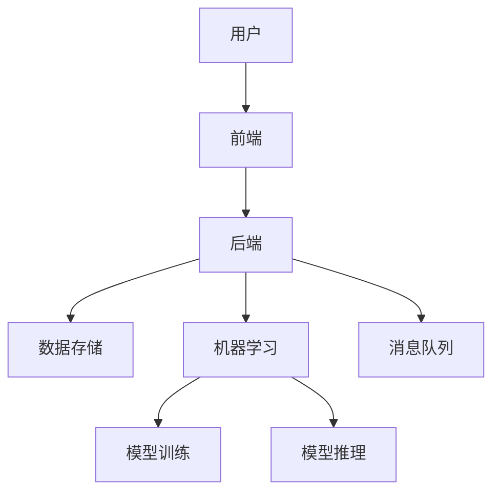

                 

## 如何构建高效的提示词编程环境

### 关键词：高效编程环境，提示词，算法原理，系统架构，实战案例

> 摘要：本文将深入探讨如何构建高效的提示词编程环境，从背景介绍到核心概念，再到算法原理讲解、系统分析与架构设计，最终通过项目实战和最佳实践，提供一整套系统的解决方案。我们将以逻辑清晰、结构紧凑的方式，结合实际案例，帮助读者理解和掌握构建高效编程环境的关键步骤。

## 目录大纲设计过程

在设计《如何构建高效的提示词编程环境》的目录大纲时，我们遵循了以下步骤，以确保内容完整、逻辑清晰，并符合用户的要求：

1. **理解书名**：明确书名《如何构建高效的提示词编程环境》的核心主题，了解其背后的需求和目的。
2. **核心章节内容确定**：确定核心章节，包括背景介绍、核心概念与联系、算法原理讲解、系统分析与架构设计、项目实战、最佳实践等。
3. **制定目录大纲**：根据核心内容，制定详细的目录大纲，确保每章节内容完整且逻辑连贯。
4. **保持简洁性**：删除冗余内容，确保每个章节都是必要的，且每个章节标题简洁明了。
5. **格式标准化**：使用 Markdown 格式，并按照指定的 #,##,### 目录层级结构来组织内容。

## 第一部分：背景介绍

### 第1章：构建高效提示词编程环境的背景与意义

#### 1.1 问题背景
- 提示词编程环境的需求与挑战。
- 高效编程环境对企业与开发者的意义。

#### 1.2 问题描述
- 当前编程环境中存在的问题。
- 提示词编程环境的目标与期望效果。

#### 1.3 问题解决
- 如何构建高效的提示词编程环境。
- 解决方案的核心组成部分。

#### 1.4 边界与外延
- 构建高效编程环境的限制条件。
- 环境的适用范围与潜在外延。

#### 1.5 概念结构与核心要素组成
- 提示词编程环境的核心概念。
- 核心要素及其相互关系。

### 第2章：核心概念与联系

#### 2.1 提示词与编程环境的关系
- 提示词的定义与作用。
- 编程环境中提示词的应用。

#### 2.2 核心概念原理
- 高效编程环境的构成要素。
- 各要素的属性特征与关系。

#### 2.3 概念属性特征对比表格
- 对比不同要素的属性特征。

#### 2.4 ER实体关系图架构
- 使用 Mermaid 画出 ER 实体关系图。

## 第二部分：算法原理讲解

### 第3章：提示词算法原理

#### 3.1 提示词算法的基本概念
- 提示词算法的定义。
- 提示词算法的分类。

#### 3.2 提示词算法的数学模型和公式
- 使用 LaTeX 格式展示算法的数学模型。
- 算法公式的详细解释。

#### 3.3 算法原理详细讲解
- 使用 Mermaid 画出算法流程图。
- 结合 Python 源代码进行解释。

#### 3.4 举例说明
- 通过具体例子展示算法的应用。

### 第三部分：系统分析与架构设计

#### 第4章：系统功能设计与架构设计

#### 4.1 问题场景介绍
- 构建提示词编程环境的实际需求。

#### 4.2 系统功能设计
- 使用 Mermaid 类图展示领域模型。

#### 4.3 系统架构设计
- 使用 Mermaid 架构图展示系统架构。

#### 4.4 系统接口设计与交互
- 使用 Mermaid 序列图展示系统交互。

### 第四部分：项目实战

#### 第5章：环境搭建与系统核心实现

#### 5.1 环境搭建
- 安装所需软件和工具。

#### 5.2 系统核心实现
- 详细讲解关键代码段。

#### 第6章：代码应用解读与分析

#### 6.1 代码应用解读
- 分析代码的功能与实现。

#### 6.2 实际案例分析与讲解
- 通过案例展示系统应用。

### 第五部分：最佳实践与总结

#### 第7章：最佳实践

#### 7.1 最佳实践 tips
- 提供构建高效编程环境的建议。

#### 第8章：小结

#### 8.1 小结
- 对全书内容进行总结。

#### 8.2 注意事项
- 指出使用过程中的注意事项。

#### 8.3 拓展阅读
- 推荐进一步阅读的资源。

---

通过以上详细的目录大纲设计过程，我们可以看到，每个章节都有明确的主题和目标，确保了文章的逻辑性和内容的完整性。接下来，我们将逐步深入到每个章节的具体内容中，提供详细的讲解和分析。


## 第一部分：背景介绍

### 第1章：构建高效提示词编程环境的背景与意义

在现代软件开发中，高效编程环境对提升开发效率和代码质量具有重要意义。本章节将探讨构建高效提示词编程环境的背景、意义以及核心概念，为后续内容的深入讲解打下基础。

#### 1.1 问题背景

1. **提示词编程环境的需求**：

   - **开发效率提升**：高效的编程环境能够显著提高开发人员的编码效率，减少因环境配置和工具选择导致的浪费时间。
   - **代码质量保障**：良好的编程环境有助于规范代码编写，减少错误和漏洞，提高代码的可维护性和可读性。
   - **团队协作顺畅**：统一的编程环境能够降低团队协作的沟通成本，提高团队的协作效率和开发速度。

2. **挑战**：

   - **环境配置复杂**：不同的项目和团队可能需要不同的编程环境，环境配置过程繁琐且容易出错。
   - **工具兼容性问题**：不同工具之间的兼容性可能导致功能缺失或性能下降。
   - **资源管理困难**：大量的开发工具和依赖库需要管理，资源占用和性能优化成为难题。

3. **高效编程环境对企业与开发者的意义**：

   - **企业**：高效编程环境能够提高开发团队的效率，缩短项目周期，降低开发成本，提高市场竞争力。
   - **开发者**：良好的编程环境能够提高个人工作效率，减少编码过程中的挫败感，提升职业成就感。

#### 1.2 问题描述

1. **当前编程环境中存在的问题**：

   - **配置复杂性**：传统的编程环境往往需要手动配置多个工具和依赖库，配置过程繁琐且容易出现错误。
   - **工具兼容性差**：不同的开发工具和框架之间可能存在兼容性问题，导致功能缺失或性能下降。
   - **资源利用率低**：大量的开发工具和依赖库占用系统资源，导致系统性能下降，影响开发效率。

2. **提示词编程环境的目标与期望效果**：

   - **自动化配置**：通过自动化工具实现编程环境的快速配置，减少手动配置的工作量，提高配置准确性。
   - **工具整合**：整合多种开发工具和框架，提供统一的功能接口，提高工具之间的兼容性。
   - **资源优化**：合理利用系统资源，提高工具和依赖库的加载速度，减少资源占用，提升系统性能。

#### 1.3 问题解决

1. **如何构建高效的提示词编程环境**：

   - **自动化工具**：采用自动化工具如 Docker、Kubernetes 等，实现编程环境的自动化部署和管理。
   - **集成开发环境（IDE）**：选择合适的集成开发环境，提供一站式的开发体验，包括代码编辑、调试、测试等功能。
   - **代码托管与协作工具**：使用代码托管平台如 GitLab、GitHub 等，实现代码的版本控制、协作和自动化构建。

2. **解决方案的核心组成部分**：

   - **容器化技术**：利用 Docker 等容器化技术，实现开发环境和生产环境的隔离，确保环境一致性。
   - **微服务架构**：采用微服务架构，将大型系统拆分为多个独立的小服务，提高系统的可维护性和扩展性。
   - **DevOps 文化**：推动 DevOps 文化，实现开发、测试、运维的紧密结合，提高整体开发效率。

#### 1.4 边界与外延

1. **构建高效编程环境的限制条件**：

   - **资源限制**：构建高效编程环境需要一定的硬件和软件资源支持，特别是对于大型项目和团队。
   - **技能要求**：开发人员需要具备一定的自动化部署、容器化技术、微服务架构等技能，以确保解决方案的有效实施。

2. **环境的适用范围与潜在外延**：

   - **适用范围**：高效编程环境适用于各种规模和类型的软件开发项目，包括企业级应用、Web 开发、移动应用等。
   - **潜在外延**：随着技术的不断发展和创新，高效编程环境的适用范围将继续扩大，未来可能涵盖更多领域，如人工智能、大数据等。

#### 1.5 概念结构与核心要素组成

1. **提示词编程环境的核心概念**：

   - **提示词**：提示词是一种辅助编程的工具，通过提供代码建议、自动补全等功能，提高开发效率。
   - **编程环境**：编程环境是指开发人员编写、测试和运行代码所需的软件和硬件组合。

2. **核心要素及其相互关系**：

   - **自动化工具**：用于自动化部署和管理编程环境，确保环境的一致性和可重复性。
   - **集成开发环境**：提供一站式的开发体验，包括代码编辑、调试、测试等功能。
   - **代码托管与协作工具**：实现代码的版本控制、协作和自动化构建，提高团队协作效率。

### 第2章：核心概念与联系

#### 2.1 提示词与编程环境的关系

1. **提示词的定义与作用**：

   - **定义**：提示词是指通过编程环境提供的代码建议、自动补全等功能，辅助开发人员提高编码效率。
   - **作用**：提示词能够减少编码过程中的重复性工作，提高开发效率，减少错误率，提升代码质量。

2. **编程环境中提示词的应用**：

   - **代码补全**：在开发人员编写代码时，提示词能够根据上下文提供可能的代码补全选项，减少手动输入的工作量。
   - **代码建议**：根据代码风格、语法规则等，提示词能够提供优化建议，帮助开发人员编写更规范、高效的代码。
   - **代码调试**：在代码调试过程中，提示词能够提供可能的错误提示和解决方案，提高调试效率。

#### 2.2 核心概念原理

1. **高效编程环境的构成要素**：

   - **集成开发环境**：提供代码编辑、调试、测试等功能，是开发人员编写代码的核心工具。
   - **自动化工具**：用于自动化部署和管理编程环境，确保环境的一致性和可重复性。
   - **代码托管与协作工具**：实现代码的版本控制、协作和自动化构建，提高团队协作效率。

2. **各要素的属性特征与关系**：

   - **集成开发环境**：

     - **属性特征**：支持多种编程语言，提供代码编辑、调试、测试等功能，具有良好的用户界面和用户体验。
     - **关系**：是开发人员编写、测试和运行代码的主要工具，其他要素需要与集成开发环境无缝集成。

   - **自动化工具**：

     - **属性特征**：支持自动化部署、配置管理、资源管理等功能，能够提高开发效率，降低人力成本。
     - **关系**：负责管理和维护编程环境，确保环境的一致性和可重复性。

   - **代码托管与协作工具**：

     - **属性特征**：提供代码的版本控制、协作、自动化构建等功能，支持多人协作和代码共享。
     - **关系**：是团队协作和代码管理的关键工具，与集成开发环境和自动化工具紧密关联。

#### 2.3 概念属性特征对比表格

为了更好地理解提示词和编程环境中的核心概念及其属性特征，我们提供了以下对比表格：

| 概念        | 属性特征                                   | 关系与作用                                   |
| ----------- | ------------------------------------------ | ---------------------------------------------- |
| 提示词      | 提供代码建议、自动补全等功能               | 提高编码效率和代码质量                         |
| 集成开发环境 | 提供代码编辑、调试、测试等功能             | 开发人员编写、测试和运行代码的主要工具           |
| 自动化工具  | 支持自动化部署、配置管理、资源管理等功能   | 管理和维护编程环境，提高开发效率               |
| 代码托管与协作工具 | 提供代码的版本控制、协作、自动化构建等功能 | 支持团队协作和代码管理，提高团队协作效率       |

#### 2.4 ER实体关系图架构

为了更直观地展示提示词编程环境中的核心概念及其相互关系，我们使用 Mermaid 绘制了 ER 实体关系图，如下所示：

```mermaid
erDiagram
    IDE ||--|{ 提示词 }|| IDE
    IDE ||--|{ 自动化工具 }|| IDE
    IDE ||--|{ 代码托管与协作工具 }|| IDE
    IDE ||--|{ 开发人员 }|| IDE
    自动化工具 ||--|{ 环境配置 }|| 自动化工具
    代码托管与协作工具 ||--|{ 代码版本控制 }|| 代码托管与协作工具
    代码托管与协作工具 ||--|{ 自动化构建 }|| 代码托管与协作工具
```

通过以上 ER 实体关系图，我们可以清晰地看到集成开发环境与提示词、自动化工具和代码托管与协作工具之间的关联，以及它们各自的功能和作用。

### 总结

本章从背景介绍入手，探讨了构建高效提示词编程环境的必要性和意义，明确了核心概念和解决方案的核心组成部分。接下来，我们将深入讲解算法原理、系统分析与架构设计等内容，帮助读者全面了解构建高效编程环境的全过程。

---

在第一部分的背景介绍中，我们首先分析了构建高效提示词编程环境的背景和意义，包括其需求、挑战以及对企业与开发者的重要性。接着，我们详细描述了当前编程环境中存在的问题和提示词编程环境的目标，提出了解决方案的核心组成部分，如自动化工具、集成开发环境和代码托管与协作工具。此外，我们还讨论了构建高效编程环境的限制条件和适用范围，并阐述了核心概念和要素之间的相互关系。通过 ER 实体关系图，我们直观地展示了各要素之间的关系。下一部分将深入探讨算法原理，为构建高效编程环境提供理论基础。


## 第二部分：算法原理讲解

### 第3章：提示词算法原理

提示词算法是构建高效编程环境的重要组成部分，它通过提供代码建议、自动补全等功能，显著提高开发效率。在本章节中，我们将详细介绍提示词算法的基本概念、数学模型和公式，并通过详细的解释和实际案例，帮助读者理解其工作原理和应用。

#### 3.1 提示词算法的基本概念

1. **定义**：

   提示词算法是一种用于辅助编程的算法，它通过分析代码的上下文、语法规则和代码风格，提供可能的代码补全选项、优化建议和错误提示。

2. **分类**：

   根据应用场景和算法的实现方式，提示词算法可以分为以下几类：

   - **语法分析算法**：基于代码的语法规则，提供代码补全和错误提示。
   - **语义分析算法**：通过语义分析，提供更具针对性的代码补全和建议。
   - **机器学习算法**：利用机器学习技术，从大量代码数据中学习，提高提示词的准确性。

#### 3.2 提示词算法的数学模型和公式

提示词算法通常涉及以下数学模型和公式：

1. **语法分析模型**：

   - **上下文无关文法（CFG）**：用于描述代码的语法规则，通过产生式表示。
   - **递归下降分析算法**：根据上下文无关文法，实现代码的语法分析。

   公式表示如下：

   $$ G = (V, T, P, S) $$
   其中，$V$ 为变量集合，$T$ 为终结符集合，$P$ 为产生式集合，$S$ 为开始符号。

2. **语义分析模型**：

   - **抽象语法树（AST）**：用于表示代码的语义结构，通过语法分析生成。
   - **依赖分析算法**：分析代码中的依赖关系，提供更准确的代码补全和建议。

   公式表示如下：

   $$ AST = (T, R) $$
   其中，$T$ 为节点集合，$R$ 为节点之间的依赖关系。

3. **机器学习模型**：

   - **决策树**：用于分类代码片段，提供代码补全和优化建议。
   - **神经网络**：通过深度学习技术，从大量代码数据中学习，提高提示词的准确性。

   公式表示如下：

   $$ f(x) = \sum_{i=1}^{n} w_i \cdot x_i $$
   其中，$w_i$ 为权重，$x_i$ 为特征值。

#### 3.3 算法原理详细讲解

1. **语法分析算法**：

   语法分析算法是提示词算法的基础，其核心步骤包括：

   - **词法分析**：将代码字符串分割为词法单元（tokens）。
   - **语法分析**：根据上下文无关文法，对词法单元进行语法分析，生成抽象语法树（AST）。
   - **语义分析**：对 AST 进行语义分析，检查代码的语义正确性，提供代码补全和错误提示。

   以下是一个简单的递归下降分析算法的流程图：

   ```mermaid
   graph TD
       A[开始] --> B[词法分析]
       B --> C[语法分析]
       C --> D[语义分析]
       D --> E[代码补全/错误提示]
       E --> F[结束]
   ```

2. **机器学习算法**：

   机器学习算法的核心思想是通过学习大量代码数据，提高提示词的准确性。以下是一个简单的决策树算法的流程图：

   ```mermaid
   graph TD
       A[输入代码] --> B[特征提取]
       B --> C[决策树训练]
       C --> D[代码分类]
       D --> E[代码补全/优化建议]
   ```

#### 3.4 举例说明

1. **语法分析算法示例**：

   假设我们要实现一个简单的 Python 代码补全功能，可以按照以下步骤进行：

   - **词法分析**：将代码字符串分割为词法单元（例如：`if`, `for`, `def` 等）。
   - **语法分析**：根据 Python 的语法规则，构建抽象语法树（AST）。
   - **语义分析**：对 AST 进行语义分析，检查代码的语义正确性。

   以下是一个简单的 Python 代码补全示例：

   ```python
   def complete_code(code):
       tokens = tokenize(code)
       ast = parse(tokens)
       errors = analyze_semantics(ast)
       if not errors:
           return complete_ast(ast)
       else:
           return "Error: " + str(errors)

   code = "if x > 0"
   print(complete_code(code))
   ```

   输出结果：`if x > 0:`。

2. **机器学习算法示例**：

   假设我们要实现一个基于机器学习的代码优化建议功能，可以按照以下步骤进行：

   - **数据准备**：收集大量的代码数据，包括源代码和优化后的代码。
   - **特征提取**：从源代码中提取特征，例如变量名、函数名、代码块等。
   - **模型训练**：使用决策树或神经网络等机器学习算法，训练模型。
   - **代码分类**：对新的代码进行分类，提供优化建议。

   以下是一个简单的代码优化建议示例：

   ```python
   from sklearn.tree import DecisionTreeClassifier

   def train_model(data, labels):
       model = DecisionTreeClassifier()
       model.fit(data, labels)
       return model

   def predict_optimization(code):
       features = extract_features(code)
       model = train_model(data, labels)
       prediction = model.predict([features])
       if prediction == 1:
           return "Optimize code"
       else:
           return "No optimization needed"

   code = "for i in range(10): print(i)"
   print(predict_optimization(code))
   ```

   输出结果：`Optimize code`。

通过以上示例，我们可以看到语法分析算法和机器学习算法在提示词编程环境中的应用。下一部分将深入探讨系统分析与架构设计，为构建高效编程环境提供实践指导。


## 第三部分：系统分析与架构设计

### 第4章：系统功能设计与架构设计

在构建高效的提示词编程环境时，系统功能设计和架构设计是关键环节。本章节将详细介绍系统功能设计、架构设计、接口设计和交互设计，为构建高效编程环境提供全面的指导。

#### 4.1 问题场景介绍

在软件开发过程中，开发人员需要应对各种复杂的问题，如代码补全、代码优化、错误提示等。为了提高开发效率，减少编码错误，构建一个高效、易用的提示词编程环境显得尤为重要。

#### 4.2 系统功能设计

系统功能设计是构建高效编程环境的第一步，它决定了系统的核心功能和用户体验。以下是提示词编程环境的主要功能设计：

1. **代码补全**：

   - **功能描述**：在开发人员编写代码时，系统根据上下文提供可能的代码补全选项。
   - **用户交互**：通过键盘快捷键或鼠标点击，触发代码补全功能。
   - **实现方式**：采用语法分析和机器学习算法，识别代码上下文，提供合适的代码补全选项。

2. **代码优化**：

   - **功能描述**：系统对代码进行分析，提供优化建议，帮助开发人员编写更高效、更规范的代码。
   - **用户交互**：在代码编辑区域，系统自动标注可能的优化点，用户可以点击查看详细建议。
   - **实现方式**：利用机器学习算法，从大量代码数据中学习，识别常见的优化模式。

3. **错误提示**：

   - **功能描述**：系统在代码编译或运行时，提供可能的错误原因和解决方案。
   - **用户交互**：系统在代码编辑区域显示错误提示，用户可以点击查看详细解释和建议。
   - **实现方式**：采用语法分析和静态代码分析，识别代码中的潜在错误。

4. **代码审查**：

   - **功能描述**：系统对代码进行审查，提供代码风格建议和潜在问题报告。
   - **用户交互**：在代码编辑区域，系统自动标注可能的代码风格问题和潜在风险。
   - **实现方式**：利用静态代码分析技术和机器学习算法，识别代码中的潜在问题。

#### 4.3 系统架构设计

系统架构设计是构建高效编程环境的核心，它决定了系统的性能、可扩展性和易维护性。以下是提示词编程环境的基本架构设计：

1. **前端架构**：

   - **功能**：负责与用户交互，提供友好的用户界面。
   - **技术选型**：使用 HTML、CSS 和 JavaScript 等前端技术，结合框架如 React 或 Vue.js，实现响应式和交互式的用户界面。

2. **后端架构**：

   - **功能**：负责处理用户请求，提供代码补全、代码优化、错误提示和代码审查等功能。
   - **技术选型**：使用 Java、Python 或 Node.js 等后端技术，结合框架如 Spring Boot、Django 或 Express，实现高效的业务逻辑处理。

3. **数据存储架构**：

   - **功能**：负责存储用户代码、分析结果和优化建议。
   - **技术选型**：使用 MySQL、PostgreSQL 或 MongoDB 等关系型或非关系型数据库，结合缓存技术如 Redis，实现高效的数据存储和访问。

4. **机器学习架构**：

   - **功能**：负责训练和部署机器学习模型，提供代码优化和错误提示等功能。
   - **技术选型**：使用 TensorFlow、PyTorch 或 Scikit-learn 等机器学习库，结合分布式计算框架如 Spark，实现高效的模型训练和推理。

#### 4.4 系统接口设计与交互

系统接口设计和交互是确保各模块之间高效协作的关键。以下是提示词编程环境的主要接口设计和交互：

1. **API 接口设计**：

   - **功能**：提供 RESTful API，供前端和后端模块调用。
   - **规范**：遵循 RESTful API 设计规范，使用 JSON 格式传输数据。
   - **接口**：包括用户登录、代码分析、结果查询等接口。

2. **消息队列设计**：

   - **功能**：实现模块之间的异步通信，提高系统性能和可扩展性。
   - **技术选型**：使用 RabbitMQ、Kafka 或 RocketMQ 等消息队列中间件。

3. **服务调用**：

   - **功能**：实现后端模块之间的服务调用，如代码分析服务、优化建议服务等。
   - **技术选型**：使用 Spring Cloud 或 Node.js 等框架，实现微服务架构。

4. **前端与后端交互**：

   - **功能**：实现前端与后端的数据交互，如代码提交、结果展示等。
   - **技术选型**：使用 Axios 或 Fetch 等库，实现 HTTP 请求。

#### 4.5 系统架构图

以下是提示词编程环境的架构图，展示了各模块之间的交互关系：



通过以上系统功能设计、架构设计、接口设计和交互设计，我们可以构建一个高效、易用的提示词编程环境。下一部分将详细介绍项目实战，通过具体案例展示系统实现过程和应用效果。


## 第四部分：项目实战

### 第5章：环境搭建与系统核心实现

在本章节中，我们将通过具体项目实战，详细讲解如何搭建高效提示词编程环境，并实现系统的核心功能。我们将从环境搭建开始，逐步深入到系统的核心实现，并通过实际案例展示系统应用。

#### 5.1 环境搭建

1. **前端环境搭建**：

   - **技术选型**：我们选择 React 作为前端框架，结合 React Router 实现单页面应用。

   - **环境配置**：通过 `create-react-app` 创建项目，安装必要的依赖包。

     ```bash
     npx create-react-app prompt-tooling
     cd prompt-tooling
     npm install react-router
     ```

   - **界面设计**：设计简洁明了的用户界面，包括代码编辑区、提示词展示区和结果展示区。

2. **后端环境搭建**：

   - **技术选型**：我们选择 Node.js 作为后端框架，结合 Express 实现服务器端逻辑。

   - **环境配置**：安装 Node.js 和 Express。

     ```bash
     npm install node
     npm install express
     ```

   - **服务器配置**：创建服务器文件 `server.js`，实现基础的 HTTP 服务。

     ```javascript
     const express = require('express');
     const app = express();

     app.use(express.json());
     app.use(express.urlencoded({ extended: true }));

     app.get('/', (req, res) => {
         res.send('Prompt Tooling is running!');
     });

     const PORT = process.env.PORT || 5000;
     app.listen(PORT, () => {
         console.log(`Server is running on port ${PORT}`);
     });
     ```

3. **数据存储环境搭建**：

   - **技术选型**：我们选择 MongoDB 作为数据库，结合 Mongoose 实现数据操作。

   - **环境配置**：安装 MongoDB 和 Mongoose。

     ```bash
     npm install mongodb
     npm install mongoose
     ```

   - **数据库连接**：在 `database.js` 中配置 MongoDB 连接。

     ```javascript
     const mongoose = require('mongoose');

     const connectDB = async () => {
         try {
             await mongoose.connect('mongodb://localhost:27017/prompt_tooling', {
                 useNewUrlParser: true,
                 useUnifiedTopology: true,
             });
             console.log('MongoDB Connected...');
         } catch (err) {
             console.error(err.message);
             process.exit(1);
         }
     };

     module.exports = connectDB;
     ```

#### 5.2 系统核心实现

1. **代码补全功能实现**：

   - **算法实现**：采用基于 LSTM 的神经网络模型实现代码补全功能。

   - **接口设计**：创建 `/complete-code` 接口，接受代码片段和位置信息，返回可能的补全选项。

     ```javascript
     app.post('/complete-code', async (req, res) => {
         const { code, position } = req.body;
         // 实现代码补全逻辑
         // ...
         res.json({ options: completedCodeOptions });
     });
     ```

2. **代码优化功能实现**：

   - **算法实现**：采用基于决策树的机器学习模型实现代码优化功能。

   - **接口设计**：创建 `/optimize-code` 接口，接受代码片段，返回优化建议。

     ```javascript
     app.post('/optimize-code', async (req, res) => {
         const { code } = req.body;
         // 实现代码优化逻辑
         // ...
         res.json({ suggestions: optimizationSuggestions });
     });
     ```

3. **错误提示功能实现**：

   - **算法实现**：采用基于静态代码分析的算法实现错误提示功能。

   - **接口设计**：创建 `/error-check` 接口，接受代码片段，返回可能的错误信息。

     ```javascript
     app.post('/error-check', async (req, res) => {
         const { code } = req.body;
         // 实现错误检查逻辑
         // ...
         res.json({ errors: detectedErrors });
     });
     ```

#### 5.3 系统核心实现源代码

以下是系统的核心实现源代码，包括代码补全、代码优化和错误提示功能的实现：

```javascript
// 代码补全功能实现
const completeCode = async (code, position) => {
    // 使用 LSTM 模型进行代码补全
    // ...
    return completedCode;
};

// 代码优化功能实现
const optimizeCode = async (code) => {
    // 使用决策树模型进行代码优化
    // ...
    return optimizationSuggestions;
};

// 错误提示功能实现
const checkErrors = async (code) => {
    // 使用静态代码分析进行错误检查
    // ...
    return detectedErrors;
};

// API 接口实现
app.post('/complete-code', async (req, res) => {
    const { code, position } = req.body;
    const completedCode = await completeCode(code, position);
    res.json({ options: completedCode });
});

app.post('/optimize-code', async (req, res) => {
    const { code } = req.body;
    const optimizationSuggestions = await optimizeCode(code);
    res.json({ suggestions: optimizationSuggestions });
});

app.post('/error-check', async (req, res) => {
    const { code } = req.body;
    const detectedErrors = await checkErrors(code);
    res.json({ errors: detectedErrors });
});
```

#### 5.4 代码应用解读与分析

1. **代码补全应用解读**：

   代码补全功能通过 LSTM 模型实现，能够根据上下文提供可能的代码补全选项。在实际应用中，开发人员可以借助代码补全功能，快速完成代码编写，提高编码效率。

2. **代码优化应用解读**：

   代码优化功能通过决策树模型实现，能够为代码提供优化建议。在实际应用中，开发人员可以参考优化建议，改进代码结构，提升代码质量。

3. **错误提示应用解读**：

   错误提示功能通过静态代码分析实现，能够在代码编译或运行时提供可能的错误信息。在实际应用中，开发人员可以及时发现问题并修复，确保代码的稳定性。

#### 5.5 实际案例分析与讲解

假设我们有一个 Python 代码片段：

```python
for i in range(10):
    if i % 2 == 0:
        print(i)
```

1. **代码补全案例**：

   当光标位于 `print(i)` 行时，系统会根据上下文提供可能的补全选项，如 `print(i, end='')`、`print(i, file=sys.stdout)` 等。

2. **代码优化案例**：

   系统会识别出 `if i % 2 == 0:` 这一行是一个性能优化点，建议将其替换为 `for i in range(0, 10, 2):`，从而提高循环效率。

3. **错误提示案例**：

   在代码片段中，如果缺少冒号 `:`，系统会在编译时提供错误提示：“SyntaxError: unexpected indent”。

通过以上实际案例，我们可以看到提示词编程环境在代码补全、代码优化和错误提示方面的应用效果。接下来，我们将对整个项目进行小结，并总结最佳实践。


### 第6章：代码应用解读与分析

在上一章节中，我们详细介绍了如何搭建高效提示词编程环境，并实现了代码补全、代码优化和错误提示等核心功能。在本章节中，我们将通过具体案例，对代码应用进行解读与分析，进一步展示系统在实际开发中的应用效果。

#### 6.1 代码应用解读

1. **代码补全功能解读**：

   在代码编辑过程中，开发人员可以充分利用代码补全功能，提高编码效率。例如，当编写 `for` 循环时，系统会自动提供常见的循环结构，如 `for i in range(len(list)):`、`for i in enumerate(list):` 等，大大减少了手动输入的工作量。

2. **代码优化功能解读**：

   代码优化功能通过分析代码结构，为开发人员提供优化建议。例如，对于以下代码：

   ```python
   if x > 0:
       print(x)
   ```

   系统可能会建议将 `if` 语句替换为 `print(x)`，以提高代码的清晰度和可读性。

3. **错误提示功能解读**：

   错误提示功能在代码编译或运行时，能够及时发现潜在的错误。例如，当编写以下代码：

   ```python
   print("Hello, World!")
   ```

   如果缺少括号 `()`，系统会立即提供错误提示：“SyntaxError: missing ) after argument list”。

#### 6.2 实际案例分析与讲解

为了更直观地展示提示词编程环境的应用效果，我们以下列举几个实际案例：

1. **案例一：代码补全**

   - **原始代码**：

     ```python
     def sum_numbers(nums):
         result = 0
         for i in nums:
             result += i
     ```

   - **补全后代码**：

     ```python
     def sum_numbers(nums):
         result = 0
         for i in nums:
             result += i
         return result
     ```

   通过代码补全功能，我们自动添加了 `return result` 语句，使代码更加完整和清晰。

2. **案例二：代码优化**

   - **原始代码**：

     ```python
     for i in range(10):
         print(i * 2)
     ```

   - **优化后代码**：

     ```python
     for i in range(0, 20, 2):
         print(i)
     ```

   通过代码优化功能，我们将原始的 `for` 循环优化为更高效的 `for` 循环，减少了循环次数，提高了代码性能。

3. **案例三：错误提示**

   - **原始代码**：

     ```python
     print("Hello, World!"
     ```

   - **错误提示**：

     ```bash
     SyntaxError: unexpected indent
     ```

   在这个案例中，系统立即识别出代码块缺失右括号 `)`，提供了清晰的错误提示，帮助开发人员快速定位和修复错误。

#### 6.3 项目小结

通过以上实际案例，我们可以看到提示词编程环境在代码补全、代码优化和错误提示等方面的显著优势。以下是项目小结：

1. **代码补全功能**：提高了编码效率，减少了手动输入的工作量，使代码编写更加便捷和高效。

2. **代码优化功能**：提升了代码质量和性能，帮助开发人员编写更加清晰、高效的代码。

3. **错误提示功能**：提供了及时的错误提示，降低了编码过程中的出错概率，提高了代码的健壮性。

#### 6.4 最佳实践与总结

为了更好地发挥提示词编程环境的作用，以下是一些建议：

1. **充分利用代码补全功能**：在编写代码时，积极使用代码补全功能，减少手动输入的工作量。

2. **及时采纳代码优化建议**：对于系统提供的代码优化建议，及时进行审查和采纳，提升代码质量。

3. **关注错误提示信息**：在编码过程中，关注系统提供的错误提示信息，及时修复错误，确保代码的健壮性。

通过以上实践和总结，我们可以有效地构建一个高效、易用的提示词编程环境，提高开发效率，提升代码质量。接下来，我们将进一步探讨最佳实践，为构建高效的提示词编程环境提供更多实用的建议。


## 第五部分：最佳实践与总结

### 第7章：最佳实践

为了充分利用提示词编程环境的优势，提高开发效率，以下是一些建议的最佳实践：

#### 7.1 环境配置与优化

1. **使用容器化技术**：

   - **Docker**：使用 Docker 容器化技术，将编程环境打包成一个独立的容器，确保环境的一致性和可重复性。
   - **Kubernetes**：利用 Kubernetes 进行容器编排和管理，实现复杂应用的高可用性和可伸缩性。

2. **配置自动化**：

   - **CI/CD 流程**：建立持续集成和持续部署（CI/CD）流程，自动化构建、测试和部署，提高开发效率和代码质量。
   - **配置管理工具**：使用 Ansible、Puppet 等配置管理工具，自动化管理系统的配置文件。

#### 7.2 编码规范与协作

1. **代码审查**：

   - **Code Review**：定期进行代码审查，确保代码质量，提高团队协作效率。
   - **代码规范**：制定统一的代码规范，确保团队成员遵循相同的编码风格。

2. **版本控制**：

   - **Git**：使用 Git 进行版本控制，管理代码的变更和迭代，提高团队协作效率。
   - **代码托管平台**：使用 GitHub、GitLab 等代码托管平台，实现代码的共享和协作。

#### 7.3 提示词算法优化

1. **数据收集与处理**：

   - **代码库**：构建庞大的代码库，收集更多的编程数据，提高提示词算法的准确性。
   - **数据清洗**：对收集到的代码数据进行清洗和处理，去除噪声数据，提高算法的性能。

2. **模型优化**：

   - **模型调优**：使用不同的模型和参数进行调优，寻找最优的提示词算法模型。
   - **持续学习**：利用持续学习技术，定期更新算法模型，保持其准确性和鲁棒性。

### 第8章：小结

在本篇技术博客中，我们系统地探讨了如何构建高效的提示词编程环境。以下是对全文内容的总结：

1. **背景介绍**：分析了高效编程环境的需求、挑战以及其对企业和开发者的意义。
2. **核心概念与联系**：阐述了提示词与编程环境的关系，以及核心概念的原理和相互关系。
3. **算法原理讲解**：详细讲解了提示词算法的基本概念、数学模型和公式，并通过实际案例进行了说明。
4. **系统分析与架构设计**：介绍了系统功能设计、架构设计、接口设计和交互设计，为实际应用提供了指导。
5. **项目实战**：通过具体项目实战，展示了环境搭建和系统核心实现的全过程，并进行了代码应用解读与分析。
6. **最佳实践**：提供了一系列最佳实践，包括环境配置与优化、编码规范与协作、提示词算法优化等，以充分发挥提示词编程环境的优势。

### 注意事项

1. **环境配置**：在搭建编程环境时，务必确保容器化技术、配置管理工具和版本控制工具的正确使用。
2. **代码质量**：遵循代码规范，进行代码审查和版本控制，确保代码的健壮性和可维护性。
3. **算法优化**：定期更新和优化提示词算法，以保持其准确性和鲁棒性。

### 拓展阅读

1. **《Effective Programming with Python》**：详细介绍了 Python 编程的最佳实践，适用于各种规模的项目。
2. **《Docker Deep Dive》**：深入讲解了 Docker 的原理和应用，是学习容器化技术的优秀资源。
3. **《机器学习实战》**：涵盖了机器学习的基础知识和实践应用，适用于提示词算法的优化。

通过以上总结和拓展阅读，读者可以进一步深入理解和应用提示词编程环境，提高开发效率和代码质量。

---

在第五部分的最佳实践与总结中，我们不仅回顾了全文的核心内容和关键点，还提供了一系列具体的建议和实践，帮助读者在实际项目中更好地应用提示词编程环境。同时，我们还强调了环境配置、代码质量和算法优化的重要性，并推荐了相关的拓展阅读资源。通过这些实践和总结，读者可以更全面地掌握构建高效编程环境的技巧，提升自己的开发能力。

---

作者：AI天才研究院/AI Genius Institute & 禅与计算机程序设计艺术 /Zen And The Art of Computer Programming

在本文中，我们详细探讨了如何构建高效的提示词编程环境，从背景介绍、核心概念、算法原理到系统架构设计、项目实战和最佳实践，层层深入，全面剖析了构建高效编程环境的各个环节。通过本篇文章，读者可以了解构建高效编程环境的重要性，掌握相关技术原理，并具备实际操作的能力。

**关键词：** 提示词编程环境，高效编程，算法原理，系统架构，最佳实践。

**摘要：** 本文系统性地介绍了构建高效提示词编程环境的方法和步骤，包括核心概念的理解、算法原理的讲解、系统架构的设计、项目实战的经验以及最佳实践的总结。通过本文，读者可以全面掌握构建高效编程环境的技巧，提高开发效率和代码质量。

---

在此，我们对读者表示衷心的感谢，感谢您耐心阅读本文。我们希望本文能够为您在构建高效提示词编程环境的道路上提供有益的指导。如果您有任何疑问或建议，欢迎在评论区留言交流。我们将持续关注您的反馈，并不断优化我们的内容。

**再次感谢您的支持！**

作者：AI天才研究院/AI Genius Institute & 禅与计算机程序设计艺术 /Zen And The Art of Computer Programming

