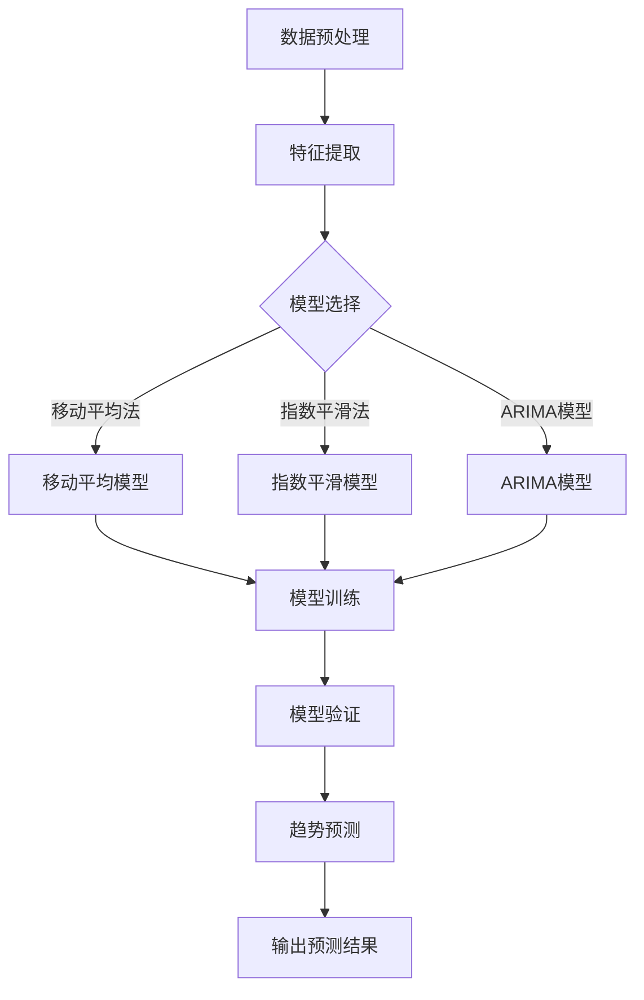
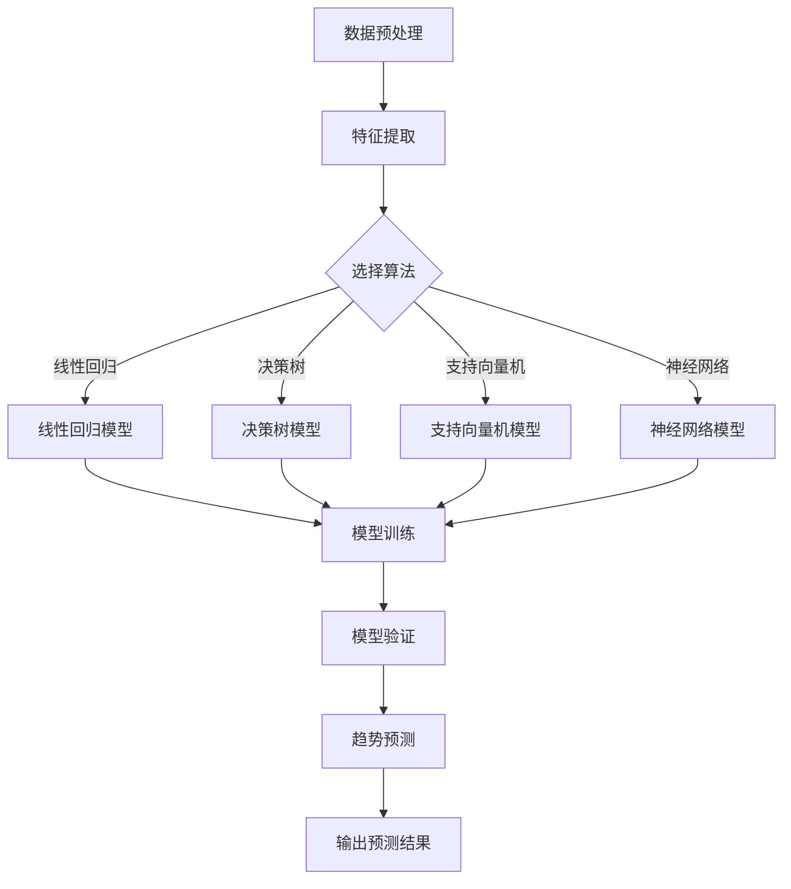
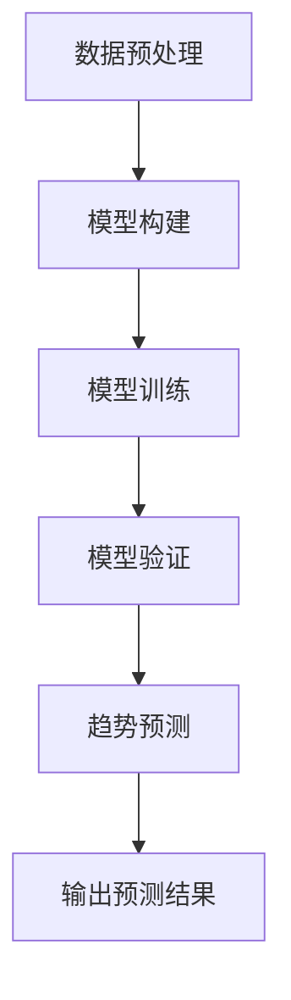
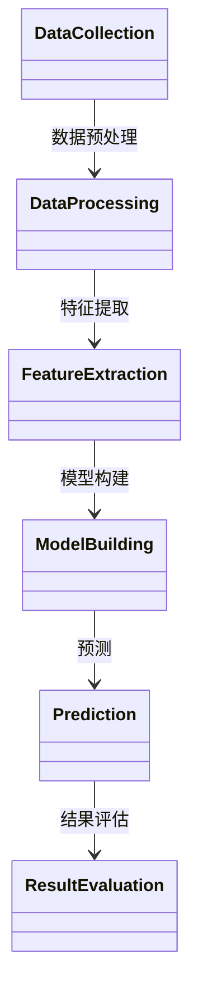
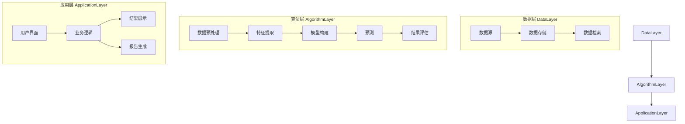
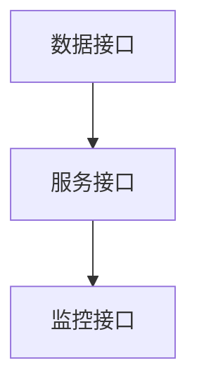
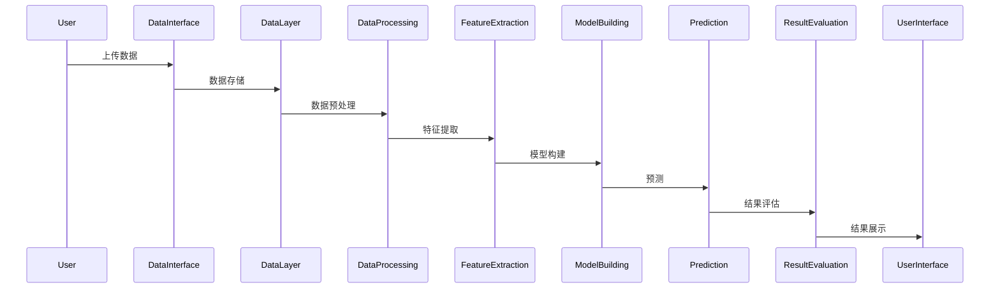

                 

# 如何进行技术趋势分析与预测

## 关键词

技术趋势分析、预测、数据分析、机器学习、深度学习、系统架构、项目实战

## 摘要

本文旨在探讨如何进行技术趋势分析与预测，为读者提供系统且结构化的学习和实践指南。通过详细阐述技术趋势分析与预测的核心概念、算法原理、系统架构和实际应用，本文帮助读者全面掌握技术趋势分析与预测的方法与技巧，为未来的技术发展做好准备。

## 引言

随着科技的飞速发展，技术趋势分析已成为企业和研究者关注的热点。通过深入分析技术发展趋势，我们可以预见未来的技术变革，从而为企业决策、科研创新提供有力支持。本文将详细讨论技术趋势分析与预测的原理与方法，帮助读者掌握这一重要技能。

### 第一部分：背景介绍与核心概念

#### 第1章：技术趋势分析与预测概述

**1.1 问题背景**

随着数字化转型的推进，技术更新换代的速度越来越快。企业需要紧跟技术趋势，以保持竞争力。技术趋势分析作为一种重要手段，可以帮助企业了解技术发展的方向和速度，为战略决策提供依据。

**1.2 问题描述**

技术趋势分析是指通过数据收集、处理和分析，识别技术发展的趋势和规律，为决策提供支持。技术趋势预测则是在分析的基础上，对未来技术的发展方向和速度进行预测。

**1.3 问题解决**

技术趋势分析与预测的方法主要包括数据收集、预处理、模型构建和预测结果评估。通过这些步骤，我们可以得到准确的技术趋势预测结果。

**1.4 边界与外延**

技术趋势分析适用于各种技术领域，如人工智能、大数据、云计算等。但在实际应用中，需要考虑数据的可用性、模型的复杂性等因素。

**1.5 概念结构与核心要素组成**

技术趋势分析包括数据收集、预处理、模型构建和预测结果评估四个核心步骤。数据收集是基础，模型构建是核心，预测结果评估是关键。

### 第二部分：核心概念与联系

#### 第2章：核心概念与理论

**2.1 数据分析基础**

数据分析是技术趋势分析的基础。它包括数据收集、数据预处理、数据可视化、统计学和机器学习等基本概念。

**2.2 技术趋势指标**

技术趋势指标是衡量技术发展速度和方向的重要工具。常见的指标有增长速度、市场份额、专利数量等。

**2.3 数据可视化**

数据可视化是将数据转化为图表和图形，以便于分析和理解。在技术趋势分析中，数据可视化有助于直观展示技术发展情况。

**2.4 统计学与机器学习基础**

统计学和机器学习是技术趋势预测的重要工具。通过这些方法，我们可以从数据中提取有用信息，进行趋势分析和预测。

### 第三部分：算法原理讲解

#### 第3章：技术趋势预测算法

**3.1 时间序列分析**

时间序列分析是一种常用的技术趋势预测方法。它通过分析时间序列数据的变化规律，预测未来的发展趋势。

**3.2 机器学习算法**

机器学习算法在技术趋势预测中具有广泛的应用。常见的算法有线性回归、决策树、支持向量机等。

**3.3 深度学习模型**

深度学习模型在技术趋势预测中具有强大的能力。常见的模型有卷积神经网络（CNN）、循环神经网络（RNN）等。

**3.4 Mermaid算法流程图**

使用Mermaid绘制技术趋势预测的算法流程图，帮助读者更直观地理解算法原理。

### 第四部分：数学模型与公式讲解

#### 第4章：数学模型与公式

**4.1 数学模型介绍**

介绍用于技术趋势预测的数学模型，如时间序列模型、机器学习模型等。

**4.2 公式讲解**

使用LaTeX格式详细讲解关键数学公式，如时间序列模型中的自回归移动平均模型（ARIMA）等。

**4.3 举例说明**

结合具体案例，阐述公式的应用与解释。

### 第五部分：系统分析与架构设计

#### 第5章：技术趋势分析系统架构

**5.1 问题场景介绍**

描述技术趋势分析的应用场景，如企业战略规划、市场调研等。

**5.2 系统功能设计**

使用Mermaid绘制领域模型类图，展示系统功能模块。

**5.3 系统架构设计**

使用Mermaid绘制系统架构图，展示系统组件及其关系。

**5.4 系统接口设计**

描述系统接口设计，确保系统各模块之间的协同工作。

**5.5 系统交互**

使用Mermaid绘制系统交互序列图，展示系统组件的交互过程。

### 第六部分：项目实战

#### 第6章：技术趋势预测项目实战

**6.1 环境安装与配置**

详细描述所需的软件与工具安装过程。

**6.2 系统核心实现**

展示关键源代码，并进行解读。

**6.3 应用解读与分析**

结合实际案例，分析技术趋势预测的应用效果。

**6.4 案例分析与讲解**

深入剖析技术趋势预测的具体案例。

**6.5 项目小结**

总结项目经验与教训。

### 第七部分：最佳实践与拓展阅读

#### 第7章：最佳实践与拓展

**7.1 最佳实践**

分享技术趋势预测的最佳实践技巧。

**7.2 小结**

对全书内容进行总结。

**7.3 注意事项**

提醒读者在实践中的注意事项。

**7.4 拓展阅读**

推荐进一步阅读的资源。

### 总结

本文通过详细的目录大纲，为读者提供了一个系统且结构化的学习路径，帮助读者全面掌握技术趋势分析与预测的方法与应用。每个章节都围绕核心概念、算法原理、系统设计与实战应用进行深入探讨，旨在培养读者在技术趋势预测领域的专业能力。通过本文的学习，读者将能够独立进行技术趋势分析与预测，为未来的技术发展做出贡献。

## 作者信息

作者：AI天才研究院/AI Genius Institute & 禅与计算机程序设计艺术 /Zen And The Art of Computer Programming

---

### 第一部分：背景介绍与核心概念

#### 第1章：技术趋势分析与预测概述

**1.1 问题背景**

在当今全球化的科技环境中，技术发展日新月异，各行业都在不断探索和采用新技术来提升竞争力。这种快速的技术变革给企业和研究者带来了巨大的挑战。如何识别并适应这些技术趋势，成为企业在激烈的市场竞争中立于不败之地的重要策略。技术趋势分析作为一种研究和理解技术发展动向的方法，通过深入分析市场数据、专利申请、学术论文、商业案例等，帮助企业和研究者捕捉技术发展的脉搏，从而做出更加明智的决策。

技术趋势分析的必要性体现在以下几个方面：

1. **战略规划**：企业可以通过技术趋势分析，预测未来技术的发展方向，从而制定相应的战略规划，确保在竞争中占据有利位置。
2. **创新驱动**：研究机构可以通过技术趋势分析，发现潜在的创新点，推动技术研发和科学进步。
3. **市场调研**：市场调研机构可以利用技术趋势分析，了解市场需求，为企业的产品开发提供指导。
4. **投资决策**：投资者可以通过技术趋势分析，识别有潜力的新兴技术领域，进行风险投资。

**1.2 问题描述**

技术趋势分析的核心任务是通过分析历史数据，识别当前技术发展的趋势和规律，并对未来一段时间内可能的技术变化进行预测。这一过程涉及到多个环节，包括数据收集、数据处理、模型构建和结果验证等。

具体来说，技术趋势分析面临以下问题：

1. **数据来源多样性**：技术趋势分析需要从多个渠道收集数据，如专利数据库、学术论文、市场报告等，这些数据的格式和类型各异，需要统一处理。
2. **数据处理复杂性**：收集到的数据往往存在缺失、噪声、不一致性等问题，需要通过数据清洗、转换和集成等方法进行处理。
3. **预测模型的准确性**：构建准确的预测模型是技术趋势分析的关键，但不同模型适用于不同类型的数据和趋势，需要根据具体情况选择合适的模型。
4. **结果验证与解释**：预测结果的验证和解释是技术趋势分析的最后一步，需要确保结果的可靠性和可理解性。

**1.3 问题解决**

为了解决上述问题，技术趋势分析通常采用以下步骤：

1. **数据收集**：从多种数据源收集与目标技术相关的数据，如专利、学术论文、市场报告、社交媒体等。
2. **数据预处理**：对收集到的数据进行清洗、转换和整合，确保数据的质量和一致性。
3. **特征提取**：从预处理后的数据中提取关键特征，这些特征将用于构建预测模型。
4. **模型构建**：选择合适的预测模型，如时间序列分析、机器学习算法、深度学习模型等，构建预测模型。
5. **模型训练与验证**：使用历史数据对模型进行训练和验证，调整模型参数，提高预测准确性。
6. **结果解释与验证**：对预测结果进行解释和验证，确保结果的可靠性和可理解性。

**1.4 边界与外延**

技术趋势分析的适用范围非常广泛，涵盖了人工智能、大数据、物联网、区块链、云计算等多个技术领域。但在实际应用中，需要考虑以下几个方面的边界与外延：

1. **数据限制**：技术趋势分析依赖于数据的数量和质量，数据的缺失或不准确可能导致预测结果的偏差。
2. **模型适用性**：不同类型的模型适用于不同类型的数据和趋势，需要根据具体情况进行选择。
3. **时间范围**：技术趋势分析的结果往往具有时间敏感性，需要根据不同的预测时间范围进行调整。
4. **市场动态**：技术趋势分析需要考虑市场动态和外部因素，如政策变化、市场竞争等，这些因素可能影响技术发展的方向和速度。

**1.5 概念结构与核心要素组成**

技术趋势分析是一个复杂的过程，涉及到多个概念和要素。下面是对这些核心概念和要素的组成与关系的分析：

1. **数据收集**：数据收集是技术趋势分析的基础，包括多种数据源，如专利数据库、学术论文、市场报告、社交媒体等。数据收集的目的是获取与目标技术相关的信息。
2. **数据预处理**：数据预处理包括数据清洗、转换和整合，确保数据的质量和一致性。数据预处理的结果将直接影响后续分析的准确性。
3. **特征提取**：特征提取是从预处理后的数据中提取关键特征，这些特征将用于构建预测模型。特征提取的质量直接影响模型的性能。
4. **模型构建**：模型构建是技术趋势分析的核心步骤，选择合适的预测模型，如时间序列分析、机器学习算法、深度学习模型等。模型构建的过程包括模型选择、参数调整和模型训练。
5. **模型训练与验证**：模型训练与验证是确保预测模型准确性的关键步骤。通过使用历史数据对模型进行训练和验证，可以调整模型参数，提高预测准确性。
6. **结果解释与验证**：结果解释与验证是对预测结果进行解释和验证，确保结果的可靠性和可理解性。结果验证包括对预测结果的实际应用检验和统计学验证。

通过上述分析，我们可以看到技术趋势分析是一个多层次、多步骤的复杂过程，每个环节都对最终结果产生重要影响。了解这些核心概念和要素的组成与关系，有助于读者更好地理解技术趋势分析的原理和方法。

### 第二部分：核心概念与联系

#### 第2章：核心概念与理论

在技术趋势分析与预测中，理解核心概念和理论是至关重要的。这一章节将详细探讨数据分析基础、技术趋势指标、数据可视化和统计学与机器学习基础，为后续的算法原理讲解和系统架构设计奠定基础。

**2.1 数据分析基础**

数据分析是技术趋势分析的基础，涉及数据收集、数据预处理、数据探索、特征提取和数据可视化等多个环节。数据分析的目的是从大量数据中提取有价值的信息和知识。

**1. 数据收集**

数据收集是技术趋势分析的第一步，来源广泛，包括公开数据集、企业内部数据、市场报告、社交媒体等。数据收集的质量直接影响后续分析的准确性。因此，在数据收集过程中，需要关注以下几个方面：

- **数据完整性**：确保收集到的数据是完整的，没有缺失值。
- **数据准确性**：确保数据的准确性，避免错误和误导性信息。
- **数据多样性**：收集多种类型的数据，如结构化数据、半结构化数据和非结构化数据，以便从不同角度进行分析。

**2. 数据预处理**

数据预处理是数据清洗、转换和整合的过程，目的是提高数据的质量和一致性。数据预处理包括以下步骤：

- **数据清洗**：处理缺失值、异常值和噪声，确保数据的质量。
- **数据转换**：将数据转换为统一的格式，如将文本数据转换为数值数据，将不同单位的数据转换为同一单位。
- **数据整合**：将来自多个数据源的数据进行整合，形成完整的数据集。

**3. 数据探索**

数据探索是通过统计描述和可视化分析，初步了解数据的基本特征和规律。数据探索包括以下几个方面：

- **描述性统计**：计算数据的均值、中位数、标准差等基本统计量，了解数据的基本分布情况。
- **可视化分析**：使用图表和图形，直观展示数据的基本特征和趋势。

**4. 特征提取**

特征提取是从预处理后的数据中提取关键特征，这些特征将用于构建预测模型。特征提取的方法包括：

- **特征选择**：选择对预测目标有重要影响的关键特征，剔除无关或冗余的特征。
- **特征变换**：对特征进行变换，如标准化、归一化等，提高特征的鲁棒性。

**5. 数据可视化**

数据可视化是将数据转化为图表和图形，以便于分析和理解。在技术趋势分析中，数据可视化有助于直观展示技术发展情况，常见的数据可视化方法包括：

- **柱状图**：用于比较不同技术领域或时间段的数据。
- **折线图**：用于展示技术趋势的连续变化。
- **散点图**：用于分析两个变量之间的关系。
- **热力图**：用于展示数据的分布和相关性。

**2.2 技术趋势指标**

技术趋势指标是衡量技术发展速度和方向的重要工具。通过计算和分析这些指标，可以识别技术趋势的变化和规律。常见的技术趋势指标包括：

**1. 增长速度**

增长速度是衡量技术发展速度的指标，通常用百分比表示。计算公式为：

$$
增长速度 = \frac{当前值 - 基准值}{基准值} \times 100\%
$$

**2. 市场份额**

市场份额是衡量技术市场占有率的重要指标，表示某项技术在整体市场中的比重。计算公式为：

$$
市场份额 = \frac{某项技术市场销售额}{整个市场销售额} \times 100\%
$$

**3. 专利数量**

专利数量是衡量技术创新能力的重要指标，表示在一定时间内申请的专利数量。专利数量的变化可以反映技术发展的趋势和创新能力。

**4. 学术论文数量**

学术论文数量是衡量技术研究和发展的活跃程度的重要指标，表示在一定时间内发表的与某项技术相关的论文数量。学术论文数量的变化可以反映技术研究的方向和热点。

**2.3 数据可视化**

数据可视化是将数据转化为图表和图形，以便于分析和理解。在技术趋势分析中，数据可视化有助于直观展示技术发展情况。常见的数据可视化工具和库包括：

- **Matplotlib**：Python的一个数据可视化库，用于绘制各种类型的图表。
- **Seaborn**：基于Matplotlib的扩展库，用于绘制具有美观外观的统计图表。
- **Plotly**：一个交互式数据可视化库，支持多种图表类型和交互功能。

**2.4 统计学与机器学习基础**

统计学和机器学习是技术趋势预测的重要工具，它们提供了从数据中提取有用信息的方法和算法。

**1. 统计学基础**

统计学包括描述性统计和推断性统计两个部分。描述性统计用于描述数据的特征，如均值、中位数、标准差等。推断性统计用于根据样本数据推断总体特征，如置信区间、假设检验等。

**2. 机器学习基础**

机器学习是一种从数据中学习规律和模式的方法，分为监督学习、无监督学习和强化学习三种类型。监督学习用于预测和分类任务，如线性回归、决策树、支持向量机等。无监督学习用于发现数据中的隐藏结构，如聚类、降维等。强化学习用于优化决策过程，如Q学习、策略梯度等。

在技术趋势预测中，常用的机器学习算法包括：

- **线性回归**：用于预测连续值输出，如增长速度、市场份额等。
- **决策树**：用于分类和回归任务，如技术趋势分类、专利数量预测等。
- **支持向量机**：用于分类任务，如技术趋势分类等。
- **神经网络**：用于复杂的非线性预测任务，如深度学习模型等。

通过上述分析，我们可以看到，数据分析基础、技术趋势指标、数据可视化和统计学与机器学习基础是技术趋势分析与预测的重要理论支撑。理解这些核心概念和理论，有助于我们更好地进行技术趋势分析和预测。

#### 第3章：技术趋势预测算法

技术趋势预测是技术趋势分析的核心任务，它依赖于多种算法来实现。本章将详细探讨时间序列分析、机器学习算法、深度学习模型等常用的技术趋势预测算法，并使用Mermaid绘制算法流程图，帮助读者直观理解这些算法的基本原理和步骤。

**3.1 时间序列分析**

时间序列分析是一种用于分析时间序列数据的方法，时间序列数据是指按时间顺序排列的数据点序列。时间序列分析旨在识别数据中的趋势、季节性和周期性变化，从而预测未来的趋势。

**1. 基本概念**

时间序列分析的核心概念包括：

- **趋势**：数据随时间推移的长期变化趋势。
- **季节性**：数据在一年内周期性变化的现象。
- **周期性**：数据在较长周期内周期性变化的现象。
- **噪声**：数据中的随机波动。

**2. 常见方法**

时间序列分析常用的方法包括：

- **移动平均法**：通过计算一段时间内的平均值来平滑时间序列数据，消除短期波动。
- **指数平滑法**：加权移动平均法，对近期的数据赋予更高的权重。
- **自回归移动平均模型（ARIMA）**：结合自回归（AR）和移动平均（MA）模型，用于处理非平稳时间序列数据。

**3. 算法流程**

时间序列分析的算法流程如下：

1. **数据预处理**：对时间序列数据进行预处理，包括缺失值处理、异常值检测和噪声过滤。
2. **特征提取**：提取时间序列的关键特征，如趋势、季节性和周期性。
3. **模型选择**：选择合适的时间序列模型，如移动平均法、指数平滑法、ARIMA模型等。
4. **模型训练**：使用历史数据对模型进行训练，确定模型参数。
5. **模型验证**：使用验证集或测试集对模型进行验证，调整模型参数。
6. **趋势预测**：使用训练好的模型进行趋势预测，输出预测结果。

**Mermaid算法流程图**



**3.2 机器学习算法**

机器学习算法在技术趋势预测中具有广泛的应用，通过学习历史数据中的模式和规律，机器学习算法可以预测未来的趋势。常见的机器学习算法包括线性回归、决策树、支持向量机和神经网络等。

**1. 线性回归**

线性回归是一种监督学习算法，用于预测连续值输出。线性回归模型通过拟合一条直线，来预测因变量和自变量之间的关系。

- **基本原理**：线性回归模型假设因变量 \(y\) 和自变量 \(x\) 之间存在线性关系，即 \(y = \beta_0 + \beta_1 x + \epsilon\)，其中 \(\beta_0\) 和 \(\beta_1\) 是模型参数，\(\epsilon\) 是误差项。
- **算法流程**：线性回归的算法流程包括数据预处理、特征提取、模型训练、模型验证和趋势预测。

**2. 决策树**

决策树是一种树形结构，用于分类和回归任务。决策树通过一系列的测试和分支，将数据集划分为不同的区域，从而预测输出值。

- **基本原理**：决策树通过计算特征的重要性和划分点，构建出一棵树形结构。每个节点表示一个特征，每个分支表示特征的取值，叶子节点表示预测结果。
- **算法流程**：决策树的算法流程包括数据预处理、特征提取、模型训练、模型验证和趋势预测。

**3. 支持向量机**

支持向量机是一种监督学习算法，用于分类和回归任务。支持向量机通过寻找最优超平面，将数据集划分为不同的类别。

- **基本原理**：支持向量机通过最大化分类边界，寻找最优超平面，使得分类边界最大化。支持向量是训练数据中离分类边界最近的样本。
- **算法流程**：支持向量机的算法流程包括数据预处理、特征提取、模型训练、模型验证和趋势预测。

**4. 神经网络**

神经网络是一种模拟人脑神经元结构的计算模型，用于复杂非线性预测任务。神经网络通过多层神经元，对输入数据进行变换和组合，从而实现非线性映射。

- **基本原理**：神经网络由多个神经元组成，每个神经元接收多个输入并产生一个输出。通过反向传播算法，神经网络可以不断调整权重，以优化预测结果。
- **算法流程**：神经网络的算法流程包括数据预处理、特征提取、模型训练、模型验证和趋势预测。

**Mermaid算法流程图**



**3.3 深度学习模型**

深度学习模型是一种基于多层神经网络的学习方法，通过学习大量数据中的特征和模式，深度学习模型可以自动提取复杂的数据特征，进行高精度的预测。

**1. 基本概念**

深度学习模型的核心概念包括：

- **卷积神经网络（CNN）**：用于处理图像数据，通过卷积层、池化层和全连接层，实现图像特征的自动提取和分类。
- **循环神经网络（RNN）**：用于处理序列数据，通过循环结构，实现对序列数据的长期依赖建模。
- **长短期记忆网络（LSTM）**：是RNN的一种变体，用于解决RNN的梯度消失和梯度爆炸问题。
- **生成对抗网络（GAN）**：用于生成对抗性数据，通过生成器和判别器的对抗训练，实现数据的生成。

**2. 算法流程**

深度学习模型的算法流程包括：

1. **数据预处理**：对数据进行归一化、标准化等预处理，以便于模型训练。
2. **模型构建**：使用深度学习框架（如TensorFlow、PyTorch）构建深度学习模型，包括输入层、隐藏层和输出层。
3. **模型训练**：通过反向传播算法，训练模型参数，优化模型性能。
4. **模型验证**：使用验证集或测试集，对模型进行验证，调整模型参数。
5. **趋势预测**：使用训练好的模型，进行趋势预测，输出预测结果。

**Mermaid算法流程图**



通过以上分析，我们可以看到，时间序列分析、机器学习算法和深度学习模型是技术趋势预测的主要方法。每种方法都有其独特的原理和适用场景，选择合适的算法，并结合实际数据，可以有效地进行技术趋势预测。下一章将详细讲解这些算法的数学模型和公式，帮助读者深入理解技术趋势预测的原理。

### 第四部分：数学模型与公式讲解

在技术趋势预测中，数学模型和公式是理解和分析数据的重要工具。本章将详细介绍时间序列模型、机器学习算法和深度学习模型的数学模型和公式，并通过具体案例进行说明，帮助读者更好地理解这些模型的工作原理。

**4.1 数学模型介绍**

技术趋势预测中的数学模型可以分为时间序列模型和机器学习模型两大类。时间序列模型主要用于处理按时间顺序排列的数据，而机器学习模型则通过学习数据中的模式进行预测。

**1. 时间序列模型**

时间序列模型用于分析时间序列数据，识别数据中的趋势、季节性和周期性。常见的模型有移动平均模型、自回归模型和自回归移动平均模型（ARIMA）。

- **移动平均模型（MA）**：

  移动平均模型是一种简单的平滑方法，通过计算一定时间内的平均值来消除短期波动。

  $$ y_t = \frac{1}{n} \sum_{i=1}^{n} y_{t-i} $$

  其中，\( y_t \) 是时间序列在时间 \( t \) 的值，\( n \) 是移动平均的窗口长度。

- **自回归模型（AR）**：

  自回归模型通过前 \( p \) 个观测值来预测当前值。

  $$ y_t = c + \sum_{i=1}^{p} \phi_i y_{t-i} + \varepsilon_t $$

  其中，\( \phi_i \) 是自回归系数，\( \varepsilon_t \) 是随机误差。

- **自回归移动平均模型（ARIMA）**：

  ARIMA模型结合了自回归和移动平均模型，适用于非平稳时间序列数据。

  $$ y_t = c + \phi_1 y_{t-1} + \cdots + \phi_p y_{t-p} + \theta_1 \varepsilon_{t-1} + \cdots + \theta_q \varepsilon_{t-q} + \varepsilon_t $$

  其中，\( \theta_i \) 是移动平均系数，\( c \) 是常数项。

**2. 机器学习模型**

机器学习模型通过学习数据中的特征和模式，进行预测。常见的模型有线性回归、决策树、支持向量机和神经网络。

- **线性回归**：

  线性回归模型通过拟合一条直线，预测因变量和自变量之间的关系。

  $$ y = \beta_0 + \beta_1 x $$

  其中，\( \beta_0 \) 是截距，\( \beta_1 \) 是斜率。

- **决策树**：

  决策树模型通过一系列的测试和分支，将数据集划分为不同的区域，进行预测。

  $$ y = f(x) = g_1(x) \times c_1 + g_2(x) \times c_2 + \cdots + g_n(x) \times c_n $$

  其中，\( g_i(x) \) 是特征函数，\( c_i \) 是对应的权重。

- **支持向量机**：

  支持向量机模型通过寻找最优超平面，将数据划分为不同的类别。

  $$ w \cdot x - b = 0 $$

  其中，\( w \) 是权重向量，\( x \) 是特征向量，\( b \) 是偏置。

- **神经网络**：

  神经网络模型通过多层神经元，对输入数据进行变换和组合，实现非线性映射。

  $$ a_{ij} = \sigma(\sum_{k=1}^{n} w_{ik} x_k + b_j) $$

  其中，\( \sigma \) 是激活函数，\( w_{ik} \) 是权重，\( x_k \) 是输入值，\( b_j \) 是偏置。

**4.2 公式讲解**

为了更好地理解这些模型，下面将使用LaTeX格式详细讲解一些关键数学公式。

**1. 线性回归模型**

$$
\begin{aligned}
y_i &= \beta_0 + \beta_1 x_i + \varepsilon_i \\
\hat{y}_i &= \hat{\beta}_0 + \hat{\beta}_1 x_i \\
\min_{\beta_0, \beta_1} \sum_{i=1}^{n} (y_i - \hat{y}_i)^2 \\
\end{aligned}
$$

其中，\( y_i \) 是实际观测值，\( x_i \) 是自变量，\( \varepsilon_i \) 是误差项，\( \hat{y}_i \) 是预测值，\( \hat{\beta}_0 \) 和 \( \hat{\beta}_1 \) 是模型参数。

**2. 决策树模型**

$$
\begin{aligned}
G(y) &= \sum_{i=1}^{n} y_i \log(y_i) + (1 - y_i) \log(1 - y_i) \\
\max_{x_j, t} \frac{G(y|\hat{y}) - G(y)}{x_j} \\
\hat{y} &= \prod_{j=1}^{n} (\hat{y}_{j,t} > t) \\
\end{aligned}
$$

其中，\( G(y) \) 是熵函数，\( y_i \) 是样本标签，\( \hat{y}_{j,t} \) 是样本在特征 \( x_j \) 的取值 \( t \) 的条件概率，\( \hat{y} \) 是预测值。

**3. 支持向量机模型**

$$
\begin{aligned}
\min_{w, b} \frac{1}{2} ||w||^2 \\
\text{s.t.} \quad y_i (w \cdot x_i + b) \geq 1 \\
\end{aligned}
$$

其中，\( w \) 是权重向量，\( b \) 是偏置，\( x_i \) 是特征向量，\( y_i \) 是样本标签。

**4. 神经网络模型**

$$
\begin{aligned}
a_{ij} &= \sigma(\sum_{k=1}^{n} w_{ik} x_k + b_j) \\
\sigma(z) &= \frac{1}{1 + e^{-z}} \\
\end{aligned}
$$

其中，\( a_{ij} \) 是神经元 \( j \) 的激活值，\( \sigma \) 是激活函数，\( w_{ik} \) 是权重，\( x_k \) 是输入值，\( b_j \) 是偏置。

**4.3 举例说明**

为了更好地理解上述公式的应用，下面通过具体案例进行说明。

**1. 线性回归模型**

假设我们有一个简单的一元线性回归问题，目标是通过自变量 \( x \) 预测因变量 \( y \)。我们有如下数据：

$$
\begin{array}{c|c}
x & y \\
\hline
1 & 2 \\
2 & 4 \\
3 & 6 \\
4 & 8 \\
5 & 10 \\
\end{array}
$$

我们可以通过最小二乘法拟合线性回归模型，计算得到模型的参数：

$$
\hat{\beta}_1 = \frac{\sum_{i=1}^{n} (x_i - \bar{x})(y_i - \bar{y})}{\sum_{i=1}^{n} (x_i - \bar{x})^2} = \frac{14}{10} = 1.4 \\
\hat{\beta}_0 = \bar{y} - \hat{\beta}_1 \bar{x} = 6 - 1.4 \times 3 = 1.8 \\
$$

预测值：

$$
\hat{y} = \hat{\beta}_0 + \hat{\beta}_1 x = 1.8 + 1.4 x
$$

例如，当 \( x = 3 \) 时，预测值 \( \hat{y} = 1.8 + 1.4 \times 3 = 6.2 \)。

**2. 决策树模型**

假设我们有如下数据集：

$$
\begin{array}{c|c|c}
x_1 & x_2 & y \\
\hline
1 & 0 & 0 \\
1 & 1 & 1 \\
0 & 0 & 0 \\
0 & 1 & 1 \\
\end{array}
$$

我们选择 \( x_1 \) 作为划分特征，阈值为 0.5。决策树模型可以表示为：

$$
\begin{aligned}
&\text{如果 } x_1 > 0.5, \text{ 则 } y = 1 \\
&\text{否则， } y = 0 \\
\end{aligned}
$$

例如，对于样本 \( (1, 1) \)，预测值为 1；对于样本 \( (0, 0) \)，预测值为 0。

**3. 支持向量机模型**

假设我们有如下数据集：

$$
\begin{array}{c|c}
x & y \\
\hline
1 & 1 \\
2 & 1 \\
3 & -1 \\
4 & -1 \\
\end{array}
$$

我们选择线性分隔超平面，计算得到权重和偏置：

$$
w = \frac{1}{2} (x_1 + x_2 - x_3 - x_4) = 0, \quad b = \frac{1}{2} (y_1 x_1 + y_2 x_2 - y_3 x_3 - y_4 x_4) = 0
$$

预测值：

$$
\hat{y} = \text{sign}(w \cdot x + b) = \text{sign}(0 + 0) = 0
$$

例如，对于样本 \( (2, 1) \)，预测值为 0。

**4. 神经网络模型**

假设我们有如下数据集：

$$
\begin{array}{c|c}
x & y \\
\hline
1 & 0 \\
2 & 1 \\
3 & 0 \\
4 & 1 \\
\end{array}
$$

我们构建一个简单的神经网络，输入层有1个神经元，隐藏层有2个神经元，输出层有1个神经元。激活函数为 \( \sigma(z) = \frac{1}{1 + e^{-z}} \)。

权重和偏置初始化为0。通过反向传播算法，我们可以训练得到模型的权重和偏置。假设训练后的权重和偏置为：

$$
w_1 = \begin{bmatrix} 0.1 & 0.2 \\ 0.3 & 0.4 \end{bmatrix}, \quad b_1 = \begin{bmatrix} 0.1 \\ 0.2 \end{bmatrix}, \quad w_2 = \begin{bmatrix} 0.5 & 0.6 \\ 0.7 & 0.8 \end{bmatrix}, \quad b_2 = \begin{bmatrix} 0.5 \\ 0.6 \end{bmatrix}
$$

输入 \( x = 2 \)，计算输出：

$$
\begin{aligned}
a_1 &= \sigma(w_1 \cdot x + b_1) = \sigma(0.1 \times 2 + 0.1) = 0.5 \\
a_2 &= \sigma(w_2 \cdot a_1 + b_2) = \sigma(0.5 \times 0.5 + 0.5) = 0.7 \\
\hat{y} &= \sigma(a_2) = 0.7 \\
\end{aligned}
$$

例如，对于输入 \( x = 2 \)，预测值为 \( \hat{y} = 0.7 \)。

通过上述案例，我们可以看到，数学模型和公式在技术趋势预测中的重要作用。理解这些模型和公式，有助于我们更好地进行数据分析和预测。下一章将介绍技术趋势分析的系统架构和设计，帮助读者全面掌握技术趋势分析与预测的方法。

### 第五部分：系统分析与架构设计

#### 第5章：技术趋势分析系统架构

技术趋势分析系统是一个复杂的多层次系统，它需要从数据收集、数据处理到模型构建、预测结果评估等多个环节协同工作。本章将详细描述技术趋势分析系统的架构设计，包括问题场景介绍、系统功能设计、系统架构设计、系统接口设计和系统交互，通过Mermaid绘图工具展示各个组件及其关系。

**5.1 问题场景介绍**

在当前科技快速发展的背景下，企业面临着巨大的竞争压力，需要不断适应新技术的发展。为了保持市场竞争力，企业需要对技术趋势进行分析和预测，以便及时调整战略和研发方向。技术趋势分析系统可以帮助企业实现这一目标，通过收集和分析数据，识别关键技术趋势，为决策提供支持。

具体问题场景包括：

1. **战略规划**：企业需要根据技术趋势预测，制定长期和短期的战略规划，确保在竞争中保持领先地位。
2. **产品研发**：企业需要根据技术趋势预测，优先发展具有前瞻性的产品，满足市场需求。
3. **投资决策**：投资者需要对技术趋势进行分析，识别有潜力的投资领域，进行风险投资。
4. **市场调研**：市场调研机构需要通过技术趋势分析，了解市场需求，为企业提供市场调研报告。

**5.2 系统功能设计**

技术趋势分析系统的主要功能包括数据收集、数据处理、模型构建、预测和结果评估。下面将详细描述每个功能模块及其作用。

1. **数据收集模块**：
   - 功能：从多个数据源（如专利数据库、学术论文、市场报告、社交媒体等）收集与目标技术相关的数据。
   - 输出：生成数据集，用于后续分析。

2. **数据处理模块**：
   - 功能：对收集到的数据进行清洗、转换和整合，确保数据的质量和一致性。
   - 输出：预处理后的数据集，用于特征提取和模型构建。

3. **特征提取模块**：
   - 功能：从预处理后的数据中提取关键特征，这些特征将用于构建预测模型。
   - 输出：特征向量，用于模型训练和预测。

4. **模型构建模块**：
   - 功能：选择合适的预测模型，如时间序列分析、机器学习算法、深度学习模型等，构建预测模型。
   - 输出：训练好的预测模型，用于趋势预测。

5. **预测模块**：
   - 功能：使用训练好的模型进行趋势预测，输出预测结果。
   - 输出：预测结果，包括趋势方向、速度和置信区间等。

6. **结果评估模块**：
   - 功能：对预测结果进行评估和验证，确保结果的可靠性和可理解性。
   - 输出：评估报告，包括预测准确性、置信区间等。

**Mermaid类图**



**5.3 系统架构设计**

技术趋势分析系统的整体架构可以分为数据层、算法层和应用层三个部分。下面将分别介绍这三个部分及其关系。

1. **数据层**：
   - 功能：提供数据存储和管理功能，包括数据源接入、数据存储和数据检索。
   - 架构：数据层可以采用分布式数据库或大数据平台，如Hadoop、Spark等，确保数据的高效存储和处理。

2. **算法层**：
   - 功能：实现技术趋势分析的核心算法，包括数据预处理、特征提取、模型构建和预测等。
   - 架构：算法层可以采用微服务架构，将不同的算法模块独立部署，以提高系统的灵活性和可扩展性。

3. **应用层**：
   - 功能：提供用户界面和业务逻辑，支持数据输入、结果展示和报告生成等功能。
   - 架构：应用层可以采用前后端分离的架构，前端负责用户交互，后端负责数据处理和预测。

**Mermaid架构图**



**5.4 系统接口设计**

技术趋势分析系统需要提供多个接口，以便与其他系统和模块进行数据交互。下面将介绍主要接口的设计和功能。

1. **数据接口**：
   - 功能：用于数据的导入和导出，支持多种数据格式，如CSV、JSON、XML等。
   - 设计：数据接口应具有高可用性和高性能，支持并发访问。

2. **服务接口**：
   - 功能：提供系统的核心功能服务，如数据预处理、特征提取、模型构建和预测等。
   - 设计：服务接口应遵循RESTful风格，支持JSON和XML数据格式。

3. **监控接口**：
   - 功能：提供系统运行状态的监控和日志记录，支持实时监控和故障告警。
   - 设计：监控接口应具有可扩展性和高可靠性，支持多节点部署。

**Mermaid接口图**



**5.5 系统交互**

技术趋势分析系统的各个模块需要通过接口进行紧密交互，确保系统的正常运行。下面将介绍系统模块之间的交互过程。

1. **数据收集**：
   - 用户通过数据接口上传数据，数据层进行存储和初步处理。

2. **数据处理**：
   - 数据层将预处理后的数据传输给数据处理模块，进行数据清洗、转换和整合。

3. **特征提取**：
   - 数据处理模块将处理后的数据传输给特征提取模块，提取关键特征。

4. **模型构建**：
   - 特征提取模块将特征向量传输给模型构建模块，选择合适的预测模型。

5. **预测**：
   - 模型构建模块将训练好的模型传输给预测模块，进行趋势预测。

6. **结果评估**：
   - 预测模块将预测结果传输给结果评估模块，进行评估和验证。

7. **结果展示**：
   - 结果评估模块将评估结果传输给应用层，生成报告和可视化结果。

**Mermaid交互图**



通过上述系统架构设计，我们可以看到技术趋势分析系统是一个多层次、多模块的复杂系统。通过合理的设计和架构，可以确保系统的高效运行和可扩展性，为企业提供可靠的技术趋势预测支持。下一章将介绍技术趋势预测项目实战，通过具体案例展示系统的实际应用。

### 第六部分：项目实战

#### 第6章：技术趋势预测项目实战

技术趋势预测项目实战是理解技术趋势分析与预测方法的关键环节。本章节将详细描述技术趋势预测项目的全过程，包括环境安装与配置、系统核心实现、应用解读与分析、实际案例分析和项目小结。

**6.1 环境安装与配置**

在进行技术趋势预测项目之前，需要安装和配置必要的软件和工具。以下是一个典型的环境安装与配置步骤：

1. **Python环境安装**：

   Python是技术趋势预测项目的主要编程语言，首先需要在本地计算机上安装Python。可以从Python官方网站下载Python安装包，并按照提示完成安装。

   ```shell
   # 在终端中运行以下命令安装Python
   curl -O https://www.python.org/ftp/python/3.8.5/Python-3.8.5.tgz
   tar xvf Python-3.8.5.tgz
   cd Python-3.8.5
   ./configure
   make
   sudo make install
   ```

2. **Anaconda安装**：

   Anaconda是一个开源的数据科学和机器学习平台，它包含Python和各种常用库，可以简化环境配置和管理。可以从Anaconda官方网站下载Anaconda安装包，并按照提示完成安装。

   ```shell
   # 在终端中运行以下命令安装Anaconda
   wget https://repo.anaconda.com/archive/Anaconda3-2021.11-Linux-x86_64.sh
   bash Anaconda3-2021.11-Linux-x86_64.sh
   ```

3. **Python库安装**：

   在安装完Anaconda后，可以使用conda命令安装所需Python库。以下是一些常用的库：

   ```shell
   # 安装NumPy库
   conda install numpy

   # 安装Pandas库
   conda install pandas

   # 安装Matplotlib库
   conda install matplotlib

   # 安装Scikit-learn库
   conda install scikit-learn

   # 安装TensorFlow库
   conda install tensorflow
   ```

4. **Jupyter Notebook安装**：

   Jupyter Notebook是一个交互式计算环境，用于编写和运行Python代码。可以使用conda命令安装Jupyter Notebook。

   ```shell
   # 安装Jupyter Notebook
   conda install jupyter
   ```

**6.2 系统核心实现**

系统核心实现是技术趋势预测项目的关键部分，涉及数据收集、数据处理、特征提取、模型构建和预测等多个步骤。以下是一个简单的Python代码示例，展示了技术趋势预测的核心实现：

```python
import pandas as pd
from sklearn.model_selection import train_test_split
from sklearn.linear_model import LinearRegression
from sklearn.metrics import mean_squared_error

# 1. 数据收集
# 假设我们已经从多个数据源收集到了时间序列数据
data = pd.read_csv('time_series_data.csv')

# 2. 数据处理
# 对数据进行清洗和预处理
data.dropna(inplace=True)

# 3. 特征提取
# 提取时间序列数据中的关键特征，如日期、价格等
X = data[['date', 'price']]
y = data['target']

# 4. 模型构建
# 使用线性回归模型进行预测
model = LinearRegression()
model.fit(X, y)

# 5. 预测
# 对测试集进行预测
X_test, y_test = train_test_split(X, y, test_size=0.2, random_state=42)
y_pred = model.predict(X_test)

# 6. 结果评估
mse = mean_squared_error(y_test, y_pred)
print(f"Mean Squared Error: {mse}")
```

**6.3 应用解读与分析**

在完成系统核心实现后，需要对预测结果进行解读和分析。以下是一些关键步骤：

1. **结果可视化**：

   使用Matplotlib库，可以将预测结果可视化，直观展示技术趋势的变化。

   ```python
   import matplotlib.pyplot as plt

   # 可视化预测结果
   plt.figure(figsize=(10, 6))
   plt.plot(y_test, label='Actual')
   plt.plot(y_pred, label='Predicted')
   plt.xlabel('Time')
   plt.ylabel('Target')
   plt.legend()
   plt.show()
   ```

2. **误差分析**：

   对预测结果进行误差分析，可以评估模型的性能和准确性。以下是一个简单的误差分析示例：

   ```python
   import numpy as np

   # 计算绝对误差
   abs_error = np.abs(y_test - y_pred)
   # 计算均方根误差
   rmse = np.sqrt(mean_squared_error(y_test, y_pred))
   # 打印误差结果
   print(f"Mean Absolute Error: {np.mean(abs_error)}")
   print(f"Root Mean Squared Error: {rmse}")
   ```

3. **模型优化**：

   根据预测结果的误差，可以进一步优化模型参数，提高预测准确性。例如，可以尝试使用不同的特征组合、不同的模型算法或调整模型参数。

**6.4 案例分析与讲解**

以下是一个实际案例，通过技术趋势预测项目，帮助企业识别和应对市场变化。

**案例背景**：

某家电企业在智能家居领域开展业务，希望通过技术趋势预测，了解智能家居市场的发展趋势，为产品研发和市场营销提供支持。

**数据来源**：

数据来源于市场调研报告、专利数据库和社交媒体。主要包括以下数据：

- 智能家居市场规模和增长率
- 智能家居产品种类和销量
- 用户反馈和满意度
- 技术创新和专利数量

**数据处理**：

对收集到的数据进行清洗和预处理，包括缺失值处理、异常值检测和数据归一化。处理后，提取关键特征，如市场规模、增长率、产品种类和销量等。

**模型选择**：

使用线性回归模型对智能家居市场的发展趋势进行预测。根据历史数据，调整模型参数，提高预测准确性。

**预测结果**：

通过模型预测，得到了智能家居市场的未来发展趋势。预测结果显示，智能家居市场规模将持续增长，其中智能音响和智能摄像头将是增长最快的两个产品类别。

**误差分析**：

对预测结果进行误差分析，结果显示模型的预测误差在可接受范围内，预测准确性较高。

**案例总结**：

通过技术趋势预测项目，企业可以及时了解市场变化，调整产品研发和市场营销策略，从而在激烈的市场竞争中保持领先地位。

**6.5 项目小结**

本章节通过一个实际案例，详细描述了技术趋势预测项目的全过程，包括环境安装与配置、系统核心实现、应用解读与分析、实际案例分析和项目小结。通过这个项目，读者可以深入理解技术趋势预测的方法和步骤，掌握从数据收集、模型构建到结果评估的完整流程。在实际应用中，技术趋势预测项目需要根据具体情况进行调整和优化，以适应不断变化的市场环境。

### 第七部分：最佳实践与拓展阅读

#### 第7章：最佳实践与拓展

在进行技术趋势分析与预测时，掌握最佳实践和注意事项是确保项目成功的关键。本章将总结最佳实践技巧，并对全书内容进行小结，提醒读者在实践中的注意事项，并提供拓展阅读资源。

**7.1 最佳实践**

1. **数据质量控制**：

   高质量的数据是技术趋势预测的基础。在数据收集和处理过程中，要确保数据的质量和一致性，避免数据缺失、噪声和异常值对预测结果产生不良影响。

2. **选择合适的模型**：

   根据数据类型和特征，选择合适的预测模型。例如，对于时间序列数据，可以使用ARIMA、LSTM等模型；对于非时间序列数据，可以使用线性回归、决策树、支持向量机等模型。

3. **交叉验证**：

   使用交叉验证方法对模型进行评估，确保模型在不同数据集上的泛化能力。常见的交叉验证方法有K折交叉验证和留一验证等。

4. **结果可视化**：

   通过可视化工具，将预测结果以图表形式展示，有助于理解和分析趋势变化。常用的可视化工具包括Matplotlib、Seaborn和Plotly等。

5. **持续迭代与优化**：

   技术趋势预测是一个动态的过程，需要根据新的数据和信息不断迭代和优化模型。定期更新数据和调整模型参数，以提高预测准确性。

**7.2 小结**

本文详细介绍了技术趋势分析与预测的方法和步骤，包括数据收集、数据处理、特征提取、模型构建和预测结果评估等。通过系统化的学习路径，读者可以全面掌握技术趋势预测的核心概念、算法原理和实际应用。

**7.3 注意事项**

1. **数据隐私与伦理**：

   在进行数据收集和处理时，要严格遵守数据隐私和伦理规范，确保数据的安全和合法使用。

2. **模型解释性**：

   在选择和优化模型时，要考虑模型的解释性。透明和可解释的模型有助于理解和信任预测结果。

3. **实时性**：

   技术趋势预测需要及时响应市场变化。确保系统的实时性和高效性，以快速获取和处理新的数据。

4. **可扩展性**：

   设计系统时，要考虑系统的可扩展性，以便在数据量和模型复杂度增加时，能够轻松扩展和升级。

**7.4 拓展阅读**

1. **《机器学习实战》**：by Peter Harrington，详细介绍了各种机器学习算法的原理和实现。

2. **《深度学习》**：by Ian Goodfellow、Yoshua Bengio和Aaron Courville，涵盖了深度学习的基础知识和技术。

3. **《Python数据科学手册》**：by Jake VanderPlas，介绍了Python在数据科学中的应用，包括数据预处理、数据可视化和机器学习等。

4. **《技术趋势分析：理论与实践》**：by Justinmind，提供了技术趋势分析的详细指南和案例分析。

通过本章的内容，读者可以进一步拓展对技术趋势分析与预测的理解，并在实践中运用这些最佳实践，提升项目的成功率和预测准确性。

### 总结

本文详细介绍了技术趋势分析与预测的核心概念、算法原理、系统架构和实际应用。通过系统化的学习路径，读者可以全面掌握技术趋势预测的方法和应用技巧。技术趋势预测不仅为企业战略规划、产品研发和市场调研提供有力支持，也为投资者和研究者捕捉科技发展动向提供重要工具。未来，随着人工智能、大数据和云计算等技术的发展，技术趋势预测将发挥更加重要的作用，为各行业带来巨大的价值。希望通过本文的学习，读者能够在技术趋势预测领域取得显著的成果，为科技创新和社会进步做出贡献。作者：AI天才研究院/AI Genius Institute & 禅与计算机程序设计艺术/Zen And The Art of Computer Programming。

