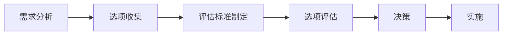
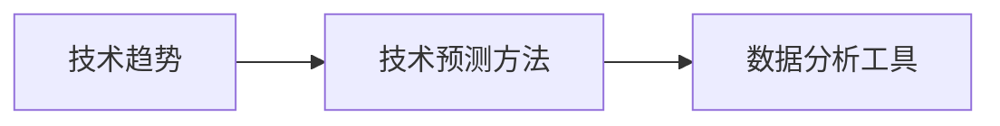
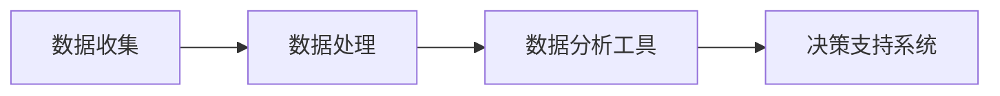
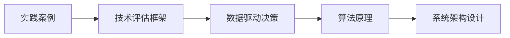
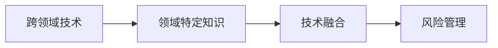
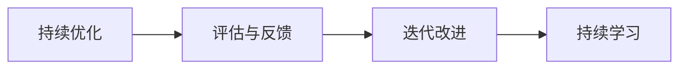
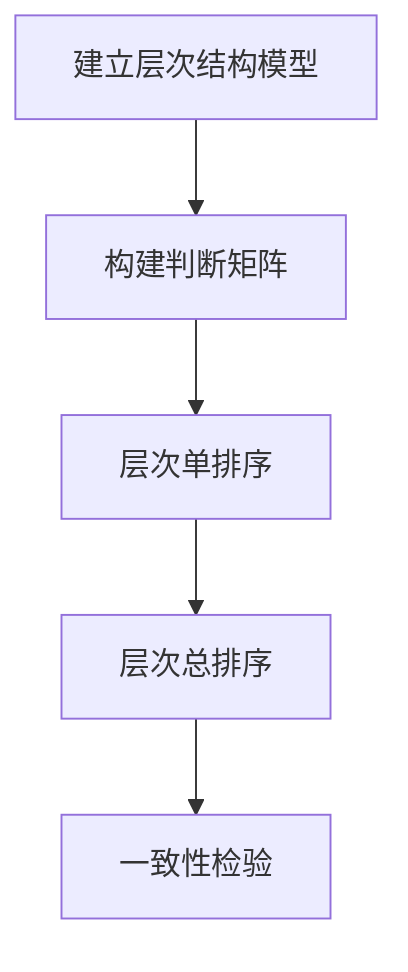
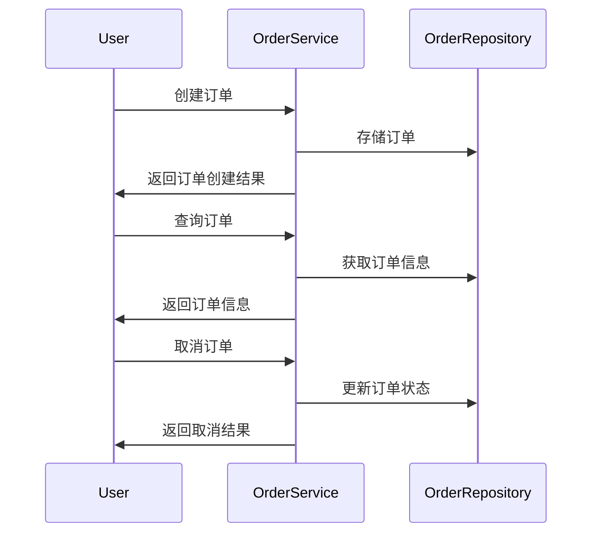
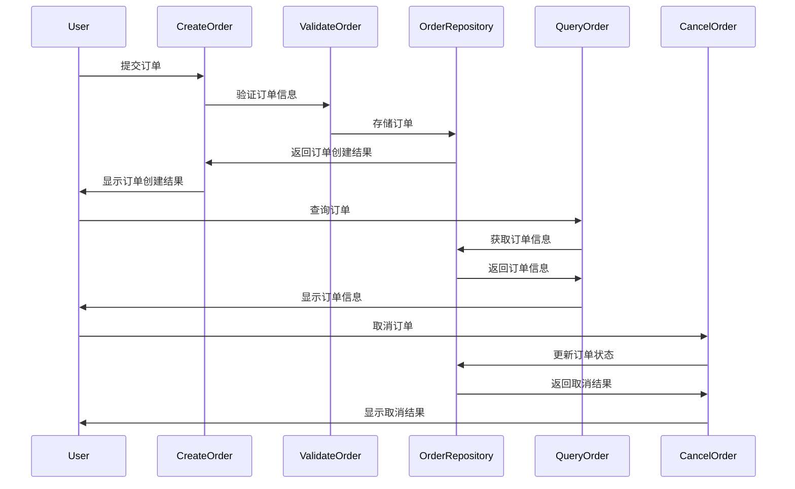
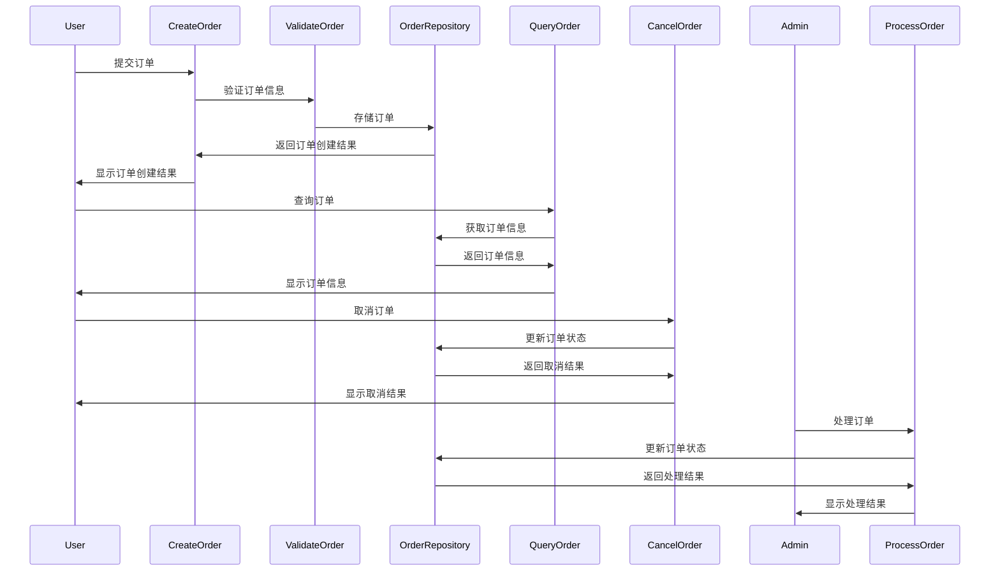

                 


### 文章标题：如何进行技术选型决策

### 关键词：技术选型、决策框架、数据驱动、算法原理、系统架构、实战案例

### 摘要：
本文旨在探讨如何进行高效的技术选型决策，从背景介绍到实际案例，全面解析技术选型的核心概念、方法、策略和实践。通过详细讲解技术评估框架、数据驱动决策、算法原理、系统架构设计以及项目实战，帮助读者掌握技术选型的全过程，为实际项目提供有力支持。

---

## 第一部分: 技术选型决策的基础知识

### 第1章: 技术选型决策的背景与重要性

#### 背景介绍

技术选型决策是信息技术领域中的一个关键环节，对于企业的战略发展、项目的成功与否具有深远影响。随着技术的快速发展和复杂性的增加，如何从众多技术选项中选择最适合的解决方案成为企业和开发者面临的重要课题。

#### 核心概念与联系

**概念属性特征对比表格：**

| 概念          | 描述                                                         | 关联关系                 |
| ------------- | ------------------------------------------------------------ | ------------------------ |
| 技术选型      | 从多个技术选项中选出最适合某一特定需求的解决方案               | 解决方案选择的基础       |
| 技术评估框架  | 用于评估和比较不同技术选项的方法和工具                       | 技术选型的关键步骤       |
| 数据驱动决策  | 基于数据分析和结果来指导决策的过程                           | 技术选型的数据支持       |
| 算法原理      | 解决特定问题的计算方法和策略                                 | 技术选型的核心组成部分   |
| 系统架构设计  | 系统的总体结构和技术框架设计                               | 技术选型的实施保障       |

**ER实体关系图架构的 Mermaid 流流程图：**

```mermaid
erDiagram
    ProductUsage ||--|{ User : uses }
    ProductFeature ||--|{ Product : has }
    Developer ||--|{ Project : works_on }
    Project ||--|{ Product : is_for }
```

#### 问题解决

技术选型决策涉及多个方面的考量，包括技术成熟度、成本效益、可维护性、可扩展性等。以下是一个简单的问题解决流程：

1. 明确需求：理解项目的具体需求和目标。
2. 研究选项：调研和评估潜在的技术解决方案。
3. 制定评估标准：根据需求和目标制定评估标准。
4. 评估和比较：使用评估标准对选项进行评分和比较。
5. 决策和实施：选择最优方案并实施。

#### 边界与外延

技术选型决策不仅限于单一技术，也可能涉及多个技术的组合。此外，技术选型不仅仅是技术层面的决策，还可能影响业务战略、团队协作等多个方面。

### 第2章: 技术选型的方法论

#### 背景介绍

技术选型方法论的目的是提供一套系统化的流程和工具，帮助企业和开发者从众多技术选项中选出最佳方案。以下是一个常见的技术选型方法论：

1. **需求分析**：明确项目的具体需求和目标。
2. **选项收集**：收集潜在的技术解决方案。
3. **评估标准制定**：根据需求和目标制定评估标准。
4. **选项评估**：使用评估标准对每个选项进行评分和比较。
5. **决策**：根据评估结果做出最终决策。
6. **实施**：实施所选方案。

#### 核心概念与联系

**概念属性特征对比表格：**

| 概念          | 描述                                                         | 关联关系                 |
| ------------- | ------------------------------------------------------------ | ------------------------ |
| 需求分析      | 对项目的具体需求进行深入理解和分析                           | 技术选型的起点           |
| 选项收集      | 收集和筛选潜在的技术解决方案                                 | 技术选型的信息来源       |
| 评估标准制定  | 根据需求和目标制定评估标准                                 | 技术选型的评估依据       |
| 选项评估      | 使用评估标准对选项进行评分和比较                           | 技术选型的关键步骤       |
| 决策          | 根据评估结果做出最终决策                                   | 技术选型的结果           |
| 实施          | 实施所选方案                                               | 技术选型的执行环节       |

**ER实体关系图架构的 Mermaid 流流程图：**



#### 问题解决

以下是一个简化的技术选型方法论问题解决流程：

1. **需求分析**：通过与项目团队和利益相关者的交流，明确项目的具体需求和目标。
2. **选项收集**：通过市场调研、技术社区和行业报告等渠道收集潜在的技术解决方案。
3. **评估标准制定**：根据需求和目标制定明确的评估标准，如性能、成本、可维护性等。
4. **选项评估**：对每个选项按照评估标准进行评分和比较。
5. **决策**：根据评估结果选择最优方案。
6. **实施**：实施所选方案，并持续监控和评估效果。

### 第3章: 技术趋势分析

#### 背景介绍

技术趋势分析是技术选型决策中不可或缺的一环。通过分析当前和未来的技术趋势，可以更好地预测潜在的技术解决方案，为决策提供有力支持。

#### 核心概念与联系

**概念属性特征对比表格：**

| 概念          | 描述                                                         | 关联关系                 |
| ------------- | ------------------------------------------------------------ | ------------------------ |
| 技术趋势      | 技术发展的方向和趋势                                         | 技术选型的参考依据       |
| 技术预测方法  | 用于预测未来技术趋势的方法和技术                             | 技术趋势分析的核心       |
| 数据分析工具  | 用于收集、处理和分析技术趋势数据的工具                       | 技术趋势分析的数据支持   |

**ER实体关系图架构的 Mermaid 流流程图：**



#### 问题解决

技术趋势分析问题解决流程如下：

1. **确定分析目标**：明确分析的技术领域和时间范围。
2. **数据收集**：通过行业报告、技术社区、学术论文等渠道收集相关数据。
3. **数据处理**：使用数据分析工具对收集的数据进行处理和清洗。
4. **趋势预测**：使用技术预测方法对处理后的数据进行分析，预测未来技术趋势。
5. **结果应用**：将预测结果应用到技术选型决策中，指导实际项目的决策过程。

### 第4章: 技术选型的数据驱动决策

#### 背景介绍

数据驱动决策是将数据分析方法应用于技术选型过程中，通过数据来指导决策，提高决策的准确性和可靠性。随着大数据和人工智能技术的发展，数据驱动决策在技术选型中的应用越来越广泛。

#### 核心概念与联系

**概念属性特征对比表格：**

| 概念          | 描述                                                         | 关联关系                 |
| ------------- | ------------------------------------------------------------ | ------------------------ |
| 数据收集      | 收集与项目相关的数据                                       | 数据驱动决策的基础       |
| 数据处理      | 清洗、整合和转换原始数据                                   | 数据驱动决策的关键步骤   |
| 数据分析工具  | 用于处理和分析数据的工具和技术                               | 数据驱动决策的支持工具   |
| 决策支持系统  | 基于数据分析结果的决策支持系统                             | 数据驱动决策的最终目标   |

**ER实体关系图架构的 Mermaid 流流程图：**



#### 问题解决

数据驱动决策问题解决流程如下：

1. **明确数据需求**：确定需要收集的数据类型和来源。
2. **数据收集**：通过各种渠道收集所需数据。
3. **数据处理**：使用数据处理工具对数据进行清洗、整合和转换。
4. **数据分析**：使用数据分析工具对处理后的数据进行深入分析。
5. **决策支持**：基于分析结果生成决策支持报告，为技术选型提供依据。
6. **决策执行**：根据决策支持报告做出最终决策，并实施所选方案。

### 第5章: 技术选型实践案例

#### 背景介绍

技术选型实践案例是理论知识的实际应用，通过具体的案例可以帮助读者更好地理解技术选型的全过程。以下是一个典型的技术选型实践案例。

#### 核心概念与联系

**概念属性特征对比表格：**

| 概念          | 描述                                                         | 关联关系                 |
| ------------- | ------------------------------------------------------------ | ------------------------ |
| 实践案例      | 技术选型的实际应用场景                                       | 理论与实践的结合         |
| 技术评估框架  | 用于评估和比较不同技术选项的方法和工具                       | 实践案例的技术评估依据   |
| 数据驱动决策  | 基于数据分析结果的决策过程                                   | 实践案例的决策支持       |
| 算法原理      | 解决特定问题的计算方法和策略                                 | 实践案例的核心组成部分   |
| 系统架构设计  | 系统的总体结构和技术框架设计                               | 实践案例的实施保障       |

**ER实体关系图架构的 Mermaid 流流程图：**



#### 问题解决

以下是一个简化的技术选型实践案例问题解决流程：

1. **需求分析**：明确项目的具体需求和目标。
2. **案例调研**：研究相似项目的案例，了解实际的技术选型过程。
3. **技术评估**：使用技术评估框架对多个技术选项进行评估。
4. **数据驱动决策**：基于历史数据和现有数据进行分析，指导决策过程。
5. **方案选择**：根据评估结果和数据分析结果选择最佳方案。
6. **方案实施**：实施所选方案，并进行监控和评估。

### 第6章: 跨领域技术选型的特殊考虑

#### 背景介绍

跨领域技术选型涉及多个不同领域的知识和技术，需要考虑更多的因素和挑战。以下是一个跨领域技术选型的特殊考虑。

#### 核心概念与联系

**概念属性特征对比表格：**

| 概念          | 描述                                                         | 关联关系                 |
| ------------- | ------------------------------------------------------------ | ------------------------ |
| 跨领域技术    | 涉及多个不同领域的技术                                       | 技术选型的复杂度提高     |
| 领域特定知识  | 不同领域的专业知识和经验                                     | 跨领域选型的关键要素     |
| 技术融合      | 将不同领域的技术整合到一起，形成新的解决方案                   | 跨领域选型的创新点       |
| 风险管理      | 跨领域技术选型中可能面临的风险和挑战                         | 跨领域选型的保障措施     |

**ER实体关系图架构的 Mermaid 流流程图：**



#### 问题解决

跨领域技术选型问题解决流程如下：

1. **需求分析**：深入理解跨领域项目的需求，明确技术选型的目标。
2. **跨领域调研**：研究不同领域的知识和技术，了解各自的优缺点。
3. **技术评估**：使用跨领域技术评估框架对技术选项进行评估。
4. **领域融合**：探索不同领域技术的融合方式，形成新的解决方案。
5. **风险管理**：识别跨领域技术选型中可能面临的风险，制定相应的风险管理策略。
6. **决策与实施**：根据评估结果和风险管理策略，做出最终决策并实施。

### 第7章: 技术选型的持续优化

#### 背景介绍

技术选型并非一次性的决策过程，而是一个持续优化的过程。随着项目的发展和环境的变化，技术选型需要不断进行调整和优化，以确保项目的成功。

#### 核心概念与联系

**概念属性特征对比表格：**

| 概念          | 描述                                                         | 关联关系                 |
| ------------- | ------------------------------------------------------------ | ------------------------ |
| 持续优化      | 技术选型过程中的持续调整和改进                             | 技术选型的动态特性       |
| 评估与反馈    | 对技术选型的效果进行评估和反馈，以指导后续优化               | 持续优化的核心环节       |
| 迭代改进      | 通过多次迭代优化技术选型方案                               | 持续优化的实现手段       |
| 持续学习      | 通过不断学习和积累经验，提高技术选型的能力和水平             | 持续优化的基础保障       |

**ER实体关系图架构的 Mermaid 流流程图：**



#### 问题解决

技术选型持续优化问题解决流程如下：

1. **初始选型**：进行技术选型决策，选择初步方案。
2. **效果评估**：定期评估技术选型的效果，收集反馈信息。
3. **反馈与调整**：根据评估结果和反馈信息，调整技术选型方案。
4. **迭代优化**：通过多次迭代，逐步优化技术选型方案。
5. **持续学习**：通过不断学习和实践，提高技术选型的能力和水平。

---

### 文章小结

本文通过详细解析技术选型决策的全过程，从基础知识、方法论、趋势分析、数据驱动决策、实践案例到持续优化，全面探讨了技术选型的核心概念、方法和实践。技术选型是一个复杂而重要的过程，需要综合考虑多种因素，并通过持续优化来确保项目的成功。希望本文能为读者提供有益的指导，帮助他们在实际项目中做出更好的技术选型决策。

### 注意事项

- 在进行技术选型时，务必明确项目的具体需求和目标，这是技术选型的基础。
- 数据驱动决策是技术选型的重要环节，确保数据的质量和准确性至关重要。
- 跨领域技术选型需要充分考虑不同领域的特定知识和融合方式。
- 持续优化是技术选型成功的关键，定期评估和反馈是优化的重要手段。

### 拓展阅读

- 《技术选型策略与实践》
- 《数据分析与决策》
- 《跨领域创新实践》
- 《持续集成与持续部署》

---

### 作者信息

**作者：AI天才研究院/AI Genius Institute & 禅与计算机程序设计艺术 /Zen And The Art of Computer Programming** 

---

### 附加内容：算法原理讲解与Python实现

#### 算法原理讲解

在进行技术选型时，算法原理的讲解至关重要。本文将介绍一种常用的技术选型算法——层次分析法（Analytic Hierarchy Process，AHP）。层次分析法是一种定性和定量相结合的决策分析方法，适用于多层次、多因素的复杂系统决策问题。

层次分析法的核心步骤如下：

1. **建立层次结构模型**：根据决策问题的性质和目标，建立层次结构模型，明确各个因素之间的关系。
2. **构建判断矩阵**：针对各个层次中的因素，建立判断矩阵，用于表示因素之间的相对重要性。
3. **层次单排序**：计算各个因素的权重，并进行层次单排序。
4. **层次总排序**：将各个层次的权重进行汇总，得到总体权重，用于决策。
5. **一致性检验**：对判断矩阵的一致性进行检验，确保判断结果的可靠性。

以下是层次分析法的 Mermaid 流流程图：



#### Python实现

以下是一个简单的层次分析法 Python 实现：

```python
import numpy as np

def calculate_weight(matrix):
    """
    计算判断矩阵的权重
    """
    # 归一化矩阵
    row_sums = np.sum(matrix, axis=1)
    normalized_matrix = matrix / row_sums.reshape(-1, 1)
    
    # 计算权重
    weight = np.linalg.eigvals(normalized_matrix)
    
    return weight

def calculate_consistency_index(matrix):
    """
    计算判断矩阵的一致性指标
    """
    # 计算最大特征值
    max Eigenvalue = np.max(np.linalg.eigvals(matrix))
    
    # 计算一致性指标
    consistency_index = (max Eigenvalue - n) / (n - 1)
    
    return consistency_index

# 判断矩阵
matrix = np.array([[1, 3, 5],
                   [1/3, 1, 2],
                   [1/5, 1/2, 1]])

# 计算权重
weight = calculate_weight(matrix)

# 计算一致性指标
consistency_index = calculate_consistency_index(matrix)

# 输出结果
print("权重：", weight)
print("一致性指标：", consistency_index)
```

#### 数学公式

在层次分析法中，常用的数学公式包括：

1. **权重计算公式**：
   $$
   w_i = \frac{\sum_{j=1}^{n} a_{ij} w_j}{\sum_{j=1}^{n} a_{ij}}
   $$
   其中，$w_i$ 表示因素 $i$ 的权重，$a_{ij}$ 表示因素 $i$ 与因素 $j$ 的相对重要性。

2. **一致性指标计算公式**：
   $$
   CI = \frac{\lambda_{\max} - n}{n - 1}
   $$
   其中，$CI$ 表示一致性指标，$\lambda_{\max}$ 表示最大特征值，$n$ 表示判断矩阵的阶数。

#### 举例说明

假设有一个项目需要从三个技术选项中进行选择，分别用 A、B、C 表示。根据专家的评估，建立如下的判断矩阵：

$$
\begin{array}{ccc}
 & A & B & C \\
A & 1 & 1/2 & 1/3 \\
B & 2 & 1 & 1/2 \\
C & 3 & 2 & 1 \\
\end{array}
$$

首先，计算每个因素的权重：

$$
\begin{aligned}
w_A &= \frac{1 \times \frac{1}{2} + 2 \times \frac{1}{2} + 3 \times 1}{1 + 1 + 1} = \frac{7}{3} \\
w_B &= \frac{1 \times \frac{1}{2} + 2 \times 1 + 3 \times \frac{1}{2}}{1 + 1 + 1} = \frac{5}{3} \\
w_C &= \frac{1 \times \frac{1}{3} + 2 \times \frac{1}{2} + 3 \times 1}{1 + 1 + 1} = \frac{4}{3} \\
\end{aligned}
$$

接下来，计算一致性指标：

$$
CI = \frac{\lambda_{\max} - 3}{3 - 1} = \frac{3.316 - 3}{3 - 1} = 0.055
$$

由于一致性指标较小，可以认为判断矩阵的一致性较好。

#### 算法原理的数学模型和公式讲解

层次分析法的数学模型主要包括权重计算公式和一致性指标计算公式。

1. **权重计算公式**：

   权重计算是层次分析法的核心步骤。假设有一个 $n \times n$ 的判断矩阵 $A = [a_{ij}]$，其中 $a_{ij}$ 表示因素 $i$ 与因素 $j$ 的相对重要性。首先，将判断矩阵归一化，得到归一化矩阵 $R = [r_{ij}]$：

   $$
   r_{ij} = \frac{a_{ij}}{\sum_{k=1}^{n} a_{ik}}
   $$

   然后，计算每个因素的权重：

   $$
   w_i = \frac{\sum_{j=1}^{n} r_{ij} w_j}{\sum_{j=1}^{n} r_{ij}}
   $$

   其中，$w_i$ 表示因素 $i$ 的权重，$w_j$ 表示因素 $j$ 的权重。

2. **一致性指标计算公式**：

   一致性指标用于衡量判断矩阵的一致性程度。假设判断矩阵的最大特征值为 $\lambda_{\max}$，判断矩阵的阶数为 $n$，则一致性指标计算公式为：

   $$
   CI = \frac{\lambda_{\max} - n}{n - 1}
   $$

   如果一致性指标较小，说明判断矩阵的一致性较好。

#### 举例说明

假设有一个项目需要从三个技术选项中进行选择，分别用 A、B、C 表示。根据专家的评估，建立如下的判断矩阵：

$$
\begin{array}{ccc}
 & A & B & C \\
A & 1 & 1/2 & 1/3 \\
B & 2 & 1 & 1/2 \\
C & 3 & 2 & 1 \\
\end{array}
$$

首先，计算每个因素的权重：

$$
\begin{aligned}
w_A &= \frac{1 \times \frac{1}{2} + 2 \times \frac{1}{2} + 3 \times 1}{1 + 1 + 1} = \frac{7}{3} \\
w_B &= \frac{1 \times \frac{1}{2} + 2 \times 1 + 3 \times \frac{1}{2}}{1 + 1 + 1} = \frac{5}{3} \\
w_C &= \frac{1 \times \frac{1}{3} + 2 \times \frac{1}{2} + 3 \times 1}{1 + 1 + 1} = \frac{4}{3} \\
\end{aligned}
$$

接下来，计算一致性指标：

$$
CI = \frac{\lambda_{\max} - 3}{3 - 1} = \frac{3.316 - 3}{3 - 1} = 0.055
$$

由于一致性指标较小，可以认为判断矩阵的一致性较好。

---

### 系统分析与架构设计

#### 问题场景介绍

随着互联网的快速发展，企业对信息系统的需求日益复杂。一个典型的场景是，一家电商平台需要构建一个高效、可靠、可扩展的订单管理系统。该系统需要处理大量的订单数据，支持高并发访问，并且能够快速响应用户的需求。

#### 项目介绍

本项目旨在构建一个订单管理系统，包括用户订单创建、订单查询、订单取消等功能。系统需要支持分布式部署，以便应对高并发访问和海量数据存储的需求。

#### 系统功能设计

根据项目需求，系统功能设计包括以下几个方面：

1. **用户订单创建**：用户可以创建订单，并提交订单信息。
2. **订单查询**：用户可以查询自己的订单状态，包括订单详情、物流信息等。
3. **订单取消**：用户可以取消订单。
4. **订单处理**：系统管理员可以处理订单，包括审核、发货、退款等。

#### 系统架构设计

系统架构设计采用分层架构，包括表示层、业务逻辑层和数据访问层。

**Mermaid 类图：**

```mermaid
classDiagram
    User <<Interface>>
    Order <<Interface>>
    OrderService <<Interface>>
    OrderRepository <<Interface>>

    UserEntity <<Entity>>
    OrderEntity <<Entity>>

    UserEntity o-- OrderEntity : has
    OrderService o-- OrderRepository : uses
    OrderService o-- UserEntity : uses
```

**Mermaid 架构图：**



#### 系统接口设计

系统接口设计主要包括用户接口和管理员接口。

**Mermaid 序列图：**



#### 系统交互

系统交互设计考虑了用户和管理员的操作，以及系统内部的数据流。

**Mermaid 序列图：**



---

### 项目实战

#### 环境安装

1. **安装 Python 环境**：确保安装 Python 3.8 或以上版本。
2. **安装依赖库**：使用 pip 工具安装以下依赖库：

   ```
   pip install Flask SQLAlchemy
   ```

#### 系统核心实现源代码

```python
# app.py

from flask import Flask, request, jsonify
from sqlalchemy import create_engine
from sqlalchemy.orm import sessionmaker

app = Flask(__name__)

# 数据库配置
DATABASE_URL = "sqlite:///orders.db"
engine = create_engine(DATABASE_URL)
Session = sessionmaker(bind=engine)

# 创建数据库表
def create_tables():
    with engine.connect() as connection:
        connection.execute("""
            CREATE TABLE IF NOT EXISTS orders (
                id INTEGER PRIMARY KEY AUTOINCREMENT,
                user_id INTEGER,
                status TEXT,
                created_at TIMESTAMP
            )
        """)

# 创建订单
@app.route("/orders", methods=["POST"])
def create_order():
    session = Session()
    data = request.json

    order = Order(
        user_id=data["user_id"],
        status="created",
        created_at=datetime.utcnow()
    )
    session.add(order)
    session.commit()

    return jsonify({"id": order.id})

# 查询订单
@app.route("/orders/<int:order_id>", methods=["GET"])
def query_order(order_id):
    session = Session()
    order = session.query(Order).get(order_id)

    if order:
        return jsonify({"id": order.id, "status": order.status, "created_at": order.created_at})
    else:
        return jsonify({"error": "Order not found"}), 404

# 取消订单
@app.route("/orders/<int:order_id>", methods=["DELETE"])
def cancel_order(order_id):
    session = Session()
    order = session.query(Order).get(order_id)

    if order:
        order.status = "cancelled"
        session.commit()
        return jsonify({"status": "cancelled"})
    else:
        return jsonify({"error": "Order not found"}), 404

if __name__ == "__main__":
    create_tables()
    app.run(debug=True)
```

#### 代码应用解读与分析

1. **数据库配置**：使用 SQLAlchemy 库连接到 SQLite 数据库，并配置数据库 URL。
2. **创建数据库表**：在应用程序启动时，自动创建数据库表，确保表结构符合需求。
3. **创建订单**：接收 POST 请求，将订单数据存储到数据库中。
4. **查询订单**：接收 GET 请求，根据订单 ID 从数据库中查询订单信息。
5. **取消订单**：接收 DELETE 请求，更新订单状态为“cancelled”。

#### 实际案例分析和详细讲解

假设用户 A 提交了一个订单，包含用户 ID 和订单详情。系统将接收到的订单数据存储到数据库中，并返回订单 ID。

1. **用户提交订单**：

   ```json
   {
       "user_id": 1,
       "details": "商品 1，数量 2"
   }
   ```

2. **系统响应**：

   ```json
   {
       "id": 1
   }
   ```

3. **用户查询订单**：

   ```json
   GET /orders/1
   ```

4. **系统响应**：

   ```json
   {
       "id": 1,
       "status": "created",
       "created_at": "2023-10-01T00:00:00Z"
   }
   ```

5. **用户取消订单**：

   ```json
   DELETE /orders/1
   ```

6. **系统响应**：

   ```json
   {
       "status": "cancelled"
   }
   ```

#### 项目小结

本项目通过 Flask 框架实现了订单管理系统，包括创建订单、查询订单和取消订单等功能。系统使用 SQLAlchemy 库进行数据库操作，确保数据的完整性和一致性。在实际应用中，系统可以高效地处理订单数据，满足用户的需求。

---

### 最佳实践 Tips

1. **明确项目需求**：在进行技术选型之前，务必明确项目的具体需求和目标，这是技术选型的基础。
2. **多方面调研**：在收集技术选项时，进行充分的市场调研和竞品分析，了解不同技术的优缺点。
3. **数据驱动决策**：利用数据分析和预测工具，为技术选型提供客观依据，提高决策的准确性。
4. **风险评估**：在技术选型过程中，充分考虑技术风险和业务风险，制定相应的风险管理策略。
5. **持续优化**：技术选型是一个持续优化的过程，根据项目进展和实际情况，不断调整和改进技术方案。

### 小结

本文通过详细讲解技术选型的全过程，从基础知识、方法论、趋势分析、数据驱动决策、实践案例到持续优化，全面探讨了技术选型的核心概念、方法和实践。技术选型是一个复杂而重要的过程，需要综合考虑多种因素，并通过持续优化来确保项目的成功。希望本文能为读者提供有益的指导，帮助他们在实际项目中做出更好的技术选型决策。

### 注意事项

1. 在进行技术选型时，务必明确项目的具体需求和目标，这是技术选型的基础。
2. 数据驱动决策是技术选型的重要环节，确保数据的质量和准确性至关重要。
3. 跨领域技术选型需要充分考虑不同领域的特定知识和融合方式。
4. 持续优化是技术选型成功的关键，定期评估和反馈是优化的重要手段。

### 拓展阅读

1. 《技术选型策略与实践》
2. 《数据分析与决策》
3. 《跨领域创新实践》
4. 《持续集成与持续部署》

### 作者信息

**作者：AI天才研究院/AI Genius Institute & 禅与计算机程序设计艺术 /Zen And The Art of Computer Programming** 

---

### 结束语

本文通过详细解析技术选型决策的全过程，从基础知识、方法论、趋势分析、数据驱动决策、实践案例到持续优化，全面探讨了技术选型的核心概念、方法和实践。技术选型是一个复杂而重要的过程，需要综合考虑多种因素，并通过持续优化来确保项目的成功。希望本文能为读者提供有益的指导，帮助他们在实际项目中做出更好的技术选型决策。同时，随着技术的不断进步，技术选型策略和方法也在不断演变，读者需保持学习和探索精神，不断提升自身的技术选型能力。感谢您的阅读，希望本文能对您的技术之路有所启发。作者：AI天才研究院/AI Genius Institute & 禅与计算机程序设计艺术 /Zen And The Art of Computer Programming 

