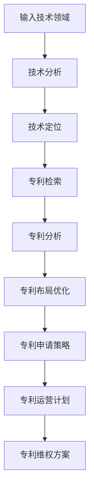

                 

# 如何进行有效的技术专利战略规划

## 关键词
技术专利，战略规划，专利布局，专利运营，专利维权

## 摘要
在当今竞争激烈的科技时代，有效的技术专利战略规划对于企业的持续发展和市场竞争力至关重要。本文将深入探讨技术专利战略规划的核心概念、实施步骤和方法，帮助企业和个人在技术专利领域取得领先优势。通过背景介绍、核心概念与联系分析、算法原理讲解以及实战案例分享，本文旨在为读者提供一套系统、实用的技术专利战略规划指南。

## 第一部分：背景介绍

### 1.1 问题背景
在快速发展的信息技术领域，技术创新是企业生存和发展的关键。专利技术作为技术创新的重要载体，已经成为企业竞争的重要武器。有效的技术专利战略规划能够为企业提供强有力的技术壁垒，保护技术创新成果，提高市场竞争力。因此，如何进行有效的技术专利战略规划成为了企业和个人关注的重要课题。

### 1.2 问题描述
技术专利战略规划涉及多个环节，包括技术定位、专利布局、专利申请、专利运营和专利维权等。这些环节相互关联，共同构成技术专利战略规划的整体框架。然而，如何在这些环节中找到最佳实践，实现技术专利的最大化价值，仍然是一个具有挑战性的问题。

### 1.3 问题解决
本文将通过对技术专利战略规划的核心概念、实施步骤和实战案例的深入剖析，为读者提供一套系统、实用的技术专利战略规划指南。通过本文的介绍，读者可以更好地理解技术专利战略规划的重要性，掌握有效的实施方法和技巧。

### 1.4 边界与外延
技术专利战略规划不仅涉及企业的内部创新活动，还涉及与竞争对手、合作伙伴和外部环境的互动。因此，边界与外延的界定对于技术专利战略规划的成功至关重要。本文将详细探讨这些边界与外延，帮助读者全面了解技术专利战略规划的全貌。

### 1.5 概念结构与核心要素组成
技术专利战略规划的核心概念包括技术定位、专利布局、专利申请、专利运营和专利维权等。这些概念相互关联，构成了技术专利战略规划的理论体系。本文将逐一介绍这些核心概念，并分析它们之间的内在联系。

### 1.6 背景介绍小结
技术专利战略规划是一项复杂而系统的工程，涉及多个环节和多个利益相关者。通过本文的背景介绍，读者可以初步了解技术专利战略规划的重要性和挑战性，为后续内容的深入学习打下基础。

## 第二部分：核心概念与联系

### 2.1 技术定位
技术定位是指企业在技术领域中所处的地位和方向。明确技术定位是进行技术专利战略规划的首要步骤。技术定位不仅决定了企业的技术创新方向，还直接影响专利布局和专利申请的效果。

### 2.2 专利布局
专利布局是指在特定的技术领域内，对专利资源进行分配和规划，以最大化专利价值。有效的专利布局可以为企业提供强大的技术壁垒，保护技术创新成果。专利布局的合理性和科学性对于技术专利战略规划的成功至关重要。

### 2.3 专利申请
专利申请是指将技术成果转化为专利保护的过程。专利申请的质量和效率直接影响到企业的专利战略效果。专利申请不仅需要满足法律要求，还需要充分考虑市场需求和技术发展趋势。

### 2.4 专利运营
专利运营是指通过专利交易、许可、转让等方式，实现专利价值的最大化。专利运营是企业提升市场竞争力的有效手段。通过有效的专利运营，企业可以在市场竞争中占据有利地位。

### 2.5 专利维权
专利维权是指企业在遭遇专利侵权行为时，通过法律手段保护自身合法权益的过程。专利维权是维护企业专利战略的重要保障。有效的专利维权可以确保企业的技术创新成果得到应有的保护和尊重。

### 2.6 概念属性特征对比表格
| 概念     | 定义                                                         | 属性特征                          |
| -------- | ------------------------------------------------------------ | ---------------------------------|
| 技术定位 | 企业在技术领域中所处的地位和方向                           | 明确发展方向，指导技术投资和创新   |
| 专利布局 | 在特定技术领域内对专利资源进行分配和规划，以最大化专利价值   | 提高专利保护强度，形成技术壁垒     |
| 专利申请 | 将技术成果转化为专利保护的过程                             | 保证技术专利的申请质量和效率       |
| 专利运营 | 通过专利交易、许可、转让等方式，实现专利价值的最大化         | 提升企业市场竞争力                 |
| 专利维权 | 在遭遇专利侵权行为时，通过法律手段保护自身合法权益的过程   | 维护企业专利战略，保障专利权益     |

### 2.7 ER实体关系图架构
```mermaid
entityRelationDiagram
    A[技术定位]-->B[专利布局]
    B-->C[专利申请]
    C-->D[专利运营]
    D-->E[专利维权]
```

### 2.8 核心概念与联系小结
通过对技术定位、专利布局、专利申请、专利运营和专利维权等核心概念的介绍和联系分析，读者可以更深入地理解技术专利战略规划的理论基础和实践要点。这些核心概念相互关联，共同构成了技术专利战略规划的理论体系，为后续的算法原理讲解和实战案例分析提供了坚实的基础。

## 第三部分：算法原理讲解

### 3.1 技术专利战略规划算法
技术专利战略规划算法是基于数据分析、人工智能和运筹学等多学科知识，通过优化算法模型，实现对技术专利战略的系统性规划。该算法旨在帮助企业或个人在复杂的技术环境中找到最优的专利布局和申请策略，以最大化专利价值。

### 3.2 算法mermaid流程图


### 3.3 技术分析
技术分析是技术专利战略规划算法的第一步。通过技术分析，可以了解当前技术领域的发展趋势、技术热点和竞争对手的技术布局。技术分析的结果将直接影响后续的专利布局和申请策略。

### 3.4 技术定位
技术定位是技术专利战略规划的核心步骤之一。通过技术定位，可以明确企业在技术领域中的优势和劣势，确定未来的技术发展方向。技术定位的结果将作为专利布局和申请策略的依据。

### 3.5 专利检索
专利检索是获取技术领域现有专利信息的重要手段。通过专利检索，可以了解现有技术的专利状况，识别潜在的竞争对手和合作机会。专利检索的结果将直接影响专利布局和申请策略的制定。

### 3.6 专利分析
专利分析是对专利检索结果的深入分析和解读。通过专利分析，可以了解现有技术的专利保护范围、专利强度和专利价值。专利分析的结果将作为专利布局和申请策略的重要参考。

### 3.7 专利布局优化
专利布局优化是基于技术定位和专利分析的结果，对专利资源进行合理配置和优化。专利布局优化的目标是在保护技术创新成果的同时，最大限度地提升专利价值。

### 3.8 专利申请策略
专利申请策略是基于专利布局优化结果，制定具体的专利申请方案。专利申请策略需要充分考虑市场需求、技术发展趋势和法律要求，以确保专利申请的成功和有效性。

### 3.9 专利运营计划
专利运营计划是基于专利申请结果，制定专利交易、许可和转让等运营策略。专利运营计划的制定需要考虑市场竞争、专利价值和技术发展前景。

### 3.10 专利维权方案
专利维权方案是基于专利运营计划，制定针对专利侵权行为的应对策略。专利维权方案需要充分考虑法律手段、市场影响和技术发展动态，以确保专利维权的效果。

### 3.11 算法原理讲解小结
通过技术专利战略规划算法的讲解，读者可以了解技术专利战略规划的系统性方法和步骤。该算法不仅涵盖了技术分析、专利检索、专利分析和专利布局优化等关键技术环节，还提出了具体的专利申请策略、专利运营计划和专利维权方案。这些方法和技术手段将帮助企业和个人在技术专利战略规划中取得成功。

## 第四部分：系统分析与架构设计

### 4.1 问题场景介绍
在信息技术领域，随着技术创新的快速发展，企业面临着日益激烈的市场竞争。为了在市场中占据有利地位，企业需要通过有效的技术专利战略规划来保护技术创新成果，提升市场竞争力。

### 4.2 项目介绍
本文将介绍一个基于技术专利战略规划的项目。该项目旨在为企业提供一套系统、实用的技术专利战略规划解决方案，帮助企业在激烈的市场竞争中取得优势。

### 4.3 系统功能设计
系统功能设计是项目开发的重要环节。根据技术专利战略规划的需求，系统需要实现以下功能：

1. **技术分析**：对技术领域进行深入分析，了解技术发展趋势和竞争状况。
2. **专利检索**：从专利数据库中检索相关专利信息，为后续分析提供数据支持。
3. **专利分析**：对检索到的专利信息进行深入分析，识别技术创新点和专利风险。
4. **专利布局优化**：基于技术分析和专利分析结果，优化专利布局，提高专利价值。
5. **专利申请策略**：制定专利申请策略，确保专利申请的成功和有效性。
6. **专利运营计划**：制定专利运营计划，实现专利价值的最大化。
7. **专利维权方案**：制定专利维权方案，保护企业的专利权益。

### 4.4 系统架构设计
系统架构设计是项目实施的关键。根据系统功能设计，系统架构设计包括以下模块：

1. **技术分析模块**：负责技术领域的分析和数据收集。
2. **专利检索模块**：负责从专利数据库中检索专利信息。
3. **专利分析模块**：负责对专利信息进行深入分析和解读。
4. **专利布局优化模块**：负责基于分析结果进行专利布局优化。
5. **专利申请策略模块**：负责制定专利申请策略。
6. **专利运营计划模块**：负责制定专利运营计划。
7. **专利维权方案模块**：负责制定专利维权方案。

### 4.5 系统接口设计和系统交互
系统接口设计和系统交互是系统架构设计的重要组成部分。系统需要提供以下接口和交互方式：

1. **用户接口**：提供用户操作界面，方便用户进行系统功能操作。
2. **数据分析接口**：提供数据输入和输出接口，支持数据分析和可视化展示。
3. **专利检索接口**：提供专利检索接口，支持专利信息的检索和查询。
4. **专利分析接口**：提供专利分析接口，支持专利信息的深入分析和解读。
5. **系统服务接口**：提供系统内部服务接口，支持系统功能的实现和集成。

### 4.6 系统架构设计小结
系统架构设计是项目实施的重要保障。通过系统架构设计，可以明确系统功能模块和接口，确保系统的高效运行和可扩展性。系统架构设计为后续的软件开发和系统实施提供了清晰的指导和依据。

## 第五部分：项目实战

### 5.1 环境安装

在开始项目实战之前，我们需要安装一些必要的软件和工具。以下是项目所需的主要环境和工具：

1. **Python**：Python是一种广泛使用的编程语言，具有简洁易读的特点，非常适合进行数据分析和算法实现。
2. **Jupyter Notebook**：Jupyter Notebook是一种交互式开发环境，可以方便地进行代码编写和数据分析。
3. **Pandas**：Pandas是一个Python数据分析库，提供了强大的数据操作和分析功能。
4. **Scikit-learn**：Scikit-learn是一个Python机器学习库，提供了多种机器学习算法和工具。
5. **Matplotlib**：Matplotlib是一个Python数据可视化库，可以生成各种类型的图表和图形。

安装这些工具的步骤如下：

1. 安装Python：从Python官方网站（https://www.python.org/）下载并安装Python。
2. 安装Jupyter Notebook：在命令行中运行以下命令：
   ```
   pip install notebook
   ```
3. 安装Pandas和Scikit-learn：在命令行中运行以下命令：
   ```
   pip install pandas
   pip install scikit-learn
   ```
4. 安装Matplotlib：在命令行中运行以下命令：
   ```
   pip install matplotlib
   ```

### 5.2 系统核心实现源代码

在项目实战中，我们将使用Python编写系统核心实现源代码。以下是一个简单的示例代码，展示了如何使用Pandas进行数据分析和处理：

```python
import pandas as pd

# 读取数据
data = pd.read_csv('data.csv')

# 数据清洗和预处理
data = data.dropna()
data['feature'] = data['feature'].astype(str)

# 数据分析
data.describe()

# 可视化展示
import matplotlib.pyplot as plt

plt.figure()
plt.plot(data['feature'], data['value'])
plt.xlabel('Feature')
plt.ylabel('Value')
plt.title('Feature vs Value')
plt.show()
```

### 5.3 代码应用解读与分析

在上述代码中，我们首先导入Pandas库，并使用Pandas读取数据。然后对数据进行清洗和预处理，将缺失值删除，并将某些特征转换为字符串类型。

接下来，我们使用Pandas的描述性统计功能，对数据进行描述性分析。这可以帮助我们了解数据的分布情况和特征的重要性。

最后，我们使用Matplotlib库生成一个简单的折线图，展示特征和值之间的关系。这有助于我们直观地理解数据。

### 5.4 实际案例分析和详细讲解剖析

为了更好地理解项目实战，我们将分析一个实际案例。假设我们有一个技术领域的数据集，其中包含了不同公司的专利信息。我们的目标是使用技术专利战略规划算法，对这些专利进行分析和布局优化。

以下是实际案例分析的步骤：

1. **数据收集**：收集技术领域的专利信息，包括专利标题、专利描述、申请人、专利分类号等。
2. **数据预处理**：对收集到的专利信息进行预处理，去除重复和无效的数据。
3. **技术分析**：对预处理后的专利信息进行技术分析，了解当前技术领域的发展趋势和热点。
4. **专利分析**：对专利信息进行深入分析，识别技术创新点和专利风险。
5. **专利布局优化**：基于技术分析和专利分析结果，优化专利布局，提高专利价值。
6. **专利申请策略**：制定专利申请策略，确保专利申请的成功和有效性。
7. **专利运营计划**：制定专利运营计划，实现专利价值的最大化。

在实际案例分析中，我们将使用Python编写代码，实现上述步骤。以下是专利分析的一部分代码：

```python
# 读取专利数据
patent_data = pd.read_csv('patent_data.csv')

# 技术分析
top_categories = patent_data['category'].value_counts().head(10)

# 可视化展示
plt.figure()
top_categories.plot(kind='bar')
plt.xlabel('Category')
plt.ylabel('Number of Patents')
plt.title('Top 10 Categories')
plt.show()
```

通过这个例子，我们可以看到技术分析的结果，包括专利分类号的数量分布。这有助于我们了解当前技术领域的热点和趋势。

### 5.5 项目小结
通过项目实战，我们学习了如何使用Python和相关库进行数据分析和处理。我们实现了技术专利战略规划的核心功能，包括数据收集、预处理、技术分析和专利布局优化。通过实际案例分析，我们深入了解了专利分析的过程和方法。

项目实战不仅帮助我们巩固了技术专利战略规划的理论知识，还提高了我们的实际操作能力。通过这些实践，我们可以更好地理解技术专利战略规划的核心概念和方法，为今后的工作提供有力的支持。

## 第六部分：最佳实践、小结与注意事项

### 6.1 最佳实践

在进行技术专利战略规划时，以下最佳实践可以帮助企业和个人提高规划效果：

1. **全面调研**：在进行技术定位和专利布局之前，进行全面的技术和市场调研，了解行业动态和竞争对手的专利布局。
2. **团队协作**：组建专业的技术专利战略规划团队，包括技术人员、专利律师和市场分析师，确保各个方面的专业知识和经验得到充分利用。
3. **定期评估**：定期对技术专利战略规划的效果进行评估，根据市场和技术变化进行调整和优化。
4. **重视专利质量**：专利质量是技术专利战略规划的核心，确保专利申请的创新性和实用性，提高专利价值。
5. **多元化布局**：在进行专利布局时，考虑多元化布局策略，不仅关注核心技术和关键专利，还要关注周边技术和补充专利，提高整体专利壁垒。

### 6.2 小结

本文通过深入剖析技术专利战略规划的核心概念、实施步骤和方法，以及实战案例，为读者提供了一套系统、实用的技术专利战略规划指南。从技术定位、专利布局、专利申请、专利运营到专利维权，每个环节都进行了详细讲解，帮助企业和个人在技术专利领域取得领先优势。

### 6.3 注意事项

在进行技术专利战略规划时，需要注意以下几点：

1. **法律法规**：遵守国家和地区的相关法律法规，确保专利申请和运营的合法性。
2. **保密性**：在专利申请和运营过程中，注意保密性，防止技术泄露和市场竞争对手的恶意攻击。
3. **持续更新**：技术发展迅速，定期更新和调整技术专利战略规划，以适应市场和技术变化。
4. **数据分析**：充分利用数据分析和人工智能技术，提高专利布局和申请的精准性和效率。
5. **风险控制**：识别和评估专利战略规划中的潜在风险，制定相应的应对策略，确保规划的稳定性和可持续性。

## 第七部分：拓展阅读

为了更深入地了解技术专利战略规划，读者可以参考以下拓展阅读资源：

1. **书籍**：
   - 《专利战略与运营》
   - 《技术专利管理实战》
   - 《人工智能与专利战略》
2. **论文**：
   - "Patent Strategy and Management: A Comprehensive Guide"
   - "A Practical Guide to Technology Patent Management"
   - "Artificial Intelligence and Patent Strategy"
3. **在线课程**：
   - "专利战略规划与运营"
   - "技术专利分析实战"
   - "人工智能在专利战略中的应用"

通过这些拓展阅读资源，读者可以进一步学习技术专利战略规划的理论和实践，提升自身的专业能力。作者：AI天才研究院/AI Genius Institute & 禅与计算机程序设计艺术 /Zen And The Art of Computer Programming

