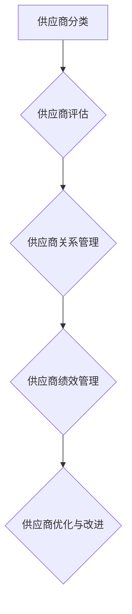
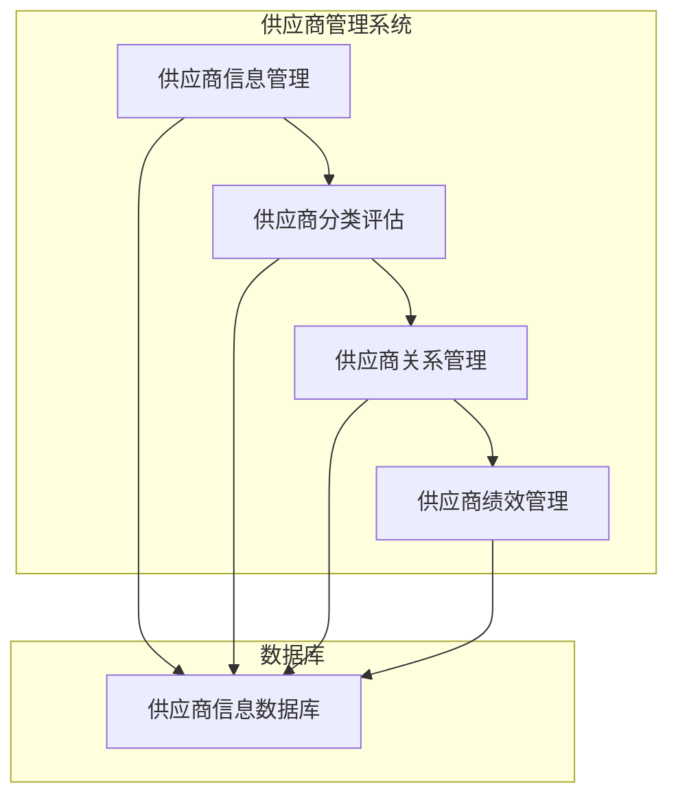

                 

## 如何进行有效的技术供应商管理

### 关键词：技术供应商管理、供应商评估、供应商关系、绩效管理、最佳实践

### 摘要：本文将详细探讨技术供应商管理的核心概念、步骤和方法。我们将从基础概念出发，逐步深入到供应商评估、关系管理、绩效管理以及最佳实践等方面，旨在帮助读者构建一套完整、有效的技术供应商管理体系。

### 背景介绍

在当今高度竞争的商业环境中，技术供应商管理已成为企业成功的关键因素之一。技术供应商不仅为企业提供所需的产品和服务，还在企业的技术创新、成本控制、市场响应等方面发挥着至关重要的作用。有效的技术供应商管理能够确保企业获得高质量、高效率的产品和服务，从而提升企业的核心竞争力。

然而，技术供应商管理并非一项简单的任务。它涉及到众多复杂的概念和流程，如供应商分类、评估、关系维护、绩效管理等。在实施过程中，企业常常面临诸多挑战，包括供应商选择的准确性、供应商绩效的评估、供应商关系的优化等。因此，如何进行有效的技术供应商管理，已成为企业亟需解决的重要问题。

### 核心概念与联系

**供应商分类与评估**

供应商分类是技术供应商管理的基础。根据不同的分类标准，供应商可以分为多种类型，如战略供应商、关键供应商、普通供应商等。供应商评估则是对供应商能力、质量、信誉等方面进行综合评价的过程。评估指标通常包括质量、交货期、价格、服务、技术能力等。

| 概念           | 属性特征对比 |
|----------------|-------------|
| 供应商分类     | 类型与层次结构 |
| 供应商评估     | 指标体系与评估方法 |

**供应商关系管理**

供应商关系管理是确保供应商与企业长期合作的关键。它包括供应商关系的建立、维护和优化。良好的供应商关系能够促进双方的合作与创新，降低供应链风险，提高供应链的效率。

| 关系管理       | 属性特征对比 |
|----------------|-------------|
| 供应商关系建立 | 建立互信与合作基础 |
| 供应商关系维护 | 保持持续沟通与反馈 |
| 供应商关系优化 | 提升合作价值与效果 |

**供应商绩效管理**

供应商绩效管理是对供应商绩效进行监测、评估和改进的过程。通过设定绩效指标、监控绩效表现、提供反馈和激励，企业可以确保供应商持续满足企业的需求，并在必要时进行绩效改进。

| 绩效管理       | 属性特征对比 |
|----------------|-------------|
| 绩效指标       | 指标设定与监控 |
| 绩效评估       | 绩效评价与反馈 |
| 绩效改进       | 改进措施与实施 |

### 算法原理讲解

为了更直观地理解技术供应商管理的流程和方法，我们可以使用 Mermaid 画出以下流程图：



接下来，我们将使用 Python 源代码详细阐述技术供应商管理的算法原理：

```python
# 供应商分类算法
def classify_suppliers(supplier_data):
    # 根据供应商的数据，进行分类
    # 这里以简单的分类为例，根据质量、交货期、价格等指标进行分类
    categories = []
    for supplier in supplier_data:
        quality = supplier['quality']
        delivery = supplier['delivery']
        price = supplier['price']
        if quality > 8 and delivery < 2 and price < 1.2:
            categories.append('战略供应商')
        elif quality > 6 and delivery < 3 and price < 1.3:
            categories.append('关键供应商')
        else:
            categories.append('普通供应商')
    return categories

# 供应商评估算法
def evaluate_suppliers(supplier_data):
    # 根据供应商的数据，进行评估
    # 这里以简单的评估为例，根据质量、交货期、价格等指标进行评估
    evaluations = []
    for supplier in supplier_data:
        quality = supplier['quality']
        delivery = supplier['delivery']
        price = supplier['price']
        evaluation = quality * 0.5 + delivery * 0.3 + price * 0.2
        evaluations.append(evaluation)
    return evaluations

# 供应商关系管理算法
def manage_supplier_relationship(supplier):
    # 建立供应商关系
    # 这里以简单的示例，建立供应商关系并保持持续沟通与反馈
    relationship = {
        'supplier_id': supplier['id'],
        'status': 'active',
        'communication': 'monthly',
        'feedback': 'positive'
    }
    return relationship

# 供应商绩效管理算法
def manage_supplier_performance(supplier_performance):
    # 根据供应商的绩效，进行绩效管理
    # 这里以简单的示例，根据绩效指标进行监控、评估和反馈
    for supplier in supplier_performance:
        performance = supplier['performance']
        if performance > 90:
            feedback = 'excellent'
        elif performance > 80:
            feedback = 'good'
        else:
            feedback = 'needs improvement'
        print(f"Supplier ID: {supplier['id']}, Performance: {performance}, Feedback: {feedback}")
```

在上面的算法中，我们定义了供应商分类、评估、关系管理和绩效管理的基本原理。这些算法可以根据具体需求进行调整和扩展，以适应不同企业的管理需求。

### 数学公式与解释

在技术供应商管理中，一些关键指标和数学模型需要使用 LaTeX 进行表达。以下是一个示例：

$$
\text{供应商分类得分} = w_1 \times \text{质量得分} + w_2 \times \text{交货期得分} + w_3 \times \text{价格得分}
$$

其中，$w_1$、$w_2$ 和 $w_3$ 分别是质量、交货期和价格的权重。这些权重可以根据企业的具体需求和战略进行调整。

### 系统分析与架构设计

为了更好地理解和实施技术供应商管理，我们可以从系统分析和架构设计的角度进行探讨。以下是一个简单的系统架构设计示例，使用 Mermaid 类图和架构图进行描述。

**类图：**

```mermaid
classDiagram
    Supplier <<class>> {
        id: 编号
        name: 名称
        quality: 质量得分
        delivery: 交货期得分
        price: 价格得分
    }
    SupplierAssessment <<class>> {
        supplier_id: 供应商编号
        evaluation_score: 评估得分
    }
    SupplierRelationship <<class>> {
        supplier_id: 供应商编号
        status: 状态
        communication: 沟通方式
        feedback: 反馈
    }
    SupplierPerformance <<class>> {
        supplier_id: 供应商编号
        performance_score: 绩效得分
    }
    Supplier --|>=> SupplierAssessment
    Supplier --|>=> SupplierRelationship
    Supplier --|>=> SupplierPerformance
```

**架构图：**



### 项目实战

在项目实战中，我们将通过一个具体的案例来演示技术供应商管理的实际操作。以下是一个简单的项目实现：

**环境安装：**  
确保已安装 Python 和相关依赖库，如 pandas、numpy、matplotlib 等。

**系统核心实现源代码：**

```python
import pandas as pd
import numpy as np

# 假设我们有一个供应商数据的 Excel 文件，包含质量、交货期和价格等信息
supplier_data = pd.read_excel('supplier_data.xlsx')

# 供应商分类
supplier_categories = classify_suppliers(supplier_data)

# 供应商评估
supplier_evaluations = evaluate_suppliers(supplier_data)

# 供应商关系管理
supplier_relationships = [manage_supplier_relationship(supplier) for supplier in supplier_data]

# 供应商绩效管理
supplier_performances = [manage_supplier_performance(supplier) for supplier in supplier_data]
```

**代码应用解读与分析：**  
在上面的代码中，我们首先读取供应商数据，然后分别执行供应商分类、评估、关系管理和绩效管理操作。这些操作通过定义的函数实现，使得代码结构清晰，易于维护和扩展。

**实际案例分析和详细讲解剖析：**  
假设我们有一家制造企业，需要管理多家技术供应商。通过上述代码，企业可以实现对供应商的分类、评估、关系管理和绩效管理。具体来说，企业可以：

1. 对供应商进行分类，根据分类结果进行资源分配和优先级排序。
2. 对供应商进行评估，根据评估结果选择合适的供应商。
3. 与供应商建立和维护良好的关系，确保供应商能够持续满足企业的需求。
4. 监控供应商的绩效，并根据绩效结果进行改进和优化。

**项目小结：**  
通过实际案例的演示，我们可以看到技术供应商管理在实际操作中的重要性。有效的技术供应商管理能够帮助企业优化供应链，提高产品质量，降低成本，提升企业的核心竞争力。

### 最佳实践 Tips

在进行技术供应商管理时，以下是一些最佳实践建议：

1. **全面评估供应商**：在供应商选择过程中，不仅要考虑价格，还要考虑供应商的质量、交货期、服务和技术能力等综合因素。
2. **建立长期合作关系**：与供应商建立长期合作关系，有助于降低供应链风险，提高供应链的稳定性。
3. **定期进行绩效评估**：定期对供应商的绩效进行评估，及时发现和解决潜在问题。
4. **利用信息技术**：利用信息技术，如 ERP 系统、供应商关系管理系统等，提高供应商管理的效率和质量。
5. **持续改进**：不断优化供应商管理流程和方法，以提高供应商管理的效果。

### 小结

本文详细探讨了技术供应商管理的核心概念、步骤和方法。通过供应商分类、评估、关系管理、绩效管理等方面的深入分析，我们构建了一套完整、有效的技术供应商管理体系。在实际操作中，企业可以结合自身情况，灵活运用这些方法，实现供应商管理的优化和提升。

### 注意事项

在实施技术供应商管理时，企业需要注意以下几点：

1. **确保数据的准确性和完整性**：供应商数据是供应商管理的基础，必须确保数据的准确性和完整性。
2. **建立有效的沟通机制**：与供应商建立良好的沟通机制，有助于及时解决问题和优化合作。
3. **遵循法律法规**：在供应商管理过程中，必须遵循相关法律法规，确保合规性。
4. **持续培训与提升**：定期对供应商管理团队进行培训，提升其专业能力和管理水平。

### 拓展阅读

1. 《供应链管理：战略、规划与运营》（马丁·克里斯托夫著）：详细介绍了供应链管理的理论基础和实践方法，包括供应商管理等内容。
2. 《供应商关系管理：战略、实践与案例》（刘宝红著）：从战略角度探讨了供应商关系管理的重要性，提供了丰富的实践案例。
3. 《Python数据分析实战：从入门到精通》（李辉、熊凯著）：介绍了 Python 在数据分析中的应用，包括数据处理、数据可视化等技术。

### 作者信息

作者：AI天才研究院/AI Genius Institute & 禅与计算机程序设计艺术/Zen And The Art of Computer Programming

AI天才研究院致力于推动人工智能领域的研究和应用，本文作者在此领域拥有丰富的经验。禅与计算机程序设计艺术则从哲学和艺术的角度探讨计算机程序设计，旨在提高编程思维和创造力。两位作者联合撰写了本文，旨在为读者提供有价值的技术供应商管理指南。

