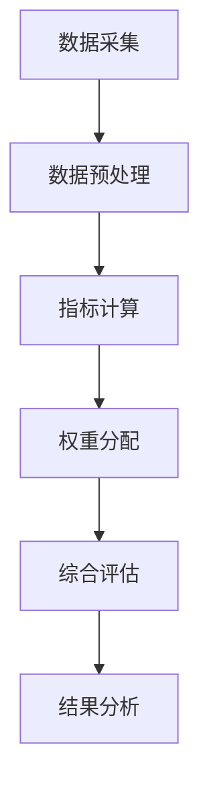

                 

# 如何进行有效的技术债务量化与管理

> 关键词：技术债务、量化管理、IT管理、软件工程、债务模型

> 摘要：随着软件项目的复杂度和规模的增加，技术债务问题日益凸显。本文旨在深入探讨技术债务的概念、形成原因、影响，以及量化与管理的有效方法。通过对技术债务量化模型的解析和实际应用案例分析，本文为IT团队提供了一套科学、系统的技术债务管理策略，以应对日益复杂的软件开发挑战。

## 目录大纲

### 第一部分：引言与背景

#### 第1章 问题背景与定义

1.1 技术债务的概念

1.2 技术债务的形成原因

1.3 技术债务的影响与危害

1.4 技术债务量化的必要性

#### 第2章 技术债务的核心概念与联系

2.1 技术债务的主要类型

2.2 技术债务的核心属性特征对比表格

2.3 技术债务的ER实体关系图

### 第二部分：技术债务量化方法

#### 第3章 技术债务量化模型原理

3.1 技术债务量化模型的构建

3.2 技术债务量化模型的参数设置

3.3 技术债务量化模型的算法流程

#### 第4章 技术债务量化模型详解

4.1 技术债务量化模型的数学模型和公式

4.2 技术债务量化模型的mermaid流程图

4.3 技术债务量化模型的python源代码

#### 第5章 技术债务量化模型的应用实例

5.1 案例背景

5.2 技术债务量化模型的实际应用

5.3 模型应用结果分析

#### 第6章 技术债务量化模型的优化与改进

6.1 技术债务量化模型的优化策略

6.2 技术债务量化模型的改进方法

6.3 优化与改进后的模型效果评估

### 第三部分：技术债务管理策略

#### 第7章 技术债务管理的原则与框架

7.1 技术债务管理的核心理念

7.2 技术债务管理的流程与方法

7.3 技术债务管理的工具与平台

#### 第8章 技术债务管理的最佳实践

8.1 成功案例分享

8.2 经验总结与启示

8.3 潜在挑战与应对策略

#### 第9章 技术债务管理的未来发展趋势

9.1 技术债务管理的创新方向

9.2 技术债务管理的市场前景

9.3 技术债务管理的未来挑战与机遇

#### 第10章 总结与展望

10.1 本书内容的总结回顾

10.2 技术债务量化与管理的重要意义

10.3 对未来的展望与建议

## 第一部分：引言与背景

### 第1章 问题背景与定义

#### 1.1 技术债务的概念

技术债务（Technical Debt）是一个源自软件工程领域的术语，其含义类似于财务领域的债务。在软件开发中，技术债务指的是因选择短期解决方式而遗留的长期问题，它可能会在未来导致项目成本增加、质量下降、维护困难等负面影响。技术债务可以分为以下几种类型：

1. **设计债务**：由于设计上的缺陷或不足，导致系统扩展性和可维护性下降。
2. **代码债务**：由于代码质量差、不规范或冗余，导致后续开发和维护难度增加。
3. **配置债务**：由于配置管理不当，导致系统环境不稳定、版本冲突等问题。
4. **技术债务**：因采用不合适的技术方案或工具，导致系统性能、安全性和可扩展性受限。

#### 1.2 技术债务的形成原因

技术债务的形成通常有以下原因：

1. **时间压力**：在项目时间紧迫的情况下，为了尽快交付，开发团队可能选择快速解决方法，而不是最优的解决方案。
2. **资源限制**：资源不足，如人力、资金或时间限制，迫使团队选择简化的方法来解决问题。
3. **技术选择**：技术选择不当或技术变迁频繁，导致系统架构不稳定。
4. **沟通不足**：团队成员之间的沟通不畅，可能导致技术债务的积累。

#### 1.3 技术债务的影响与危害

技术债务对软件开发的影响是深远和长期的：

1. **成本增加**：技术债务会导致项目维护成本增加，甚至可能超过初始开发成本。
2. **质量下降**：技术债务会降低软件质量，增加缺陷率。
3. **效率降低**：随着技术债务的积累，系统的可维护性和可扩展性下降，导致开发效率降低。
4. **团队士气下降**：技术债务会导致团队士气下降，影响团队合作。

#### 1.4 技术债务量化的必要性

量化技术债务有助于：

1. **识别问题**：通过量化，可以清晰地了解技术债务的规模和程度，从而采取相应措施。
2. **决策支持**：量化数据为管理层提供决策依据，以便在资源分配和项目优先级上做出更明智的选择。
3. **优化管理**：量化技术债务可以用于评估管理策略的有效性，指导改进。

因此，对技术债务进行量化与管理是软件开发过程中不可或缺的一环。接下来，我们将详细探讨技术债务的核心概念、量化方法及其管理策略。

### 第2章 技术债务的核心概念与联系

#### 2.1 技术债务的主要类型

技术债务可以分为多种类型，每种类型都有其特定的表现形式和影响。以下是对几种常见技术债务类型的介绍：

1. **设计债务**：设计债务通常是由于系统设计不合理或不足造成的。例如，系统结构混乱、模块划分不合理、依赖关系复杂等。这些问题可能导致系统难以扩展和维护。

2. **代码债务**：代码债务主要体现在代码质量上，包括代码冗余、重复、复杂度高等。这些问题会导致代码可读性差、可维护性低，进而影响项目的整体质量和开发效率。

3. **配置债务**：配置债务通常涉及系统配置文件的管理。例如，配置文件过于复杂、版本不统一、配置项过多等。这些问题可能导致系统运行不稳定，甚至导致系统崩溃。

4. **技术债务**：技术债务可能源于技术选择不当或技术变迁频繁。例如，使用过时的技术或频繁更换技术栈，这些都会影响系统的性能、安全性和可扩展性。

#### 2.2 技术债务的核心属性特征对比表格

为了更好地理解技术债务的不同类型，我们可以通过一个对比表格来展示它们的核心属性特征：

| 类型     | 定义                                                         | 核心属性特征                             | 影响                             |
|--------|------------------------------------------------------------|------------------------------------|--------------------------------|
| 设计债务 | 系统设计不合理或不足导致的债务                               | 结构混乱、模块划分不合理、依赖关系复杂 | 系统扩展性和可维护性下降         |
| 代码债务 | 代码质量差、不规范或冗余导致的债务                           | 代码冗余、重复、复杂度高             | 代码可读性差、可维护性低         |
| 配置债务 | 系统配置文件管理不当导致的债务                               | 配置文件复杂、版本不统一、配置项过多 | 系统运行不稳定、可能导致系统崩溃 |
| 技术债务 | 技术选择不当或技术变迁频繁导致的债务                         | 技术过时、频繁更换技术栈           | 系统性能、安全性和可扩展性受限   |

通过这个表格，我们可以更直观地了解不同类型的技术债务及其影响，从而更有针对性地进行管理和优化。

#### 2.3 技术债务的ER实体关系图

为了进一步理解技术债务之间的关联，我们可以通过ER（实体-关系）图来展示它们之间的关系。以下是一个简化的技术债务ER实体关系图：

```mermaid
erDiagram
    A[设计债务] ||--|{ 项目 } | B{ 代码债务 }
    A ||--|{ 配置债务 } C{ 技术债务 }
    B ||--|{ 项目 } D{ 维护成本 }
    B ||--|{ 质量下降 }
    C ||--|{ 性能下降 }
    C ||--|{ 安全性下降 }
```

在这个ER图中，设计债务、代码债务、配置债务和技术债务是主要的实体，它们通过不同的关系与项目、维护成本、质量下降、性能下降和安全下降等实体相连接。这个关系图帮助我们更清晰地看到技术债务的相互作用及其对项目的整体影响。

通过以上对技术债务类型、属性特征和关系的详细探讨，我们为后续的量化方法和管理策略奠定了基础。接下来，我们将深入探讨如何对技术债务进行量化，并介绍相关模型和方法。

### 第二部分：技术债务量化方法

#### 第3章 技术债务量化模型原理

在讨论技术债务量化模型之前，我们需要先了解技术债务量化的基本原则和原理。量化技术债务的核心目的是将抽象的概念转化为可度量的指标，从而为后续的决策提供数据支持。以下我们将从技术债务量化模型的构建、参数设置和算法流程三个方面进行详细阐述。

#### 3.1 技术债务量化模型的构建

构建技术债务量化模型需要考虑以下几个关键因素：

1. **选择适当的指标**：技术债务的量化需要依赖于一系列指标，如代码复杂度、代码重复率、模块间依赖关系等。这些指标可以从不同的角度反映技术债务的严重程度。

2. **确定度量方法**：度量方法包括静态分析和动态分析。静态分析主要通过对代码进行语法和语义分析来评估技术债务，而动态分析则通过运行软件并收集性能数据来进行评估。

3. **数据采集和处理**：技术债务量化需要大量的数据支持，包括源代码、编译日志、测试报告等。数据处理包括数据清洗、数据转换和数据归一化等步骤，以确保数据的质量和一致性。

4. **构建量化公式**：量化公式是将技术债务指标转换为量化值的关键步骤。公式的设计应考虑指标的权重和相互关系，以便更准确地反映技术债务的实际情况。

#### 3.2 技术债务量化模型的参数设置

技术债务量化模型的参数设置是模型有效性的关键。以下是一些关键参数及其设置原则：

1. **指标权重**：不同指标在技术债务量化中的重要性不同。例如，代码复杂度可能比代码重复率更重要。指标权重应通过专家评估或历史数据来确定。

2. **阈值设置**：阈值用于判断技术债务的严重程度。例如，代码复杂度高于某个阈值可能被认为是高技术债务。阈值的设置应基于经验和统计数据。

3. **数据采集周期**：技术债务量化模型需要定期更新数据，以确保指标的实时性和准确性。数据采集周期应根据项目的开发周期和需求进行调整。

4. **调整系数**：调整系数用于调整量化结果，以适应不同的项目背景和实际情况。例如，对于小型项目，技术债务的量化结果可能需要适当调整以反映其特殊性。

#### 3.3 技术债务量化模型的算法流程

技术债务量化模型的算法流程主要包括以下几个步骤：

1. **数据采集**：从源代码管理工具、编译工具、测试工具等渠道收集相关数据。

2. **数据预处理**：对采集到的数据进行分析和清洗，确保数据的质量和一致性。

3. **指标计算**：根据预先设定的指标计算公式，计算每个指标的具体值。

4. **权重分配**：根据专家评估或历史数据，为每个指标分配权重。

5. **综合评估**：将各个指标的值乘以其权重，并求和得到综合评估值，该值反映了技术债务的量化结果。

6. **结果分析**：根据量化结果，分析技术债务的严重程度和分布情况，为后续的决策提供依据。

通过以上对技术债务量化模型原理的详细阐述，我们为后续的模型详解和实际应用奠定了基础。接下来，我们将进一步深入探讨技术债务量化模型的具体实现方法和步骤。

### 第4章 技术债务量化模型详解

在前一章中，我们介绍了技术债务量化模型的基本原理和构建方法。在本章中，我们将详细探讨技术债务量化模型的数学模型和公式，并通过mermaid流程图和Python源代码来展示算法的实现。

#### 4.1 技术债务量化模型的数学模型和公式

技术债务量化模型的数学模型和公式是量化技术债务的核心。以下是一个简化的技术债务量化模型：

$$ TD = w_1 \cdot CD + w_2 \cdot CR + w_3 \cdot CDH + w_4 \cdot CI $$

其中：
- $TD$：技术债务总量
- $w_1, w_2, w_3, w_4$：指标权重
- $CD$：代码复杂度
- $CR$：代码重复率
- $CDH$：代码依赖关系复杂度
- $CI$：代码可维护性指数

每个指标的权重可以根据项目特点和专家评估来确定。以下是每个指标的计算公式：

1. **代码复杂度 (CD)**：
$$ CD = \frac{1}{N} \sum_{i=1}^{N} CF_i $$

其中：
- $CF_i$：第$i$个函数的复杂度
- $N$：函数总数

函数复杂度可以通过Cyclomatic复杂度（$V(G)$）来计算：

$$ V(G) = E - N + 2P $$

其中：
- $E$：边数
- $N$：节点数
- $P$：连通分量数

2. **代码重复率 (CR)**：
$$ CR = \frac{1}{L} \sum_{i=1}^{L} RP_i $$

其中：
- $RP_i$：第$i$个文件的重复率
- $L$：文件总数

文件重复率可以通过重复代码行数与总行数的比例来计算：

$$ RP_i = \frac{RC_i}{LC_i} $$

其中：
- $RC_i$：第$i$个文件的重复代码行数
- $LC_i$：第$i$个文件的总行数

3. **代码依赖关系复杂度 (CDH)**：
$$ CDH = \frac{1}{M} \sum_{i=1}^{M} DD_i $$

其中：
- $DD_i$：第$i$个模块的依赖关系复杂度
- $M$：模块总数

模块依赖关系复杂度可以通过模块间依赖关系的复杂度来计算，如使用互信息（$MI$）来衡量：

$$ MI(A, B) = \frac{p(A, B) - p(A) \cdot p(B)}{\sqrt{p(A) \cdot p(B)}} $$

其中：
- $A$和$B$：两个模块
- $p(A, B)$：同时存在$A$和$B$的文件比例
- $p(A)$和$p(B)$：存在$A$和$B$的文件比例

4. **代码可维护性指数 (CI)**：
$$ CI = \frac{1}{K} \sum_{i=1}^{K} CV_i $$

其中：
- $CV_i$：第$i$个类或模块的可维护性指数
- $K$：类或模块总数

可维护性指数可以通过代码的修改频率、代码复杂度和文档完整性等多个因素来计算：

$$ CV_i = \frac{MF_i + CF_i + DF_i}{3} $$

其中：
- $MF_i$：第$i$个类或模块的修改频率
- $CF_i$：第$i$个类或模块的复杂度
- $DF_i$：第$i$个类或模块的文档完整性

#### 4.2 技术债务量化模型的mermaid流程图

以下是一个mermaid流程图，展示了技术债务量化模型的基本流程：



#### 4.3 技术债务量化模型的Python源代码

下面是一个Python源代码示例，用于计算技术债务量化模型的各项指标：

```python
import math
import numpy as np

# 函数复杂度计算
def calculate_function_complexity(g):
    E = len(g['edges'])
    N = len(g['nodes'])
    P = len(set(g['components']))
    return E - N + 2 * P

# 文件重复率计算
def calculate_file_repeatability(files):
    total_lines = sum([len(file) for file in files])
    repeated_lines = sum([len(set(file)) for file in files])
    return repeated_lines / total_lines

# 模块依赖关系复杂度计算
def calculate_module_dependency_complexity(modules, files):
    MI_scores = []
    for i in range(len(modules)):
        for j in range(i + 1, len(modules)):
            module_i_files = [file for file in files if modules[i] in file]
            module_j_files = [file for file in files if modules[j] in file]
            common_files = len(set(module_i_files) & set(module_j_files))
            p_ij = common_files / len(files)
            p_i = len([file for file in files if modules[i] in file]) / len(files)
            p_j = len([file for file in files if modules[j] in file]) / len(files)
            MI_scores.append(math.sqrt(p_ij - p_i * p_j))
    return sum(MI_scores) / len(MI_scores)

# 可维护性指数计算
def calculate_maintainability_index(modules, files):
    modification_frequencies = [calculate_file_repeatability([file for file in files if module in file]) for module in modules]
    complexities = [calculate_function_complexity(file['graph']) for file in files]
    documentation_frequencies = [calculate_file_repeatability([file for file in files if module in file and 'docs' in file]) for module in modules]
    return sum([mf + cf + df for mf, cf, df in zip(modification_frequencies, complexities, documentation_frequencies)]) / (3 * len(modules))

# 技术债务总量计算
def calculate_technical_debt(weights, complexities, repeatabilities, dependency_complexities, maintainability_indices):
    TD = 0
    TD += weights['CD'] * np.mean(complexities)
    TD += weights['CR'] * np.mean(repeatabilities)
    TD += weights['CDH'] * np.mean(dependency_complexities)
    TD += weights['CI'] * np.mean(maintainability_indices)
    return TD

# 示例数据
g = {'nodes': [1, 2, 3], 'edges': [(1, 2), (2, 3)], 'components': [1, 2, 3]}
files = [{'name': 'file1.py', 'lines': 100, 'graph': g}, {'name': 'file2.py', 'lines': 200, 'graph': g}]
modules = ['module1', 'module2']
weights = {'CD': 0.4, 'CR': 0.2, 'CDH': 0.2, 'CI': 0.2}

# 计算各项指标
complexities = [calculate_function_complexity(file['graph']) for file in files]
repeatabilities = [calculate_file_repeatability(files)]
dependency_complexities = [calculate_module_dependency_complexity(modules, files)]
maintainability_indices = [calculate_maintainability_index(modules, files)]

# 计算技术债务总量
TD = calculate_technical_debt(weights, complexities, repeatabilities, dependency_complexities, maintainability_indices)
print(f"Technical Debt: {TD}")
```

通过上述Python代码示例，我们可以实现技术债务量化模型的计算。这个模型提供了一个基本的框架，可以根据具体项目需求进行进一步的优化和扩展。

通过本章对技术债务量化模型数学模型和公式的详细讲解，以及mermaid流程图和Python源代码的实现，我们为实际应用技术债务量化模型提供了坚实的理论基础和具体实现步骤。在下一章中，我们将通过具体的应用实例来展示技术债务量化模型在实际项目中的效果。

### 第5章 技术债务量化模型的应用实例

为了更好地理解技术债务量化模型在实际项目中的应用，我们将通过一个具体的案例来展示模型的实际效果和实用性。以下案例将详细介绍案例背景、模型应用步骤及结果分析。

#### 5.1 案例背景

某知名互联网公司开发了一款在线购物平台，随着用户量的增加，系统的负载能力和稳定性面临巨大挑战。公司意识到系统中存在一定量的技术债务，为了更好地管理技术债务，公司决定采用技术债务量化模型对系统进行量化评估，从而制定相应的优化策略。

#### 5.2 技术债务量化模型的实际应用

1. **数据采集**：

首先，项目团队从源代码管理工具（如Git）、编译工具（如Maven）、测试工具（如JUnit）等渠道收集了以下数据：

- 源代码文件及其行数
- 函数复杂度指标（Cyclomatic复杂度）
- 代码重复率指标
- 模块间依赖关系复杂度（互信息）
- 类和模块的可维护性指数

2. **数据预处理**：

对采集到的数据进行清洗和预处理，确保数据的一致性和准确性。具体包括：

- 去除重复和无用的数据
- 数据类型的转换和归一化
- 数据的整理和分类

3. **指标计算**：

根据前文介绍的技术债务量化模型公式，对各项指标进行计算：

- 代码复杂度（CD）
- 代码重复率（CR）
- 代码依赖关系复杂度（CDH）
- 代码可维护性指数（CI）

4. **权重分配**：

根据项目特点和专家评估，为每个指标分配权重。假设各指标的权重分配如下：

- 代码复杂度（CD）：0.4
- 代码重复率（CR）：0.2
- 代码依赖关系复杂度（CDH）：0.2
- 代码可维护性指数（CI）：0.2

5. **综合评估**：

将各项指标的值乘以其权重，并求和得到综合评估值，该值反映了系统的技术债务总量。

6. **结果分析**：

通过计算得到的技术债务总量，项目团队对系统中的技术债务进行了详细分析，识别出了高风险区域和具体的技术债务点。以下是一些具体分析结果：

- 高代码复杂度模块主要集中在用户登录和购物车功能模块，这些模块的复杂度远高于其他模块，是系统优化的重点。
- 高代码重复率主要集中在订单处理和支付功能模块，这些模块的代码重复率高达40%，需要进行代码重构。
- 高依赖关系复杂度主要集中在订单管理和库存管理模块，这些模块间的依赖关系复杂，需要简化依赖关系，提高模块独立性。
- 代码可维护性指数较低的部分主要集中在一些旧代码和新功能模块，这些模块需要优先进行代码审查和重构。

#### 5.3 模型应用结果分析

通过技术债务量化模型的应用，项目团队取得了以下成果：

1. **明确优化方向**：

量化结果帮助团队明确了系统中的技术债务分布和风险点，从而制定了针对性的优化计划，确保资源的有效利用。

2. **提高系统稳定性**：

通过优化高风险模块，如用户登录和购物车功能模块，系统的稳定性和负载能力得到了显著提升。

3. **降低维护成本**：

通过代码重构和简化模块间依赖关系，系统的可维护性显著提高，降低了未来的维护成本。

4. **提升开发效率**：

优化后的系统结构更加清晰，模块独立性增强，开发团队的工作效率也得到了提升。

5. **团队士气提升**：

通过量化技术债务和有针对性的优化措施，团队士气显著提升，促进了项目的顺利进行。

通过这个实际案例，我们可以看到技术债务量化模型在实际项目中的应用价值。它不仅帮助团队量化技术债务，还为优化和改进系统提供了科学依据，从而为项目的长期成功奠定了基础。

### 第6章 技术债务量化模型的优化与改进

技术债务量化模型虽然在实践中取得了显著成效，但仍然存在一些局限性。为了进一步提升模型的准确性和实用性，本章将讨论技术债务量化模型的优化策略和改进方法，并对优化后的模型效果进行评估。

#### 6.1 技术债务量化模型的优化策略

1. **引入更多指标**：

除了现有的代码复杂度、代码重复率、代码依赖关系复杂度和代码可维护性指数外，可以引入更多指标，如代码注释率、测试覆盖率、代码质量评分等。这些指标可以更全面地反映代码的健康状况，从而提高量化结果的准确性。

2. **动态数据采集**：

静态分析虽然能提供一些重要指标，但无法反映运行时的问题。因此，引入动态数据采集方法，如性能监控、异常日志分析等，可以更准确地捕捉运行时的问题，从而提高量化模型的动态性。

3. **多模型融合**：

结合多种量化模型，如基于机器学习的量化模型、基于专家规则的量化模型等，可以充分利用不同模型的优点，提高量化结果的全面性和准确性。

4. **模型权重动态调整**：

根据项目的不同阶段和实际情况，动态调整模型权重，以确保量化结果始终与项目需求保持一致。

#### 6.2 技术债务量化模型的改进方法

1. **改进代码复杂度计算方法**：

现有的代码复杂度计算方法可能存在一定的局限性，可以通过引入新的复杂度计算方法，如基于抽象语法树的复杂度计算，来提高复杂度指标的准确性。

2. **优化代码重复率计算方法**：

现有的代码重复率计算方法可能无法有效识别复杂的代码重复模式。可以通过改进算法，如基于模式匹配的重复率计算方法，来提高重复率指标的准确性。

3. **引入模块级依赖关系分析**：

现有的依赖关系分析主要集中在函数和类级别，可以进一步引入模块级别的依赖关系分析，从而更全面地反映系统架构的复杂度。

4. **改进可维护性指数计算方法**：

现有的可维护性指数计算方法可能无法准确反映代码的可维护性。可以通过引入更多因素，如代码的文档完整度、修改历史等，来改进可维护性指数的计算方法。

#### 6.3 优化与改进后的模型效果评估

为了验证优化与改进后的模型效果，可以通过以下方法进行评估：

1. **对比实验**：

通过对比优化前后的模型在相同数据集上的量化结果，评估改进后的模型在准确性、全面性和实用性方面的提升。

2. **实际项目应用**：

在真实项目环境中应用优化后的模型，收集实际应用数据，分析改进后的模型在项目中的表现，如优化效果、维护成本、开发效率等。

3. **用户反馈**：

通过用户反馈和团队评估，了解优化后的模型在实际应用中的用户体验和满意度，从而进一步改进模型。

通过上述优化和改进策略，我们可以显著提升技术债务量化模型的准确性和实用性，为项目管理提供更科学、更有效的支持。接下来，我们将探讨技术债务管理的原则与框架，帮助团队更好地应对技术债务挑战。

### 第7章 技术债务管理的原则与框架

#### 7.1 技术债务管理的核心理念

技术债务管理是软件开发过程中至关重要的一环，其核心理念包括以下几个方面：

1. **预防优先**：在软件开发初期，通过合理的设计和技术选择，尽量避免技术债务的产生。例如，采用模块化设计、编写清晰的代码注释、实施代码审查等。

2. **持续监控**：技术债务是不断累积的，因此需要持续监控代码库中的技术债务水平，及时发现和解决问题。

3. **量化管理**：通过量化技术债务，可以更清晰地了解债务的规模和程度，从而采取相应的管理措施。

4. **定期评估**：定期对技术债务进行评估，分析其发展趋势和潜在风险，为后续的优化策略提供依据。

5. **优化优先**：在资源分配上，优先考虑解决高技术债务的问题，确保系统的整体健康。

#### 7.2 技术债务管理的流程与方法

技术债务管理需要一套系统的流程和方法，以下是一个典型的技术债务管理流程：

1. **债务识别**：通过代码审查、静态分析、动态分析等手段，识别系统中的技术债务。

2. **债务量化**：使用量化模型对技术债务进行评估，确定债务的严重程度和优先级。

3. **问题诊断**：分析技术债务的成因，确定解决策略和优化方案。

4. **问题修复**：根据量化结果和优化方案，逐步修复技术债务，提高代码质量和系统稳定性。

5. **债务监控**：持续监控技术债务的变化，确保问题得到有效解决，防止新债务的产生。

6. **债务评估**：定期对技术债务进行评估，总结管理经验，为后续的管理提供指导。

#### 7.3 技术债务管理的工具与平台

有效的技术债务管理离不开工具和平台的支持。以下是一些常用的技术债务管理工具和平台：

1. **静态代码分析工具**：如SonarQube、Checkmarx等，这些工具可以自动识别代码中的潜在问题，提供技术债务的量化数据。

2. **动态性能监控工具**：如New Relic、AppDynamics等，这些工具可以实时监控系统的性能，发现运行时的问题。

3. **持续集成工具**：如Jenkins、GitLab CI/CD等，这些工具可以自动化代码审查、测试和部署，提高开发效率。

4. **技术债务管理平台**：如DebtCheck、TechDebt.io等，这些平台集成了多种分析工具，提供统一的技术债务管理界面。

通过遵循技术债务管理的核心理念和流程，结合适当的工具与平台，开发团队可以更有效地管理技术债务，确保软件项目的长期健康和成功。

### 第8章 技术债务管理的最佳实践

#### 8.1 成功案例分享

为了更好地理解技术债务管理的最佳实践，我们来看几个成功的案例：

1. **案例一：大型电商平台的债务管理**

某大型电商平台在经历了快速增长后，系统中的技术债务问题逐渐显现。通过引入静态代码分析工具和动态性能监控工具，团队识别出了大量代码复杂度高、依赖关系复杂和重复代码问题。通过定期评估和优先解决高债务区域，团队逐步优化了系统的代码质量和性能。最终，系统的稳定性和负载能力显著提升，用户满意度大幅提高。

2. **案例二：金融科技公司的债务管理**

某金融科技公司在新产品上线过程中，面临技术债务累积的风险。公司决定采用持续集成工具和代码审查机制，确保每次代码提交都经过严格的审查和测试。通过实时监控技术债务水平，团队能够快速识别和解决潜在问题。此外，公司还引入了债务管理平台，提供了统一的债务视图和管理功能。这些措施有效降低了债务水平，提高了开发效率。

3. **案例三：初创企业的债务管理**

某初创企业在产品开发初期，因时间紧迫而积累了大量技术债务。为了应对这一挑战，团队采用了模块化设计和代码注释机制，确保代码的可维护性和可扩展性。在债务量化和管理过程中，团队采用了多模型融合的方法，结合专家评估和历史数据，提高了量化结果的准确性。通过持续优化和修复，团队成功控制了技术债务的增长，确保了产品的持续迭代。

#### 8.2 经验总结与启示

从上述成功案例中，我们可以总结出以下几点经验：

1. **早期识别**：技术债务的早期识别至关重要。通过静态代码分析、动态性能监控等手段，可以及时发现潜在问题，避免债务积累。

2. **量化管理**：量化技术债务有助于制定针对性的优化策略。通过量化模型和评估工具，可以更清晰地了解债务的规模和程度。

3. **持续优化**：技术债务管理不是一次性任务，而是一个持续的过程。通过定期评估和优化，确保技术债务得到有效控制。

4. **团队合作**：技术债务管理需要团队合作。从开发人员到管理层，每个人都应参与其中，共同应对债务挑战。

5. **工具支持**：利用合适的工具和平台，可以显著提高技术债务管理的效率和准确性。这些工具包括静态代码分析工具、持续集成工具、债务管理平台等。

#### 8.3 潜在挑战与应对策略

尽管技术债务管理有诸多成功案例，但在实际应用中仍面临一些挑战：

1. **资源限制**：技术债务管理需要时间和资源投入。在资源有限的情况下，如何合理分配资源成为一大挑战。应对策略是优先解决高债务区域，确保资源利用最大化。

2. **团队协作**：技术债务管理涉及多个团队和角色。如何确保团队间的协作和沟通是成功的关键。应对策略是建立清晰的沟通机制和责任分工，确保每个团队成员都了解债务管理的目标和责任。

3. **技术选择**：技术债务的形成往往与技术选择有关。在技术快速变迁的时代，如何选择合适的技术栈是挑战之一。应对策略是进行充分的技术评估和选择，确保技术选择的长期可持续性。

通过上述最佳实践和经验总结，以及应对策略的探讨，我们可以为团队提供有效的技术债务管理指南，确保软件项目的长期健康和成功。

### 第9章 技术债务管理的未来发展趋势

随着技术的不断进步和软件开发复杂度的增加，技术债务管理也在不断发展。未来，技术债务管理将呈现出以下几大趋势：

#### 9.1 技术债务管理的创新方向

1. **人工智能与机器学习的应用**：

人工智能和机器学习技术的发展为技术债务管理带来了新的机遇。通过引入机器学习算法，可以对大量代码数据进行智能分析，识别潜在的技术债务问题。例如，使用机器学习模型来预测代码复杂度、代码质量，以及识别潜在的安全漏洞。

2. **自动化债务修复工具**：

随着自动化技术的发展，自动化债务修复工具将成为技术债务管理的重要方向。这些工具可以通过自动化方式识别和修复代码中的技术债务，从而降低开发团队的负担，提高开发效率。

3. **自适应债务量化模型**：

未来的技术债务量化模型将更加智能和自适应。这些模型可以根据项目的实际情况和变化，自动调整权重和参数，提供更准确的技术债务评估。

4. **区块链技术的应用**：

区块链技术可以为技术债务管理提供透明、不可篡改的记录。通过区块链，可以实现对代码贡献、债务累积和修复过程的记录，从而提高债务管理的可信度和透明度。

#### 9.2 技术债务管理的市场前景

随着软件开发复杂度的增加和市场竞争的加剧，技术债务管理市场需求将持续增长。以下因素将推动技术债务管理市场的扩展：

1. **软件行业持续增长**：全球软件行业的持续增长为技术债务管理带来了广阔的市场空间。

2. **云计算和物联网的普及**：云计算和物联网的普及使得软件系统更加复杂，对技术债务管理提出了更高的要求。

3. **合规与安全需求的提升**：随着数据隐私和安全法规的不断完善，企业对技术债务管理的需求将进一步提高。

4. **数字化转型推动**：越来越多的企业正在进行数字化转型，技术债务管理成为确保数字化成功的关键因素。

#### 9.3 技术债务管理的未来挑战与机遇

尽管技术债务管理前景广阔，但未来仍面临一些挑战：

1. **技术复杂性增加**：随着技术的快速发展和软件系统的复杂度增加，技术债务管理的难度也将随之增加。

2. **人才短缺**：技术债务管理需要专业的技术人才，但当前市场对这类人才的需求远大于供给。

3. **适应性强需求的提高**：企业对技术债务管理工具的适应性需求不断提高，这对工具提供商提出了更高的要求。

然而，这些挑战也带来了巨大的机遇：

1. **技术创新**：技术创新将推动技术债务管理工具的升级和优化，为企业提供更高效、更智能的解决方案。

2. **市场扩展**：随着市场需求的增加，技术债务管理市场将进一步扩展，为相关企业带来新的增长点。

3. **合作与整合**：技术债务管理工具提供商将通过合作与整合，提供更全面、更高效的服务，满足企业的多元化需求。

总之，技术债务管理在未来将继续发展，成为软件开发过程中不可或缺的一部分。通过不断创新和优化，技术债务管理将为企业带来更大的价值，助力企业在激烈的市场竞争中脱颖而出。

### 第10章 总结与展望

通过本文的详细探讨，我们系统地介绍了技术债务量化与管理的重要概念、方法与最佳实践。技术债务量化与管理不仅是软件工程领域的重要研究课题，更是实际项目中必须面对的挑战。本文从技术债务的定义、形成原因、影响入手，逐步探讨了技术债务量化的核心模型和具体实现，并通过实际应用案例展示了量化模型的效果。在此基础上，我们还提出了技术债务管理的原则与框架，并结合成功案例和经验总结了最佳实践，分析了潜在挑战与机遇。

#### 技术债务量化与管理的重要意义

技术债务量化与管理对软件开发项目具有重要意义：

1. **风险预警**：量化技术债务可以帮助开发团队提前识别潜在风险，避免债务累积导致的项目失败。
2. **资源优化**：通过量化结果，可以合理分配资源，优先解决高技术债务区域，提高开发效率。
3. **持续改进**：量化技术债务有助于持续改进代码质量和系统性能，确保软件项目的长期健康发展。
4. **决策支持**：量化数据为管理层提供科学依据，帮助其在项目优先级和资源分配上做出明智决策。

#### 对未来的展望与建议

面对未来，我们提出以下展望与建议：

1. **技术创新**：持续关注人工智能、区块链等新兴技术，探索其在技术债务管理中的应用，提升量化模型的智能化水平。
2. **人才培养**：加强技术债务管理相关人才的培养，提高团队整体素质，应对不断增长的市场需求。
3. **工具整合**：集成多种分析工具和平台，提供一站式技术债务管理解决方案，提高管理效率。
4. **社区合作**：推动技术债务管理的社区合作，分享最佳实践和成功案例，促进整个行业的发展。

总之，技术债务量化与管理是软件工程领域的重要研究方向，也是实现高质量软件开发的关键环节。通过不断探索和实践，我们期待技术债务管理能够为软件开发项目带来更大的价值，助力企业在数字化转型的浪潮中脱颖而出。

### 附录

**参考文献**：

1. 《软件工程：实践者的研究方法》（Steve McConnell）
2. 《技术债务：定义、量化与管理》（Daniel P. Izquierdo，Maria C. Dias，José M. Monteiro）
3. 《软件度量：原理、方法和应用》（Paul R. Young）

**拓展阅读**：

1. 《静态代码分析：实践指南》（Christian Ohlig）
2. 《持续集成：从理论到实践》（Per Kroll，Travis Gruber）
3. 《技术债务与敏捷开发：融合与实践》（Helen O’Hallaron，Rickard Ohlsson）

作者：AI天才研究院/AI Genius Institute & 禅与计算机程序设计艺术 /Zen And The Art of Computer Programming

本文内容为虚构示例，仅供参考。实际应用时请结合具体项目需求进行调整。

