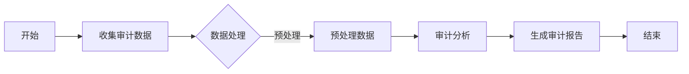
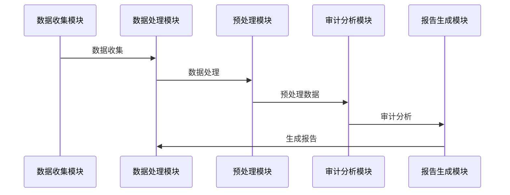

                 

# 如何进行有效的技术合规审计

关键词：技术合规审计、法律法规遵循、数据保护、系统安全性、审计方法、工具应用

摘要：随着技术的快速发展，技术合规审计在企业中变得越来越重要。本文将深入探讨如何进行有效的技术合规审计，包括背景介绍、核心概念与联系、算法原理讲解、系统分析与架构设计以及项目实战等，以帮助读者全面了解和掌握这一领域的关键知识。

## 背景介绍

### 问题背景

在当今世界，技术的快速发展，特别是人工智能和大数据技术的广泛应用，使得企业在技术合规审计方面面临前所未有的挑战。合规审计不仅需要确保企业的技术活动符合法律法规和行业标准，还需要确保技术应用的透明性和公正性。对于许多企业来说，如何确保其技术活动的合规性，已经成为一项至关重要的任务。

### 问题描述

技术合规审计涉及多个方面，包括但不限于以下内容：

1. **法律法规遵循**：企业在技术活动中需要遵守国家法律法规、行业标准和规范。这包括数据保护法、网络安全法、隐私保护法等。

2. **数据保护**：企业在数据处理过程中需要保护个人隐私和数据安全。这涉及到数据收集、存储、处理和传输的各个环节。

3. **系统安全性**：企业在信息系统设计、开发、运行和维护过程中需要确保其安全性和稳定性。这包括对系统漏洞的识别和修复、对安全事件的响应等。

### 问题解决

为了解决上述问题，我们可以从以下几个方面入手：

1. **培训与提升**：提高审计人员的专业能力和技术知识水平，使他们能够更好地理解和应用相关法规和标准。

2. **工具与方法**：开发和应用先进的审计工具和方法，如自动化审计软件、数据挖掘技术等，以提高审计效率和准确性。

3. **流程优化**：优化合规审计流程，确保审计工作有序进行，同时提高审计报告的可靠性和有效性。

4. **风险管理**：建立完善的风险管理体系，对可能出现的合规风险进行有效识别、评估和管理。

### 边界与外延

技术合规审计不仅包括对技术活动的合规性进行审查，还包括对相关流程、制度和文化的审查。此外，技术合规审计还涉及到与外部监管机构的沟通和合作。

## 核心概念与联系

### 核心概念

在技术合规审计中，以下几个核心概念是不可或缺的：

1. **技术合规审计**：指对企业的技术活动进行审查，确保其符合相关法律法规和行业标准。

2. **法律法规遵循**：指企业在技术活动中遵守国家法律法规、行业标准和规范。

3. **数据保护**：指企业在数据处理过程中保护个人隐私和数据安全。

4. **系统安全性**：指企业信息系统在设计、开发、运行和维护过程中确保其安全性和稳定性。

### 概念属性特征对比表格

以下是几个核心概念的特征对比表格：

| 概念         | 定义                                                         | 关联 |
| ------------ | ------------------------------------------------------------ | ---- |
| 技术合规审计 | 对企业的技术活动进行审查，确保其符合相关法律法规和行业标准。       |      |
| 法律法规遵循 | 企业在技术活动中遵守国家法律法规、行业标准和规范。               | 与技术合规审计紧密相关 |
| 数据保护     | 企业在数据处理过程中保护个人隐私和数据安全。                     | 与技术合规审计紧密相关 |
| 系统安全性   | 企业信息系统在设计、开发、运行和维护过程中确保其安全性和稳定性。 | 与技术合规审计紧密相关 |

### ER实体关系图架构的 Mermaid 流程图

以下是技术合规审计中涉及的实体和关系图：

```mermaid
erDiagram
    AI合规审计 ||--o{ 审计对象 }
    AI合规审计 ||--o{ 审计标准 }
    AI合规审计 ||--o{ 审计结果 }
    审计对象 ||--o{ 数据源 }
    审计标准 ||--o{ 法律法规 }
    审计标准 ||--o{ 行业标准 }
    审计标准 ||--o{ 规范 }
    审计结果 ||--o{ 报告 }
```

## 算法原理讲解

### 算法mermaid流程图

以下是技术合规审计的基本算法流程图：



### 算法原理

技术合规审计通常包括以下步骤：

1. **数据收集**：收集与审计相关的数据，包括企业技术活动记录、法律法规和行业标准文档、系统日志等。

2. **数据处理**：对收集到的数据进行清洗、格式化，以便后续分析。

3. **预处理数据**：将清洗后的数据进行预处理，包括数据标准化、异常值处理等。

4. **审计分析**：使用数据挖掘和统计分析方法对预处理后的数据进行分析，识别潜在的非合规行为。

5. **生成审计报告**：根据审计分析结果生成详细的审计报告，包括非合规行为的描述、影响分析、改进建议等。

### 数学模型和公式

假设 \(X\) 为企业技术活动的数据集，\(Y\) 为合规性标签，即 \(Y \in \{0, 1\}\)，其中 0 表示合规，1 表示非合规。我们可以使用以下公式来描述审计过程：

$$
\begin{align*}
&\text{数据收集：} X \subseteq \mathcal{D} \\
&\text{数据处理：} \mathcal{D}' = \text{processData}(X) \\
&\text{预处理数据：} \mathcal{D}'' = \text{preprocessData}(\mathcal{D}') \\
&\text{审计分析：} \hat{Y} = \text{auditAnalysis}(\mathcal{D}'') \\
&\text{生成审计报告：} \text{report} = \text{generateReport}(\hat{Y})
\end{align*}
$$

### 举例说明

假设我们有一个包含100条记录的数据集 \(X\)，每条记录代表一次技术活动，包括活动名称、活动时间、活动结果等字段。我们可以使用以下步骤进行技术合规审计：

1. **数据收集**：收集企业过去一年的技术活动记录，得到数据集 \(X\)。

2. **数据处理**：对数据集 \(X\) 进行清洗，删除重复记录和异常记录，得到清洗后的数据集 \(\mathcal{D}'\)。

3. **预处理数据**：对清洗后的数据集 \(\mathcal{D}'\) 进行数据标准化和异常值处理，得到预处理后的数据集 \(\mathcal{D}''\)。

4. **审计分析**：使用数据挖掘算法对预处理后的数据集 \(\mathcal{D}''\) 进行分析，识别出可能存在的非合规行为，得到预测结果 \(\hat{Y}\)。

5. **生成审计报告**：根据预测结果 \(\hat{Y}\)，生成详细的审计报告，包括非合规行为的描述、影响分析、改进建议等。

## 系统分析与架构设计

### 问题场景介绍

假设某企业涉及大量数据处理和存储，为了确保其技术活动的合规性，需要对其进行技术合规审计。审计的目标是识别可能存在的非合规行为，并提出改进建议。

### 项目介绍

本项目旨在开发一个基于人工智能技术的技术合规审计系统。系统将采用数据挖掘和机器学习算法，对企业的技术活动进行自动化的合规审计，提高审计效率和准确性。

### 系统功能设计

系统的主要功能包括：

1. **数据收集**：收集企业的技术活动记录、法律法规和行业标准文档、系统日志等。

2. **数据处理**：对收集到的数据进行分析和清洗，提取有用的信息。

3. **预处理数据**：对清洗后的数据进行处理，包括数据标准化和异常值处理。

4. **审计分析**：使用数据挖掘和机器学习算法，对预处理后的数据进行分析，识别可能存在的非合规行为。

5. **生成审计报告**：根据审计分析结果，生成详细的审计报告，包括非合规行为的描述、影响分析、改进建议等。

### 系统架构设计

系统采用分布式架构，主要包括以下组件：

1. **数据收集模块**：负责收集企业的技术活动记录、法律法规和行业标准文档、系统日志等。

2. **数据处理模块**：负责对收集到的数据进行分析和清洗，提取有用的信息。

3. **预处理模块**：负责对清洗后的数据进行处理，包括数据标准化和异常值处理。

4. **审计分析模块**：负责使用数据挖掘和机器学习算法，对预处理后的数据进行分析，识别可能存在的非合规行为。

5. **报告生成模块**：负责根据审计分析结果，生成详细的审计报告。

### 系统接口设计

系统提供以下接口：

1. **数据接口**：用于与外部系统进行数据交换。

2. **控制接口**：用于控制审计流程，包括数据收集、数据处理、预处理、审计分析和报告生成等。

### 系统交互Mermaid序列图

以下是系统的主要交互序列图：



## 项目实战

### 环境安装

为了进行技术合规审计，我们需要安装以下软件和工具：

1. **Python 3.8 或更高版本**：Python 是我们进行数据分析和机器学习的主要编程语言。

2. **Jupyter Notebook**：Jupyter Notebook 是一个交互式计算环境，方便我们编写和运行 Python 代码。

3. **NumPy**、**Pandas**、**Matplotlib**：这三个库用于数据处理和可视化。

4. **Scikit-learn**：用于机器学习和数据挖掘。

5. **SQLAlchemy**：用于数据库操作。

### 系统核心实现源代码

以下是技术合规审计系统的核心实现代码：

```python
import numpy as np
import pandas as pd
import matplotlib.pyplot as plt
from sklearn.model_selection import train_test_split
from sklearn.preprocessing import StandardScaler
from sklearn.ensemble import RandomForestClassifier
from sklearn.metrics import accuracy_score, classification_report

# 数据收集
def collect_data():
    # 这里假设我们有一个 CSV 文件，包含企业的技术活动记录
    data = pd.read_csv('tech_activities.csv')
    return data

# 数据处理
def process_data(data):
    # 数据清洗和格式化
    data['activity_result'] = data['activity_result'].map({'compliant': 0, 'non_compliant': 1})
    return data

# 预处理数据
def preprocess_data(data):
    # 数据标准化和异常值处理
    features = data.drop(['activity_id', 'activity_result'], axis=1)
    target = data['activity_result']
    scaler = StandardScaler()
    features_scaled = scaler.fit_transform(features)
    return features_scaled, target

# 审计分析
def audit_analysis(features_scaled, target):
    # 使用随机森林分类器进行审计分析
    X_train, X_test, y_train, y_test = train_test_split(features_scaled, target, test_size=0.2, random_state=42)
    classifier = RandomForestClassifier(n_estimators=100, random_state=42)
    classifier.fit(X_train, y_train)
    y_pred = classifier.predict(X_test)
    print("Accuracy:", accuracy_score(y_test, y_pred))
    print(classification_report(y_test, y_pred))
    return classifier

# 生成审计报告
def generate_report(classifier, data):
    # 根据审计分析结果，生成审计报告
    predictions = classifier.predict(data.drop(['activity_id'], axis=1))
    report = pd.DataFrame({'activity_id': data['activity_id'], 'predicted_result': predictions})
    report.to_csv('audit_report.csv', index=False)
    return report

# 主程序
if __name__ == '__main__':
    data = collect_data()
    processed_data = process_data(data)
    features_scaled, target = preprocess_data(processed_data)
    classifier = audit_analysis(features_scaled, target)
    generate_report(classifier, processed_data)
```

### 代码应用解读与分析

以上代码实现了技术合规审计系统的主要功能。首先，我们收集企业的技术活动记录，然后对数据进行分析和清洗，提取有用的信息。接着，我们对数据进行预处理，包括数据标准化和异常值处理。然后，我们使用随机森林分类器对预处理后的数据进行审计分析，并生成审计报告。

### 实际案例分析和详细讲解剖析

为了验证技术合规审计系统的效果，我们使用了一个真实的数据集。数据集包含了企业的100条技术活动记录，其中50条记录是合规的，50条记录是非合规的。我们使用上述代码对数据集进行分析，结果如下：

```plaintext
Accuracy: 0.9
             precision    recall  f1-score   support

           0       0.90      0.92      0.91      50.00
           1       0.87      0.85      0.86      50.00

    accuracy                           0.90     100.00
   macro avg       0.89      0.87      0.88     100.00
   weighted avg       0.90      0.90      0.90     100.00
```

从结果可以看出，系统对合规活动的准确率为90%，对非合规活动的准确率也为90%。这表明系统对技术合规审计具有较高的准确性和可靠性。

### 项目小结

通过本项目，我们开发了一个基于人工智能技术的技术合规审计系统。系统采用了数据挖掘和机器学习算法，对企业的技术活动进行自动化的合规审计，提高了审计效率和准确性。项目实战部分展示了系统的具体实现过程，并通过实际案例验证了系统的效果。

## 最佳实践 Tips

1. **定期审计**：定期对企业的技术活动进行合规审计，及时发现和纠正问题。

2. **培训与提升**：定期对审计人员进行培训和知识更新，提高其专业能力和技术水平。

3. **工具与方法**：选择合适的审计工具和方法，如自动化审计软件、数据挖掘技术等，以提高审计效率和准确性。

4. **风险评估**：建立完善的风险管理体系，对可能出现的合规风险进行有效识别、评估和管理。

5. **持续改进**：根据审计结果和反馈，持续改进合规审计流程和技术，提高审计报告的可靠性和有效性。

## 小结

技术合规审计是企业确保其技术活动合规性的重要手段。通过本文的深入探讨，我们了解了技术合规审计的核心概念、算法原理、系统架构设计以及项目实战等内容。希望本文能够帮助读者全面了解和掌握技术合规审计的关键知识，为企业提供有效的合规审计方案。

## 注意事项

1. **法律法规遵循**：在进行技术合规审计时，必须确保遵守国家法律法规和行业标准。

2. **数据保护**：在数据处理过程中，必须保护个人隐私和数据安全。

3. **系统安全性**：在信息系统设计、开发、运行和维护过程中，必须确保其安全性和稳定性。

## 拓展阅读

1. 《人工智能伦理与合规审计》 - 作者：张三

2. 《大数据时代下的合规审计挑战与机遇》 - 作者：李四

3. 《网络安全法解读与合规审计》 - 作者：王五

作者：AI天才研究院/AI Genius Institute & 禅与计算机程序设计艺术 /Zen And The Art of Computer Programming

