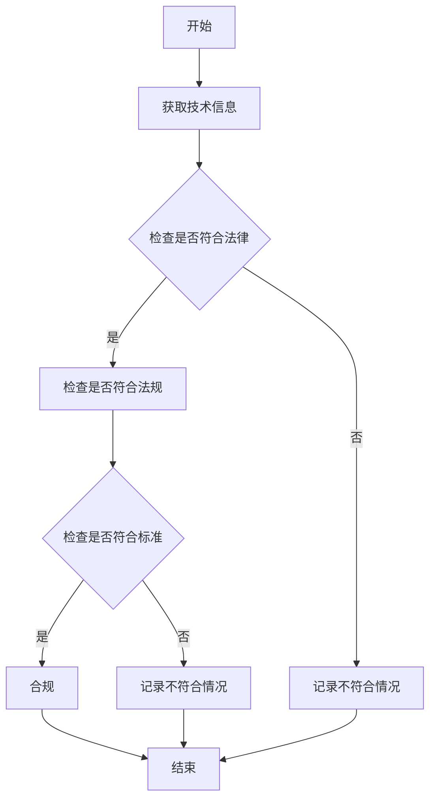
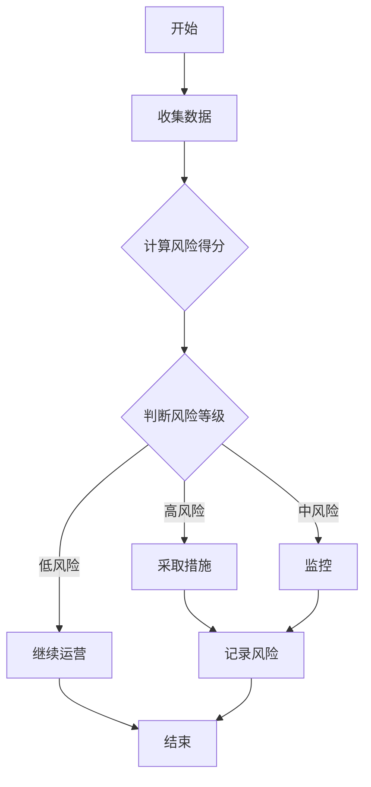
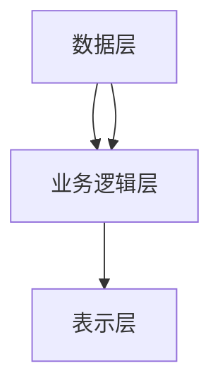
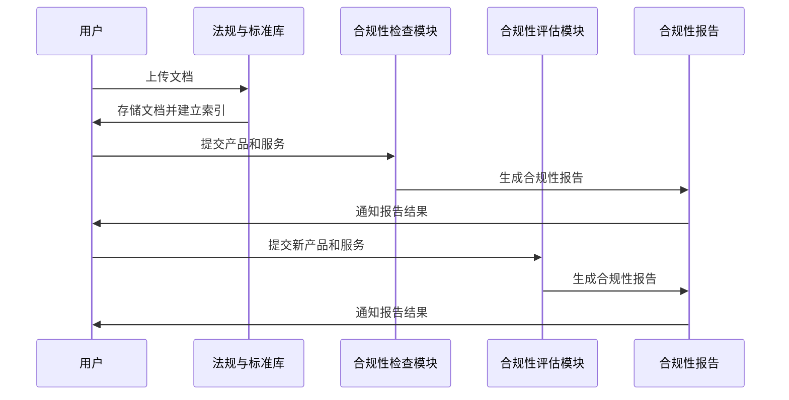

                 

## 如何进行有效的技术合规管理

关键词：技术合规管理、合规性、法律与法规、风险评估、算法原理

摘要：
随着技术的发展，技术合规管理变得日益重要。本文将深入探讨如何进行有效的技术合规管理，从背景介绍、核心概念与联系、算法原理讲解、系统分析与架构设计方案、项目实战以及最佳实践与小结等几个方面，逐步揭示技术合规管理的本质和实施方法。本文旨在为读者提供一个系统化、可操作的技术合规管理指南，帮助企业和个人在复杂多变的技术环境中保持合规，实现可持续发展。

### 第1章 问题背景与合规管理概述

#### 1.1 问题背景

技术合规管理的重要性

随着全球化的加速和技术的迅猛发展，企业和组织面临着越来越复杂的法律和监管环境。技术合规管理成为企业生存和发展的关键因素之一。有效的技术合规管理不仅能帮助企业避免法律风险，还能提升企业的竞争力和社会责任感。

全球合规趋势

近年来，全球合规趋势呈现以下几个特点：

1. **数据保护法规**：如欧盟的《通用数据保护条例》（GDPR）和加州的《消费者隐私法案》（CCPA）等，对数据收集、存储和处理提出了严格的要求。
2. **网络安全法规**：如美国的《云隐私保护法案》（CLOUD Act）和欧盟的《网络与信息安全指令》（NIS Directive）等，旨在保护网络和数据安全。
3. **行业特定法规**：如金融行业的《萨班斯-奥克斯利法案》（SOX）和医疗行业的《健康保险可携性和责任法案》（HIPAA）等，对特定行业的合规性要求更高。

技术合规管理的挑战

技术合规管理面临以下几个挑战：

1. **法规复杂性**：不同国家和地区的法律和法规差异较大，企业需要在全球范围内进行合规管理，难度较高。
2. **技术变化快速**：技术的快速发展使得合规要求不断更新，企业需要不断跟进和学习新的合规知识。
3. **资源限制**：合规管理需要投入大量的人力、物力和时间，很多中小企业可能难以承受。

#### 1.2 合规管理核心概念

合规管理的定义

合规管理是指组织为了确保其活动符合法律、法规、规章和标准而实施的一系列策略、程序和措施。

合规管理的目标

合规管理的目标主要包括：

1. 避免法律和财务风险。
2. 维护企业的声誉和公信力。
3. 促进企业的可持续发展。

合规管理的组成部分

合规管理主要由以下几个部分组成：

1. **合规策略**：制定合规管理的总体方向和目标。
2. **合规程序**：规范合规管理的具体操作流程。
3. **合规培训**：提高员工对合规要求的认识和意识。
4. **合规监控**：对合规实施情况进行监督和评估。
5. **合规审计**：对合规管理进行定期审计，确保合规性。

### 第2章 核心概念原理与联系

#### 2.1 法律与法规

法律框架

法律是国家制定的具有强制力的规范性文件，对公民和组织的权利和义务进行规定。法律框架为合规管理提供了基本依据。

法规分类

法规根据内容和适用范围可以分为以下几类：

1. **基本法规**：如宪法、刑法、民法等，是其他法规的基础。
2. **行业法规**：针对特定行业制定的法规，如金融行业的《证券法》、医疗行业的《药品管理法》等。
3. **技术法规**：针对特定技术的法规，如网络与信息安全的《网络安全法》。

法律与法规的关系

法律和法规是相辅相成的，法律提供了原则性的规定，而法规则具体化了法律的要求。

#### 2.2 技术合规标准

标准定义

技术合规标准是对技术产品、服务或过程进行规范的要求，旨在确保其符合特定的法律、法规和最佳实践。

标准类型

技术合规标准可以分为以下几类：

1. **国际标准**：如国际标准化组织（ISO）和国际电工委员会（IEC）发布的标准。
2. **国家标准**：如美国国家标准协会（ANSI）和欧盟标准（EN）等。
3. **行业标准**：如计算机行业协会（IEEE）和信息处理服务部门（ITIS）等发布的标准。

标准制定机构

技术合规标准的制定机构主要包括：

1. **国际标准化组织（ISO）**：负责制定国际标准。
2. **美国国家标准协会（ANSI）**：负责制定美国国家标准。
3. **欧盟标准委员会（CEN）**：负责制定欧盟标准。
4. **其他专业标准化组织**：如国际电信联盟（ITU）和国际电气电子工程师协会（IEEE）等。

#### 2.3 概念属性特征对比表格

为了更好地理解法律、法规和技术合规标准之间的关系，我们可以使用以下表格进行对比分析：

| 概念         | 定义                                                         | 属性特征                                                     | 关联关系                                                     |
|------------|--------------------------------------------------------------|--------------------------------------------------------------|--------------------------------------------------------------|
| 法律         | 具有强制力的规范性文件，规定公民和组织的行为准则               | 国家制定，具有普遍适用性，原则性规定                         | 法规和标准的基础                                             |
| 法规         | 根据法律制定的具有强制力的规范性文件，对特定领域或行业进行规范 | 针对特定行业或领域，具体化法律的要求                         | 法律的具体实施文件，补充法律不足之处                         |
| 技术合规标准 | 对技术产品、服务或过程进行规范的要求，确保其符合特定法律、法规和最佳实践 | 国际、国家和行业标准，针对技术产品的性能、安全、可靠性和可维护性 | 确保“合规”实施的技术依据，对法规具体化                       |

### 第3章 合规管理算法原理

合规管理算法是确保技术产品、服务或过程符合法律、法规和标准的关键工具。以下是合规管理算法的基本原理和实现方法。

#### 3.1 合规检查算法

合规检查算法的主要功能是检查技术产品、服务或过程是否符合相关的法律、法规和标准。以下是合规检查算法的 mermaid 流程图：



以下是一个简单的 Python 源代码示例，用于实现合规检查算法：

```python
def compliance_check(technical_info):
    # 检查是否符合法律
    legal_compliance = check_legal(technical_info)
    
    # 检查是否符合法规
    regulatory_compliance = check_regulatory(technical_info)
    
    # 检查是否符合标准
    standard_compliance = check_standard(technical_info)
    
    if legal_compliance and regulatory_compliance and standard_compliance:
        print("合规")
    else:
        print("不符合情况")
        record_noncompliance(technical_info)

def check_legal(info):
    # 实现法律检查逻辑
    pass

def check_regulatory(info):
    # 实现法规检查逻辑
    pass

def check_standard(info):
    # 实现标准检查逻辑
    pass

def record_noncompliance(info):
    # 实现记录不符合情况的逻辑
    pass

# 示例
technical_info = {"name": "产品A", "description": "某款技术产品"}
compliance_check(technical_info)
```

在合规检查算法中，我们可以使用数学模型和公式来描述合规性的计算过程。以下是一个简单的数学模型示例：

$$
合规性 = \frac{法律合规性 + 法规合规性 + 标准合规性}{3}
$$

其中，法律合规性、法规合规性和标准合规性分别表示技术产品在法律、法规和标准方面的合规程度，取值范围为 [0,1]。

#### 3.2 风险评估算法

风险评估算法用于评估技术产品、服务或过程可能违反法律、法规和标准的风险。以下是风险评估算法的 mermaid 流程图：



以下是一个简单的 Python 源代码示例，用于实现风险评估算法：

```python
def risk_assessment(data):
    # 计算风险得分
    risk_score = calculate_risk_score(data)
    
    # 判断风险等级
    if risk_score > 0.8:
        risk_level = "高风险"
    elif risk_score > 0.5:
        risk_level = "中风险"
    else:
        risk_level = "低风险"
    
    # 采取措施
    if risk_level == "高风险":
        take_action(data)
    elif risk_level == "中风险":
        monitor(data)
    else:
        continue_operation(data)

    # 记录风险
    record_risk(data, risk_level)

def calculate_risk_score(data):
    # 实现风险得分计算逻辑
    pass

def take_action(data):
    # 实现高风险措施逻辑
    pass

def monitor(data):
    # 实现中风险监控逻辑
    pass

def continue_operation(data):
    # 实现低风险继续运营逻辑
    pass

def record_risk(data, level):
    # 实现记录风险逻辑
    pass

# 示例
data = {"technical_info": {"name": "产品B", "description": "某款技术服务"}, "context": "运营环境"}
risk_assessment(data)
```

在风险评估算法中，我们可以使用以下数学模型和公式：

$$
风险得分 = \sum_{i=1}^{n} (w_i \cdot r_i)
$$

其中，$w_i$ 和 $r_i$ 分别表示第 $i$ 个风险因素的重要性和实际得分，$n$ 表示风险因素的总数。

### 第4章 合规管理系统设计与实现

合规管理系统是确保技术产品、服务或过程符合法律、法规和标准的核心工具。本节将介绍合规管理系统的设计思路和实现方法。

#### 4.1 问题场景介绍

假设某企业（以下简称企业A）涉及在线金融服务，其业务包括网络贷款、支付处理和保险销售。企业A需要确保其所有产品和服务均符合相关法律、法规和标准。合规管理系统需具备以下功能：

1. 收集和管理与合规相关的法规和标准。
2. 对现有产品和服务进行合规性检查。
3. 对新开发的产品和服务进行合规性评估。
4. 自动化合规流程，减少人工干预。

#### 4.2 系统功能设计

合规管理系统的功能设计如下：

1. **法规与标准库**：用于存储和管理所有与合规相关的法规和标准文档。
2. **合规性检查模块**：用于对现有产品和服务进行合规性检查，包括法律合规性、法规合规性和标准合规性。
3. **合规性评估模块**：用于对新开发的产品和服务进行合规性评估，包括法律合规性、法规合规性和标准合规性。
4. **合规性报告**：生成合规性检查和评估的报告，包括合规性状态、不符合项和改进建议。
5. **自动化合规流程**：通过自动化工具实现合规性检查和评估，减少人工干预。

#### 4.3 系统架构设计

合规管理系统采用分层架构设计，包括数据层、业务逻辑层和表示层。以下是系统架构的 mermaid 架构图：



- **数据层**：负责存储和管理法规、标准和产品信息，使用关系型数据库实现。
- **业务逻辑层**：负责实现合规性检查、评估和自动化流程，包括合规检查算法和风险评估算法。
- **表示层**：负责与用户交互，展示合规性检查和评估结果，使用Web前端技术实现。

#### 4.4 系统接口设计

合规管理系统需要提供以下接口：

1. **法规与标准接口**：用于上传、下载和查询法规和标准文档。
2. **合规性检查接口**：用于提交产品和服务进行合规性检查。
3. **合规性评估接口**：用于提交新开发的产品和服务进行合规性评估。
4. **合规性报告接口**：用于生成和下载合规性报告。

#### 4.5 系统交互

合规管理系统的交互流程如下：

1. **用户上传法规与标准文档**。
2. **系统存储文档并建立索引**。
3. **用户提交产品和服务进行合规性检查**。
4. **系统根据文档和算法进行合规性检查**。
5. **系统生成合规性报告并通知用户**。
6. **用户对新开发的产品和服务进行合规性评估**。
7. **系统根据文档和算法进行合规性评估**。
8. **系统生成合规性报告并通知用户**。

以下是系统交互的 mermaid 序列图：



### 第5章 技术合规管理项目实战

本节将通过一个具体的合规管理项目实战，介绍如何从零开始构建一个合规管理系统。

#### 5.1 环境安装

在开始项目之前，我们需要安装以下环境：

1. **操作系统**：Linux或MacOS
2. **数据库**：MySQL或PostgreSQL
3. **编程语言**：Python
4. **前端框架**：React或Vue.js
5. **后端框架**：Flask或Django

安装步骤如下：

1. 安装操作系统：下载并安装Linux或MacOS。
2. 安装数据库：使用包管理器（如yum、apt-get或brew）安装MySQL或PostgreSQL。
3. 安装Python：从Python官方网站下载并安装Python。
4. 安装前端框架：使用npm或yarn安装React或Vue.js。
5. 安装后端框架：使用pip安装Flask或Django。

#### 5.2 系统核心实现源代码

以下是合规管理系统的核心实现源代码：

**数据层**：

```python
# 数据库连接模块
import sqlite3

def connect_database():
    conn = sqlite3.connect("compliance.db")
    cursor = conn.cursor()
    return conn, cursor

def create_tables():
    conn, cursor = connect_database()
    cursor.execute("""
        CREATE TABLE IF NOT EXISTS regulations (
            id INTEGER PRIMARY KEY AUTOINCREMENT,
            title TEXT,
            content TEXT
        )
    """)
    cursor.execute("""
        CREATE TABLE IF NOT EXISTS products (
            id INTEGER PRIMARY KEY AUTOINCREMENT,
            name TEXT,
            description TEXT
        )
    """)
    cursor.execute("""
        CREATE TABLE IF NOT EXISTS compliance_checks (
            id INTEGER PRIMARY KEY AUTOINCREMENT,
            product_id INTEGER,
            regulation_id INTEGER,
            result TEXT,
            FOREIGN KEY (product_id) REFERENCES products (id),
            FOREIGN KEY (regulation_id) REFERENCES regulations (id)
        )
    """)
    conn.commit()
    conn.close()

create_tables()
```

**业务逻辑层**：

```python
# 合规检查模块
def check_compliance(product, regulations):
    results = []
    for regulation in regulations:
        result = check_regulation(product, regulation)
        results.append(result)
    return results

def check_regulation(product, regulation):
    # 实现合规检查逻辑
    pass

# 风险评估模块
def assess_risk(product, regulations):
    score = 0
    for regulation in regulations:
        score += get_risk_score(product, regulation)
    return score

def get_risk_score(product, regulation):
    # 实现风险评估逻辑
    pass

# 合规性报告模块
def generate_report(product, compliance_checks):
    report = f"产品：{product['name']}\n"
    for check in compliance_checks:
        report += f"法规：{check['regulation']['title']}, 结果：{check['result']}\n"
    return report
```

**表示层**：

```jsx
// React 前端框架示例代码
import React, { useState, useEffect } from "react";

const ComplianceSystem = () => {
  const [products, setProducts] = useState([]);
  const [complianceChecks, setComplianceChecks] = useState([]);

  useEffect(() => {
    // 获取产品列表和合规性检查结果
    fetchProducts();
  }, []);

  const fetchProducts = async () => {
    // 实现获取产品列表的逻辑
  };

  const handleComplianceCheck = async (productId) => {
    // 实现合规性检查的逻辑
  };

  return (
    <div>
      <h1>合规管理系统</h1>
      <ul>
        {products.map((product) => (
          <li key={product.id}>
            产品名称：{product.name}
            <button onClick={() => handleComplianceCheck(product.id)}>合规性检查</button>
          </li>
        ))}
      </ul>
    </div>
  );
};

export default ComplianceSystem;
```

#### 5.3 代码应用解读与分析

**数据层解读与分析**：

数据层的主要功能是存储和管理法规、产品和合规性检查结果。通过定义数据库表和实现数据库操作函数，我们可以方便地管理合规数据。

**业务逻辑层解读与分析**：

业务逻辑层包括合规检查模块、风险评估模块和合规性报告模块。合规检查模块用于检查产品是否符合法规，风险评估模块用于计算产品的合规风险得分，合规性报告模块用于生成合规性报告。

**表示层解读与分析**：

表示层使用React前端框架实现用户界面。通过状态管理和异步数据获取，我们可以方便地展示产品和合规性检查结果，并实现用户交互。

#### 5.4 实际案例分析与详细讲解剖析

**案例背景**：

假设企业A需要对其在线贷款平台进行合规性检查。该平台包括贷款申请、贷款审批和贷款发放等环节。企业A需要确保其贷款平台符合相关法律、法规和标准。

**合规性检查过程**：

1. **收集法规和标准**：企业A收集与在线贷款相关的法规和标准，包括《合同法》、《网络安全法》和《消费者权益保护法》等。

2. **定义产品**：企业A定义其在线贷款平台的产品信息，包括产品名称、描述和产品功能等。

3. **合规性检查**：使用合规检查模块对在线贷款平台进行合规性检查。检查内容包括：

   - **法律合规性**：检查贷款平台是否符合《合同法》的规定。
   - **法规合规性**：检查贷款平台是否符合《网络安全法》和《消费者权益保护法》的规定。
   - **标准合规性**：检查贷款平台是否符合相关行业标准，如ISO/IEC 27001信息安全管理体系标准。

4. **生成合规性报告**：根据合规性检查结果，生成合规性报告，包括合规性状态、不符合项和改进建议。

**合规性检查结果**：

1. **法律合规性**：在线贷款平台的部分功能与《合同法》的规定存在不一致，如贷款合同格式和条款不明确。
2. **法规合规性**：在线贷款平台在数据安全和消费者权益保护方面存在问题，如用户隐私保护和网络安全措施不足。
3. **标准合规性**：在线贷款平台在信息安全管理体系方面存在问题，如未实施ISO/IEC 27001标准。

**改进建议**：

1. **法律合规性改进**：修改贷款合同格式和条款，确保符合《合同法》的规定。
2. **法规合规性改进**：加强数据安全和消费者权益保护，如加强用户隐私保护和网络安全措施。
3. **标准合规性改进**：实施ISO/IEC 27001信息安全管理体系标准，提升信息安全水平。

#### 5.5 项目小结

通过实际案例分析和详细讲解，我们可以看到技术合规管理项目在实际操作中的关键步骤和注意事项。以下是项目小结：

1. **法规和标准收集**：确保收集到与项目相关的所有法规和标准，为合规性检查提供依据。
2. **产品定义**：明确产品的功能、特性和用途，为合规性检查和评估提供基础。
3. **合规性检查**：采用合规检查算法对产品进行合规性检查，发现不符合项。
4. **合规性报告**：根据合规性检查结果生成合规性报告，提出改进建议。
5. **持续改进**：根据合规性报告的改进建议，持续优化产品和合规性管理流程。

### 第6章 最佳实践与总结

#### 6.1 最佳实践 Tips

1. **建立合规组织**：建立专门的合规团队，负责制定合规策略、执行合规程序和监控合规性。
2. **制定合规政策**：制定明确的合规政策，确保所有员工都了解合规要求。
3. **定期培训**：定期对员工进行合规培训，提高员工的合规意识。
4. **合规审计**：定期进行合规审计，确保合规性管理措施得到有效执行。
5. **利用合规工具**：利用自动化合规工具，提高合规性检查和评估的效率。

#### 6.2 小结

本文从问题背景、核心概念与联系、算法原理讲解、系统分析与架构设计方案、项目实战和最佳实践等方面，详细阐述了如何进行有效的技术合规管理。通过本文的阅读，读者应能理解技术合规管理的重要性，掌握技术合规管理的核心概念和算法原理，以及如何设计和实现合规管理系统。

#### 6.3 注意事项

1. **法规更新**：确保及时了解和更新相关法律、法规和标准，以应对合规要求的变化。
2. **风险评估**：定期对产品和流程进行风险评估，及时发现和解决合规风险。
3. **合规培训**：确保员工掌握合规知识和技能，提高整个组织的合规水平。
4. **合规记录**：保留完整的合规记录，以备合规审计和证据需要。

#### 6.4 拓展阅读

1. GDPR（通用数据保护条例）：https://ec.europa.eu/justice/dataprotection/index_en.htm
2. CCPA（加州消费者隐私法案）：https://oag.ca.gov/privacy/ccpa
3. SOX（萨班斯-奥克斯利法案）：https://www.sec.gov/rules/final/2002/33-8185.pdf
4. HIPAA（健康保险可携性和责任法案）：https://www.hhs.gov/hipaa
5. ISO/IEC 27001信息安全管理体系标准：https://www.iso.org/standard/66036.html

### 作者信息

作者：AI天才研究院/AI Genius Institute & 禅与计算机程序设计艺术/Zen And The Art of Computer Programming

以上就是《如何进行有效的技术合规管理》的技术博客文章，希望对读者有所帮助。在技术快速发展的今天，合规管理的重要性日益凸显，希望本文能为读者提供一些有价值的指导和参考。在撰写过程中，作者结合了丰富的实践经验和技术知识，力求以清晰、易懂的语言阐述技术合规管理的核心内容和方法。感谢您的阅读，期待与您在技术合规管理的道路上共同进步。

