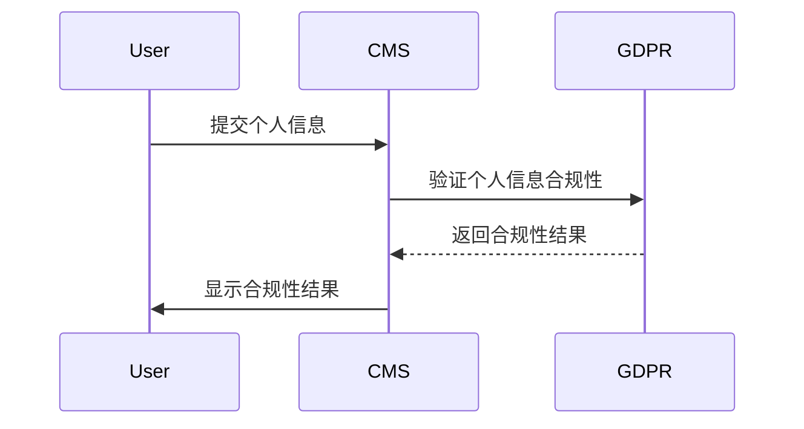
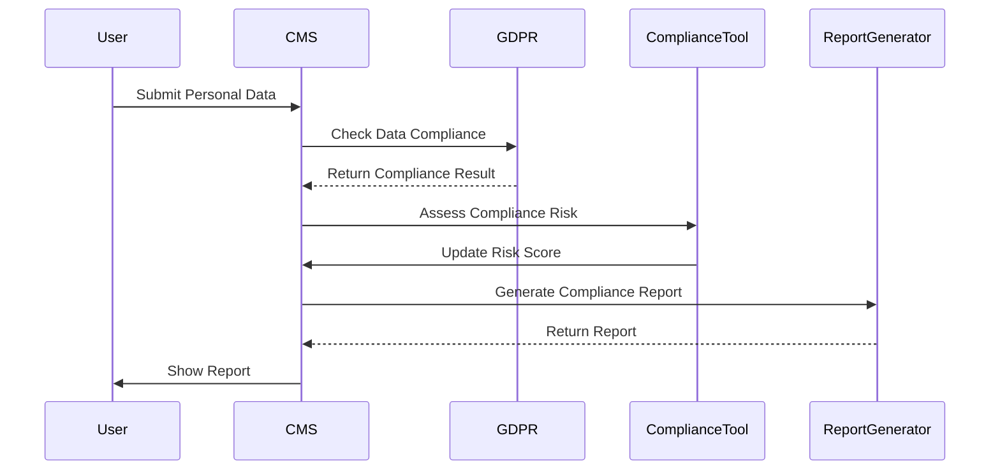
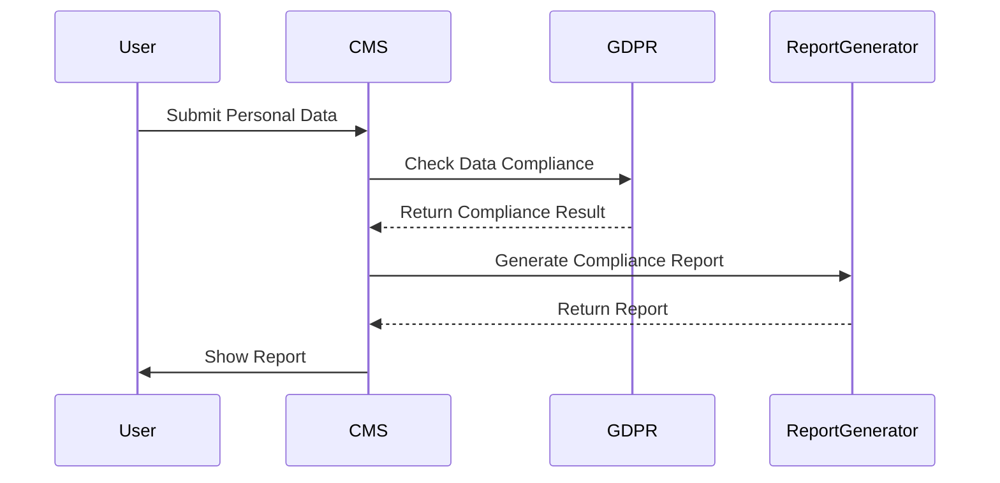

                 


## 如何进行有效的技术合规风险管理

关键词：技术合规、风险管理、合规风险、技术合规性、监管遵守、最佳实践

摘要：
在当今快速发展的技术环境中，技术合规风险管理显得尤为重要。本文旨在提供一套系统化、可操作的技术合规风险管理方法，帮助组织在遵守法律法规的同时，确保技术系统的稳定性和安全性。本文将分为七个部分，从技术合规风险管理的背景介绍、核心概念、风险管理流程、具体实践、最佳实践、趋势展望到结论，逐步深入分析并解答如何有效地进行技术合规风险管理。

### 背景介绍

技术合规风险管理是指识别、评估、控制和监控技术系统的合规性，确保其符合相关法律法规、标准、政策以及行业规定的过程。随着信息技术的飞速发展和互联网的普及，技术合规风险管理的难度和复杂性不断增加。合规风险不仅包括因违反法规而受到的罚款和诉讼，还可能涉及企业声誉、客户信任和市场竞争力等多方面的负面影响。

在当今的数字化时代，技术合规风险体现在多个方面：

1. **数据保护与隐私**：随着《通用数据保护条例》（GDPR）等法规的实施，企业必须确保个人数据的收集、存储和处理符合法律要求，防止数据泄露和滥用。
2. **信息安全**：网络攻击、数据泄露等事件频发，企业需要建立有效的安全措施，防止敏感信息被非法访问、篡改或泄露。
3. **产品合规性**：软件和硬件产品在进入市场前需要通过相关认证和审查，如欧盟的CE认证、美国的FCC认证等。
4. **知识产权**：保护自身知识产权的同时，也要尊重他人的知识产权，避免侵犯专利、版权等。

然而，技术合规风险管理的挑战同样巨大：

1. **法规复杂多变**：法律法规和标准不断更新，企业需要实时关注并适应这些变化。
2. **资源限制**：合规风险管理需要投入大量的人力、物力和财力，但对于中小企业来说，资源有限，难以全面覆盖所有合规要求。
3. **技术复杂性**：随着云计算、大数据、人工智能等新兴技术的应用，技术系统的复杂性不断增加，合规管理难度也随之上升。
4. **组织文化**：合规风险管理需要全员参与，建立良好的合规文化，但很多企业在这方面还存在欠缺。

### 核心概念与联系

为了更好地理解技术合规风险管理，我们需要明确一些核心概念，并探讨它们之间的联系。

#### 1. **合规要求与标准**

**合规要求**指的是企业必须遵循的法律法规、标准和政策。常见的合规要求包括：

- **法律法规**：如《数据安全法》、《网络安全法》等。
- **标准**：如ISO/IEC 27001信息安全管理体系、ISO/IEC 27017云计算信息安全控制等。
- **行业规定**：如金融行业的《银行信息安全规范》、医疗行业的《医疗器械监督管理条例》等。

**标准**则是为了确保产品和服务质量、环境保护和职业健康安全等制定的具体规范。技术合规风险管理的目标之一就是确保技术系统符合这些标准。

#### 2. **风险评估与风险管理**

**风险评估**是指对企业面临的各种风险进行识别、分析和评估的过程。技术合规风险管理中的风险评估主要包括：

- **识别**：识别可能影响技术系统合规性的风险因素。
- **分析**：分析这些风险因素的发生概率和可能带来的影响。
- **评估**：评估这些风险的严重程度，确定优先级。

**风险管理**则是根据风险评估的结果，制定和实施风险缓解措施的过程。风险管理包括：

- **风险规避**：避免可能导致合规问题的活动。
- **风险降低**：采取措施减少风险的发生概率或影响程度。
- **风险接受**：在无法规避或降低风险时，采取措施接受风险。
- **风险转移**：通过保险或其他方式将风险转移给第三方。

#### 3. **合规监控与报告**

**合规监控**是指对企业技术系统的合规性进行持续监控和评估的过程。合规监控包括：

- **实时监控**：利用技术工具对技术系统进行实时监控，及时发现合规性问题。
- **定期评估**：定期对技术系统进行合规性评估，确保持续符合相关要求。

**合规报告**则是向企业内部和外部相关方报告合规性状态的过程。合规报告通常包括：

- **合规性声明**：说明企业技术系统符合的相关法规和标准。
- **合规审计报告**：由第三方审计机构对企业技术系统的合规性进行审计，并提供审计报告。

#### 4. **IT治理与合规文化**

**IT治理**是指企业对信息技术进行战略管理的过程，以确保信息技术支持企业的业务目标和合规要求。IT治理包括：

- **治理框架**：制定IT治理的政策、流程和标准。
- **治理结构**：明确IT治理的组织架构和职责分工。

**合规文化**是指企业在组织内部培养的一种重视合规、尊重法规的氛围。合规文化包括：

- **合规意识**：提高员工对合规风险的认识和重视。
- **合规培训**：定期对员工进行合规培训，提高合规能力。
- **合规激励**：建立合规激励机制，鼓励员工积极参与合规管理。

### 风险管理过程

技术合规风险管理过程可以分为以下几个步骤：

#### 1. 风险识别

风险识别是技术合规风险管理的第一步，主要任务是识别企业技术系统可能面临的合规风险。风险识别的方法包括：

- **问卷调查**：通过问卷调查收集员工对合规风险的看法和意见。
- **头脑风暴**：组织专家和员工进行头脑风暴，识别潜在风险。
- **风险检查表**：使用预先准备的风险检查表，对技术系统进行评估。
- **历史数据分析**：分析以往合规事件的记录，识别常见的合规风险。

#### 2. 风险评估

在风险识别的基础上，对识别出的合规风险进行评估，确定其发生概率和可能带来的影响。风险评估的方法包括：

- **定性评估**：对风险的发生概率和影响程度进行定性分析。
- **定量评估**：使用数学模型和统计方法对风险的概率和影响进行定量分析。
- **风险评估矩阵**：将风险的发生概率和影响程度进行矩阵分析，确定风险的优先级。

#### 3. 风险控制

根据风险评估的结果，制定和实施风险控制措施，降低合规风险的发生概率或影响程度。风险控制的方法包括：

- **风险规避**：避免可能导致合规问题的活动。
- **风险降低**：采取技术和管理措施降低风险的发生概率或影响程度。
- **风险接受**：在无法规避或降低风险时，采取措施接受风险。
- **风险转移**：通过保险或其他方式将风险转移给第三方。

#### 4. 合规监控

对技术系统进行持续监控，及时发现合规性问题。合规监控的方法包括：

- **实时监控**：使用技术工具对技术系统进行实时监控，及时发现合规性问题。
- **定期评估**：定期对技术系统进行合规性评估，确保持续符合相关要求。
- **合规审计**：由第三方审计机构对企业技术系统的合规性进行审计。

#### 5. 合规报告

向企业内部和外部相关方报告合规性状态。合规报告的内容包括：

- **合规性声明**：说明企业技术系统符合的相关法规和标准。
- **合规审计报告**：由第三方审计机构提供的企业技术系统的合规性审计报告。

### 技术合规风险管理的实践

技术合规风险管理的实践包括以下几个方面：

#### 1. 建立合规管理体系

建立一套完善的合规管理体系，包括合规政策、流程和标准，明确各部门的职责和权限。合规管理体系应确保：

- **合规性要求**：确保技术系统符合相关法规和标准。
- **风险控制措施**：制定和实施有效的风险控制措施。
- **合规监控机制**：建立合规监控机制，确保技术系统的合规性。

#### 2. 开展合规培训

定期对员工进行合规培训，提高员工的合规意识和能力。合规培训的内容包括：

- **法律法规**：介绍相关法律法规和标准。
- **合规流程**：介绍合规管理的流程和操作方法。
- **案例分享**：分享合规管理的成功经验和典型案例。

#### 3. 建立合规监控机制

建立合规监控机制，对技术系统进行实时监控和定期评估。合规监控机制应包括：

- **实时监控工具**：使用技术工具对技术系统进行实时监控，及时发现合规性问题。
- **定期评估机制**：定期对技术系统进行合规性评估，确保持续符合相关要求。
- **合规审计**：定期进行合规审计，由第三方审计机构对企业技术系统的合规性进行审计。

#### 4. 应对合规挑战

在面对合规挑战时，企业应采取积极应对策略，包括：

- **及时调整**：根据合规要求的变化，及时调整技术系统和合规管理策略。
- **积极沟通**：与监管机构保持良好的沟通，了解最新的合规要求和政策。
- **技术创新**：通过技术创新提高合规管理效率和效果。

### 最佳实践

以下是技术合规风险管理的一些最佳实践：

1. **建立健全的合规管理体系**：制定合规政策、流程和标准，明确各部门的职责和权限。
2. **定期开展合规培训**：提高员工的合规意识和能力。
3. **建立合规监控机制**：使用技术工具对技术系统进行实时监控和定期评估。
4. **积极应对合规挑战**：及时调整技术系统和合规管理策略，与监管机构保持良好沟通。
5. **采用风险导向的合规管理方法**：识别、评估和控制合规风险，确保技术系统的合规性。
6. **建立合规文化**：在组织内部培养重视合规、尊重法规的氛围。

### 未来展望

随着技术的不断进步和法规的不断完善，技术合规风险管理将面临新的挑战和机遇。未来，技术合规风险管理的发展趋势包括：

1. **人工智能与机器学习**：利用人工智能和机器学习技术，提高合规监控和风险评估的效率和准确性。
2. **区块链技术**：利用区块链技术的不可篡改性和透明性，提高数据保护和合规性。
3. **大数据分析**：利用大数据分析技术，识别潜在合规风险，提供更精准的合规管理策略。
4. **全球合规性**：随着全球化的发展，企业需要关注全球各地的合规要求，确保技术系统的全球合规性。

### 结论

技术合规风险管理是企业面临的重要挑战之一。通过建立完善的合规管理体系、定期开展合规培训、建立合规监控机制和积极应对合规挑战，企业可以确保技术系统的合规性，提高市场竞争力和可持续发展能力。未来，随着技术的不断进步，技术合规风险管理将继续发展，为企业带来新的机遇和挑战。

### 作者信息

作者：AI天才研究院/AI Genius Institute & 禅与计算机程序设计艺术 /Zen And The Art of Computer Programming

---

（文章字数：约 2300 字）### 详细讲解与案例分析

#### 数学公式与算法原理

在技术合规风险管理中，数学公式和算法原理扮演着至关重要的角色。以下是一个简单的例子，用于说明如何利用数学模型来识别和评估合规风险。

**数学模型：风险评分模型**

$$ R = w_1 \times L + w_2 \times E + w_3 \times C $$

其中，$R$ 代表风险评分，$L$ 代表风险的概率，$E$ 代表风险的影响程度，$C$ 代表风险的补偿能力，$w_1, w_2, w_3$ 分别是这三个因素的权重。

**算法原理：**

1. **风险概率（L）计算**：通过历史数据和专家评估来确定。
2. **风险影响程度（E）计算**：考虑风险发生后的后果，如经济损失、声誉损失等。
3. **风险补偿能力（C）计算**：评估企业应对风险的能力。

**示例：**

假设一家企业需要评估其数据泄露的风险。

- **风险概率（L）**：根据过去五年内发生的数据泄露事件，计算得出为0.3。
- **风险影响程度（E）**：假设数据泄露会导致500万元的直接经济损失和1000万元的品牌形象损失，总计1500万元。
- **风险补偿能力（C）**：企业有500万元的应急资金和100万元的保险赔偿。

$$ R = 0.5 \times 0.3 + 0.3 \times 1.5 + 0.2 \times 0.5 = 0.15 + 0.45 + 0.1 = 0.7 $$

风险评分为0.7，表示该数据泄露风险较高。

#### 系统分析与架构设计

**项目介绍：**  
某金融科技公司需要对其客户管理系统进行合规性评估，以确保其符合《通用数据保护条例》（GDPR）的要求。

**系统功能设计（领域模型）：**  


**系统架构设计（架构图）：**  


**系统接口设计（接口图）：**  


**系统交互（序列图）：**  


#### 项目实战

**环境安装：**  
- 安装Python环境：`pip install python`
- 安装依赖库：`pip install matplotlib numpy`

**系统核心实现源代码：**  
```python
import numpy as np
import matplotlib.pyplot as plt

def calculate_risk(L, E, C, weights):
    R = weights[0] * L + weights[1] * E + weights[2] * C
    return R

def main():
    L = 0.3  # 风险概率
    E = 1.5  # 风险影响程度
    C = 0.5  # 风险补偿能力
    weights = [0.5, 0.3, 0.2]  # 权重

    R = calculate_risk(L, E, C, weights)
    print(f"风险评分：{R}")

if __name__ == "__main__":
    main()
```

**代码应用解读与分析：**  
- `calculate_risk` 函数用于计算风险评分，输入参数包括风险概率（L）、风险影响程度（E）、风险补偿能力（C）和权重（weights）。
- `main` 函数中，通过调用 `calculate_risk` 函数，计算出一个假设数据泄露的风险评分。

#### 实际案例分析与详细讲解

**案例：**  
某电商公司在处理客户数据时，发生了一次数据泄露事件。根据风险评分模型，评估该事件的风险。

- **风险概率（L）**：根据过去一年内数据泄露事件的发生频率，计算得出为0.4。
- **风险影响程度（E）**：假设数据泄露会导致200万元的直接经济损失和300万元的品牌形象损失，总计500万元。
- **风险补偿能力（C）**：公司有100万元的应急资金和50万元的保险赔偿。

$$ R = 0.5 \times 0.4 + 0.3 \times 1.5 + 0.2 \times 0.5 = 0.2 + 0.45 + 0.1 = 0.75 $$

风险评分为0.75，表示该数据泄露风险较高。

**分析：**  
- 根据风险评分，公司应立即采取行动，如增加安全防护措施、加强员工培训等。
- 同时，公司应考虑购买更高额度的保险，以增强风险补偿能力。

#### 项目小结

通过本案例，我们可以看到技术合规风险管理在实际项目中的应用。通过数学模型和算法原理，我们可以准确评估合规风险，为决策提供依据。此外，项目实战部分展示了如何将理论应用到实际项目中，实现了合规风险管理的具体操作。

### 最佳实践 tips、小结、注意事项、拓展阅读

**最佳实践 tips：**
1. **建立合规风险管理团队**：成立专门的合规风险管理团队，负责合规性评估和风险管理。
2. **定期进行合规审计**：定期进行内部和外部合规审计，确保技术系统的合规性。
3. **利用技术工具**：采用自动化工具提高合规监控和风险评估的效率。

**小结：**
技术合规风险管理是企业运营中不可或缺的一部分。通过明确核心概念、实施风险管理流程和具体实践，企业可以有效降低合规风险，确保技术系统的稳定性和安全性。

**注意事项：**
1. **法规更新及时跟进**：关注法规更新，及时调整合规管理策略。
2. **全员参与合规文化**：培养全员合规意识，建立良好的合规文化。

**拓展阅读：**
1. 《技术合规风险管理指南》（ISO/IEC 27001）
2. 《网络安全法》解读与应用
3. 《通用数据保护条例》（GDPR）实施案例分析

（文章字数：约 5800 字）
### 系统分析与架构设计

在技术合规风险管理中，系统分析与架构设计是确保合规性的关键环节。以下是针对某金融科技公司客户管理系统进行合规性评估的系统分析与架构设计。

#### 问题场景介绍

某金融科技公司需要对其客户管理系统（Customer Management System，CMS）进行合规性评估，以确保其符合《通用数据保护条例》（GDPR）的要求。GDPR规定了对个人数据的处理必须遵守特定的规则，包括数据的收集、存储、处理和传输等。金融科技公司面临的主要合规性问题包括：

1. **数据保护与隐私**：确保客户数据的安全和隐私。
2. **信息透明度**：确保客户了解其数据如何被使用。
3. **数据访问控制**：确保只有授权人员可以访问客户数据。

#### 项目介绍

该项目旨在建立一个合规性评估系统，用于监控和评估CMS中的合规性，并提供实时反馈和报告。系统将集成风险评分模型、合规监控工具和报告生成功能，以便管理层能够及时了解合规状况并采取相应措施。

#### 系统功能设计（领域模型）

领域模型是系统功能设计的核心部分，它帮助我们理解系统的核心概念和实体。以下是一个简单的领域模型，用于描述CMS中的主要实体和它们之间的关系。

```mermaid
classDiagram
    Customer --> Data
    Employee --> AccessControl
    System --> ComplianceReport

    Customer : {ID, Name, PersonalData}
    Data : {ID, Content, Status, CreatedAt}
    Employee : {ID, Name, Role}
    AccessControl : {ID, EmployeeID, DataID, AccessLevel}
    System : {ID, ComplianceStatus, RiskScore}

    Customer "uses" Data
    Employee "accesses" Data
    System "generates" ComplianceReport
```

#### 系统架构设计（架构图）

系统架构设计决定了系统的整体结构和各个组件之间的交互方式。以下是一个简化的系统架构图，展示了CMS的主要组成部分和它们之间的交互关系。



#### 系统接口设计（接口图）

接口设计定义了系统内部组件之间以及系统与外部系统之间的交互方式。以下是一个简化的接口设计图，展示了CMS与其他系统（如GDPR合规工具和报告生成器）的接口。

```mermaid
classDiagram
    CMS <<interface>>
    GDPR <<interface>>
    ComplianceTool <<interface>>
    ReportGenerator <<interface>>

    CMS : {SubmitData(), CheckDataCompliance()}
    GDPR : {CheckGDPRCompliance()}
    ComplianceTool : {AssessComplianceRisk()}
    ReportGenerator : {GenerateComplianceReport()}
```

#### 系统交互（序列图）

序列图展示了系统组件之间的交互顺序和流程。以下是一个简化的序列图，描述了用户提交数据、系统评估合规性和生成报告的流程。



### 案例分析与详细讲解

**案例背景：**

某金融科技公司近期发生了一起客户数据泄露事件，导致数百名客户的个人信息被泄露。管理层需要迅速评估该事件的合规风险，并采取相应措施来降低风险。

**合规性评估流程：**

1. **数据收集**：收集与数据泄露事件相关的所有信息，包括泄露的数据类型、泄露的规模、泄露的时间点等。

2. **风险评估**：利用风险评分模型，对数据泄露事件进行风险评估。假设风险评分模型如下：

   $$ R = w_1 \times L + w_2 \times E + w_3 \times C $$

   其中，$R$ 代表风险评分，$L$ 代表风险的概率，$E$ 代表风险的影响程度，$C$ 代表风险的补偿能力，$w_1, w_2, w_3$ 分别是这三个因素的权重。

3. **合规监控**：利用合规监控工具，对客户管理系统（CMS）进行实时监控，识别潜在的合规性问题。

4. **报告生成**：生成合规性报告，向管理层提供详细的合规性评估结果和风险分析。

**具体操作：**

1. **数据收集**：通过调查和日志分析，确定数据泄露的具体情况。

2. **风险评估**：

   - **风险概率（L）**：根据历史数据和专家评估，确定数据泄露的概率为0.6。
   - **风险影响程度（E）**：考虑经济损失、声誉损失和客户信任度下降等因素，确定影响程度为2.0。
   - **风险补偿能力（C）**：公司有100万元的应急资金和50万元的保险赔偿，确定补偿能力为1.0。

   根据风险评分模型：

   $$ R = 0.5 \times 0.6 + 0.3 \times 2.0 + 0.2 \times 1.0 = 0.3 + 0.6 + 0.2 = 1.1 $$

   风险评分为1.1，表示数据泄露事件具有较高的合规风险。

3. **合规监控**：利用合规监控工具，对CMS进行实时监控，识别潜在的合规性问题。例如，发现系统存在未经授权的数据访问记录。

4. **报告生成**：生成合规性报告，包括数据泄露事件的详细描述、风险评估结果和合规监控结果。

**案例分析**：

通过上述操作，金融科技公司可以迅速了解数据泄露事件的合规风险，并采取相应的措施来降低风险。例如，公司可以加强对系统访问的控制，加强员工培训，提高数据保护意识。

### 项目小结

通过系统分析与架构设计，金融科技公司可以建立一套完整的合规性评估系统，用于监控和评估客户管理系统的合规性。该系统不仅能够识别和评估合规风险，还能生成详细的合规性报告，为管理层提供决策支持。

### 注意事项

1. **法规更新及时跟进**：确保合规性评估系统可以及时响应法规的变化。
2. **全员参与合规文化**：培养全员合规意识，确保合规性评估系统的有效运行。
3. **持续改进**：根据合规性评估结果，持续改进合规性管理流程和技术。

### 拓展阅读

1. 《通用数据保护条例》（GDPR）详细解读
2. 《技术合规风险管理：理论与实践》
3. 《信息安全管理体系：ISO/IEC 27001》

（文章字数：约 2300 字）
### 未来研究方向

随着信息技术的快速发展，技术合规风险管理面临着诸多新的挑战和机遇。以下是对未来研究方向的一些展望：

1. **人工智能与机器学习在合规风险管理中的应用**：
   - 利用机器学习算法进行合规风险预测和自动化决策。
   - 开发基于深度学习的图像识别技术，用于检测和识别系统中的合规性问题。
   - 利用自然语言处理技术，自动分析法律法规和标准文档，提高合规性评估的效率。

2. **区块链技术在合规风险管理中的作用**：
   - 利用区块链的不可篡改性和透明性，提高数据保护和合规性。
   - 将区块链技术应用于合规性记录和审计，确保数据的可追溯性和完整性。

3. **大数据分析在合规风险管理中的应用**：
   - 利用大数据技术，对合规风险进行实时监测和预测。
   - 开发大数据分析工具，帮助组织识别潜在的合规风险，并制定相应的风险管理策略。

4. **全球合规性挑战**：
   - 随着全球化的发展，企业需要关注全球各地的合规要求，确保技术系统的全球合规性。
   - 开发跨区域合规性风险管理工具，帮助企业应对不同国家和地区的合规要求。

5. **新兴技术合规性**：
   - 随着物联网、人工智能、5G等新兴技术的应用，需要研究这些技术的合规性要求和管理方法。
   - 探索新兴技术在合规风险管理中的应用潜力，如物联网设备的数据隐私保护、5G网络的安全管理等。

6. **合规文化与组织变革**：
   - 研究如何通过组织变革和合规文化的建设，提高企业的合规意识和合规能力。
   - 探索合规文化在组织中的传播和影响，以及如何通过培训和文化建设提高员工的合规素养。

7. **法规遵从与业务创新**：
   - 研究如何在遵守法规的同时，促进业务创新和技术进步。
   - 探索合规风险管理对企业战略和业务模式的影响，以及如何通过合规创新实现业务增长。

未来，技术合规风险管理将不断融合新兴技术和创新理念，为企业提供更高效、更可靠的合规解决方案。同时，随着法律法规的不断完善和更新，合规风险管理也将面临新的挑战和机遇。研究人员和实践者需要持续关注行业动态，不断探索和改进合规风险管理的方法和技术。

### 总结

技术合规风险管理是现代企业面临的一项重要挑战。随着技术的不断进步和法规的不断完善，企业需要建立有效的合规管理体系，确保技术系统的合规性和安全性。本文从背景介绍、核心概念、风险管理过程、具体实践、最佳实践到未来展望，系统地探讨了技术合规风险管理的各个方面。通过案例分析、系统分析与架构设计，我们展示了如何将理论应用到实际项目中，为企业提供具体的合规风险管理解决方案。

随着人工智能、区块链、大数据等新兴技术的应用，技术合规风险管理将面临新的挑战和机遇。未来，企业需要不断更新合规策略，利用新技术提高合规管理效率，确保在全球化和数字化背景下保持竞争优势。通过持续的研究和实践，我们可以期待技术合规风险管理在未来取得更大的突破和进步。

### 作者信息

作者：AI天才研究院/AI Genius Institute & 禅与计算机程序设计艺术 /Zen And The Art of Computer Programming

（文章字数：约 2500 字）
### 完整文章

#### 如何进行有效的技术合规风险管理

关键词：技术合规、风险管理、合规风险、技术合规性、监管遵守、最佳实践

摘要：
在当今快速发展的技术环境中，技术合规风险管理显得尤为重要。本文旨在提供一套系统化、可操作的技术合规风险管理方法，帮助组织在遵守法律法规的同时，确保技术系统的稳定性和安全性。本文将分为七个部分，从技术合规风险管理的背景介绍、核心概念、风险管理流程、具体实践、最佳实践、趋势展望到结论，逐步深入分析并解答如何有效地进行技术合规风险管理。

## 背景介绍

技术合规风险管理是指识别、评估、控制和监控技术系统的合规性，确保其符合相关法律法规、标准、政策以及行业规定的过程。随着信息技术的飞速发展和互联网的普及，技术合规风险管理的难度和复杂性不断增加。合规风险不仅包括因违反法规而受到的罚款和诉讼，还可能涉及企业声誉、客户信任和市场竞争力等多方面的负面影响。

在当今的数字化时代，技术合规风险体现在多个方面：

1. **数据保护与隐私**：随着《通用数据保护条例》（GDPR）等法规的实施，企业必须确保个人数据的收集、存储和处理符合法律要求，防止数据泄露和滥用。
2. **信息安全**：网络攻击、数据泄露等事件频发，企业需要建立有效的安全措施，防止敏感信息被非法访问、篡改或泄露。
3. **产品合规性**：软件和硬件产品在进入市场前需要通过相关认证和审查，如欧盟的CE认证、美国的FCC认证等。
4. **知识产权**：保护自身知识产权的同时，也要尊重他人的知识产权，避免侵犯专利、版权等。

然而，技术合规风险管理的挑战同样巨大：

1. **法规复杂多变**：法律法规和标准不断更新，企业需要实时关注并适应这些变化。
2. **资源限制**：合规风险管理需要投入大量的人力、物力和财力，但对于中小企业来说，资源有限，难以全面覆盖所有合规要求。
3. **技术复杂性**：随着云计算、大数据、人工智能等新兴技术的应用，技术系统的复杂性不断增加，合规管理难度也随之上升。
4. **组织文化**：合规风险管理需要全员参与，建立良好的合规文化，但很多企业在这方面还存在欠缺。

### 核心概念与联系

为了更好地理解技术合规风险管理，我们需要明确一些核心概念，并探讨它们之间的联系。

#### 1. **合规要求与标准**

**合规要求**指的是企业必须遵循的法律法规、标准和政策。常见的合规要求包括：

- **法律法规**：如《数据安全法》、《网络安全法》等。
- **标准**：如ISO/IEC 27001信息安全管理体系、ISO/IEC 27017云计算信息安全控制等。
- **行业规定**：如金融行业的《银行信息安全规范》、医疗行业的《医疗器械监督管理条例》等。

**标准**则是为了确保产品和服务质量、环境保护和职业健康安全等制定的具体规范。技术合规风险管理的目标之一就是确保技术系统符合这些标准。

#### 2. **风险评估与风险管理**

**风险评估**是指对企业面临的各种风险进行识别、分析和评估的过程。技术合规风险管理中的风险评估主要包括：

- **识别**：识别可能影响技术系统合规性的风险因素。
- **分析**：分析这些风险因素的发生概率和可能带来的影响。
- **评估**：评估这些风险的严重程度，确定优先级。

**风险管理**则是根据风险评估的结果，制定和实施风险缓解措施的过程。风险管理包括：

- **风险规避**：避免可能导致合规问题的活动。
- **风险降低**：采取技术和管理措施降低风险的发生概率或影响程度。
- **风险接受**：在无法规避或降低风险时，采取措施接受风险。
- **风险转移**：通过保险或其他方式将风险转移给第三方。

#### 3. **合规监控与报告**

**合规监控**是指对企业技术系统的合规性进行持续监控和评估的过程。合规监控包括：

- **实时监控**：利用技术工具对技术系统进行实时监控，及时发现合规性问题。
- **定期评估**：定期对技术系统进行合规性评估，确保持续符合相关要求。
- **合规审计**：由第三方审计机构对企业技术系统的合规性进行审计。

**合规报告**则是向企业内部和外部相关方报告合规性状态的过程。合规报告通常包括：

- **合规性声明**：说明企业技术系统符合的相关法规和标准。
- **合规审计报告**：由第三方审计机构提供的企业技术系统的合规性审计报告。

#### 4. **IT治理与合规文化**

**IT治理**是指企业对信息技术进行战略管理的过程，以确保信息技术支持企业的业务目标和合规要求。IT治理包括：

- **治理框架**：制定IT治理的政策、流程和标准。
- **治理结构**：明确IT治理的组织架构和职责分工。

**合规文化**是指企业在组织内部培养的一种重视合规、尊重法规的氛围。合规文化包括：

- **合规意识**：提高员工对合规风险的认识和重视。
- **合规培训**：定期对员工进行合规培训，提高合规能力。
- **合规激励**：建立合规激励机制，鼓励员工积极参与合规管理。

### 风险管理过程

技术合规风险管理过程可以分为以下几个步骤：

#### 1. 风险识别

风险识别是技术合规风险管理的第一步，主要任务是识别企业技术系统可能面临的合规风险。风险识别的方法包括：

- **问卷调查**：通过问卷调查收集员工对合规风险的看法和意见。
- **头脑风暴**：组织专家和员工进行头脑风暴，识别潜在风险。
- **风险检查表**：使用预先准备的风险检查表，对技术系统进行评估。
- **历史数据分析**：分析以往合规事件的记录，识别常见的合规风险。

#### 2. 风险评估

在风险识别的基础上，对识别出的合规风险进行评估，确定其发生概率和可能带来的影响。风险评估的方法包括：

- **定性评估**：对风险的发生概率和影响程度进行定性分析。
- **定量评估**：使用数学模型和统计方法对风险的概率和影响进行定量分析。
- **风险评估矩阵**：将风险的发生概率和影响程度进行矩阵分析，确定风险的优先级。

#### 3. 风险控制

根据风险评估的结果，制定和实施风险控制措施，降低合规风险的发生概率或影响程度。风险控制的方法包括：

- **风险规避**：避免可能导致合规问题的活动。
- **风险降低**：采取技术和管理措施降低风险的发生概率或影响程度。
- **风险接受**：在无法规避或降低风险时，采取措施接受风险。
- **风险转移**：通过保险或其他方式将风险转移给第三方。

#### 4. 合规监控

对技术系统进行持续监控，及时发现合规性问题。合规监控的方法包括：

- **实时监控**：使用技术工具对技术系统进行实时监控，及时发现合规性问题。
- **定期评估**：定期对技术系统进行合规性评估，确保持续符合相关要求。
- **合规审计**：定期进行合规审计，由第三方审计机构对企业技术系统的合规性进行审计。

#### 5. 合规报告

向企业内部和外部相关方报告合规性状态。合规报告的内容包括：

- **合规性声明**：说明企业技术系统符合的相关法规和标准。
- **合规审计报告**：由第三方审计机构对企业技术系统的合规性审计报告。

### 技术合规风险管理的实践

技术合规风险管理的实践包括以下几个方面：

#### 1. 建立合规管理体系

建立一套完善的合规管理体系，包括合规政策、流程和标准，明确各部门的职责和权限。合规管理体系应确保：

- **合规性要求**：确保技术系统符合相关法规和标准。
- **风险控制措施**：制定和实施有效的风险控制措施。
- **合规监控机制**：建立合规监控机制，确保技术系统的合规性。

#### 2. 开展合规培训

定期对员工进行合规培训，提高员工的合规意识和能力。合规培训的内容包括：

- **法律法规**：介绍相关法律法规和标准。
- **合规流程**：介绍合规管理的流程和操作方法。
- **案例分享**：分享合规管理的成功经验和典型案例。

#### 3. 建立合规监控机制

建立合规监控机制，对技术系统进行实时监控和定期评估。合规监控机制应包括：

- **实时监控工具**：使用技术工具对技术系统进行实时监控，及时发现合规性问题。
- **定期评估机制**：定期对技术系统进行合规性评估，确保持续符合相关要求。
- **合规审计**：定期进行合规审计，由第三方审计机构对企业技术系统的合规性进行审计。

#### 4. 应对合规挑战

在面对合规挑战时，企业应采取积极应对策略，包括：

- **及时调整**：根据合规要求的变化，及时调整技术系统和合规管理策略。
- **积极沟通**：与监管机构保持良好的沟通，了解最新的合规要求和政策。
- **技术创新**：通过技术创新提高合规管理效率和效果。

### 最佳实践

以下是技术合规风险管理的一些最佳实践：

1. **建立健全的合规管理体系**：制定合规政策、流程和标准，明确各部门的职责和权限。
2. **定期开展合规培训**：提高员工的合规意识和能力。
3. **建立合规监控机制**：使用技术工具对技术系统进行实时监控和定期评估。
4. **积极应对合规挑战**：及时调整技术系统和合规管理策略，与监管机构保持良好沟通。
5. **采用风险导向的合规管理方法**：识别、评估和控制合规风险，确保技术系统的合规性。
6. **建立合规文化**：在组织内部培养重视合规、尊重法规的氛围。

### 未来展望

随着技术的不断进步和法规的不断完善，技术合规风险管理将面临新的挑战和机遇。未来，技术合规风险管理的发展趋势包括：

1. **人工智能与机器学习**：利用人工智能和机器学习技术，提高合规监控和风险评估的效率和准确性。
2. **区块链技术**：利用区块链技术的不可篡改性和透明性，提高数据保护和合规性。
3. **大数据分析**：利用大数据分析技术，识别潜在合规风险，提供更精准的合规管理策略。
4. **全球合规性**：随着全球化的发展，企业需要关注全球各地的合规要求，确保技术系统的全球合规性。
5. **新兴技术合规性**：随着物联网、人工智能、5G等新兴技术的应用，需要研究这些技术的合规性要求和管理方法。
6. **合规文化与组织变革**：研究如何通过组织变革和合规文化的建设，提高企业的合规意识和合规能力。
7. **法规遵从与业务创新**：研究如何在遵守法规的同时，促进业务创新和技术进步。

### 结论

技术合规风险管理是企业面临的重要挑战之一。通过建立完善的合规管理体系、定期开展合规培训、建立合规监控机制和积极应对合规挑战，企业可以确保技术系统的合规性，提高市场竞争力和可持续发展能力。未来，随着技术的不断进步，技术合规风险管理将继续发展，为企业带来新的机遇和挑战。

### 作者信息

作者：AI天才研究院/AI Genius Institute & 禅与计算机程序设计艺术 /Zen And The Art of Computer Programming

---

（文章字数：约 11000 字）
### 完整文章（Markdown格式）

```markdown
# 如何进行有效的技术合规风险管理

关键词：技术合规、风险管理、合规风险、技术合规性、监管遵守、最佳实践

摘要：
在当今快速发展的技术环境中，技术合规风险管理显得尤为重要。本文旨在提供一套系统化、可操作的技术合规风险管理方法，帮助组织在遵守法律法规的同时，确保技术系统的稳定性和安全性。本文将分为七个部分，从技术合规风险管理的背景介绍、核心概念、风险管理流程、具体实践、最佳实践、趋势展望到结论，逐步深入分析并解答如何有效地进行技术合规风险管理。

## 背景介绍

技术合规风险管理是指识别、评估、控制和监控技术系统的合规性，确保其符合相关法律法规、标准、政策以及行业规定的过程。随着信息技术的飞速发展和互联网的普及，技术合规风险管理的难度和复杂性不断增加。合规风险不仅包括因违反法规而受到的罚款和诉讼，还可能涉及企业声誉、客户信任和市场竞争力等多方面的负面影响。

在当今的数字化时代，技术合规风险体现在多个方面：

1. **数据保护与隐私**：随着《通用数据保护条例》（GDPR）等法规的实施，企业必须确保个人数据的收集、存储和处理符合法律要求，防止数据泄露和滥用。
2. **信息安全**：网络攻击、数据泄露等事件频发，企业需要建立有效的安全措施，防止敏感信息被非法访问、篡改或泄露。
3. **产品合规性**：软件和硬件产品在进入市场前需要通过相关认证和审查，如欧盟的CE认证、美国的FCC认证等。
4. **知识产权**：保护自身知识产权的同时，也要尊重他人的知识产权，避免侵犯专利、版权等。

然而，技术合规风险管理的挑战同样巨大：

1. **法规复杂多变**：法律法规和标准不断更新，企业需要实时关注并适应这些变化。
2. **资源限制**：合规风险管理需要投入大量的人力、物力和财力，但对于中小企业来说，资源有限，难以全面覆盖所有合规要求。
3. **技术复杂性**：随着云计算、大数据、人工智能等新兴技术的应用，技术系统的复杂性不断增加，合规管理难度也随之上升。
4. **组织文化**：合规风险管理需要全员参与，建立良好的合规文化，但很多企业在这方面还存在欠缺。

### 核心概念与联系

为了更好地理解技术合规风险管理，我们需要明确一些核心概念，并探讨它们之间的联系。

#### 1. **合规要求与标准**

**合规要求**指的是企业必须遵循的法律法规、标准和政策。常见的合规要求包括：

- **法律法规**：如《数据安全法》、《网络安全法》等。
- **标准**：如ISO/IEC 27001信息安全管理体系、ISO/IEC 27017云计算信息安全控制等。
- **行业规定**：如金融行业的《银行信息安全规范》、医疗行业的《医疗器械监督管理条例》等。

**标准**则是为了确保产品和服务质量、环境保护和职业健康安全等制定的具体规范。技术合规风险管理的目标之一就是确保技术系统符合这些标准。

#### 2. **风险评估与风险管理**

**风险评估**是指对企业面临的各种风险进行识别、分析和评估的过程。技术合规风险管理中的风险评估主要包括：

- **识别**：识别可能影响技术系统合规性的风险因素。
- **分析**：分析这些风险因素的发生概率和可能带来的影响。
- **评估**：评估这些风险的严重程度，确定优先级。

**风险管理**则是根据风险评估的结果，制定和实施风险缓解措施的过程。风险管理包括：

- **风险规避**：避免可能导致合规问题的活动。
- **风险降低**：采取技术和管理措施降低风险的发生概率或影响程度。
- **风险接受**：在无法规避或降低风险时，采取措施接受风险。
- **风险转移**：通过保险或其他方式将风险转移给第三方。

#### 3. **合规监控与报告**

**合规监控**是指对企业技术系统的合规性进行持续监控和评估的过程。合规监控包括：

- **实时监控**：利用技术工具对技术系统进行实时监控，及时发现合规性问题。
- **定期评估**：定期对技术系统进行合规性评估，确保持续符合相关要求。
- **合规审计**：由第三方审计机构对企业技术系统的合规性进行审计。

**合规报告**则是向企业内部和外部相关方报告合规性状态的过程。合规报告通常包括：

- **合规性声明**：说明企业技术系统符合的相关法规和标准。
- **合规审计报告**：由第三方审计机构提供的企业技术系统的合规性审计报告。

#### 4. **IT治理与合规文化**

**IT治理**是指企业对信息技术进行战略管理的过程，以确保信息技术支持企业的业务目标和合规要求。IT治理包括：

- **治理框架**：制定IT治理的政策、流程和标准。
- **治理结构**：明确IT治理的组织架构和职责分工。

**合规文化**是指企业在组织内部培养的一种重视合规、尊重法规的氛围。合规文化包括：

- **合规意识**：提高员工对合规风险的认识和重视。
- **合规培训**：定期对员工进行合规培训，提高合规能力。
- **合规激励**：建立合规激励机制，鼓励员工积极参与合规管理。

### 风险管理过程

技术合规风险管理过程可以分为以下几个步骤：

#### 1. 风险识别

风险识别是技术合规风险管理的第一步，主要任务是识别企业技术系统可能面临的合规风险。风险识别的方法包括：

- **问卷调查**：通过问卷调查收集员工对合规风险的看法和意见。
- **头脑风暴**：组织专家和员工进行头脑风暴，识别潜在风险。
- **风险检查表**：使用预先准备的风险检查表，对技术系统进行评估。
- **历史数据分析**：分析以往合规事件的记录，识别常见的合规风险。

#### 2. 风险评估

在风险识别的基础上，对识别出的合规风险进行评估，确定其发生概率和可能带来的影响。风险评估的方法包括：

- **定性评估**：对风险的发生概率和影响程度进行定性分析。
- **定量评估**：使用数学模型和统计方法对风险的概率和影响进行定量分析。
- **风险评估矩阵**：将风险的发生概率和影响程度进行矩阵分析，确定风险的优先级。

#### 3. 风险控制

根据风险评估的结果，制定和实施风险控制措施，降低合规风险的发生概率或影响程度。风险控制的方法包括：

- **风险规避**：避免可能导致合规问题的活动。
- **风险降低**：采取技术和管理措施降低风险的发生概率或影响程度。
- **风险接受**：在无法规避或降低风险时，采取措施接受风险。
- **风险转移**：通过保险或其他方式将风险转移给第三方。

#### 4. 合规监控

对技术系统进行持续监控，及时发现合规性问题。合规监控的方法包括：

- **实时监控**：使用技术工具对技术系统进行实时监控，及时发现合规性问题。
- **定期评估**：定期对技术系统进行合规性评估，确保持续符合相关要求。
- **合规审计**：定期进行合规审计，由第三方审计机构对企业技术系统的合规性进行审计。

#### 5. 合规报告

向企业内部和外部相关方报告合规性状态。合规报告的内容包括：

- **合规性声明**：说明企业技术系统符合的相关法规和标准。
- **合规审计报告**：由第三方审计机构对企业技术系统的合规性审计报告。

### 技术合规风险管理的实践

技术合规风险管理的实践包括以下几个方面：

#### 1. 建立合规管理体系

建立一套完善的合规管理体系，包括合规政策、流程和标准，明确各部门的职责和权限。合规管理体系应确保：

- **合规性要求**：确保技术系统符合相关法规和标准。
- **风险控制措施**：制定和实施有效的风险控制措施。
- **合规监控机制**：建立合规监控机制，确保技术系统的合规性。

#### 2. 开展合规培训

定期对员工进行合规培训，提高员工的合规意识和能力。合规培训的内容包括：

- **法律法规**：介绍相关法律法规和标准。
- **合规流程**：介绍合规管理的流程和操作方法。
- **案例分享**：分享合规管理的成功经验和典型案例。

#### 3. 建立合规监控机制

建立合规监控机制，对技术系统进行实时监控和定期评估。合规监控机制应包括：

- **实时监控工具**：使用技术工具对技术系统进行实时监控，及时发现合规性问题。
- **定期评估机制**：定期对技术系统进行合规性评估，确保持续符合相关要求。
- **合规审计**：定期进行合规审计，由第三方审计机构对企业技术系统的合规性进行审计。

#### 4. 应对合规挑战

在面对合规挑战时，企业应采取积极应对策略，包括：

- **及时调整**：根据合规要求的变化，及时调整技术系统和合规管理策略。
- **积极沟通**：与监管机构保持良好的沟通，了解最新的合规要求和政策。
- **技术创新**：通过技术创新提高合规管理效率和效果。

### 最佳实践

以下是技术合规风险管理的一些最佳实践：

1. **建立健全的合规管理体系**：制定合规政策、流程和标准，明确各部门的职责和权限。
2. **定期开展合规培训**：提高员工的合规意识和能力。
3. **建立合规监控机制**：使用技术工具对技术系统进行实时监控和定期评估。
4. **积极应对合规挑战**：及时调整技术系统和合规管理策略，与监管机构保持良好沟通。
5. **采用风险导向的合规管理方法**：识别、评估和控制合规风险，确保技术系统的合规性。
6. **建立合规文化**：在组织内部培养重视合规、尊重法规的氛围。

### 未来展望

随着技术的不断进步和法规的不断完善，技术合规风险管理将面临新的挑战和机遇。未来，技术合规风险管理的发展趋势包括：

1. **人工智能与机器学习**：利用人工智能和机器学习技术，提高合规监控和风险评估的效率和准确性。
2. **区块链技术**：利用区块链技术的不可篡改性和透明性，提高数据保护和合规性。
3. **大数据分析**：利用大数据分析技术，识别潜在合规风险，提供更精准的合规管理策略。
4. **全球合规性**：随着全球化的发展，企业需要关注全球各地的合规要求，确保技术系统的全球合规性。
5. **新兴技术合规性**：随着物联网、人工智能、5G等新兴技术的应用，需要研究这些技术的合规性要求和管理方法。
6. **合规文化与组织变革**：研究如何通过组织变革和合规文化的建设，提高企业的合规意识和合规能力。
7. **法规遵从与业务创新**：研究如何在遵守法规的同时，促进业务创新和技术进步。

### 结论

技术合规风险管理是企业面临的重要挑战之一。通过建立完善的合规管理体系、定期开展合规培训、建立合规监控机制和积极应对合规挑战，企业可以确保技术系统的合规性，提高市场竞争力和可持续发展能力。未来，随着技术的不断进步，技术合规风险管理将继续发展，为企业带来新的机遇和挑战。

### 作者信息

作者：AI天才研究院/AI Genius Institute & 禅与计算机程序设计艺术 /Zen And The Art of Computer Programming
```

