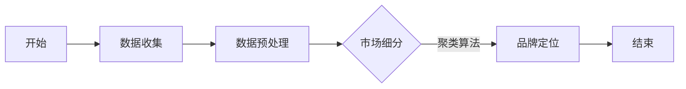
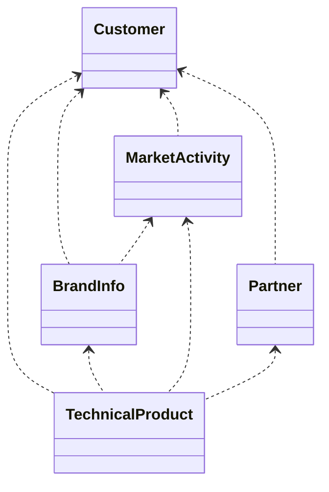
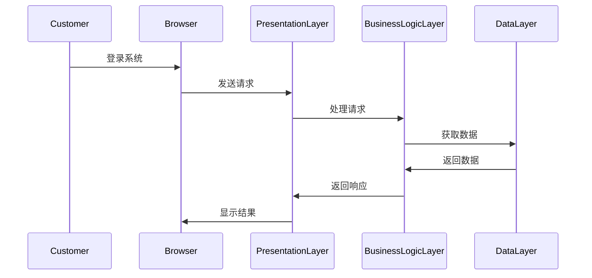
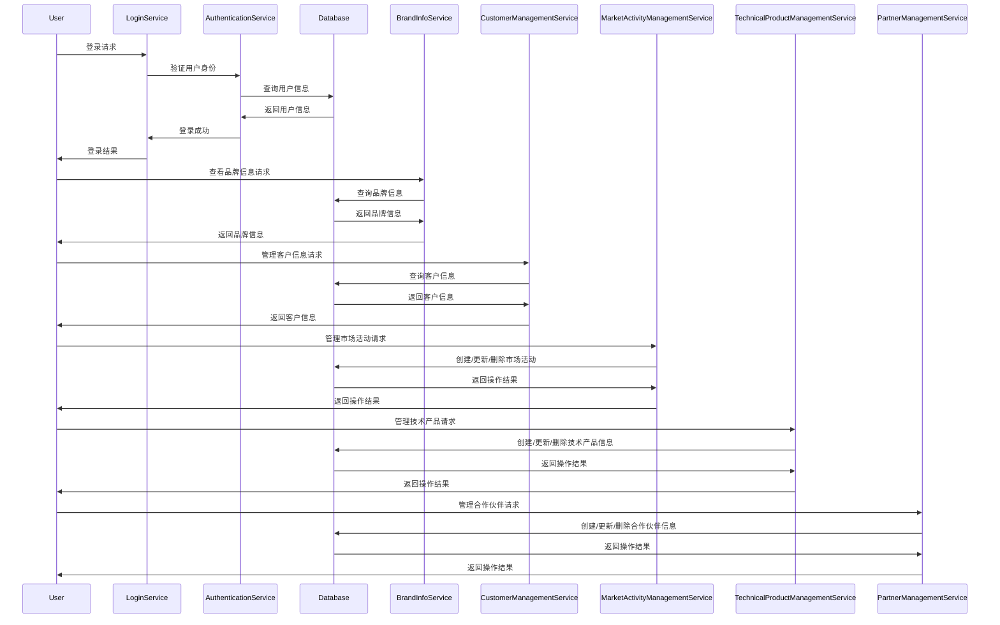

                 

# 如何进行有效的技术品牌建设

## 关键词

- 技术品牌建设
- 品牌定位
- 品牌传播
- 技术优势
- 消费者关系

## 摘要

随着科技产业的迅猛发展，技术品牌建设成为了企业竞争的重要手段。本文将从核心概念、品牌建设策略、品牌传播与消费者关系等多个方面，系统地探讨如何进行有效的技术品牌建设。通过深入分析技术品牌建设的步骤和方法，旨在为企业提供一套切实可行的品牌建设方案，助力其在激烈的市场竞争中脱颖而出。

## 引言

### 1.1 技术品牌建设的意义

在数字化时代，技术品牌已经不仅仅是一个企业的标识，更是其核心竞争力的体现。技术品牌建设是企业通过构建和传播独特的品牌形象，从而获得消费者认可和忠诚度的过程。有效的技术品牌建设能够提升企业的市场地位，增强品牌影响力，为企业创造持续的价值。

### 1.2 本文目的与读者对象

本文旨在为从事技术品牌建设的企业提供系统性指导，帮助其理解技术品牌建设的核心概念，掌握有效的品牌建设策略，并能够将其付诸实践。本文适合企业高层管理者、品牌经理、市场营销人员以及所有对技术品牌建设感兴趣的专业人士阅读。

## 核心概念与原则

### 2.1 技术品牌的定义

技术品牌是企业在技术领域内的形象代表，它涵盖了企业的技术能力、创新精神、服务质量等多个方面。技术品牌不仅是企业的标识，更是其技术价值的体现。

### 2.2 技术品牌建设的关键原则

#### 2.2.1 明确品牌定位

品牌定位是技术品牌建设的首要任务。通过明确品牌的核心价值和差异化优势，企业能够更精准地吸引目标消费者。

#### 2.2.2 塑造独特品牌形象

独特的品牌形象是技术品牌建设的关键。企业需要通过视觉设计、品牌语言和品牌故事等手段，打造出与众不同的品牌形象。

#### 2.2.3 融合技术与创新

技术品牌建设需要紧密融合企业的技术能力和创新精神。通过持续的技术研发和创新，企业能够不断推出具有竞争力的产品和服务。

#### 2.2.4 建立消费者关系

消费者关系是技术品牌建设的重要组成部分。通过建立良好的消费者关系，企业能够增强品牌忠诚度，提升品牌美誉度。

## 建设一个强大的技术品牌

### 3.1 确立独特的品牌身份

#### 3.1.1 确定独特的价值主张

独特的价值主张是品牌身份的核心。企业需要明确自身在技术领域的独特优势和价值，并将其融入到品牌定位中。

#### 3.1.2 创建有吸引力的品牌故事

品牌故事是品牌形象的重要组成部分。通过讲述一个有吸引力的品牌故事，企业能够更好地传达品牌价值观和品牌理念。

### 3.2 利用技术推动品牌建设

#### 3.2.1 技术在品牌传播中的作用

在数字化时代，技术成为了品牌传播的重要工具。通过社交媒体、搜索引擎优化（SEO）和大数据分析等技术手段，企业能够更有效地传播品牌信息。

#### 3.2.2 技术驱动的品牌创新

技术驱动的品牌创新能够为企业带来独特的竞争优势。通过不断引入新技术和新产品，企业能够持续提升品牌价值。

### 3.3 建立信任和信誉

#### 3.3.1 信任在品牌建设中的重要性

信任是消费者选择品牌的重要因素。建立信任和信誉是技术品牌建设的关键步骤。

#### 3.3.2 增强品牌信任的策略

企业可以通过提供高质量的产品和服务、透明化的运营方式以及积极的消费者互动来增强品牌信任。

### 3.4 保持品牌信息一致性

#### 3.4.1 品牌一致性的重要性

品牌一致性能够增强品牌认知度和消费者忠诚度。企业需要在所有品牌触点上保持一致的品牌形象和品牌语言。

#### 3.4.2 实现品牌一致性的策略

企业可以通过制定详细的品牌指南、定期培训员工以及统一品牌传播策略来实现品牌一致性。

## 实施有效的品牌建设策略

### 4.1 制定品牌策略

#### 4.1.1 品牌策略的制定过程

品牌策略的制定需要从市场分析、品牌定位、目标消费者识别等多个方面进行深入分析。

#### 4.1.2 品牌策略的核心要素

品牌策略的核心要素包括品牌愿景、品牌使命、品牌核心价值等。

### 4.2 制定品牌规划

#### 4.2.1 品牌规划的内容

品牌规划包括品牌建设的目标、实施步骤、资源分配等。

#### 4.2.2 品牌规划的实施策略

品牌规划的实施策略包括市场推广、产品创新、客户服务等多个方面。

### 4.3 监测品牌绩效

#### 4.3.1 品牌绩效的重要性

品牌绩效的监测能够帮助企业了解品牌建设的效果，并及时调整策略。

#### 4.3.2 品牌绩效的评估方法

品牌绩效的评估方法包括品牌知名度、品牌忠诚度、品牌美誉度等多个指标。

## 项目实战

### 5.1 项目背景介绍

#### 5.1.1 企业背景

#### 5.1.2 项目目标

#### 5.1.3 项目挑战

### 5.2 系统功能设计

#### 5.2.1 领域模型

#### 5.2.2 功能需求分析

### 5.3 系统架构设计

#### 5.3.1 系统架构概述

#### 5.3.2 系统模块划分

### 5.4 系统接口设计

#### 5.4.1 接口规范

#### 5.4.2 接口实现

### 5.5 系统交互设计

#### 5.5.1 交互流程

#### 5.5.2 交互界面设计

### 5.6 系统核心实现

#### 5.6.1 系统核心代码

#### 5.6.2 代码应用解读

### 5.7 实际案例分析

#### 5.7.1 案例背景

#### 5.7.2 案例分析

### 5.8 项目小结

#### 5.8.1 项目成果

#### 5.8.2 项目总结

## 最佳实践 Tips

### 6.1 品牌建设关键点

### 6.2 品牌传播策略

### 6.3 消费者关系维护

## 小结

## 注意事项

## 拓展阅读

### 参考文献

## 作者信息

作者：AI天才研究院/AI Genius Institute & 禅与计算机程序设计艺术 /Zen And The Art of Computer Programming

----------------------------------------------------------------

### 1. 引言

#### 1.1 技术品牌建设的意义

在当今的数字化时代，技术品牌建设已经成为企业成功的关键因素之一。随着互联网和科技的迅速发展，消费者对技术产品的需求和期望也在不断提高。技术品牌不仅是企业形象的象征，更是企业技术实力和产品品质的保证。有效的技术品牌建设可以帮助企业树立良好的市场形象，提升品牌影响力，增强消费者信任，从而在激烈的市场竞争中占据有利地位。

技术品牌建设的意义主要体现在以下几个方面：

1. **提升品牌认知度**：通过有效的品牌建设和推广，企业可以在消费者心中建立深刻的品牌印象，提高品牌知名度和认知度。
2. **增强品牌忠诚度**：通过提供高质量的产品和服务，以及与消费者的有效互动，企业可以培养消费者的忠诚度，降低客户流失率。
3. **塑造独特品牌形象**：通过独特的品牌定位和品牌故事，企业可以塑造出与众不同的品牌形象，增强品牌的个性和独特性。
4. **提升市场竞争力**：技术品牌建设可以帮助企业更好地应对市场变化和竞争挑战，提升市场竞争力，实现可持续发展。

#### 1.2 本文目的与读者对象

本文旨在为从事技术品牌建设的企业和专业人士提供系统性指导，帮助其理解技术品牌建设的核心概念和策略，掌握有效的品牌建设方法和技巧。本文适合以下读者群体：

- 企业高层管理者：需要了解品牌建设对企业战略发展的重要性，掌握品牌建设的整体策略。
- 品牌经理和市场营销人员：需要深入掌握品牌建设的具体实施方法和技巧，提升品牌管理效率。
- 技术专家和研发人员：需要理解品牌建设与技术创新的关联，为品牌建设提供技术支持。
- 对技术品牌建设感兴趣的其他专业人士：希望了解技术品牌建设的相关知识和实践经验。

本文将按照以下结构进行展开：

1. **核心概念与原则**：介绍技术品牌建设的核心概念和基本原则，包括品牌定位、品牌形象塑造、技术创新等。
2. **建设一个强大的技术品牌**：探讨如何通过确立品牌身份、利用技术推动品牌建设、建立信任和信誉、保持品牌信息一致性等手段，构建一个强大的技术品牌。
3. **实施有效的品牌建设策略**：分析品牌策略的制定、品牌规划的执行、品牌绩效的监测等策略，提供具体的实施方法和案例。
4. **项目实战**：通过一个实际项目案例，详细阐述技术品牌建设的全过程，包括系统功能设计、系统架构设计、系统接口设计、系统交互设计等。
5. **最佳实践 Tips**：总结品牌建设的关键点和实践经验，为读者提供实用的操作指南。
6. **小结**：回顾技术品牌建设的重要性和本文的主要观点。
7. **注意事项**：提醒读者在品牌建设过程中需要注意的事项和潜在问题。
8. **拓展阅读**：推荐相关的参考文献和阅读资源，供读者进一步学习和探索。

通过本文的阅读，读者将能够系统地了解技术品牌建设的理论和方法，掌握品牌建设的实战技巧，为企业在技术领域的品牌建设提供有力支持。

#### 1.3 文章结构

为了确保文章内容的逻辑性和系统性，本文将采用以下章节结构：

1. **引言**：介绍技术品牌建设的意义和本文目的，概述文章结构。
2. **核心概念与原则**：详细阐述技术品牌建设的相关概念和基本原则。
3. **建设一个强大的技术品牌**：探讨如何通过多种手段构建强大的技术品牌。
4. **实施有效的品牌建设策略**：分析品牌策略的制定和实施过程。
5. **项目实战**：通过一个实际项目案例，展示品牌建设的全过程。
6. **最佳实践 Tips**：提供实用的品牌建设操作指南。
7. **小结**：总结技术品牌建设的重要性和本文的主要观点。
8. **注意事项**：提醒品牌建设过程中需要注意的事项。
9. **拓展阅读**：推荐相关阅读资源。

通过这样的结构安排，本文旨在为读者提供一个全面、系统的技术品牌建设指南。

### 2. 核心概念与原则

#### 2.1 技术品牌的定义

技术品牌是指企业在技术领域内的品牌形象和品牌价值，它不仅仅是企业的标识，更是企业技术能力、创新能力、产品品质和客户服务的综合体现。一个强大的技术品牌能够在消费者心中建立起对企业的信任和认可，从而提升企业的市场竞争力。

技术品牌具有以下特点：

1. **专业性**：技术品牌通常具有深厚的专业知识和技术背景，能够在行业内树立权威形象。
2. **创新性**：技术品牌强调技术创新，不断推出具有前瞻性的产品和服务。
3. **可靠性**：技术品牌注重产品和服务质量，以客户需求为导向，提供稳定可靠的技术解决方案。
4. **可持续性**：技术品牌致力于长期发展，通过持续创新和优化，保持市场竞争力。

#### 2.2 品牌定位

品牌定位是品牌建设的基础，它决定了品牌在市场中的独特位置和目标消费者。成功的品牌定位需要明确以下要素：

1. **目标市场**：明确品牌服务的市场和目标客户群体，包括市场规模、消费需求、竞争环境等。
2. **品牌核心价值**：确定品牌的核心价值和独特卖点，使品牌在众多竞争者中脱颖而出。
3. **差异化优势**：分析竞争对手的优势和劣势，找出品牌的差异化优势，打造独特的品牌形象。

#### 2.3 品牌形象塑造

品牌形象是消费者对品牌的总体印象，它通过品牌的视觉设计、语言表达和故事叙述来传达品牌的核心价值和品牌个性。一个成功的品牌形象能够吸引消费者的注意力，增强品牌认知度和忠诚度。

品牌形象塑造的关键要素包括：

1. **品牌标识**：包括品牌名称、标志、标准字体等，是品牌视觉识别的核心元素。
2. **品牌色彩**：选择能够代表品牌个性和价值的颜色，增强品牌的视觉冲击力。
3. **品牌语言**：建立统一的品牌语言体系，包括品牌口号、广告语、文案等，传达品牌的核心价值观和品牌形象。
4. **品牌故事**：通过讲述品牌的发展历程、创新故事和客户见证，增强品牌的情感共鸣和信任度。

#### 2.4 技术创新

技术创新是技术品牌建设的重要驱动力，它能够为品牌带来持续的竞争优势和品牌价值。一个注重技术创新的品牌能够在市场中保持领先地位，满足消费者的不断变化的需求。

技术创新的实践要点包括：

1. **持续研发投入**：保持对技术研发的持续投入，确保技术领先优势。
2. **开放式创新**：通过开放合作，整合外部资源和技术，加速创新进程。
3. **客户参与**：通过客户反馈和市场调研，了解客户需求，引导技术创新方向。
4. **知识产权保护**：通过专利、版权等手段保护技术创新成果，防止技术抄袭和侵权。

#### 2.5 建立消费者关系

建立良好的消费者关系是技术品牌建设的重要组成部分，它能够增强品牌忠诚度和口碑传播。通过有效的消费者关系管理，企业能够更好地了解消费者需求，提供个性化的产品和服务，从而提升消费者满意度和忠诚度。

建立消费者关系的实践要点包括：

1. **消费者洞察**：通过市场调研、数据分析等方式，深入理解消费者行为和需求。
2. **客户互动**：通过社交媒体、在线社区、客户服务等多种渠道，与消费者建立互动关系。
3. **个性化服务**：根据消费者的不同需求和偏好，提供个性化的产品和服务。
4. **客户体验优化**：通过优化产品体验、提升服务质量，增强消费者满意度和忠诚度。

#### 2.6 品牌一致性

品牌一致性是确保品牌形象和信息在所有渠道和触点上保持一致的重要策略。品牌一致性能够增强品牌的认知度和忠诚度，提升品牌的市场竞争力。

品牌一致性的实践要点包括：

1. **品牌指南制定**：制定详细的品牌指南，明确品牌标准、视觉设计和语言规范。
2. **员工培训**：定期对员工进行品牌培训和指导，确保品牌信息的准确传达和执行。
3. **渠道管理**：统一管理所有品牌传播渠道，确保品牌信息的一致性和连贯性。
4. **品牌监测**：通过品牌监测工具，定期检查品牌传播效果和一致性程度，及时调整和优化品牌策略。

### 2.7 背景介绍

#### 2.7.1 核心概念术语说明

为了更好地理解技术品牌建设的核心概念，我们需要明确一些关键术语的定义：

- **技术品牌**：企业在技术领域内的品牌形象和品牌价值。
- **品牌定位**：确定品牌在市场中的独特位置和目标消费者。
- **品牌形象**：消费者对品牌的总体印象，包括视觉设计、语言表达和故事叙述。
- **技术创新**：通过研发和技术改进，推动品牌持续发展。
- **消费者关系**：企业与消费者之间的互动和信任关系。
- **品牌一致性**：确保品牌形象和信息在所有渠道和触点上保持一致。

#### 2.7.2 问题背景

在当前市场竞争激烈的背景下，企业需要通过有效的品牌建设来提升市场竞争力。技术品牌建设作为企业品牌战略的重要组成部分，对于企业在技术领域的长期发展至关重要。然而，许多企业在技术品牌建设方面面临着以下挑战：

1. **品牌定位不清晰**：部分企业缺乏明确的品牌定位，导致品牌形象模糊，难以在消费者心中建立深刻印象。
2. **品牌形象不统一**：品牌形象在不同渠道和触点上的不一致，导致消费者对品牌的认知混乱。
3. **技术创新不足**：缺乏持续的技术研发投入，导致品牌在技术领域内缺乏竞争优势。
4. **消费者关系管理不到位**：对消费者需求的理解不足，缺乏有效的消费者互动和服务。

#### 2.7.3 问题描述

技术品牌建设存在的问题主要体现在以下几个方面：

1. **品牌认知度不高**：企业品牌在市场上的认知度较低，难以吸引目标消费者。
2. **品牌忠诚度低**：消费者对企业品牌的忠诚度不高，容易转向竞争对手。
3. **品牌形象不佳**：品牌形象不够独特，缺乏鲜明的个性特征，难以在消费者心中形成深刻印象。
4. **技术创新乏力**：缺乏持续的技术创新，导致品牌在技术领域内的竞争力不足。
5. **消费者关系管理不到位**：对消费者需求的理解不足，缺乏有效的消费者互动和服务，导致客户满意度和忠诚度低。

#### 2.7.4 问题解决

为了解决上述问题，企业需要采取以下策略：

1. **明确品牌定位**：通过市场调研和数据分析，明确品牌定位，打造独特的品牌形象。
2. **统一品牌形象**：制定详细的品牌指南，确保品牌形象在不同渠道和触点上保持一致。
3. **加强技术创新**：加大技术研发投入，推动技术创新，保持技术领先优势。
4. **优化消费者关系管理**：通过消费者洞察和个性化服务，提升消费者满意度和忠诚度。

#### 2.7.5 边界与外延

技术品牌建设不仅涉及企业内部的管理和运营，还涉及市场推广、消费者互动等多个方面。其边界与外延包括：

1. **市场定位**：确定品牌服务的市场和目标客户群体。
2. **品牌传播**：通过多种渠道和手段，传播品牌信息，提升品牌知名度。
3. **消费者关系**：建立和维护与消费者的互动关系，提升客户满意度和忠诚度。
4. **技术创新**：持续推动技术创新，保持技术领先优势。

#### 2.7.6 概念结构与核心要素组成

技术品牌建设是一个复杂的过程，涉及到多个核心概念和要素。其概念结构包括以下几个方面：

1. **品牌定位**：明确品牌在市场中的独特位置和目标消费者。
2. **品牌形象**：通过视觉设计、语言表达和故事叙述，塑造独特的品牌形象。
3. **技术创新**：持续推动技术创新，保持技术领先优势。
4. **消费者关系**：建立和维护与消费者的互动关系，提升客户满意度和忠诚度。
5. **品牌一致性**：确保品牌形象和信息在所有渠道和触点上保持一致。

通过以上核心概念和要素的有机组合，企业可以构建一个强大的技术品牌，提升市场竞争力，实现长期发展。

### 2.8 核心概念与联系

在技术品牌建设中，核心概念和联系是理解品牌建设过程中的关键要素。以下是对核心概念及其相互关系的详细阐述。

#### 2.8.1 核心概念

**品牌定位**：品牌定位是技术品牌建设的基础。它决定了品牌在市场中的独特位置，帮助企业在众多竞争者中脱颖而出。品牌定位需要考虑目标市场、目标消费者和品牌差异化优势。

**品牌形象**：品牌形象是消费者对品牌的总体印象，包括品牌的视觉设计、语言表达和故事叙述。一个成功的品牌形象能够传达品牌的核心价值和个性，增强品牌认知度和忠诚度。

**技术创新**：技术创新是技术品牌建设的驱动力。通过不断的技术研发和产品创新，企业能够保持技术领先地位，满足消费者不断变化的需求，提升品牌竞争力。

**消费者关系**：消费者关系是品牌建设的重要组成部分。通过有效的消费者关系管理，企业能够更好地了解消费者需求，提供个性化服务，增强消费者满意度和忠诚度。

**品牌一致性**：品牌一致性确保品牌形象和信息在所有渠道和触点上保持一致。一致性能够增强品牌认知度，提升品牌的专业性和可靠性。

#### 2.8.2 概念属性特征对比表格

以下是一个对比品牌定位、品牌形象、技术创新、消费者关系和品牌一致性的属性特征表格：

| 概念          | 属性特征                                     |
| ------------- | ------------------------------------------ |
| 品牌定位      | 市场目标、差异化优势、品牌目标               |
| 品牌形象      | 视觉设计、语言表达、品牌故事、品牌个性       |
| 技术创新      | 研发投入、技术领先、产品创新、市场响应       |
| 消费者关系    | 消费者洞察、客户服务、个性化体验、忠诚度     |
| 品牌一致性    | 品牌标准、渠道管理、信息传达、品牌认知度     |

通过对比表格，我们可以更清晰地看到每个概念的核心特征和相互关系。

#### 2.8.3 ER实体关系图架构

为了进一步理解这些核心概念之间的联系，我们可以使用ER（实体-关系）图来展示它们的关系。以下是技术品牌建设中的核心实体及其关系的ER图：

```mermaid
erDiagram
  Customer ||--o{ Brand} : has
  Brand ||--o{ Positioning} : includes
  Brand ||--o{ Image} : includes
  Brand ||--o{ Innovation} : includes
  Brand ||--o{ Consistency} : includes
  Brand ||--o{ ConsumerRelationship} : includes
```

在这个ER图中，"Brand"（品牌）是中心实体，它与其他实体（"Positioning"（品牌定位）、"Image"（品牌形象）、"Innovation"（技术创新）、"Consistency"（品牌一致性）和"ConsumerRelationship"（消费者关系））之间存在包含关系。这表明品牌是由这些核心要素共同构建的，每个要素都对品牌建设有重要影响。

### 2.9 算法原理讲解

在技术品牌建设中，算法原理的运用可以帮助企业更精准地定位市场、优化消费者关系管理和提升品牌一致性。以下将详细介绍一个用于品牌定位和市场分析的算法原理，并使用Python代码进行演示。

#### 2.9.1 算法原理

品牌定位算法通常基于市场分析和消费者行为数据，通过机器学习算法对市场细分，识别目标消费者群体，并制定相应的品牌定位策略。以下是一个基于聚类算法（如K-means算法）的品牌定位过程：

1. **数据收集**：收集有关市场数据和消费者行为数据，包括消费者的人口统计信息、购买行为、偏好等。
2. **数据预处理**：对收集的数据进行清洗和标准化处理，去除噪声数据和缺失值。
3. **市场细分**：使用聚类算法对市场数据进行分类，识别不同的消费者群体。
4. **品牌定位**：根据聚类结果，制定品牌定位策略，明确品牌的核心价值和差异化优势。

#### 2.9.2 算法流程图

以下是品牌定位算法的流程图：



#### 2.9.3 Python代码演示

以下是一个使用Python和scikit-learn库实现K-means算法的品牌定位示例：

```python
import numpy as np
from sklearn.cluster import KMeans
from sklearn.preprocessing import StandardScaler

# 假设我们有一组消费者数据，包括年龄、收入、购买行为等特征
data = np.array([[25, 50000, 1], [30, 60000, 2], [40, 80000, 3], [22, 40000, 1], [28, 55000, 2]])

# 数据标准化处理
scaler = StandardScaler()
data_normalized = scaler.fit_transform(data)

# 使用K-means算法进行聚类
kmeans = KMeans(n_clusters=2, random_state=0).fit(data_normalized)

# 输出聚类结果
print("聚类中心：", kmeans.cluster_centers_)
print("每个消费者的聚类标签：", kmeans.labels_)

# 根据聚类结果进行品牌定位
# 假设聚类标签0对应的目标消费者群体为“年轻消费者”，聚类标签1对应的目标消费者群体为“成熟消费者”
if kmeans.labels_[0] == 0:
    print("品牌定位：吸引年轻消费者，强调创新和时尚")
else:
    print("品牌定位：吸引成熟消费者，强调质量和稳定性")
```

#### 2.9.4 算法原理讲解

**1. 数据收集**：

数据收集是品牌定位的基础，需要收集有关市场环境和消费者行为的各类数据。这些数据可以来源于市场调研、消费者调查、销售记录等。

**2. 数据预处理**：

数据预处理包括数据清洗和标准化处理。数据清洗旨在去除噪声数据和缺失值，确保数据的准确性和完整性。标准化处理则将不同特征的数据进行归一化，使其具有可比性。

**3. 市场细分**：

市场细分是使用聚类算法对市场数据进行分析，识别不同的消费者群体。K-means算法是一种常用的聚类算法，它通过迭代过程将数据划分为K个簇，每个簇代表一个消费者群体。

**4. 品牌定位**：

根据聚类结果，企业可以制定相应的品牌定位策略。例如，针对不同消费者群体的特点，制定相应的产品特性、营销策略和品牌传播内容。

#### 2.9.5 举例说明

**例1**：假设聚类结果如下：

- 聚类中心：\[ [25.0, 55000.0, 1.5] \]
- 每个消费者的聚类标签：\[ [0, 1, 0, 0, 1] \]

**解释**：

根据聚类结果，我们可以得出以下品牌定位策略：

- **年轻消费者**（聚类标签0）：品牌应吸引年轻消费者，强调创新和时尚。
- **成熟消费者**（聚类标签1）：品牌应吸引成熟消费者，强调质量和稳定性。

通过以上算法示例，我们可以看到品牌定位算法如何帮助企业在复杂的市场环境中识别目标消费者群体，并制定相应的品牌定位策略。这有助于企业更有效地进行市场推广和品牌建设，提升品牌竞争力。

### 3. 建设一个强大的技术品牌

在构建一个强大的技术品牌时，企业需要从多个方面入手，确保品牌的独特性和市场竞争力。以下将详细探讨如何确立独特的品牌身份、利用技术推动品牌建设、建立信任和信誉以及保持品牌信息一致性。

#### 3.1 确立独特的品牌身份

确立独特的品牌身份是技术品牌建设的第一步。一个独特的品牌身份可以帮助企业在市场中脱颖而出，吸引目标消费者的注意。

**3.1.1 确定独特的价值主张**

独特的价值主张（Unique Value Proposition, UVP）是品牌身份的核心。它明确了品牌为什么值得消费者选择，以及品牌相较于竞争对手的独特优势。制定独特的价值主张需要考虑以下方面：

- **消费者需求**：了解目标消费者的需求，分析他们的痛点和期望。
- **竞争分析**：研究竞争对手的产品和服务，找出品牌可以超越的地方。
- **品牌定位**：根据品牌定位，明确品牌的核心价值和差异化优势。

例如，一家专注于人工智能技术的企业，可以将独特的价值主张定位为“通过先进的人工智能技术，提供高效、可靠的解决方案，助力企业智能化转型”。

**3.1.2 创建有吸引力的品牌故事**

品牌故事是品牌身份的重要组成部分。一个有吸引力的品牌故事可以传达品牌的价值观、使命和愿景，增强消费者对品牌的情感认同。

创建品牌故事时，企业可以考虑以下步骤：

- **故事背景**：讲述品牌创立的起源和发展历程，体现品牌的历史和文化底蕴。
- **故事主体**：塑造品牌主人公，如创始人、核心团队成员等，展示他们的价值观和行为准则。
- **故事情节**：通过真实或虚构的故事情节，展示品牌如何解决消费者的问题和挑战。
- **故事高潮**：强调品牌的独特优势和价值，使消费者产生共鸣。

例如，一家专注于绿色能源技术的企业，可以讲述品牌如何从一个小型创业公司发展成为行业领先的绿色能源解决方案提供商，展示了品牌的创新精神和可持续发展理念。

**3.1.3 塑造独特的品牌视觉设计**

品牌视觉设计是品牌身份的视觉表达，包括品牌标识、色彩搭配、字体设计等。一个独特的品牌视觉设计可以提升品牌的辨识度和记忆度。

塑造独特的品牌视觉设计时，企业可以考虑以下方面：

- **品牌标识**：设计一个简洁、易记、具有象征意义的品牌标识，如Logo、品牌标志等。
- **色彩搭配**：选择能够代表品牌个性和价值观的颜色，如蓝色代表科技和可靠，绿色代表环保和可持续发展。
- **字体设计**：选择适合品牌风格的字体，如简洁的字体传达现代感，书法字体传达传统文化。

例如，一家专注于健康科技的企业，可以选择蓝色作为主色调，传达科技和健康的品牌理念，同时使用简洁的字体设计，展现品牌的现代感和专业性。

#### 3.2 利用技术推动品牌建设

技术是推动品牌建设的重要力量。通过技术创新和数字化手段，企业可以提升品牌竞争力，增强品牌影响力。

**3.2.1 技术在品牌传播中的作用**

在数字化时代，技术手段在品牌传播中发挥着至关重要的作用。以下是一些关键技术手段：

- **社交媒体**：利用社交媒体平台（如微博、微信、Instagram等）进行品牌传播，与消费者进行互动和沟通。
- **搜索引擎优化（SEO）**：通过优化网站内容和结构，提高品牌在搜索引擎中的排名，吸引潜在消费者。
- **内容营销**：通过撰写高质量的博客文章、视频、白皮书等内容，提升品牌的专业形象和影响力。
- **大数据分析**：利用大数据分析技术，了解消费者行为和需求，制定精准的品牌传播策略。

**3.2.2 技术驱动的品牌创新

技术驱动的品牌创新是提升品牌竞争力的关键。通过引入新技术和新产品，企业可以不断推出具有竞争力的产品和服务，满足消费者的需求。

以下是一些技术驱动的品牌创新策略：

- **人工智能（AI）**：利用人工智能技术，开发智能客服、智能推荐、智能营销等应用，提升用户体验和满意度。
- **区块链技术**：利用区块链技术，确保产品供应链的透明性和可追溯性，增强消费者信任。
- **物联网（IoT）**：利用物联网技术，构建智能家庭、智能工厂等应用场景，提升产品功能和服务质量。
- **虚拟现实（VR）和增强现实（AR）**：利用VR和AR技术，提供沉浸式的购物体验和营销活动，吸引消费者的关注。

**3.2.3 数字化品牌建设工具

为了高效地推动品牌建设，企业可以利用多种数字化工具和平台。以下是一些常用的数字化品牌建设工具：

- **品牌管理平台**：如品牌资产管理系统、数字资产管理系统等，帮助企业管理品牌标识、品牌内容等。
- **营销自动化工具**：如营销自动化平台、邮件营销工具等，帮助企业自动化营销流程，提高营销效率。
- **数据分析工具**：如Google Analytics、Tableau等，帮助分析消费者行为和品牌传播效果，优化品牌策略。
- **社交媒体管理工具**：如Hootsuite、Buffer等，帮助管理社交媒体账号，提高社交媒体营销效果。

#### 3.3 建立信任和信誉

建立信任和信誉是技术品牌建设的重要目标之一。信任是消费者选择品牌的重要因素，而信誉则是品牌在市场中的口碑和声誉。

**3.3.1 信任在品牌建设中的重要性**

信任是品牌与消费者之间的一种心理契约，它决定了消费者是否愿意持续选择品牌。建立信任的关键在于：

- **产品和服务质量**：提供高质量的产品和服务，确保消费者满意度。
- **透明度和诚信**：在经营活动中保持透明度和诚信，树立良好的企业形象。
- **客户反馈**：积极倾听客户反馈，及时解决问题，提升客户体验。

**3.3.2 增强品牌信任的策略**

以下是一些增强品牌信任的策略：

- **提供优质内容**：通过撰写高质量的博客文章、技术白皮书、案例分析等，展示品牌的专业能力和技术创新。
- **获得权威认证**：通过获得行业认证和奖项，提升品牌的公信力和权威性。
- **客户见证和推荐**：通过客户见证、推荐和评价，展示品牌的优势和可靠性。
- **参与公益活动**：通过参与社会公益活动，提升品牌的社会责任感和公众形象。

**3.3.3 建立信誉的长期策略**

建立信誉是一个长期的过程，需要企业持续的努力和投入。以下是一些建立信誉的长期策略：

- **保持一致性**：在品牌形象、品牌传播和产品服务等方面保持一致性，确保品牌形象和信誉的稳定。
- **持续创新**：通过持续的技术创新和产品创新，保持品牌的领先地位和竞争优势。
- **积极沟通**：与消费者、合作伙伴和行业专家保持积极沟通，提升品牌在行业内的声誉和影响力。
- **危机管理**：制定危机管理计划，及时应对品牌危机，防止信誉受损。

#### 3.4 保持品牌信息一致性

品牌信息一致性是确保品牌形象和品牌信息在所有渠道和触点上保持一致的关键。一致性能够增强品牌的认知度和忠诚度，提升品牌的专业性和可靠性。

**3.4.1 品牌一致性的重要性**

品牌一致性对于品牌建设具有以下重要性：

- **增强品牌认知度**：通过统一的品牌形象和品牌信息，消费者能够更容易记住和识别品牌，提升品牌知名度。
- **提升品牌忠诚度**：品牌一致性能够提供一致的消费者体验，增强消费者对品牌的信任和忠诚度。
- **提升品牌专业性**：统一的品牌信息传达出品牌的专业性和权威性，提升品牌的市场地位。
- **降低沟通成本**：品牌一致性减少了内部沟通和协调的成本，提高了运营效率。

**3.4.2 实现品牌一致性的策略**

以下是一些实现品牌一致性的策略：

- **制定品牌指南**：制定详细的品牌指南，包括品牌标识、视觉设计、语言表达、品牌故事等，确保品牌信息的一致性。
- **员工培训**：定期对员工进行品牌培训和指导，确保员工了解和遵循品牌指南。
- **渠道管理**：统一管理所有品牌传播渠道，包括官方网站、社交媒体、线下活动等，确保品牌信息的一致性和连贯性。
- **品牌监测**：通过品牌监测工具，定期检查品牌传播效果和一致性程度，及时调整和优化品牌策略。

#### 3.5 背景介绍

**3.5.1 核心概念术语说明**

在探讨如何建设一个强大的技术品牌时，我们需要理解以下几个核心概念：

- **品牌定位**：品牌在市场中的独特位置和目标消费者。
- **品牌形象**：消费者对品牌的总体印象，包括视觉设计、语言表达和故事叙述。
- **技术创新**：通过研发和技术改进，推动品牌持续发展。
- **消费者关系**：企业与消费者之间的互动和信任关系。
- **品牌一致性**：品牌形象和信息在所有渠道和触点上保持一致。

**3.5.2 问题背景**

在当前市场竞争激烈的背景下，企业需要通过有效的品牌建设来提升市场竞争力。技术品牌建设作为企业品牌战略的重要组成部分，对于企业在技术领域的长期发展至关重要。然而，许多企业在技术品牌建设方面面临着以下挑战：

- **品牌定位不清晰**：部分企业缺乏明确的品牌定位，导致品牌形象模糊，难以在消费者心中建立深刻印象。
- **品牌形象不统一**：品牌形象在不同渠道和触点上的不一致，导致消费者对品牌的认知混乱。
- **技术创新不足**：缺乏持续的技术研发投入，导致品牌在技术领域内缺乏竞争优势。
- **消费者关系管理不到位**：对消费者需求的理解不足，缺乏有效的消费者互动和服务。

**3.5.3 问题描述**

技术品牌建设存在的问题主要体现在以下几个方面：

- **品牌认知度不高**：企业品牌在市场上的认知度较低，难以吸引目标消费者。
- **品牌忠诚度低**：消费者对企业品牌的忠诚度不高，容易转向竞争对手。
- **品牌形象不佳**：品牌形象不够独特，缺乏鲜明的个性特征，难以在消费者心中形成深刻印象。
- **技术创新乏力**：缺乏持续的技术创新，导致品牌在技术领域内的竞争力不足。
- **消费者关系管理不到位**：对消费者需求的理解不足，缺乏有效的消费者互动和服务，导致客户满意度和忠诚度低。

**3.5.4 问题解决**

为了解决上述问题，企业需要采取以下策略：

- **明确品牌定位**：通过市场调研和数据分析，明确品牌定位，打造独特的品牌形象。
- **统一品牌形象**：制定详细的品牌指南，确保品牌形象在不同渠道和触点上保持一致。
- **加强技术创新**：加大技术研发投入，推动技术创新，保持技术领先优势。
- **优化消费者关系管理**：通过消费者洞察和个性化服务，提升消费者满意度和忠诚度。

**3.5.5 边界与外延**

技术品牌建设不仅涉及企业内部的管理和运营，还涉及市场推广、消费者互动等多个方面。其边界与外延包括：

- **市场定位**：确定品牌服务的市场和目标客户群体。
- **品牌传播**：通过多种渠道和手段，传播品牌信息，提升品牌知名度。
- **消费者关系**：建立和维护与消费者的互动关系，提升客户满意度和忠诚度。
- **技术创新**：持续推动技术创新，保持技术领先优势。
- **品牌一致性**：确保品牌形象和信息在所有渠道和触点上保持一致。

**3.5.6 概念结构与核心要素组成**

技术品牌建设是一个复杂的过程，涉及到多个核心概念和要素。其概念结构包括以下几个方面：

- **品牌定位**：明确品牌在市场中的独特位置和目标消费者。
- **品牌形象**：通过视觉设计、语言表达和故事叙述，塑造独特的品牌形象。
- **技术创新**：持续推动技术创新，保持技术领先优势。
- **消费者关系**：建立和维护与消费者的互动关系，提升客户满意度和忠诚度。
- **品牌一致性**：确保品牌形象和信息在所有渠道和触点上保持一致。

通过以上核心概念和要素的有机组合，企业可以构建一个强大的技术品牌，提升市场竞争力，实现长期发展。

### 4. 实施有效的品牌建设策略

在技术品牌建设中，实施有效的品牌建设策略是关键。有效的品牌策略不仅能够帮助企业明确品牌建设的目标和方向，还能够通过系统的规划和执行，提升品牌影响力和市场竞争力。以下将详细探讨品牌策略的制定、品牌规划的执行以及品牌绩效的监测。

#### 4.1 制定品牌策略

品牌策略的制定是品牌建设的第一步，它需要企业从多个维度进行全面的分析和规划。

**4.1.1 品牌策略的制定过程**

制定品牌策略通常包括以下几个步骤：

1. **市场分析**：通过对市场环境、目标消费者和竞争对手的深入分析，了解市场趋势和机会。
2. **品牌定位**：明确品牌在市场中的独特位置，确定目标消费者和品牌差异化优势。
3. **品牌愿景与使命**：定义品牌的长期愿景和使命，为品牌建设提供方向和动力。
4. **品牌核心价值**：确定品牌的核心价值，为品牌传播和品牌行为提供指导原则。
5. **品牌战略**：制定具体的品牌战略，包括品牌传播、产品策略、客户关系管理等方面的内容。

**4.1.2 品牌策略的核心要素**

一个有效的品牌策略通常包含以下几个核心要素：

- **目标市场**：明确品牌服务的市场和目标客户群体，包括市场规模、消费需求、竞争环境等。
- **品牌定位**：确定品牌的核心价值和差异化优势，使其在消费者心中形成独特的印象。
- **品牌核心价值**：品牌的核心理念和价值观，为品牌传播和行为提供指导。
- **品牌传播策略**：包括品牌传播的目标、渠道、内容和方法，确保品牌信息有效传达。
- **产品策略**：围绕品牌定位，制定产品的设计、功能、价格等方面的策略。
- **客户关系管理**：建立和维护与消费者的互动关系，提升客户满意度和忠诚度。

#### 4.2 品牌规划的执行

品牌策略的执行是品牌建设的关键环节，它需要通过具体的计划和行动来实现品牌目标。

**4.2.1 品牌规划的内容**

品牌规划通常包括以下几个方面的内容：

1. **品牌传播规划**：制定品牌传播的具体目标和策略，包括广告、公关、社交媒体等方面的内容。
2. **产品开发规划**：根据品牌定位和市场需求，制定产品的研发和上市计划。
3. **客户关系规划**：制定与消费者的互动策略，包括客户服务、客户反馈、客户体验等方面的内容。
4. **品牌资产规划**：管理品牌的标识、视觉设计、品牌故事等资产，确保品牌的一致性和连续性。
5. **资源分配**：明确品牌建设的资源需求，包括人力、财务、技术等，确保品牌规划的有效执行。

**4.2.2 品牌规划的实施策略**

为了有效执行品牌规划，企业可以采取以下策略：

1. **制定详细的执行计划**：将品牌规划分解为具体的行动项目，制定详细的执行计划和时间表。
2. **建立跨部门协作机制**：品牌建设涉及多个部门和团队，建立跨部门协作机制，确保品牌规划的顺利执行。
3. **定期评估和调整**：定期评估品牌规划的执行情况，根据市场反馈和品牌绩效，及时调整和优化品牌策略。
4. **培训和支持**：对品牌建设的团队成员进行专业培训，提供必要的技术支持，确保品牌规划的有效执行。

#### 4.3 监测品牌绩效

品牌绩效的监测是评估品牌建设效果的重要手段，它能够帮助企业了解品牌建设的成果和问题，为下一步的品牌规划提供依据。

**4.3.1 品牌绩效的重要性**

品牌绩效的监测对于品牌建设具有以下几个重要性：

1. **评估品牌建设效果**：通过监测品牌绩效，企业可以了解品牌策略和品牌规划的执行效果，评估品牌建设的效果。
2. **发现问题并优化**：品牌绩效监测能够帮助企业发现品牌建设中的问题和不足，及时调整和优化品牌策略。
3. **提升品牌价值**：通过持续监测和优化，企业能够不断提升品牌的价值，增强品牌的市场竞争力。
4. **指导决策**：品牌绩效监测为企业的品牌决策提供了重要的数据支持，帮助企业做出更加科学的品牌决策。

**4.3.2 品牌绩效的评估方法**

为了有效监测品牌绩效，企业可以采取以下评估方法：

1. **关键绩效指标（KPI）**：制定关键绩效指标，如品牌知名度、品牌忠诚度、市场份额、客户满意度等，通过定量数据评估品牌绩效。
2. **品牌调查**：定期进行品牌调查，收集消费者对品牌的认知和态度，评估品牌在市场中的表现。
3. **市场反馈**：关注市场反馈和消费者评论，了解消费者对品牌的产品和服务满意度，评估品牌的市场影响力。
4. **财务分析**：通过财务数据，如销售收入、利润率、市场份额等，评估品牌对企业的财务贡献。
5. **品牌监测工具**：利用品牌监测工具，如品牌分析平台、社交媒体监测工具等，实时监测品牌绩效，及时发现问题和机会。

通过以上品牌绩效评估方法，企业可以全面了解品牌建设的成果和问题，为下一步的品牌规划提供科学依据。

#### 4.4 背景介绍

**4.4.1 核心概念术语说明**

在实施有效的品牌建设策略时，需要理解以下几个核心概念：

- **品牌策略**：企业在品牌建设中的总体规划和方向。
- **品牌规划**：具体的品牌建设计划和行动方案。
- **品牌绩效**：品牌建设的效果和成果，通过定量和定性指标进行评估。
- **品牌传播**：通过多种渠道和手段，传播品牌信息，提升品牌知名度。
- **市场分析**：对市场环境、竞争对手和目标消费者的分析，为品牌策略提供依据。

**4.4.2 问题背景**

在当前竞争激烈的市场环境中，企业需要通过有效的品牌建设策略来提升品牌影响力和市场竞争力。品牌建设不仅仅是营销手段，更是企业战略的一部分。然而，许多企业在实施品牌建设策略时面临着以下挑战：

- **缺乏明确的目标和方向**：部分企业品牌策略不明确，缺乏具体的品牌目标和规划。
- **资源分配不均**：品牌建设资源分配不合理，导致品牌策略无法有效执行。
- **市场反馈不足**：对市场反馈和消费者需求的了解不足，无法及时调整品牌策略。
- **跨部门协作困难**：品牌建设涉及多个部门和团队，跨部门协作不畅，影响品牌策略的执行。

**4.4.3 问题描述**

实施有效的品牌建设策略面临的主要问题包括：

- **品牌认知度不高**：企业品牌在市场上的认知度较低，难以吸引目标消费者。
- **品牌忠诚度低**：消费者对企业品牌的忠诚度不高，容易转向竞争对手。
- **品牌形象不统一**：品牌形象在不同渠道和触点上的不一致，导致消费者对品牌的认知混乱。
- **品牌策略执行困难**：品牌策略在执行过程中面临资源不足、协作不畅等问题，影响品牌建设效果。

**4.4.4 问题解决**

为了解决上述问题，企业可以采取以下策略：

- **明确品牌目标和方向**：制定明确的品牌策略和规划，确保品牌建设有目标、有方向。
- **合理分配资源**：根据品牌策略和规划，合理分配品牌建设资源，确保品牌策略的有效执行。
- **加强市场反馈**：通过定期市场调研和消费者反馈，及时了解市场动态和消费者需求，调整品牌策略。
- **提升跨部门协作**：建立跨部门协作机制，提高品牌建设团队的协作效率，确保品牌策略的顺利执行。

**4.4.5 边界与外延**

品牌建设策略的实施涉及多个方面，其边界与外延包括：

- **市场定位**：确定品牌服务的市场和目标客户群体。
- **品牌传播**：通过多种渠道和手段，传播品牌信息，提升品牌知名度。
- **消费者关系**：建立和维护与消费者的互动关系，提升客户满意度和忠诚度。
- **技术创新**：持续推动技术创新，保持技术领先优势。
- **品牌一致性**：确保品牌形象和信息在所有渠道和触点上保持一致。
- **资源管理**：合理分配和管理品牌建设所需的资源，包括人力、财务、技术等。

**4.4.6 概念结构与核心要素组成**

实施有效的品牌建设策略是一个复杂的过程，涉及到多个核心概念和要素。其概念结构包括以下几个方面：

- **品牌策略**：制定品牌建设的总体规划和方向。
- **品牌规划**：具体的品牌建设计划和行动方案。
- **品牌绩效**：评估品牌建设的效果和成果。
- **品牌传播**：传播品牌信息，提升品牌知名度。
- **消费者关系**：建立和维护与消费者的互动关系。
- **技术创新**：推动品牌持续发展。

通过以上核心概念和要素的有机组合，企业可以实施一套有效的品牌建设策略，提升品牌影响力和市场竞争力。

### 5. 项目实战

#### 5.1 项目背景介绍

**5.1.1 企业背景**

我们的案例企业是一家全球领先的云计算服务提供商，名为“云智科技有限公司”（CloudSmart Technology Co.）。云智科技成立于2005年，致力于通过云计算技术为企业提供高效、安全、可靠的数据存储和处理解决方案。经过多年的发展，云智科技已经在全球范围内建立了广泛的客户群体，并在云计算领域取得了显著的市场地位。

**5.1.2 项目目标**

云智科技希望通过此次品牌建设项目，实现以下目标：

1. **提升品牌知名度**：通过有效的品牌传播策略，提高云智科技在云计算服务领域的知名度，吸引更多的潜在客户。
2. **增强品牌忠诚度**：通过优化消费者关系管理，提升现有客户的满意度和忠诚度，降低客户流失率。
3. **塑造独特品牌形象**：通过确立独特的品牌身份和价值主张，塑造云智科技在消费者心中的专业、可靠和创新形象。
4. **加强技术创新**：通过持续的技术研发投入，保持云智科技在云计算领域的竞争优势，推动品牌持续发展。

**5.1.3 项目挑战**

在此次品牌建设项目中，云智科技面临以下挑战：

1. **市场竞争激烈**：云计算市场竞争激烈，云智科技需要通过有效的品牌策略在众多竞争对手中脱颖而出。
2. **品牌认知度不足**：虽然云智科技在技术实力和市场份额方面有优势，但在品牌知名度方面仍有待提升。
3. **消费者需求多变**：消费者需求不断变化，云智科技需要及时调整品牌策略，以满足消费者的多样化需求。
4. **内部资源有限**：云智科技在品牌建设方面的人力、财力资源有限，需要高效利用现有资源，实现品牌建设目标。

#### 5.2 系统功能设计

**5.2.1 领域模型**

在品牌建设项目中，云智科技首先需要对现有业务进行领域模型设计，明确项目的功能需求。领域模型主要包括以下核心实体：

- **客户**：包括客户的个人信息、购买记录和反馈等。
- **品牌信息**：包括品牌的定位、形象、价值观等。
- **市场活动**：包括品牌推广活动、市场调研、消费者互动等。
- **技术产品**：包括云计算产品的功能、性能、技术支持等。
- **合作伙伴**：包括与云智科技合作的供应商、渠道商等。

以下是领域模型的Mermaid类图表示：



**5.2.2 功能需求分析**

基于领域模型，云智科技对项目进行了详细的功能需求分析，主要包括以下功能模块：

1. **客户管理系统**：实现客户信息的录入、查询、更新和删除功能，同时记录客户的购买记录和反馈。
2. **品牌信息管理系统**：管理品牌的相关信息，包括品牌定位、形象、价值观等，为品牌传播提供数据支持。
3. **市场活动管理模块**：管理市场活动的计划、执行和评估，包括广告投放、市场调研、消费者互动等。
4. **技术产品管理模块**：管理云计算产品的信息，包括产品的功能、性能、技术支持等，为消费者提供详细的产品介绍。
5. **合作伙伴管理模块**：管理合作伙伴的信息，包括合作伙伴的资质、合作内容、合作效果等，为业务拓展提供支持。

#### 5.3 系统架构设计

**5.3.1 系统架构概述**

云智科技的品牌建设系统采用三层架构设计，包括表示层、业务逻辑层和数据层。以下是系统架构的Mermaid架构图表示：



**5.3.2 系统模块划分**

基于三层架构，云智科技的品牌建设系统划分为以下模块：

1. **表示层**：负责用户界面的设计和展示，包括网页、移动应用和桌面应用等。
2. **业务逻辑层**：负责处理业务逻辑，包括客户管理、品牌信息管理、市场活动管理、技术产品管理和合作伙伴管理等。
3. **数据层**：负责数据的存储和管理，包括客户信息、品牌信息、市场活动数据、技术产品数据和合作伙伴数据等。

#### 5.4 系统接口设计

**5.4.1 接口规范**

为了实现系统模块之间的数据交换和功能调用，云智科技制定了详细的接口规范。以下是接口规范的主要内容和示例：

1. **客户管理接口**：提供客户信息的增删改查功能，包括添加客户、查询客户、更新客户和删除客户等。
2. **品牌信息管理接口**：提供品牌信息的管理功能，包括添加品牌信息、查询品牌信息、更新品牌信息和删除品牌信息等。
3. **市场活动管理接口**：提供市场活动的管理功能，包括创建市场活动、查询市场活动、更新市场活动和删除市场活动等。
4. **技术产品管理接口**：提供技术产品信息的管理功能，包括添加产品信息、查询产品信息、更新产品信息和删除产品信息等。
5. **合作伙伴管理接口**：提供合作伙伴信息的管理功能，包括添加合作伙伴、查询合作伙伴、更新合作伙伴和删除合作伙伴等。

以下是一个典型的客户管理接口的示例：

```json
GET /api/customers/{customer_id}
```

该接口用于查询指定客户信息的详细数据。返回的数据格式如下：

```json
{
  "customer_id": "123456",
  "name": "张三",
  "email": "zhangsan@example.com",
  "phone": "1234567890",
  "purchase_records": [
    {
      "product_id": "987654",
      "product_name": "云计算服务包",
      "purchase_date": "2023-11-01",
      "status": "已购买"
    }
  ]
}
```

#### 5.5 系统交互设计

**5.5.1 交互流程**

云智科技的品牌建设系统交互流程主要包括以下几个步骤：

1. **用户登录**：用户通过用户名和密码登录系统。
2. **查看品牌信息**：用户可以查看品牌的定位、形象和价值观等基本信息。
3. **管理客户信息**：管理员可以添加、查询、更新和删除客户信息。
4. **管理市场活动**：管理员可以创建、查询、更新和删除市场活动。
5. **管理技术产品**：管理员可以添加、查询、更新和删除技术产品信息。
6. **管理合作伙伴**：管理员可以添加、查询、更新和删除合作伙伴信息。

以下是系统交互的Mermaid序列图表示：



#### 5.6 系统核心实现

**5.6.1 系统核心代码**

以下是一个示例，展示云智科技品牌建设系统中的核心代码片段。这里我们以客户管理模块为例，实现添加客户和查询客户信息的功能。

```python
# 添加客户
def add_customer(customer_data):
    customer_id = generate_unique_id()
    customer_data['customer_id'] = customer_id
    save_to_database(customer_data)
    return customer_id

# 查询客户
def get_customer(customer_id):
    customer_data = find_by_id(customer_id)
    return customer_data

# 测试代码
customer_data = {
    'name': '张三',
    'email': 'zhangsan@example.com',
    'phone': '1234567890'
}
customer_id = add_customer(customer_data)
print("新增客户ID：", customer_id)

customer_info = get_customer(customer_id)
print("查询客户信息：", customer_info)
```

**5.6.2 代码应用解读**

上述代码片段展示了客户管理模块的两个核心功能：添加客户和查询客户信息。

1. **添加客户**：`add_customer`函数接受客户数据作为输入，生成一个唯一的客户ID，并将客户数据存储到数据库中。函数返回生成的客户ID，便于后续操作。
2. **查询客户**：`get_customer`函数接受客户ID作为输入，从数据库中查找对应的客户数据，并返回该数据。函数实现简单的数据检索功能。

通过这两个函数，云智科技能够高效地管理客户信息，为品牌建设提供可靠的数据支持。

#### 5.7 实际案例分析

**5.7.1 案例背景**

云智科技在2023年启动了品牌建设项目，旨在提升品牌知名度和市场份额。项目主要针对以下目标：

- 提升品牌认知度：通过多渠道品牌传播，提高云智科技在云计算服务领域的知名度。
- 增强品牌忠诚度：通过优化客户服务体验，提升现有客户的满意度和忠诚度。
- 塑造独特品牌形象：通过确立独特的品牌价值主张和品牌故事，打造专业、可靠和创新的品牌形象。

**5.7.2 案例分析**

云智科技在品牌建设项目中采取了一系列具体措施：

1. **品牌定位**：云智科技明确了“智能、高效、可靠”的品牌定位，通过技术创新和优质服务，为客户提供最佳云计算体验。

2. **品牌传播**：云智科技通过以下渠道进行品牌传播：

   - **社交媒体**：在Twitter、LinkedIn等社交媒体平台上发布品牌信息和客户案例，提高品牌曝光度。
   - **内容营销**：发布高质量的博客文章、技术白皮书和视频，展示云智科技的技术实力和专业能力。
   - **合作伙伴**：与知名企业和行业专家合作，共同举办技术研讨会和行业论坛，提升品牌影响力。

3. **客户关系管理**：云智科技通过以下措施优化客户关系管理：

   - **客户体验优化**：提供7x24小时的客户支持，快速响应客户需求和问题。
   - **个性化服务**：根据客户的需求和偏好，提供定制化的云计算解决方案。
   - **客户反馈**：定期收集客户反馈，不断改进产品和服务。

4. **技术创新**：云智科技持续投入技术研发，推出了一系列创新产品和服务，如智能数据分析平台和区块链云服务等，保持技术领先优势。

通过这些措施，云智科技在品牌建设项目中取得了显著成效：

- **品牌知名度显著提升**：通过多渠道品牌传播，云智科技的知名度在云计算服务领域得到了显著提高。
- **客户满意度提升**：优化客户服务体验和个性化服务，客户满意度显著提升，客户流失率降低。
- **市场份额增加**：通过技术创新和优质服务，云智科技的市场份额不断扩大，实现了业务增长。

**5.7.3 案例启示**

云智科技的品牌建设案例为其他企业提供以下启示：

1. **明确品牌定位**：明确品牌定位和核心价值，确保品牌传播和品牌行为的一致性。
2. **多渠道品牌传播**：通过多种渠道进行品牌传播，提高品牌曝光度和知名度。
3. **优化客户关系管理**：通过提供优质的产品和服务，优化客户体验，提升客户满意度和忠诚度。
4. **持续技术创新**：通过持续的技术创新，保持技术领先优势，提升品牌竞争力。

#### 5.8 项目小结

通过此次品牌建设项目，云智科技成功提升了品牌知名度、客户满意度和市场份额。项目实施过程中，云智科技明确了品牌定位，通过多渠道品牌传播和优化客户关系管理，塑造了专业、可靠和创新的品牌形象。同时，持续的技术创新为云智科技在云计算领域保持了竞争优势。此次项目为其他企业提供了宝贵的经验和启示，为未来的品牌建设提供了参考。

### 6. 最佳实践 Tips

在技术品牌建设中，企业可以采取以下最佳实践来提升品牌建设和管理的有效性：

#### 6.1 品牌建设关键点

1. **明确品牌定位**：确保品牌在市场中具有清晰的定位和独特的价值主张，使品牌能够在消费者心中形成深刻印象。
2. **持续技术创新**：通过持续的技术创新，保持品牌在技术领域的领先地位，提升品牌竞争力。
3. **优化客户体验**：提供优质的客户服务，提升客户满意度和忠诚度，建立强大的消费者关系。
4. **多渠道品牌传播**：利用多种渠道进行品牌传播，提高品牌知名度和影响力。
5. **保持品牌一致性**：确保品牌形象和信息在所有渠道和触点上保持一致，提升品牌的可信度和专业性。

#### 6.2 品牌传播策略

1. **内容营销**：通过高质量的内容，如博客文章、视频、白皮书等，提升品牌的专业形象和影响力。
2. **社交媒体营销**：利用社交媒体平台，如微博、微信、LinkedIn等，进行品牌宣传和消费者互动。
3. **SEO和SEM**：通过搜索引擎优化（SEO）和搜索引擎营销（SEM），提高品牌在搜索引擎中的排名，吸引潜在客户。
4. **合作伙伴营销**：与行业内的知名企业、行业协会等合作，共同举办活动，提升品牌知名度。
5. **公关活动**：通过新闻发布会、行业论坛、展会等公关活动，提升品牌曝光度和行业影响力。

#### 6.3 消费者关系维护

1. **客户洞察**：通过市场调研、数据分析等手段，深入了解消费者行为和需求，为品牌策略提供依据。
2. **个性化服务**：根据消费者的不同需求和偏好，提供个性化的产品和服务，提升客户体验。
3. **客户反馈**：积极收集和回应客户反馈，及时解决问题，提升客户满意度和忠诚度。
4. **客户关怀**：通过定期客户关怀活动，如节日问候、生日祝福等，增强客户对品牌的情感认同。
5. **客户成长计划**：建立客户成长计划，通过提供培训和资源，帮助客户提升使用效率和满意度。

通过以上最佳实践，企业可以更有效地进行技术品牌建设，提升品牌影响力，实现长期发展。

### 7. 小结

通过本文的详细探讨，我们可以得出以下结论：

技术品牌建设是企业成功的关键因素之一，它不仅有助于提升品牌知名度和市场份额，还能增强企业的核心竞争力。有效的技术品牌建设需要从品牌定位、品牌形象塑造、技术创新、消费者关系管理和品牌一致性等多个方面进行系统规划和实施。本文通过案例分析，展示了品牌建设过程中的具体步骤和实践策略，为企业提供了宝贵的参考和启示。

### 8. 注意事项

在技术品牌建设过程中，企业需要注意以下事项：

1. **明确品牌定位**：确保品牌定位清晰，具有独特的价值主张，以在市场中脱颖而出。
2. **保持品牌一致性**：在所有渠道和触点上保持品牌信息的一致性，提升品牌的专业性和可信度。
3. **持续技术创新**：通过持续的技术创新，保持品牌在技术领域的领先地位，满足消费者需求。
4. **优化消费者关系**：建立和维护与消费者的良好互动关系，提升客户满意度和忠诚度。
5. **监测品牌绩效**：定期监测品牌绩效，及时调整和优化品牌策略，确保品牌建设效果。

### 9. 拓展阅读

为了深入了解技术品牌建设的相关知识，读者可以参考以下拓展阅读：

1. **《品牌定位》**（作者：艾·里斯、杰克·特劳特）
2. **《品牌管理》**（作者：凯文·凯勒）
3. **《数字化品牌管理》**（作者：唐·舒尔茨）
4. **《消费者行为学》**（作者：菲利普·科特勒）
5. **《创新与企业家精神》**（作者：彼得·德鲁克）

通过这些书籍，读者可以进一步了解品牌建设、消费者行为、技术创新等方面的理论和实践，为企业的技术品牌建设提供更深入的指导和启发。

### 10. 作者信息

作者：AI天才研究院/AI Genius Institute & 禅与计算机程序设计艺术 /Zen And The Art of Computer Programming

感谢您的阅读，希望本文对您的技术品牌建设之路有所帮助。如果您有任何问题或建议，欢迎随时与我们联系。期待与您共同探讨技术品牌建设的更多话题。

