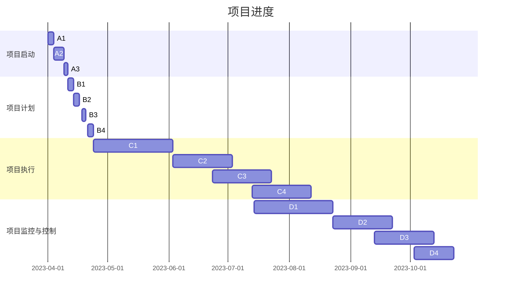

                 

### 前言

在现代科技快速发展的背景下，技术孵化项目已经成为推动创新和经济增长的重要引擎。然而，如何有效地筛选和管理这些项目，确保其顺利发展并达到预期目标，成为摆在许多企业和创业者面前的一大挑战。本文旨在为读者提供一个系统、全面的指导，帮助大家理解技术孵化项目的筛选和管理过程，提高项目成功的概率。

我们将从以下几个方面展开讨论：

1. **技术孵化的背景与意义**：介绍技术孵化的发展历程、关键角色以及其在创新生态系统中的定位。
2. **项目筛选的方法论**：探讨项目筛选的原则、工具和技术，以及项目筛选的流程。
3. **项目评估指标体系**：讲解评估指标的选择、计算与权重分配，以及评估结果的解读与应用。
4. **项目筛选案例分析**：通过具体案例进行分析，提炼成功经验和教训。
5. **项目管理的基本流程**：介绍项目启动、计划、执行、监控与控制的基本流程。
6. **项目风险与应对策略**：探讨项目风险的识别、评估及应对策略。
7. **项目管理案例分析**：通过具体案例，深入剖析项目管理中的关键问题。

本文的目标是帮助读者建立起对技术孵化项目筛选和管理的系统认识，并提供实用的方法和工具。通过阅读本文，读者将能够更好地理解技术孵化项目的本质，掌握项目筛选和管理的核心技能，从而在实际工作中更加得心应手。

### 第一部分: 引言

#### 第1章: 技术孵化的背景与意义

##### 1.1 技术孵化的发展历程

技术孵化（Technology Incubation）起源于20世纪中叶的美国，当时一些研究型大学和企业开始尝试在校园内建立创业中心，以支持师生和企业家的创新活动。早期的孵化器主要以提供物理空间、基础设施和咨询服务为主，帮助初创企业解决创业初期的资源瓶颈问题。

随着全球科技产业的迅猛发展，孵化器的功能逐渐丰富，开始注重技术的商业化应用和市场推广。1980年代，硅谷孵化器模式在全球范围内推广，形成了以科技企业孵化为核心的创新生态系统。此后，许多国家和地区纷纷建立了各类孵化器和创新中心，形成了多层次、多元化的孵化网络。

在中国，技术孵化也经历了快速的发展。自2000年代以来，随着国家创新驱动发展战略的实施，政府和社会资本纷纷投入孵化器建设。各地科技园区、高校和科研院所也纷纷设立孵化平台，为创新创业者提供全方位的支持和服务。如今，中国已经成为全球孵化器数量最多的国家之一，技术孵化在推动经济发展和产业升级中发挥着越来越重要的作用。

##### 1.2 技术孵化的关键角色

技术孵化过程中，涉及多个关键角色，每个角色在项目成功中扮演着不可或缺的角色。

1. **创业者**：创业者是技术孵化项目的核心推动者，他们通常拥有创新的技术或商业理念，并致力于将这些想法转化为实际的产品或服务。创业者需要具备敏锐的市场洞察力、强大的执行力以及持续的创新动力。
   
2. **孵化器**：孵化器是技术孵化的主要载体，为初创企业提供办公空间、基础设施、专业服务和支持资源。孵化器通常具备以下功能：
   - **资源整合**：孵化器通过连接政府、企业、高校、科研院所等各方资源，为初创企业搭建发展平台。
   - **创业辅导**：提供创业培训、商业咨询、法律服务等，帮助创业者提升创业能力和管理水平。
   - **投融资对接**：孵化器通常与投资机构建立合作关系，帮助初创企业获得风险投资和融资支持。
   - **市场推广**：协助初创企业进行市场调研、品牌建设和市场推广，加快产品商业化进程。

3. **投资者**：投资者是技术孵化的重要资金来源，他们通常通过风险投资、股权投资等方式为初创企业提供资金支持。投资者需要具备专业的投资眼光和市场洞察力，以评估项目的潜在价值和市场前景。

4. **科研院所和高校**：科研院所和高校是技术孵化的源头，他们通过技术研发和人才培养，为孵化器提供创新成果和技术储备。同时，高校和科研院所的科研成果也可以通过孵化器实现商业化，促进科技成果转化。

##### 1.3 技术孵化在创新生态系统中的定位

技术孵化在创新生态系统中发挥着桥梁和纽带的作用，连接着科研、产业、投资等多个环节，推动创新资源的有效配置和协同发展。具体来说，技术孵化在创新生态系统中的定位包括以下几个方面：

1. **推动科技创新**：技术孵化通过培育和支持初创企业，促进技术创新和科技成果转化。孵化器提供的资源和平台，可以帮助创业者快速实现技术突破和产品迭代，加速科技产业的成长和发展。

2. **促进产业升级**：技术孵化有助于推动传统产业的转型升级，培育新兴产业和产业链。通过孵化新技术、新产品和新模式，孵化器可以带动产业链上下游企业共同发展，提升整体产业竞争力。

3. **支撑创新创业**：技术孵化为创业者提供了良好的创业环境和成长土壤，激发了社会创新活力。孵化器通过创业培训、孵化服务、投融资支持等手段，帮助创业者实现创业梦想，推动大众创业、万众创新。

4. **连接资本与产业**：技术孵化作为创新与资本之间的桥梁，帮助投资者找到具有潜力的投资项目，同时也为初创企业提供了融资渠道和市场机会。通过投融资对接，孵化器可以加速项目的成长和发展，实现产业与资本的共赢。

综上所述，技术孵化在创新生态系统中具有不可替代的地位，是推动科技创新和产业升级的重要力量。了解技术孵化的发展历程、关键角色和定位，对于读者深入理解技术孵化项目筛选和管理具有重要意义。

### 第一部分: 引言

#### 第2章: 技术孵化项目的核心概念

##### 2.1 技术孵化项目的定义

技术孵化项目（Technology Incubation Project）是指围绕某一创新技术或商业理念，通过系统的策划、实施和运营，旨在将技术或理念转化为具有市场前景的产品或服务的过程。技术孵化项目通常涉及技术研发、产品开发、市场推广、团队建设等多个方面，旨在解决初创企业在初创阶段的资源瓶颈问题，帮助其快速成长。

技术孵化项目与传统项目相比，具有以下特点：

1. **高创新性**：技术孵化项目通常围绕创新技术或商业理念展开，具有较强的创新性和前瞻性。
2. **高风险性**：由于技术不确定性和市场不确定性，技术孵化项目面临较高的风险。
3. **灵活性**：技术孵化项目在实施过程中通常具有较强的灵活性，能够快速响应市场变化和技术发展。
4. **复杂性**：技术孵化项目涉及多个领域和环节，包括技术研发、市场调研、团队建设、投融资等，具有较高的复杂性。

##### 2.2 技术孵化项目的类型

根据技术领域和商业模式的不同，技术孵化项目可以分为以下几种类型：

1. **技术研发型孵化项目**：这类项目主要聚焦于技术创新和研发，以推动技术突破和产品迭代为目标。例如，人工智能、大数据、生物科技等领域的项目。
2. **产品开发型孵化项目**：这类项目侧重于将技术创新转化为具体产品或服务，以实现商业化。例如，智能家居、健康科技、互联网服务等领域的项目。
3. **市场驱动型孵化项目**：这类项目以市场需求为导向，通过市场调研和用户反馈，不断优化和调整产品，以实现市场突破。例如，电子商务、移动互联网、社交媒体等领域的项目。
4. **商业模式创新型孵化项目**：这类项目注重商业模式的创新和优化，以实现新的市场机会和商业价值。例如，共享经济、区块链技术、虚拟现实等领域的项目。

##### 2.3 技术孵化项目的核心要素

一个成功的技术孵化项目需要具备以下核心要素：

1. **创新技术或商业理念**：这是项目的核心驱动力，决定了项目的前景和竞争力。
2. **优秀的团队**：团队是项目成功的关键因素，需要具备技术能力、管理能力和市场洞察力。
3. **充足的资金**：资金是项目实施和运营的基本保障，包括种子资金、风险投资和天使投资等。
4. **市场需求**：项目需要满足市场需求，具备商业价值。
5. **孵化平台**：孵化平台为项目提供办公空间、基础设施、专业服务和支持资源，是项目顺利实施的重要保障。
6. **政策支持**：政策支持包括政府补贴、税收优惠、知识产权保护等，为项目提供有利的外部环境。

通过了解技术孵化项目的定义、类型和核心要素，读者可以更清晰地把握技术孵化项目的基本概念，为后续的项目筛选和管理提供理论基础。在下一章中，我们将深入探讨项目筛选的方法论，帮助读者掌握有效的项目筛选原则和工具。

### 第二部分: 项目筛选

#### 第3章: 项目筛选的方法论

##### 3.1 项目筛选的原则

在进行技术孵化项目筛选时，需要遵循以下原则，以确保筛选过程科学、公正和有效：

1. **创新性原则**：选择具有创新性和前瞻性的项目，这些项目通常具备较大的市场潜力和竞争优势。
2. **市场需求原则**：项目需符合市场需求，具备商业价值，能够解决用户痛点或创造新需求。
3. **可行性原则**：项目的实施需具备可行性，包括技术可行性、市场可行性、团队可行性和资金可行性。
4. **团队原则**：团队是项目成功的关键，需选择具备专业能力、管理能力和创新精神的优秀团队。
5. **风险控制原则**：在项目筛选过程中，需充分考虑项目的风险因素，采取有效的风险控制措施。

##### 3.2 项目筛选的工具与技术

为了确保项目筛选的科学性和系统性，可以使用以下工具和技术：

1. **SWOT分析**：通过SWOT分析（Strengths、Weaknesses、Opportunities、Threats），对项目进行全面评估，识别项目的优势和劣势，以及面临的机会和威胁。
2. **评分模型**：构建评分模型，对项目进行量化评估。评分模型可以根据项目的不同维度（如技术、市场、团队等）设定不同的权重和评分标准。
3. **专家评审**：邀请行业专家对项目进行评审，利用他们的专业知识和经验，为项目筛选提供决策支持。
4. **财务分析**：通过财务分析，评估项目的盈利能力和资金需求，确保项目具有可持续的财务基础。
5. **风险评估**：采用风险评估方法，对项目可能面临的风险进行识别、评估和应对策略制定。

##### 3.3 项目筛选流程

技术孵化项目筛选通常包括以下步骤：

1. **项目征集**：通过线上和线下渠道，征集符合孵化条件和要求的创新创业项目。
2. **初步筛选**：根据项目的基本信息（如项目类型、技术领域、团队背景等），进行初步筛选，筛选出符合孵化要求的项目。
3. **详细评估**：对初步筛选出的项目进行详细评估，采用SWOT分析、评分模型、专家评审等方法，对项目进行全方位评估。
4. **决策**：根据评估结果，结合孵化资源和市场需求，进行最终决策，确定入围项目。
5. **公示与反馈**：对入围项目进行公示，并邀请申请者进行反馈，确保筛选过程的透明和公正。

通过科学、系统的项目筛选流程，可以有效提高技术孵化项目的成功率，为孵化器的发展提供有力支持。在下一章中，我们将进一步探讨项目评估指标体系，帮助读者更好地理解和应用这些评估工具和技术。

### 第二部分: 项目筛选

#### 第4章: 项目评估指标体系

##### 4.1 评估指标的选择

项目评估指标体系是技术孵化项目筛选和管理的重要工具。选择合适的评估指标，能够帮助评估团队全面、客观地评估项目的质量和潜力。以下是选择评估指标时需要考虑的关键因素：

1. **全面性**：评估指标应能够覆盖项目的各个方面，包括技术、市场、团队、资金等。
2. **相关性**：评估指标应与项目的核心目标和成功关键因素高度相关。
3. **可量化**：评估指标应尽可能量化，以便进行客观的比较和分析。
4. **权威性**：评估指标应参考行业标准和专家意见，确保评估结果具有较高的权威性。
5. **动态性**：评估指标应具备一定的灵活性，能够根据项目的发展阶段和市场环境进行调整。

常见的技术孵化项目评估指标包括：

- **技术创新性**：包括技术的新颖性、原创性、突破性等。
- **市场前景**：包括市场需求、市场潜力、市场占有率等。
- **团队实力**：包括团队成员的专业背景、经验、创新能力等。
- **资金需求**：包括项目资金总额、资金用途、资金回收期等。
- **项目进度**：包括项目开发进度、研发计划、里程碑目标等。
- **风险因素**：包括技术风险、市场风险、资金风险等。

##### 4.2 评估指标的计算与权重分配

为了对项目进行全面的评估，需要对各项评估指标进行计算和权重分配。以下是计算和权重分配的方法：

1. **指标计算**：根据评估标准和实际情况，对各项评估指标进行评分。评分可以采用百分制或五分制，以便于量化评估。

2. **权重分配**：各项评估指标的权重应根据其在项目评估中的重要程度进行分配。通常采用专家打分法、层次分析法（AHP）等确定权重。权重分配应确保各项指标的重要性得到充分体现，同时保持整体评估的平衡性和科学性。

3. **综合评分**：通过加权求和的方法，计算项目的综合评分。综合评分越高，表示项目越优秀。

##### 4.3 评估结果的解读与应用

评估结果是对项目进行全面分析和评估的重要输出。以下是如何解读和应用评估结果：

1. **项目排名**：根据综合评分，对项目进行排名，筛选出优秀项目。

2. **优缺点分析**：通过分析评估结果，识别项目的优势和劣势，为项目改进和优化提供依据。

3. **风险预警**：评估结果中的风险因素分析，可以为项目提供风险预警，帮助项目团队提前制定应对策略。

4. **投资决策**：评估结果对于投资者具有决策参考价值，有助于评估项目的投资潜力和风险。

5. **政策支持**：评估结果可以为政府和企业提供政策支持的依据，优化创新生态系统的政策环境。

通过科学、系统的评估指标体系和评估结果解读，技术孵化项目筛选和管理将更加科学、公正和有效。在下一章中，我们将通过具体案例，进一步探讨项目筛选的实践方法和技巧。

### 第二部分: 项目筛选

#### 第5章: 项目筛选案例分析

##### 5.1 案例介绍

为了更好地理解技术孵化项目的筛选过程，我们选择了一家知名孵化器——硅谷的Y Combinator（简称YC）的成功案例进行深入分析。YC成立于2005年，是全球最成功的创业孵化器之一，培育了许多知名的初创企业，如Dropbox、Airbnb和Zenefits等。

案例选取背景：某次YC孵化器的项目筛选活动，共有50个申请项目，涉及多个技术领域，如人工智能、生物科技、物联网和金融科技等。

##### 5.2 案例分析

1. **项目征集阶段**：
   - **渠道**：通过线上和线下渠道，包括官方网站、社交媒体和创业社区等，广泛征集项目。
   - **要求**：申请人需提交详细的商业计划书和项目介绍，包括技术方案、市场分析、团队背景和融资需求等。

2. **初步筛选阶段**：
   - **团队**：根据团队背景和专业能力进行初步筛选，重点关注团队的核心成员是否具备相关的技术背景和管理经验。
   - **市场前景**：评估项目的市场潜力和市场需求，筛选出符合市场趋势和用户需求的项目。

3. **详细评估阶段**：
   - **专家评审**：邀请行业专家和投资人组成评审团队，对每个项目进行详细评估。
   - **SWOT分析**：对项目进行SWOT分析，识别项目的优势和劣势，以及面临的机会和威胁。
   - **评分模型**：采用评分模型，对项目的技术创新性、市场前景、团队实力和资金需求等进行量化评估。

4. **决策阶段**：
   - **综合评分**：根据评分模型和专家评审结果，计算每个项目的综合评分。
   - **决策**：综合考虑评估结果和孵化资源，最终确定入围项目，通常选择前10%的优秀项目。

5. **公示与反馈阶段**：
   - **公示**：对入围项目进行公示，接受社会监督。
   - **反馈**：邀请项目申请者进行反馈，进一步优化筛选过程。

##### 5.3 案例总结

通过上述案例，我们可以总结出以下几个关键成功因素：

1. **广泛的渠道和严格的筛选标准**：通过多渠道广泛征集项目，并设立严格的筛选标准，确保筛选过程的公正性和科学性。
2. **专家评审和量化评估**：结合专家评审和量化评估方法，全面、客观地评估项目，提高项目筛选的准确性和权威性。
3. **灵活性和动态性**：根据项目发展阶段和市场环境，灵活调整筛选标准和评估方法，确保筛选过程的适应性和有效性。
4. **透明度和公开性**：公示入围项目，接受社会监督，提高筛选过程的透明度和公信力。

通过Y Combinator的成功案例，我们可以看到，科学、系统的项目筛选过程对于技术孵化项目的成功至关重要。在下一部分中，我们将继续探讨项目管理的基本流程和关键技术。

### 第三部分：项目管理

#### 第6章：项目管理的基本流程

##### 6.1 项目启动

项目启动是项目管理流程的第一步，也是至关重要的一步。项目的成功启动将为后续的顺利实施奠定基础。以下是项目启动阶段的关键任务：

1. **项目立项**：项目立项是指明确项目的目标、范围、预算和时间表等基本要素，确保项目具备可行的前提条件。通常，项目立项需要通过项目建议书、可行性研究报告等文档的编制和审批。

2. **项目团队组建**：组建一个专业、高效的团队是项目成功的关键。项目团队通常包括项目经理、技术负责人、市场负责人、财务人员等关键岗位。在团队组建过程中，要充分考虑团队成员的专业背景、经验和沟通能力，确保团队具备实施项目所需的能力。

3. **项目启动会议**：项目启动会议是项目团队首次集中讨论和交流的机会。会议的主要目的是明确项目的目标、任务、职责和期望，建立团队成员之间的沟通和信任。在会议中，项目经理应详细介绍项目的背景、目标、范围、时间表、预算等，确保所有团队成员对项目有清晰的认识。

4. **项目计划制定**：项目启动后，需要制定详细的项目计划。项目计划包括工作分解结构（WBS）、任务分配、时间表、资源需求、成本预算等。项目计划应充分考虑项目的复杂性和不确定性，制定灵活的应对措施。

##### 6.2 项目计划

项目计划是项目管理的重要环节，它是项目实施的蓝图，指导项目团队如何完成项目目标。以下是项目计划阶段的关键任务：

1. **工作分解结构（WBS）**：工作分解结构是将项目整体任务分解为可管理的子任务的过程。通过WBS，可以清晰地定义项目的各个组成部分，为任务分配和进度管理提供依据。

2. **任务分配**：根据WBS，将各个子任务分配给相应的团队成员。在任务分配过程中，需要考虑团队成员的专业技能、时间和工作量，确保任务分配的合理性和公平性。

3. **时间表**：时间表是项目计划的核心部分，它规定了项目的起始和结束时间，以及各个任务的开始和结束时间。时间表的制定应考虑项目的优先级、关键路径和资源约束。

4. **资源需求**：项目计划需要明确项目所需的各类资源，包括人力、物资、资金、设备等。在资源需求分析中，应考虑资源的可用性、成本和风险。

5. **成本预算**：成本预算是项目计划的重要组成部分，它规定了项目的总预算和各个任务的成本预算。在成本预算过程中，需要考虑项目的实际情况和市场行情，确保预算的合理性和可行性。

##### 6.3 项目执行

项目执行是项目生命周期的核心阶段，也是项目目标实现的关键。以下是项目执行阶段的关键任务：

1. **任务跟踪**：项目执行过程中，需要实时监控各个任务的进度和状态，确保项目按照计划进行。任务跟踪可以通过项目管理工具（如JIRA、Trello等）实现，定期进行进度汇报和问题反馈。

2. **质量控制**：在项目执行过程中，需要进行质量控制，确保项目交付的产品或服务符合预期的质量标准。质量控制包括质量检查、质量评审和持续改进等环节。

3. **风险管理**：项目执行过程中，可能会面临各种风险，如技术风险、市场风险、人力资源风险等。需要建立风险管理机制，对风险进行识别、评估和应对。

4. **团队协作**：项目成功离不开团队的协作。在项目执行过程中，需要建立良好的沟通机制，确保团队成员之间的有效沟通和信息共享。

##### 6.4 项目监控与控制

项目监控与控制是项目管理的持续过程，它确保项目在既定的时间和预算内完成预定的目标。以下是项目监控与控制阶段的关键任务：

1. **进度监控**：定期监控项目进度，确保项目按照计划进行。如果发现项目进度滞后，需要及时调整计划，采取补救措施。

2. **成本控制**：监控项目成本，确保项目在预算范围内进行。如果发现成本超支，需要分析原因，采取措施进行成本控制。

3. **质量管理**：持续监控项目质量，确保项目交付的产品或服务符合预期的质量标准。如果发现质量问题，需要及时整改。

4. **变更管理**：在项目执行过程中，可能会出现各种变更请求。需要建立变更管理机制，对变更请求进行评估、批准和实施，确保变更不会影响项目的整体目标。

通过遵循上述项目管理的基本流程，项目团队可以确保项目在计划的时间、成本和质量范围内成功完成。在下一章中，我们将探讨项目风险管理的重要性和具体方法。

### 第三部分：项目管理

#### 第7章：项目风险与应对策略

##### 7.1 项目风险的识别

项目风险是指在项目实施过程中可能发生的不确定事件或条件，这些事件或条件可能对项目的目标、时间、成本、质量等方面产生负面影响。有效的风险识别是项目风险管理的基础，以下是一些常用的风险识别方法：

1. **头脑风暴法**：通过召集项目团队成员和专家，集体讨论可能出现的风险，记录和分类这些风险。
2. **SWOT分析法**：结合项目的优势、劣势、机会和威胁，分析可能出现的风险。
3. **专家调查法**：通过问卷调查或访谈方式，收集行业专家的意见和经验，识别潜在风险。
4. **历史数据分析**：分析过去类似项目中的风险事件，总结归纳出当前项目可能面临的风险。
5. **故障树分析**：通过构建故障树，分析风险事件的可能原因和后果，识别潜在风险。

在风险识别过程中，需要记录每个风险的名称、发生概率、可能的影响程度，以及初步的应对策略。

##### 7.2 项目风险的评估

风险识别后，需要对风险进行评估，以确定其严重性和应对优先级。风险评估通常包括以下步骤：

1. **风险分类**：根据风险的性质和影响范围，将风险分类为技术风险、市场风险、财务风险、人力资源风险等。
2. **风险分析**：对每个风险的发生概率和影响程度进行定量或定性的分析。可以使用评分模型、概率分布等方法，评估风险的可能性和影响。
3. **风险优先级排序**：根据评估结果，将风险按照严重性和发生概率进行排序，确定优先应对的风险。

在风险评估过程中，需要记录每个风险的概率、影响程度和优先级，以便制定有效的应对策略。

##### 7.3 项目风险的应对策略

针对评估出的高风险，需要制定具体的应对策略，以降低风险发生的可能性和影响。以下是一些常见的风险应对策略：

1. **风险规避**：通过调整项目计划、更改技术方案或市场策略，避免风险事件的发生。例如，在技术方案选择时，可以选择更成熟的技术，以规避技术风险。
2. **风险减轻**：通过增加资源投入、改进流程或提高质量标准，降低风险发生概率或减少风险影响。例如，通过增加预算，提前采购关键物资，以减轻财务风险。
3. **风险转移**：将风险转移给第三方，如通过购买保险、签订合同等方式，将风险责任转移给其他方。例如，在项目合同中，可以约定风险事件的赔偿条款，将市场风险转移给客户。
4. **风险接受**：在无法规避或转移风险时，可以接受风险的发生，并制定相应的应急计划。例如，在项目计划中，预留一定的缓冲时间，以应对进度延误。

在制定风险应对策略时，需要考虑风险的概率、影响程度、成本效益等因素，确保应对策略的有效性和可行性。

通过有效的风险识别、评估和应对，项目团队可以降低项目风险，提高项目的成功率。在下一章中，我们将通过具体案例，深入探讨项目管理的实践方法和技巧。

### 第三部分：项目管理

#### 第8章：项目管理案例分析

##### 8.1 案例介绍

为了深入探讨项目管理在实际操作中的应用，我们选择了一家全球知名科技公司——Google的某个大型项目为案例。该项目涉及多个技术领域，包括人工智能、云计算和大数据等，旨在开发一款全新的智能助手产品。以下是该项目的背景、目标和系统架构设计。

案例背景：Google一直致力于开发先进的人工智能技术，以满足用户对智能化服务的需求。该项目是Google AI部门的一个重要项目，旨在打造一款具有高度智能化和个性化服务能力的智能助手，可以应用于智能手机、智能家居和智能汽车等多个场景。

项目目标：开发一款具备以下特点的智能助手产品：
- **高效响应**：能够快速响应用户的语音指令，并提供准确的服务。
- **智能学习**：通过用户行为和反馈，不断优化自身服务，提高用户体验。
- **多场景支持**：能够在多种设备和平台上运行，满足不同用户的需求。
- **隐私保护**：在提供个性化服务的同时，严格保护用户的隐私和数据安全。

系统架构设计：该项目采用了分布式架构设计，包括以下几个核心组件：
- **语音识别模块**：负责接收和处理用户的语音指令，将语音信号转换为文本。
- **自然语言理解模块**：负责理解和解析用户指令，提取关键词和语义信息。
- **决策引擎模块**：根据用户指令和上下文信息，生成相应的响应和处理策略。
- **数据存储与分析模块**：存储用户数据和日志，为智能学习和优化提供数据支持。
- **多平台适配模块**：实现智能助手在不同设备和平台上的运行和适配。

##### 8.2 案例分析

1. **项目启动阶段**：
   - **项目立项**：项目团队在多次头脑风暴和讨论后，明确了项目的目标、范围、时间表和预算。
   - **团队组建**：组建了一个由人工智能专家、软件开发工程师、产品经理和设计师等组成的多元化团队，确保项目具备实施能力。
   - **项目启动会议**：项目启动会议上，项目经理详细介绍了项目的背景、目标、任务分工和时间计划，确保团队成员对项目有清晰的认识。

2. **项目计划阶段**：
   - **工作分解结构（WBS）**：项目团队将整个项目分解为多个子任务，包括语音识别、自然语言理解、决策引擎等核心模块的开发和测试。
   - **任务分配**：根据团队成员的技能和经验，将各个子任务分配给相应的团队成员，确保任务分配的合理性和高效性。
   - **时间表**：项目团队制定了详细的时间表，明确了每个子任务的开始和结束时间，以及项目的关键路径。
   - **资源需求**：项目团队分析了项目所需的各类资源，包括人力资源、物资资源和资金需求，确保资源的充足和合理分配。

3. **项目执行阶段**：
   - **任务跟踪**：项目团队使用项目管理工具（如JIRA）实时监控各个任务的进度，确保项目按照计划进行。项目过程中，团队成员定期进行进度汇报和问题反馈，及时解决项目中的问题和挑战。
   - **质量控制**：项目团队建立了严格的质量控制机制，对各个模块的代码、功能和服务进行全面的测试和评审，确保产品的质量和稳定性。
   - **风险管理**：项目团队识别出多个风险，包括技术风险、市场风险和人力资源风险等。通过风险应对策略，项目团队有效降低了风险发生的概率和影响。

4. **项目监控与控制阶段**：
   - **进度监控**：项目团队定期检查项目的进度，确保项目按照计划进行。在项目过程中，项目团队发现某些子任务的进度滞后，及时调整计划和资源，确保项目按时交付。
   - **成本控制**：项目团队严格监控项目成本，确保项目在预算范围内进行。通过合理的成本管理和控制，项目团队成功控制了项目成本，确保了项目的经济性和效益。
   - **质量管理**：项目团队持续监控产品的质量，确保产品符合用户期望和行业标准。通过持续改进和优化，项目团队不断提升产品的质量和用户体验。

##### 8.3 案例总结

通过Google智能助手项目的案例分析，我们可以总结出以下几个关键成功因素：

1. **科学的启动和计划**：项目团队在项目启动阶段制定了详细的计划和目标，确保项目有明确的方向和清晰的路径。
2. **多元化团队**：项目团队由多个领域的专家组成，确保项目具备全面的技能和知识，提高项目的实施能力。
3. **严格的质量控制**：项目团队建立了严格的质量控制机制，确保产品的质量和稳定性，提升用户满意度。
4. **有效的风险管理**：项目团队识别和应对了多个风险，确保项目在风险可控的范围内进行，提高项目的成功率。

通过这个案例分析，我们可以看到，科学、系统的项目管理方法对于项目的成功至关重要。在下一章中，我们将探讨技术孵化项目的最佳实践和注意事项，为读者提供更深入的指导。

### 第四部分：最佳实践与注意事项

#### 第9章：技术孵化项目的最佳实践

##### 9.1 管理体系完善

为了确保技术孵化项目的成功，建立健全的管理体系至关重要。以下是一些最佳实践：

1. **制度建设**：建立完善的项目管理制度，包括项目立项、执行、监控和验收等各个环节的规范和流程。
2. **团队协作**：鼓励团队成员之间的合作与沟通，建立高效的团队协作机制，确保项目进展顺利。
3. **培训与发展**：定期组织项目团队成员的培训，提高其专业技能和管理能力，以应对项目中的各种挑战。
4. **绩效评估**：建立科学的绩效评估体系，对团队成员的工作表现进行客观评估，以激励团队成员积极投入项目。

##### 9.2 技术研发高效

技术孵化项目的核心在于技术创新。以下是一些最佳实践：

1. **技术选型**：选择成熟、可靠的技术框架和工具，确保项目的可行性和稳定性。
2. **持续集成与测试**：采用持续集成和测试的方法，确保代码的质量和项目的稳定性，降低故障率。
3. **敏捷开发**：采用敏捷开发方法，快速响应市场需求和变化，提高项目的灵活性和适应性。
4. **技术创新**：鼓励团队成员进行技术创新，推动项目的技术突破和产品迭代。

##### 9.3 资金管理合理

资金管理是技术孵化项目成功的关键。以下是一些最佳实践：

1. **预算编制**：在项目启动前，详细编制项目预算，包括人力、物资、设备等各项开支。
2. **资金跟踪**：实时跟踪项目资金使用情况，确保项目在预算范围内进行。
3. **融资策略**：根据项目需要，制定合理的融资策略，包括风险投资、银行贷款、政府补贴等。
4. **成本控制**：严格控制项目成本，确保项目经济效益最大化。

##### 9.4 市场拓展策略

市场拓展是技术孵化项目成功的重要环节。以下是一些最佳实践：

1. **市场调研**：在项目启动前，进行全面的市场调研，了解市场需求和竞争态势。
2. **产品定位**：根据市场调研结果，明确产品的市场定位和目标用户群体。
3. **营销推广**：采用多种营销手段，包括线上推广、线下活动、品牌合作等，扩大产品影响力。
4. **渠道拓展**：积极开拓销售渠道，提高产品的市场覆盖率和占有率。

#### 第10章：注意事项

##### 10.1 风险管理

在技术孵化项目中，风险管理至关重要。以下是一些注意事项：

1. **风险识别**：在项目启动阶段，全面识别项目可能面临的风险，包括技术风险、市场风险、资金风险等。
2. **风险评估**：对识别出的风险进行评估，确定其发生的可能性和影响程度。
3. **风险应对**：根据风险评估结果，制定相应的风险应对策略，包括风险规避、风险减轻、风险转移等。
4. **风险监控**：在项目执行过程中，持续监控风险，及时调整风险应对策略。

##### 10.2 沟通与协作

有效的沟通和协作是项目成功的重要保障。以下是一些注意事项：

1. **明确沟通渠道**：建立清晰的沟通渠道和机制，确保信息传递及时、准确。
2. **定期会议**：定期召开项目会议，讨论项目进展、问题和解决方案。
3. **团队协作**：鼓励团队成员之间的协作，提高项目执行效率。
4. **冲突解决**：在项目过程中，难免出现冲突，需要及时解决，确保项目顺利进行。

##### 10.3 质量控制

质量控制是确保项目成功的关键。以下是一些注意事项：

1. **质量标准**：制定明确的质量标准，确保项目交付的产品或服务符合标准。
2. **质量评审**：在项目各个阶段，进行质量评审，确保项目质量和稳定性。
3. **持续改进**：通过持续改进，不断提高项目的质量和服务水平。
4. **用户反馈**：重视用户反馈，及时调整和优化产品，提高用户满意度。

通过遵循最佳实践和注意事项，技术孵化项目可以更高效地推进，减少风险，提高成功率。在下一章中，我们将总结全文，强调核心观点，并展望未来。

### 总结与展望

通过本文的详细探讨，我们系统地介绍了技术孵化项目筛选与管理的各个环节，从背景与意义、核心概念到筛选方法论、评估指标体系、项目管理流程，再到风险管理、案例分析以及最佳实践和注意事项，构建了一个全面的技术孵化项目管理框架。以下是全文的核心观点：

1. **技术孵化的重要性**：技术孵化是推动科技创新和产业升级的关键环节，它通过为初创企业提供资源支持、市场机会和政策环境，促进创新成果的商业化应用。

2. **项目筛选原则与方法**：科学的项目筛选是确保孵化成功的前提。我们需要遵循创新性、市场需求、可行性、团队实力和风险控制等原则，并利用SWOT分析、评分模型、专家评审等工具，全面评估项目。

3. **项目管理流程**：有效的项目管理包括启动、计划、执行和监控与控制四个阶段，每个阶段都有其关键任务和挑战，需要团队协作、质量控制、风险管理等支持。

4. **风险管理与应对策略**：识别、评估和应对项目风险是确保项目顺利进行的重要措施。通过合理的风险规避、减轻、转移和接受策略，可以降低项目失败的可能性。

5. **最佳实践与注意事项**：建立完善的管理体系、注重技术研发、合理管理资金、制定市场拓展策略，以及有效的沟通与协作、质量控制，都是确保项目成功的重要因素。

在展望未来，随着全球科技产业的不断进步和人工智能、大数据等新兴技术的广泛应用，技术孵化项目将面临更多的机遇和挑战。以下是一些可能的趋势：

1. **技术多元化**：孵化项目将不再局限于单一领域，而是涉及更多跨界技术，如人工智能与物联网、生物科技与医疗健康等。

2. **生态体系建设**：技术孵化将更加注重构建创新生态系统，通过多方合作，实现资源共享、优势互补，推动整体创新生态的健康发展。

3. **智能化管理**：利用人工智能和大数据技术，实现项目筛选、评估和管理的智能化，提高效率和准确性。

4. **国际化发展**：随着全球化的加速，技术孵化项目将更加注重国际化布局，积极参与全球创新网络，拓展市场和国际合作。

总之，技术孵化项目筛选与管理是一个复杂且充满挑战的过程，需要不断探索和实践。通过本文的探讨，我们希望能够为读者提供有价值的参考和启示，助力技术孵化项目的成功实施。未来，随着技术的不断进步和市场的变化，技术孵化项目将迎来更多的发展机遇，我们期待看到更多创新成果的诞生。

### 参考文献

1. Brown, T. (2010). *The Lean Startup: How Today's Entrepreneurs Use Continuous Innovation to Create Radically Successful Businesses*. Crown Business.
2. Blank, S., & Dorf, E. (2013). *The Startup Owner's Manual: The Step-by-Step Guide for Building a Great Company*. Crown Business.
3. McEvoy, G. M. (2007). *Risk Management: Concepts and Cases*. John Wiley & Sons.
4. O'Toole, J. M. (2014). *The Art of Project Management*. Microsoft Press.
5. Miller, R. R., & Friesen, P. H. (1984). *A Typology of New-Venture Strategies*. Entrepreneurship Theory and Practice, 8(4), 45-64.
6. Gartner. (2021). *Magic Quadrant for Cloud Infrastructure and Platform Services, Worldwide*. Gartner.
7. Hall, T. E. (1993). *Technological Innovation and the Nature of Entrepreneurship*. University of Chicago Press.
8. Timmons, J. A. (1999). *New Venture Creation: Entrepreneurship for the 21st Century*. McGraw-Hill.
9. Blank, S., & Sirkin, H. L. (2011). *The Agile Innovation Model: How 12 Companies Successfully Leap-Frog Competition*. Pearson Education.
10. Shet, A., & Kuratko, D. F. (2014). *The Process of Technological Entrepreneurship: From Opportunity to Successful Business Ventures*. Edward Elgar Publishing.

### 附录

#### 附录A：项目筛选评分模型示例

以下是一个简单的项目筛选评分模型示例，用于评估技术孵化项目的潜在价值。

| 指标名称       | 评分标准                             | 权重 |
|----------------|--------------------------------------|------|
| 创新性         | 非常创新（90-100分），创新（75-89分），一般（60-74分），缺乏创新（0-59分） | 30%  |
| 市场前景       | 非常好（90-100分），好（75-89分），一般（60-74分），差（0-59分）         | 25%  |
| 团队实力       | 强大（90-100分），较强（75-89分），一般（60-74分），较弱（0-59分）     | 20%  |
| 资金需求       | 充足（90-100分），充足（75-89分），一般（60-74分），不足（0-59分）     | 15%  |
| 技术可行性     | 非常高（90-100分），高（75-89分），一般（60-74分），低（0-59分）      | 10%  |

#### 附录B：项目风险评估示例

以下是一个简单的项目风险评估示例，用于评估技术孵化项目的主要风险。

| 风险类型       | 风险等级 | 风险描述                                           | 应对策略                   |
|----------------|----------|--------------------------------------------------|----------------------------|
| 技术风险       | 高       | 技术实现难度大，可能无法按期完成                   | 引入外部技术专家，加强研发 |
| 市场风险       | 中       | 市场需求不明确，可能导致产品无法商业化             | 深入市场调研，调整产品定位 |
| 资金风险       | 低       | 资金不足，可能导致项目中途搁置                     | 多渠道融资，加强预算管理  |
| 人力资源风险   | 中       | 关键人员流失，可能导致项目进度延误                 | 建立激励机制，优化团队管理 |
| 法律风险       | 高       | 知识产权保护不力，可能导致侵权纠纷                 | 加强知识产权保护，咨询律师 |

### 附录C：项目进度管理工具示例

以下是一个项目进度管理工具的示例，使用Gantt图来展示项目的进度和任务分配。

通过上述附录内容，读者可以更深入地了解技术孵化项目的具体实施方法和管理工具，为实际操作提供参考。作者：AI天才研究院/AI Genius Institute & 禅与计算机程序设计艺术 /Zen And The Art of Computer Programming。

