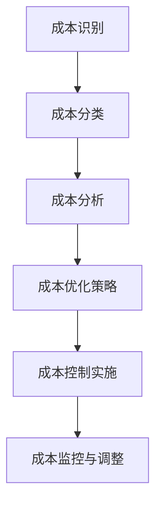

                 

## 如何进行有效的技术成本优化与控制

### 引言与背景

在现代企业中，技术成本占据了相当大的比重，因此，如何进行有效的技术成本优化与控制已成为企业持续发展和竞争力的关键因素。技术成本优化不仅仅是减少成本那么简单，它还涉及到提高资源利用率、提高生产效率、提升产品质量等多方面的综合考量。

#### 技术成本优化的意义

技术成本优化意味着在保证项目质量和性能的前提下，通过一系列方法来降低成本，提高项目的经济性和投资回报率。这不仅有助于企业提升市场竞争力，还能为企业的长期发展提供坚实的财务基础。

#### 技术成本优化与控制的挑战

技术成本优化和控制面临许多挑战，包括技术复杂性、信息不对称、组织变革难度等。此外，不断变化的市场需求和技术进步也使得技术成本管理变得更加复杂。

#### 本书目标与结构

本书旨在为读者提供系统、全面的技术成本优化与控制方法，通过详细的分析和案例研究，帮助读者理解并应用这些方法。本书结构如下：

1. **引言与背景**：介绍技术成本优化的意义、挑战和本书的目标。
2. **核心概念与联系**：阐述成本优化与控制的基本概念和联系。
3. **技术成本优化的基础原理**：探讨成本优化和控制的基础理论和方法。
4. **技术成本优化的策略与实施**：介绍具体的成本优化策略和实施步骤。
5. **最佳实践与展望**：总结最佳实践，展望未来发展趋势。

### 问题背景

#### 技术成本问题的普遍性

技术成本问题在各个行业中普遍存在。例如，在软件开发中，技术成本往往占据项目总成本的很大一部分。在硬件制造中，原材料成本和制造成本也是需要重点管理的领域。

#### 技术成本问题的多种表现形式

技术成本问题可以表现为多种形式，如预算超支、资源浪费、生产效率低下、质量成本高等。这些问题不仅影响企业的财务状况，还会影响企业的运营效率和客户满意度。

#### 技术成本优化的驱动因素

技术成本优化的驱动因素多种多样，包括市场竞争压力、客户需求变化、技术进步、成本意识提升等。这些因素共同推动企业不断寻求更加高效、低成本的技术解决方案。

### 核心概念与联系

#### 成本优化与成本控制

成本优化和成本控制是密切相关的概念。成本优化侧重于通过改进技术和管理方法来降低成本，而成本控制则侧重于在项目执行过程中确保成本不超过预算。

#### 成本动因分析

成本动因分析是一种重要的成本管理工具，用于识别和分类影响成本的各项因素。通过成本动因分析，企业可以更准确地预测和控制成本。

#### 成本管理中的关键概念

成本管理中的关键概念包括固定成本、可变成本、直接成本、间接成本等。了解这些概念对于进行有效的成本优化和控制至关重要。

#### Mermaid流程图：成本优化关键步骤

在接下来的章节中，我们将进一步探讨技术成本优化的基础原理、策略与实施方法，以及最佳实践和未来展望。

---

[接续：第一部分：引言与背景的后续内容]

