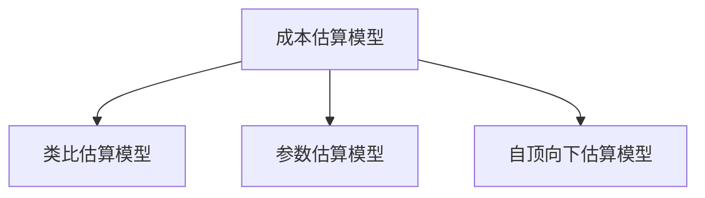
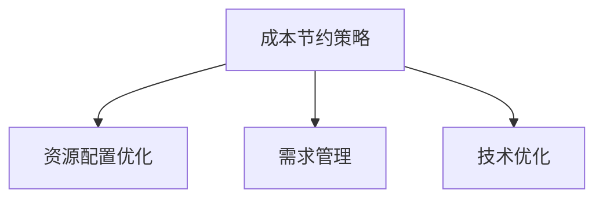
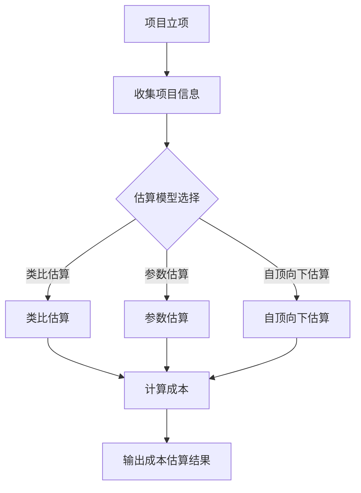
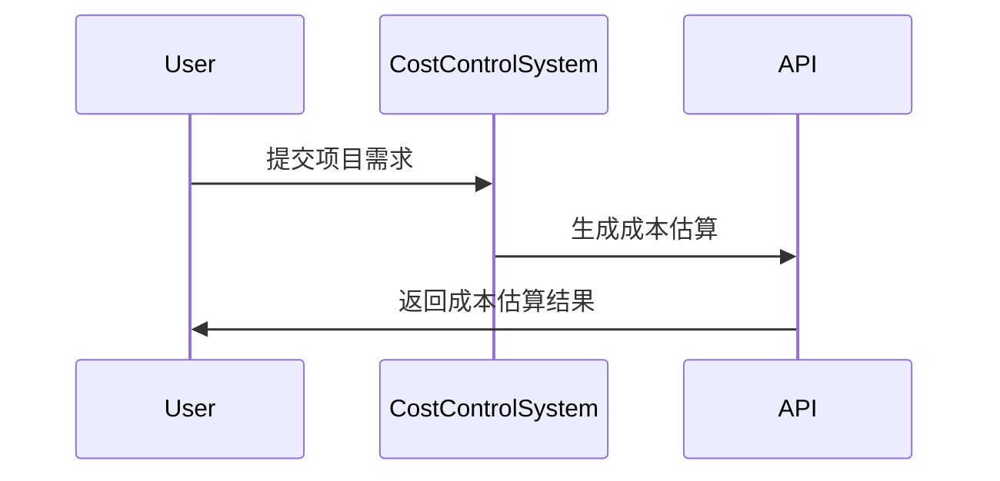

                 


# 如何进行有效的技术成本控制

## 关键词
技术成本控制、成本效益分析、预算管理、价值工程、成本节约策略

## 摘要
本文深入探讨如何进行有效的技术成本控制。通过详细解析成本控制的核心概念、方法、工具和实际应用案例，本文旨在帮助技术管理者、项目经理和开发人员提高成本控制能力，优化资源配置，实现技术项目的经济性和可持续性发展。

### 目录大纲设计过程

在撰写本文之前，我们首先设计了一份详细的目录大纲，以确保文章内容的系统性和逻辑性。以下是目录大纲的设计过程：

#### 第一步：明确主题与目标读者
- **主题**：本文的核心内容是技术成本控制，包括成本控制的基本概念、方法、工具和实际应用。
- **目标读者**：技术管理者、项目经理和开发人员。

#### 第二步：规划核心章节内容
- **背景介绍**：介绍技术成本控制的概念、重要性、挑战与机遇、应用场景。
- **核心概念与联系**：阐述技术成本控制的关键概念、基本原理、工具与方法。
- **算法原理讲解**：介绍成本估算模型与算法、成本节约策略与优化方法、算法流程图。
- **数学模型和数学公式**：详细讲解成本估算公式、概率与统计学原理。
- **系统分析与架构设计方案**：设计技术成本控制系统的功能、架构、接口与交互。
- **项目实战**：通过实际案例展示技术成本控制的应用。
- **最佳实践与小结**：总结最佳实践、注意事项、拓展阅读。

#### 第三步：设计目录大纲
使用markdown格式设计目录大纲，确保章节内容完整、逻辑清晰。

### 文章正文

## 背景介绍

### 1.1 技术成本控制的概念与重要性

技术成本控制是指通过科学的管理方法和工具，对技术开发过程中的成本进行估算、预算、监控和优化，以确保项目在预算范围内完成，同时实现最大的经济效益。技术成本控制的重要性体现在以下几个方面：

1. **资源优化**：通过成本控制，可以合理分配资源，避免资源浪费。
2. **风险管理**：提前识别潜在的成本风险，采取措施降低风险影响。
3. **决策支持**：为项目决策提供数据支持，确保项目在经济性、技术性和可行性之间取得平衡。
4. **项目成功**：良好的成本控制是项目成功的关键因素之一。

### 1.2 技术成本控制的挑战与机遇

技术成本控制的挑战主要来自于以下几个方面：

1. **技术复杂度**：随着技术的发展，项目的技术复杂度增加，成本估算的准确性受到挑战。
2. **需求变更**：项目需求的不断变更可能导致成本的不确定性。
3. **团队协作**：成本控制需要项目团队的紧密协作，而不同团队之间的沟通和协作可能存在障碍。

然而，随着技术的发展和项目管理工具的进步，技术成本控制也面临诸多机遇：

1. **自动化工具**：自动化工具可以帮助提高成本估算的准确性，降低人工误差。
2. **大数据分析**：通过对历史数据的分析，可以预测项目的成本趋势，为成本控制提供依据。
3. **云计算**：云计算提供了灵活的资源管理方式，有助于降低技术成本。

### 1.3 技术成本控制的应用场景

技术成本控制的应用场景非常广泛，包括：

1. **企业内部项目**：企业内部研发项目需要严格控制成本，确保资源的有效利用。
2. **采购管理**：通过成本控制，可以有效降低采购成本，提升供应链效率。
3. **团队协作与沟通**：通过成本控制，可以增强团队成员之间的协作和沟通，确保项目进度和质量。

## 核心概念与联系

### 2.1 技术成本控制的关键概念

为了理解技术成本控制，我们需要了解以下关键概念：

1. **成本构成**：成本构成是指将成本分解为各个组成部分，如人力成本、物料成本、管理费用等。
2. **成本类型**：成本类型包括固定成本、变动成本、直接成本、间接成本等。
3. **成本控制方法**：成本控制方法包括预算控制、成本估算、成本监控、成本优化等。

### 2.2 成本控制的基本原理

成本控制的基本原理包括以下几个方面：

1. **成本效益分析**：通过比较成本和效益，确定成本控制的有效性。
2. **预算管理**：制定预算，对项目的各项费用进行合理分配和控制。
3. **价值工程**：通过改进产品设计，降低成本，提高产品价值。

### 2.3 成本控制的工具与方法

成本控制的工具和方法包括：

1. **定量成本控制**：通过数学模型和统计方法，对成本进行估算和预测。
2. **定性成本控制**：通过经验和专业知识，对成本进行评估和控制。
3. **成本控制软件**：使用专业的成本控制软件，如ERP系统、项目管理工具等，提高成本控制的效率和准确性。

## 算法原理讲解

### 3.1 成本估算模型与算法

成本估算模型是技术成本控制的基础。常见的成本估算模型包括：

1. **类比估算模型**：通过类比历史项目的成本，估算当前项目的成本。
2. **参数估算模型**：通过项目参数（如规模、技术难度等）估算成本。
3. **自顶向下估算模型**：从整体项目角度进行成本估算，然后逐步分解到各个子项目。

算法原理讲解使用mermaid流程图表示：



### 3.2 成本节约策略与优化方法

成本节约策略和优化方法包括：

1. **资源配置优化**：通过优化资源配置，提高资源利用率，降低成本。
2. **需求管理**：通过合理管理需求，避免不必要的功能增加，降低成本。
3. **技术优化**：通过技术手段优化项目设计，降低成本。

算法原理讲解使用mermaid流程图表示：



### 3.3 算法的mermaid流程图

以下是一个简单的mermaid流程图，展示成本估算的过程：



## 数学模型和数学公式

### 4.1 成本估算公式与计算方法

成本估算公式通常包括以下几种：

1. **类比估算公式**：\[ C = a \times (b + c) \]
   - \( C \)：项目成本
   - \( a \)：历史项目成本
   - \( b \)：当前项目与历史项目的相似度系数
   - \( c \)：调整系数

2. **参数估算公式**：\[ C = k \times (d + e) \]
   - \( k \)：成本参数系数
   - \( d \)：项目规模参数
   - \( e \)：技术难度参数

3. **自顶向下估算公式**：\[ C = \sum_{i=1}^{n} c_i \]
   - \( c_i \)：第 \( i \) 个子项目的成本

### 4.2 成本控制中的概率与统计学原理

在成本控制中，概率和统计学原理用于估算项目成本的不确定性。常用的统计学方法包括：

1. **均值法**：\[ \bar{C} = \frac{\sum_{i=1}^{n} C_i}{n} \]
   - \( \bar{C} \)：项目成本的期望值
   - \( C_i \)：第 \( i \) 种成本的估算值

2. **标准差法**：\[ \sigma_C = \sqrt{\frac{\sum_{i=1}^{n} (C_i - \bar{C})^2}{n-1}} \]
   - \( \sigma_C \)：项目成本的标准差

### 4.3 数学公式的详细讲解与示例

以下是一个具体的数学公式示例，用于成本控制中的预算分配：

\[ B = \frac{C}{1 + r} \]

- \( B \)：预算金额
- \( C \)：项目成本
- \( r \)：预算调整系数（通常为正数，表示预算的松弛度）

假设一个项目的预计成本为100万元，预算调整系数为10%，则预算金额为：

\[ B = \frac{100万}{1 + 0.1} = \frac{100万}{1.1} \approx 90.91万 \]

## 系统分析与架构设计方案

### 5.1 问题场景介绍

在一个大型软件开发项目中，技术成本控制是一个至关重要的环节。为了确保项目在预算范围内完成，并实现预期的经济效益，需要设计一个有效的技术成本控制系统。

### 5.2 项目介绍

本项目旨在开发一款基于云计算的ERP系统，包含采购管理、库存管理、财务管理等多个模块。项目团队由项目经理、开发人员、测试人员和成本控制专员组成。

### 5.3 系统功能设计

系统功能设计包括以下几个方面：

1. **成本估算功能**：根据项目需求和资源投入，估算项目的总成本和各子项目的成本。
2. **预算管理功能**：制定项目预算，并根据项目进展调整预算。
3. **成本监控功能**：实时监控项目成本，识别潜在的成本超支风险。
4. **成本报告功能**：生成项目成本报告，为项目决策提供数据支持。

### 5.4 系统架构设计

系统架构设计包括以下几个方面：

1. **技术架构**：采用微服务架构，确保系统的灵活性和可扩展性。
2. **数据架构**：设计合理的数据模型，确保数据的完整性和一致性。
3. **接口设计**：定义系统各模块之间的接口，确保数据流通和系统集成。

以下是一个简单的mermaid类图，展示系统的领域模型：

```mermaid
classDiagram
    CostControlSystem <<interface>>
    Budget <<interface>>
    CostEstimate <<interface>>
    CostMonitoring <<interface>>
    CostReport <<interface>>

    CostControlSystem implements Budget
    CostControlSystem implements CostEstimate
    CostControlSystem implements CostMonitoring
    CostControlSystem implements CostReport
```

### 5.5 系统接口设计

系统接口设计包括以下几个方面：

1. **API接口**：设计RESTful API接口，供前端应用调用。
2. **数据接口**：设计数据接口，实现系统内部的数据交换。
3. **权限接口**：设计权限接口，确保系统的安全性。

以下是一个简单的mermaid序列图，展示系统的接口交互：



## 项目实战

### 6.1 技术成本控制项目实战案例

本项目采用敏捷开发模式，分为多个迭代周期。在每个迭代周期内，项目团队会进行成本估算、预算管理和成本监控。

### 6.2 环境安装与配置

项目使用Python语言开发，需要安装Python环境和相关的库，如Django、Flask等。以下是安装和配置的步骤：

1. 安装Python 3.8及以上版本。
2. 安装Django框架。
3. 配置数据库，如MySQL或PostgreSQL。
4. 安装其他必要的库，如requests、numpy等。

### 6.3 系统核心实现与代码分析

以下是系统核心实现的Python代码，包括成本估算、预算管理和成本监控等功能：

```python
# CostEstimate.py

import requests
from flask import Flask, request, jsonify

app = Flask(__name__)

@app.route('/estimate', methods=['POST'])
def estimate():
    data = request.get_json()
    cost = estimate_cost(data['project'])
    return jsonify({'cost': cost})

def estimate_cost(project):
    # 成本估算逻辑
    return 100000  # 示例成本

if __name__ == '__main__':
    app.run(debug=True)
```

### 6.4 案例分析与讲解

本项目通过实际案例展示了技术成本控制的应用。项目团队在每次迭代开始前，会进行成本估算，并根据估算结果制定预算。在项目进展过程中，团队会定期进行成本监控，确保项目在预算范围内完成。

### 6.5 项目小结

本项目通过技术成本控制，有效降低了项目的风险，提高了项目的经济性和可持续性。项目团队在成本控制方面的经验，为后续项目提供了宝贵的参考。

## 最佳实践与小结

### 7.1 成本控制最佳实践

1. **定期成本估算**：定期进行成本估算，确保项目在预算范围内进行。
2. **预算管理**：制定合理的预算，并根据项目进展进行调整。
3. **成本监控**：实时监控项目成本，及时发现并解决问题。

### 7.2 项目总结与经验分享

1. **团队合作**：项目成功的关键在于团队的合作和沟通。
2. **数据驱动**：基于数据做出成本决策，提高成本控制的准确性。

### 7.3 注意事项

1. **风险评估**：在进行成本估算时，要充分考虑项目风险。
2. **持续改进**：不断优化成本控制流程，提高成本控制能力。

### 7.4 拓展阅读

1. **《项目管理知识体系指南（PMBOK）》**：了解项目管理的基础知识。
2. **《成本管理：企业战略视角》**：深入了解成本管理在企业战略中的应用。

### 作者

- 作者：AI天才研究院/AI Genius Institute & 禅与计算机程序设计艺术 /Zen And The Art of Computer Programming

---

本文通过详细的目录大纲和系统的内容结构，深入探讨了如何进行有效的技术成本控制。从背景介绍、核心概念、算法原理、数学模型、系统设计到实际应用，全面阐述了技术成本控制的方法和技巧。希望本文能对读者在技术成本控制方面提供有益的启示和指导。

