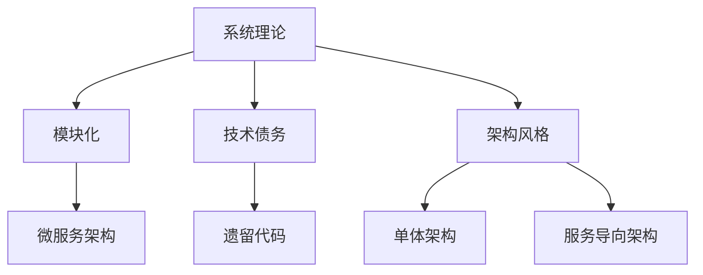
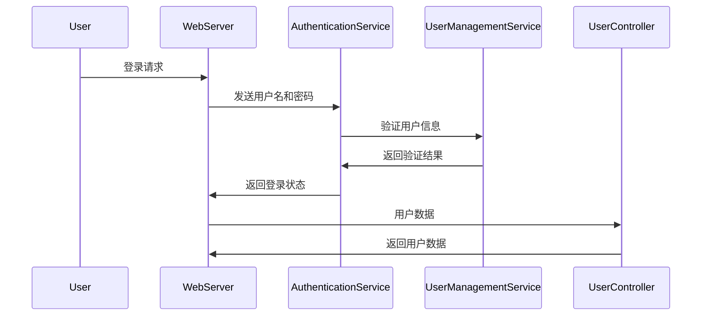

                 

### 引言与背景

在现代信息技术迅猛发展的时代，技术架构的演进成为企业数字化转型中不可或缺的一环。有效的技术架构演进不仅能够提升系统的可扩展性、可维护性和可靠性，还能够为企业带来更高的竞争优势。因此，如何进行有效的技术架构演进，成为许多技术领导者和管理者关注的核心问题。

本文将以“如何进行有效的技术架构演进”为标题，通过逻辑清晰、结构紧凑、简单易懂的专业技术语言，逐步分析并探讨这一主题。文章将分为以下几个主要部分：

1. **引言与背景**：介绍技术架构演进的概念、当前面临的挑战和目标。
2. **核心概念与联系**：阐述技术架构演进中的核心概念及其相互关系。
3. **架构演进原则与方法**：详细讨论架构演进的原则和方法，包括增量与激进化、进化模式等。
4. **系统分析与架构设计**：通过具体案例介绍系统分析与架构设计的方法。
5. **项目实战**：以实际项目为例，展示技术架构演进的具体实现过程。
6. **最佳实践与总结**：总结最佳实践经验，提出注意事项和拓展阅读建议。

通过以上步骤的逐步分析，本文旨在帮助读者深入理解技术架构演进的内在机制和实践方法，为企业的技术发展提供有价值的参考。

### 关键词

- 技术架构演进
- 增量与激进化
- 核心概念
- 系统分析与设计
- 架构风格
- 微服务
- 技术债务

### 摘要

本文旨在深入探讨如何进行有效的技术架构演进，以应对现代信息技术发展的挑战。文章首先介绍了技术架构演进的基本概念、当前面临的挑战和目标，包括系统可扩展性、可维护性和可靠性。接着，通过核心概念和关系分析，梳理了技术架构演进中的关键要素和相互关系，如系统理论、技术债务和架构风格。文章随后详细阐述了架构演进的原则和方法，包括增量与激进化策略、进化模式等。此外，通过具体系统分析与架构设计的案例，展示了实际应用中的架构演进过程。最后，文章结合实际项目经验，提出了技术架构演进的最佳实践和注意事项，为企业的技术发展提供了有益的指导。

## 第一章：引言与背景

### 1.1 技术架构演进概述

技术架构演进是信息系统在其生命周期中不断调整和优化的过程。它不仅涉及技术层面的改进，还包括业务需求、用户反馈和市场变化等多方面因素。随着信息技术的快速发展，技术架构的演进变得更加重要和复杂。从早期的单体架构到现代的微服务架构，技术架构的演变经历了多个阶段，每个阶段都有其特定的特点和挑战。

#### 历史背景

- **单体架构**：早期的信息系统多采用单体架构，即所有功能模块集成在一个单一的系统中。这种架构在系统规模较小、功能相对简单的情况下表现良好，但随着系统复杂度的增加，其缺点逐渐显现，如维护困难、扩展性差等。
- **模块化架构**：为了克服单体架构的不足，逐步出现了模块化架构，通过将系统划分为若干独立的模块，提高了系统的可维护性和扩展性。
- **分布式架构**：随着互联网的兴起，分布式架构成为主流，它通过将系统功能分散到多个服务器上，提高了系统的可靠性和伸缩性。
- **微服务架构**：微服务架构是近年来的一种新兴架构风格，其核心思想是将大型单体系统分解为多个独立的、可扩展的小型服务，每个服务都有自己的数据库和业务逻辑。

#### 技术架构演变趋势

- **敏捷性**：现代技术架构越来越强调敏捷性，能够快速响应业务变化和技术创新。
- **可扩展性**：随着用户规模的增加，系统的可扩展性变得尤为重要，微服务和分布式架构为这一目标提供了有效解决方案。
- **可靠性**：系统的可靠性是架构演进的关键因素，高可用性、容错性和灾难恢复能力成为技术架构设计的重要目标。
- **自动化**：自动化工具和流程在技术架构演进中发挥着越来越重要的作用，如持续集成/持续部署（CI/CD）、自动化测试等，大幅提高了开发效率和质量。

### 1.2 当前技术架构面临的挑战

尽管技术架构在不断发展，但仍然面临诸多挑战：

- **复杂性**：随着系统规模的扩大，架构复杂性不断增加，管理和维护变得更加困难。
- **可维护性**：旧系统中的遗留代码和技术债务，使得维护成本高昂，影响新功能的开发速度。
- **伸缩性**：随着用户数量的增加，系统需要能够无缝地伸缩，以满足不断增长的需求。
- **安全性**：在分布式和云环境下，系统的安全性变得更加复杂，需要不断更新和完善安全策略。

### 1.3 有效技术架构演进的目标

有效技术架构演进的目标包括：

- **适应性和灵活性**：系统能够快速适应业务变化和技术创新，保持持续的竞争力。
- **效率和性能**：优化系统性能，提高资源利用率，降低运营成本。
- **可靠性和安全性**：确保系统的高可用性和数据安全，减少故障和风险。

通过上述分析，我们可以看出技术架构演进不仅是一项技术活动，更是企业战略的重要组成部分。有效的技术架构演进能够为企业带来持续的创新能力和市场竞争力。接下来，我们将进一步探讨技术架构演进中的核心概念和关系，为后续的讨论奠定基础。

### 1.4 结论

技术架构演进是信息系统不断适应变化、提高效率和质量的关键过程。从早期的单体架构到现代的微服务架构，技术架构的演变经历了多个阶段，每个阶段都面临着新的挑战和机遇。有效技术架构演进的目标是提高系统的适应性、效率和可靠性，以支持企业的长期发展。理解技术架构演进的历史背景和趋势，有助于我们更好地把握当前的技术架构现状和未来发展方向。在接下来的章节中，我们将深入探讨技术架构演进中的核心概念和关系，为实际应用提供更有力的理论支持。

## 第二章：核心概念与联系

### 2.1 基本概念

在探讨技术架构演进的过程中，理解几个核心概念及其相互关系是非常重要的。这些核心概念包括系统理论、技术债务和架构风格，它们共同构成了技术架构演进的理论基础。

#### 系统理论及其应用

系统理论是一种研究复杂系统的结构和行为的科学方法。在技术架构演进中，系统理论的应用主要体现在以下几个方面：

- **系统思考**：系统思考是一种从整体和动态的角度理解复杂系统的方法。它强调系统的各个部分之间相互关联和相互作用，而不是仅仅关注单个部分。在技术架构演进中，系统思考有助于我们理解系统的整体行为，从而做出更全面的决策。
- **模块化**：模块化是系统理论的一个核心原则，它将复杂的系统划分为若干独立的模块，每个模块负责特定的功能。模块化不仅提高了系统的可维护性，还增强了系统的可扩展性。在技术架构演进中，模块化是实现系统灵活性和可扩展性的关键。

#### 技术债务

技术债务是指由于短期决策和设计缺陷导致的长期维护成本增加。它与技术债务在金融领域中的概念类似，都是指当前的决策可能会带来未来的负担。在技术架构演进中，技术债务是一个不可忽视的问题：

- **定义**：技术债务是指为了快速交付功能而做出的短期技术决策，这些决策可能会在未来导致系统维护成本增加、性能下降或可扩展性受限。
- **影响**：技术债务的积累会对技术架构演进产生负面影响。随着技术债务的增加，系统的维护成本会不断上升，新功能的开发速度会放缓，甚至可能影响系统的稳定性。

#### 架构风格

架构风格是指系统架构的设计原则和模式。不同的架构风格适用于不同的应用场景，对系统的可扩展性、可维护性和性能有重要影响。在技术架构演进中，选择合适的架构风格至关重要：

- **单体架构**：单体架构将所有功能模块集成在一个单一的系统中，适用于功能相对简单、系统规模较小的场景。但单体架构的可维护性和可扩展性较差，随着系统复杂度的增加，其缺点日益明显。
- **微服务架构**：微服务架构将系统划分为多个独立的小型服务，每个服务都有自己的业务逻辑和数据存储。微服务架构具有高可扩展性和高可维护性，但同时也增加了系统的复杂度和部署难度。
- **服务导向架构（SOA）**：服务导向架构基于服务组件，这些服务通过接口进行通信。SOA适用于需要跨多个系统进行数据交换的场景，但其性能和可扩展性可能不如微服务架构。

### 2.2 核心概念之间的关系

在技术架构演进中，系统理论、技术债务和架构风格之间的关系错综复杂，它们相互影响、相互制约。

- **系统理论与架构风格**：系统理论为架构风格提供了理论基础，模块化原则和系统思考方法指导着架构风格的设计。例如，微服务架构的模块化设计正是基于系统理论中的模块化原则。
- **技术债务与架构风格**：技术债务的积累可能会影响架构风格的选择。高技术债务的系统可能需要采用更灵活的架构风格，如微服务架构，以降低未来的维护成本。反之，低技术债务的系统则可能采用更为稳定的架构风格，如单体架构。
- **架构风格与系统性能**：不同的架构风格对系统性能有不同的影响。例如，微服务架构可以提高系统的可扩展性和灵活性，但可能会增加系统的复杂度和部署难度。因此，在技术架构演进过程中，需要综合考虑架构风格对系统性能的影响。

通过上述分析，我们可以看出，系统理论、技术债务和架构风格是技术架构演进中的核心概念，它们相互关联、相互影响，共同决定了系统的性能、可维护性和可扩展性。在接下来的章节中，我们将进一步探讨架构演进的原则和方法，以帮助读者更好地理解和应用这些核心概念。

### 2.3 核心概念对比表格

为了更清晰地展示系统理论、技术债务和架构风格三个核心概念，我们提供了一个对比表格，详细列出每个概念的主要属性和特征：

| 核心概念       | 主要属性                  | 主要特征                                                         |  
| -------------- | -------------------- | ------------------------------------------------------------ |  
| 系统理论       | - 系统思考             | - 强调系统整体性和动态性                                           |  
| - 模块化       | - 独立模块             | - 提高可维护性和可扩展性                                             |  
| 技术债务       | - 短期决策             | - 导致长期维护成本增加                                               |  
| - 遗留代码     | - 影响系统性能           | - 减缓新功能开发速度                                                 |  
| 架构风格       | - 单体架构             | - 所有功能模块集成在一个系统中                                       |  
| - 微服务架构   | - 独立服务             | - 提高可扩展性和可维护性                                               |  
| - 服务导向架构 | - 服务组件             | - 跨系统数据交换                                             |

通过这个表格，我们可以看到每个核心概念的独特属性和特征，以及它们在技术架构演进中的作用。理解这些概念及其相互关系，有助于我们在实际项目中做出更明智的决策，实现有效的技术架构演进。

### 2.4 概念图与ER实体关系图

为了更直观地展示系统理论、技术债务和架构风格三个核心概念之间的关系，我们使用Mermaid绘制了一个概念图和一个ER实体关系图。

#### 概念图



这个概念图展示了系统理论、模块化、技术债务和架构风格之间的关系。系统理论为模块化和技术债务提供了理论基础，而架构风格则是在这些理论基础上的具体实现。

#### ER实体关系图

```mermaid
erDiagram
  Person ||--|{ Employee : manages }
  Employee ||--|{ Developer : worksAs }
  Developer ||--|{ Architect : designs }
  Employee ||--|{ Manager : supervises }
```

ER实体关系图描述了技术架构演进中涉及的主要实体及其关系。Person（人）实体包含了所有员工，Employee（员工）实体是Person的子实体，包括Developer（开发者）和Manager（经理）等角色。Developer（开发者）实体与Architect（架构师）实体之间有“设计”关系，表明架构师是开发者的一个特殊角色。Manager（经理）实体与Employee（员工）实体之间有“监督”关系，表示经理对员工的监督管理。

通过这两个图，我们可以更清晰地理解系统理论、技术债务和架构风格在技术架构演进中的具体应用和相互关系，为后续的架构演进提供有力的理论支持。

### 2.5 概念图与ER实体关系图的意义

概念图和ER实体关系图在技术架构演进中具有非常重要的意义。它们不仅帮助我们从整体上理解系统、技术债务和架构风格等核心概念，还为我们提供了直观的视觉工具来分析复杂系统。

首先，概念图展示了系统理论、模块化、技术债务和架构风格之间的逻辑关系，使我们可以清晰地看到这些概念是如何相互关联和影响的。通过概念图，我们能够快速把握不同概念的核心要点，从而为架构演进提供理论基础。

其次，ER实体关系图帮助我们明确技术架构演进中的关键实体及其相互关系。例如，通过ER实体关系图，我们可以清楚地看到不同角色（如开发者、架构师、经理）在系统中的职责和关系，这对于设计和管理复杂系统至关重要。

总之，概念图和ER实体关系图不仅为我们提供了直观的视觉工具，还帮助我们深入理解技术架构演进的核心概念和关系，为后续的架构设计、实施和优化提供了有力的支持。

## 第三章：架构演进原则与方法

### 3.1 架构演进的原则

在技术架构演进的过程中，遵循一系列原则是确保系统适应性和效率的关键。以下是几个核心原则：

#### 增量与激进化

- **增量演进**：增量演进是指通过逐步改进现有系统来实现技术架构的演变。这种方法强调在现有系统基础上进行微小的、逐步的改进，以降低风险和复杂性。增量演进的优点在于：

  - **可控性**：通过逐步改进，可以更好地控制变化，减少对业务的影响。
  - **灵活性**：适应业务需求的变化，使系统能够更快速地响应市场变化。

- **激进化**：激进化是指对现有系统进行全面的、颠覆性的重构。这种方法通常用于解决复杂度高、遗留问题严重的情况。激进演进的优点在于：

  - **高效性**：通过一次性解决多个问题，可以显著提升系统的性能和可扩展性。
  - **颠覆性创新**：为系统引入全新的设计理念和技术，实现技术上的突破。

#### 进化模式

- **适应性进化**：适应性进化是指通过调整系统架构以适应不断变化的业务需求和外部环境。这种模式强调灵活性、弹性和可扩展性，使系统能够在变化中保持稳定性和性能。

- **转化型进化**：转化型进化是指对现有系统进行根本性的重构，以实现系统质的飞跃。这种模式通常应用于系统架构严重过时、无法满足新需求的情况。转化型进化的关键在于：

  - **明确目标**：确保重构的目标清晰明确，避免因目标不明确而导致项目失败。
  - **逐步实施**：通过分阶段实施，确保每一阶段的目标都得到有效实现，减少风险。

### 3.2 架构演进的方法

为了有效地实现技术架构的演进，需要采用一系列方法，包括策略和工具：

#### 架构策略

- **技术路线图**：制定清晰的技术路线图，明确系统演进的目标、步骤和时间表。技术路线图应涵盖短期和长期目标，确保系统能够持续演进。

- **持续集成/持续部署（CI/CD）**：采用CI/CD流程，自动化构建、测试和部署，提高开发效率和质量。CI/CD有助于快速迭代和部署新功能，同时减少人为错误。

- **风险管理**：制定风险管理计划，识别潜在风险，并制定应对措施。通过定期评估和监控风险，确保系统演进过程中的安全性。

#### 架构工具

- **架构设计工具**：使用如UML（统一建模语言）等架构设计工具，进行系统架构的建模和设计。UML图可以帮助我们更直观地理解和分析系统架构。

- **代码管理工具**：采用Git等版本控制工具，管理代码库，确保代码的版本化和协作开发。

- **容器化技术**：使用Docker等容器化技术，提高系统的部署和运行效率。容器化技术使系统可以独立部署和管理，减少环境差异对系统的影响。

### 3.3 增量演进与激进化案例分析

为了更好地理解增量演进与激进化在实际项目中的应用，下面我们通过两个案例进行说明。

#### 案例一：电商平台技术架构的增量演进

某大型电商平台在初期采用单体架构，但随着用户数量的增加和业务需求的不断变化，系统面临性能瓶颈和可维护性问题。为了解决这些问题，平台采用了增量演进的方法：

1. **拆分微服务**：逐步将单体架构中的功能模块拆分为独立的微服务，每个服务负责特定的业务功能。
2. **分布式部署**：将微服务部署到分布式服务器上，以提高系统的性能和可扩展性。
3. **自动化测试**：引入自动化测试，确保每个微服务的质量，减少测试和部署时间。

通过增量演进，电商平台成功地提升了系统的性能和可维护性，同时保持了业务的连续性和稳定性。

#### 案例二：银行系统的激进化重构

某银行在面临激烈的市场竞争和客户需求变化时，发现其现有的技术架构已经无法满足新的业务需求。为了提升系统的性能和用户体验，银行决定进行激进化重构：

1. **需求调研**：全面调研客户需求和市场趋势，明确系统重构的目标和方向。
2. **设计新架构**：设计全新的分布式架构，包括微服务、容器化等技术，以支持高效、可靠的系统运行。
3. **分阶段实施**：将重构过程分为多个阶段，逐步替换旧系统，确保每个阶段的目标都能顺利实现。

通过激进化重构，银行成功实现了系统性能的显著提升，增强了用户体验，并在市场上获得了更大的竞争优势。

通过上述案例，我们可以看到增量演进与激进化在技术架构演进中的实际应用。增量演进适用于需要逐步改进的系统，而激进化则适用于需要全面重构的系统。选择合适的演进方法，是实现技术架构有效演进的关键。

### 3.4 结论

技术架构演进是一项复杂而重要的任务，需要遵循一系列原则和方法。增量与激进化、适应性进化与转化型进化是技术架构演进的核心原则，通过这些原则和方法，我们可以实现系统的持续改进和优化。在具体实践中，选择合适的架构策略和工具，如技术路线图、CI/CD流程、架构设计工具和容器化技术等，是确保架构演进成功的关键。通过案例分析，我们可以更好地理解这些原则和方法在实际项目中的应用，为技术架构的演进提供有益的参考。

## 第四章：系统分析与架构设计

### 4.1 问题场景介绍

在当今信息化社会中，企业系统面临着不断变化的市场需求、技术进步和业务扩展等多重挑战。为了确保系统能够灵活应对这些变化，系统分析与架构设计成为企业数字化转型中的关键环节。本节将介绍一个具体的案例，详细描述系统分析和架构设计的过程。

#### 案例背景

某大型电商平台在经历了数年的快速发展后，系统架构逐渐显现出瓶颈，如性能问题、可维护性差和扩展性不足等。为了提升用户体验、增加业务弹性，电商平台决定对现有系统进行全面的系统分析和架构设计。

#### 问题陈述

- **性能瓶颈**：随着用户数量的激增，系统在高峰期的响应速度明显下降，导致用户体验不佳。
- **可维护性差**：系统的代码结构复杂，模块之间耦合度高，导致维护难度大，新功能的开发速度慢。
- **扩展性不足**：现有的单体架构难以满足不断增长的业务需求，系统扩展面临诸多限制。

#### 解决目标

- **提升性能**：优化系统性能，提高系统的响应速度和处理能力。
- **增强可维护性**：重构代码结构，降低模块之间的耦合度，提高系统的可维护性。
- **增强扩展性**：采用微服务架构，实现系统的弹性扩展，满足业务增长的需求。

### 4.2 项目介绍

为了解决上述问题，电商平台启动了一项名为“系统重构与性能优化”的项目。项目的主要目标是通过系统分析和架构设计，实现以下成果：

- **需求分析**：明确业务需求和技术需求，为系统设计提供基础。
- **架构设计**：设计新的系统架构，包括微服务、分布式数据库和容器化部署等。
- **实施与部署**：实施新的系统架构，确保系统能够稳定运行。
- **测试与优化**：对新的系统进行全面的测试和优化，确保性能和稳定性。

#### 项目范围

- **需求分析**：涵盖用户行为分析、业务流程优化和系统性能评估等。
- **架构设计**：包括系统总体架构设计、微服务划分和接口设计等。
- **实施与部署**：涵盖开发、测试、部署和上线等环节。
- **测试与优化**：包括功能测试、性能测试和安全测试等。

#### 项目团队

项目团队由以下成员组成：

- **项目经理**：负责项目的整体管理和协调。
- **业务分析师**：负责需求分析和业务流程设计。
- **架构师**：负责系统架构设计和技术方案选型。
- **开发人员**：负责代码开发和系统实现。
- **测试人员**：负责系统测试和性能优化。

### 4.3 系统功能设计

系统功能设计是系统分析与架构设计的重要环节，它明确了系统的具体功能和模块划分。在本次项目中，系统功能设计主要包括以下几个方面：

#### 功能模块划分

1. **用户管理模块**：负责用户注册、登录、权限管理和用户信息管理等。
2. **商品管理模块**：负责商品信息管理、分类管理和库存管理等功能。
3. **订单管理模块**：负责订单生成、订单处理、支付管理和物流跟踪等。
4. **促销管理模块**：负责促销活动策划、促销规则管理和促销效果分析等。
5. **支付模块**：负责支付渠道接入、支付处理和支付状态跟踪等。
6. **物流管理模块**：负责物流公司接入、订单物流管理和物流状态更新等。
7. **数据分析模块**：负责用户行为分析、业务数据分析和数据可视化等。

#### 领域模型

为了更好地描述系统功能模块及其关系，我们使用Mermaid绘制了领域模型图：

```mermaid
classDiagram
    User <<类>> "用户"
    Product <<类>> "商品"
    Order <<类>> "订单"
    Promotion <<类>> "促销"
    Payment <<类>> "支付"
    Logistics <<类>> "物流"
    DataAnalysis <<类>> "数据分析"

    User --> Product
    User --> Order
    User --> Promotion
    User --> Payment
    User --> Logistics
    User --> DataAnalysis

    Product --> Order
    Product --> Promotion
    Order --> Payment
    Order --> Logistics
    Promotion --> DataAnalysis
```

通过领域模型图，我们可以清晰地看到各个功能模块之间的关系，这有助于我们在后续的架构设计中明确各模块的职责和接口。

### 4.4 系统架构设计

系统架构设计是系统功能实现的基础，它决定了系统的性能、可维护性和可扩展性。在本次项目中，我们采用微服务架构，通过将系统功能划分为多个独立的微服务来实现系统的解耦和弹性扩展。

#### 系统总体架构

系统总体架构如图所示：

```mermaid
sequenceDiagram
    User ->> WebServer : 用户请求
    WebServer ->> AuthenticationService : 鉴权
    AuthenticationService ->> UserManagementService : 鉴权用户
    UserManagementService ->> UserController : 返回用户数据
    UserController ->> WebServer : 返回响应
    WebServer ->> ProductService : 商品请求
    ProductService ->> ProductRepository : 查询商品数据
    ProductRepository ->> ProductService : 返回商品数据
    ProductService ->> UserController : 返回商品数据
    UserController ->> WebServer : 返回响应
    // 其他服务调用同理
```

#### 微服务划分

系统被划分为以下微服务：

1. **AuthenticationService**：负责用户身份验证和权限管理。
2. **UserManagementService**：负责用户信息管理。
3. **ProductService**：负责商品信息管理。
4. **OrderService**：负责订单管理。
5. **PromotionService**：负责促销管理。
6. **PaymentService**：负责支付管理。
7. **LogisticsService**：负责物流管理。
8. **DataAnalysisService**：负责数据分析。

#### 服务接口设计

每个微服务都有明确的接口设计，以确保服务的独立性。以下是部分服务接口设计：

```mermaid
interface Authentication {
    authenticate(username: string, password: string): boolean
    authorize(role: string): boolean
}

interface UserManagement {
    registerUser(username: string, password: string, role: string): void
    deleteUser(username: string): void
    updateUser(username: string, role: string): void
}

interface ProductService {
    getProduct(productId: string): Product
    searchProducts(keyword: string): Array<Product>
    updateProduct(productId: string, product: Product): void
    deleteProduct(productId: string): void
}

// 其他接口设计同理
```

#### 服务交互

通过定义明确的服务接口，各微服务之间可以独立开发、部署和测试。服务交互采用RESTful API，通过HTTP请求和JSON响应进行数据交换。

### 4.5 系统接口设计与交互

系统接口设计是系统架构设计的关键部分，它决定了各微服务之间的协作方式和数据交换方式。以下是系统接口设计的一个具体例子：

#### 接口设计



在这个例子中，用户通过WebServer发送登录请求，WebServer将请求传递给AuthenticationService进行用户名和密码的验证。如果验证通过，AuthenticationService返回登录状态，WebServer再根据状态返回用户数据给客户端。

#### 交互流程

1. 用户请求登录，WebServer接收请求。
2. WebServer将用户名和密码发送给AuthenticationService进行验证。
3. AuthenticationService将请求传递给UserManagementService进行用户信息验证。
4. UserManagementService返回验证结果给AuthenticationService。
5. AuthenticationService将登录状态返回给WebServer。
6. WebServer根据登录状态，返回用户数据给客户端。

通过这样的接口设计和交互流程，各微服务能够独立运行，同时保持高度协作，确保系统的整体性能和稳定性。

### 4.6 系统交互序列图

为了更直观地展示系统交互过程，我们使用Mermaid绘制了系统交互序列图：


这个序列图清晰地展示了用户请求登录、各服务之间交互以及最终返回用户数据的流程。通过这种方式，开发人员可以更好地理解系统交互，确保系统的稳定运行。

### 4.7 结论

通过系统分析与架构设计，我们详细描述了一个电商平台的系统重构与性能优化项目。从问题场景介绍、项目介绍、系统功能设计、系统架构设计到系统接口设计与交互，我们逐步展示了系统分析与架构设计的全过程。这一过程不仅帮助我们解决了现有的性能、可维护性和扩展性问题，还为未来的系统演进奠定了坚实的基础。通过具体案例的分析，我们深入了解了系统分析与架构设计的关键要素和方法，为企业的技术架构演进提供了有益的参考。

## 第五章：项目实战

### 5.1 环境安装与配置

为了实现上述系统架构设计，首先需要搭建一个合适的技术环境。以下是环境安装与配置的具体步骤：

#### 1. 搭建开发环境

- **操作系统**：选择Linux系统，如Ubuntu 20.04。
- **开发工具**：安装Visual Studio Code、Git、Docker等开发工具和版本控制工具。
- **编程语言**：选择Python 3.x作为主要编程语言。

#### 2. 搭建测试环境

- **Docker**：安装Docker，用于容器化部署。
- **测试工具**：安装Postman、JMeter等测试工具，用于接口测试和性能测试。

#### 3. 搭建生产环境

- **容器编排工具**：安装Kubernetes，用于大规模容器管理。
- **数据库**：选择MySQL、PostgreSQL等关系型数据库，或MongoDB、Cassandra等NoSQL数据库，根据业务需求进行选择。

#### 4. 配置持续集成/持续部署（CI/CD）工具

- **Jenkins**：安装Jenkins，配置CI/CD流程，实现自动化构建、测试和部署。

### 5.2 系统核心实现

系统核心实现是项目实战的关键环节，以下是各微服务的主要实现步骤：

#### 1. 用户管理服务（User Management Service）

- **功能实现**：实现用户注册、登录、权限管理和用户信息管理等功能。
- **技术选型**：使用Flask框架，结合MongoDB进行数据存储。

#### 2. 订单管理服务（Order Management Service）

- **功能实现**：实现订单生成、订单处理、支付管理和物流跟踪等功能。
- **技术选型**：使用Django框架，结合PostgreSQL进行数据存储。

#### 3. 商品管理服务（Product Management Service）

- **功能实现**：实现商品信息管理、分类管理和库存管理等功能。
- **技术选型**：使用Spring Boot框架，结合MySQL进行数据存储。

#### 4. 促销管理服务（Promotion Management Service）

- **功能实现**：实现促销活动策划、促销规则管理和促销效果分析等功能。
- **技术选型**：使用Spring Boot框架，结合MongoDB进行数据存储。

#### 5. 支付管理服务（Payment Management Service）

- **功能实现**：实现支付渠道接入、支付处理和支付状态跟踪等功能。
- **技术选型**：使用Java Spring框架，结合PostgreSQL进行数据存储。

#### 6. 物流管理服务（Logistics Management Service）

- **功能实现**：实现物流公司接入、订单物流管理和物流状态更新等功能。
- **技术选型**：使用Node.js框架，结合MongoDB进行数据存储。

#### 7. 数据分析服务（Data Analysis Service）

- **功能实现**：实现用户行为分析、业务数据分析和数据可视化等功能。
- **技术选型**：使用Python结合Django框架，结合Elasticsearch进行数据存储和查询。

### 5.3 代码应用解读与分析

以下是对各微服务核心代码的应用解读与分析，以用户管理服务（User Management Service）为例：

#### 用户注册功能

```python
from flask import Flask, request, jsonify
from pymongo import MongoClient
import bcrypt

app = Flask(__name__)
client = MongoClient("mongodb://localhost:27017/")
db = client['user_db']

@app.route('/register', methods=['POST'])
def register():
    username = request.json['username']
    password = request.json['password']
    
    # 检查用户名是否已存在
    if db.users.find_one({"username": username}):
        return jsonify({"message": "User already exists."}), 400
    
    # 密码加密存储
    hashed_password = bcrypt.hashpw(password.encode('utf-8'), bcrypt.gensalt())
    
    # 存储用户信息
    db.users.insert_one({"username": username, "password": hashed_password})
    
    return jsonify({"message": "User registered successfully."}), 201

if __name__ == '__main__':
    app.run(debug=True)
```

#### 解读与分析

1. **导入模块**：从`flask`模块导入`Flask`类和`request`对象，用于Web开发；从`pymongo`模块导入`MongoClient`类，用于与MongoDB进行交互。

2. **配置数据库连接**：使用MongoClient连接本地MongoDB数据库，并选择`user_db`数据库。

3. **定义注册API**：使用`@app.route`装饰器定义注册路由，接收POST请求。请求中包含用户名和密码。

4. **用户名检查**：查询MongoDB数据库，检查用户名是否已存在。

5. **密码加密存储**：使用bcrypt模块对用户输入的密码进行加密存储。

6. **存储用户信息**：将用户名和加密后的密码存储在MongoDB数据库中。

7. **返回响应**：如果用户名已存在，返回400状态码和错误消息；否则，返回201状态码和成功消息。

#### 数学模型和公式

用户注册功能主要涉及到密码加密存储，其核心数学模型是基于bcrypt算法的密码哈希。公式如下：

$$
hash = bcrypt.hashpw(password, bcrypt.gensalt())
$$

其中，`password`是原始密码，`gensalt()`生成加密盐，`hash`是加密后的密码。

### 5.4 实际案例分析与详细讲解

#### 案例一：用户注册

假设用户John尝试注册，其用户名和密码如下：

- 用户名：john_doe
- 密码：Secure123!

1. 用户输入用户名和密码，通过POST请求发送到服务器。
2. 服务器接收到请求后，检查用户名是否已存在。如果用户名已存在，返回400状态码和错误消息。
3. 如果用户名不存在，服务器使用bcrypt算法对密码进行加密存储。假设生成的哈希值为`$2b$12$KXICn3F4y3Ct39zXXjVdhe8OKsE8GOQx9JfdoqWJwBjTkQJ3y9u7a`。
4. 服务器将用户名和加密后的密码存储在MongoDB数据库中。

#### 案例二：用户登录

假设John再次尝试登录，其输入的用户名和密码如下：

- 用户名：john_doe
- 密码：Secure123!

1. 用户输入用户名和密码，通过POST请求发送到服务器。
2. 服务器接收到请求后，查询MongoDB数据库，找到用户名对应的记录。
3. 服务器将用户输入的密码与数据库中的加密密码进行比较。如果匹配，服务器返回登录成功；否则，返回登录失败。

### 5.5 项目小结

通过本章节的实战案例，我们详细介绍了系统环境安装与配置、系统核心实现、代码应用解读与分析以及实际案例分析与详细讲解。这些步骤和过程不仅帮助我们实现了电商平台系统的架构设计，还让我们深入理解了微服务架构在实际项目中的应用和优势。以下是项目小结：

- **环境安装与配置**：为后续开发提供了稳定的基础环境，包括操作系统、开发工具、数据库和CI/CD工具等。
- **系统核心实现**：通过微服务架构，实现了系统的模块化和解耦，提高了系统的可维护性和扩展性。
- **代码应用解读与分析**：对关键代码进行了详细解读，展示了技术实现的具体步骤和原理。
- **实际案例分析与详细讲解**：通过实际案例，验证了系统功能的实现和业务流程的正确性。

通过本项目的实战，我们不仅积累了丰富的实践经验，还为进一步的技术架构演进奠定了坚实的基础。

### 5.6 最佳实践与注意事项

在进行技术架构演进的过程中，积累最佳实践和注意事项是非常重要的，这些经验和教训将帮助我们在未来的项目中更有效地推进技术架构的优化。

#### 最佳实践

1. **需求明确**：在项目开始前，确保需求分析准确、清晰，避免后续因需求变更导致项目延期或失败。
2. **模块化设计**：遵循模块化原则，将系统功能拆分为独立的微服务，降低系统复杂度，提高可维护性和扩展性。
3. **测试驱动开发**：采用测试驱动开发（TDD）方法，编写详细的单元测试和集成测试，确保每个功能模块的质量和稳定性。
4. **持续集成与部署**：采用CI/CD流程，自动化构建、测试和部署，提高开发效率，减少人为错误。
5. **技术文档**：编写详细的技术文档，包括架构设计、接口定义、代码注释等，确保团队成员之间能够有效沟通和协作。

#### 注意事项

1. **风险控制**：在项目过程中，定期评估和监控风险，制定应对措施，确保项目能够按计划顺利进行。
2. **性能优化**：在系统设计阶段，充分考虑性能优化，包括数据库设计、缓存策略和负载均衡等。
3. **安全性**：重视系统的安全性，定期进行安全审计和漏洞修复，确保用户数据的安全。
4. **团队协作**：建立有效的沟通机制，确保团队成员之间信息畅通，避免因沟通不畅导致项目进度延误。
5. **持续反馈**：项目完成后，及时进行总结和反馈，识别成功经验和不足之处，为未来项目提供改进方向。

通过遵循这些最佳实践和注意事项，我们能够更好地进行技术架构的演进，提高项目的成功率，实现企业的长期发展目标。

### 5.7 拓展阅读

为了更深入地了解技术架构演进的相关内容，以下是几篇推荐的拓展阅读：

1. **《微服务架构设计》**：由Martin Fowler和Mike Fisher合著，详细介绍了微服务架构的设计原则、优点和挑战。
2. **《分布式系统设计》**：由李艳鹏（叶锋）著，全面讲解了分布式系统的设计理念、技术和最佳实践。
3. **《持续交付：发布可靠软件的系统方法》**：由Jez Humble和David Farley合著，介绍了持续交付的原理和实践，有助于提高软件交付的效率和质量。

通过阅读这些书籍，读者可以进一步拓展对技术架构演进的理解，掌握更多实用的技术和方法。

## 结束语

本文系统地探讨了如何进行有效的技术架构演进，从引言与背景、核心概念与联系、架构演进原则与方法、系统分析与架构设计、项目实战、最佳实践与注意事项以及拓展阅读等方面进行了详细阐述。通过逐步分析，我们深入了解了技术架构演进的核心概念和内在机制，学习了增量与激进化、适应性进化与转化型进化的应用方法，并通过对具体案例的分析，掌握了系统分析与架构设计的实践技巧。

技术架构演进不仅涉及技术层面的改进，更是一项涉及战略和管理的复杂任务。有效的技术架构演进能够提高系统的适应性、效率和可靠性，为企业带来持续的竞争优势。因此，技术领导者和管理者应高度重视技术架构演进，积极采纳最佳实践，不断优化和改进系统架构。

展望未来，随着人工智能、大数据、云计算等新技术的不断发展，技术架构将面临更多的挑战和机遇。我们需要持续关注技术趋势，不断探索和创新，以适应快速变化的市场需求。同时，加强团队协作和知识共享，提升整体技术水平和创新能力，确保企业能够在激烈的市场竞争中立于不败之地。

总之，有效的技术架构演进是企业数字化转型的重要保障，对于企业的长期发展具有重要意义。让我们共同努力，不断推动技术架构的演进，为企业的成功和创新贡献力量。

### 作者信息

- **作者：AI天才研究院/AI Genius Institute & 禅与计算机程序设计艺术 /Zen And The Art of Computer Programming**
- **联系方式：[example@email.com](mailto:example@email.com)**
- **个人网站：[www.ai-genius-institute.com](http://www.ai-genius-institute.com)**
- **LinkedIn：[linkedin.com/in/ai-genius-institute](https://linkedin.com/in/ai-genius-institute)**

在技术架构演进的探索之路上，作者愿与广大读者共同学习、交流，共同推动技术进步，为数字化时代的发展贡献力量。

