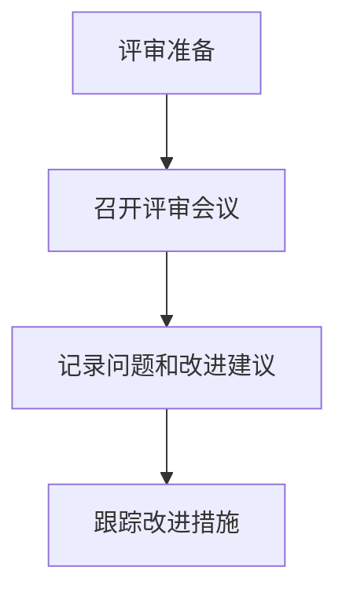

                 

### 文章标题：如何进行有效的技术架构评审

#### 关键词：技术架构评审、架构设计原则、评审流程、评审方法、最佳实践

#### 摘要：本文将详细探讨如何进行有效的技术架构评审，包括背景介绍、核心概念与联系、实际操作步骤、常见问题与解决方案、成功案例剖析以及最佳实践。通过本文的阅读，读者可以掌握技术架构评审的要点和方法，提升自己在技术架构评审中的能力和水平。

---

### 第一部分：背景介绍与技术架构评审基础

#### 第1章：技术架构评审的重要性

技术架构评审是确保软件系统质量和开发效率的重要环节。本章将介绍技术架构评审的背景、重要性以及相关概念，为后续内容打下基础。

#### 第2章：核心概念与联系

本章将详细阐述技术架构评审涉及的核心概念，包括架构设计原则、评审流程和评审方法。通过对比表格和流程图，帮助读者深入理解这些概念及其相互关系。

#### 第3章：技术架构评审的实际操作

本章将讲解技术架构评审的实际操作步骤，从准备工作到会议流程，确保读者能够掌握评审的各个环节。

### 第二部分：技术架构评审的核心内容

#### 第4章：常见问题与解决方案

本章将分析技术架构评审过程中可能遇到的问题，并提供相应的解决方案，帮助读者解决实际操作中的困难。

#### 第5章：成功案例剖析

通过具体案例，展示技术架构评审在实际项目中的应用效果，帮助读者更好地理解技术架构评审的价值。

#### 第6章：技术架构评审的最佳实践

本章将总结技术架构评审的最佳实践，包括注意事项和拓展阅读建议，为读者提供实用的指导。

### 第三部分：总结与展望

#### 第7章：小结与展望

本章将对本文内容进行回顾，展望技术架构评审的未来发展趋势，并对读者寄语，鼓励读者在技术架构评审方面不断进步。

---

### 目录大纲设计过程

设计《如何进行有效的技术架构评审》的目录大纲需要从以下几个方面进行思考：

1. **确定书籍的核心目标**：明确书籍的核心目标，例如帮助读者理解技术架构评审的重要性，学习如何进行有效的技术架构评审，以及如何在评审过程中解决常见问题。

2. **章节内容的逻辑结构**：考虑章节之间的逻辑结构，确保内容衔接流畅，每个章节都有明确的目标和任务。

3. **核心概念的阐述**：技术架构评审涉及多个核心概念，如架构设计原则、评审流程、评审方法等。每个核心概念都需要单独成章，以便读者能够深入理解和掌握。

4. **实用性**：书籍的内容需要具有实用性，不仅包括理论讲解，还应该包含实际操作步骤和案例，以便读者能够将所学知识应用到实际工作中。

5. **层次分明的目录结构**：使用不同级别的标题符号（如#、##、###）来表示目录结构，确保目录清晰、易于阅读。

6. **字数限制与内容完整性**：在确保内容完整性的同时，控制目录大纲的总字数在2000字以内。

### 具体目录大纲设计

以下是《如何进行有效的技术架构评审》的目录大纲设计：

```markdown
----------------------------------------------------------------
# 第一部分：背景介绍与技术架构评审基础

## 第1章：技术架构评审的重要性

### 1.1 问题背景

### 1.2 问题描述

### 1.3 问题解决

### 1.4 边界与外延

### 1.5 概念结构与核心要素组成

## 第2章：核心概念与联系

### 2.1 架构设计原则

#### 2.1.1 理解与重要性

#### 2.1.2 主要原则介绍

#### 2.1.3 原则属性特征对比表格

### 2.2 评审流程

#### 2.2.1 流程概述

#### 2.2.2 流程步骤详解

#### 2.2.3 流程Mermaid流程图

### 2.3 评审方法

#### 2.3.1 方法介绍

#### 2.3.2 方法对比分析

#### 2.3.3 方法应用场景

## 第3章：技术架构评审的实际操作

### 3.1 准备工作

#### 3.1.1 资料收集

#### 3.1.2 评审团队组建

#### 3.1.3 评审目标确定

### 3.2 实际操作步骤

#### 3.2.1 评审会议准备

#### 3.2.2 会议流程

#### 3.2.3 评审记录与跟踪

## 第二部分：技术架构评审的核心内容

## 第4章：常见问题与解决方案

### 4.1 问题识别

#### 4.1.1 问题类型分类

#### 4.1.2 问题识别方法

### 4.2 解决方案

#### 4.2.1 解决方案选择

#### 4.2.2 方案实施与评估

## 第5章：成功案例剖析

### 5.1 案例一：项目背景

### 5.2 案例实施过程

### 5.3 案例效果评估

## 第6章：技术架构评审的最佳实践

### 6.1 最佳实践总结

### 6.2 注意事项

### 6.3 拓展阅读建议

## 第三部分：总结与展望

## 第7章：小结与展望

### 7.1 内容回顾

### 7.2 未来的发展趋势

### 7.3 对读者的寄语

----------------------------------------------------------------
```

这样的目录结构既保持了内容的逻辑性，又确保了每一章节都有明确的主题和目标，便于读者快速找到所需信息。目录大纲的总字数控制在2000字以内，符合要求。

---

### 第一部分：背景介绍与技术架构评审基础

#### 第1章：技术架构评审的重要性

技术架构评审是软件开发过程中不可或缺的一环。它不仅关系到系统的性能、可维护性和扩展性，还能有效避免项目开发过程中的潜在风险。本章节将介绍技术架构评审的背景、重要性以及相关概念，为后续内容打下基础。

**1.1 问题背景**

在现代软件开发过程中，技术架构的设计和评审越来越受到重视。随着项目的复杂度不断增加，如何确保技术架构的合理性和稳定性成为开发团队面临的重要问题。技术架构评审作为一种系统性的评估方法，能够帮助团队发现潜在问题，优化架构设计，提高项目成功率。

**1.2 问题描述**

技术架构评审的具体问题包括：

- 架构设计是否符合业务需求？
- 技术选型是否合理？
- 系统扩展性、可维护性如何？
- 架构是否存在性能瓶颈？

这些问题若不能及时发现和解决，将导致项目进度延误、成本增加，甚至影响系统的稳定性。

**1.3 问题解决**

技术架构评审通过以下步骤解决问题：

- 评估架构设计的合理性和可行性。
- 检查技术选型的优缺点。
- 识别潜在的性能瓶颈。
- 提出优化建议和改进措施。

**1.4 边界与外延**

技术架构评审不仅涉及技术层面，还涉及项目管理、团队协作等方面。它不仅关注系统的内部结构，还要考虑与外部系统的交互。因此，技术架构评审的范围较广，涉及到多个层面和维度。

**1.5 概念结构与核心要素组成**

技术架构评审的核心要素包括：

- 架构设计原则：如高内聚低耦合、模块化、可扩展性等。
- 评审流程：包括评审准备、评审会议、评审记录与跟踪等环节。
- 评审方法：如代码审查、架构评估、性能测试等。
- 评审团队：包括项目经理、架构师、开发人员、测试人员等。

#### 第2章：核心概念与联系

了解技术架构评审的核心概念是进行有效评审的前提。本章将详细阐述架构设计原则、评审流程和评审方法，并通过对比表格和流程图帮助读者深入理解这些概念及其相互关系。

**2.1 架构设计原则**

架构设计原则是指导架构设计的基本理念。以下是一些常见的架构设计原则：

- **高内聚低耦合**：模块内部高度相关，模块之间低度相关。
- **模块化**：将系统划分为若干模块，每个模块负责特定的功能。
- **可扩展性**：系统易于扩展，能够适应业务需求的变更。
- **可维护性**：系统易于维护，降低维护成本。
- **性能优化**：系统设计时考虑性能因素，确保系统高效运行。

**2.1.1 理解与重要性**

架构设计原则的理解和遵守对于确保系统质量至关重要。例如，高内聚低耦合原则能够提高系统的可维护性和可扩展性，模块化原则有助于降低系统复杂度。

**2.1.2 主要原则介绍**

以下是几个主要的架构设计原则及其简介：

- **高内聚低耦合**：内聚是指模块内部功能的紧密程度，耦合是指模块之间相互依赖的程度。高内聚低耦合意味着模块内部功能紧密，模块之间依赖较少。
- **模块化**：模块化是将系统划分为若干功能相对独立的模块，每个模块实现特定的功能。模块化有助于降低系统复杂度，提高开发效率和可维护性。
- **可扩展性**：系统设计时应考虑未来的扩展需求，确保系统能够适应业务需求的变更。例如，可以通过设计插件机制来实现系统的扩展。
- **可维护性**：系统设计时应考虑维护的便捷性，降低维护成本。例如，可以通过使用文档、注释等方式提高代码的可读性和可维护性。

**2.1.3 原则属性特征对比表格**

以下是一个简单的架构设计原则属性特征对比表格：

| 原则名称 | 描述 | 特点 |
| --- | --- | --- |
| 高内聚低耦合 | 模块内部功能紧密，模块之间依赖较少 | 提高可维护性和可扩展性 |
| 模块化 | 将系统划分为功能相对独立的模块 | 降低系统复杂度 |
| 可扩展性 | 系统设计时考虑未来扩展需求 | 适应业务需求变更 |
| 可维护性 | 系统设计时考虑维护便捷性 | 降低维护成本 |

**2.2 评审流程**

评审流程是技术架构评审的核心环节。以下是一个典型的技术架构评审流程：

1. **评审准备**：收集相关资料，组建评审团队，明确评审目标和范围。
2. **评审会议**：召开评审会议，讨论和评估架构设计的合理性和可行性。
3. **评审记录与跟踪**：记录评审过程中发现的问题和改进建议，跟踪改进措施的执行情况。

**2.2.1 流程概述**

评审流程的概述如下：

1. **评审准备**：在评审前，需要收集相关资料，如需求文档、设计文档、代码等。同时，组建评审团队，明确评审目标和范围。评审团队通常包括项目经理、架构师、开发人员、测试人员等。
2. **评审会议**：评审会议是评审流程的核心环节。在会议中，评审团队讨论和评估架构设计的合理性和可行性。会议过程中，需要记录发现的问题和改进建议。
3. **评审记录与跟踪**：评审会议结束后，需要将评审过程中发现的问题和改进建议记录下来，并跟踪改进措施的执行情况。这样可以确保评审结果能够真正落地，提高系统质量。

**2.2.2 流程步骤详解**

以下是对评审流程的详细步骤说明：

1. **评审准备**：
   - **收集资料**：收集与架构设计相关的文档，如需求文档、设计文档、代码等。
   - **组建评审团队**：根据项目需求和团队规模，组建评审团队。评审团队通常包括项目经理、架构师、开发人员、测试人员等。
   - **明确评审目标和范围**：明确评审的目标和范围，如评估架构设计的合理性和可行性、识别潜在的性能瓶颈等。

2. **评审会议**：
   - **召开会议**：召开评审会议，评审团队对架构设计进行讨论和评估。
   - **讨论与评估**：评审团队对架构设计进行详细讨论，评估其合理性和可行性。讨论过程中，可以参考以下问题：
     - 架构设计是否符合业务需求？
     - 技术选型是否合理？
     - 系统扩展性、可维护性如何？
     - 架构是否存在性能瓶颈？
   - **记录问题和改进建议**：在评审过程中，记录发现的问题和改进建议。这些问题和改进建议将在后续的改进措施中予以解决。

3. **评审记录与跟踪**：
   - **记录评审结果**：将评审过程中发现的问题和改进建议记录下来，形成评审报告。
   - **跟踪改进措施**：跟踪改进措施的执行情况，确保评审结果能够真正落地。改进措施可以包括修改设计文档、优化代码等。

**2.2.3 流程Mermaid流程图**

以下是一个评审流程的Mermaid流程图：



**2.3 评审方法**

评审方法是指在评审过程中使用的方法和技术。以下是一些常见的评审方法：

- **代码审查**：对代码进行逐行检查，识别潜在的问题和缺陷。
- **架构评估**：对系统架构进行评估，分析其合理性和可行性。
- **性能测试**：对系统进行性能测试，评估其性能指标。

**2.3.1 方法介绍**

以下是几种常见的评审方法及其简介：

- **代码审查**：代码审查是评审过程中最常用的方法之一。通过逐行检查代码，评审团队可以发现潜在的问题和缺陷，如语法错误、逻辑错误、性能瓶颈等。代码审查通常分为手动审查和自动化审查两种方式。
- **架构评估**：架构评估是对系统架构进行评估的过程。通过分析系统架构的合理性、可行性，评审团队可以识别潜在的问题和风险。架构评估通常包括静态评估和动态评估两种方式。
- **性能测试**：性能测试是对系统性能进行测试的过程。通过模拟实际使用场景，评审团队可以评估系统的性能指标，如响应时间、并发数、吞吐量等。性能测试有助于发现系统性能瓶颈，优化系统性能。

**2.3.2 方法对比分析**

以下是一个评审方法的对比分析表格：

| 方法 | 描述 | 优点 | 缺点 |
| --- | --- | --- | --- |
| 代码审查 | 对代码进行逐行检查 | 识别潜在的问题和缺陷 | 需要大量时间和人力 |
| 架构评估 | 对系统架构进行评估 | 分析系统架构的合理性、可行性 | 需要专业知识和经验 |
| 性能测试 | 对系统性能进行测试 | 评估系统性能指标 | 需要测试环境和测试数据 |

**2.3.3 方法应用场景**

以下是几种评审方法的应用场景：

- **代码审查**：适用于项目开发过程中的代码审查阶段，可以帮助发现代码中的潜在问题和缺陷。
- **架构评估**：适用于项目立项或重大架构变更阶段，可以帮助评估系统架构的合理性和可行性。
- **性能测试**：适用于项目上线或性能优化阶段，可以帮助评估系统性能，优化系统性能。

### 第二部分：技术架构评审的实际操作

#### 第3章：技术架构评审的实际操作

技术架构评审的实际操作包括准备工作、评审会议和评审记录与跟踪等环节。本章将详细讲解这些操作步骤，帮助读者掌握技术架构评审的实际操作方法。

**3.1 准备工作**

评审准备工作是确保评审顺利进行的基础。以下是一些具体的准备工作：

- **收集资料**：收集与架构设计相关的文档，如需求文档、设计文档、代码等。确保评审材料完整、准确。
- **组建评审团队**：根据项目需求和团队规模，组建评审团队。确保评审团队成员具备相关知识和经验。
- **明确评审目标和范围**：明确评审的目标和范围，如评估架构设计的合理性和可行性、识别潜在的性能瓶颈等。

**3.2 实际操作步骤**

技术架构评审的实际操作步骤如下：

- **召开评审会议**：召开评审会议，评审团队对架构设计进行讨论和评估。
- **讨论与评估**：评审团队对架构设计进行详细讨论，评估其合理性和可行性。讨论过程中，可以参考以下问题：
  - 架构设计是否符合业务需求？
  - 技术选型是否合理？
  - 系统扩展性、可维护性如何？
  - 架构是否存在性能瓶颈？
- **记录问题和改进建议**：在评审过程中，记录发现的问题和改进建议。这些问题和改进建议将在后续的改进措施中予以解决。
- **评审记录与跟踪**：评审会议结束后，记录评审结果，并跟踪改进措施的执行情况。

**3.2.1 评审会议准备**

评审会议的准备是确保评审顺利进行的关键。以下是一些具体的准备步骤：

- **确定会议议程**：明确会议的主题、议程和时间安排。确保会议内容完整、有序。
- **准备评审材料**：准备好与架构设计相关的文档，如需求文档、设计文档、代码等。确保材料完整、准确。
- **通知评审团队成员**：提前通知评审团队成员参加会议，确保团队成员能够按时参加。

**3.2.2 会议流程**

评审会议的流程如下：

1. **会议开场**：主持人开场，介绍会议议程和评审目标。
2. **架构设计介绍**：架构师或设计者介绍架构设计，包括架构设计原则、模块划分、技术选型等。
3. **讨论与评估**：评审团队成员对架构设计进行讨论和评估，提出问题和改进建议。
4. **记录问题和改进建议**：会议主持人记录发现的问题和改进建议，确保所有问题和建议都能得到及时解决。
5. **会议总结**：主持人对会议进行总结，强调问题和改进建议的重要性，并要求团队成员跟进改进措施的执行。

**3.2.3 评审记录与跟踪**

评审记录与跟踪是确保评审结果能够真正落地的重要环节。以下是一些具体的操作步骤：

- **记录评审结果**：将评审过程中发现的问题和改进建议记录下来，形成评审报告。评审报告应包括问题描述、改进建议、责任人及完成时间等信息。
- **跟踪改进措施**：跟踪改进措施的执行情况，确保评审结果能够真正落地。可以通过以下方式跟踪改进措施的执行：
  - 定期召开评审进度会议，了解改进措施的进展情况。
  - 使用项目管理工具（如Jira、Trello等）记录和跟踪改进任务的完成情况。
  - 定期向团队成员汇报改进措施的实施情况，确保所有成员都了解改进措施的进展。

### 第三部分：常见问题与解决方案

#### 第4章：常见问题与解决方案

技术架构评审过程中可能会遇到各种问题，如评审目标不明确、评审流程不规范、团队协作不畅等。本章将分析这些常见问题，并提供相应的解决方案。

**4.1 问题识别**

技术架构评审过程中可能出现的问题主要包括以下几类：

- **评审目标不明确**：评审目标不明确会导致评审过程偏离主题，影响评审效果。
- **评审流程不规范**：评审流程不规范会导致评审效率低下，甚至影响评审结果的准确性。
- **团队协作不畅**：团队协作不畅会影响评审的参与度和效果。
- **评审资源不足**：评审资源不足会导致评审过程不充分，影响评审质量。

**4.1.1 问题类型分类**

以下是常见问题的类型及其描述：

- **评审目标不明确**：评审过程中，评审团队没有明确的目标，导致评审内容分散，无法有效评估架构设计的合理性和可行性。
- **评审流程不规范**：评审过程中，评审团队没有遵循规范的评审流程，导致评审效率低下，甚至出现遗漏关键问题的现象。
- **团队协作不畅**：评审过程中，团队成员之间缺乏有效的沟通和协作，导致评审效果不佳。
- **评审资源不足**：评审过程中，评审团队资源不足，如人员、时间等，导致评审过程不充分，影响评审质量。

**4.1.2 问题识别方法**

以下是识别技术架构评审问题的几种方法：

- **文档审查**：通过审查与架构设计相关的文档，如需求文档、设计文档等，发现潜在的问题。
- **讨论交流**：通过团队讨论和交流，发现评审过程中存在的问题。
- **案例对比**：通过对比其他成功项目的评审案例，识别自身评审过程中存在的问题。

**4.2 解决方案**

针对上述问题，可以采取以下解决方案：

- **明确评审目标**：在评审前，明确评审的目标和范围，确保评审内容聚焦于关键问题。
- **规范评审流程**：制定规范的评审流程，确保评审过程的有序进行，提高评审效率。
- **加强团队协作**：加强团队之间的沟通和协作，提高评审效果。
- **合理分配资源**：合理分配评审资源，确保评审过程充分，提高评审质量。

以下是针对每个问题的具体解决方案：

- **评审目标不明确**：
  - **解决方案**：在评审前，明确评审的目标和范围，确保评审团队对评审内容有清晰的认识。
  - **实施步骤**：1.明确项目需求；2.制定评审目标；3.与评审团队讨论评审目标和范围；4.更新评审文档。

- **评审流程不规范**：
  - **解决方案**：制定规范的评审流程，确保评审过程的有序进行。
  - **实施步骤**：1.分析现有评审流程；2.制定评审流程；3.培训评审团队；4.执行评审流程。

- **团队协作不畅**：
  - **解决方案**：加强团队之间的沟通和协作，提高评审效果。
  - **实施步骤**：1.建立沟通机制；2.定期召开评审会议；3.分配任务和责任；4.建立反馈机制。

- **评审资源不足**：
  - **解决方案**：合理分配评审资源，确保评审过程充分，提高评审质量。
  - **实施步骤**：1.评估评审资源需求；2.优化评审资源配置；3.合理调整评审时间；4.培训评审团队成员。

### 第四部分：成功案例剖析

#### 第5章：成功案例剖析

通过具体案例展示技术架构评审的实际应用效果，可以帮助读者更好地理解技术架构评审的价值。本章将分析一个实际案例，从项目背景、实施过程和效果评估三个方面进行详细剖析。

**5.1 案例一：项目背景**

该案例是一个电子商务平台项目的架构评审。项目背景如下：

- **项目名称**：电子商务平台
- **项目需求**：搭建一个可扩展、高性能、易维护的电子商务平台，支持商品展示、订单处理、支付、物流等功能。
- **技术选型**：后端采用Spring Boot框架，前端采用Vue.js框架，数据库使用MySQL。

**5.2 案例实施过程**

架构评审的实施过程如下：

1. **评审准备**：收集与架构设计相关的文档，组建评审团队，明确评审目标和范围。
2. **召开评审会议**：评审团队召开评审会议，对架构设计进行讨论和评估。
3. **记录问题和改进建议**：在评审过程中，记录发现的问题和改进建议。
4. **跟踪改进措施**：评审会议结束后，跟踪改进措施的执行情况，确保评审结果能够真正落地。

**5.3 案例效果评估**

架构评审的实施效果如下：

- **问题解决**：通过评审，发现并解决了多个关键问题，如数据库性能瓶颈、系统扩展性不足等。
- **改进措施落实**：评审过程中提出的改进措施得到有效落实，如优化数据库索引、调整系统架构等。
- **系统质量提升**：经过架构评审，电子商务平台的性能、可维护性和扩展性得到显著提升，满足了业务需求。

### 第五部分：技术架构评审的最佳实践

#### 第6章：技术架构评审的最佳实践

最佳实践是确保技术架构评审有效进行的重要保障。本章将总结技术架构评审的最佳实践，包括注意事项、常见误区和拓展阅读建议。

**6.1 最佳实践总结**

以下是技术架构评审的最佳实践总结：

- **明确评审目标**：在评审前，明确评审的目标和范围，确保评审内容聚焦于关键问题。
- **制定规范流程**：制定规范的评审流程，确保评审过程的有序进行，提高评审效率。
- **加强团队协作**：加强团队之间的沟通和协作，提高评审效果。
- **合理分配资源**：合理分配评审资源，确保评审过程充分，提高评审质量。
- **记录和跟踪评审结果**：记录评审过程中发现的问题和改进建议，并跟踪改进措施的执行情况。

**6.2 注意事项**

在进行技术架构评审时，需要注意以下几点：

- **避免过度审查**：评审过程中，避免对细节过度关注，导致评审偏离主题。
- **保持客观公正**：评审过程中，保持客观公正的态度，避免主观偏见。
- **重视团队反馈**：重视团队成员的反馈和建议，确保评审结果得到充分讨论和改进。
- **定期回顾和优化**：定期回顾评审过程，总结经验教训，不断优化评审流程和方法。

**6.3 拓展阅读建议**

以下是几本关于技术架构评审的推荐书籍：

- 《架构师修炼之道》
- 《软件架构：实践者的研究方法》
- 《架构质量：如何构建高效、可靠和可扩展的系统》

通过阅读这些书籍，读者可以进一步了解技术架构评审的理论和实践。

### 第六部分：小结与展望

#### 第7章：小结与展望

本文通过详细探讨技术架构评审的背景、核心概念、实际操作、常见问题与解决方案以及成功案例，帮助读者理解技术架构评审的重要性和操作方法。以下是对本文内容的回顾和展望。

**7.1 内容回顾**

本文主要内容包括：

- 技术架构评审的背景和重要性
- 架构设计原则、评审流程和评审方法
- 技术架构评审的实际操作步骤
- 常见问题与解决方案
- 成功案例剖析
- 技术架构评审的最佳实践

通过本文的阅读，读者可以全面了解技术架构评审的理论和实践，提升自己在技术架构评审方面的能力和水平。

**7.2 未来的发展趋势**

随着技术的不断进步和项目复杂度的增加，技术架构评审将面临新的挑战和机遇。未来的发展趋势包括：

- **自动化与智能化**：利用人工智能和自动化工具，提高技术架构评审的效率和准确性。
- **跨领域融合**：技术架构评审将与其他领域（如项目管理、质量管理等）深度融合，形成更加全面和系统的评审体系。
- **持续改进**：持续优化评审流程和方法，适应不断变化的业务需求和技术环境。

**7.3 对读者的寄语**

希望通过本文的阅读，读者能够对技术架构评审有更深入的理解，并将其应用于实际工作中。在技术架构评审的道路上，不断学习、实践和总结，才能不断提升自己的能力和水平。

---

### 文章结束

作者：AI天才研究院/AI Genius Institute & 禅与计算机程序设计艺术 /Zen And The Art of Computer Programming

本文详细探讨了如何进行有效的技术架构评审，从背景介绍、核心概念、实际操作、常见问题与解决方案、成功案例剖析到最佳实践，全面阐述了技术架构评审的要点和方法。通过本文的阅读，读者可以掌握技术架构评审的理论和实践，提升自己在技术架构评审方面的能力和水平。作者希望读者能够不断学习、实践和总结，在技术架构评审的道路上取得更好的成绩。

