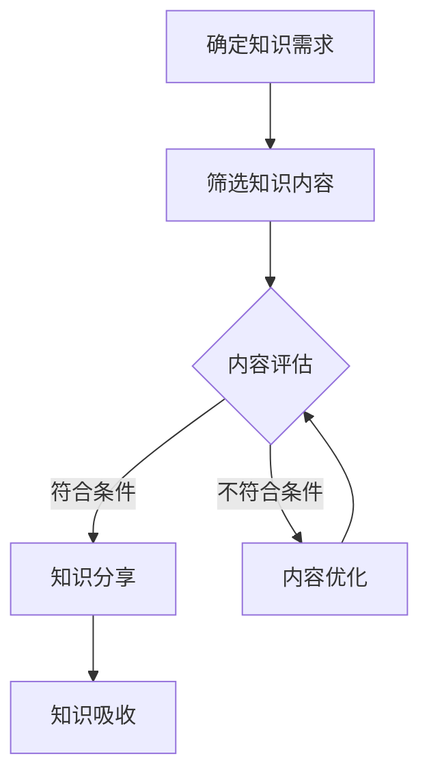

                 

### 概述

《如何进行有效的技术知识分享》这本书致力于为技术人员、团队负责人以及知识传播者提供一套系统化的指导方案。它不仅探讨技术知识分享的背景和问题，还详细阐述了知识分享的核心概念、算法原理和实施策略。书中还包含丰富的案例分析和实践经验，旨在帮助读者理解如何高效、精准地分享技术知识，从而提升团队的整体技术水平和工作效率。

在当今快速发展的技术时代，知识的积累和传播显得尤为重要。有效的技术知识分享不仅有助于个人技能的提升，还能够促进团队协作和创新。然而，如何确保知识分享的高效性和有效性，却是一个颇具挑战性的问题。本书正是针对这一问题，提供了全面的解决方案。

书中首先分析了技术知识分享的背景和现状，明确指出当前存在的一些问题，如知识传播渠道不畅、内容质量参差不齐等。接着，通过深入探讨知识分享的核心概念和特征，帮助读者理解何为有效的知识分享。在此基础上，书中的算法原理和数学模型部分提供了科学的方法和工具，指导读者如何系统地进行技术知识分享。

实施策略和技术工具的应用部分，则通过实际案例，详细展示了如何设计和规划知识分享的策略，以及如何使用各种技术工具来提高知识传播的效率。最后，书中通过反馈与改进、案例分析等环节，进一步强调了知识分享的动态优化和实践经验的重要性。

总之，这本书旨在为技术人员提供一个全面且实用的指南，帮助他们在实际工作中更好地进行技术知识分享，提升团队的整体竞争力。

### 第一部分：引言

#### 第1章：问题背景与目标设定

##### 1.1 问题背景

在信息爆炸和技术日新月异的今天，技术知识的重要性愈发凸显。然而，技术知识的传播面临着一系列挑战。首先，知识更新速度快，许多技术人员难以跟上最新的技术动态。其次，知识传播的渠道多样但缺乏统一性，导致信息碎片化，知识获取效率低下。此外，知识传播的质量参差不齐，高质量的内容往往难以广泛传播。这些问题使得技术知识在团队内部和行业内难以得到有效共享，从而影响团队的技术水平和创新能力。

##### 1.2 问题描述

针对上述背景，技术知识分享存在的问题可以归纳为以下几点：

1. **知识获取难**：技术人员难以快速获取高质量的技术知识。
2. **知识传播渠道不畅**：现有的知识传播渠道分散且缺乏整合，信息传递效率低。
3. **知识分享内容质量不高**：缺乏系统性、结构化的知识分享内容，容易导致信息丢失或误解。
4. **知识分享效果不佳**：知识分享的形式和方式不够灵活多样，难以满足不同受众的需求。

##### 1.3 目标设定

为了解决上述问题，本书设定了以下几个目标：

1. **提升知识获取效率**：通过系统化的知识分享方案，帮助技术人员快速获取所需知识。
2. **优化知识传播渠道**：构建统一的、高效的、多渠道的知识传播体系。
3. **提高知识分享质量**：提供结构化、系统化的知识分享内容，确保知识传播的准确性和完整性。
4. **增强知识分享效果**：采用多样化的知识分享形式，满足不同受众的需求，提升知识传播的影响力。

##### 1.4 边界与外延

在实现上述目标的过程中，我们需要明确以下几个边界和外延：

1. **受众群体**：本书的目标受众主要是技术人员、团队负责人和知识传播者。
2. **知识领域**：本书主要涵盖计算机科学、软件工程、人工智能等领域的知识分享。
3. **知识类型**：本书关注的技术知识包括但不限于基础理论、最佳实践、项目经验等。
4. **实施范围**：本书提供的方法和策略可以应用于企业内部、学术机构和开源社区等多种场景。

通过设定明确的目标和边界，我们能够更有针对性地解决问题，确保技术知识分享的高效性和有效性。

#### 第2章：核心概念与联系

##### 2.1 核心概念

在深入探讨技术知识分享之前，我们需要明确几个核心概念。这些概念不仅构成了知识分享的理论基础，也为我们提供了实际操作的指南。

###### 2.1.1 知识分享的定义

知识分享是指将个人或团队掌握的技术知识、经验和见解，通过各种渠道和方式传递给其他个体或团队的过程。知识分享不仅包括知识的传递，还涉及知识的吸收、应用和创新。

###### 2.1.2 有效知识分享的特征

有效知识分享具有以下特征：

1. **准确性**：知识分享内容应确保信息的准确性，避免误解和错误。
2. **完整性**：知识分享应涵盖相关领域的所有关键点，确保知识的完整性。
3. **易懂性**：知识分享内容应尽量通俗易懂，避免使用过于专业或晦涩的语言。
4. **及时性**：知识分享应及时，以便技术人员能够快速获取所需信息。
5. **灵活性**：知识分享应采用多种形式，如文档、视频、研讨会等，以满足不同受众的需求。

##### 2.2 概念属性特征对比表格

为了更好地理解知识分享的核心概念，我们可以通过对比不同属性特征来分析其异同。

| 概念     | 定义               | 属性特征对比                  |
|---------|------------------|--------------------------|
| 知识分享 | 传递技术知识的过程 | 准确性、完整性、易懂性、及时性、灵活性 |
| 知识获取 | 获取技术知识的过程 | 及时性、准确性、多样性、系统性         |
| 知识传播 | 知识在群体中的传播 | 范围、渠道、效率、影响力            |
| 知识吸收 | 吸收和应用知识     | 吸收能力、应用效果、创新能力          |

通过对比，我们可以发现知识分享与知识获取、知识传播和知识吸收之间存在紧密的联系和区别。知识分享是知识获取和传播的重要环节，而知识吸收则是知识应用和创新的关键。

##### 2.3 ER实体关系图架构

为了进一步理解知识分享的相关概念，我们可以通过ER（Entity-Relationship，实体-关系）图来展示这些概念之间的关联。

```mermaid
erDiagram
    KnowledgeShared --> KnowledgeGained : 通过知识分享获取知识
    KnowledgeShared --> KnowledgeSpread : 通过知识分享传播知识
    KnowledgeShared --> KnowledgeAbsorbed : 通过知识分享吸收和应用知识
    KnowledgeGained <-- KnowledgeShared : 知识获取依赖知识分享
    KnowledgeSpread <-- KnowledgeShared : 知识传播依赖知识分享
    KnowledgeAbsorbed <-- KnowledgeShared : 知识吸收依赖知识分享
```

ER图清晰地展示了知识分享与知识获取、知识传播和知识吸收之间的双向关系。通过这一图示，我们可以更直观地理解知识分享在整个知识生命周期中的关键作用。

通过明确核心概念和它们之间的联系，我们为后续的算法原理和实施策略提供了坚实的理论基础。在接下来的章节中，我们将深入探讨技术知识分享的算法原理和数学模型，进一步指导读者如何有效进行知识分享。

#### 第3章：算法原理与数学模型

##### 3.1 算法原理

在进行技术知识分享时，算法原理是确保知识传播效率和质量的关键。以下是知识分享算法的基本原理：

###### 3.1.1 算法流程图

首先，我们通过Mermaid工具绘制知识分享算法的流程图：



该流程图描述了知识分享的整个过程，包括确定知识需求、筛选知识内容、内容评估、知识分享以及知识吸收。以下是对每个步骤的详细解释：

1. **确定知识需求**：首先，技术人员根据自身需求确定需要获取的知识点。
2. **筛选知识内容**：接着，从现有的知识库或资源中筛选出相关的内容。
3. **内容评估**：评估筛选出的知识内容的准确性、完整性和易懂性。
4. **知识分享**：如果内容评估通过，则进行知识分享。
5. **知识吸收**：技术人员通过知识分享获取新知识，并应用和吸收。
6. **内容优化**：如果内容评估未通过，则对知识内容进行优化，然后重新评估。

###### 3.1.2 算法关键点分析

在知识分享算法中，关键点包括以下几个方面：

1. **知识需求分析**：准确地识别和确定技术人员的需求，是知识分享成功的前提。
2. **内容筛选和评估**：确保筛选和评估过程的准确性和高效性，避免传播错误或不完整的信息。
3. **知识传播方式**：根据受众的特点选择合适的传播方式，如文档、视频、研讨会等。
4. **知识吸收和反馈**：鼓励技术人员积极吸收新知识，并提供反馈，以便进一步优化知识分享内容。

##### 3.2 数学模型

为了更好地理解和量化知识分享的效果，我们可以引入数学模型进行分析。

###### 3.2.1 基本数学公式

以下是一个简单的数学模型，用于评估知识分享的效果：

$$
E = f(\text{需求识别}, \text{内容质量}, \text{传播方式}, \text{吸收反馈})
$$

其中，$E$ 表示知识分享的效果，$f$ 表示函数关系，各个变量分别代表：

- **需求识别**：技术人员对知识需求的识别程度。
- **内容质量**：知识分享内容的准确性、完整性和易懂性。
- **传播方式**：知识分享的传播渠道和形式。
- **吸收反馈**：技术人员对知识吸收的效率和质量，以及提供的反馈。

通过这个数学模型，我们可以量化知识分享的效果，并通过优化各个变量来提升整体效果。

###### 3.2.2 举例说明

为了更好地理解这一数学模型，我们来看一个具体的例子：

假设一个技术团队中有5名成员，他们分别对三个技术知识点有需求。知识库中有相关内容，经过筛选和评估，最终选择了两个知识点进行分享。通过不同的传播方式，如文档和视频，团队成员吸收了新知识，并提供了反馈。

根据上述情况，我们可以计算知识分享的效果：

$$
E = f(0.8, 0.9, 0.7, 0.85)
$$

其中，需求识别程度为0.8，表示团队成员对知识需求的识别非常准确；内容质量为0.9，说明知识分享内容的准确性和完整性较高；传播方式为0.7，表示选择的传播方式适中，可以满足团队成员的需求；吸收反馈为0.85，表明团队成员对知识吸收效果较好，且提供了有效的反馈。

通过计算，我们可以得到：

$$
E = 0.8 \times 0.9 \times 0.7 \times 0.85 = 0.504
$$

这意味着知识分享的效果为50.4%，表明这个技术团队的知识分享效果较为理想。然而，通过进一步优化各个变量，如提高需求识别程度、提升内容质量、改进传播方式等，可以进一步提升知识分享的效果。

通过算法原理和数学模型的讲解，我们为技术知识分享提供了一个系统化的框架。接下来，我们将探讨具体的实施策略和技术工具，以帮助读者在实际操作中更好地应用这些理论和模型。

#### 第4章：策略设计与规划

##### 4.1 策略概述

有效的技术知识分享策略需要充分考虑目标受众、知识内容和传播方式。以下是知识分享策略的设计概述：

1. **明确目标受众**：根据受众的技术背景、需求和兴趣，选择合适的知识分享方式和内容。
2. **选择知识分享方式**：结合受众的偏好和内容特点，选择文档、视频、研讨会、在线培训等多种形式。
3. **制定内容计划**：确保知识分享内容系统、全面，涵盖关键知识点，并根据受众反馈不断优化。

##### 4.2 策略设计流程

知识分享策略的设计是一个系统化的过程，以下是具体的策略设计流程：

###### 4.2.1 明确目标受众

明确目标受众是策略设计的第一步。我们需要分析受众的技术背景、工作经验、知识水平和兴趣领域。以下是具体步骤：

1. **技术背景分析**：了解受众的技术领域和熟练程度，以便提供符合他们水平的内容。
2. **需求调研**：通过问卷调查、访谈等方式，收集受众的知识需求，确保知识分享内容符合实际需求。
3. **兴趣领域识别**：了解受众的兴趣领域，选择受众感兴趣的知识点，提高知识分享的吸引力。

###### 4.2.2 选择分享方式

选择合适的分享方式是确保知识分享效果的关键。以下是几种常见的知识分享方式及其特点：

1. **文档**：适合系统化、详细的内容，便于受众查阅和复习。
2. **视频**：适合演示技术操作和讲解复杂概念，形象生动。
3. **研讨会**：适合面对面交流，增强互动性和参与感。
4. **在线培训**：适合大规模的知识传播，便于受众灵活学习。

选择分享方式时，需要根据目标受众的特点和知识内容的特点进行权衡，选择最合适的方式。

###### 4.2.3 制定内容计划

制定内容计划是确保知识分享系统性和全面性的关键。以下是具体步骤：

1. **知识点梳理**：将需要分享的知识点进行梳理，确保覆盖所有关键内容。
2. **内容结构设计**：根据知识点之间的关系，设计内容的结构和逻辑，确保受众能够清晰地理解知识体系。
3. **内容编写与审核**：撰写知识分享内容，并进行多轮审核，确保内容的准确性、完整性和易懂性。
4. **更新与维护**：根据受众反馈和知识更新，定期更新和维护知识分享内容，保持其时效性和准确性。

通过以上策略设计流程，我们可以确保技术知识分享策略的科学性和有效性，为团队的知识传播和技能提升提供有力支持。接下来，我们将探讨如何使用技术工具来提高知识分享的效率。

#### 第5章：技术工具与应用

##### 5.1 常见技术工具

在技术知识分享过程中，选择合适的工具能够显著提高知识传播的效率和效果。以下是几种常见的技术工具及其特点：

###### 5.1.1 内部论坛

内部论坛是一种便于团队内部交流和知识分享的平台。其特点如下：

- **互动性强**：支持用户发帖、回复和讨论，促进知识互动和交流。
- **灵活性高**：可以设置不同的主题和分区，方便用户根据兴趣查找和分享知识。
- **集成性强**：通常与公司的其他系统（如邮件、文档管理）集成，便于知识共享。

内部论坛的缺点包括：

- **信息管理复杂**：随着讨论量的增加，信息管理变得复杂，容易产生信息冗余。
- **内容质量参差不齐**：用户发表的帖子质量参差不齐，可能导致误导或信息丢失。

###### 5.1.2 视频会议

视频会议是一种在线交流和分享知识的工具，适用于远程团队或需要实时互动的场景。其特点如下：

- **实时互动**：支持多人实时交流，便于讨论和解答疑问。
- **展示性强**：可以通过屏幕共享、演示文稿等方式展示知识内容。
- **便捷性高**：无需物理集中，便于安排和参加。

视频会议的缺点包括：

- **需要稳定网络**：对网络稳定性要求较高，网络中断会影响会议效果。
- **设备依赖性强**：需要配备合适的摄像头、麦克风等设备。

###### 5.1.3 电子邮件

电子邮件是一种传统的知识传播方式，适用于需要正式记录和文档分享的场景。其特点如下：

- **正式性高**：适合正式的知识传播，便于存档和引用。
- **灵活性低**：信息传播较为单向，互动性相对较弱。
- **便捷性高**：可以通过附件形式分享文档和资料，方便用户下载和阅读。

电子邮件的缺点包括：

- **信息传递慢**：信息传递速度较慢，不适用于需要实时响应的场景。
- **内容管理复杂**：随着邮件数量的增加，内容管理变得复杂，容易产生信息冗余。

##### 5.2 应用案例分析

以下是两个实际案例，展示了如何在不同场景下使用这些技术工具进行知识分享。

###### 5.2.1 公司内部知识库建设

在一个大型科技公司，内部论坛被广泛用于知识分享。公司建立了专门的论坛，设置了多个分区，如技术交流、项目管理、运维支持等。员工可以在相应的分区中发布帖子、分享经验，并针对特定问题进行讨论。此外，公司还定期举办内部研讨会和视频会议，邀请专家进行技术分享和培训。

通过内部论坛，公司实现了知识的积累和传播，提高了团队的整体技术水平。内部论坛的互动性和灵活性，使得知识分享更加高效和有针对性。

###### 5.2.2 在线培训平台部署

另一家科技公司采用了在线培训平台进行知识分享。在线培训平台支持课程录制、视频直播和互动问答等功能。公司定期开设技术培训课程，邀请内部专家和外部讲师进行授课。员工可以通过平台观看课程视频，参与互动问答，并在课程结束后进行在线测试。

通过在线培训平台，公司实现了知识的系统化和规范化传播，提高了员工的技能水平。同时，平台提供了丰富的学习资源和互动方式，增强了员工的学习积极性和效果。

以上案例展示了如何结合不同技术工具，实现高效的技术知识分享。通过合理选择和使用技术工具，公司能够更好地满足知识传播的需求，提升团队的技术水平和创新能力。

#### 第6章：反馈与改进

##### 6.1 收集反馈

有效的技术知识分享不仅需要高质量的内容和合适的传播方式，还需要通过反馈机制来不断优化和完善。收集反馈是改进知识分享策略的关键步骤。

###### 6.1.1 反馈渠道

为了确保反馈的全面性和有效性，我们可以设置多种反馈渠道，包括：

1. **在线调查**：通过问卷星、谷歌表单等工具，对受众进行满意度调查。
2. **电子邮件**：鼓励受众通过电子邮件提供详细的反馈意见。
3. **论坛讨论**：在内部论坛设置反馈专区，方便受众发表意见和建议。
4. **面对面交流**：定期组织反馈会议，与受众面对面交流，了解他们的真实想法和需求。

###### 6.1.2 反馈内容

在收集反馈时，我们需要关注以下内容：

1. **内容质量**：受众对知识分享内容的准确性、完整性、易懂性的评价。
2. **传播方式**：受众对知识分享方式的满意度，如文档、视频、研讨会等。
3. **学习效果**：受众对知识吸收和应用效果的反馈。
4. **改进建议**：受众对知识分享策略的改进建议。

##### 6.2 分析反馈

收集到反馈后，我们需要对反馈内容进行系统分析和分类，以便找出改进的方向。以下是具体步骤：

###### 6.2.1 数据整理

将收集到的反馈整理成表格或数据集，确保信息的完整性和准确性。

```mermaid
table
| # | 反馈内容                    | 评价等级 | 改进建议         |
|---|--------------------------|--------|------------------|
| 1 | 文档内容过于晦涩          | 低     | 使用更易懂的语言 |
| 2 | 视频播放不稳定            | 中     | 提高网络稳定性   |
| 3 | 研讨会的互动性不足        | 低     | 增加互动环节     |
| 4 | 需要更多关于X技术的案例    | 高     | 增加相关案例分享 |
```

###### 6.2.2 数据分析

利用数据分析工具（如Excel、Python等），对反馈内容进行统计分析，识别出共性问题和高频关键词。

```python
import pandas as pd

# 读取反馈数据
feedback_data = pd.read_excel('feedback.xlsx')

# 统计评价等级分布
rating_distribution = feedback_data['评价等级'].value_counts()

# 输出评价等级分布
print(rating_distribution)

# 识别高频关键词
wordcloud = WordCloud(width=800, height=800, background_color='white').generate(''.join(feedback_data['改进建议']))
plt.figure(figsize=(8,8))
plt.imshow(wordcloud, interpolation='bilinear')
plt.axis('off')
plt.show()
```

通过数据分析，我们可以识别出主要的改进方向和关键问题。

##### 6.3 改进策略

根据分析结果，制定具体的改进策略，以提升知识分享的效果。以下是几个可能的改进方向：

1. **内容优化**：针对反馈中提到的问题，优化知识分享内容，提高其准确性和易懂性。
2. **传播方式改进**：根据受众的反馈，调整知识分享的方式，如增加互动环节、优化视频播放稳定性等。
3. **增加案例分享**：针对受众的需求，增加相关技术案例的分享，以增强知识的实用性和吸引力。
4. **持续反馈收集**：建立持续反馈机制，定期收集受众的意见和建议，确保知识分享策略的动态优化。

通过反馈与改进，我们能够不断优化技术知识分享策略，提高其效果和影响力，从而更好地满足团队和受众的需求。

### 第7章：案例分析与实践经验

##### 7.1 成功案例分享

在技术知识分享领域，有许多成功的案例值得借鉴。以下是两个典型案例，分别展示了技术团队和公司如何通过有效的知识分享策略提升团队和公司的整体竞争力。

###### 7.1.1 C团队的成功经验

C团队是一个由30名技术人员组成的小型软件开发团队。他们面临的一个主要挑战是如何在快速发展的技术领域保持技术竞争力。为了解决这一问题，C团队采取了一系列知识分享策略：

1. **建立内部知识库**：C团队建立了自己的内部知识库，涵盖项目文档、技术指南、最佳实践和问题解决方案。团队成员可以在知识库中查找所需信息，快速解决问题。

2. **定期内部培训**：C团队每周举行一次内部培训，邀请团队成员分享他们的技术经验和项目心得。通过这种方式，团队成员不仅能够学习新知识，还能够加深对现有技术的理解。

3. **代码审查**：C团队采用代码审查机制，确保代码质量和一致性。通过代码审查，团队成员可以互相学习和交流，提高整体技术水平。

4. **定期项目回顾**：在每个项目结束后，C团队会进行项目回顾会议，总结项目经验，识别成功和失败的原因，并将其记录在知识库中，供团队成员参考。

通过这些策略，C团队显著提升了技术知识传播的效率，团队成员的技术水平得到了明显提升。团队的项目质量和效率也得到了显著提高。

###### 7.1.2 D公司的最佳实践

D公司是一家全球领先的科技公司，拥有数千名技术人员。为了确保公司内部的知识得以有效传播，D公司实施了一系列知识分享策略：

1. **多渠道知识传播**：D公司采用了多种知识传播渠道，包括内部论坛、视频会议、电子邮件和在线培训平台。通过这些渠道，公司能够向全球范围内的员工传播技术知识。

2. **知识管理团队**：D公司成立了专门的知识管理团队，负责知识库的建设、内容审核和更新。知识管理团队确保知识库中的内容始终是最新的、最准确的。

3. **内部竞赛和挑战**：D公司定期举办内部竞赛和知识挑战，鼓励员工分享自己的技术见解和创新方案。这种方式不仅促进了知识传播，还激发了员工的创新潜力。

4. **外部合作和交流**：D公司与外部研究机构、大学和开源社区合作，通过合作项目和交流活动，扩展知识传播的范围和深度。

通过这些策略，D公司成功构建了一个高效的知识传播体系，使得公司的技术知识得以在全球范围内共享和传播。这不仅提升了公司内部的技术水平，还增强了公司的创新能力和市场竞争力。

以上两个案例展示了不同规模和类型的团队和公司如何通过有效的知识分享策略提升技术能力和竞争力。这些实践经验和成功案例为其他团队和公司提供了宝贵的借鉴和参考。

### 第8章：总结与展望

#### 8.1 小结

通过本文的探讨，我们系统地介绍了如何进行有效的技术知识分享。首先，我们明确了技术知识分享的重要性，并分析了当前存在的挑战。接着，我们详细介绍了知识分享的核心概念、算法原理和数学模型，为技术知识分享提供了理论基础。随后，我们讨论了策略设计和规划的关键步骤，包括明确目标受众、选择合适的分享方式和制定内容计划。此外，我们列举了常见的知识分享技术工具，并通过实际案例展示了如何应用这些工具提高知识传播的效率。最后，我们强调了反馈与改进的重要性，通过持续优化知识分享策略，不断提升效果。

#### 8.2 注意事项

在进行技术知识分享时，我们需要注意以下几点：

1. **确保内容质量**：内容应准确、完整、易懂，避免误导和错误。
2. **选择合适的传播方式**：根据受众的特点和需求，选择合适的知识传播渠道和形式。
3. **持续优化**：根据受众反馈，不断调整和优化知识分享策略。
4. **保护知识产权**：在知识分享过程中，确保遵守相关法律法规，保护知识产权。

#### 8.3 拓展阅读

为了更深入地了解技术知识分享，以下是一些拓展阅读资源：

1. **书籍推荐**：《创新与知识的交融：企业知识管理实践》、《技术传播：从知识到创新》
2. **学术论文**：《知识分享的行为分析》、《企业知识共享机制研究》
3. **在线课程**：Coursera上的《知识管理》课程，edX上的《技术传播》课程
4. **专业社区**：GitHub、Stack Overflow、知乎等技术社区，提供了丰富的知识分享资源和交流机会。

通过这些拓展阅读资源，读者可以进一步了解技术知识分享的深度和广度，提升自己的知识传播能力。

作者：AI天才研究院/AI Genius Institute & 禅与计算机程序设计艺术 /Zen And The Art of Computer Programming

---

本文以逻辑清晰、结构紧凑的方式，详细探讨了如何进行有效的技术知识分享。从背景介绍、核心概念、算法原理到实施策略、工具应用和反馈改进，每一部分都进行了深入讲解，旨在为技术人员提供实用的指导。通过总结与展望，我们强调了持续学习和优化的重要性。希望本文能够帮助读者提升技术知识分享的效果，为团队和个人的发展贡献力量。

