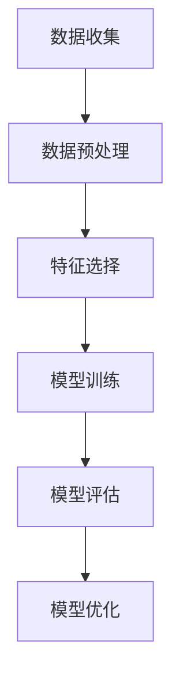
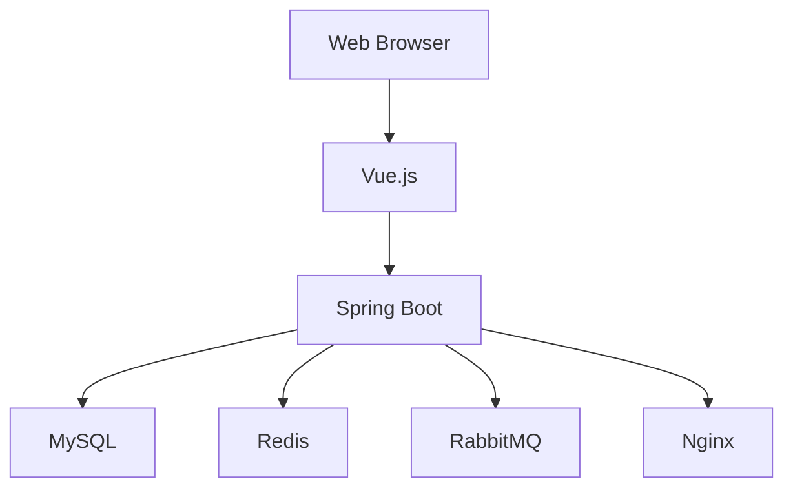
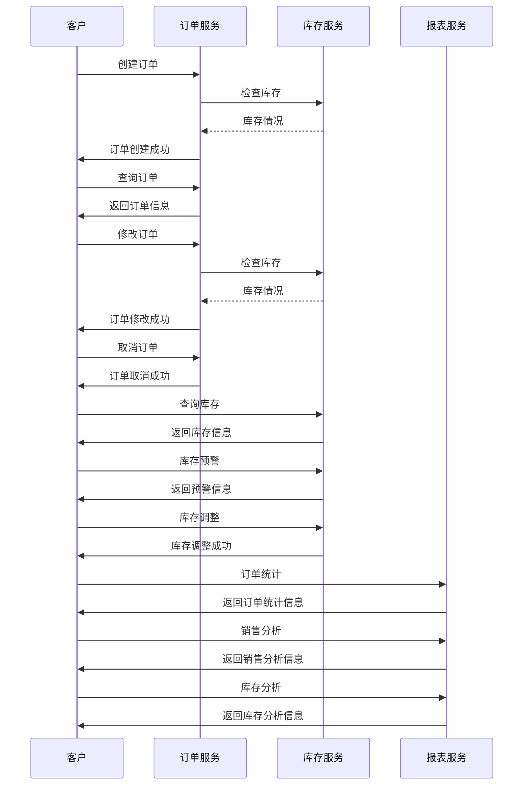
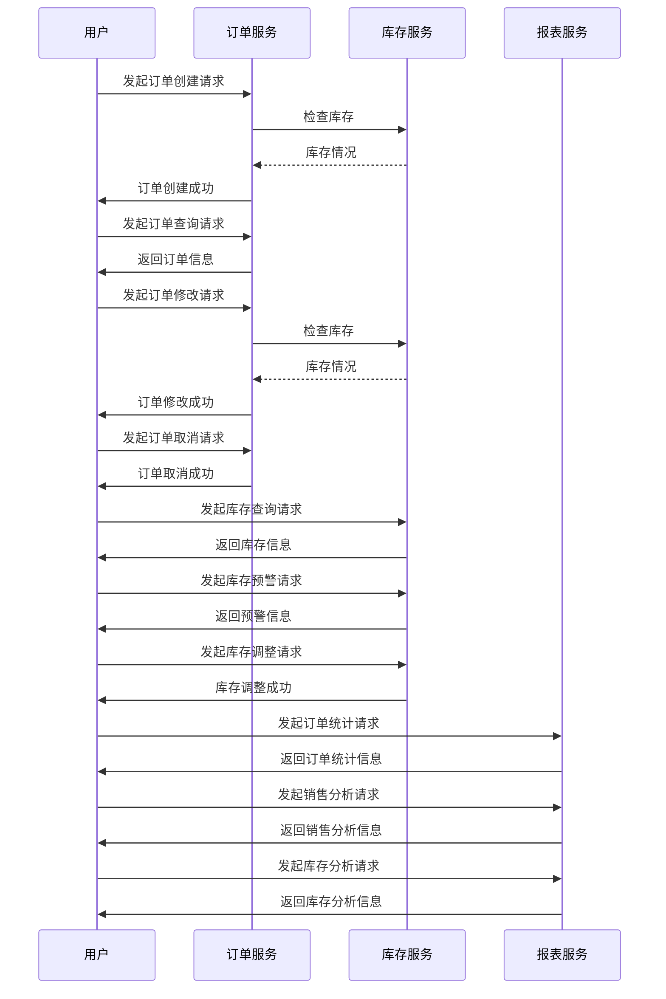

                 

## 如何进行有效的技术转型管理

在当今快速变化的技术环境中，企业面临的最大挑战之一就是如何进行有效的技术转型管理。随着新技术、新业务模式的不断涌现，企业需要不断调整和优化自身的IT基础设施、业务流程和技术架构，以保持竞争力。本文将逐步探讨如何进行有效的技术转型管理，并提供实用的指导和建议。

### 关键词

- 技术转型管理
- IT基础设施
- 业务流程
- 技术架构
- 管理策略
- 团队建设
- 项目规划与实施
- 算法原理

### 摘要

本文首先介绍了技术转型的背景和重要性，然后详细探讨了技术转型的核心概念、管理策略和方法，以及技术转型中的关键算法原理。通过逐步分析和技术讲解，本文旨在为读者提供一套全面、实用的技术转型管理方法论，帮助企业在快速变化的市场环境中实现成功的转型。

### 第1章: 问题背景与问题描述

#### 1.1 问题背景

随着信息技术的迅猛发展，企业所面临的技术环境正在发生深刻的变化。云计算、大数据、人工智能等新兴技术的广泛应用，不仅改变了企业的运营模式，也对传统的IT架构和业务流程提出了新的要求。企业需要不断地调整和优化自身的IT基础设施、业务流程和技术架构，以适应这种变化。

首先，云计算的兴起为企业提供了更加灵活、高效的IT基础设施。企业可以通过云服务快速获取所需的计算资源、存储空间和应用程序，从而降低IT成本，提高运营效率。

其次，大数据技术的应用使得企业能够从海量数据中提取有价值的信息，从而做出更加精准的决策。企业需要建立完善的数据仓库、数据分析和数据挖掘体系，以支持大数据的应用。

最后，人工智能技术的快速发展为企业带来了全新的业务模式。通过人工智能技术，企业可以实现自动化、智能化的运营，提高生产效率，降低成本。

#### 1.1.2 企业技术转型的必要性

在当前的技术环境下，企业进行技术转型不仅是必要的，而且是迫切的。具体来说，技术转型的必要性体现在以下几个方面：

首先，技术转型可以帮助企业提高竞争力。随着新兴技术的普及，那些能够快速适应新技术、新业务模式的企业将在市场上脱颖而出。而那些固守传统技术、拒绝变革的企业将逐渐被市场淘汰。

其次，技术转型可以帮助企业降低运营成本。通过引入云计算、大数据等新兴技术，企业可以大幅降低IT基础设施的维护成本，提高运营效率。

最后，技术转型可以帮助企业实现业务创新。新兴技术为企业提供了丰富的工具和平台，使得企业能够以更加创新的方式开展业务，开拓新的市场机会。

#### 1.1.3 技术转型的挑战与机遇

尽管技术转型对企业来说具有重要意义，但同时也面临着诸多挑战。首先，技术转型需要企业投入大量的资金和人力资源，这对企业的财务状况和团队素质提出了较高要求。

其次，技术转型涉及到企业现有的业务流程和IT系统，需要对现有的流程和系统进行大规模的调整和重构，这可能会对企业的正常运营产生一定影响。

最后，技术转型还涉及到企业文化的变革。新兴技术往往代表着新的思维方式和工作方式，企业需要培养员工的创新意识和学习能力，以适应这种变化。

然而，技术转型也带来了诸多机遇。首先，技术转型可以帮助企业实现业务模式的创新，开拓新的市场机会。其次，技术转型可以提高企业的生产效率，降低运营成本，从而增强企业的竞争力。

### 1.2 问题描述

在技术转型的过程中，企业可能会面临以下问题：

首先，如何确定技术转型的目标和方向？企业需要明确技术转型的目标和预期效果，以便有针对性地制定转型计划和策略。

其次，如何制定和实施技术转型的方案？企业需要制定详细的转型计划，包括技术评估、项目规划、资源分配等，以确保技术转型的顺利实施。

最后，如何管理技术转型的项目？企业需要建立有效的项目管理机制，确保项目在预算、时间、质量等方面得到有效控制。

### 1.3 核心概念

#### 1.3.1 技术转型的定义与类型

技术转型是指企业通过引入新的技术、工具和平台，对现有的业务流程、IT系统和文化进行大规模调整和重构，以实现业务模式的创新和运营效率的提升。

根据技术转型的程度和范围，可以分为以下几种类型：

1. **技术升级**：在现有技术基础上进行升级和优化，以提升性能和稳定性。
2. **技术重构**：对现有的IT系统进行全面的改造和重构，以实现业务流程和系统架构的优化。
3. **技术革新**：引入全新的技术，彻底改变企业的业务模式和组织结构。

#### 1.3.2 相关概念解析：技术革新、业务创新、组织变革

1. **技术革新**：技术革新是指通过引入全新的技术，对企业的业务模式、产品和服务进行根本性的改变。技术革新通常涉及到企业的战略方向和核心竞争力的转变。

2. **业务创新**：业务创新是指通过改进业务流程、产品和服务，提高企业的竞争力。业务创新通常涉及到企业的运营模式和盈利模式的优化。

3. **组织变革**：组织变革是指通过调整企业的组织结构、文化和管理制度，以适应新的业务模式和技术环境。组织变革通常涉及到企业的人员配置、激励机制和组织文化的改变。

### 1.3.3 技术转型的边界与外延

技术转型的边界包括以下几个方面：

1. **技术范围**：技术转型涉及到的技术范围，如云计算、大数据、人工智能等。
2. **业务范围**：技术转型影响的业务范围，如市场营销、生产制造、客户服务等。
3. **组织范围**：技术转型影响到的组织范围，如团队结构、岗位职责、组织文化等。

技术转型的外延包括以下几个方面：

1. **技术升级**：在现有技术基础上进行升级和优化，以提高性能和稳定性。
2. **业务创新**：通过改进业务流程、产品和服务，提高企业的竞争力。
3. **组织变革**：通过调整企业的组织结构、文化和管理制度，以适应新的业务模式和技术环境。

### 第2章: 技术转型的核心概念与联系

#### 2.1 核心概念原理

技术转型的核心概念包括技术评估、项目规划、资源分配、风险管理等。这些概念在技术转型过程中起着关键作用，以下是它们的基本原理：

1. **技术评估**：技术评估是指对新兴技术进行评估和分析，以确定其对企业业务的潜在影响和可行性。技术评估可以帮助企业确定技术转型的方向和策略。

2. **项目规划**：项目规划是指制定详细的技术转型计划，包括项目目标、范围、时间表、资源分配等。项目规划可以帮助企业确保技术转型的顺利实施。

3. **资源分配**：资源分配是指将企业的资源（如资金、人力、技术等）合理分配到技术转型项目中，以确保项目的顺利实施。资源分配需要考虑项目的优先级和资源约束。

4. **风险管理**：风险管理是指识别、评估和应对技术转型过程中的潜在风险。风险管理可以帮助企业预防和缓解技术转型过程中的风险。

#### 2.2 概念属性特征对比

表1 技术转型相关概念属性特征对比

| 概念 | 定义 | 特征 |
| --- | --- | --- |
| 技术革新 | 引入全新技术，改变业务模式 | 创新性、颠覆性、高风险 |
| 业务创新 | 改进业务流程、产品和服务 | 创新性、可持续性、低风险 |
| 组织变革 | 调整组织结构、文化和管理制度 | 结构性、系统性、高风险 |

#### 2.3 ER实体关系图架构

以下是技术转型管理中涉及的实体及其关系的ER图：

```mermaid
erDiagram
  User ||--|{ Employee } : manages
  Employee ||--|{ Project } : works_on
  Project ||--|{ Task } : contains
  Task ||--|{ Resource } : requires
```

- **User**：代表企业的用户，如员工、客户等。
- **Employee**：代表企业的员工，负责管理工作和项目。
- **Project**：代表技术转型项目，包含一系列的任务和资源。
- **Task**：代表项目中的具体任务，需要消耗资源和时间。
- **Resource**：代表项目所需的资源，如资金、人力、技术等。

通过上述ER图，我们可以清晰地看到技术转型管理中的各个实体及其关系，这有助于我们更好地理解技术转型的核心概念和联系。

### 第3章: 技术转型管理策略与原则

#### 3.1 技术转型管理策略

技术转型管理策略是企业进行技术转型过程中所采取的一系列方法和措施。一个有效的技术转型管理策略可以帮助企业明确转型目标，优化资源配置，提高转型成功率。以下是技术转型管理策略的几个关键点：

1. **制定技术转型战略**：企业需要明确技术转型的目标和方向，制定长期和短期的战略规划。战略规划应考虑企业的整体业务目标、市场环境、技术发展趋势等因素。

2. **确立技术转型目标**：技术转型目标应具体、可衡量、可实现。企业应明确技术转型的关键指标，如提高运营效率、降低成本、增强市场竞争力等。

3. **构建技术转型计划**：技术转型计划是实施技术转型战略的具体步骤和行动方案。计划应包括项目范围、时间表、预算、资源分配、风险管理等。

4. **全员参与**：技术转型不仅是IT部门的责任，而是企业全体员工的共同任务。企业应通过培训、激励等措施，激发员工的参与热情，确保全员共同推进技术转型。

5. **持续改进**：技术转型是一个持续的过程，企业应不断评估和调整转型计划，以适应不断变化的市场和技术环境。

6. **风险管理**：技术转型过程中可能会面临各种风险，如技术风险、市场风险、操作风险等。企业应建立完善的风险管理体系，识别、评估和应对各种风险。

#### 3.2 技术转型管理原则

1. **全员参与原则**：技术转型需要全员参与，包括管理人员、技术人员、业务人员等。只有全员共同努力，才能确保技术转型的成功。

2. **持续改进原则**：技术转型不是一次性的活动，而是一个持续的过程。企业应不断评估和优化转型效果，持续改进技术架构和业务流程。

3. **风险管理原则**：技术转型过程中，企业应高度重视风险管理，建立完善的风险识别、评估和应对机制，确保转型过程的稳定和可控。

4. **灵活应对原则**：在技术转型过程中，企业应保持灵活应对，及时调整转型计划和策略，以应对市场和技术环境的变化。

5. **资源优化原则**：技术转型需要大量的资源投入，企业应合理分配资源，确保资源的最优配置和利用。

6. **透明沟通原则**：企业应建立透明的沟通机制，确保各部门和员工能够及时了解技术转型的进展和计划，提高沟通效率和协作效果。

#### 3.3 技术转型管理工具与方法

1. **项目管理工具**：企业可以采用项目管理工具，如JIRA、Trello等，来规划、跟踪和管理技术转型项目。

2. **敏捷开发方法**：敏捷开发方法可以帮助企业快速响应市场需求和技术变化，提高技术转型的灵活性和适应性。

3. **风险矩阵**：企业可以使用风险矩阵来评估和管理技术转型过程中的风险。

4. **KPI体系**：建立关键绩效指标（KPI）体系，以量化评估技术转型的效果和进展。

5. **培训与发展计划**：企业应制定培训和发展计划，提高员工的技术能力和创新能力，以支持技术转型。

### 第4章: 技术转型项目规划与实施

#### 4.1 项目规划

项目规划是技术转型管理的关键环节，它涉及到项目的目标、范围、时间表、资源分配等方面的内容。一个详细的项目规划可以帮助企业确保技术转型的顺利实施。以下是项目规划的主要步骤：

1. **明确项目目标**：项目目标应具体、可衡量、可实现，应与企业的整体战略目标相一致。例如，提高生产效率20%、降低运营成本15%、增强市场竞争力等。

2. **界定项目范围**：明确项目的工作内容和范围，包括需要完成的任务、涉及到的部门、参与的人员等。项目范围应具体明确，以避免在实施过程中出现不必要的变更。

3. **制定时间表**：项目时间表应详细列出项目的关键里程碑和交付物，确保项目在预定时间内完成。时间表应考虑到项目实施过程中可能遇到的困难和风险，留有足够的时间缓冲。

4. **资源分配**：根据项目需求和优先级，合理分配项目所需的资源，包括资金、人力、技术等。资源分配应考虑到项目的整体需求和员工的可用性，确保资源的有效利用。

5. **风险评估**：识别项目实施过程中可能遇到的风险，评估风险的可能性和影响，制定相应的应对措施。风险评估可以帮助企业提前预防和应对潜在的风险。

6. **沟通计划**：建立有效的沟通机制，确保项目团队成员能够及时了解项目的进展和计划，提高沟通效率和协作效果。

#### 4.2 项目实施

项目实施是技术转型管理的核心环节，它涉及到项目的具体执行和监控。以下是项目实施的主要步骤：

1. **启动会议**：项目启动会议是项目实施的开始，应邀请项目团队成员、利益相关者参加，明确项目的目标、范围、时间表、资源分配等，确保团队成员对项目有共同的理解。

2. **任务分解**：将项目任务分解为具体的子任务，明确每个子任务的负责人和截止时间，确保任务的有序推进。

3. **执行任务**：项目团队成员按照任务分解的结果，开始执行各自的子任务。在执行过程中，应遵循项目计划和流程，确保任务的高效完成。

4. **监控进度**：项目经理应定期监控项目的进度，及时发现和解决问题，确保项目在预定时间内完成。监控进度可以通过项目管理工具来实现，如JIRA、Trello等。

5. **风险管理**：在项目实施过程中，应持续监控和管理风险，及时采取应对措施，确保项目能够顺利实施。

6. **沟通与协作**：项目团队成员应保持密切的沟通和协作，确保信息的及时传递和问题的快速解决。

7. **项目评审**：项目实施完成后，应进行项目评审，总结项目经验教训，评估项目的成果和效果。项目评审可以帮助企业不断改进项目管理方法，提高项目成功率。

#### 4.3 项目监控与调整

项目监控是确保项目顺利实施的重要手段。以下是项目监控的主要步骤：

1. **设定监控指标**：根据项目目标和范围，设定项目监控的指标，如进度、成本、质量等。监控指标应具体、可衡量、可实现。

2. **定期报告**：项目经理应定期向项目团队成员、利益相关者报告项目进展情况，包括进度、成本、质量等方面的数据。定期报告可以帮助各方了解项目的现状，及时调整项目计划。

3. **问题管理**：在项目监控过程中，应及时发现和解决问题，确保项目能够按照计划推进。问题管理包括问题识别、问题分析、问题解决等环节。

4. **变更管理**：在项目实施过程中，可能会出现项目变更，如任务调整、时间延长、资源增加等。企业应建立完善的变更管理流程，确保变更的合理性和可控性。

5. **项目评估**：项目实施完成后，应进行项目评估，总结项目成果和经验教训，为未来的项目提供参考。项目评估可以通过项目回顾会议、项目报告等形式进行。

通过以上项目监控与调整措施，企业可以确保技术转型项目的顺利实施，提高项目的成功率。

### 第5章: 技术转型团队建设与管理

#### 5.1 团队建设

技术转型团队的建立是企业成功进行技术转型的重要保障。一个高效的团队可以有效地推进技术转型项目，实现企业的业务目标。以下是技术转型团队建设的关键步骤：

1. **明确团队目标**：团队目标应与企业的整体战略目标相一致，明确团队需要实现的具体业务目标和技术目标。

2. **确定团队成员**：根据项目需求和团队目标，确定团队成员的组成，包括项目经理、技术人员、业务人员等。团队成员应具备相关的技术能力和业务背景。

3. **分配职责和角色**：明确团队成员的职责和角色，确保每个成员都清楚自己的任务和责任，避免职责重叠和责任缺失。

4. **建立沟通机制**：建立有效的沟通机制，确保团队成员之间的信息畅通和协作顺畅。沟通机制可以包括定期会议、即时通讯工具等。

5. **培养团队协作精神**：通过培训、团队活动等形式，培养团队成员的协作精神，提高团队的凝聚力和协作效率。

6. **激励和奖励**：制定合理的激励和奖励机制，激励团队成员积极参与技术转型项目，提高团队的整体绩效。

#### 5.2 管理实践

技术转型团队的管理实践是确保团队高效运作的重要环节。以下是技术转型团队管理实践的关键点：

1. **团队协作与沟通**：鼓励团队成员之间的协作和沟通，建立开放、透明的沟通文化。定期召开团队会议，讨论项目进展、问题和解决方案。

2. **团队绩效评估与激励**：建立科学的团队绩效评估体系，定期对团队成员的工作表现进行评估，根据评估结果进行激励和奖励。

3. **团队冲突管理**：识别和解决团队内部的冲突，确保团队的和谐和高效运作。冲突管理可以包括沟通、调解、培训等形式。

4. **团队发展和培训**：为团队成员提供发展和培训机会，提高团队的整体素质和技术水平。培训内容可以包括技术培训、项目管理培训等。

5. **团队文化建设**：建立积极向上的团队文化，培养团队成员的共同价值观和使命感。团队文化可以包括团队价值观、团队愿景、团队行为准则等。

#### 5.3 团队建设与管理的最佳实践

1. **组建跨职能团队**：跨职能团队可以整合不同部门和专业的资源和能力，提高团队的协同效应和创新能力。

2. **采用敏捷开发方法**：敏捷开发方法可以提高团队的灵活性和响应速度，适应快速变化的市场和技术环境。

3. **建立学习型组织**：鼓励团队成员不断学习和提升自己的技能和知识，建立学习型组织，提高团队的竞争力。

4. **关注员工福利和心理健康**：提供良好的员工福利和心理健康支持，提高员工的工作满意度和忠诚度，促进团队的长久发展。

5. **建立反馈机制**：建立有效的反馈机制，鼓励团队成员对团队的工作提出意见和建议，不断改进团队的管理和工作方式。

### 第6章: 技术转型中的关键算法原理

#### 6.1 算法概述

在技术转型过程中，算法发挥着至关重要的作用。算法不仅可以帮助企业优化业务流程，提高运营效率，还可以为企业提供数据驱动的决策支持。以下是几种在技术转型中常用的算法：

1. **机器学习算法**：机器学习算法可以用于数据分析和预测，如回归分析、决策树、随机森林等。这些算法可以从历史数据中学习规律，预测未来的发展趋势。

2. **深度学习算法**：深度学习算法，如神经网络、卷积神经网络（CNN）等，可以处理大量复杂的数据，进行图像识别、自然语言处理等任务。

3. **优化算法**：优化算法，如线性规划、遗传算法等，可以用于资源分配、生产调度等优化问题，帮助企业提高效率、降低成本。

4. **推荐算法**：推荐算法，如协同过滤、基于内容的推荐等，可以用于推荐系统，提高用户满意度，增加用户粘性。

#### 6.2 算法讲解

##### 6.2.1 算法原理与流程

以下是一个简单的机器学习算法——线性回归的原理和流程：

1. **数据收集**：收集历史数据，如销售额、广告投入等。

2. **数据预处理**：清洗数据，处理缺失值、异常值等，确保数据质量。

3. **特征选择**：选择与目标变量相关的特征，进行特征提取和转换。

4. **模型训练**：使用训练数据集，训练线性回归模型。

5. **模型评估**：使用测试数据集，评估模型的效果。

6. **模型优化**：根据评估结果，调整模型参数，优化模型性能。

以下是线性回归的mermaid流程图：



##### 6.2.2 数学模型与公式

线性回归的数学模型可以表示为：

$$
y = \beta_0 + \beta_1x_1 + \beta_2x_2 + ... + \beta_nx_n + \epsilon
$$

其中，\(y\) 是目标变量，\(x_1, x_2, ..., x_n\) 是特征变量，\(\beta_0, \beta_1, ..., \beta_n\) 是模型参数，\(\epsilon\) 是误差项。

##### 6.2.3 举例说明

假设一家电商企业希望预测未来的销售额，收集了过去一年的销售额和广告投入数据。以下是如何使用线性回归进行技术转型的实例：

1. **数据收集**：收集了过去一年的销售额和广告投入数据。

2. **数据预处理**：对数据进行清洗，处理缺失值和异常值。

3. **特征选择**：选择广告投入作为特征变量，销售额作为目标变量。

4. **模型训练**：使用线性回归模型，对数据进行训练。

5. **模型评估**：使用测试数据集，评估模型的效果。

6. **模型优化**：根据评估结果，调整模型参数，优化模型性能。

通过这个例子，企业可以预测未来的销售额，从而制定更加精准的营销策略，提高销售额。

### 第7章: 系统分析与架构设计方案

#### 7.1 问题场景介绍

在当前快速发展的电子商务行业，企业面临着日益激烈的市场竞争和不断变化的需求。为了提高市场竞争力，企业需要实现高效的订单处理、库存管理和客户服务。然而，现有的订单管理系统由于架构老旧、扩展性差，已经无法满足业务需求。因此，企业决定进行技术转型，引入一套全新的订单管理系统，以提高业务效率和客户满意度。

#### 7.2 项目介绍

本次技术转型项目旨在设计和实现一个现代化的订单管理系统，该系统需要支持高并发、大数据量处理，同时具备良好的扩展性和可维护性。项目的主要目标包括：

1. **提高订单处理效率**：通过优化订单处理流程，提高订单处理速度和准确性。
2. **增强系统稳定性**：确保系统在高并发情况下稳定运行，避免因服务器负载过高导致的系统崩溃。
3. **提高客户满意度**：通过改进客户服务流程，提高客户满意度，增加客户忠诚度。
4. **支持业务扩展**：为未来的业务扩展提供基础，支持新的业务需求。

#### 7.3 系统功能设计（领域模型）

为了满足项目需求，订单管理系统需要实现以下主要功能：

1. **订单管理**：包括订单创建、订单查询、订单修改、订单取消等功能。
2. **库存管理**：包括库存查询、库存预警、库存调整等功能。
3. **客户管理**：包括客户信息管理、客户订单查询、客户服务等功能。
4. **报表分析**：包括订单统计、销售分析、库存分析等功能。

以下是订单管理系统的领域模型类图：

```mermaid
classDiagram
    Order <<interface>>
    Inventory <<interface>>
    Customer <<interface>>

    Order <<interface>> |-|-> Customer
    Inventory <<interface>> |-|-> Customer
    Order <<interface>> |-|-> Inventory

    class Order {
        -id: Integer
        -orderNumber: String
        -customerId: Integer
        -productId: Integer
        -quantity: Integer
        -orderDate: Date
        -status: String
        +createOrder(): void
        +queryOrder(): List<Order>
        +modifyOrder(): void
        +cancelOrder(): void
    }

    class Inventory {
        -id: Integer
        -productId: Integer
        -quantity: Integer
        +queryInventory(): List<Inventory>
        +warnInventory(): List<Inventory>
        +adjustInventory(): void
    }

    class Customer {
        -id: Integer
        -name: String
        -email: String
        -phone: String
        +queryCustomer(): List<Customer>
        +createCustomer(): void
        +modifyCustomer(): void
        +cancelCustomer(): void
    }
```

#### 7.4 系统架构设计

订单管理系统的架构设计需要考虑到高并发、大数据量处理、扩展性和可维护性等因素。以下是订单管理系统的架构设计：

1. **前端架构**：采用Vue.js框架，实现前端界面，提供用户友好的交互体验。
2. **后端架构**：采用Spring Boot框架，实现后端逻辑，提供RESTful API服务。
3. **数据库架构**：采用MySQL数据库，存储订单、客户和库存等信息。
4. **缓存架构**：采用Redis缓存，提高系统性能和响应速度。
5. **消息队列**：采用RabbitMQ消息队列，实现订单处理和库存管理的异步处理。
6. **负载均衡**：采用Nginx负载均衡，实现分布式架构，提高系统可用性和可靠性。

以下是订单管理系统的架构图：



#### 7.5 系统接口设计

订单管理系统的接口设计需要考虑到不同模块之间的数据交互和功能调用。以下是订单管理系统的接口设计：

1. **订单接口**：包括创建订单、查询订单、修改订单、取消订单等功能。
2. **库存接口**：包括查询库存、库存预警、库存调整等功能。
3. **客户接口**：包括查询客户、创建客户、修改客户、取消客户等功能。
4. **报表接口**：包括订单统计、销售分析、库存分析等功能。

以下是订单管理系统的接口设计：



#### 7.6 系统交互

订单管理系统的交互设计需要考虑到用户操作、系统内部处理流程和数据流。以下是订单管理系统的交互设计：

1. **用户操作**：用户通过Web浏览器访问订单管理系统，进行订单创建、查询、修改、取消等操作。
2. **系统内部处理流程**：订单服务接收到用户的操作请求后，根据请求进行相应的业务处理，如库存检查、订单创建等。
3. **数据流**：用户操作数据通过接口传递给订单服务，订单服务处理后，将结果返回给用户。

以下是订单管理系统的交互设计：



### 第8章: 项目实战

#### 8.1 环境安装

在本章，我们将介绍如何搭建订单管理系统的开发环境。以下是环境安装的步骤：

1. **安装Java开发工具包（JDK）**：在官方网站（https://www.oracle.com/java/technologies/javase-downloads.html）下载并安装JDK，配置环境变量。
2. **安装MySQL数据库**：在官方网站（https://www.mysql.com/downloads/）下载并安装MySQL数据库，配置数据库和用户。
3. **安装Redis缓存**：在官方网站（https://redis.io/downloads）下载并安装Redis缓存，配置Redis服务。
4. **安装RabbitMQ消息队列**：在官方网站（https://www.rabbitmq.com/download/）下载并安装RabbitMQ消息队列，配置RabbitMQ服务。
5. **安装Nginx负载均衡**：在官方网站（http://nginx.org/en/download.html）下载并安装Nginx负载均衡，配置Nginx服务。

#### 8.2 系统核心实现源代码

在本章，我们将介绍订单管理系统的核心实现源代码。以下是核心源代码的目录结构：

```bash
order-management-system/
├── backend/
│   ├── api/
│   │   ├── OrderController.java
│   │   ├── InventoryController.java
│   │   ├── CustomerController.java
│   │   └── ReportController.java
│   ├── service/
│   │   ├── OrderService.java
│   │   ├── InventoryService.java
│   │   ├── CustomerService.java
│   │   └── ReportService.java
│   ├── repository/
│   │   ├── OrderRepository.java
│   │   ├── InventoryRepository.java
│   │   ├── CustomerRepository.java
│   │   └── ReportRepository.java
│   ├── entity/
│   │   ├── Order.java
│   │   ├── Inventory.java
│   │   ├── Customer.java
│   │   └── Report.java
│   └── config/
│       ├── application.properties
│       └── Config.java
├── frontend/
│   ├── src/
│   │   ├── components/
│   │   │   ├── OrderForm.vue
│   │   │   ├── OrderList.vue
│   │   │   ├── InventoryList.vue
│   │   │   ├── CustomerList.vue
│   │   │   └── ReportList.vue
│   │   └── App.vue
│   └── public/
│       └── index.html
└── README.md
```

以下是订单服务的核心代码示例：

```java
@Service
public class OrderService {

    @Autowired
    private OrderRepository orderRepository;

    @Autowired
    private InventoryService inventoryService;

    public Order createOrder(Order order) {
        // 检查库存
        Inventory inventory = inventoryService.checkInventory(order.getProductId(), order.getQuantity());
        if (inventory != null && inventory.getQuantity() >= order.getQuantity()) {
            // 创建订单
            order.setStatus(OrderStatus.PENDING);
            orderRepository.save(order);
            // 调整库存
            inventoryService.adjustInventory(order.getProductId(), order.getQuantity());
            return order;
        } else {
            throw new RuntimeException("库存不足");
        }
    }

    public List<Order> queryOrders() {
        return orderRepository.findAll();
    }

    public Order modifyOrder(Order order) {
        // 检查库存
        Inventory inventory = inventoryService.checkInventory(order.getProductId(), order.getQuantity());
        if (inventory != null && inventory.getQuantity() >= order.getQuantity()) {
            // 修改订单
            order.setStatus(OrderStatus.PENDING);
            orderRepository.save(order);
            // 调整库存
            inventoryService.adjustInventory(order.getProductId(), order.getQuantity());
            return order;
        } else {
            throw new RuntimeException("库存不足");
        }
    }

    public Order cancelOrder(Integer orderId) {
        Order order = orderRepository.findById(orderId).orElseThrow(() -> new RuntimeException("订单不存在"));
        if (order.getStatus() != OrderStatus.PENDING) {
            throw new RuntimeException("订单状态不允许取消");
        }
        // 取消订单
        order.setStatus(OrderStatus.CANCELED);
        orderRepository.save(order);
        return order;
    }
}
```

#### 8.3 代码应用解读与分析

在本章，我们将对订单管理系统的核心代码进行解读和分析，了解其工作原理和应用场景。

1. **订单创建**：在订单创建过程中，`OrderService` 会首先调用 `InventoryService` 的 `checkInventory` 方法，检查库存是否足够。如果库存足够，则会创建订单并调整库存。否则，会抛出异常。
2. **订单查询**：`OrderService` 的 `queryOrders` 方法用于查询所有订单，该方法简单地调用 `OrderRepository` 的 `findAll` 方法。
3. **订单修改**：在订单修改过程中，`OrderService` 会再次调用 `InventoryService` 的 `checkInventory` 方法，检查库存是否足够。如果库存足够，则会修改订单并调整库存。否则，会抛出异常。
4. **订单取消**：`OrderService` 的 `cancelOrder` 方法用于取消订单。首先会检查订单状态，如果订单状态允许取消，则会将订单状态修改为“已取消”。

#### 8.4 实际案例分析与详细讲解剖析

在本章，我们将通过一个实际案例，详细讲解订单管理系统的应用和运作过程。

**案例背景**：一家电商企业需要为其客户提供一个便捷的订单管理功能，客户可以在系统中创建、查询、修改和取消订单。

**案例分析**：

1. **订单创建**：客户在系统中输入订单信息，如商品名称、数量等。系统会调用 `OrderService` 的 `createOrder` 方法，检查库存是否足够。如果库存足够，系统会创建订单并调整库存。否则，会提示库存不足。
2. **订单查询**：客户可以通过系统查询订单状态和详情。系统会调用 `OrderService` 的 `queryOrders` 方法，返回所有订单信息。
3. **订单修改**：如果客户需要修改订单信息，如增加商品数量等，系统会调用 `OrderService` 的 `modifyOrder` 方法，检查库存是否足够。如果库存足够，系统会修改订单并调整库存。否则，会提示库存不足。
4. **订单取消**：如果客户需要取消订单，系统会调用 `OrderService` 的 `cancelOrder` 方法，将订单状态修改为“已取消”。

**详细讲解剖析**：

1. **订单创建**：在订单创建过程中，系统会首先调用 `InventoryService` 的 `checkInventory` 方法，检查库存是否足够。这里涉及到商品ID和所需数量的参数。如果库存足够，系统会继续执行订单创建流程。否则，系统会抛出异常，提示库存不足。
2. **订单查询**：在订单查询过程中，系统会调用 `OrderService` 的 `queryOrders` 方法，该方法会查询数据库中的所有订单记录，并将结果返回给客户端。
3. **订单修改**：在订单修改过程中，系统会调用 `InventoryService` 的 `checkInventory` 方法，检查库存是否足够。这里同样涉及到商品ID和所需数量的参数。如果库存足够，系统会继续执行订单修改流程。否则，系统会抛出异常，提示库存不足。
4. **订单取消**：在订单取消过程中，系统会调用 `OrderService` 的 `cancelOrder` 方法，将订单状态修改为“已取消”。这里需要传递订单ID作为参数。

#### 8.5 项目小结

在本章中，我们详细介绍了订单管理系统的环境安装、核心代码实现、代码应用解读与分析以及实际案例分析和详细讲解剖析。通过本章的学习，读者可以了解到订单管理系统的基本原理和应用场景，掌握如何进行技术转型的系统设计与实现。

### 第9章: 最佳实践 Tips

在进行技术转型时，以下是一些最佳实践技巧，可以帮助企业顺利实现转型：

1. **明确转型目标**：在开始技术转型之前，企业应明确转型目标，确保转型方向与业务目标相一致。目标应具体、可衡量、可实现。
2. **全面规划**：制定详细的技术转型计划，包括项目范围、时间表、预算、资源分配等。全面规划有助于确保技术转型的顺利实施。
3. **风险评估**：在转型过程中，持续识别和评估风险，制定相应的应对措施。风险管理可以帮助企业预防和缓解转型过程中的风险。
4. **全员参与**：技术转型不仅是IT部门的责任，而是企业全体员工的共同任务。企业应通过培训、激励等措施，激发员工的参与热情，确保全员共同推进技术转型。
5. **灵活应对**：在转型过程中，企业应保持灵活应对，及时调整转型计划和策略，以适应不断变化的市场和技术环境。
6. **持续改进**：技术转型是一个持续的过程，企业应不断评估和优化转型效果，持续改进技术架构和业务流程。

### 小结

技术转型是企业应对快速变化的市场和技术环境的重要策略。通过本文的详细分析和讲解，我们了解了技术转型的核心概念、管理策略、关键算法原理以及系统设计与实现。企业应根据自身情况，制定合适的转型策略，全面规划、全员参与、灵活应对，以实现成功的转型。

### 注意事项

在进行技术转型时，企业应注意以下几点：

1. **确保转型目标与业务目标一致**：转型目标应具体、可衡量、可实现，与企业的整体战略目标相一致。
2. **全面规划与风险管理**：制定详细的技术转型计划，包括项目范围、时间表、预算、资源分配等，同时持续识别和评估风险。
3. **全员参与与灵活应对**：技术转型不仅是IT部门的责任，而是企业全体员工的共同任务，企业应通过培训、激励等措施，激发员工的参与热情，同时保持灵活应对，及时调整转型计划和策略。

### 拓展阅读

1. 《技术转型方法论》—— 提供了详细的技术转型方法论和实践经验。
2. 《大数据与业务创新》—— 探讨了大数据技术在企业业务创新中的应用。
3. 《敏捷开发实践指南》—— 介绍了敏捷开发方法在项目实施中的应用。
4. 《企业级云计算实践》—— 分析了云计算在企业IT基础设施中的应用与优势。

### 作者

**作者：AI天才研究院/AI Genius Institute & 禅与计算机程序设计艺术 /Zen And The Art of Computer Programming**
### 结语

通过本文的详细分析和讲解，我们深入探讨了如何进行有效的技术转型管理。从核心概念的解析，到管理策略的制定，再到关键算法原理的应用，我们为读者提供了一套全面、实用的技术转型方法论。技术转型不仅是应对快速变化的市场和技术环境的必要手段，更是企业实现持续创新、增强竞争力的重要途径。

在技术转型的过程中，企业需要明确转型目标，全面规划项目，风险管理，全员参与，灵活应对，持续改进。同时，要充分利用现代算法和系统设计方法，优化业务流程，提高运营效率。本文所提供的最佳实践技巧和注意事项，将为企业在实际操作中提供有益的指导。

未来的技术发展充满不确定性，但企业可以通过有效的技术转型管理，把握机遇，应对挑战。让我们共同努力，以智慧和勇气，推动企业的技术转型，迈向更加辉煌的未来。

感谢您的阅读，希望本文对您在技术转型管理方面有所启发和帮助。如果您有任何疑问或建议，欢迎在评论区留言交流。再次感谢您的关注和支持！

**作者：AI天才研究院/AI Genius Institute & 禅与计算机程序设计艺术 /Zen And The Art of Computer Programming**

