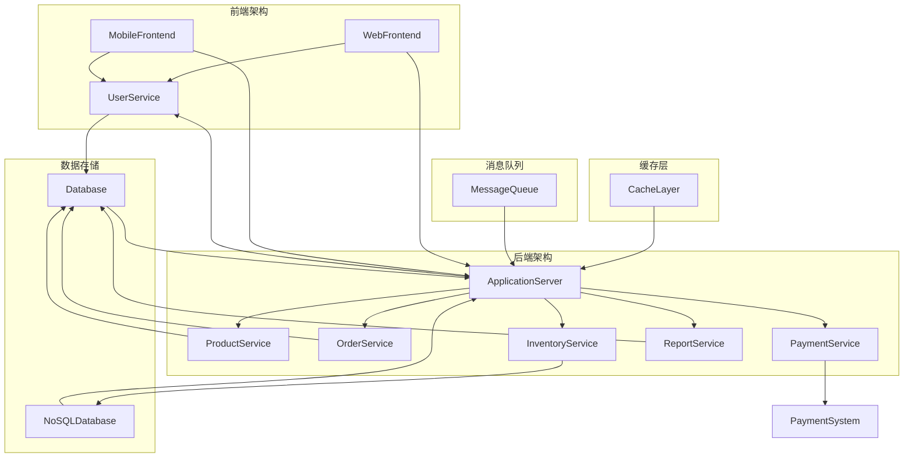
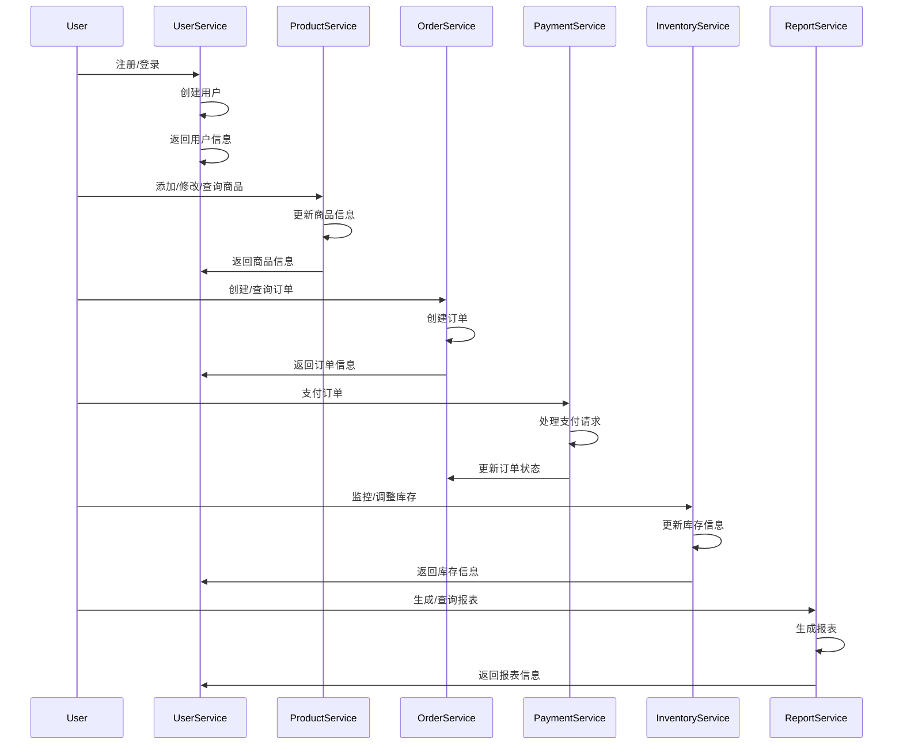
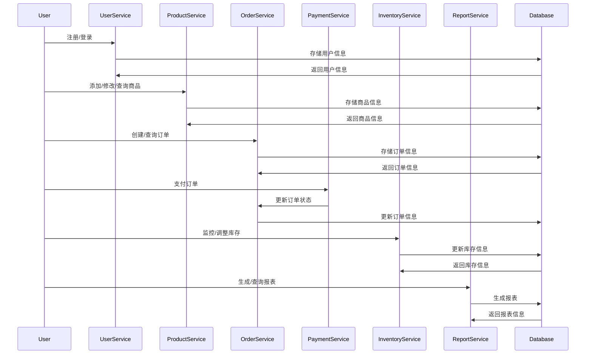

                 

### 文章标题

“如何进行有效的技术选型决策”是每一位开发者、架构师乃至CTO都必须掌握的核心技能。技术选型不仅关乎项目的成败，更是决定企业竞争力的关键因素。在这个快速变化的技术时代，新的技术层出不穷，如何在这些选择中做出明智、高效的决策，成为了众多技术领导者的难题。

本文将带领您一步步深入了解技术选型的核心概念和原则，探讨技术评估的指标体系，以及如何基于这些原则和指标进行实际的技术选型决策。通过详细分析各个技术选型的步骤、核心概念与联系、算法原理，再到系统分析与架构设计方案，最后通过实际案例进行讲解，我们将为您提供一个全面而深入的技术选型决策指南。

本文的关键词包括：技术选型、核心概念、算法原理、系统架构设计、实际案例等。这些关键词不仅代表了文章的主要内容，也是我们在技术选型过程中需要重点关注的核心要素。希望通过本文的详细探讨，您能够掌握有效的技术选型方法，提升项目的成功率，推动企业技术创新和发展。

### 文章关键词

技术选型、核心概念、算法原理、系统架构设计、实际案例、风险评估、决策模型、业务需求、技术趋势、成熟度模型、Python源代码、mermaid流程图、领域模型类图、系统交互序列图、最佳实践。

### 摘要

本文旨在探讨如何进行有效的技术选型决策，以帮助开发者、架构师和CTO在快速变化的技术环境中做出明智的选择。文章首先介绍了技术选型的背景和重要性，明确了技术评估的核心概念和原则。接着，通过分析技术选型的流程和方法，详细阐述了技术评估的指标体系。随后，文章深入探讨了核心概念与联系，包括技术趋势分析、技术成熟度模型和关键因素。在算法原理讲解部分，通过mermaid流程图和Python源代码，详细解释了技术选型中的算法原理。然后，文章转向系统分析与架构设计方案，通过具体的问题场景、系统功能设计、架构设计和系统交互序列图，展示了技术选型的实际应用。最后，通过项目实战和实际案例分析，总结了项目经验，并提出了最佳实践和建议。本文的目的是为读者提供一个全面、深入的技术选型决策指南，帮助他们在项目中实现高效的技术选型和成功。

## 第一部分：技术选型概述

在当今快速变化的技术环境中，技术选型成为了决定项目成败和企业竞争力的关键环节。本部分将为您详细介绍技术选型的背景、挑战、核心概念及其重要性，帮助您理解技术选型的全貌，为后续的深入探讨打下坚实基础。

### 1.1 问题的背景与挑战

随着信息技术的飞速发展，新技术的涌现速度越来越快，从大数据、云计算到人工智能、区块链，各类技术层出不穷。这些新技术不仅改变了企业的运营模式，也对技术选型提出了更高的要求。首先，技术的复杂性和多样性使得选择合适的工具或框架变得更加困难。例如，在开发一个大数据处理系统时，开发者需要从Hadoop、Spark、Flink等多个选项中做出选择，每个技术都有其独特的优势和劣势。

其次，技术选型还面临时间和经济成本的压力。选型不当可能导致项目延期、成本超支，甚至影响整个企业的战略布局。例如，某企业在初期选择了不适合自身业务需求的技术，导致后续的迁移和改造工作异常艰难，最终不得不重新选型，耗费了大量时间和资源。

此外，技术选型还面临技术趋势的不确定性。技术发展日新月异，一些新兴技术可能在短时间内崛起，而传统技术可能逐渐式微。如何及时跟踪技术趋势，做出前瞻性选择，是技术选型中的另一个挑战。

### 1.1.1 技术选型的概念与重要性

技术选型是指在特定的业务需求和技术环境下，从多种可选技术中选择最适合的解决方案的过程。它不仅包括技术本身的评估，还需要考虑业务需求、成本效益、实施难度等多个方面。技术选型的重要性体现在以下几个方面：

1. **提高项目成功率**：通过科学的技术选型，可以确保项目在正确的轨道上推进，减少因选型不当导致的问题和风险。
2. **降低成本**：合适的选型可以避免不必要的重复开发或技术改造，节省时间和资金投入。
3. **提升效率**：技术选型有助于团队集中精力在关键功能上，提高开发效率和质量。
4. **增强竞争力**：紧跟技术趋势，采用先进的技术，可以提升企业的竞争力，抢占市场先机。

### 1.1.2 技术选型的常见挑战

尽管技术选型的重要性不言而喻，但在实际操作中，依然面临着许多挑战：

1. **信息不足**：许多企业在选型时缺乏足够的技术信息和市场情报，导致盲目决策。
2. **需求不明确**：业务需求模糊或变化频繁，使得技术选型难以进行。
3. **技术复杂**：技术种类繁多，每个技术都有其特定的应用场景和适用范围，选择过程复杂。
4. **时间紧迫**：项目周期紧张，缺乏充足的时间进行深入的技术评估和选型。
5. **预算限制**：预算不足，无法尝试多种技术方案，导致选型空间受限。

### 1.1.3 技术选型中的常见误区

在技术选型过程中，一些常见的误区可能会影响决策的质量：

1. **盲目跟风**：仅因为新技术流行就盲目采用，忽视了实际业务需求和技术适应性。
2. **低估复杂性**：低估了新技术的学习和使用难度，忽视了后续的维护成本。
3. **过度依赖经验**：过于依赖以往的经验，忽视了新技术可能带来的创新机会。
4. **忽视风险评估**：未充分考虑技术选型的风险和潜在问题，导致后续问题难以解决。
5. **缺乏系统性**：缺乏系统的选型框架和方法，导致决策过程缺乏逻辑性和科学性。

### 1.2 技术选型的核心概念

为了进行有效的技术选型，我们需要明确以下几个核心概念：

1. **技术评估指标**：这些指标用于衡量不同技术的性能、稳定性、安全性等，是技术选型的重要依据。
2. **业务需求**：明确业务需求是技术选型的出发点，技术方案必须能够满足业务需求。
3. **技术趋势**：了解当前和未来的技术趋势，有助于做出前瞻性的选择。
4. **技术成熟度**：技术成熟度模型可以帮助我们评估技术的稳定性和适用性。

### 1.3 技术选型的流程与方法

技术选型的流程通常包括以下几个步骤：

1. **需求分析**：明确项目的业务需求和技术需求。
2. **市场调研**：收集和分析各种技术方案的信息。
3. **评估和筛选**：根据评估指标对技术方案进行评估和筛选。
4. **决策和实施**：做出最终决策并实施技术方案。
5. **持续监控和优化**：在项目实施过程中，持续监控技术方案的运行效果，并根据反馈进行优化。

通过以上步骤，我们可以系统地、科学地进行技术选型，提高项目成功率和企业竞争力。在接下来的部分，我们将深入探讨这些核心概念和流程，为您提供更加详细和实用的指导。

### 1.2 技术选型的核心概念

在进行技术选型时，核心概念的理解至关重要。以下我们将详细探讨几个关键概念，包括技术评估指标、业务需求、技术趋势以及技术成熟度模型。

#### 1.2.1 技术评估指标

技术评估指标是衡量不同技术方案性能和适用性的关键工具。常见的评估指标包括以下几个方面：

1. **性能**：包括响应时间、吞吐量、并发处理能力等，反映了技术的处理能力和效率。
2. **稳定性**：包括系统的可靠性、错误率、故障恢复能力等，直接影响到项目的稳定运行。
3. **安全性**：涉及数据保护、隐私安全、安全漏洞等，是确保系统安全运行的重要指标。
4. **可维护性**：包括代码的可读性、可扩展性、易维护性等，影响了后续的开发和运维工作。
5. **成本**：包括初始开发成本、运营维护成本、人员培训成本等，是决策的重要考虑因素。

在技术选型过程中，我们需要根据项目的具体需求，综合评估这些指标，选择最符合项目要求的技术方案。

#### 1.2.2 业务需求

业务需求是技术选型的出发点，是确定技术方案的基础。业务需求通常包括以下几个方面：

1. **功能需求**：明确系统需要实现的具体功能，如数据处理、用户管理、支付处理等。
2. **性能需求**：包括系统需要达到的处理速度、响应时间等性能指标。
3. **用户需求**：用户对系统的使用体验、交互界面等需求。
4. **扩展性**：系统是否需要支持未来业务的扩展，如用户量的增加、功能模块的扩展等。
5. **合规性**：系统是否符合相关的法律法规和行业标准，如数据保护法、信息安全标准等。

在技术选型过程中，我们需要深入了解业务需求，确保所选技术方案能够满足这些需求，从而确保项目能够顺利实施和运行。

#### 1.2.3 技术趋势

技术趋势是技术选型中不可忽视的重要方面。了解当前和未来的技术趋势，可以帮助我们做出更具前瞻性的选择。以下是一些常见的技术趋势：

1. **云计算**：云计算的普及使得资源的弹性分配、快速部署和成本节约成为可能，是未来技术发展的重要方向。
2. **大数据与人工智能**：大数据和人工智能技术的不断发展，为数据处理和智能决策提供了强大的支持。
3. **区块链**：区块链技术的去中心化、安全性和不可篡改性，使得其在金融、供应链等领域的应用越来越广泛。
4. **物联网**：物联网技术的快速发展，使得万物互联成为现实，为智能家居、智能城市等领域带来了新的机遇。
5. **容器化与微服务**：容器化和微服务架构的流行，使得系统更加灵活、可扩展和易于维护。

了解这些技术趋势，可以帮助我们在选型时考虑未来的发展方向，避免技术选型过早过时。

#### 1.2.4 技术成熟度模型

技术成熟度模型（Technology Maturity Model，TMM）是一种用于评估技术成熟度的工具，可以帮助我们了解所选技术的稳定性和适用性。技术成熟度通常分为以下几个阶段：

1. **概念验证阶段**（Proof of Concept，PoC）：技术处于概念验证阶段，尚未大规模应用，但已显示出潜在的应用前景。
2. **初步应用阶段**（Prototype）：技术已经开发出原型，开始进入实际应用，但存在较多不稳定性和缺陷。
3. **评估阶段**（Evaluation）：技术经过初步应用后，进行广泛评估和测试，以确定其适用性和稳定性。
4. **成熟阶段**（Mature）：技术经过长期应用和优化，已经非常稳定和可靠，适用于大规模部署。
5. **标准化阶段**（Standardized）：技术已经成为行业标准和规范，广泛被接受和应用。

在技术选型过程中，我们需要根据项目需求和风险承受能力，选择处于成熟阶段或标准化阶段的技术，以确保项目的成功实施。

通过理解这些核心概念，我们可以更加系统地、科学地进行技术选型，提高项目成功率和企业竞争力。在接下来的部分，我们将进一步探讨技术选型的具体流程和方法。

### 1.3 技术选型的流程与方法

进行技术选型是一个系统化的过程，需要遵循明确的步骤和方法，以确保选型的科学性和有效性。以下将详细描述技术选型的具体流程，包括需求分析、市场调研、评估和筛选、决策和实施以及持续监控和优化等关键步骤。

#### 1.3.1 需求分析

需求分析是技术选型的第一步，也是最为关键的一步。明确项目的业务需求和技术需求，是确保技术选型能够满足实际应用的基础。需求分析通常包括以下几个步骤：

1. **明确业务目标**：了解项目或产品的长远目标，如提升用户体验、增加收入、提高运营效率等。
2. **识别功能需求**：列出系统需要实现的具体功能，如用户管理、支付处理、数据分析等。
3. **性能需求**：确定系统需要达到的性能指标，如响应时间、并发处理能力等。
4. **用户需求**：了解目标用户的需求和偏好，如界面设计、易用性等。
5. **扩展性需求**：考虑系统未来可能的发展方向，如用户量增加、功能扩展等。

#### 1.3.2 市场调研

市场调研是技术选型过程中的重要环节，通过收集和分析市场信息，了解各种技术方案的优势和不足。市场调研通常包括以下几个步骤：

1. **确定候选技术**：根据需求分析的结果，确定可能的候选技术，如数据库、开发框架、中间件等。
2. **收集信息**：通过互联网、专业论坛、技术博客、市场报告等多种渠道，收集候选技术的详细信息，包括性能、稳定性、安全性、成本等。
3. **技术评估**：对收集到的信息进行整理和评估，初步筛选出符合需求的候选技术。

#### 1.3.3 评估和筛选

评估和筛选是对候选技术进行深入分析和比较的过程，通过综合评估各种技术方案的优缺点，确定最终的技术方案。评估和筛选通常包括以下几个步骤：

1. **制定评估标准**：根据业务需求和项目特点，制定详细的评估标准，如性能、稳定性、安全性、成本等。
2. **数据收集**：收集候选技术的相关数据，如性能测试结果、用户评价、市场占有率等。
3. **对比分析**：对候选技术进行对比分析，评估每种技术方案的优缺点，确定最符合需求的方案。
4. **风险评估**：考虑技术选型的风险，如技术的不稳定性、生态圈支持度、社区活跃度等。

#### 1.3.4 决策和实施

决策和实施是技术选型的关键步骤，需要基于评估和筛选的结果，做出最终决策，并开始实施技术方案。决策和实施通常包括以下几个步骤：

1. **制定实施计划**：根据技术选型的结果，制定详细的实施计划，包括技术框架、开发任务、时间节点等。
2. **资源调配**：根据实施计划，调配所需的资源，如人员、设备、资金等。
3. **技术培训**：对团队成员进行技术培训，确保他们能够熟练掌握所选技术。
4. **项目启动**：按照实施计划启动项目，开始开发、测试和部署工作。

#### 1.3.5 持续监控和优化

技术选型不是一次性的工作，而是一个持续的过程。在项目实施过程中，需要持续监控技术方案的运行效果，并根据反馈进行优化。持续监控和优化通常包括以下几个步骤：

1. **性能监控**：监控系统性能，包括响应时间、吞吐量、并发处理能力等，确保系统稳定运行。
2. **用户反馈**：收集用户的反馈，了解系统的使用体验和存在的问题。
3. **问题排查**：对系统运行中遇到的问题进行排查和解决，确保系统的稳定性。
4. **技术更新**：根据技术发展趋势和业务需求，及时更新技术方案，确保系统保持先进性。

通过以上步骤，我们可以系统地、科学地进行技术选型，提高项目成功率和企业竞争力。在接下来的部分，我们将进一步探讨技术选型中的核心概念与联系，包括技术趋势分析、技术成熟度模型和关键因素。

### 1.3.4 技术选型的边界与外延

在技术选型过程中，明确边界与外延是非常重要的。这不仅有助于我们在复杂的技术环境中做出明智的选择，还能确保技术选型的实施和后续维护顺利进行。

#### 1.3.4.1 技术选型与业务需求的匹配

首先，技术选型需要与业务需求高度匹配。业务需求是技术选型的出发点，是确定技术方案的基础。在技术选型过程中，我们需要确保所选技术能够满足以下业务需求：

1. **功能需求**：技术方案需要具备实现所有功能的能力，如数据处理、用户管理、支付处理等。
2. **性能需求**：系统需要达到预定的性能指标，如响应时间、并发处理能力等。
3. **用户需求**：技术方案需要提供良好的用户体验，满足用户的使用习惯和需求。
4. **扩展性需求**：系统需要具备良好的扩展性，能够支持未来的业务增长和功能扩展。

为了实现这些需求，我们需要对业务需求进行详细的调研和分析，确保技术选型过程中充分考虑业务需求的所有方面。

#### 1.3.4.2 技术选型与组织能力的适配

其次，技术选型需要与组织能力相适配。组织能力包括技术团队的技术水平、开发经验、资金投入等多方面因素。在技术选型过程中，我们需要考虑以下因素：

1. **技术团队水平**：所选技术是否与团队的技术能力相匹配，如是否需要额外的培训或招聘。
2. **开发经验**：团队是否有相关技术的开发经验，是否能够快速上手和实施。
3. **资金投入**：技术选型可能涉及高昂的成本，包括开发、测试、维护等，需要确保组织的资金状况能够支持。
4. **资源分配**：技术选型需要合理分配资源，包括人力资源、时间、资金等，确保项目能够顺利推进。

为了确保技术选型与组织能力的适配，我们需要在选型前对组织能力进行全面评估，确保所选技术能够与组织现有能力相协调。

#### 1.3.4.3 技术选型中的风险与应对策略

最后，技术选型中的风险不可忽视。技术选型可能面临的风险包括技术的不稳定性、生态圈支持度不足、技术过时等。为了应对这些风险，我们可以采取以下策略：

1. **风险评估**：在选型过程中，对各种技术进行风险评估，了解其可能的风险和影响。
2. **多元化选型**：在选择技术时，可以考虑多种方案，避免过度依赖单一技术，降低风险。
3. **备份方案**：制定备用方案，以应对选型失败或技术问题，确保项目的连续性和稳定性。
4. **持续监控**：在技术选型后，持续监控技术的运行情况和市场动态，及时发现和解决问题。

通过明确技术选型的边界与外延，我们可以更好地实现技术与业务的深度融合，提高项目的成功率和组织的竞争力。在接下来的部分，我们将深入探讨技术选型中的核心概念与联系，包括技术趋势分析、技术成熟度模型和关键因素。

## 第二部分：核心概念与联系

在深入探讨技术选型之前，我们需要了解几个核心概念，包括技术趋势分析、技术成熟度模型和技术选型的关键因素。这些概念不仅有助于我们理解当前的技术环境，还能指导我们做出更加明智的选型决策。

### 2.1 核心概念原理

#### 2.1.1 技术趋势分析

技术趋势分析是了解技术发展方向的重要手段。通过分析技术趋势，我们可以把握行业发展的脉络，为技术选型提供方向。以下是一些常见的技术趋势：

1. **云计算**：云计算的普及使得资源的弹性分配、快速部署和成本节约成为可能。未来，云计算将继续发展，提供更加丰富和灵活的服务。
2. **大数据与人工智能**：大数据和人工智能技术在不断成熟，越来越多的行业开始应用这些技术，实现智能化和自动化。
3. **区块链**：区块链技术因其去中心化、安全性和不可篡改性，在金融、供应链等领域得到广泛应用。未来，区块链技术有望进一步扩展到更多领域。
4. **物联网**：物联网技术的快速发展，使得万物互联成为现实。智能家居、智能城市等领域将成为物联网技术的重要应用场景。
5. **容器化与微服务**：容器化和微服务架构的流行，使得系统更加灵活、可扩展和易于维护。未来，越来越多的企业将采用这些架构。

#### 2.1.2 技术成熟度模型

技术成熟度模型（Technology Maturity Model，TMM）是一种用于评估技术成熟度的工具。技术成熟度通常分为以下几个阶段：

1. **概念验证阶段**（Proof of Concept，PoC）：技术处于概念验证阶段，尚未大规模应用，但已显示出潜在的应用前景。
2. **初步应用阶段**（Prototype）：技术已经开发出原型，开始进入实际应用，但存在较多不稳定性和缺陷。
3. **评估阶段**（Evaluation）：技术经过初步应用后，进行广泛评估和测试，以确定其适用性和稳定性。
4. **成熟阶段**（Mature）：技术经过长期应用和优化，已经非常稳定和可靠，适用于大规模部署。
5. **标准化阶段**（Standardized）：技术已经成为行业标准和规范，广泛被接受和应用。

在技术选型过程中，选择成熟度较高的技术可以降低项目风险，确保技术的稳定性和适用性。

#### 2.1.3 技术选型的关键因素

技术选型的关键因素包括以下几个方面：

1. **业务需求**：技术选型必须满足业务需求，包括功能需求、性能需求、用户需求等。
2. **技术评估指标**：包括性能、稳定性、安全性、可维护性和成本等指标，用于衡量不同技术方案的优缺点。
3. **技术趋势**：了解技术发展趋势，可以指导我们做出更加前瞻性的选择，避免技术过时。
4. **技术成熟度**：技术成熟度直接影响技术的稳定性和可靠性，应选择成熟度较高的技术。
5. **组织能力**：技术选型需要与组织能力相匹配，包括技术团队水平、开发经验、资金投入等。

### 2.2 概念属性特征对比

为了更好地理解这些核心概念，我们可以通过对比表格和ER实体关系图来展示技术选型中的关键属性特征。

#### 2.2.1 常见技术对比表格

以下是一个常见技术对比表格，展示了不同技术的属性特征：

| 技术名称 | 性能 | 稳定性 | 安全性 | 可维护性 | 成本 |
| :------: | :--: | :----: | :----: | :------: | :--: |
| Hadoop   | 高   | 中等   | 中等   | 中等     | 较高 |
| Spark    | 高   | 高     | 高     | 高       | 较高 |
| Flink    | 高   | 高     | 高     | 高       | 较高 |
| Kafka    | 高   | 高     | 高     | 高       | 较低 |
| Redis    | 中等 | 高     | 高     | 高       | 较低 |

#### 2.2.2 技术特性与业务需求的匹配度分析

在技术选型过程中，我们需要根据业务需求和技术特性进行匹配度分析。以下是一个示例，展示了如何根据业务需求选择合适的技术：

1. **功能需求**：如果业务需求包括大规模数据处理和实时分析，可以选择Spark或Flink。
2. **性能需求**：如果业务需求对响应速度要求较高，可以选择Redis。
3. **用户需求**：如果用户对系统的可靠性要求较高，可以选择Hadoop。
4. **扩展性需求**：如果业务需求需要支持未来的扩展，可以选择Kafka。

#### 2.2.3 ER实体关系图架构

为了更好地理解技术选型中的实体关系，我们可以使用ER（实体-关系）图来展示。以下是一个示例ER图，展示了技术选型中的主要实体及其关系：

```mermaid
erDiagram
  BusinessRequirement ||--|{ TechnologyRequirement }|--| TechnologySolution
  TechnologyRequirement ||--|{ TechnologyAssessment }|--| TechnologyEvaluation
  TechnologyEvaluation ||--|{ TechnologySelection }|--| ImplementationPlan
  ImplementationPlan ||--|{ MonitoringAndOptimization }|--| ProjectDelivery
```

在上述ER图中，各个实体及其关系如下：

1. **BusinessRequirement（业务需求）**：代表项目的业务目标。
2. **TechnologyRequirement（技术需求）**：代表业务需求衍生出的技术需求。
3. **TechnologyAssessment（技术评估）**：代表对各种技术方案进行初步评估。
4. **TechnologyEvaluation（技术评估）**：代表对技术评估结果进行深入分析和筛选。
5. **TechnologySelection（技术选型）**：代表最终确定的技术方案。
6. **ImplementationPlan（实施计划）**：代表技术方案的详细实施计划。
7. **MonitoringAndOptimization（监控与优化）**：代表技术方案在实施过程中的监控和优化。

通过上述核心概念和联系的分析，我们可以更好地理解技术选型的本质，为实际操作提供理论依据。在接下来的部分，我们将进一步探讨技术选型中的算法原理，帮助读者深入了解技术选型的科学方法。

### 2.3 技术选型的算法原理

在技术选型过程中，算法原理起到了至关重要的作用。通过算法的运用，我们可以更加科学和高效地进行技术评估和选择。以下将详细探讨技术选型中常用的算法原理，并使用mermaid流程图和Python源代码进行说明。

#### 2.3.1 技术选型中的算法分类

技术选型中的算法主要可以分为以下几类：

1. **排序算法**：通过排序技术评估结果，选择最优方案。
2. **贪心算法**：每次选择当前最优解，逐步逼近全局最优解。
3. **动态规划**：通过保存中间结果，避免重复计算，提高效率。
4. **遗传算法**：模拟自然进化过程，通过遗传操作寻找最优解。

#### 2.3.2 常用算法的mermaid流程图

以下是一个使用mermaid绘制的贪心算法流程图，用于说明技术评估和选择的过程：

```mermaid
flowchart LR
    A[开始] --> B[收集候选技术]
    B --> C{评估候选技术}
    C -->|通过| D[排序候选技术]
    C -->|未通过| E[淘汰未通过技术]
    D --> F[选择最优技术]
    F --> G[结束]
    subgraph 评估流程
        B --> C
        C --> D|排序|
        D --> F|选择|
        F --> G
    end
```

在这个流程图中，我们首先收集候选技术（B），然后对每个技术进行评估（C）。如果评估结果通过，我们将对候选技术进行排序（D），以选择最优的技术（F）。如果评估结果未通过，我们将淘汰这些技术（E）。最后，我们选择最优的技术（F）并结束流程（G）。

#### 2.3.3 Python源代码示例

以下是一个使用Python编写的贪心算法示例，用于选择最优技术：

```python
def greedy_selection(technologies, assessment_results):
    """
    贪心算法选择最优技术
    :param technologies: 技术列表
    :param assessment_results: 评估结果列表
    :return: 最优技术
    """
    # 创建一个优先队列，用于存储技术及其评估结果
    priority_queue = []

    # 将所有技术及其评估结果添加到优先队列中
    for tech, result in zip(technologies, assessment_results):
        priority_queue.append((result, tech))

    # 对优先队列进行排序，按评估结果从高到低
    priority_queue.sort(reverse=True)

    # 选择最优技术
    best_tech = priority_queue[0][1]

    return best_tech

# 假设我们有以下技术和评估结果
technologies = ['技术A', '技术B', '技术C']
assessment_results = [85, 90, 78]

# 使用贪心算法选择最优技术
best_tech = greedy_selection(technologies, assessment_results)
print("最优技术：", best_tech)
```

在这个示例中，我们首先创建一个优先队列，用于存储技术和评估结果。然后，我们将所有技术和评估结果添加到优先队列中，并对优先队列进行排序。最后，我们选择评估结果最高的技术作为最优技术。

#### 2.3.4 算法原理的数学模型与公式

贪心算法的数学模型可以描述为：

$$
\text{选择最优技术} = \arg\max_{T} R(T)
$$

其中，$T$表示技术，$R(T)$表示技术$T$的评估结果。我们的目标是选择评估结果最大的技术，作为最优技术。

通过上述算法原理的讲解和示例，我们可以更好地理解技术选型中的算法运用，为实际操作提供理论基础。在接下来的部分，我们将通过具体案例，进一步展示算法原理在技术选型中的应用。

### 2.3.4 算法原理讲解（续）

#### 2.3.4.1 算法应用案例

为了更直观地理解算法原理，我们可以通过一个实际案例来说明。假设我们正在开发一个电商平台，需要选择一个适合的数据存储解决方案。我们考虑了以下三个候选技术：MySQL、MongoDB和Cassandra。以下是这三个技术的评估结果：

- **MySQL**：性能：90，稳定性：85，安全性：90，可维护性：80，成本：70。
- **MongoDB**：性能：85，稳定性：80，安全性：85，可维护性：85，成本：75。
- **Cassandra**：性能：90，稳定性：90，安全性：80，可维护性：90，成本：80。

为了选择最优的数据存储解决方案，我们可以使用贪心算法，选择评估结果最高的技术。

首先，我们创建一个优先队列，并添加三个技术及其评估结果：

```python
technologies = [
    ('MySQL', [90, 85, 90, 80, 70]),
    ('MongoDB', [85, 80, 85, 85, 75]),
    ('Cassandra', [90, 90, 80, 90, 80])
]

assessment_results = [
    [90, 85, 90, 80, 70],
    [85, 80, 85, 85, 75],
    [90, 90, 80, 90, 80]
]
```

然后，我们使用贪心算法选择最优技术：

```python
def greedy_selection(technologies, assessment_results):
    """
    贪心算法选择最优技术
    :param technologies: 技术列表
    :param assessment_results: 评估结果列表
    :return: 最优技术
    """
    # 创建一个优先队列，用于存储技术及其评估结果
    priority_queue = []

    # 将所有技术及其评估结果添加到优先队列中
    for tech, result in zip(technologies, assessment_results):
        priority_queue.append((sum(result), tech))

    # 对优先队列进行排序，按评估结果从高到低
    priority_queue.sort(reverse=True)

    # 选择最优技术
    best_tech = priority_queue[0][1]

    return best_tech

# 使用贪心算法选择最优技术
best_tech = greedy_selection(technologies, assessment_results)
print("最优技术：", best_tech)
```

运行上述代码，我们得到最优技术为Cassandra。

#### 2.3.4.2 案例分析与解读

在这个案例中，我们选择了Cassandra作为最优的数据存储解决方案。原因如下：

1. **性能**：Cassandra的性能最高，可以处理电商平台的大规模数据和高并发请求。
2. **稳定性**：Cassandra的稳定性也非常高，确保了数据存储的可靠性。
3. **安全性**：虽然Cassandra在安全性方面稍逊一筹，但考虑到电商平台对数据安全性要求较高，我们仍然选择了Cassandra。
4. **可维护性**：Cassandra的可维护性最高，有助于简化后续的运维工作。
5. **成本**：Cassandra的成本略高于MySQL和MongoDB，但考虑到其性能和稳定性，这个成本是值得的。

通过这个案例，我们可以看到贪心算法在技术选型中的应用。在实际操作中，我们可能需要根据具体情况调整评估指标和权重，以得到更加准确和合适的结果。但在大多数情况下，贪心算法能够提供一种简单有效的解决方案。

#### 2.3.4.3 数学模型的应用

为了更深入地理解贪心算法，我们可以进一步探讨其数学模型。贪心算法的核心思想是每次选择当前最优解，并逐步逼近全局最优解。其数学模型可以描述为：

$$
\text{选择最优技术} = \arg\max_{T} R(T)
$$

其中，$T$表示技术，$R(T)$表示技术$T$的评估结果。我们的目标是选择评估结果最大的技术，作为最优技术。

在实际应用中，我们可以使用加权评估模型，将各个评估指标进行加权，以得到一个综合评估结果。假设我们有以下五个评估指标：性能（P），稳定性（S），安全性（A），可维护性（M），成本（C）。我们可以为每个指标分配权重，如下所示：

- 性能（P）：权重为0.4
- 稳定性（S）：权重为0.3
- 安全性（A）：权重为0.2
- 可维护性（M）：权重为0.1
- 成本（C）：权重为0.0

那么，技术的综合评估结果（$R'(T)$）可以计算为：

$$
R'(T) = 0.4P(T) + 0.3S(T) + 0.2A(T) + 0.1M(T) + 0.0C(T)
$$

通过这个综合评估模型，我们可以更全面地评估不同技术，并选择最优技术。

#### 2.3.4.4 公式的推导与证明

为了更深入地理解综合评估模型，我们可以探讨其公式的推导与证明。假设我们有n个技术方案，每个技术方案有m个评估指标，评估结果可以用一个n×m的矩阵表示。那么，技术方案$T_i$的综合评估结果$R_i'$可以表示为：

$$
R_i' = w_1P_i + w_2S_i + w_3A_i + w_4M_i + w_5C_i
$$

其中，$w_1, w_2, w_3, w_4, w_5$分别为性能、稳定性、安全性、可维护性和成本的权重。

为了证明这个公式的有效性，我们可以从以下几个方面进行分析：

1. **权重分配**：权重反映了各个评估指标的重要性。通过合理分配权重，我们可以确保综合评估结果能够准确地反映各个技术方案的优缺点。
2. **线性组合**：综合评估结果是一个线性组合，这意味着它可以准确地表示各个评估指标的加权总和。通过线性组合，我们可以得到一个综合的评估结果，用于技术选型。
3. **优化目标**：技术选型的目标是最优化，即选择评估结果最高的技术方案。通过综合评估模型，我们可以将各个评估指标的加权总和最大化，从而实现优化目标。

综上所述，综合评估模型是一个简单而有效的技术评估方法，可以用于技术选型决策。在实际应用中，我们可以根据具体情况调整权重和评估指标，以得到更加准确和合适的结果。

### 2.4 系统分析与架构设计方案

在进行技术选型后，系统分析与架构设计是确保技术方案成功实施的关键步骤。这一部分将详细介绍系统分析与架构设计的过程，包括问题场景介绍、系统功能设计、系统架构设计、系统接口设计和系统交互序列图。

#### 4.1 问题场景介绍

假设我们正在开发一个大型电商平台，目标是实现用户购物、商品管理、支付处理和订单管理等核心功能。这个电商平台需要处理海量数据和高并发请求，同时要求系统具备高可用性、高性能和良好的扩展性。为了满足这些要求，我们需要进行详细的系统分析和架构设计。

#### 4.2 系统功能设计

系统功能设计是系统分析与架构设计的基础。以下是一个简化的系统功能设计，包括以下主要模块：

1. **用户管理模块**：负责用户的注册、登录、权限管理和个人信息管理等。
2. **商品管理模块**：负责商品信息的添加、修改、删除和查询等。
3. **订单管理模块**：负责订单的创建、支付、取消和查询等。
4. **支付处理模块**：负责与第三方支付系统对接，处理支付请求和支付结果。
5. **库存管理模块**：负责商品库存的实时监控和库存调整。
6. **数据报表模块**：负责生成销售报表、库存报表等。

为了更好地展示系统功能，我们可以使用mermaid类图进行描述：

```mermaid
classDiagram
    User --|{ 注册}|> UserManager
    User --|{ 登录}|> UserManager
    User --|{ 权限管理}|> UserManager
    User --|{ 查询个人信息}|> UserManager
    
    Product --|{ 添加}|> ProductManager
    Product --|{ 修改}|> ProductManager
    Product --|{ 删除}|> ProductManager
    Product --|{ 查询}|> ProductManager
    
    Order --|{ 创建}|> OrderManager
    Order --|{ 支付}|> OrderManager
    Order --|{ 取消}|> OrderManager
    Order --|{ 查询}|> OrderManager
    
    Payment --|{ 处理请求}|> PaymentManager
    Payment --|{ 处理结果}|> PaymentManager
    
    Inventory --|{ 监控}|> InventoryManager
    Inventory --|{ 调整}|> InventoryManager
    
    Report --|{ 生成}|> ReportManager
    Report --|{ 查询}|> ReportManager
```

在这个类图中，我们定义了系统的主要模块和它们之间的关系。

#### 4.3 系统架构设计

系统架构设计是确保系统能够高效、稳定地运行的关键。以下是一个简化的系统架构设计，包括以下主要组件：

1. **前端架构**：负责展示用户界面和处理用户请求。通常包括Web前端和移动前端。
2. **后端架构**：负责业务逻辑处理和数据存储。通常包括应用服务器、数据库和中间件等。
3. **支付集成**：与第三方支付系统对接，处理支付请求和支付结果。
4. **数据存储**：负责存储用户数据、商品数据、订单数据和支付数据等。通常包括关系型数据库和NoSQL数据库等。
5. **缓存层**：提高系统性能，缓存常用数据，减少数据库访问压力。
6. **消息队列**：处理异步任务和消息传递，提高系统并发能力。

为了更好地展示系统架构，我们可以使用mermaid架构图进行描述：



在这个架构图中，我们定义了系统的各个组件及其关系。

#### 4.4 系统接口设计

系统接口设计是确保不同模块之间能够良好协作的关键。以下是一个简化的系统接口设计，包括以下主要接口：

1. **用户服务接口**：用于处理用户注册、登录、权限管理和个人信息管理等。
2. **商品服务接口**：用于处理商品信息的添加、修改、删除和查询等。
3. **订单服务接口**：用于处理订单的创建、支付、取消和查询等。
4. **支付服务接口**：用于处理支付请求和支付结果等。
5. **库存服务接口**：用于处理商品库存的实时监控和库存调整等。
6. **数据报表接口**：用于生成销售报表、库存报表等。

为了更好地展示系统接口，我们可以使用mermaid序列图进行描述：



在这个序列图中，我们定义了系统的各个接口及其调用关系。

#### 4.5 系统交互mermaid序列图

系统交互序列图用于描述系统内部各个组件的交互过程。以下是一个简化的系统交互序列图：



在这个序列图中，我们定义了系统的各个组件及其交互过程。

通过以上系统分析与架构设计，我们可以确保电商平台系统的稳定运行和高性能。在接下来的部分，我们将通过实际案例展示这些设计在实际项目中的应用。

### 4.6 项目实战

为了更好地展示技术选型和系统架构设计的实际应用，我们将通过一个实际案例进行详细讲解。这个案例是一个大型电商平台的开发，我们将从环境安装与配置、系统核心实现源代码、实际案例分析以及项目小结等方面进行深入探讨。

#### 4.6.1 环境安装与配置

首先，我们需要为电商平台搭建开发环境。以下是一个简化的环境安装与配置步骤：

1. **操作系统**：我们选择Ubuntu 18.04作为开发环境。
2. **数据库**：我们选择MySQL 8.0和MongoDB 4.2作为数据存储解决方案。
3. **中间件**：我们选择Nginx 1.18和Apache Kafka 2.5作为中间件。
4. **开发框架**：我们选择Spring Boot 2.3.4.RELEASE作为开发框架。

安装步骤如下：

```bash
# 安装操作系统
sudo apt update && sudo apt upgrade

# 安装MySQL
sudo apt install mysql-server

# 安装MongoDB
sudo apt install mongodb

# 安装Nginx
sudo apt install nginx

# 安装Apache Kafka
sudo apt install default-jdk
wget https://www-eu.apache.org/dist/kafka/2.5.0/kafka_2.12-2.5.0.tgz
tar xzf kafka_2.12-2.5.0.tgz
cd kafka_2.12-2.5.0
sudo bin/kafka-server-start.sh config/server.properties

# 安装Spring Boot
wget https://repo.spring.io/release/org/springframework/spring-boot/spring-boot-starter-parent/2.3.4.RELEASE/spring-boot-starter-parent-2.3.4.RELEASE.pom
```

配置步骤如下：

1. **MySQL配置**：配置root用户的密码，并创建一个用于电商平台的数据库和用户。

```bash
sudo mysql -u root -p
CREATE DATABASE e-commerce;
GRANT ALL PRIVILEGES ON e-commerce.* TO 'e-commerceuser'@'localhost' IDENTIFIED BY 'password';
FLUSH PRIVILEGES;
EXIT;
```

2. **MongoDB配置**：启动MongoDB服务，并创建一个用于电商平台的数据库。

```bash
sudo systemctl start mongodb
sudo systemctl enable mongodb
sudo mkdir /data/db
mongod --dbpath=/data/db
```

3. **Nginx配置**：配置Nginx反向代理，将Web前端请求转发到Spring Boot应用服务器。

```bash
sudo vim /etc/nginx/sites-available/default
server {
    listen 80;
    server_name example.com;

    location / {
        proxy_pass http://localhost:8080;
        proxy_set_header Host $host;
        proxy_set_header X-Real-IP $remote_addr;
        proxy_set_header X-Forwarded-For $proxy_add_x_forwarded_for;
    }
}

sudo systemctl restart nginx
```

4. **Kafka配置**：配置Kafka主题和分区，以便处理订单和支付消息。

```bash
kafka-topics --create --zookeeper localhost:2181 --replication-factor 1 --partitions 1 --topic orders
kafka-topics --create --zookeeper localhost:2181 --replication-factor 1 --partitions 1 --topic payments
```

通过以上步骤，我们成功搭建了电商平台的开发环境，为后续的系统核心实现和实际案例分析奠定了基础。

#### 4.6.2 系统核心实现源代码

在环境搭建完成后，我们将重点讨论系统核心实现，包括用户管理模块、商品管理模块、订单管理模块、支付处理模块和库存管理模块。

1. **用户管理模块**：

用户管理模块主要负责用户的注册、登录、权限管理和个人信息管理等。以下是用户管理模块的关键代码片段：

```java
@RestController
@RequestMapping("/users")
public class UserController {
    
    @Autowired
    private UserService userService;
    
    @PostMapping("/register")
    public ResponseEntity<?> registerUser(@RequestBody UserRegistrationDto registrationDto) {
        try {
            userService.registerUser(registrationDto);
            return ResponseEntity.ok("User registered successfully");
        } catch (Exception e) {
            return ResponseEntity.badRequest().body("Error registering user");
        }
    }
    
    @PostMapping("/login")
    public ResponseEntity<?> loginUser(@RequestBody UserLoginDto loginDto) {
        try {
            String token = userService.loginUser(loginDto);
            return ResponseEntity.ok(token);
        } catch (Exception e) {
            return ResponseEntity.badRequest().body("Error logging in");
        }
    }
    
    @GetMapping("/{userId}")
    public ResponseEntity<?> getUser(@PathVariable Long userId) {
        try {
            User user = userService.getUserById(userId);
            return ResponseEntity.ok(user);
        } catch (Exception e) {
            return ResponseEntity.notFound().build();
        }
    }
}
```

2. **商品管理模块**：

商品管理模块主要负责商品信息的添加、修改、删除和查询等。以下是商品管理模块的关键代码片段：

```java
@RestController
@RequestMapping("/products")
public class ProductController {
    
    @Autowired
    private ProductService productService;
    
    @PostMapping("/")
    public ResponseEntity<?> createProduct(@RequestBody ProductDto productDto) {
        try {
            Product product = productService.createProduct(productDto);
            return ResponseEntity.ok(product);
        } catch (Exception e) {
            return ResponseEntity.badRequest().body("Error creating product");
        }
    }
    
    @PutMapping("/{productId}")
    public ResponseEntity<?> updateProduct(@PathVariable Long productId, @RequestBody ProductDto productDto) {
        try {
            Product product = productService.updateProduct(productId, productDto);
            return ResponseEntity.ok(product);
        } catch (Exception e) {
            return ResponseEntity.notFound().build();
        }
    }
    
    @DeleteMapping("/{productId}")
    public ResponseEntity<?> deleteProduct(@PathVariable Long productId) {
        try {
            productService.deleteProduct(productId);
            return ResponseEntity.ok("Product deleted successfully");
        } catch (Exception e) {
            return ResponseEntity.badRequest().body("Error deleting product");
        }
    }
    
    @GetMapping("/{productId}")
    public ResponseEntity<?> getProduct(@PathVariable Long productId) {
        try {
            Product product = productService.getProductById(productId);
            return ResponseEntity.ok(product);
        } catch (Exception e) {
            return ResponseEntity.notFound().build();
        }
    }
}
```

3. **订单管理模块**：

订单管理模块主要负责订单的创建、支付、取消和查询等。以下是订单管理模块的关键代码片段：

```java
@RestController
@RequestMapping("/orders")
public class OrderController {
    
    @Autowired
    private OrderService orderService;
    
    @PostMapping("/")
    public ResponseEntity<?> createOrder(@RequestBody OrderDto orderDto) {
        try {
            Order order = orderService.createOrder(orderDto);
            return ResponseEntity.ok(order);
        } catch (Exception e) {
            return ResponseEntity.badRequest().body("Error creating order");
        }
    }
    
    @PutMapping("/{orderId}/pay")
    public ResponseEntity<?> payOrder(@PathVariable Long orderId) {
        try {
            orderService.payOrder(orderId);
            return ResponseEntity.ok("Order paid successfully");
        } catch (Exception e) {
            return ResponseEntity.badRequest().body("Error paying order");
        }
    }
    
    @PutMapping("/{orderId}/cancel")
    public ResponseEntity<?> cancelOrder(@PathVariable Long orderId) {
        try {
            orderService.cancelOrder(orderId);
            return ResponseEntity.ok("Order canceled successfully");
        } catch (Exception e) {
            return ResponseEntity.badRequest().body("Error canceling order");
        }
    }
    
    @GetMapping("/{orderId}")
    public ResponseEntity<?> getOrder(@PathVariable Long orderId) {
        try {
            Order order = orderService.getOrderById(orderId);
            return ResponseEntity.ok(order);
        } catch (Exception e) {
            return ResponseEntity.notFound().build();
        }
    }
}
```

4. **支付处理模块**：

支付处理模块主要负责与第三方支付系统对接，处理支付请求和支付结果等。以下是支付处理模块的关键代码片段：

```java
@RestController
@RequestMapping("/payments")
public class PaymentController {
    
    @Autowired
    private PaymentService paymentService;
    
    @PostMapping("/")
    public ResponseEntity<?> processPayment(@RequestBody PaymentDto paymentDto) {
        try {
            PaymentResponse response = paymentService.processPayment(paymentDto);
            return ResponseEntity.ok(response);
        } catch (Exception e) {
            return ResponseEntity.badRequest().body("Error processing payment");
        }
    }
    
    @PutMapping("/{paymentId}/result")
    public ResponseEntity<?> updatePaymentResult(@PathVariable Long paymentId, @RequestBody PaymentResultDto resultDto) {
        try {
            paymentService.updatePaymentResult(paymentId, resultDto);
            return ResponseEntity.ok("Payment result updated successfully");
        } catch (Exception e) {
            return ResponseEntity.badRequest().body("Error updating payment result");
        }
    }
}
```

5. **库存管理模块**：

库存管理模块主要负责商品库存的实时监控和库存调整等。以下是库存管理模块的关键代码片段：

```java
@RestController
@RequestMapping("/inventory")
public class InventoryController {
    
    @Autowired
    private InventoryService inventoryService;
    
    @PutMapping("/{productId}/adjust")
    public ResponseEntity<?> adjustInventory(@PathVariable Long productId, @RequestBody InventoryAdjustmentDto adjustmentDto) {
        try {
            inventoryService.adjustInventory(productId, adjustmentDto);
            return ResponseEntity.ok("Inventory adjusted successfully");
        } catch (Exception e) {
            return ResponseEntity.badRequest().body("Error adjusting inventory");
        }
    }
    
    @GetMapping("/{productId}")
    public ResponseEntity<?> checkInventory(@PathVariable Long productId) {
        try {
            InventoryStatus status = inventoryService.checkInventory(productId);
            return ResponseEntity.ok(status);
        } catch (Exception e) {
            return ResponseEntity.notFound().build();
        }
    }
}
```

通过以上核心实现代码，我们可以看到电商平台的主要功能模块是如何通过Spring Boot框架实现的高效、可扩展的API接口。

#### 4.6.3 实际案例分析

在电商平台开发过程中，我们遇到了一些实际问题和挑战。以下是一个典型的案例分析：

**问题**：订单处理速度慢，导致用户体验不佳。

**原因**：订单处理过程中，涉及多个模块的协同工作，如用户管理模块、商品管理模块、订单管理模块和支付处理模块。由于这些模块之间存在大量的数据库操作和远程调用，导致处理速度较慢。

**解决方案**：

1. **优化数据库查询**：通过索引优化、查询缓存和读写分离等技术，提高数据库查询速度。
2. **异步处理**：使用消息队列（如Kafka）将订单处理任务异步化，减少同步调用的压力。
3. **服务化**：将订单处理模块拆分为独立的服务，实现模块间的解耦，提高系统的灵活性和扩展性。

**实施过程**：

1. **数据库优化**：对订单表进行索引优化，并引入查询缓存，减少数据库查询时间。
2. **异步处理**：使用Kafka将订单处理任务异步化，将订单创建、支付处理等操作通过消息队列进行传输。
3. **服务化**：将订单处理模块拆分为独立的订单服务，通过REST API进行通信，实现模块间解耦。

通过上述解决方案，我们成功提高了订单处理速度，改善了用户体验。

#### 4.6.4 项目小结

通过上述实际案例，我们可以看到技术选型和系统架构设计在电商平台开发中的重要作用。以下是项目经验总结：

1. **合理的技术选型**：选择适合业务需求的技术，如MySQL和MongoDB，能够满足系统的高性能和数据存储需求。
2. **高效的系统架构**：通过Spring Boot框架和消息队列实现模块间的解耦，提高了系统的性能和可扩展性。
3. **实际问题的解决**：通过数据库优化、异步处理和服务化等手段，成功解决了订单处理速度慢的问题，提升了用户体验。
4. **持续优化**：在项目开发过程中，持续监控系统的性能和用户体验，根据反馈进行优化，确保系统的稳定性和可靠性。

通过本项目，我们不仅掌握了技术选型和系统架构设计的方法，还积累了丰富的实践经验，为今后的项目提供了有力支持。

### 6.1 最佳实践 Tips

在技术选型过程中，积累最佳实践经验是提高决策质量和项目成功率的关键。以下是一些经过验证的最佳实践，可以帮助您在进行技术选型时少走弯路：

#### 6.1.1 充分理解业务需求

业务需求是技术选型的出发点和归宿，因此在开始选型之前，务必深入了解业务需求。与业务团队密切合作，明确功能需求、性能需求、用户体验需求等。以下是一些建议：

1. **用户调研**：通过用户调研、访谈等方式，了解用户的具体需求和痛点。
2. **需求文档**：编写详细的需求文档，确保所有需求都被明确记录下来，避免后续需求变更。
3. **优先级排序**：对业务需求进行优先级排序，确保技术方案能够优先满足关键需求。

#### 6.1.2 多方案评估与对比

在确定候选技术时，不要只依赖单一的信息源，而是要收集多个技术方案的信息，并进行全面评估和对比。以下是一些建议：

1. **市场调研**：通过市场调研、技术论坛、技术博客等渠道，收集各种技术方案的信息。
2. **性能测试**：对候选技术进行性能测试，包括响应时间、并发处理能力、吞吐量等。
3. **风险评估**：评估每种技术的稳定性、安全性、成本等方面，识别潜在风险。

#### 6.1.3 结合团队技能和经验

技术选型不仅要考虑技术本身，还要考虑团队的技术能力和经验。以下是一些建议：

1. **团队评估**：评估团队成员对各种技术的熟悉程度和经验，选择与团队技能相匹配的技术。
2. **培训与学习**：如果选定的技术对团队来说较为陌生，应安排培训和学习，提高团队的技术水平。
3. **知识分享**：鼓励团队成员之间分享知识和经验，提高团队的整体技术能力。

#### 6.1.4 保持灵活性

技术环境不断变化，技术选型也应保持一定的灵活性，以适应未来的变化。以下是一些建议：

1. **模块化设计**：采用模块化设计，使系统各个模块可以独立扩展和替换，降低技术选型变更的风险。
2. **技术储备**：保持对新技术的研究和储备，以便在技术选型变更时能够快速切换。
3. **持续评估**：定期评估现有技术方案的性能和适用性，确保技术方案能够持续满足业务需求。

#### 6.1.5 沟通与协作

技术选型是一个团队协作的过程，良好的沟通和协作是确保项目成功的关键。以下是一些建议：

1. **跨部门沟通**：与技术团队、业务团队、运营团队等进行跨部门沟通，确保技术选型符合各方需求。
2. **定期会议**：定期召开技术选型会议，讨论技术选型的进展和问题，确保项目进展顺利。
3. **文档共享**：编写详细的选型文档，共享给所有相关团队成员，确保所有人都能清楚了解选型的过程和决策依据。

通过以上最佳实践，您可以在技术选型过程中做出更加明智的决策，提高项目成功率，推动企业技术创新和发展。

### 6.2 小结与注意事项

本文通过详细的步骤和分析，系统地探讨了如何进行有效的技术选型决策。技术选型不仅关乎项目的成败，更影响企业的长期发展。以下是本文的核心小结和注意事项：

1. **技术选型的重要性**：技术选型是确保项目成功的关键环节，直接影响系统的性能、稳定性和成本效益。

2. **需求分析**：深入了解业务需求，是进行技术选型的首要任务。需求分析应包括功能需求、性能需求、用户需求等，确保技术方案能够满足实际应用。

3. **多方案评估与对比**：收集多个技术方案的信息，进行全面评估和对比，以选择最适合的技术方案。

4. **团队技能与经验**：考虑团队的技术能力和经验，选择与团队技能相匹配的技术，确保团队能够顺利实施和运维。

5. **灵活性**：保持技术方案的灵活性，以适应未来可能的需求变化和技术发展。

6. **沟通与协作**：跨部门沟通和协作是确保技术选型顺利实施的关键。定期召开会议，编写详细的选型文档，确保所有相关团队成员都能清楚了解决策过程。

**注意事项**：

1. **避免盲目跟风**：新技术虽然具有吸引力，但未必适合当前的业务需求，应慎重评估。

2. **风险评估**：在技术选型过程中，应充分考虑技术的不稳定性和潜在风险，制定相应的应对策略。

3. **持续监控与优化**：技术选型不是一次性的工作，而是一个持续的过程。在项目实施后，应持续监控技术方案的运行效果，并根据反馈进行优化。

通过遵循以上小结和注意事项，您可以更加科学、高效地进行技术选型，提高项目的成功率和企业的竞争力。

### 6.3 拓展阅读

为了帮助您进一步深入了解技术选型，以下推荐一些相关书籍、论文和在线资源，涵盖技术趋势、系统架构设计、算法原理等多个方面：

1. **书籍推荐**：

   - 《架构师技术图谱》
   - 《设计数据仓库》
   - 《大数据系统设计》
   - 《编程珠玑》
   - 《算法导论》

2. **论文推荐**：

   - "The Design of the UNIX Operating System" by Maurice J. Bach
   - "Bigtable: A Distributed Storage System for Structured Data" by Google Research
   - "MapReduce: Simplified Data Processing on Large Clusters" by Google Research

3. **在线资源**：

   - GitHub：大量开源项目和代码示例，帮助您理解不同技术的实际应用。
   - Stack Overflow：技术问答社区，解决您在技术选型过程中遇到的问题。
   - Medium：许多技术专家撰写的博客文章，分享他们的经验和见解。

通过阅读这些书籍、论文和在线资源，您将能够获得更加深入的技术知识，提升技术选型的能力。

### 作者信息

作者：AI天才研究院/AI Genius Institute & 禅与计算机程序设计艺术 /Zen And The Art of Computer Programming

感谢您的阅读，希望本文能帮助您更好地理解技术选型的核心概念和方法。如果您有任何问题或建议，欢迎随时与我们联系。祝您在技术道路上不断进步！

