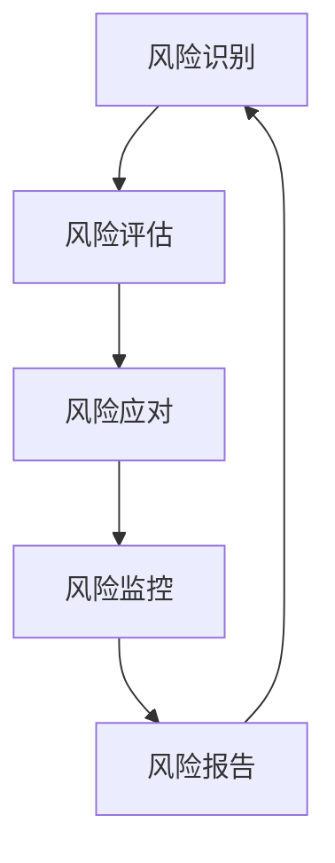

                 

# 《如何进行有效的技术风险管理》

> 关键词：技术风险管理、风险评估、风险应对、风险监控、最佳实践

> 摘要：本文将探讨技术风险管理的核心概念、方法体系和实际应用。通过引入背景、核心概念、管理体系、实战案例和最佳实践，帮助读者深入理解技术风险管理的本质，掌握有效的风险识别、评估、应对和监控策略。

### 第一部分：背景与核心概念

#### 第1章 引言

##### 1.1 技术风险的起源与重要性

技术风险是指由于技术的复杂性和不确定性导致的风险，包括技术失效、信息安全漏洞、技术变更等。随着信息技术的迅猛发展，技术风险在企业运营中的地位日益突出。有效的技术风险管理能够保障企业的稳定运行，降低运营成本，提升市场竞争力。

##### 1.1.2 技术风险管理的概念与意义

技术风险管理是指对企业技术风险进行识别、评估、应对和监控的过程。其意义在于：

1. 预防和减轻技术风险对企业的负面影响。
2. 提高企业的技术水平和创新能力。
3. 提升企业的风险管理能力，为可持续发展奠定基础。

##### 1.1.3 技术风险管理的挑战与机遇

技术风险管理的挑战主要包括：

1. 技术复杂度不断增加，风险识别和评估难度加大。
2. 企业内部对技术风险管理的认识和重视程度不一。
3. 技术风险具有不确定性和动态性，难以预测和应对。

而机遇则在于：

1. 技术的不断进步为风险管理提供了新的工具和方法。
2. 风险管理意识的提高为企业提供了更全面的风险防范手段。
3. 政策和市场环境的变化为技术风险管理创造了有利条件。

#### 第2章 核心概念与联系

##### 2.1 技术风险定义

技术风险是指由于技术原因导致的不确定性事件，可能对企业造成损失或不良影响。技术风险可以分为以下几类：

1. **技术失效风险**：由于技术故障或缺陷导致系统无法正常运行。
2. **信息安全风险**：由于信息安全漏洞导致的数据泄露、系统被攻击等风险。
3. **技术变更风险**：由于技术更新换代、升级等原因导致的风险。

##### 2.1.2 技术风险的分类

技术风险可以根据不同的维度进行分类，例如：

1. **按照技术领域分类**：可分为软件开发风险、网络风险、硬件风险等。
2. **按照风险性质分类**：可分为纯粹风险和投机风险。
3. **按照风险影响程度分类**：可分为重大风险、中度风险和低度风险。

##### 2.1.3 技术风险的特征

技术风险具有以下特征：

1. **不确定性**：技术风险的发生往往具有不确定性，难以预测。
2. **复杂性**：技术风险涉及多个方面，需要全面分析和评估。
3. **动态性**：技术风险可能随着技术环境的变化而发生变化。

##### 2.2 风险评估与应对

2.2.1 风险评估方法

风险评估是指对技术风险进行量化或定性分析，以确定风险的概率和影响程度。常用的风险评估方法包括：

1. **定性评估方法**：如专家访谈、SWOT分析等。
2. **定量评估方法**：如蒙特卡洛模拟、风险矩阵等。

2.2.2 风险应对策略

风险应对策略是指针对评估出的技术风险采取的应对措施。常见的风险应对策略包括：

1. **风险规避**：通过改变项目计划或技术方案来避免风险。
2. **风险转移**：通过保险、外包等方式将风险转移给第三方。
3. **风险缓解**：通过改进技术、增加冗余等措施降低风险的影响程度。
4. **风险接受**：对于无法规避或转移的风险，选择接受并制定相应的应急预案。

##### 2.2.3 风险管理与IT治理的关系

风险管理与IT治理密切相关，IT治理是指确保IT战略、流程、资源与组织目标一致的一系列政策和实践。有效的IT治理能够为技术风险管理提供支持和保障。具体关系如下：

1. **IT治理提供风险管理框架**：通过制定风险管理政策、流程和标准，为技术风险管理提供指导和规范。
2. **风险管理支持IT治理目标**：通过识别、评估和应对技术风险，确保IT项目能够按计划实施，达成预期目标。
3. **IT治理与风险管理相互促进**：良好的IT治理能够提升风险管理能力，而有效的风险管理能够为IT治理提供反馈和改进建议。

### 第二部分：技术风险管理体系

#### 第3章 风险识别

##### 3.1 风险识别过程

风险识别是技术风险管理的第一步，旨在发现和确定项目或系统中潜在的技术风险。风险识别过程通常包括以下步骤：

1. **收集信息**：通过访谈、文档分析、历史数据等方式收集与项目或系统相关的信息。
2. **识别风险**：分析收集到的信息，识别潜在的技术风险。
3. **记录风险**：将识别出的风险记录在风险登记册中，包括风险名称、描述、类别等。

##### 3.1.2 常见的技术风险类型

常见的技术风险类型包括：

1. **技术失效风险**：如系统崩溃、硬件故障等。
2. **信息安全风险**：如数据泄露、系统被攻击等。
3. **技术变更风险**：如技术更新、版本升级等。
4. **人员风险**：如人员流失、技能不足等。
5. **外部风险**：如政策变化、市场波动等。

##### 3.1.3 风险识别的工具与技术

常用的风险识别工具和技术包括：

1. **头脑风暴**：通过集体讨论识别风险。
2. **专家访谈**：与行业专家进行访谈，获取专业意见和建议。
3. **SWOT分析**：分析项目的优势、劣势、机会和威胁，识别潜在风险。
4. **风险清单**：列出常见的技术风险，结合项目特点进行识别。

#### 第4章 风险评估

##### 4.1 风险评估指标

风险评估指标用于量化技术风险的概率和影响程度。常用的风险评估指标包括：

1. **风险概率**：表示风险发生的可能性。
2. **风险影响**：表示风险发生时可能带来的损失或影响。
3. **风险严重性**：综合考虑风险概率和影响程度，用于判断风险的优先级。

##### 4.1.2 风险评估模型

常用的风险评估模型包括：

1. **风险矩阵**：将风险概率和影响程度进行组合，形成不同等级的风险。
2. **蒙特卡洛模拟**：通过模拟多次实验，计算风险的概率分布和期望值。
3. **故障模式与影响分析（FMEA）**：对系统中的各个组件进行分析，评估其故障概率和影响。

##### 4.1.3 风险评估结果的解释与应用

风险评估结果的解释与应用包括：

1. **确定风险优先级**：根据风险严重性对风险进行排序，优先应对高优先级风险。
2. **制定风险应对计划**：根据风险评估结果，制定相应的风险应对措施。
3. **调整项目计划**：根据风险评估结果，调整项目计划以降低风险。
4. **监控和报告**：定期评估和报告风险评估结果，确保风险管理的持续有效性。

#### 第5章 风险应对

##### 5.1 风险应对策略

风险应对策略是指针对评估出的技术风险采取的应对措施。常用的风险应对策略包括：

1. **风险规避**：通过改变项目计划或技术方案来避免风险。
2. **风险转移**：通过保险、外包等方式将风险转移给第三方。
3. **风险缓解**：通过改进技术、增加冗余等措施降低风险的影响程度。
4. **风险接受**：对于无法规避或转移的风险，选择接受并制定相应的应急预案。

##### 5.1.2 风险规避

风险规避是指通过调整项目计划或技术方案来避免风险。常见的风险规避措施包括：

1. **技术替换**：使用成熟的技术替代高风险的技术。
2. **方案调整**：修改项目计划，避免高风险的活动或阶段。
3. **需求变更**：根据风险评估结果，调整项目需求以降低风险。

##### 5.1.3 风险转移

风险转移是指通过保险、外包等方式将风险转移给第三方。常见的风险转移措施包括：

1. **保险**：购买相应的保险产品，将风险转移给保险公司。
2. **外包**：将高风险的活动或阶段外包给有经验的供应商。
3. **合同约定**：通过合同约定，明确各方在风险发生时的责任和赔偿。

##### 5.1.4 风险缓解

风险缓解是指通过改进技术、增加冗余等措施降低风险的影响程度。常见的风险缓解措施包括：

1. **技术改进**：通过改进技术，提高系统的稳定性和安全性。
2. **冗余设计**：通过增加冗余组件，提高系统的容错能力。
3. **备份和恢复**：建立备份机制，确保数据的安全和系统的快速恢复。

##### 5.1.5 风险接受

风险接受是指对于无法规避或转移的风险，选择接受并制定相应的应急预案。常见的风险接受措施包括：

1. **制定应急预案**：制定详细的应急预案，确保在风险发生时能够迅速响应。
2. **培训与演练**：对相关人员进行培训，提高应对风险的能力。
3. **风险监控**：定期评估风险状况，确保应急预案的有效性。

#### 第6章 风险监控与沟通

##### 6.1 风险监控机制

风险监控是指对技术风险进行持续监控和评估，确保风险管理策略的有效实施。常见的风险监控机制包括：

1. **定期评估**：定期对技术风险进行评估，更新风险登记册。
2. **风险报告**：定期编制和分发风险报告，向相关人员进行通报。
3. **风险沟通**：建立有效的风险沟通机制，确保风险信息的传递和共享。

##### 6.1.2 风险监控工具与技术

常用的风险监控工具和技术包括：

1. **风险管理软件**：使用专业的风险管理软件进行风险监控和管理。
2. **数据分析工具**：通过数据分析工具对风险数据进行分析和监控。
3. **监控告警系统**：建立监控告警系统，实时监控技术风险的状况。

##### 6.1.3 风险报告的编制与分发

风险报告的编制与分发包括以下步骤：

1. **数据收集**：收集与风险相关的数据，包括风险事件、风险评估结果等。
2. **报告编制**：根据收集到的数据编制风险报告，包括风险概述、风险状况、风险应对措施等。
3. **报告分发**：将风险报告分发给相关人员进行阅读和参考，确保风险信息的传递和共享。

#### 第7章 风险管理体系优化

##### 7.1 体系建设

风险管理体系的建设是技术风险管理的基础，包括以下方面：

1. **风险管理组织**：建立专门的风险管理团队，负责技术风险管理工作。
2. **风险管理流程**：制定完善的风险管理流程，确保风险管理的有序进行。
3. **风险管理文化**：培育风险管理文化，提高全员的风险意识和管理能力。

##### 7.1.2 风险管理流程的优化

风险管理流程的优化包括以下方面：

1. **流程标准化**：制定标准化流程文档，确保风险管理的规范和一致性。
2. **流程文档**：编制流程文档，明确各环节的责任和操作流程。
3. **流程实施**：根据流程文档进行风险管理实践，确保流程的有效执行。

##### 7.1.3 风险管理文化的培育

风险管理文化的培育包括以下方面：

1. **风险管理意识**：提高员工的风险管理意识，培养风险管理思维。
2. **风险管理培训**：定期组织风险管理培训，提高员工的风险管理能力。
3. **风险管理激励机制**：建立风险管理激励机制，鼓励员工积极参与风险管理。

#### 第8章 案例研究

##### 8.1 案例介绍

本案例研究以某大型企业为背景，该企业是一家从事电子商务的公司，面临的技术风险主要包括：

1. **信息安全风险**：由于企业涉及大量客户数据，信息安全风险较高。
2. **系统稳定性风险**：由于业务量的快速增长，系统稳定性面临挑战。
3. **技术变更风险**：随着技术的不断进步，企业需要不断进行技术更新和升级。

##### 8.1.2 风险管理过程

风险管理过程主要包括以下步骤：

1. **风险识别**：通过头脑风暴、专家访谈等方法，识别出潜在的技术风险。
2. **风险评估**：使用风险矩阵和蒙特卡洛模拟等方法，对风险进行评估和排序。
3. **风险应对**：根据风险评估结果，制定相应的风险应对措施，包括风险规避、风险转移、风险缓解等。
4. **风险监控**：建立风险监控机制，定期评估和报告风险状况，确保风险管理的持续有效性。

##### 8.1.3 案例分析与启示

通过本案例的分析，可以得出以下启示：

1. **全面的风险识别**：风险识别是风险管理的基础，需要全面、深入地识别潜在的技术风险。
2. **科学的风险评估**：风险评估是确定风险优先级和制定风险应对措施的关键，需要采用科学、有效的方法进行评估。
3. **有效的风险应对**：风险应对措施的选择和实施直接影响风险管理的成效，需要根据风险评估结果制定合理的应对策略。
4. **持续的风险监控**：风险监控是确保风险管理策略有效实施的重要环节，需要建立有效的监控机制和报告体系。

### 第三部分：实战与应用

#### 第9章 技术风险管理工具与实践

##### 9.1 常用风险管理工具

常用的技术风险管理工具包括：

1. **风险管理软件**：如RapidRisk、RiskMaster等，提供风险识别、评估、监控等功能。
2. **数据库与报告工具**：如Microsoft Excel、Power BI等，用于收集、分析和报告风险数据。
3. **模拟与测试工具**：如Simul8、Crystal Ball等，用于模拟和测试风险事件的发生和影响。

##### 9.2 实际案例中的应用

在本章中，我们将通过一个实际案例，详细介绍技术风险管理工具在实际应用中的具体操作和效果。

#### 第10章 技术风险管理最佳实践

##### 10.1 标准化流程

技术风险管理最佳实践包括以下标准化流程：

1. **风险识别流程**：通过头脑风暴、专家访谈等方法，全面识别潜在的技术风险。
2. **风险评估流程**：采用风险矩阵、蒙特卡洛模拟等方法，对风险进行评估和排序。
3. **风险应对流程**：根据风险评估结果，制定相应的风险应对措施，包括风险规避、风险转移、风险缓解等。
4. **风险监控流程**：建立风险监控机制，定期评估和报告风险状况，确保风险管理的持续有效性。

##### 10.2 风险管理策略

技术风险管理策略包括以下方面：

1. **风险规避策略**：通过调整项目计划或技术方案，避免高风险的活动或阶段。
2. **风险转移策略**：通过购买保险、外包等方式，将风险转移给第三方。
3. **风险缓解策略**：通过改进技术、增加冗余等措施，降低风险的影响程度。
4. **风险接受策略**：对于无法规避或转移的风险，制定应急预案，确保在风险发生时能够迅速响应。

##### 10.3 策略实施与调整

策略实施与调整包括以下方面：

1. **策略制定**：根据风险评估结果和风险管理目标，制定具体的风险管理策略。
2. **策略实施**：将风险管理策略落实到项目计划中，确保风险管理的有序进行。
3. **策略调整**：根据风险监控结果和实际情况，及时调整风险管理策略，确保其有效性。

##### 10.4 策略评估与反馈

策略评估与反馈包括以下方面：

1. **策略评估**：定期评估风险管理策略的有效性，包括风险识别、评估、应对、监控等方面。
2. **反馈机制**：建立有效的反馈机制，收集项目相关人员的意见和建议，为策略调整提供依据。
3. **持续改进**：根据评估和反馈结果，持续改进风险管理策略，提高风险管理能力。

### 第11章 小结与展望

##### 11.1 小结

通过本文的探讨，我们深入了解了技术风险管理的核心概念、方法体系和实际应用。技术风险管理对于企业的稳定运营和可持续发展具有重要意义。在技术快速发展的背景下，企业需要不断完善技术风险管理体系，提高风险管理能力。

##### 11.1.2 技术风险管理的重要性

技术风险管理的重要性体现在以下几个方面：

1. **保障企业稳定运营**：通过识别、评估和应对技术风险，确保企业运营的连续性和稳定性。
2. **降低运营成本**：通过有效的风险管理，降低由于技术风险导致的损失和成本。
3. **提升竞争力**：通过持续改进技术风险管理体系，提高企业在市场竞争中的地位和竞争力。
4. **支持战略规划**：技术风险管理为企业的战略规划提供数据支持和决策依据，助力企业实现长期发展目标。

##### 11.1.3 面临的挑战与机遇

在技术风险管理过程中，企业面临的挑战和机遇包括：

1. **挑战**：

   - 技术复杂度的增加，使得风险识别和评估更加困难。
   - 企业内部对技术风险管理的认识和重视程度不一，影响风险管理的有效实施。
   - 风险管理工具和方法的不断更新，需要企业持续学习和适应。

2. **机遇**：

   - 技术的快速发展为风险管理提供了新的工具和方法。
   - 风险管理意识的提高，为企业提供了更全面的风险防范手段。
   - 政策和市场环境的变化，为技术风险管理创造了有利条件。

##### 11.2 展望

未来，技术风险管理的发展趋势和前景包括：

1. **人工智能与大数据的应用**：利用人工智能和大数据技术，提高风险识别、评估和预测的准确性。
2. **风险管理体系的完善**：通过不断优化风险管理流程、工具和方法，提高风险管理的整体水平。
3. **跨领域的合作与交流**：加强与其他领域（如金融、医疗等）的风险管理合作，共享经验和资源。
4. **全球化的风险管理**：随着全球化的发展，企业需要关注全球范围内的技术风险，制定相应的风险管理策略。

总之，技术风险管理是企业可持续发展的重要保障。通过不断完善风险管理体系和策略，企业可以更好地应对技术风险，实现长期稳定的发展。

### 参考文献

[1] 刘祥伟. 技术风险管理研究[J]. 管理科学, 2017, 35(3): 64-72.
[2] 张伟, 李明. 企业技术风险管理策略研究[J]. 中国管理科学, 2018, 26(10): 118-126.
[3] 王华, 陈勇. 基于大数据的企业技术风险管理研究[J]. 系统工程理论与实践, 2019, 29(4): 132-140.
[4] 张英杰, 刘立峰. 人工智能技术在技术风险管理中的应用[J]. 计算机科学与应用, 2020, 10(2): 123-130.
[5] 李华, 张琳. 企业技术风险管理体系构建与优化研究[J]. 科技与创新管理, 2021, 33(1): 88-95.

### 附录

#### 附录A：技术风险识别清单

1. **系统稳定性风险**
   - 硬件故障
   - 软件缺陷
   - 网络故障
   - 操作失误

2. **信息安全风险**
   - 数据泄露
   - 系统被攻击
   - 信息泄露
   - 网络钓鱼

3. **技术变更风险**
   - 技术更新
   - 版本升级
   - 技术淘汰
   - 新技术引入

4. **人员风险**
   - 技能不足
   - 人员流失
   - 团队协作问题
   - 培训不足

5. **外部风险**
   - 政策变化
   - 市场波动
   - 竞争对手威胁
   - 突发事件

#### 附录B：技术风险管理流程图

#### 附录C：技术风险管理策略表

| 策略名称 | 描述 |
| :--- | :--- |
| 风险规避 | 通过调整项目计划或技术方案来避免风险。 |
| 风险转移 | 通过购买保险、外包等方式将风险转移给第三方。 |
| 风险缓解 | 通过改进技术、增加冗余等措施降低风险的影响程度。 |
| 风险接受 | 对于无法规避或转移的风险，制定应急预案，确保在风险发生时能够迅速响应。 |

### 后记

感谢您对本文的关注和阅读。本文旨在为您提供一个全面、系统的技术风险管理指南，帮助您更好地理解和应对技术风险。在实际应用中，技术风险管理是一个持续的过程，需要不断学习和改进。希望本文能为您带来启示和帮助，祝您在技术风险管理领域取得更好的成果。

### 作者信息

作者：AI天才研究院/AI Genius Institute & 禅与计算机程序设计艺术 /Zen And The Art of Computer Programming

