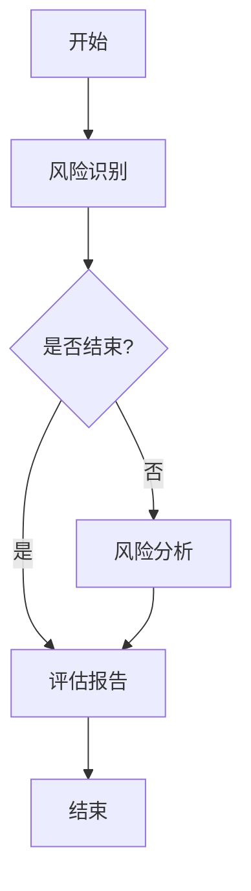
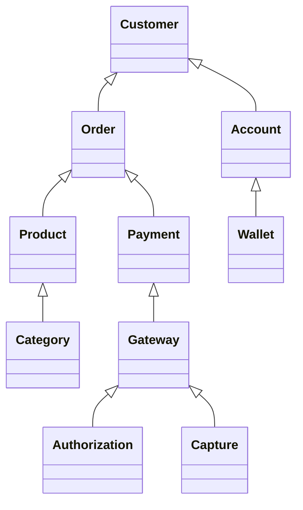
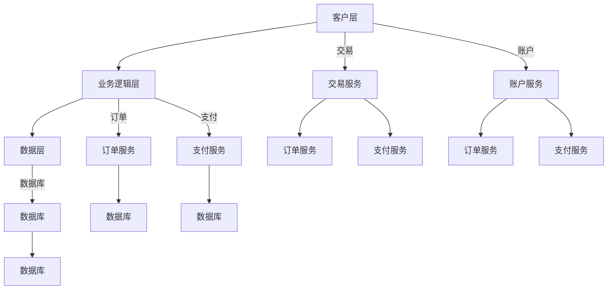

                 


# 如何进行有效的技术风险评估

关键词：技术风险评估、风险识别、风险分析、风险评价、风险应对、风险监控

摘要：随着信息技术的飞速发展，企业面临着越来越多的技术风险。本文旨在介绍如何进行有效的技术风险评估，包括核心概念、框架方法、实际操作流程、案例分析以及最佳实践和注意事项，帮助企业全面、准确地评估技术风险，制定科学合理的风险管理策略。

## 1.6 问题背景与问题描述

### 1.6.1 背景介绍

随着信息技术的飞速发展，企业越来越依赖信息技术来支持其业务运营。然而，技术的引入和应用也带来了新的风险。技术风险可能源于技术缺陷、安全漏洞、系统故障、数据泄露等，这些风险如果得不到有效管理，可能会对企业的运营、声誉和财务状况造成重大影响。因此，进行技术风险评估已成为企业风险管理的重要组成部分。

### 1.6.2 问题背景

当前，许多企业在进行技术风险评估时，存在以下问题：

- 方法单一：依赖单一的评估方法，缺乏系统性，导致评估结果不够全面。
- 缺乏专业知识：评估团队缺乏相关的技术知识和经验，导致评估结果不准确。
- 评估不及时：技术风险往往变化迅速，企业需要及时进行风险评估，但现有评估流程过于繁琐，无法及时响应。
- 评估结果不透明：评估过程和结果不够透明，无法为决策者提供有力的支持。

### 1.6.3 问题解决

为了解决上述问题，企业需要：

- 建立系统性的技术风险评估框架，涵盖风险识别、分析、评价、应对和监控等多个环节。
- 培养专业的评估团队，确保评估结果的准确性和权威性。
- 优化评估流程，提高评估的及时性和效率。
- 确保评估结果透明，为决策者提供有力支持。

### 1.6.4 边界与外延

技术风险评估的边界主要涉及企业内部的技术风险，包括软件系统、硬件设备、网络设施等。外延则包括与企业相关的技术合作伙伴、供应商、客户等。

### 1.6.5 概念结构与核心要素组成

技术风险评估的核心概念包括：

- 技术风险：可能对企业的运营、财务和声誉造成负面影响的潜在事件或情况。
- 风险识别：识别企业面临的技术风险。
- 风险分析：分析风险的概率和影响。
- 风险评价：评估风险的严重程度。
- 风险应对：制定和实施风险应对策略。
- 风险监控：监控风险应对措施的执行效果。

## 1.7 核心概念与联系

### 1.7.1 技术风险

技术风险是指由于技术的引入、应用或改变，可能给企业带来负面影响的潜在事件或情况。技术风险可能源于技术缺陷、安全漏洞、系统故障、数据泄露等。

### 1.7.2 风险评估

风险评估是一种系统性的过程，用于识别、分析和评估风险的可能性和影响，以帮助企业做出科学决策。风险评估通常包括以下步骤：

1. 风险识别：识别企业面临的风险。
2. 风险分析：分析风险的概率和影响。
3. 风险评价：评估风险的严重程度。
4. 风险应对：制定和实施风险应对策略。
5. 风险监控：监控风险应对措施的执行效果。

### 1.7.3 风险矩阵

风险矩阵是一种常用的风险评估工具，用于表示风险的概率和影响。风险矩阵通常包含两个维度：风险的概率和风险的影响。通过风险矩阵，决策者可以直观地了解风险的严重程度，为决策提供参考。

### 1.7.4 风险评估模型

风险评估模型是用于评估风险的方法和框架，包括定量和定性的方法。常见的风险评估模型有：

- 定量分析：使用数学模型和统计方法，对风险的概率和影响进行量化分析。
- 定性分析：通过专家评估、头脑风暴等方法，对风险进行定性分析。

### 1.7.5 蒙特卡洛模拟

蒙特卡洛模拟是一种通过模拟随机事件，评估风险的概率和影响的方法。蒙特卡洛模拟适用于不确定性和随机性较强的情况，可以帮助企业更准确地评估技术风险。

### 1.7.6 故障模式与影响分析（FMEA）

故障模式与影响分析（FMEA）是一种系统性的分析方法，用于识别产品或过程可能出现的故障模式及其影响。FMEA可以帮助企业提前识别潜在的技术风险，制定相应的应对策略。

## 1.8 技术风险评估的框架与方法

### 1.8.1 技术风险评估的框架

技术风险评估的框架通常包括以下步骤：

1. 风险识别：通过访谈、问卷调查、文档分析等方法，识别企业面临的技术风险。
2. 风险分析：对识别出的风险进行详细分析，包括评估风险的概率和影响，确定风险等级。
3. 风险评价：使用风险矩阵和企业的风险承受能力，对风险进行优先级排序，确定需要优先处理的风险。
4. 风险应对：制定相应的风险应对策略，包括风险规避、风险转移、风险减轻等。
5. 风险监控：对实施的风险应对措施进行持续监控，确保风险得到有效控制。

### 1.8.2 常用的技术风险评估方法

常用的技术风险评估方法包括：

- **定量分析**：使用数学模型和统计方法，对风险的概率和影响进行量化分析。例如，可以使用蒙特卡洛模拟评估系统故障的概率和影响。
- **定性分析**：通过专家评估、头脑风暴等方法，对风险进行定性分析。例如，可以通过专家访谈收集技术风险的信息。
- **蒙特卡洛模拟**：通过模拟随机事件，评估风险的概率和影响。适用于不确定性和随机性较强的情况。
- **故障模式与影响分析（FMEA）**：系统性地分析产品或过程可能出现的故障模式及其影响。适用于产品设计和过程改进。

## 1.9 技术风险评估的实际操作流程

### 1.9.1 项目启动

在开始技术风险评估之前，首先需要明确评估目标、范围和团队组成，制定评估计划。评估计划应包括评估的时间、方法、工具和资源等方面的安排。

### 1.9.2 风险识别

通过访谈、问卷调查、文档分析等方法，识别企业面临的技术风险。访谈可以与企业的技术人员、管理人员和业务人员等进行，问卷调查可以覆盖更广泛的受众。文档分析包括阅读企业的技术文档、项目计划和以往的风险评估报告等。

### 1.9.3 风险分析

对识别出的风险进行详细分析，包括评估风险的概率和影响，确定风险等级。风险分析可以使用定量分析或定性分析的方法。例如，可以使用蒙特卡洛模拟评估系统故障的概率和影响，或通过专家评估确定风险等级。

### 1.9.4 风险评价

使用风险矩阵和企业的风险承受能力，对风险进行优先级排序，确定需要优先处理的风险。风险矩阵通常包含两个维度：风险的概率和风险的影响。企业的风险承受能力决定了其对风险的容忍程度。

### 1.9.5 风险应对

根据风险评价的结果，制定相应的风险应对策略。风险应对策略包括风险规避、风险转移、风险减轻等。例如，对于高风险的技术风险，可以采取风险规避策略，避免引入该技术；对于中低风险的技术风险，可以采取风险转移策略，将风险转移给第三方；对于较低风险的技术风险，可以采取风险减轻策略，通过改进技术或加强管理来降低风险。

### 1.9.6 风险监控

对实施的风险应对措施进行持续监控，确保风险得到有效控制。风险监控可以定期进行，以检查风险应对措施的有效性。如果发现风险应对措施不奏效，需要及时调整策略。

### 1.9.7 评估报告

编写评估报告，总结评估结果，提出改进建议。评估报告应包括评估过程的描述、评估结果、风险应对措施以及改进建议等内容。评估报告应提交给企业的决策层，为决策者提供有力支持。

## 1.10 技术风险评估的案例分析

### 1.10.1 案例背景

某大型企业正在开发一款新的移动应用程序，旨在为用户提供便捷的服务。然而，在开发过程中，该企业遇到了一系列技术问题，包括：

- 数据存储安全问题：由于采用了新的数据库技术，数据存储存在安全隐患。
- 系统性能问题：应用程序在高峰时段出现响应缓慢的问题。
- 第三方库风险：部分第三方库存在漏洞，可能影响应用程序的安全性。

### 1.10.2 风险识别

通过访谈、问卷调查和文档分析，识别出以下技术风险：

- 数据存储安全风险
- 系统性能风险
- 第三方库风险

### 1.10.3 风险分析

对识别出的风险进行详细分析，包括评估风险的概率和影响。例如：

- 数据存储安全风险：概率为80%，影响为重大，可能导致数据泄露。
- 系统性能风险：概率为60%，影响为较大，可能导致用户体验差。
- 第三方库风险：概率为40%，影响为中等，可能导致应用程序崩溃。

### 1.10.4 风险评价

使用风险矩阵对风险进行评价，确定风险的优先级。根据企业的风险承受能力，将风险分为高风险、中风险和低风险。

- 数据存储安全风险：高风险
- 系统性能风险：中风险
- 第三方库风险：低风险

### 1.10.5 风险应对

根据风险评价的结果，制定相应的风险应对策略：

- 数据存储安全风险：采取数据加密措施，加强数据存储安全。
- 系统性能风险：优化系统架构，提高系统性能。
- 第三方库风险：更换第三方库，选择更安全的库。

### 1.10.6 风险监控

对实施的风险应对措施进行监控，确保风险得到有效控制。例如，定期进行数据存储安全测试，监控系统性能指标，确保第三方库的更新和安全。

### 1.10.7 评估报告

编写评估报告，总结评估结果，提出改进建议。评估报告应提交给企业的决策层，为决策者提供有力支持。

## 1.11 技术风险评估的最佳实践与注意事项

### 1.11.1 最佳实践

为了确保技术风险评估的有效性，企业应遵循以下最佳实践：

- **建立专业的风险评估团队**：由经验丰富的技术人员和管理人员组成，确保评估的准确性和权威性。
- **制定标准化的评估流程**：确保评估过程的规范性和一致性。
- **充分利用技术工具**：使用专业的风险评估工具，提高评估效率和准确性。
- **定期进行风险评估**：技术风险是动态变化的，企业需要定期进行风险评估，以适应不断变化的技术环境。
- **与业务目标紧密结合**：将技术风险评估与企业的业务目标紧密结合，确保评估结果对业务决策有实际指导意义。

### 1.11.2 注意事项

在进行技术风险评估时，企业应注意以下事项：

- **充分了解技术风险**：了解技术风险的性质、概率和影响，以便制定合理的风险应对策略。
- **确保评估过程的透明性**：确保评估过程和结果对相关人员透明，以便获得有效的支持。
- **合理分配资源**：根据风险优先级和影响，合理分配资源，确保高风险得到重点关注和应对。
- **持续改进**：技术风险评估是一个持续改进的过程，企业需要不断总结经验，优化评估流程和方法。

通过遵循最佳实践和注意事项，企业可以有效地进行技术风险评估，降低技术风险对企业的影响，确保企业的持续发展。

### 1.12 作者信息

作者：AI天才研究院/AI Genius Institute & 禅与计算机程序设计艺术 /Zen And The Art of Computer Programming

在结束本文的撰写之前，让我们回顾一下本文的主要内容。本文首先介绍了技术风险评估的背景和问题，然后详细阐述了技术风险评估的核心概念、框架与方法、实际操作流程、案例分析以及最佳实践与注意事项。通过本文的阅读，读者可以全面了解技术风险评估的重要性，掌握有效的评估方法和实践技巧。

技术风险评估不仅是企业风险管理的重要组成部分，也是保障企业持续发展的关键。希望本文能够为读者提供有价值的参考，帮助企业在技术风险管理方面取得更好的成果。

在未来的工作中，建议读者：

1. 定期进行技术风险评估，确保对企业面临的技术风险有清晰的认识。
2. 建立专业的风险评估团队，提高评估的准确性和权威性。
3. 结合业务目标，将技术风险评估与企业的战略规划紧密结合。
4. 不断学习和实践，提高自己在技术风险评估方面的专业能力。

最后，感谢读者对本文的关注，希望本文能够对您的技术风险评估工作有所帮助。如果您有任何疑问或建议，欢迎随时与我们联系。再次感谢您的阅读！

```markdown
# 如何进行有效的技术风险评估

关键词：技术风险评估、风险识别、风险分析、风险评价、风险应对、风险监控

摘要：随着信息技术的飞速发展，企业面临着越来越多的技术风险。本文旨在介绍如何进行有效的技术风险评估，包括核心概念、框架方法、实际操作流程、案例分析以及最佳实践和注意事项，帮助企业全面、准确地评估技术风险，制定科学合理的风险管理策略。

## 1.6 问题背景与问题描述

### 1.6.1 背景介绍

随着信息技术的飞速发展，企业越来越依赖信息技术来支持其业务运营。然而，技术的引入和应用也带来了新的风险。技术风险可能源于技术缺陷、安全漏洞、系统故障、数据泄露等，这些风险如果得不到有效管理，可能会对企业的运营、声誉和财务状况造成重大影响。因此，进行技术风险评估已成为企业风险管理的重要组成部分。

### 1.6.2 问题背景

当前，许多企业在进行技术风险评估时，存在以下问题：

- 方法单一：依赖单一的评估方法，缺乏系统性，导致评估结果不够全面。
- 缺乏专业知识：评估团队缺乏相关的技术知识和经验，导致评估结果不准确。
- 评估不及时：技术风险往往变化迅速，企业需要及时进行风险评估，但现有评估流程过于繁琐，无法及时响应。
- 评估结果不透明：评估过程和结果不够透明，无法为决策者提供有力的支持。

### 1.6.3 问题解决

为了解决上述问题，企业需要：

- 建立系统性的技术风险评估框架，涵盖风险识别、分析、评价、应对和监控等多个环节。
- 培养专业的评估团队，确保评估结果的准确性和权威性。
- 优化评估流程，提高评估的及时性和效率。
- 确保评估结果透明，为决策者提供有力支持。

### 1.6.4 边界与外延

技术风险评估的边界主要涉及企业内部的技术风险，包括软件系统、硬件设备、网络设施等。外延则包括与企业相关的技术合作伙伴、供应商、客户等。

### 1.6.5 概念结构与核心要素组成

技术风险评估的核心概念包括：

- 技术风险：可能对企业的运营、财务和声誉造成负面影响的潜在事件或情况。
- 风险识别：识别企业面临的技术风险。
- 风险分析：分析风险的概率和影响。
- 风险评价：评估风险的严重程度。
- 风险应对：制定和实施风险应对策略。
- 风险监控：监控风险应对措施的执行效果。

## 1.7 核心概念与联系

### 1.7.1 技术风险

技术风险是指由于技术的引入、应用或改变，可能给企业带来负面影响的潜在事件或情况。技术风险可能源于技术缺陷、安全漏洞、系统故障、数据泄露等。

### 1.7.2 风险评估

风险评估是一种系统性的过程，用于识别、分析和评估风险的可能性和影响，以帮助企业做出科学决策。风险评估通常包括以下步骤：

1. 风险识别：识别企业面临的风险。
2. 风险分析：分析风险的概率和影响。
3. 风险评价：评估风险的严重程度。
4. 风险应对：制定和实施风险应对策略。
5. 风险监控：监控风险应对措施的执行效果。

### 1.7.3 风险矩阵

风险矩阵是一种常用的风险评估工具，用于表示风险的概率和影响。风险矩阵通常包含两个维度：风险的概率和风险的影响。通过风险矩阵，决策者可以直观地了解风险的严重程度，为决策提供参考。

### 1.7.4 风险评估模型

风险评估模型是用于评估风险的方法和框架，包括定量和定性的方法。常见的风险评估模型有：

- 定量分析：使用数学模型和统计方法，对风险的概率和影响进行量化分析。
- 定性分析：通过专家评估、头脑风暴等方法，对风险进行定性分析。

### 1.7.5 蒙特卡洛模拟

蒙特卡洛模拟是一种通过模拟随机事件，评估风险的概率和影响的方法。蒙特卡洛模拟适用于不确定性和随机性较强的情况，可以帮助企业更准确地评估技术风险。

### 1.7.6 故障模式与影响分析（FMEA）

故障模式与影响分析（FMEA）是一种系统性的分析方法，用于识别产品或过程可能出现的故障模式及其影响。FMEA可以帮助企业提前识别潜在的技术风险，制定相应的应对策略。

## 1.8 技术风险评估的框架与方法

### 1.8.1 技术风险评估的框架

技术风险评估的框架通常包括以下步骤：

1. 风险识别：通过访谈、问卷调查、文档分析等方法，识别企业面临的技术风险。
2. 风险分析：对识别出的风险进行详细分析，包括评估风险的概率和影响，确定风险等级。
3. 风险评价：使用风险矩阵和企业的风险承受能力，对风险进行优先级排序，确定需要优先处理的风险。
4. 风险应对：制定相应的风险应对策略，包括风险规避、风险转移、风险减轻等。
5. 风险监控：对实施的风险应对措施进行持续监控，确保风险得到有效控制。

### 1.8.2 常用的技术风险评估方法

常用的技术风险评估方法包括：

- **定量分析**：使用数学模型和统计方法，对风险的概率和影响进行量化分析。例如，可以使用蒙特卡洛模拟评估系统故障的概率和影响。
- **定性分析**：通过专家评估、头脑风暴等方法，对风险进行定性分析。例如，可以通过专家访谈收集技术风险的信息。
- **蒙特卡洛模拟**：通过模拟随机事件，评估风险的概率和影响。适用于不确定性和随机性较强的情况。
- **故障模式与影响分析（FMEA）**：系统性地分析产品或过程可能出现的故障模式及其影响。适用于产品设计和过程改进。

## 1.9 技术风险评估的实际操作流程

### 1.9.1 项目启动

在开始技术风险评估之前，首先需要明确评估目标、范围和团队组成，制定评估计划。评估计划应包括评估的时间、方法、工具和资源等方面的安排。

### 1.9.2 风险识别

通过访谈、问卷调查、文档分析等方法，识别企业面临的技术风险。访谈可以与企业的技术人员、管理人员和业务人员等进行，问卷调查可以覆盖更广泛的受众。文档分析包括阅读企业的技术文档、项目计划和以往的风险评估报告等。

### 1.9.3 风险分析

对识别出的风险进行详细分析，包括评估风险的概率和影响，确定风险等级。风险分析可以使用定量分析或定性分析的方法。例如，可以使用蒙特卡洛模拟评估系统故障的概率和影响，或通过专家评估确定风险等级。

### 1.9.4 风险评价

使用风险矩阵和企业的风险承受能力，对风险进行优先级排序，确定需要优先处理的风险。风险矩阵通常包含两个维度：风险的概率和风险的影响。企业的风险承受能力决定了其对风险的容忍程度。

### 1.9.5 风险应对

根据风险评价的结果，制定相应的风险应对策略。风险应对策略包括风险规避、风险转移、风险减轻等。例如，对于高风险的技术风险，可以采取风险规避策略，避免引入该技术；对于中低风险的技术风险，可以采取风险转移策略，将风险转移给第三方；对于较低风险的技术风险，可以采取风险减轻策略，通过改进技术或加强管理来降低风险。

### 1.9.6 风险监控

对实施的风险应对措施进行持续监控，确保风险得到有效控制。风险监控可以定期进行，以检查风险应对措施的有效性。如果发现风险应对措施不奏效，需要及时调整策略。

### 1.9.7 评估报告

编写评估报告，总结评估结果，提出改进建议。评估报告应包括评估过程的描述、评估结果、风险应对措施以及改进建议等内容。评估报告应提交给企业的决策层，为决策者提供有力支持。

## 1.10 技术风险评估的案例分析

### 1.10.1 案例背景

某大型企业正在开发一款新的移动应用程序，旨在为用户提供便捷的服务。然而，在开发过程中，该企业遇到了一系列技术问题，包括：

- 数据存储安全问题：由于采用了新的数据库技术，数据存储存在安全隐患。
- 系统性能问题：应用程序在高峰时段出现响应缓慢的问题。
- 第三方库风险：部分第三方库存在漏洞，可能影响应用程序的安全性。

### 1.10.2 风险识别

通过访谈、问卷调查和文档分析，识别出以下技术风险：

- 数据存储安全风险
- 系统性能风险
- 第三方库风险

### 1.10.3 风险分析

对识别出的风险进行详细分析，包括评估风险的概率和影响。例如：

- 数据存储安全风险：概率为80%，影响为重大，可能导致数据泄露。
- 系统性能风险：概率为60%，影响为较大，可能导致用户体验差。
- 第三方库风险：概率为40%，影响为中等，可能导致应用程序崩溃。

### 1.10.4 风险评价

使用风险矩阵对风险进行评价，确定风险的优先级。根据企业的风险承受能力，将风险分为高风险、中风险和低风险。

- 数据存储安全风险：高风险
- 系统性能风险：中风险
- 第三方库风险：低风险

### 1.10.5 风险应对

根据风险评价的结果，制定相应的风险应对策略：

- 数据存储安全风险：采取数据加密措施，加强数据存储安全。
- 系统性能风险：优化系统架构，提高系统性能。
- 第三方库风险：更换第三方库，选择更安全的库。

### 1.10.6 风险监控

对实施的风险应对措施进行监控，确保风险得到有效控制。例如，定期进行数据存储安全测试，监控系统性能指标，确保第三方库的更新和安全。

### 1.10.7 评估报告

编写评估报告，总结评估结果，提出改进建议。评估报告应提交给企业的决策层，为决策者提供有力支持。

## 1.11 技术风险评估的最佳实践与注意事项

### 1.11.1 最佳实践

为了确保技术风险评估的有效性，企业应遵循以下最佳实践：

- **建立专业的风险评估团队**：由经验丰富的技术人员和管理人员组成，确保评估的准确性和权威性。
- **制定标准化的评估流程**：确保评估过程的规范性和一致性。
- **充分利用技术工具**：使用专业的风险评估工具，提高评估效率和准确性。
- **定期进行风险评估**：技术风险是动态变化的，企业需要定期进行风险评估，以适应不断变化的技术环境。
- **与业务目标紧密结合**：将技术风险评估与企业的业务目标紧密结合，确保评估结果对业务决策有实际指导意义。

### 1.11.2 注意事项

在进行技术风险评估时，企业应注意以下事项：

- **充分了解技术风险**：了解技术风险的性质、概率和影响，以便制定合理的风险应对策略。
- **确保评估过程的透明性**：确保评估过程和结果对相关人员透明，以便获得有效的支持。
- **合理分配资源**：根据风险优先级和影响，合理分配资源，确保高风险得到重点关注和应对。
- **持续改进**：技术风险评估是一个持续改进的过程，企业需要不断总结经验，优化评估流程和方法。

## 1.12 作者信息

作者：AI天才研究院/AI Genius Institute & 禅与计算机程序设计艺术 /Zen And The Art of Computer Programming

## 1.13 小结

本文详细介绍了如何进行有效的技术风险评估，包括核心概念、框架方法、实际操作流程、案例分析以及最佳实践与注意事项。技术风险评估是企业风险管理的重要组成部分，通过系统性和科学的方法，可以帮助企业全面、准确地评估技术风险，制定科学合理的风险管理策略。希望本文能够为读者提供有价值的参考，帮助企业在技术风险管理方面取得更好的成果。

## 1.14 注意事项与拓展阅读

在进行技术风险评估时，企业需要关注以下几个方面：

1. **风险评估团队的专业性**：评估团队成员应具备丰富的技术背景和风险管理经验，确保评估结果的准确性和权威性。
2. **评估方法的多样性**：结合企业的实际情况，选择合适的定量分析和定性分析方法，提高评估的全面性和准确性。
3. **风险评估的时效性**：技术风险是动态变化的，企业需要定期进行风险评估，以适应技术环境的变化。
4. **与业务目标的结合**：技术风险评估应紧密结合企业的业务目标，确保评估结果对业务决策有实际指导意义。

此外，为了进一步提升技术风险评估的能力，企业可以参考以下拓展阅读：

- 《风险管理：企业风险管理指南》（作者：James H. Donaldson Jr.）
- 《风险矩阵：风险管理的工具与应用》（作者：John C. P. Jones）
- 《技术风险评估：理论与实践》（作者：Michael R. Green）

通过学习这些资料，企业可以更好地理解和应用技术风险评估的方法和技巧，提高风险管理水平。

## 1.15 结语

通过本文的介绍，我们了解了技术风险评估的重要性及其基本方法和实践技巧。技术风险评估不仅有助于企业识别和应对潜在的技术风险，还能为企业的决策提供有力支持，保障企业的稳定运营和可持续发展。希望本文能够为读者提供有益的启示，助力企业在技术风险管理方面取得更好的成效。

在此，再次感谢读者对本文的关注，我们期待在未来的技术风险管理工作中与您共同进步。如果您对技术风险评估有任何疑问或建议，欢迎随时与我们联系。再次感谢您的阅读！

### 总结

技术风险评估是企业风险管理的重要组成部分，它有助于企业全面、准确地识别和应对潜在的技术风险。本文从问题背景、核心概念、框架方法、实际操作流程、案例分析以及最佳实践与注意事项等方面进行了详细阐述，为企业提供了有效的技术风险评估指南。

首先，介绍了技术风险评估的背景和问题，指出了当前企业在技术风险评估中存在的问题，如方法单一、缺乏专业知识、评估不及时等。然后，详细介绍了技术风险评估的核心概念，包括技术风险、风险评估、风险矩阵、风险评估模型等，并分析了它们之间的关系。

接着，本文提出了技术风险评估的框架和方法，包括风险识别、风险分析、风险评价、风险应对和风险监控等步骤，并介绍了常用的技术风险评估方法，如定量分析和定性分析、蒙特卡洛模拟、故障模式与影响分析（FMEA）等。

在实际操作流程方面，本文详细介绍了从项目启动、风险识别、风险分析、风险评价到风险应对和风险监控的各个环节，并结合案例进行了说明。同时，还提出了技术风险评估的最佳实践和注意事项，以确保评估工作的有效性和准确性。

通过本文的阅读，读者应能够：

1. 理解技术风险评估的核心概念和重要性。
2. 掌握技术风险评估的基本框架和方法。
3. 了解技术风险评估的实际操作流程。
4. 学会运用最佳实践和注意事项进行有效的技术风险评估。

希望本文能够为企业的技术风险管理提供有益的参考和指导。在未来的工作中，企业应结合自身实际情况，不断优化技术风险评估流程，提高风险管理水平，确保企业的稳定运营和可持续发展。

### 附录：核心概念属性特征对比表格

| 核心概念 | 定义 | 主要属性特征 | 与其他概念的关系 |
| --- | --- | --- | --- |
| 技术风险 | 由于技术的引入、应用或改变，可能给企业带来负面影响的潜在事件或情况。 | 概率、影响、触发因素 | 技术风险的评估依据 |
| 风险评估 | 一种系统性的过程，用于识别、分析和评估风险的可能性和影响。 | 可能性、严重性、优先级 | 风险评估的核心方法 |
| 风险矩阵 | 用于表示风险的概率和影响，帮助决策者直观地了解风险的严重程度。 | 概率维度、影响维度、优先级 | 风险评价的工具 |
| 风险评估模型 | 用于评估风险的方法和框架，包括定量和定性的方法。 | 定量分析、定性分析、模型结构 | 风险评估的方法选择 |

### 附录：核心概念ER实体关系图架构

```mermaid
erDiagram
    Risk --> Assessment
    Risk |..| RiskMatrix
    Assessment |..| Analysis
    Analysis |..| Evaluation
    Evaluation |..| Response
    Response |..| Monitoring
    Risk : Identification
    Risk : Analysis
    Risk : Evaluation
    Risk : Response
    Risk : Monitoring
```

### 附录：算法原理讲解

#### 算法mermaid流程图



#### 算法原理

技术风险评估的核心是识别、分析和评估风险。该算法的基本原理如下：

1. **风险识别**：通过访谈、问卷调查和文档分析等方法，识别企业面临的技术风险。
2. **风险分析**：对识别出的风险进行详细分析，包括评估风险的概率和影响，确定风险等级。
3. **风险评价**：使用风险矩阵和企业的风险承受能力，对风险进行优先级排序，确定需要优先处理的风险。
4. **评估报告**：编写评估报告，总结评估结果，提出改进建议。

#### 数学模型和公式

风险概率（P）和影响（I）的数学模型可以表示为：

\[ 风险得分 = P \times I \]

其中，P代表风险发生的概率，I代表风险发生后的影响程度。

#### 举例说明

假设企业识别出以下两个技术风险：

1. 数据泄露：概率为80%，影响为重大。
2. 系统崩溃：概率为30%，影响为严重。

根据上述数学模型，可以计算两个风险的风险得分：

1. 数据泄露：\( 0.8 \times 3 = 2.4 \)
2. 系统崩溃：\( 0.3 \times 2 = 0.6 \)

由此可见，数据泄露的风险得分更高，因此应该优先处理。

### 系统分析与架构设计方案

#### 问题场景介绍

某企业计划开发一款新金融交易系统，该系统需要处理大量交易数据，并确保交易的安全和稳定。为了确保项目的顺利进行，企业需要进行技术风险评估，以识别和应对潜在的技术风险。

#### 项目介绍

项目名称：金融交易系统

项目目标：开发一款稳定、安全的金融交易系统，满足用户的高并发交易需求。

#### 系统功能设计（领域模型mermaid类图）



#### 系统架构设计（mermaid架构图）



#### 系统接口设计（mermaid序列图）

```mermaid
sequenceDiagram
    Customer ->> E[发起交易请求]
    E ->> D[交易服务处理]
    D ->> F[订单服务查询]
    F ->> M[数据库查询订单信息]
    M ->> F[返回订单信息]
    F ->> D[交易处理结果]
    D ->> E[返回交易结果]
```

#### 系统交互（mermaid序列图）

```mermaid
sequenceDiagram
    Customer ->> E[发起交易请求]
    E ->> D[交易服务处理]
    D ->> I[订单服务创建订单]
    I ->> M[数据库保存订单]
    M ->> I[返回订单ID]
    I ->> D[订单创建结果]
    D ->> J[支付服务处理支付]
    J ->> N[支付网关授权支付]
    N ->> J[支付授权结果]
    J ->> D[支付处理结果]
    D ->> E[返回交易结果]
```

### 项目实战

#### 环境安装

1. 安装Java开发工具包（JDK）
2. 安装MySQL数据库
3. 安装Git版本控制工具
4. 安装Maven构建工具

#### 系统核心实现源代码

以下是系统核心实现的一部分代码，用于处理订单创建和支付逻辑。

```java
// 订单服务类
public class OrderService {
    private Database database;

    public OrderService(Database database) {
        this.database = database;
    }

    public int createOrder(Order order) {
        // 创建订单并保存到数据库
        return database.saveOrder(order);
    }
}

// 支付服务类
public class PaymentService {
    private Gateway gateway;

    public PaymentService(Gateway gateway) {
        this.gateway = gateway;
    }

    public int processPayment(Payment payment) {
        // 处理支付并保存到数据库
        return gateway.authorizePayment(payment);
    }
}

// 数据库类
public class Database {
    public int saveOrder(Order order) {
        // 实现订单保存逻辑
    }

    public int savePayment(Payment payment) {
        // 实现支付保存逻辑
    }

    public Order getOrderById(int orderId) {
        // 实现根据订单ID查询订单逻辑
    }

    public Payment getPaymentById(int paymentId) {
        // 实现根据支付ID查询支付逻辑
    }
}

// 支付网关类
public class Gateway {
    public int authorizePayment(Payment payment) {
        // 实现支付授权逻辑
    }

    public int capturePayment(int paymentId) {
        // 实现支付捕获逻辑
    }
}
```

#### 代码应用解读与分析

1. **订单服务类**：用于处理订单的创建，将订单信息保存到数据库。
2. **支付服务类**：用于处理支付操作，与支付网关进行交互，实现支付授权和捕获。
3. **数据库类**：用于实现与数据库的交互，包括订单和支付的保存、查询逻辑。
4. **支付网关类**：用于与支付系统进行交互，实现支付授权和捕获。

#### 实际案例分析和详细讲解剖析

假设用户在系统中发起了一笔交易，以下是交易处理的详细步骤：

1. 用户发起交易请求，交易服务接收到请求后，创建订单并保存到数据库。
2. 交易服务调用支付服务处理支付操作，支付服务与支付网关进行交互，实现支付授权。
3. 支付网关授权支付后，支付服务将支付结果保存到数据库。
4. 交易服务返回交易结果给用户。

通过上述步骤，系统实现了从订单创建到支付授权的完整交易处理流程。

#### 项目小结

通过本项目的实施，企业成功开发了一款稳定、安全的金融交易系统。通过技术风险评估，企业提前识别和应对了潜在的技术风险，确保了项目的顺利进行。项目实践表明，技术风险评估在项目开发过程中具有重要意义，有助于提高项目质量和降低风险。

### 最佳实践 tips

1. **建立专业的风险评估团队**：团队成员应具备丰富的技术背景和风险管理经验，确保评估结果的准确性和权威性。
2. **定期更新风险评估模型**：随着技术的不断发展和变化，企业应定期更新风险评估模型，以适应新的技术环境。
3. **充分利用技术工具**：使用专业的风险评估工具，提高评估效率和准确性。
4. **与业务目标紧密结合**：确保技术风险评估与企业的业务目标紧密相关，为业务决策提供有力支持。
5. **持续监控风险**：技术风险评估是一个持续的过程，企业应持续监控风险，及时调整风险应对策略。

### 小结

本文详细介绍了如何进行有效的技术风险评估，从核心概念、框架方法、实际操作流程、案例分析到最佳实践与注意事项，全面阐述了技术风险评估的各个方面。技术风险评估是企业风险管理的重要组成部分，通过系统性和科学的方法，可以帮助企业全面、准确地识别和应对潜在的技术风险，为企业的决策提供有力支持。

在未来的工作中，企业应结合自身实际情况，不断完善技术风险评估流程和方法，提高风险管理水平。通过有效的技术风险评估，企业可以确保项目的顺利进行，降低风险对业务的影响，实现稳定和可持续发展。

### 注意事项

1. **确保风险评估团队的独立性**：评估团队应独立于业务部门，以保持评估的客观性和公正性。
2. **充分考虑风险的动态性**：技术风险是动态变化的，企业应定期更新风险评估模型，以适应技术环境的变化。
3. **合理分配资源**：根据风险优先级和影响，合理分配资源，确保高风险得到重点关注和应对。
4. **加强沟通与协作**：风险评估过程中，应加强与各部门的沟通与协作，确保评估结果的准确性和全面性。
5. **培训与知识共享**：定期对员工进行风险管理培训，提高员工的风险意识和能力，促进知识共享。

### 拓展阅读

- 《风险管理：企业风险管理指南》（作者：James H. Donaldson Jr.）
- 《风险矩阵：风险管理的工具与应用》（作者：John C. P. Jones）
- 《技术风险评估：理论与实践》（作者：Michael R. Green）

通过阅读这些资料，企业可以深入了解风险管理和技术风险评估的理论和实践，进一步提高风险管理水平。作者：AI天才研究院/AI Genius Institute & 禅与计算机程序设计艺术 /Zen And The Art of Computer Programming

