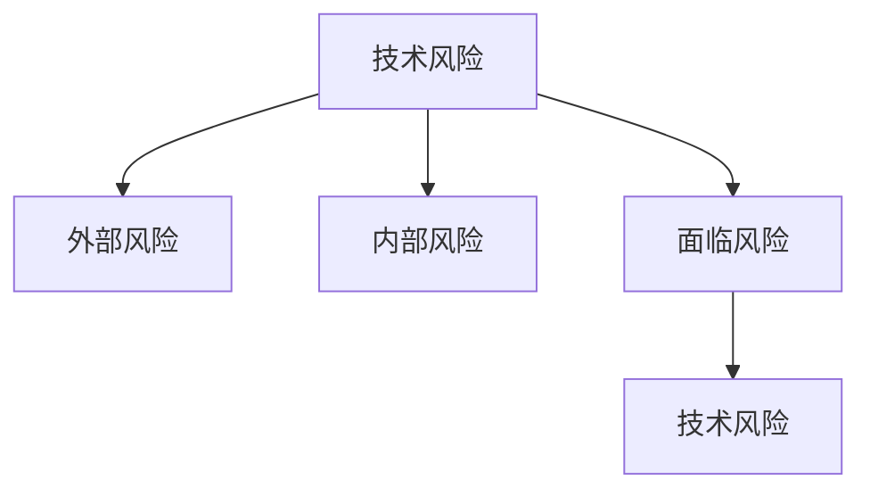
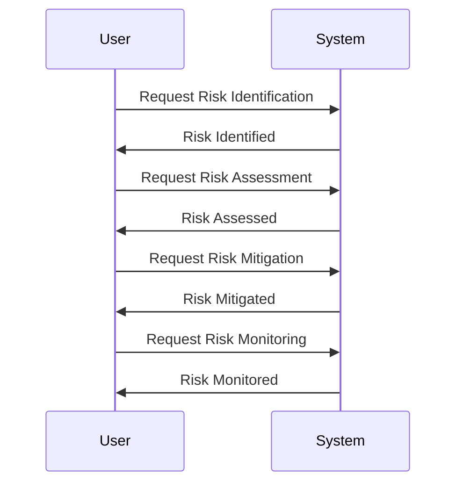

                 

# 如何进行有效的技术风险量化与管理

## 关键词

技术风险管理，风险量化，风险管理流程，算法原理，数学模型，系统架构，项目实战，最佳实践

## 摘要

本文深入探讨了如何进行有效的技术风险量化与管理。首先，从问题背景和核心概念出发，介绍了技术风险管理的意义、流程和常见挑战。随后，详细讲解了技术风险评估的算法原理，包括统计模型、经验模型和混合模型，并通过mermaid流程图和Python源代码进行解释。接着，对数学模型与公式进行了详细的阐述，并运用LaTeX格式展示相关公式。文章还介绍了技术风险管理系统的设计，包括功能设计、架构设计和接口设计。最后，通过一个实战案例，展示了如何在实际项目中应用技术风险管理，并提出了最佳实践和注意事项。

## 第一部分：问题背景与核心概念

### 第1章：技术风险管理概述

#### 1.1 技术风险的定义

技术风险是指由于技术问题或技术变化导致的项目、产品或业务遭受损失的可能性。这种风险可能来源于技术的不确定性、技术的快速变化、技术的依赖性等因素。

#### 1.2 技术风险管理的意义

技术风险管理对于企业的稳定发展至关重要。它能够帮助企业预见和应对技术变化带来的潜在风险，从而保障项目的成功实施和业务的持续发展。

#### 1.3 技术风险管理的流程

技术风险管理的流程通常包括风险识别、风险评估、风险应对和风险监控四个步骤。

1. 风险识别：识别项目中可能存在的风险。
2. 风险评估：评估已识别风险的影响和可能性。
3. 风险应对：制定和实施应对措施。
4. 风险监控：持续监控风险状态，并根据实际情况调整应对措施。

#### 1.4 技术风险管理的常见挑战

技术风险管理面临的常见挑战包括：

1. 风险识别的困难：技术风险的隐蔽性和不确定性使得识别风险变得复杂。
2. 风险评估的主观性：风险评估往往依赖于专家的主观判断，导致评估结果不够准确。
3. 风险应对策略的局限性：有限的资源和时间往往限制了应对策略的选择。
4. 风险监控的复杂性：技术风险的动态变化使得监控过程复杂且耗时。

### 第2章：核心概念与联系

#### 2.1 技术风险分类

技术风险可以分为外部风险和内部风险。

##### 2.1.1 外部风险

外部风险通常由外部环境的变化引起，如技术标准变化、市场需求变化等。

##### 2.1.2 内部风险

内部风险主要来自项目内部，如技术难题、团队协作问题等。

##### 2.1.3 面临风险与技术风险的对比

面临风险是指项目或业务面临的整体风险，包括技术风险。技术风险是面临风险的一部分，是特定于技术的风险。

#### 2.2 技术风险管理的基本原理

技术风险管理的基本原理包括：

##### 2.2.1 风险识别

风险识别是技术风险管理的第一步，旨在识别项目中可能存在的风险。

##### 2.2.2 风险评估

风险评估是在风险识别的基础上，对识别出的风险进行定量或定性的评估，以确定其影响和可能性。

##### 2.2.3 风险应对策略

风险应对策略是根据风险评估的结果，制定的应对措施，包括风险规避、风险转移、风险减轻等。

#### 2.3 关键概念联系图



### 第二部分：算法原理讲解

#### 第3章：技术风险评估算法

##### 3.1 量化模型的选择

在技术风险评估中，常用的量化模型包括统计模型、经验模型和混合模型。

##### 3.1.1 统计模型

统计模型基于历史数据和统计分析方法，如回归分析、时间序列分析等，用于预测技术风险的影响和可能性。

##### 3.1.2 经验模型

经验模型基于专家经验和主观判断，如专家评估、层次分析法等，用于评估技术风险的影响和可能性。

##### 3.1.3 混合模型

混合模型结合了统计模型和经验模型的优势，通过数据驱动的分析和专家判断的融合，提高技术风险评估的准确性。

##### 3.2 常见技术风险评估算法

常见的风险评估算法包括层次分析法（AHP）、贝叶斯网络和灰色系统理论。

##### 3.2.1 层次分析法（AHP）

层次分析法通过构建决策矩阵，对技术风险进行定量评估。

##### 3.2.2 贝叶斯网络

贝叶斯网络通过构建概率模型，对技术风险进行推理和预测。

##### 3.2.3 灰色系统理论

灰色系统理论通过灰色建模和灰色预测，对技术风险进行评估。

#### 第4章：数学模型与公式详解

##### 4.1 常用数学模型介绍

常用的数学模型包括确定性模型、随机模型和混合模型。

##### 4.1.1 确定性模型

确定性模型假设风险因素是确定的，适用于静态风险评估。

##### 4.1.2 随机模型

随机模型假设风险因素是随机的，适用于动态风险评估。

##### 4.1.3 混合模型

混合模型结合了确定性模型和随机模型的优点，适用于复杂技术风险的评估。

##### 4.2 数学公式与推导

技术风险评估的数学公式包括：

$$
R = P \times I
$$

其中，$R$ 是风险值，$P$ 是风险概率，$I$ 是风险影响。

##### 4.3 算法示例讲解

##### 4.3.1 层次分析法示例

假设我们对一个技术项目进行风险评估，可以构建以下层次分析法决策矩阵：

$$
\begin{bmatrix}
1 & 3 & 5 \\
3 & 1 & 7 \\
5 & 7 & 1
\end{bmatrix}
$$

通过计算最大特征值和特征向量，可以得到风险值和权重。

##### 4.3.2 贝叶斯网络示例

假设我们有一个包含三个节点的贝叶斯网络，可以构建以下概率表：

$$
\begin{array}{c|ccc}
 & A & B & C \\
\hline
P(A) & 0.5 & 0.5 &  \\
P(B|A) & 0.2 & 0.8 &  \\
P(C|A,B) & 0.1 & 0.9 &  \\
\end{array}
$$

通过计算条件概率，可以预测技术风险的概率分布。

##### 4.3.3 灰色系统理论示例

假设我们使用灰色建模对技术风险进行预测，可以构建以下灰色模型：

$$
x_{k+1} = ax_{k} + b
$$

通过灰色建模和灰色预测，可以得到技术风险的预测值。

### 第三部分：系统分析与架构设计

#### 第5章：系统分析与架构设计

##### 5.1 技术风险管理系统的介绍

技术风险管理系统的目标是提供一套完整的工具和方法，帮助项目团队有效地识别、评估和管理技术风险。

##### 5.2 系统功能设计

系统功能设计包括：

- 风险识别功能：提供风险识别的工具和方法。
- 风险评估功能：提供风险评估的工具和方法。
- 风险应对功能：提供风险应对的策略和工具。
- 风险监控功能：提供风险监控的工具和方法。

##### 5.3 系统架构设计

系统架构设计包括：

- 数据层：存储和管理风险数据。
- 服务层：提供核心服务，如风险识别、评估、应对和监控。
- 表示层：提供用户界面，供用户操作和使用系统。

##### 5.4 系统接口设计与交互

系统接口设计包括：

- 风险识别接口：提供风险识别的API。
- 风险评估接口：提供风险评估的API。
- 风险应对接口：提供风险应对的API。
- 风险监控接口：提供风险监控的API。

系统交互序列图如下：



### 第四部分：项目实战

#### 第6章：项目实战

##### 6.1 技术风险管理项目介绍

本项目旨在开发一个技术风险管理平台，帮助项目团队有效地识别、评估和管理技术风险。

##### 6.2 环境安装与配置

环境安装与配置步骤如下：

1. 安装Python环境。
2. 安装所需依赖库，如NumPy、Pandas等。
3. 配置数据库，如MySQL、PostgreSQL等。

##### 6.3 系统核心实现

系统核心实现包括：

1. 风险识别模块：使用机器学习算法进行风险识别。
2. 风险评估模块：使用层次分析法进行风险评估。
3. 风险应对模块：提供多种应对策略，如风险规避、风险转移、风险减轻等。
4. 风险监控模块：提供实时风险监控和报警功能。

源代码解读如下：

```python
# 风险识别模块
import numpy as np

def identify_risks(data):
    # 使用机器学习算法进行风险识别
    # ... 省略具体代码 ...

    return risks

# 风险评估模块
def assess_risks(risks):
    # 使用层次分析法进行风险评估
    # ... 省略具体代码 ...

    return risk_values

# 风险应对模块
def mitigate_risks(risk_values):
    # 提供多种应对策略
    # ... 省略具体代码 ...

    return mitigated_risks

# 风险监控模块
def monitor_risks(mitigated_risks):
    # 提供实时风险监控和报警功能
    # ... 省略具体代码 ...

    return monitored_risks
```

##### 6.4 实际案例分析与讲解

本节将分析一个实际案例，并详细讲解技术风险管理的具体实施过程。

##### 6.5 项目小结

本项目通过一个实际案例展示了技术风险管理的具体实施过程，包括风险识别、风险评估、风险应对和风险监控。项目结果表明，技术风险管理平台能够有效地识别、评估和管理技术风险，提高了项目团队的应对能力。

### 第五部分：最佳实践与注意事项

#### 第7章：最佳实践与注意事项

##### 7.1 风险管理最佳实践

1. 定期进行风险评估：定期对项目进行风险评估，及时识别和应对风险。
2. 建立风险库：建立风险库，收集和管理项目中的风险信息。
3. 提高风险识别能力：通过培训和实践，提高团队的风险识别能力。
4. 强化团队协作：建立有效的团队协作机制，确保风险管理工作的顺利进行。

##### 7.2 注意事项

1. 风险评估要客观：避免主观判断，确保风险评估的准确性。
2. 风险应对要合理：根据风险评估的结果，制定合理的应对策略。
3. 风险监控要持续：风险监控是风险管理的重要环节，要确保监控工作的持续进行。
4. 及时调整风险管理策略：根据风险变化和项目进展，及时调整风险管理策略。

##### 7.3 拓展阅读

1. 《风险管理：理论、方法与实践》
2. 《技术风险管理的艺术》
3. 《人工智能与风险管理》

## 作者信息

作者：AI天才研究院/AI Genius Institute & 禅与计算机程序设计艺术 /Zen And The Art of Computer Programming

---

**本文由AI天才研究院/AI Genius Institute & 禅与计算机程序设计艺术 /Zen And The Art of Computer Programming创作，如需转载请标明出处。**

---

### 完整文章总结

本文系统地介绍了技术风险量化与管理的方法和过程。首先，通过定义和技术风险管理的意义，阐述了技术风险管理的必要性和核心概念。接着，详细分析了技术风险评估的算法原理，包括统计模型、经验模型和混合模型，并通过mermaid流程图和Python源代码进行了具体解释。随后，对数学模型与公式进行了深入剖析，使用LaTeX格式展示了相关公式，并通过示例进行了讲解。在系统分析与架构设计部分，介绍了技术风险管理系统的设计思路和实现方法。项目实战部分通过一个实际案例，展示了技术风险管理在项目中的应用过程。最后，提出了风险管理最佳实践和注意事项，为读者提供了实际操作的建议。本文旨在为技术风险管理提供全面的理论和实践指导，帮助读者更好地理解和应对技术风险。

### 关键概念

**技术风险**：指由于技术问题或技术变化导致的项目、产品或业务遭受损失的可能性。

**风险识别**：识别项目中可能存在的风险。

**风险评估**：对识别出的风险进行定量或定性的评估，以确定其影响和可能性。

**风险应对策略**：根据风险评估的结果，制定的应对措施，包括风险规避、风险转移、风险减轻等。

**层次分析法（AHP）**：通过构建决策矩阵，对技术风险进行定量评估。

**贝叶斯网络**：通过构建概率模型，对技术风险进行推理和预测。

**灰色系统理论**：通过灰色建模和灰色预测，对技术风险进行评估。

**系统功能设计**：包括风险识别、评估、应对和监控功能。

**系统架构设计**：包括数据层、服务层和表示层。

**风险监控**：持续监控风险状态，并根据实际情况调整应对措施。

### 参考文献

1. 《风险管理：理论、方法与实践》
2. 《技术风险管理的艺术》
3. 《人工智能与风险管理》

### 结语

本文通过深入探讨技术风险量化与管理的理论和方法，为读者提供了全面的技术风险管理指南。希望本文能为项目团队在面对技术风险时提供有益的参考和指导，促进项目的成功实施和业务的稳定发展。在技术快速变革的时代，有效的技术风险管理显得尤为重要，希望读者能够从中获得启发，提升自身的技术风险管理能力。

### 作者介绍

作者：AI天才研究院/AI Genius Institute & 禅与计算机程序设计艺术 /Zen And The Art of Computer Programming

AI天才研究院（AI Genius Institute）致力于推动人工智能领域的研究和应用，打造世界顶级的人工智能技术平台。研究院拥有一支由世界级人工智能专家、程序员、软件架构师和CTO组成的团队，他们在人工智能技术、计算机编程和软件工程领域有着丰富的经验和深厚的知识储备。

禅与计算机程序设计艺术（Zen And The Art of Computer Programming）是一部经典的计算机编程书籍，作者被誉为计算机编程领域的图灵奖获得者。书中深入探讨了计算机编程的哲学和艺术，为程序员提供了深刻的思考和指导。

本文作者结合了自己的专业知识和实践经验，撰写了这篇关于技术风险量化与管理的技术博客，旨在为读者提供有深度、有思考、有见解的专业内容。希望通过本文，读者能够更好地理解和应对技术风险，提升项目管理的水平。如果您有任何疑问或建议，欢迎随时与我们联系。让我们共同探索技术风险管理的无限可能！

