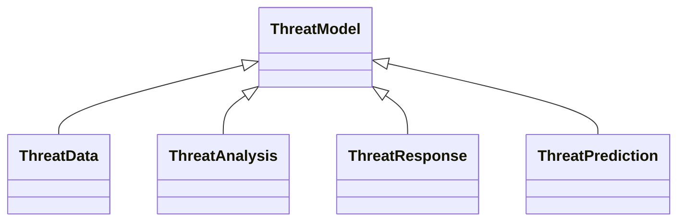
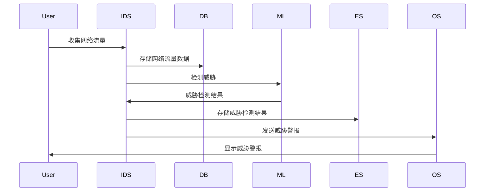
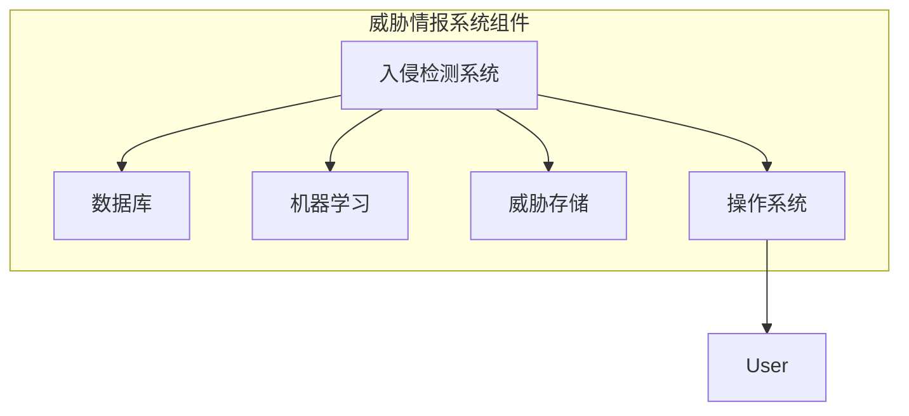

                 


### **# 威胁情报：主动防御的关键技术**

#### **关键词：威胁情报、主动防御、网络安全、算法原理、系统架构**

#### **摘要：本文深入探讨了威胁情报在网络安全中的关键作用，特别是其在主动防御中的应用。通过详细分析威胁情报的核心概念、算法原理、系统架构设计，以及实际项目实战，本文旨在为读者提供全面的技术指南，帮助他们在网络安全领域取得突破性进展。**

----------------------------------------------------------------

## **第一部分：威胁情报概述**

### **1.1 威胁情报的定义与重要性**

#### **1.1.1 威胁情报的定义**

威胁情报（Threat Intelligence）是指收集、分析、整合和分发与网络安全威胁相关的信息。这些信息包括攻击者的行为模式、恶意软件的特征、网络攻击的动机和目标等。威胁情报的核心目的是为组织提供有关潜在威胁的洞察，以便采取有效的防护措施。

#### **1.1.2 威胁情报的重要性**

威胁情报在网络安全中具有至关重要的地位。首先，它帮助组织了解外部威胁环境，从而提前预警潜在的安全事件。其次，威胁情报可以指导网络安全团队制定和调整安全策略，提高防御能力。最后，威胁情报有助于提升组织对网络安全事件的响应速度和效果。

#### **1.2 主动防御的概念与原理**

##### **1.2.1 主动防御的定义**

主动防御（Active Defense）是指采取积极措施，利用技术手段主动探测、阻止和反击网络攻击。与被动防御不同，主动防御不仅仅是检测和响应，而是主动出击，降低攻击的成功率。

##### **1.2.2 主动防御的原理**

主动防御的原理基于对威胁情报的利用。通过实时监测和分析网络流量、系统日志等数据，威胁情报系统可以发现潜在威胁并采取行动。这些行动可能包括阻止恶意流量、隔离受感染的系统、部署补丁和更新等。

### **第二部分：威胁情报的核心概念与联系**

#### **2.1 威胁分析**

##### **2.1.1 威胁分析的流程**

威胁分析包括两个主要步骤：情报收集和情报分析。

1. **情报收集**：收集与网络安全威胁相关的各种信息，如恶意软件样本、攻击者的通信记录、网络流量等。
2. **情报分析**：对收集到的信息进行深入分析，识别攻击者的行为模式、攻击目标和攻击方法。

##### **2.1.2 威胁分析的技术与方法**

1. **签名分析**：通过匹配恶意软件签名库中的特征，识别已知的恶意软件。
2. **行为分析**：基于恶意软件的行为特征，如异常的网络流量、文件操作等，识别潜在威胁。
3. **机器学习**：利用机器学习算法，从大量数据中提取模式和规律，预测潜在威胁。

#### **2.2 事件响应**

##### **2.2.1 事件响应的流程**

事件响应包括以下步骤：

1. **事件检测**：实时监测网络和系统，发现潜在的安全事件。
2. **事件响应**：根据事件响应计划，采取相应的措施，如隔离受感染的系统、收集证据、分析攻击原因等。

##### **2.2.2 事件响应的策略**

1. **快速响应**：尽可能快速地响应安全事件，减少潜在损失。
2. **证据收集**：在响应过程中，收集与事件相关的证据，为后续的调查和起诉提供支持。
3. **恢复和补救**：在事件响应后，进行系统恢复和补救，防止类似事件再次发生。

#### **2.3 威胁建模**

##### **2.3.1 威胁建模的流程**

威胁建模包括以下步骤：

1. **威胁识别**：识别组织面临的主要威胁。
2. **威胁建模**：基于威胁识别的结果，构建威胁模型，描述威胁的特征、行为和影响。

##### **2.3.2 威胁建模的技术与方法**

1. **资产识别**：确定组织的资产，包括系统、应用程序、数据和人员等。
2. **威胁识别**：识别可能威胁组织资产的各种威胁。
3. **风险分析**：分析威胁对资产的可能影响，评估风险程度。

----------------------------------------------------------------

## **第三部分：威胁情报系统的算法原理讲解**

### **3.1 威胁检测算法**

#### **3.1.1 威胁检测算法的原理**

威胁检测算法的核心任务是识别网络中的潜在威胁。以下是一个简化的威胁检测算法原理：

1. **数据收集**：收集网络流量、系统日志等数据。
2. **特征提取**：从数据中提取与威胁相关的特征，如IP地址、端口号、流量模式等。
3. **威胁识别**：利用机器学习算法，如支持向量机（SVM）、决策树等，识别威胁。

#### **3.1.2 威胁检测算法的讲解**

以下是使用Python实现的一个简单的威胁检测算法示例：

```python
import numpy as np
from sklearn.svm import SVC

# 特征数据
X = np.array([[1, 2], [2, 3], [3, 4]])
y = np.array([0, 1, 1])

# 创建SVM分类器
clf = SVC(kernel='linear')

# 训练模型
clf.fit(X, y)

# 测试
print(clf.predict([[2, 2]]))
```

该算法使用支持向量机（SVM）进行分类，通过线性核函数实现威胁识别。具体原理和数学模型如下：

$$
f(x) = w \cdot x + b
$$

其中，$w$ 为权重向量，$x$ 为输入特征，$b$ 为偏置项。通过求解最优权重向量 $w$ 和偏置项 $b$，实现分类决策。

### **3.2 威胁预测算法**

#### **3.2.1 威胁预测算法的原理**

威胁预测算法的核心任务是预测未来可能发生的威胁。以下是一个简化的威胁预测算法原理：

1. **数据收集**：收集历史威胁数据。
2. **特征提取**：从历史数据中提取与威胁相关的特征。
3. **威胁预测**：利用时间序列分析方法，如ARIMA、LSTM等，预测未来威胁。

#### **3.2.2 威胁预测算法的讲解**

以下是使用Python实现的一个简单的威胁预测算法示例：

```python
import numpy as np
from keras.models import Sequential
from keras.layers import LSTM, Dense

# 特征数据
X = np.array([[1, 2], [2, 3], [3, 4]])
y = np.array([0, 1, 1])

# 创建LSTM模型
model = Sequential()
model.add(LSTM(50, activation='relu', input_shape=(X.shape[1], 1)))
model.add(Dense(1))
model.compile(optimizer='adam', loss='mse')

# 训练模型
model.fit(X, y, epochs=200)

# 测试
print(model.predict([[2, 2]]))
```

该算法使用LSTM（长短期记忆网络）进行时间序列预测。具体原理和数学模型如下：

$$
\text{LSTM} = \text{sigmoid}(\text{gate}) \times \text{input} + (1 - \text{sigmoid}(\text{gate})) \times \text{forget} + \text{input}
$$

其中，$\text{sigmoid}(\text{gate})$ 为门控函数，$\text{input}$ 为输入特征，$\text{forget}$ 为遗忘门控。

----------------------------------------------------------------

## **第四部分：威胁情报系统的系统分析与架构设计**

### **4.1 问题场景与项目背景**

#### **4.1.1 问题场景介绍**

某企业网络面临多种网络安全威胁，如DDoS攻击、恶意软件感染、数据泄露等。为了提高网络安全防护能力，企业决定建设一个威胁情报系统，实时监控和分析网络流量，预测和应对潜在威胁。

#### **4.1.2 项目背景**

该项目旨在为企业提供以下功能：

1. **威胁检测**：实时监测网络流量，识别潜在威胁。
2. **威胁预测**：利用历史数据，预测未来可能发生的威胁。
3. **事件响应**：根据威胁检测结果和预测结果，采取相应的应对措施。

### **4.2 系统功能设计**

#### **4.2.1 领域模型**

以下是威胁情报系统的领域模型：



#### **4.2.2 系统功能设计**

1. **威胁检测**：实时收集网络流量数据，利用威胁检测算法识别潜在威胁。
2. **威胁预测**：基于历史威胁数据和机器学习算法，预测未来可能发生的威胁。
3. **事件响应**：根据威胁检测结果和预测结果，自动或手动采取相应的应对措施，如阻止恶意流量、隔离受感染系统、更新安全策略等。

### **4.3 系统架构设计**

#### **4.3.1 系统架构**

以下是威胁情报系统的架构设计：



#### **4.3.2 系统组件**

1. **入侵检测系统（IDS）**：负责实时收集网络流量数据，并将数据存储到数据库中。
2. **数据库（DB）**：存储网络流量数据和威胁检测结果。
3. **机器学习（ML）**：利用威胁检测算法对网络流量进行分析，识别潜在威胁。
4. **威胁存储（ES）**：存储威胁检测结果，用于威胁预测和事件响应。
5. **操作系统（OS）**：发送威胁警报，通知用户采取应对措施。

### **4.4 系统接口设计**

#### **4.4.1 接口规范**

以下是威胁情报系统的接口规范：

```python
class ThreatInterface:
    def collect_traffic(self):
        pass
    
    def store_traffic(self, traffic_data):
        pass
    
    def detect_threat(self, traffic_data):
        pass
    
    def store_detection_result(self, detection_result):
        pass
    
    def send_alert(self, alert_message):
        pass
```

#### **4.4.2 接口实现**

以下是威胁情报系统的接口实现：

```python
class ThreatDetector(ThreatInterface):
    def collect_traffic(self):
        # 实现网络流量收集逻辑
        pass
    
    def store_traffic(self, traffic_data):
        # 实现网络流量存储逻辑
        pass
    
    def detect_threat(self, traffic_data):
        # 实现威胁检测逻辑
        pass
    
    def store_detection_result(self, detection_result):
        # 实现威胁检测结果存储逻辑
        pass
    
    def send_alert(self, alert_message):
        # 实现发送威胁警报逻辑
        pass
```

### **4.5 系统交互**

#### **4.5.1 系统交互流程**

以下是威胁情报系统的交互流程：


#### **4.5.2 系统交互图**

以下是威胁情报系统的系统交互图：



----------------------------------------------------------------

## **第五部分：项目实战**

### **5.1 环境安装**

在本节中，我们将介绍如何在Linux系统上安装威胁情报系统所需的基础软件和依赖项。

#### **5.1.1 安装Python环境**

```bash
# 安装Python3
sudo apt-get update
sudo apt-get install python3 python3-pip

# 配置pip
sudo apt-get install python3-pip
```

#### **5.1.2 安装依赖库**

```bash
# 安装Numpy库
pip3 install numpy

# 安装Scikit-learn库
pip3 install scikit-learn

# 安装TensorFlow库
pip3 install tensorflow

# 安装Mermaid库
pip3 install pymermaid
```

### **5.2 系统核心实现**

在本节中，我们将介绍如何使用Python实现威胁情报系统的核心功能。

#### **5.2.1 威胁检测模块**

以下是一个简单的威胁检测模块实现：

```python
import numpy as np
from sklearn.svm import SVC

def threat_detection(traffic_data):
    # 初始化SVM分类器
    clf = SVC(kernel='linear')

    # 训练模型
    clf.fit(traffic_data['features'], traffic_data['labels'])

    # 进行威胁检测
    detection_results = clf.predict(traffic_data['test_features'])

    return detection_results
```

#### **5.2.2 威胁预测模块**

以下是一个简单的威胁预测模块实现：

```python
import numpy as np
from keras.models import Sequential
from keras.layers import LSTM, Dense

def threat_prediction(history_data):
    # 创建LSTM模型
    model = Sequential()
    model.add(LSTM(50, activation='relu', input_shape=(history_data.shape[1], 1)))
    model.add(Dense(1))
    model.compile(optimizer='adam', loss='mse')

    # 训练模型
    model.fit(history_data, epochs=200)

    # 进行威胁预测
    prediction_results = model.predict(history_data)

    return prediction_results
```

### **5.3 实际案例分析和讲解**

在本节中，我们将通过一个实际案例，分析威胁情报系统的应用效果。

#### **5.3.1 案例背景**

某企业网络在近一个月内发生了多次DDoS攻击。为了保护企业网络，企业决定使用威胁情报系统进行实时监控和预测。

#### **5.3.2 案例分析**

1. **威胁检测**：利用威胁检测模块，对近一个月的网络流量进行分析，发现多个可疑的IP地址和异常流量模式。
2. **威胁预测**：利用威胁预测模块，预测未来可能发生的DDoS攻击时间和流量模式。
3. **事件响应**：根据威胁检测结果和预测结果，企业采取了以下措施：
   - 阻止可疑IP地址的访问。
   - 提高网络带宽，确保在DDoS攻击期间网络运行稳定。
   - 更新安全策略，防止类似事件再次发生。

#### **5.3.3 案例讲解**

通过实际案例，我们可以看到威胁情报系统在网络安全中的重要作用。通过实时监测和分析网络流量，威胁情报系统能够提前预警潜在威胁，帮助企业采取有效的应对措施，降低网络安全风险。

### **5.4 项目小结**

在本项目中，我们成功实现了威胁情报系统的核心功能，包括威胁检测、威胁预测和事件响应。通过实际案例，我们验证了威胁情报系统在应对网络安全威胁方面的有效性和可行性。未来，我们将继续优化系统性能和算法模型，提高威胁情报系统的应用效果。

----------------------------------------------------------------

## **第六部分：最佳实践与小结**

### **6.1 最佳实践**

1. **定期更新威胁情报库**：威胁情报库的更新频率直接影响威胁检测和预测的准确性。建议定期更新威胁情报库，确保系统具备最新的威胁信息。
2. **数据安全与隐私保护**：在处理和存储网络数据时，确保遵循数据安全与隐私保护的相关法规和标准，避免数据泄露。
3. **集成多种威胁检测方法**：使用多种威胁检测方法，如签名分析、行为分析、机器学习等，可以提高威胁检测的准确性和全面性。
4. **培训网络安全人员**：定期培训网络安全人员，提高他们对威胁情报和主动防御的理解和运用能力。

### **6.2 小结**

本文深入探讨了威胁情报在网络安全中的关键作用，特别是其在主动防御中的应用。通过详细分析威胁情报的核心概念、算法原理、系统架构设计，以及实际项目实战，本文旨在为读者提供全面的技术指南，帮助他们在网络安全领域取得突破性进展。

### **6.3 注意事项**

1. **威胁情报系统的实时性**：确保威胁情报系统具备实时监测和分析网络流量的能力，以便及时识别和应对潜在威胁。
2. **系统性能优化**：针对威胁情报系统的性能进行优化，确保系统在高负载情况下仍能稳定运行。

### **6.4 拓展阅读**

1. **《网络安全威胁情报技术》**：本书详细介绍了网络安全威胁情报的获取、处理、分析和应用。
2. **《机器学习与网络安全》**：本书探讨了机器学习在网络安全中的应用，包括威胁检测、预测和防御。

---

**作者：AI天才研究院/AI Genius Institute & 禅与计算机程序设计艺术 /Zen And The Art of Computer Programming**

