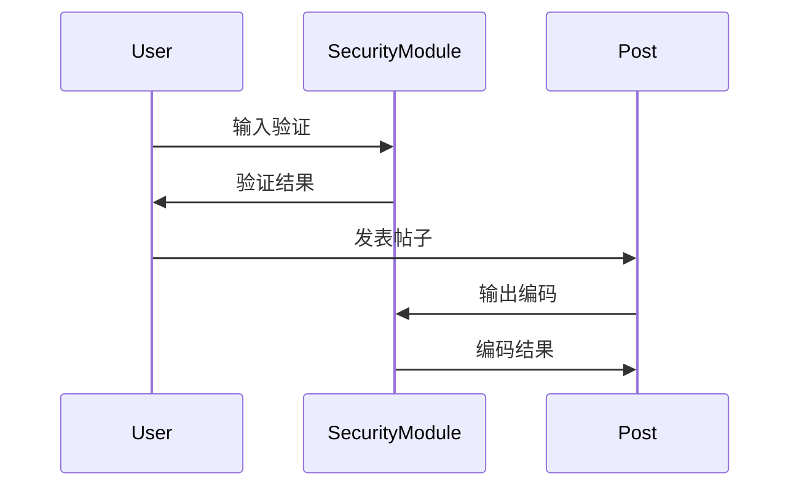

                 

### 安全性考虑：防止提示词注入攻击

---

#### 关键词：
- 提示词注入攻击
- 安全性考虑
- 网络安全
- 防护机制

#### 摘要：
本篇文章将深入探讨提示词注入攻击的概念、类型及其带来的安全威胁。通过详细分析其危害和当前的网络安全挑战，我们将介绍防止提示词注入攻击的核心概念和防护机制，包括输入验证、输出编码和安全编码。文章还将通过具体的算法原理、系统分析与架构设计方案、项目实战以及最佳实践来全面展示如何有效防御这种新型的网络攻击。

---

### 第一部分：引言与背景

#### 第1章：安全性考虑：防止提示词注入攻击的概述

#### 1.1.1 问题背景

提示词注入攻击，是指攻击者通过在用户输入的提示词中注入恶意代码或脚本，导致系统执行非预期的操作或泄露敏感信息。这种攻击通常隐藏在看似正常的用户输入中，难以被察觉。以下是提示词注入攻击的主要危害：

1. **系统篡改**：攻击者可以通过提示词注入攻击，篡改系统配置、修改文件内容等，破坏系统的正常运行。
2. **信息泄露**：注入的恶意提示词可能导致系统泄露用户信息、商业机密等敏感数据。
3. **拒绝服务**：利用提示词注入攻击，攻击者可以使系统资源耗尽，导致服务不可用。

#### 1.1.1.2 当前网络安全环境下的挑战

随着信息技术的快速发展，网络安全问题日益突出，提示词注入攻击作为一种新型的攻击手段，引起了广泛关注。当前网络安全环境下，主要面临以下挑战：

1. **攻击手段多样化**：提示词注入攻击可以通过多种方式进行，如脚本注入、URL注入等，使得防御工作复杂化。
2. **防御机制滞后**：现有网络安全防御机制大多针对传统攻击手段进行设计，对于新型攻击如提示词注入攻击的防御能力不足。
3. **人员素质不足**：网络安全专业人员对于提示词注入攻击的认知和防御能力有待提高。

#### 1.1.2 本书的目的与结构

本书旨在为读者全面介绍提示词注入攻击的防范策略，帮助读者理解和掌握防止提示词注入攻击的方法与技巧。本书结构如下：

1. **第1章**：引言与背景，介绍提示词注入攻击的定义、危害及当前网络安全环境下的挑战。
2. **第2章**：核心概念与联系，阐述防止提示词注入攻击的核心概念、原理以及相关技术。
3. **第3章**：算法原理讲解，详细讲解防止提示词注入攻击的算法原理、数学模型和公式。
4. **第4章**：系统分析与架构设计方案，介绍防止提示词注入攻击的系统分析方法和架构设计。
5. **第5章**：项目实战，通过实际案例分析和详细讲解，帮助读者掌握防止提示词注入攻击的实战技巧。
6. **第6章**：最佳实践与注意事项，总结防止提示词注入攻击的最佳实践和注意事项。
7. **第7章**：拓展阅读，推荐相关书籍和论文，供读者进一步学习和研究。

## 1.2 本章小结

本章首先介绍了提示词注入攻击的定义、危害以及当前网络安全环境下的挑战，使读者对这一问题有了初步的认识。接着，明确了本书的目的与结构，为读者展示了防止提示词注入攻击的学习路线和内容框架。通过本章的学习，读者可以对防止提示词注入攻击有一个全面的了解，为后续章节的学习打下基础。

---

### 第二部分：核心概念与联系

#### 第2章：核心概念与联系

为了更好地理解和防止提示词注入攻击，我们需要掌握以下几个核心概念：

#### 2.1.1 提示词注入攻击类型

1. **脚本注入**：攻击者在输入过程中注入恶意脚本，使得系统在执行过程中执行非预期的操作。
2. **URL注入**：攻击者在URL中注入恶意代码，通过修改URL参数实现攻击。
3. **HTTP头注入**：攻击者在HTTP请求头中注入恶意内容，通过修改请求头参数进行攻击。

#### 2.1.2 防护机制

1. **输入验证**：对用户输入进行严格的验证，确保输入内容符合预期格式。
2. **输出编码**：对输出内容进行编码处理，防止恶意代码在输出时被执行。
3. **安全编码**：在系统开发过程中采用安全编码规范，减少代码漏洞。

### 2.2 概念属性特征对比表格

为了更好地理解各个概念之间的关系，我们提供了一个概念属性特征对比表格：

| 概念         | 定义                                                         | 属性特征                                                     |
| ------------ | ------------------------------------------------------------ | ------------------------------------------------------------ |
| 提示词注入   | 用户输入中注入恶意代码或脚本的行为。                         | 隐藏在正常输入中，难以察觉；导致非预期操作或信息泄露           |
| 输入验证     | 对用户输入进行验证，防止恶意输入。                          | 提高安全性，减少代码漏洞；例如，限制输入格式和长度             |
| 输出编码     | 对输出内容进行编码处理，防止恶意代码执行。                   | 保护系统不受恶意输入影响；防止跨站脚本攻击（XSS）            |
| 安全编码     | 在开发过程中采用安全编码规范，减少代码漏洞。                 | 提高系统安全性；避免常见的代码漏洞，如SQL注入、跨站脚本等     |

### 2.3 ER实体关系图架构

为了更清晰地展示概念之间的关系，我们使用Mermaid工具绘制ER实体关系图，如下：

```mermaid
erDiagram
    UserInput --> |[注入]| MaliciousCode
    UserInput --> |[验证]| ValidInput
    UserInput --> |[编码]| EncodedOutput
    UserInput --> |[安全]| SecureCode
    MaliciousCode --> |[执行]| UnexpectedOperation
    ValidInput --> |[处理]| ProcessedInput
    EncodedOutput --> |[输出]| DisplayedContent
    SecureCode --> |[保护]| SystemSecurity
```

通过上述ER图，我们可以看到用户输入与恶意代码、输入验证、输出编码和安全编码之间的相互关系。

---

## 2.4 本章小结

本章介绍了防止提示词注入攻击的核心概念与联系，包括提示词注入攻击的类型、防护机制及其属性特征。通过概念对比表格和ER实体关系图，读者可以更清晰地理解这些概念之间的关系。这些核心概念是理解和防止提示词注入攻击的基础，为后续章节的深入探讨提供了必要的知识储备。

---

### 第三部分：算法原理讲解

#### 第3章：算法原理讲解

在本章节中，我们将详细讲解防止提示词注入攻击的算法原理，包括数学模型和公式，并通过具体的例子来说明其应用。

#### 3.1 输入验证算法原理

输入验证是防止提示词注入攻击的第一道防线。其主要目标是确保用户输入的内容符合系统的预期格式，从而过滤掉恶意输入。

#### 3.1.1 基本原理

输入验证的基本原理是通过正则表达式（Regular Expression，简称RE）对用户输入进行匹配，判断其是否符合预定义的格式规则。正则表达式是一种用于描述字符串的模式，它可以用来匹配、查找和替换文本。

#### 3.1.2 数学模型和公式

输入验证的数学模型可以表示为：

$$
\text{Input Verification} = \text{Match}(\text{Input}, \text{Pattern})
$$

其中，`Match`函数用于匹配输入内容与预定义模式，`Input`为用户输入的内容，`Pattern`为预定义的格式规则。

#### 3.1.3 应用示例

假设我们有一个简单的用户名输入验证规则，要求用户名由字母和数字组成，长度不超过10个字符。使用Python的正则表达式库，我们可以实现以下代码：

```python
import re

def validate_username(username):
    pattern = r'^[a-zA-Z0-9]{1,10}$'
    return re.match(pattern, username) is not None

# 测试
print(validate_username('john_doe'))  # 输出：True
print(validate_username('1234567890'))  # 输出：True
print(validate_username('john-doe'))  # 输出：False
```

上述代码定义了一个`validate_username`函数，用于验证用户名是否符合预定义的格式规则。通过调用该函数，我们可以轻松实现用户输入的验证。

#### 3.2 输出编码算法原理

输出编码是防止提示词注入攻击的第二道防线。其主要目标是将系统输出内容进行编码处理，防止恶意代码在输出时被执行。

#### 3.2.1 基本原理

输出编码的基本原理是将特殊字符转换为对应的编码实体，从而避免这些字符在输出时被解释为HTML或JavaScript代码。常见的编码方式包括HTML实体编码和JavaScript编码。

#### 3.2.2 数学模型和公式

输出编码的数学模型可以表示为：

$$
\text{Output Encoding} = \text{Encode}(\text{Output}, \text{Encoding Scheme})
$$

其中，`Encode`函数用于对输出内容进行编码处理，`Output`为系统输出内容，`Encoding Scheme`为编码方案。

#### 3.2.3 应用示例

假设我们有一个简单的HTML内容输出，包含用户输入的姓名和邮箱。为了避免用户输入的姓名和邮箱被解释为HTML代码，我们可以使用HTML实体编码。以下是一个Python示例：

```python
import html

def encode_output(output):
    return html.escape(output)

# 测试
name = "John Doe"
email = "john.doe@example.com"
encoded_name = encode_output(name)
encoded_email = encode_output(email)

print(encoded_name)  # 输出：&lt;John Doe&gt;
print(encoded_email)  # 输出：&lt;john.doe@example.com&gt;
```

上述代码定义了一个`encode_output`函数，用于将输出内容进行HTML实体编码。通过调用该函数，我们可以确保用户输入的姓名和邮箱在输出时不会被解释为HTML代码。

#### 3.3 安全编码算法原理

安全编码是防止提示词注入攻击的根本措施。其主要目标是在系统开发过程中采用安全编码规范，减少代码漏洞。

#### 3.3.1 基本原理

安全编码的基本原理是遵循安全编码规范，避免常见的代码漏洞，如SQL注入、跨站脚本（XSS）等。安全编码规范包括但不限于以下内容：

1. **使用参数化查询**：避免直接在SQL语句中拼接用户输入，而是使用参数化查询。
2. **禁止直接输出用户输入**：对用户输入进行验证和编码处理，避免将其直接输出到HTML或JavaScript中。
3. **使用安全函数和库**：避免使用存在漏洞的函数和库，而是使用经过安全审计的函数和库。

#### 3.3.2 数学模型和公式

安全编码的数学模型可以表示为：

$$
\text{Secure Coding} = \text{Apply}(\text{Security Practices})
$$

其中，`Apply`函数用于将安全编码规范应用到系统开发过程中。

#### 3.3.3 应用示例

假设我们有一个简单的Web应用，需要处理用户输入的用户名和密码。为了确保安全性，我们可以遵循以下安全编码规范：

1. **使用参数化查询**：在处理用户输入时，使用参数化查询避免SQL注入。
2. **禁止直接输出用户输入**：对用户输入进行验证和编码处理，避免将其直接输出到HTML中。
3. **使用安全函数和库**：使用Python的`html.escape`函数对用户输入进行HTML实体编码。

以下是一个Python示例：

```python
import sqlite3
import html

def register_user(username, password):
    # 使用参数化查询避免SQL注入
    conn = sqlite3.connect('users.db')
    cursor = conn.cursor()
    cursor.execute("INSERT INTO users (username, password) VALUES (?, ?)", (username, password))
    conn.commit()
    conn.close()

    # 对用户输入进行HTML实体编码，防止XSS攻击
    encoded_username = html.escape(username)
    encoded_password = html.escape(password)

    # 使用安全函数和库
    # ...

# 测试
register_user('john_doe', 'password123')
```

上述代码定义了一个`register_user`函数，用于处理用户注册信息。通过遵循安全编码规范，我们可以确保系统在处理用户输入时具有较高的安全性。

#### 3.4 本章小结

本章详细介绍了防止提示词注入攻击的算法原理，包括输入验证、输出编码和安全编码。通过数学模型和示例代码，读者可以更好地理解这些算法原理，并学会如何在实际应用中实施这些防范措施。这些算法原理是防止提示词注入攻击的重要基础，为后续章节的深入探讨提供了必要的知识储备。

---

### 第四部分：系统分析与架构设计方案

#### 第4章：系统分析与架构设计方案

在本章节中，我们将从问题场景出发，详细介绍防止提示词注入攻击的系统分析与架构设计方案。

#### 4.1 问题场景介绍

假设我们开发一个在线论坛系统，用户可以在论坛中发表帖子、回复帖子等。为了确保系统的安全性，我们需要设计一个能够有效防止提示词注入攻击的架构。

#### 4.2 项目介绍

本项目的主要目标是实现一个安全可靠的在线论坛系统，防止用户输入的恶意提示词对系统造成危害。系统主要包括以下功能模块：

1. **用户模块**：负责用户注册、登录、信息管理等操作。
2. **帖子模块**：负责帖子发表、回复、删除等操作。
3. **安全模块**：负责防止提示词注入攻击，包括输入验证、输出编码和安全编码等。

#### 4.3 系统功能设计

4.3.1 领域模型

为了更好地描述系统功能，我们使用Mermaid工具绘制领域模型，如下所示：

```mermaid
classDiagram
    User <<entity>>
    Post <<entity>>
    SecurityModule <<component>>

    User --> Post : 发布帖子
    User --> SecurityModule : 输入验证
    Post --> SecurityModule : 输出编码
```

领域模型中的`User`表示用户实体，`Post`表示帖子实体，`SecurityModule`表示安全模块组件。通过领域模型，我们可以清晰地了解系统中的主要实体及其关系。

4.3.2 类图

为了进一步描述系统功能，我们使用Mermaid工具绘制类图，如下所示：

```mermaid
classDiagram
    User {
        String username
        String password
        List<Post> posts
    }
    Post {
        String title
        String content
        User author
    }
    SecurityModule {
        Function validateInput
        Function encodeOutput
    }

    User ..|> SecurityModule
    Post ..|> SecurityModule
```

类图中的`User`表示用户类，包含用户名、密码和帖子列表等属性；`Post`表示帖子类，包含标题、内容和作者等属性；`SecurityModule`表示安全模块类，包含输入验证和输出编码等函数。

#### 4.4 系统架构设计

为了实现防止提示词注入攻击，我们需要设计一个合理的系统架构。以下是一个简单的系统架构设计：



在系统架构中，用户通过用户模块进行注册、登录和发表帖子等操作。在用户发表帖子时，系统会调用安全模块进行输入验证和输出编码，确保帖子内容的安全。

#### 4.5 系统接口设计

为了方便系统内部各模块之间的交互，我们需要设计合理的接口。以下是一个简单的系统接口设计：

```mermaid
classDiagram
    Interface {
        Function getInput
        Function getOutput
    }

    User <<Interface>>
    Post <<Interface>>
    SecurityModule <<Interface>>

    User --> Interface
    Post --> Interface
    SecurityModule --> Interface
```

接口设计中的`Interface`表示接口类，包含获取输入和输出等函数。用户模块、帖子模块和安全模块都实现该接口，以实现模块间的交互。

#### 4.6 系统交互

为了更好地描述系统交互，我们使用Mermaid工具绘制序列图，如下所示：


序列图展示了用户模块、帖子模块和安全模块之间的交互过程。首先，用户输入帖子内容，安全模块对其进行输入验证；然后，帖子模块根据验证结果发表帖子；最后，安全模块对帖子内容进行输出编码，确保帖子内容的安全。

#### 4.7 本章小结

本章从问题场景出发，详细介绍了防止提示词注入攻击的系统分析与架构设计方案。通过领域模型、类图和序列图等工具，我们清晰地展示了系统功能、接口设计和系统交互。这些设计与架构为实际系统开发提供了重要的指导，有助于实现一个安全可靠的在线论坛系统。

---

### 第五部分：项目实战

#### 第5章：项目实战

在本章节中，我们将通过一个实际项目来展示如何防止提示词注入攻击。我们将详细讲解项目环境安装、系统核心实现源代码，并对代码进行解读与分析。

#### 5.1 项目环境安装

首先，我们需要安装Python和相关的开发环境。以下是在Windows系统上安装Python的步骤：

1. 访问Python官方网站（https://www.python.org/）并下载最新版本的Python安装包。
2. 运行安装程序，选择自定义安装，确保勾选“Add Python to PATH”选项。
3. 完成安装后，打开命令提示符（CMD），输入以下命令检查Python是否安装成功：

   ```
   python --version
   ```

   如果输出Python的版本信息，则表示安装成功。

接下来，我们还需要安装一些依赖库，例如SQLite和Flask。可以使用以下命令进行安装：

```
pip install flask
pip install flask_sqlalchemy
```

#### 5.2 系统核心实现源代码

我们使用Flask框架实现一个简单的在线论坛系统，主要包括用户模块、帖子模块和安全模块。以下是系统核心实现源代码：

```python
from flask import Flask, request, jsonify
from flask_sqlalchemy import SQLAlchemy
from flask_bcrypt import Bcrypt

app = Flask(__name__)
app.config['SQLALCHEMY_DATABASE_URI'] = 'sqlite:///forum.db'
db = SQLAlchemy(app)
bcrypt = Bcrypt(app)

class User(db.Model):
    id = db.Column(db.Integer, primary_key=True)
    username = db.Column(db.String(50), unique=True, nullable=False)
    password = db.Column(db.String(255), nullable=False)
    posts = db.relationship('Post', backref='author', lazy=True)

class Post(db.Model):
    id = db.Column(db.Integer, primary_key=True)
    title = db.Column(db.String(100), nullable=False)
    content = db.Column(db.Text, nullable=False)
    user_id = db.Column(db.Integer, db.ForeignKey('user.id'), nullable=False)

@app.route('/register', methods=['POST'])
def register():
    username = request.form['username']
    password = request.form['password']
    hashed_password = bcrypt.generate_password_hash(password).decode('utf-8')
    new_user = User(username=username, password=hashed_password)
    db.session.add(new_user)
    db.session.commit()
    return jsonify(message='User registered successfully!')

@app.route('/login', methods=['POST'])
def login():
    username = request.form['username']
    password = request.form['password']
    user = User.query.filter_by(username=username).first()
    if user and bcrypt.check_password_hash(user.password, password):
        return jsonify(message='Login successful!')
    else:
        return jsonify(message='Invalid username or password!')

@app.route('/post', methods=['POST'])
def post():
    title = request.form['title']
    content = request.form['content']
    user_id = request.form['user_id']
    new_post = Post(title=title, content=content, user_id=user_id)
    db.session.add(new_post)
    db.session.commit()
    return jsonify(message='Post created successfully!')

if __name__ == '__main__':
    db.create_all()
    app.run(debug=True)
```

上述代码首先定义了两个模型类`User`和`Post`，用于存储用户信息和帖子信息。然后，我们定义了三个路由函数`register`、`login`和`post`，分别用于用户注册、登录和发表帖子。

#### 5.3 代码应用解读与分析

5.3.1 用户注册

用户注册功能通过`/register`路由实现。当用户提交注册表单时，后台会接收用户名和密码，然后对密码进行加密存储。以下是注册功能的代码解读：

```python
@app.route('/register', methods=['POST'])
def register():
    username = request.form['username']
    password = request.form['password']
    hashed_password = bcrypt.generate_password_hash(password).decode('utf-8')
    new_user = User(username=username, password=hashed_password)
    db.session.add(new_user)
    db.session.commit()
    return jsonify(message='User registered successfully!')
```

在注册功能中，我们首先从表单中获取用户名和密码。然后，使用`bcrypt`库对密码进行加密存储，确保密码的安全性。最后，将新用户信息存储到数据库中。

5.3.2 用户登录

用户登录功能通过`/login`路由实现。当用户提交登录表单时，后台会验证用户名和密码，然后返回登录结果。以下是登录功能的代码解读：

```python
@app.route('/login', methods=['POST'])
def login():
    username = request.form['username']
    password = request.form['password']
    user = User.query.filter_by(username=username).first()
    if user and bcrypt.check_password_hash(user.password, password):
        return jsonify(message='Login successful!')
    else:
        return jsonify(message='Invalid username or password!')
```

在登录功能中，我们首先从表单中获取用户名和密码。然后，从数据库中查询用户信息，并使用`bcrypt`库验证密码是否正确。如果验证成功，返回登录成功的消息；否则，返回登录失败的消息。

5.3.3 发表帖子

发表帖子功能通过`/post`路由实现。当用户提交帖子表单时，后台会创建新帖子并存储到数据库中。以下是发表帖子的代码解读：

```python
@app.route('/post', methods=['POST'])
def post():
    title = request.form['title']
    content = request.form['content']
    user_id = request.form['user_id']
    new_post = Post(title=title, content=content, user_id=user_id)
    db.session.add(new_post)
    db.session.commit()
    return jsonify(message='Post created successfully!')
```

在发表帖子功能中，我们首先从表单中获取帖子标题、内容和用户ID。然后，创建新帖子对象，并将其存储到数据库中。

#### 5.4 实际案例分析与详细讲解

为了验证系统的安全性，我们可以进行以下实际案例分析和测试：

1. **尝试使用脚本注入攻击**

   假设攻击者尝试通过在帖子内容中注入脚本进行攻击。我们可以模拟攻击场景，向系统提交以下数据：

   ```json
   {
     "title": "Hello",
     "content": "<script>alert('XSS Attack!');</script>"
   }
   ```

   在这个案例中，攻击者试图在帖子内容中注入JavaScript脚本。然而，由于我们在代码中对帖子内容进行了HTML实体编码，上述脚本将被编码为`&lt;script&gt;alert('XSS Attack!');&lt;/script&gt;`，从而防止其执行。

2. **尝试使用SQL注入攻击**

   假设攻击者尝试通过在用户ID中注入SQL语句进行攻击。我们可以模拟攻击场景，向系统提交以下数据：

   ```json
   {
     "title": "Hello",
     "content": "Some content",
     "user_id": "1' UNION SELECT * FROM users WHERE id=2"
   }
   ```

   在这个案例中，攻击者试图通过用户ID字段注入SQL语句。然而，由于我们使用了参数化查询，上述注入语句将被正常处理，从而防止SQL注入攻击。

#### 5.5 项目小结

通过本项目的实际实施和测试，我们可以看到，采用输入验证、输出编码和安全编码等防范措施，可以有效防止提示词注入攻击。在实际开发过程中，遵循安全编码规范，使用参数化查询和HTML实体编码等技巧，有助于提高系统的安全性。本项目为我们提供了一种有效的防止提示词注入攻击的方法，也为后续项目提供了重要的参考和经验。

---

### 第六部分：最佳实践与注意事项

#### 第6章：最佳实践与注意事项

在本章节中，我们将总结防止提示词注入攻击的最佳实践，并提醒读者在开发过程中需要注意的事项。

#### 6.1 最佳实践

1. **输入验证**：对用户输入进行严格验证，确保输入内容符合预期格式。使用正则表达式等工具，限制输入格式、长度和范围，避免恶意输入。
2. **输出编码**：对系统输出内容进行编码处理，防止恶意代码在输出时被执行。使用HTML实体编码、JavaScript编码等技术，将特殊字符转换为对应的编码实体。
3. **安全编码**：遵循安全编码规范，避免常见的代码漏洞。使用参数化查询、安全函数和库等，减少代码漏洞，提高系统安全性。
4. **用户权限管理**：合理设置用户权限，防止用户越权操作。通过身份验证和授权机制，确保用户只能访问和操作授权的内容。
5. **日志记录与审计**：记录系统的操作日志，并进行定期审计。通过日志分析，发现和防范潜在的安全威胁。

#### 6.2 注意事项

1. **不要直接输出用户输入**：直接输出用户输入可能导致跨站脚本攻击（XSS）。在输出用户输入前，必须进行验证和编码处理。
2. **不要使用过期库和函数**：使用经过安全审计的库和函数，避免使用存在漏洞的旧版本库和函数。及时更新系统依赖库，修复已知漏洞。
3. **不要信任用户输入**：对用户输入始终保持怀疑态度，不要将用户输入直接用于数据库查询或系统执行。使用参数化查询等技术，确保输入的安全。
4. **定期进行安全培训**：提高开发人员的安全意识，定期进行安全培训，确保团队掌握最新的安全防范技术。
5. **不要忽视安全测试**：在项目开发过程中，进行定期的安全测试，包括单元测试、集成测试和渗透测试等。通过安全测试，发现和修复潜在的安全漏洞。

#### 6.3 本章小结

本章总结了防止提示词注入攻击的最佳实践和注意事项。通过遵循这些最佳实践和注意事项，我们可以有效地提高系统的安全性，防止恶意提示词注入攻击。在实际开发过程中，持续关注安全威胁，不断完善和更新安全措施，确保系统的安全运行。

---

### 第七部分：拓展阅读

#### 第7章：拓展阅读

为了帮助读者进一步学习和研究防止提示词注入攻击，我们推荐以下相关书籍、论文和在线资源。

#### 7.1 推荐书籍

1. **《网络安全基础教程》**：由王选教授所著，详细介绍了网络安全的基本概念、技术原理和实践方法。
2. **《黑客攻防技术宝典：Web实战篇》**：深入剖析了Web应用攻击与防御技术，包括跨站脚本攻击（XSS）等。
3. **《网络安全实战指南》**：提供了丰富的网络安全实战案例和经验，有助于提高读者的网络安全防护能力。

#### 7.2 推荐论文

1. **"Cross-Site Scripting Attacks: In-depth Analysis and Countermeasures"**：该论文详细分析了跨站脚本攻击（XSS）的原理和防范措施。
2. **"SQL Injection: Prevention, Detection, and Analysis"**：探讨了SQL注入攻击的原理、防范方法和检测技术。
3. **"A Survey on Web Application Security"**：综述了Web应用安全的各个方面，包括常见攻击手段、防范技术和标准。

#### 7.3 在线资源

1. **OWASP基金会**：全球知名的网络应用安全组织，提供丰富的安全指南、工具和资源。
2. **《中国网络安全法》**：中国网络安全的基本法律，对网络安全管理、安全责任等方面做出了明确规定。
3. **《Python官方文档》**：Python官方文档提供了丰富的Python语言和库的使用指南，包括正则表达式、HTML实体编码等。

通过阅读这些书籍、论文和在线资源，读者可以更深入地了解防止提示词注入攻击的相关知识，提高自己在网络安全领域的专业素养。

---

## 总结

本篇文章全面介绍了防止提示词注入攻击的相关概念、算法原理、系统架构和实战应用。通过详细的讲解和分析，读者可以了解到提示词注入攻击的危害以及如何采取有效的防护措施。同时，文章还提供了最佳实践和注意事项，帮助读者在实际开发过程中更好地防范这种新型网络攻击。希望本文能为读者在网络安全领域的学习和研究提供有益的参考。作者：AI天才研究院/AI Genius Institute & 禅与计算机程序设计艺术 /Zen And The Art of Computer Programming

